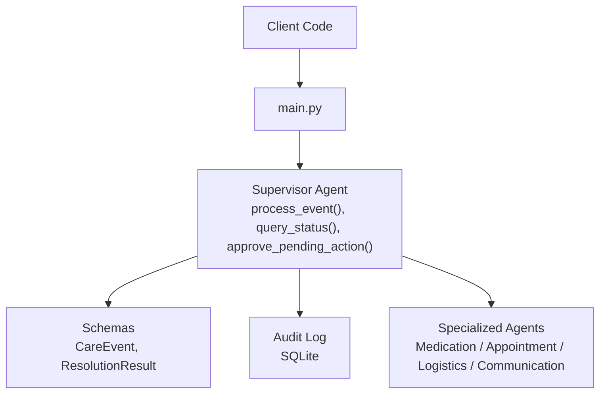
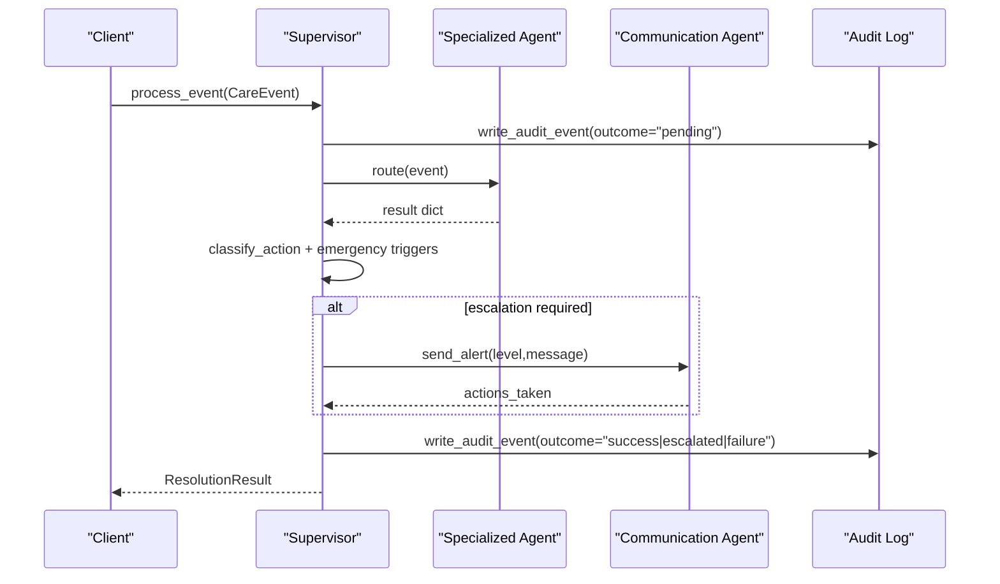
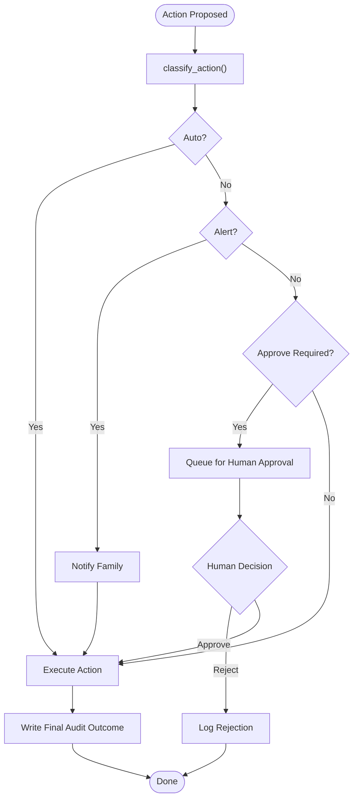
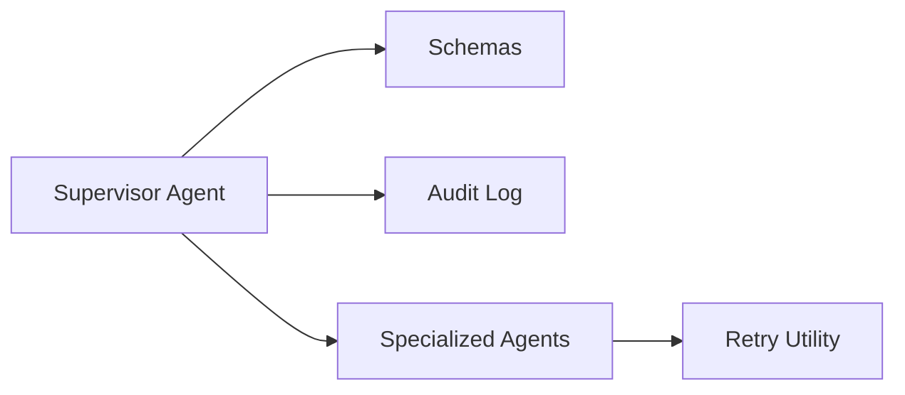

# API Reference

<cite>
**Referenced Files in This Document**
- [main.py](file://main.py)
- [supervisor_agent.py](file://src/agents/supervisor_agent.py)
- [schemas.py](file://src/models/schemas.py)
- [audit_log.py](file://src/models/audit_log.py)
- [escalation_logic.py](file://src/models/escalation_logic.py)
- [communication_tools.py](file://src/tools/communication_tools.py)
- [retry.py](file://src/tools/retry.py)
- [architecture.md](file://architecture.md)
- [AGENTS.md](file://AGENTS.md)
</cite>

## Table of Contents
1. [Introduction](#introduction)
2. [Project Structure](#project-structure)
3. [Core Components](#core-components)
4. [Architecture Overview](#architecture-overview)
5. [Detailed Component Analysis](#detailed-component-analysis)
6. [Dependency Analysis](#dependency-analysis)
7. [Performance Considerations](#performance-considerations)
8. [Troubleshooting Guide](#troubleshooting-guide)
9. [Conclusion](#conclusion)
10. [Appendices](#appendices)

## Introduction
This document describes CareBridge’s public programmatic interfaces for system interaction. It focuses on three core entry points:
- process_event(): handles incoming care events and routes them to specialized agents.
- query_status(): answers caregiver questions about a care recipient’s current status.
- approve_pending_action(): resolves human-required approvals or rejections for pending actions.

It also documents the data models used at the boundaries (CareEvent, ResolutionResult), error handling patterns, authentication and authorization requirements, rate limiting considerations, versioning strategy, and client implementation guidelines with Python usage examples.

## Project Structure
CareBridge exposes its public APIs through the Supervisor Agent module. The main entry point initializes logging, fixtures, audit storage, and orchestrates demo scenarios that call the public functions. Data contracts are defined as Pydantic models in the schemas module. An immutable SQLite audit trail records every action before execution.

**Diagram sources**
- [main.py:1-182](file://main.py#L1-L182)
- [supervisor_agent.py:285-430](file://src/agents/supervisor_agent.py#L285-L430)
- [schemas.py:56-71](file://src/models/schemas.py#L56-L71)
- [audit_log.py:19-167](file://src/models/audit_log.py#L19-L167)

**Section sources**
- [main.py:1-182](file://main.py#L1-L182)
- [supervisor_agent.py:1-641](file://src/agents/supervisor_agent.py#L1-L641)
- [schemas.py:1-150](file://src/models/schemas.py#L1-L150)
- [audit_log.py:1-167](file://src/models/audit_log.py#L1-L167)

## Core Components
The public API surface is implemented in the Supervisor Agent and uses shared models from the schemas module.

- process_event(event: CareEvent) -> ResolutionResult
  - Routes an event to the appropriate specialized agent (medication, appointment, logistics, communication).
  - Writes an audit event before routing and another after completion.
  - Applies deterministic escalation logic; may notify family via the Communication Agent when required.
  - Returns a structured ResolutionResult summarizing actions and escalation status.

- query_status(care_recipient_id: str, question: str) -> str
  - Reads recent audit events and pending actions to synthesize a natural-language status summary.
  - Records exactly one audit event for the query.
  - Returns a plain text summary string.

- approve_pending_action(action_id: str, approved: bool) -> None
  - Validates that the referenced audit event exists and is still pending.
  - Logs the human decision (approve or reject) in the audit trail.
  - If approved, re-dispatches to the owning agent for execution; if rejected, no further action occurs.
  - Raises ValueError for invalid or already-resolved actions.

Data models at the boundary:
- CareEvent: identifies the event type, care recipient, payload, and timestamp.
- ResolutionResult: indicates whether resolved, lists actions taken, escalation flags, and audit IDs.

**Section sources**
- [supervisor_agent.py:285-430](file://src/agents/supervisor_agent.py#L285-L430)
- [supervisor_agent.py:432-593](file://src/agents/supervisor_agent.py#L432-L593)
- [schemas.py:56-71](file://src/models/schemas.py#L56-L71)

## Architecture Overview
CareBridge follows an “audit-first” pattern: every action is recorded before it executes. The Supervisor orchestrates routing to specialized agents, applies deterministic escalation rules, and ensures failures are never silent.

**Diagram sources**
- [supervisor_agent.py:285-395](file://src/agents/supervisor_agent.py#L285-L395)
- [audit_log.py:81-130](file://src/models/audit_log.py#L81-L130)
- [escalation_logic.py:42-71](file://src/models/escalation_logic.py#L42-L71)

## Detailed Component Analysis

### Public API: process_event()
- Purpose: Process a care event by routing to the correct agent and returning a structured resolution.
- Input:
  - event: CareEvent
    - event_type: Literal["refill_low", "appointment_upcoming", "delivery_failed", "adherence_deviation"]
    - care_recipient_id: str
    - payload: dict (event-specific fields)
    - received_at: datetime (auto-filled)
- Output:
  - ResolutionResult
    - event_id: UUID
    - resolved: bool
    - actions_taken: list[str]
    - escalation_required: bool
    - escalation_level: Optional["info" | "alert" | "emergency"]
    - audit_event_ids: list[UUID]
- Error conditions:
  - Routing exceptions are caught and returned as a non-resolved ResolutionResult with error details in actions_taken.
  - Family alert dispatch failures are logged and surfaced in actions_taken without failing the whole operation.
- Escalation behavior:
  - Deterministic classification based on executed actions and hard-coded emergency triggers.
  - When escalation is required, the Communication Agent is invoked to notify family per policy.

Request example (Python):
- Construct a CareEvent with event_type, care_recipient_id, and payload.
- Await process_event(event).
- Inspect ResolutionResult.resolved, actions_taken, and escalation flags.

Response example (Python):
- Use ResolutionResult fields to determine next steps (e.g., check escalation_required and escalation_level).

**Section sources**
- [supervisor_agent.py:285-395](file://src/agents/supervisor_agent.py#L285-L395)
- [schemas.py:56-71](file://src/models/schemas.py#L56-L71)

### Public API: query_status()
- Purpose: Provide a synthesized natural-language status for a care recipient.
- Input:
  - care_recipient_id: str
  - question: str (natural language query)
- Output:
  - str: summary_text derived from recent audit events and pending actions.
- Behavior:
  - Calls synthesize_status(care_recipient_id) to build a StatusSummary and returns its summary_text.
  - Records a single audit event for the query.

Request example (Python):
- Call await query_status(care_recipient_id, question).
- Print or display the returned string.

Response example (Python):
- The function returns a plain string suitable for UI display or logs.

**Section sources**
- [supervisor_agent.py:398-429](file://src/agents/supervisor_agent.py#L398-L429)
- [communication_tools.py:160-191](file://src/tools/communication_tools.py#L160-L191)

### Public API: approve_pending_action()
- Purpose: Resolve a pending action requiring human approval.
- Input:
  - action_id: str (the audit event_id of a pending action)
  - approved: bool
- Output:
  - None
- Error conditions:
  - Raises ValueError if the action_id is not found or not in "pending" state, or if already resolved.
- Behavior:
  - Rejection: writes a rejection audit event and does nothing else.
  - Approval: writes an approval audit event, then re-dispatches to the owning agent using a mapped event_type and payload including authorization_ref. Execution results are audited.

Request example (Python):
- Retrieve a pending action_id from the audit log.
- Call await approve_pending_action(action_id, approved=True/False).

Response example (Python):
- No return value; inspect audit log entries to confirm outcome.

**Section sources**
- [supervisor_agent.py:432-593](file://src/agents/supervisor_agent.py#L432-L593)
- [audit_log.py:81-130](file://src/models/audit_log.py#L81-L130)

### Data Models: CareEvent and ResolutionResult
- CareEvent
  - Fields: event_id (UUID), event_type (Literal enum), care_recipient_id (str), payload (dict), received_at (datetime).
  - Used as the canonical input for all care events.
- ResolutionResult
  - Fields: event_id (UUID), resolved (bool), actions_taken (list[str]), escalation_required (bool), escalation_level (Optional Literal), audit_event_ids (list[UUID]).
  - Used as the canonical output for event processing.

Usage notes:
- All structured data exchanged between components must use these Pydantic models.
- Event payloads vary by event_type but should include only necessary identifiers and context.

**Section sources**
- [schemas.py:56-71](file://src/models/schemas.py#L56-L71)

### Escalation Logic and Human Approval Workflow
- Classification:
  - Actions are classified deterministically into auto, alert, or approve categories.
  - Emergency triggers force escalation to at least alert level.
- Human approval:
  - Certain actions require explicit human approval before execution.
  - Approved actions are re-routed to the owning agent with authorization references.

**Diagram sources**
- [escalation_logic.py:42-71](file://src/models/escalation_logic.py#L42-L71)
- [supervisor_agent.py:178-234](file://src/agents/supervisor_agent.py#L178-L234)
- [supervisor_agent.py:432-593](file://src/agents/supervisor_agent.py#L432-L593)

**Section sources**
- [escalation_logic.py:1-71](file://src/models/escalation_logic.py#L1-L71)
- [supervisor_agent.py:178-234](file://src/agents/supervisor_agent.py#L178-L234)

## Dependency Analysis
CareBridge’s public API depends on:
- Shared schemas for input/output contracts.
- Audit log for immutability and traceability.
- Specialized agents for domain operations.
- Retry utilities for resilient external calls.

**Diagram sources**
- [supervisor_agent.py:21-39](file://src/agents/supervisor_agent.py#L21-L39)
- [retry.py:22-69](file://src/tools/retry.py#L22-L69)

**Section sources**
- [supervisor_agent.py:1-641](file://src/agents/supervisor_agent.py#L1-L641)
- [retry.py:1-69](file://src/tools/retry.py#L1-L69)

## Performance Considerations
- Retry strategy: External calls use a shared retry utility with exponential backoff (1s, 2s, 4s) and up to 3 attempts.
- Audit overhead: Every action writes to an immutable SQLite database; ensure adequate disk I/O capacity and consider connection reuse in high-throughput deployments.
- Escalation path: When escalation is required, additional Communication Agent calls occur; monitor downstream messaging latency.
- Concurrency: Asynchronous functions allow concurrent event processing; ensure underlying resources (DB, external APIs) can handle concurrency.

[No sources needed since this section provides general guidance]

## Troubleshooting Guide
Common issues and how to diagnose them:
- Validation errors:
  - Ensure CareEvent.event_type matches allowed literals and payload contains required fields for the specific event.
- Pending action not found:
  - approve_pending_action raises ValueError if the action_id is missing or not in "pending". Verify the audit log for the correct event_id and outcome.
- Already resolved action:
  - Approving an action twice raises ValueError. Check internal tracking of resolved action IDs.
- Routing failure:
  - process_event catches routing exceptions and returns a non-resolved ResolutionResult with error details in actions_taken. Inspect logs and audit events for root cause.
- Family alert dispatch failure:
  - Failures are logged and surfaced in actions_taken; investigate Communication Agent and messaging integrations.

Error handling patterns:
- Audit-before-action ensures every attempt is recorded even on failure.
- Unknown actions default to requiring approval for safety.
- External integration failures trigger retries and escalation per policy.

**Section sources**
- [supervisor_agent.py:318-339](file://src/agents/supervisor_agent.py#L318-L339)
- [supervisor_agent.py:450-461](file://src/agents/supervisor_agent.py#L450-L461)
- [escalation_logic.py:42-71](file://src/models/escalation_logic.py#L42-L71)
- [audit_log.py:81-130](file://src/models/audit_log.py#L81-L130)

## Conclusion
CareBridge’s public API centers on three robust, auditable functions:
- process_event() for event-driven care coordination,
- query_status() for read-only caregiver Q&A,
- approve_pending_action() for human-in-the-loop workflows.

All interactions are backed by strict schema validation, deterministic escalation logic, and an immutable audit trail. Clients should construct CareEvent inputs carefully, handle ResolutionResult outputs, and implement retry and escalation-aware flows.

[No sources needed since this section summarizes without analyzing specific files]

## Appendices

### Authentication and Authorization
- JWT authentication is required for caregiver-facing API endpoints.
- Tool whitelisting restricts each agent to declared tools.
- Sensitive operations (category "approve") require explicit authorization references.
- PII is excluded from logs; audit entries reference IDs only.

**Section sources**
- [AGENTS.md:167-177](file://AGENTS.md#L167-L177)
- [architecture.md:373-397](file://architecture.md#L373-L397)

### Rate Limiting Considerations
- The codebase implements retry with exponential backoff for external calls.
- No built-in request throttling is present at the API layer; clients should implement rate limiting at their edge (e.g., API gateway) to protect downstream services.
- Monitor audit log write throughput and external API quotas.

[No sources needed since this section provides general guidance]

### Versioning Strategy and Backwards Compatibility
- The project metadata includes a version identifier in architecture documentation.
- Public contracts rely on Pydantic models; adding optional fields preserves compatibility, while changing required fields or enums breaks compatibility.
- Event types and action classifications are constrained to Literals; new values require careful migration and testing.

**Section sources**
- [architecture.md:1-6](file://architecture.md#L1-L6)
- [schemas.py:56-71](file://src/models/schemas.py#L56-L71)
- [escalation_logic.py:13-39](file://src/models/escalation_logic.py#L13-L39)

### Client Implementation Guidelines (Python)
Recommended patterns:
- Initialize dependencies:
  - Ensure audit DB is initialized before calling any API.
- Build CareEvent:
  - Use CareEvent with appropriate event_type and payload.
- Handle responses:
  - For process_event(), inspect ResolutionResult fields and escalate if needed.
  - For query_status(), display the returned summary string.
  - For approve_pending_action(), validate action_id and handle ValueError.
- Implement retries:
  - Wrap external calls with the provided retry utility where applicable.
- Observe audit trail:
  - Query audit events to track outcomes and correlation IDs.

Example usage outline:
- Import CareEvent and supervisor functions.
- Create a CareEvent instance.
- Call process_event(event) asynchronously.
- Read ResolutionResult and act accordingly.
- For status queries, call query_status(care_recipient_id, question).
- For approvals, call approve_pending_action(action_id, approved=True/False).

**Section sources**
- [main.py:92-141](file://main.py#L92-L141)
- [supervisor_agent.py:285-430](file://src/agents/supervisor_agent.py#L285-L430)
- [retry.py:22-69](file://src/tools/retry.py#L22-L69)