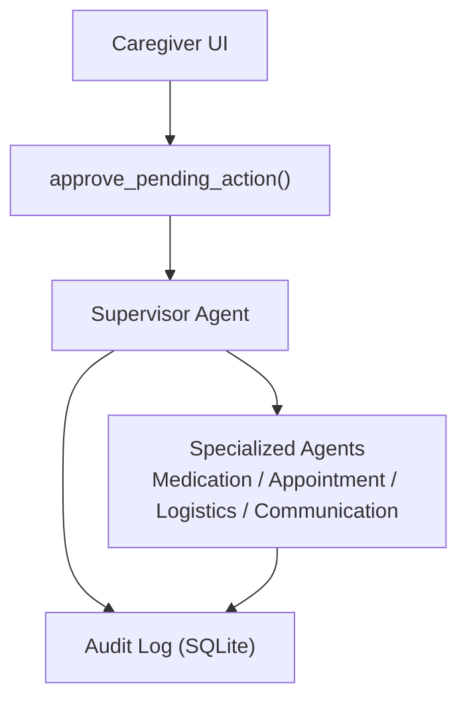
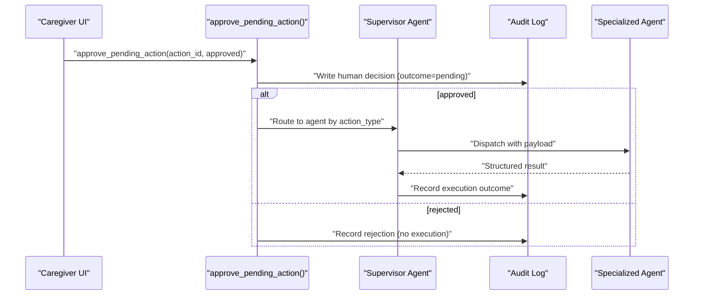
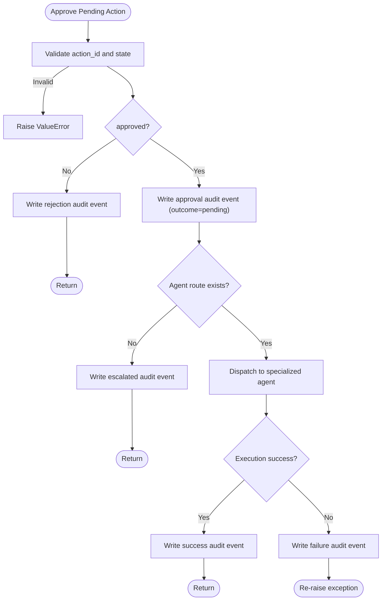
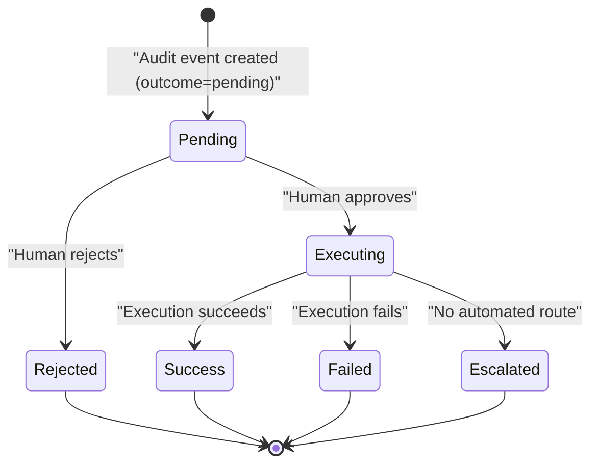
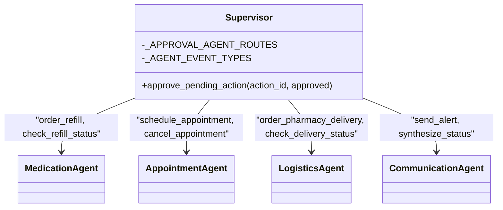
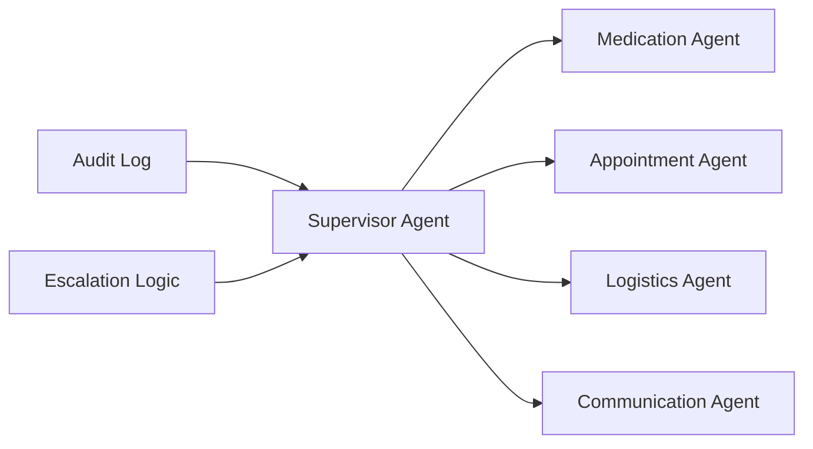

# Approval Workflow API

<cite>
**Referenced Files in This Document**
- [supervisor_agent.py](file://src/agents/supervisor_agent.py)
- [audit_log.py](file://src/models/audit_log.py)
- [schemas.py](file://src/models/schemas.py)
- [escalation_logic.py](file://src/models/escalation_logic.py)
- [test_approval_flow.py](file://tests/integration/test_approval_flow.py)
- [test_supervisor.py](file://tests/test_supervisor.py)
- [main.py](file://main.py)
</cite>

## Table of Contents
1. [Introduction](#introduction)
2. [Project Structure](#project-structure)
3. [Core Components](#core-components)
4. [Architecture Overview](#architecture-overview)
5. [Detailed Component Analysis](#detailed-component-analysis)
6. [Dependency Analysis](#dependency-analysis)
7. [Performance Considerations](#performance-considerations)
8. [Troubleshooting Guide](#troubleshooting-guide)
9. [Conclusion](#conclusion)
10. [Appendices](#appendices)

## Introduction
This document provides comprehensive API documentation for CareBridge’s human approval workflow, centered on the approve_pending_action() function. It explains how actions become pending via the audit trail system, how human decisions are recorded and enforced, and how approved actions are routed to specialized agents (medication, appointment, logistics, communication). It also covers error conditions, audit trail integration, security considerations, and practical examples for building caregiver approval interfaces.

## Project Structure
CareBridge implements a deterministic supervisor that orchestrates specialized agents and enforces an immutable audit trail. The approval workflow integrates with this architecture:
- Supervisor agent routes events and manages approvals.
- Audit log stores immutable events with strict schema and triggers.
- Schemas define shared models including PendingAction and audit event structures.
- Escalation logic classifies actions into autonomous, alert, or approval categories deterministically.

**Diagram sources**
- [supervisor_agent.py:432-592](file://src/agents/supervisor_agent.py#L432-L592)
- [audit_log.py:19-130](file://src/models/audit_log.py#L19-L130)

**Section sources**
- [main.py:143-182](file://main.py#L143-L182)
- [supervisor_agent.py:1-15](file://src/agents/supervisor_agent.py#L1-L15)

## Core Components
- approve_pending_action(action_id: str, approved: bool) -> None
  - Validates the pending action exists and is unresolved.
  - Records the human decision in the audit trail (actor="human").
  - If approved, routes execution to the appropriate specialized agent; if rejected, logs rejection without execution.
  - Raises ValueError for invalid or already resolved actions.

Key data models involved:
- PendingAction: represents a pending request with fields like action_id, action_type, care_recipient_id, rationale, requested_at, status, authorization_ref.
- AuditEvent: immutable record of every action with actor, action_type, outcome, correlation_id, and optional authorization_ref.

Error handling:
- Already resolved actions raise ValueError.
- Missing or non-pending action IDs raise ValueError.
- Execution failures are captured in the audit trail and re-raised to callers.

**Section sources**
- [supervisor_agent.py:432-592](file://src/agents/supervisor_agent.py#L432-L592)
- [schemas.py:132-140](file://src/models/schemas.py#L132-L140)
- [audit_log.py:81-130](file://src/models/audit_log.py#L81-L130)

## Architecture Overview
The approval workflow follows an “audit-first” pattern:
1. A pending action appears in the audit trail with outcome="pending".
2. Human reviews and calls approve_pending_action().
3. The decision is recorded as an audit event before any execution.
4. Approved actions are routed to the correct agent based on action type.
5. Execution results are recorded with success/failure/escalated outcomes.

**Diagram sources**
- [supervisor_agent.py:432-592](file://src/agents/supervisor_agent.py#L432-L592)
- [audit_log.py:81-130](file://src/models/audit_log.py#L81-L130)

## Detailed Component Analysis

### approve_pending_action() API
- Purpose: Approve or reject a pending action identified by action_id.
- Parameters:
  - action_id: The audit event_id of a pending entry. Must exist and have outcome="pending".
  - approved: Boolean decision. True to execute, False to reject.
- Behavior:
  - Reject path: Writes a rejection audit event (actor="human", outcome="success") and returns immediately.
  - Approve path:
    - Writes an approval audit event (actor="human", outcome="pending") before execution.
    - Routes to the specialized agent using _APPROVAL_AGENT_ROUTES mapping.
    - If no route exists, escalates for manual handling (outcome="escalated").
    - Executes via the appropriate agent handler and records final outcome (success/failure).
- Error conditions:
  - ValueError if action_id is already resolved or not found/not pending.
  - Exceptions during execution are logged and re-raised; execution failure is recorded in audit trail.

**Diagram sources**
- [supervisor_agent.py:432-592](file://src/agents/supervisor_agent.py#L432-L592)

**Section sources**
- [supervisor_agent.py:432-592](file://src/agents/supervisor_agent.py#L432-L592)

### Pending Action Lifecycle
Actions become pending through the audit trail system:
- Before executing certain actions, the supervisor writes an audit event with outcome="pending".
- These entries represent requests requiring human review when classified as requiring approval.
- The lifecycle includes creation (pending), human decision (approve/reject), and execution (if approved).

**Diagram sources**
- [audit_log.py:19-130](file://src/models/audit_log.py#L19-L130)
- [supervisor_agent.py:432-592](file://src/agents/supervisor_agent.py#L432-L592)

**Section sources**
- [audit_log.py:19-130](file://src/models/audit_log.py#L19-L130)
- [supervisor_agent.py:285-395](file://src/agents/supervisor_agent.py#L285-L395)

### Agent Routing Mechanism
Approved actions are routed to specialized agents based on action types:
- Medication Agent: check_refill_status, order_refill, detect_adherence_pattern, change_medication_schedule.
- Appointment Agent: get_calendar, schedule_appointment, cancel_appointment, send_prep_checklist, add_service_provider.
- Logistics Agent: check_delivery_status, order_grocery, order_pharmacy_delivery.
- Communication Agent: send_alert, synthesize_status, send_daily_digest.

Routing uses internal mappings:
- _APPROVAL_AGENT_ROUTES maps action_type to agent name.
- _AGENT_EVENT_TYPES maps agent name to CareEvent.event_type used for redelivery.

**Diagram sources**
- [supervisor_agent.py:70-104](file://src/agents/supervisor_agent.py#L70-L104)
- [supervisor_agent.py:508-555](file://src/agents/supervisor_agent.py#L508-L555)

**Section sources**
- [supervisor_agent.py:70-104](file://src/agents/supervisor_agent.py#L70-L104)
- [supervisor_agent.py:508-555](file://src/agents/supervisor_agent.py#L508-L555)

### Complete Approval Workflow Examples
End-to-end flows demonstrate identification, approval, and execution:

1. Create a pending action in the audit trail (e.g., order_refill).
2. Call approve_pending_action(action_id, approved=True).
3. Verify audit trail contains approval and execution events with authorization_ref linking back to the original action.

For rejection:
1. Create a pending action (e.g., cancel_appointment).
2. Call approve_pending_action(action_id, approved=False).
3. Verify audit trail contains rejection event without execution.

These flows are validated in integration tests.

**Section sources**
- [test_approval_flow.py:15-56](file://tests/integration/test_approval_flow.py#L15-L56)
- [test_approval_flow.py:58-95](file://tests/integration/test_approval_flow.py#L58-L95)
- [test_supervisor.py:140-170](file://tests/test_supervisor.py#L140-L170)

## Dependency Analysis
The approval workflow depends on:
- Audit log for immutable recording of decisions and outcomes.
- Escalation logic for deterministic classification of actions.
- Specialized agents for execution of approved actions.
- Supervisor for orchestration and routing.

**Diagram sources**
- [audit_log.py:19-130](file://src/models/audit_log.py#L19-L130)
- [escalation_logic.py:13-71](file://src/models/escalation_logic.py#L13-L71)
- [supervisor_agent.py:285-395](file://src/agents/supervisor_agent.py#L285-L395)

**Section sources**
- [escalation_logic.py:13-71](file://src/models/escalation_logic.py#L13-L71)
- [supervisor_agent.py:285-395](file://src/agents/supervisor_agent.py#L285-L395)

## Performance Considerations
- Audit log operations are append-only with SQLite triggers ensuring immutability.
- Retry utilities provide exponential backoff for external API calls within agents.
- Deterministic escalation avoids LLM overhead for safety-critical decisions.
- Single-process orchestration simplifies concurrency but may limit scalability.

[No sources needed since this section provides general guidance]

## Troubleshooting Guide
Common issues and resolutions:
- Already resolved action: Calling approve_pending_action() with an action_id that has been processed raises ValueError. Ensure the action is still pending.
- Invalid action ID: If the action_id does not exist or is not in "pending" state, a ValueError is raised. Verify the audit trail for valid pending entries.
- Missing automated routes: If no route exists for an approved action, it is escalated for manual handling. Check _APPROVAL_AGENT_ROUTES and add mappings as needed.
- Execution failures: Failures are recorded in the audit trail and exceptions are raised. Inspect the audit event rationale for details.

Security considerations:
- All decisions are recorded in an immutable audit trail with actor="human" for accountability.
- Authorization references link approval decisions to subsequent executions.
- Escalation logic prevents unauthorized autonomous execution of sensitive actions.

Guidelines for implementing approval interfaces:
- Present pending actions from the audit trail to caregivers for review.
- Provide clear rationales and context for each action.
- Enforce role-based access to approval functions.
- Log all approval attempts and decisions in the audit trail.

**Section sources**
- [supervisor_agent.py:450-461](file://src/agents/supervisor_agent.py#L450-L461)
- [supervisor_agent.py:508-527](file://src/agents/supervisor_agent.py#L508-L527)
- [audit_log.py:19-130](file://src/models/audit_log.py#L19-L130)

## Conclusion
CareBridge’s approval workflow ensures safe, auditable execution of critical actions through human oversight. The approve_pending_action() function integrates seamlessly with the audit trail and specialized agents, providing robust error handling and deterministic routing. By following the documented patterns and guidelines, caregiver applications can implement secure and reliable approval interfaces.

[No sources needed since this section summarizes without analyzing specific files]

## Appendices

### API Reference: approve_pending_action()
- Function: approve_pending_action(action_id: str, approved: bool) -> None
- Parameters:
  - action_id: Audit event_id of a pending action.
  - approved: Boolean to approve or reject.
- Returns: None
- Raises:
  - ValueError: If action_id is invalid or already resolved.
- Side Effects:
  - Writes audit events for decisions and execution outcomes.
  - Routes approved actions to specialized agents.

**Section sources**
- [supervisor_agent.py:432-592](file://src/agents/supervisor_agent.py#L432-L592)

### Data Models
- PendingAction: Represents a pending request with fields for tracking and authorization.
- AuditEvent: Immutable record of actions with actor, action_type, outcome, correlation_id, and authorization_ref.

**Section sources**
- [schemas.py:44-54](file://src/models/schemas.py#L44-L54)
- [schemas.py:132-140](file://src/models/schemas.py#L132-L140)