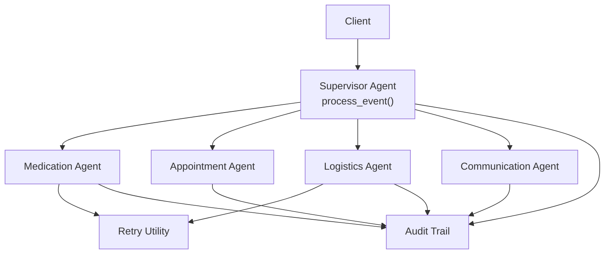
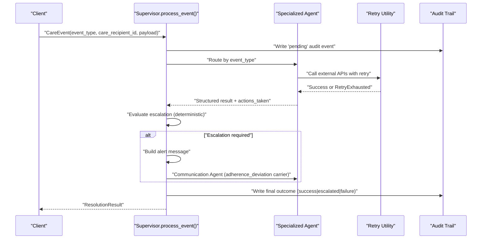
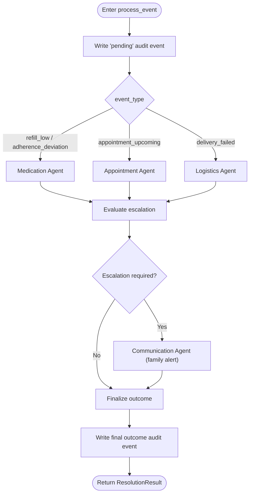
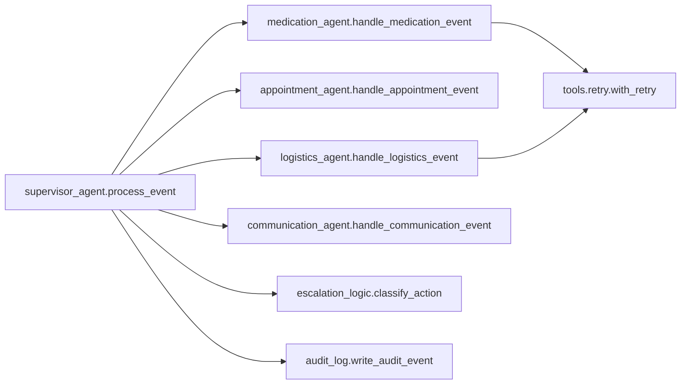

# Event Processing API

<cite>
**Referenced Files in This Document**
- [main.py](file://main.py)
- [src/agents/supervisor_agent.py](file://src/agents/supervisor_agent.py)
- [src/models/schemas.py](file://src/models/schemas.py)
- [src/models/escalation_logic.py](file://src/models/escalation_logic.py)
- [src/tools/retry.py](file://src/tools/retry.py)
- [src/agents/medication_agent.py](file://src/agents/medication_agent.py)
- [src/agents/logistics_agent.py](file://src/agents/logistics_agent.py)
- [tests/test_supervisor.py](file://tests/test_supervisor.py)
- [fixtures/medications.json](file://fixtures/medications.json)
- [fixtures/appointments.json](file://fixtures/appointments.json)
</cite>

## Table of Contents
1. [Introduction](#introduction)
2. [Project Structure](#project-structure)
3. [Core Components](#core-components)
4. [Architecture Overview](#architecture-overview)
5. [Detailed Component Analysis](#detailed-component-analysis)
6. [Dependency Analysis](#dependency-analysis)
7. [Performance Considerations](#performance-considerations)
8. [Troubleshooting Guide](#troubleshooting-guide)
9. [Conclusion](#conclusion)

## Introduction
This document provides comprehensive API documentation for CareBridge’s event processing interface centered on the process_event() function. It explains how care events are validated, routed to specialized agents, escalated deterministically, and recorded in an immutable audit trail. It also details the CareEvent structure, payload requirements per event type, expected inputs, asynchronous processing patterns, error handling, retry strategies, and monitoring approaches for high-volume scenarios.

## Project Structure
CareBridge implements a supervisor-driven architecture where a single entry point (process_event) routes incoming CareEvent instances to domain-specific agents (Medication, Appointment, Logistics, Communication). The system enforces deterministic escalation rules and writes an immutable audit trail around every action.

**Diagram sources**
- [src/agents/supervisor_agent.py:285-395](file://src/agents/supervisor_agent.py#L285-L395)
- [src/agents/medication_agent.py:23-134](file://src/agents/medication_agent.py#L23-L134)
- [src/agents/logistics_agent.py:201-235](file://src/agents/logistics_agent.py#L201-L235)
- [src/tools/retry.py:22-69](file://src/tools/retry.py#L22-L69)

**Section sources**
- [main.py:92-140](file://main.py#L92-L140)
- [src/agents/supervisor_agent.py:285-395](file://src/agents/supervisor_agent.py#L285-L395)

## Core Components
- CareEvent: The canonical input event with fields event_id, event_type, care_recipient_id, payload, received_at.
- ResolutionResult: The canonical output with fields event_id, resolved, actions_taken, escalation_required, escalation_level, audit_event_ids.
- Deterministic Escalation: classify_action() maps executed actions to auto/alert/approve categories; emergency triggers force escalation.
- Retry Strategy: with_retry() wraps external calls with exponential backoff and raises RetryExhausted when all attempts fail.

Key data models and their constraints:
- CareEvent.event_type is restricted to refill_low, appointment_upcoming, delivery_failed, adherence_deviation.
- ResolutionResult.escalation_level is one of info, alert, emergency or None.

**Section sources**
- [src/models/schemas.py:56-70](file://src/models/schemas.py#L56-L70)
- [src/models/escalation_logic.py:42-70](file://src/models/escalation_logic.py#L42-L70)
- [src/tools/retry.py:22-69](file://src/tools/retry.py#L22-L69)

## Architecture Overview
The process_event() function follows an audit-first pattern: it records a pending audit event before routing, then executes agent logic, evaluates escalation deterministically, optionally invokes the Communication Agent for family alerts, and finally records a follow-up audit event with the outcome.

**Diagram sources**
- [src/agents/supervisor_agent.py:285-395](file://src/agents/supervisor_agent.py#L285-L395)
- [src/tools/retry.py:22-69](file://src/tools/retry.py#L22-L69)

## Detailed Component Analysis

### process_event() API
- Purpose: Route and resolve a CareEvent through specialized agents, apply deterministic escalation, notify via Communication Agent if needed, and record audit events.
- Input: CareEvent instance.
- Output: ResolutionResult instance.
- Behavior highlights:
  - Writes a “pending” audit event before any work.
  - Routes based on event_type to Medication, Appointment, or Logistics agents.
  - Evaluates escalation using classify_action() and agent-provided flags.
  - If escalation is required, constructs a communication event and sends a family alert.
  - Records a final audit event with success, escalated, or failure outcome.
  - Returns ResolutionResult containing actions_taken, escalation_required, escalation_level, and audit_event_ids.

**Diagram sources**
- [src/agents/supervisor_agent.py:285-395](file://src/agents/supervisor_agent.py#L285-L395)

**Section sources**
- [src/agents/supervisor_agent.py:285-395](file://src/agents/supervisor_agent.py#L285-L395)

### CareEvent structure and payload specifications
- Fields:
  - event_id: UUID (auto-generated).
  - event_type: Literal values: refill_low, appointment_upcoming, delivery_failed, adherence_deviation.
  - care_recipient_id: String identifier for the care recipient.
  - payload: Dict whose contents depend on event_type.
  - received_at: Timestamp (auto-generated).

Payload requirements by event_type:
- refill_low:
  - Required: medication_id (string).
  - Optional: days_remaining (integer), trigger (string) for emergency triggers such as fall_detection, emergency_room_visit, critical_medication_interaction.
- appointment_upcoming:
  - Required: none (agent uses internal calendar lookup).
  - Optional: appointment_id (string) to target a specific appointment.
- delivery_failed:
  - Required: delivery_id (string).
  - Optional: failure_reason (string), trigger (string) for emergency triggers.
- adherence_deviation:
  - Used internally to carry escalation messages to the Communication Agent.
  - Payload typically includes level (info|alert|emergency) and message (string).

Validation notes:
- event_type must be one of the four allowed literals.
- care_recipient_id must be a non-empty string.
- Payload keys vary by event_type; missing required keys lead to agent-level errors and are captured in actions_taken.

Examples (JSON-like):
- Refill low:
  - {"event_type": "refill_low", "care_recipient_id": "cr-001", "payload": {"medication_id": "med-001", "days_remaining": 3}}
- Appointment upcoming:
  - {"event_type": "appointment_upcoming", "care_recipient_id": "cr-001", "payload": {"appointment_id": "apt-001"}}
- Delivery failed:
  - {"event_type": "delivery_failed", "care_recipient_id": "cr-001", "payload": {"delivery_id": "del-003", "failure_reason": "Address not accessible"}}
- Adherence deviation (internal escalation carrier):
  - {"event_type": "adherence_deviation", "care_recipient_id": "cr-001", "payload": {"level": "alert", "message": "Family alert text"}}

**Section sources**
- [src/models/schemas.py:56-61](file://src/models/schemas.py#L56-L61)
- [src/agents/supervisor_agent.py:94-104](file://src/agents/supervisor_agent.py#L94-L104)
- [src/agents/medication_agent.py:30-51](file://src/agents/medication_agent.py#L30-L51)
- [src/agents/logistics_agent.py:201-215](file://src/agents/logistics_agent.py#L201-L215)
- [main.py:105-133](file://main.py#L105-L133)

### ResolutionResult return structure
- Fields:
  - event_id: UUID of the processed event.
  - resolved: Boolean indicating whether the event was successfully handled.
  - actions_taken: Array of strings describing each action performed.
  - escalation_required: Boolean indicating if escalation occurred.
  - escalation_level: One of info, alert, emergency or None.
  - audit_event_ids: List of UUIDs referencing audit entries created during processing.

Usage:
- Inspect actions_taken to understand what happened.
- Use escalation_required and escalation_level to determine if human review or family notification is needed.
- Use audit_event_ids to correlate with audit trail entries for compliance and debugging.

**Section sources**
- [src/models/schemas.py:64-70](file://src/models/schemas.py#L64-L70)
- [src/agents/supervisor_agent.py:388-395](file://src/agents/supervisor_agent.py#L388-L395)

### Asynchronous processing pattern
- process_event() is async and returns a coroutine that resolves to ResolutionResult.
- Agents may perform async I/O (e.g., external pharmacy or logistics APIs) and use with_retry() for resilience.
- Typical usage:
  - Create a CareEvent instance.
  - Await process_event(event).
  - Handle ResolutionResult fields accordingly.

Error handling:
- Routing failures produce a ResolutionResult with resolved=False and an error in actions_taken.
- External call failures are wrapped by with_retry(); after exhausting retries, RetryExhausted is raised and caught upstream to ensure the pipeline remains robust and escalates appropriately.

**Section sources**
- [src/agents/supervisor_agent.py:285-339](file://src/agents/supervisor_agent.py#L285-L339)
- [src/tools/retry.py:22-69](file://src/tools/retry.py#L22-L69)

### Deterministic escalation and audit trail
- Escalation is never decided by LLMs; it is computed from:
  - Hard-coded emergency triggers present in event.payload.trigger.
  - Classification of executed actions via classify_action().
  - Agent-reported escalation flags.
- Every process_event invocation writes at least two audit events: a “pending” start and a final outcome (success, escalated, or failure).

**Section sources**
- [src/models/escalation_logic.py:13-39](file://src/models/escalation_logic.py#L13-L39)
- [src/models/escalation_logic.py:42-70](file://src/models/escalation_logic.py#L42-L70)
- [src/agents/supervisor_agent.py:178-234](file://src/agents/supervisor_agent.py#L178-L234)
- [src/agents/supervisor_agent.py:302-311](file://src/agents/supervisor_agent.py#L302-L311)
- [src/agents/supervisor_agent.py:373-386](file://src/agents/supervisor_agent.py#L373-L386)

### End-to-end examples

#### Example 1: Medication refill low
- Input:
  - event_type: refill_low
  - care_recipient_id: cr-001
  - payload: {medication_id: med-001, days_remaining: 3}
- Flow:
  - Supervisor routes to Medication Agent.
  - Medication Agent checks refill status, may order refill with retry.
  - Escalation evaluated; if moderate/severe adherence deviation, escalation_required becomes True.
  - If escalation, Communication Agent sends family alert.
  - Final audit event written.
- Output:
  - ResolutionResult with actions_taken including refill check/order and adherence check.
  - escalation_required may be True with escalation_level set.
  - audit_event_ids contains at least two IDs.

Reference implementation usage:
- See demo construction and await in main.py.

**Section sources**
- [main.py:105-113](file://main.py#L105-L113)
- [src/agents/medication_agent.py:57-134](file://src/agents/medication_agent.py#L57-L134)
- [src/agents/supervisor_agent.py:318-395](file://src/agents/supervisor_agent.py#L318-L395)

#### Example 2: Appointment upcoming
- Input:
  - event_type: appointment_upcoming
  - care_recipient_id: cr-001
  - payload: {appointment_id: apt-001}
- Flow:
  - Supervisor routes to Appointment Agent.
  - Agent retrieves calendar and prepares reminders/checklists.
  - No escalation unless triggered by higher-level policies.
- Output:
  - ResolutionResult with actions_taken describing calendar operations.

**Section sources**
- [main.py:115-123](file://main.py#L115-L123)
- [src/agents/supervisor_agent.py:272-277](file://src/agents/supervisor_agent.py#L272-L277)

#### Example 3: Delivery failed
- Input:
  - event_type: delivery_failed
  - care_recipient_id: cr-001
  - payload: {delivery_id: del-003, failure_reason: Address not accessible}
- Flow:
  - Supervisor routes to Logistics Agent.
  - Agent processes failure and may escalate if essential delivery fails.
  - If escalation, Communication Agent notifies family.
- Output:
  - ResolutionResult with escalation_required possibly True and escalation_level set.

**Section sources**
- [main.py:125-133](file://main.py#L125-L133)
- [src/agents/logistics_agent.py:201-235](file://src/agents/logistics_agent.py#L201-L235)
- [src/agents/supervisor_agent.py:343-395](file://src/agents/supervisor_agent.py#L343-L395)

#### Example 4: Adherence deviation alert
- Input:
  - event_type: adherence_deviation
  - care_recipient_id: cr-001
  - payload: {level: alert, message: Family alert text}
- Flow:
  - Supervisor routes to Medication Agent for analysis; escalation evaluation may trigger Communication Agent.
  - Used internally to propagate escalation messages.
- Output:
  - ResolutionResult reflecting actions taken and escalation status.

**Section sources**
- [src/agents/supervisor_agent.py:94-104](file://src/agents/supervisor_agent.py#L94-L104)
- [src/agents/supervisor_agent.py:346-366](file://src/agents/supervisor_agent.py#L346-L366)

## Dependency Analysis
- process_event() depends on:
  - Specialized agents: handle_medication_event, handle_appointment_event, handle_logistics_event, handle_communication_event.
  - Escalation logic: classify_action(), EMERGENCY_TRIGGERS.
  - Audit logging: write_audit_event(), get_audit_events(), init_audit_db().
  - Retry utility: with_retry() for resilient external calls.

**Diagram sources**
- [src/agents/supervisor_agent.py:285-395](file://src/agents/supervisor_agent.py#L285-L395)
- [src/agents/medication_agent.py:23-134](file://src/agents/medication_agent.py#L23-L134)
- [src/agents/logistics_agent.py:201-235](file://src/agents/logistics_agent.py#L201-L235)
- [src/models/escalation_logic.py:42-70](file://src/models/escalation_logic.py#L42-L70)
- [src/tools/retry.py:22-69](file://src/tools/retry.py#L22-L69)

**Section sources**
- [src/agents/supervisor_agent.py:285-395](file://src/agents/supervisor_agent.py#L285-L395)

## Performance Considerations
- Asynchronous design: All event processing is async to allow concurrent handling of multiple events.
- Retry strategy: with_retry() applies exponential backoff (default base_delay=1s, doubling up to 3 attempts). This reduces transient failures without overwhelming downstream services.
- Deterministic escalation: Avoids LLM calls for safety-critical decisions, reducing latency and variability.
- Audit overhead: Each event writes at least two audit entries; ensure audit storage is optimized for high throughput.
- Rate limiting considerations:
  - The codebase does not implement explicit rate limiting in process_event(). For high-volume deployments, consider adding a token bucket or semaphore around process_event() or agent calls to throttle inbound events.
  - Use with_retry() parameters (max_attempts, base_delay) to tune retry aggressiveness under load.
- Monitoring recommendations:
  - Track metrics on ResolutionResult.resolved, escalation_required, escalation_level distributions.
  - Monitor audit_event_ids growth and query performance.
  - Instrument retry outcomes and RetryExhausted occurrences.
  - Alert on spikes in escalation levels (especially emergency).

[No sources needed since this section provides general guidance]

## Troubleshooting Guide
Common issues and resolutions:
- Missing payload fields:
  - refill_low requires medication_id; delivery_failed requires delivery_id. Missing fields cause agent-level errors captured in actions_taken.
- External service failures:
  - with_retry() will attempt multiple times; if exhausted, RetryExhausted is raised and the pipeline escalates to ensure visibility.
- Escalation unexpectedly triggered:
  - Check event.payload.trigger against EMERGENCY_TRIGGERS.
  - Review classify_action() mapping for executed actions.
- Audit trail gaps:
  - Ensure init_audit_db() is called before processing. Supervisor initializes it automatically, but verify in custom integrations.

Relevant behaviors:
- Routing failures return ResolutionResult with resolved=False and an error in actions_taken.
- Communication Agent failures are logged and surfaced in actions_taken without crashing the pipeline.

**Section sources**
- [src/agents/supervisor_agent.py:318-339](file://src/agents/supervisor_agent.py#L318-L339)
- [src/agents/supervisor_agent.py:356-366](file://src/agents/supervisor_agent.py#L356-L366)
- [src/tools/retry.py:22-69](file://src/tools/retry.py#L22-L69)
- [src/models/escalation_logic.py:42-70](file://src/models/escalation_logic.py#L42-L70)

## Conclusion
CareBridge’s process_event() provides a robust, auditable, and deterministic event processing pipeline. It validates inputs, routes to specialized agents, applies strict escalation rules, and ensures family notifications when necessary. With built-in retry logic and comprehensive audit trails, it supports reliable operation under varying conditions. For high-volume environments, add rate limiting and enhanced monitoring to complement the existing resilience mechanisms.