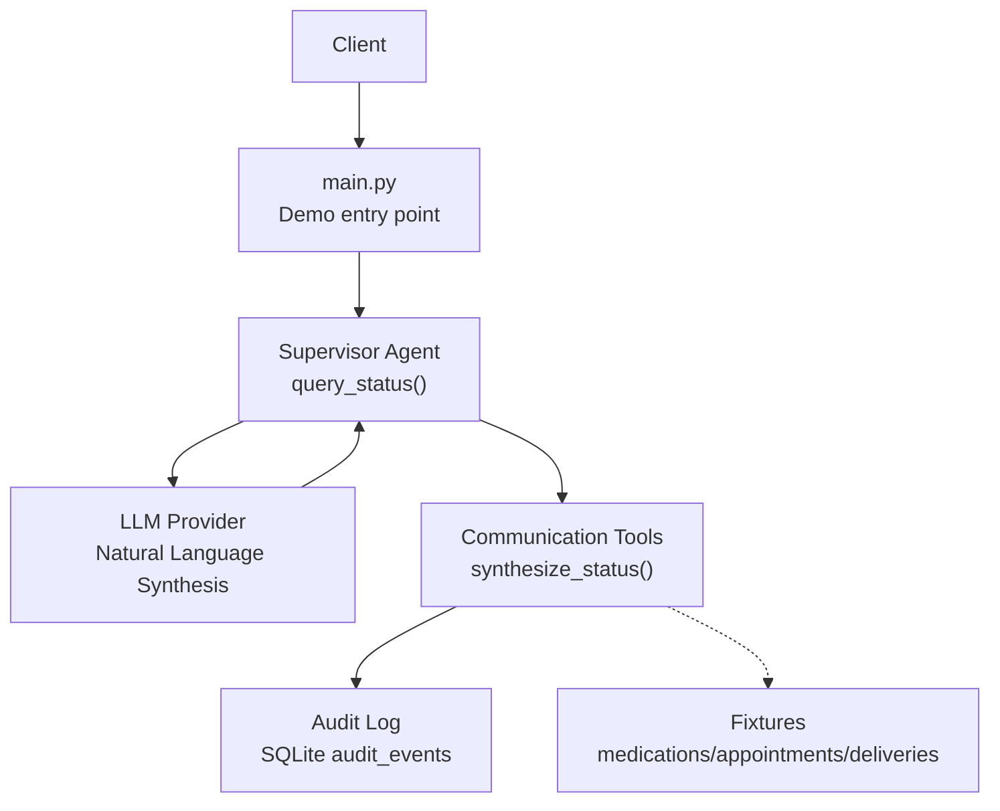
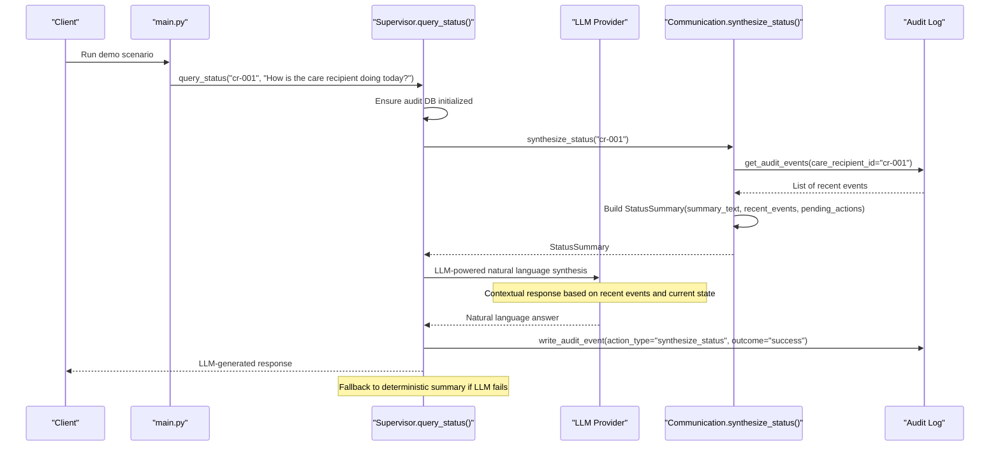
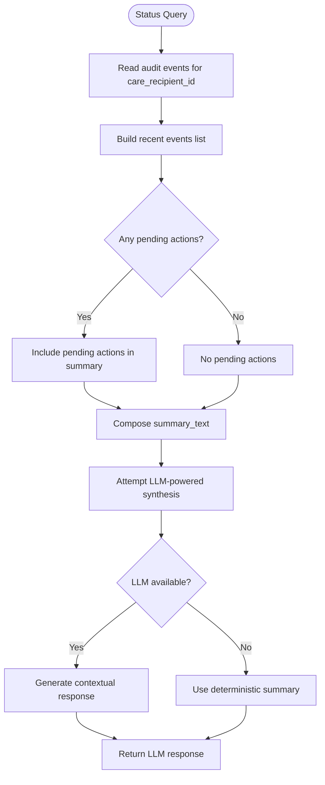
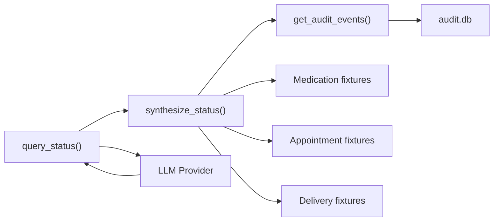

# Status Query API

<cite>
**Referenced Files in This Document**
- [main.py](file://main.py)
- [supervisor_agent.py](file://src/agents/supervisor_agent.py)
- [communication_tools.py](file://src/tools/communication_tools.py)
- [communication_agent.py](file://src/agents/communication_agent.py)
- [audit_log.py](file://src/models/audit_log.py)
- [schemas.py](file://src/models/schemas.py)
- [medications.json](file://fixtures/medications.json)
- [appointments.json](file://fixtures/appointments.json)
- [delivery_history.json](file://fixtures/delivery_history.json)
- [test_supervisor.py](file://tests/test_supervisor.py)
</cite>

## Update Summary
**Changes Made**
- Enhanced query_status() function with LLM-powered natural language synthesis
- Added contextual, conversational responses based on recent care events
- Implemented graceful fallback to deterministic summaries when LLM is unavailable
- Updated architecture diagrams to reflect the new LLM integration
- Enhanced performance considerations for LLM-powered queries

## Table of Contents
1. [Introduction](#introduction)
2. [Project Structure](#project-structure)
3. [Core Components](#core-components)
4. [Architecture Overview](#architecture-overview)
5. [Detailed Component Analysis](#detailed-component-analysis)
6. [Dependency Analysis](#dependency-analysis)
7. [Performance Considerations](#performance-considerations)
8. [Troubleshooting Guide](#troubleshooting-guide)
9. [Conclusion](#conclusion)

## Introduction
This document provides detailed API documentation for CareBridge's enhanced status query interface centered on the query_status() function. The function now features LLM-powered natural language synthesis that transforms simple audit data into contextual, conversational responses while maintaining robust fallback mechanisms to ensure reliability. It explains how natural language questions about care status are transformed into comprehensive, synthesized responses by aggregating information across medication, appointment, logistics, and communication domains via the audit trail. It also documents the underlying synthesize_status tool, its integration with the Communication Agent, response formats, practical usage examples, performance considerations, and caching strategies.

## Project Structure
CareBridge is organized around specialized agents (Medication, Appointment, Logistics, Communication) orchestrated by a Supervisor. The enhanced status query flow uses the Supervisor to route read-only queries through an LLM-powered synthesis process that converts structured audit data into natural language responses, with deterministic fallbacks ensuring system reliability.

**Diagram sources**
- [main.py:92-140](file://main.py#L92-L140)
- [supervisor_agent.py:836-932](file://src/agents/supervisor_agent.py#L836-L932)
- [communication_tools.py:160-231](file://src/tools/communication_tools.py#L160-L231)
- [audit_log.py:133-167](file://src/models/audit_log.py#L133-L167)

**Section sources**
- [main.py:92-140](file://main.py#L92-L140)
- [supervisor_agent.py:836-932](file://src/agents/supervisor_agent.py#L836-L932)

## Core Components
- **Enhanced query_status(care_recipient_id: str, question: str) -> str**
  - Purpose: Answer caregiver status queries using natural language input with LLM-powered synthesis.
  - Parameters:
    - care_recipient_id: A string identifier for the care recipient (e.g., "cr-001").
    - question: Natural language question about care status (e.g., "What medications does John need today?").
  - Behavior:
    - Ensures audit database is initialized.
    - Logs the query.
    - Calls synthesize_status(care_recipient_id) to aggregate recent activity and pending actions.
    - Attempts LLM-powered natural language synthesis with contextual awareness.
    - Falls back to deterministic summary if LLM is unavailable or fails.
    - Writes an audit event recording the query and outcome.
    - Returns a synthesized status string summarizing current care state.
  - Return: Natural-language response from LLM or deterministic summary reflecting recent events and pending actions.

- **synthesize_status(care_recipient_id: str) -> StatusSummary**
  - Purpose: Aggregate recent audit events and pending actions to build a concise status summary.
  - Behavior:
    - Reads all audit events for the care recipient from the immutable audit log.
    - Builds structured models for recent events and identifies pending actions.
    - Constructs a summary text including the count of recent events, last action details, and any pending actions awaiting resolution.
  - Return: StatusSummary containing:
    - care_recipient_id
    - summary_text
    - recent_events
    - pending_actions

- **get_care_status(care_recipient_id: str) -> StatusSummary**
  - Wrapper used by the Communication Agent to obtain a StatusSummary for daily digests or caregiver queries.

**Updated** Enhanced query_status now includes LLM-powered synthesis with graceful fallback to deterministic summaries, providing contextual, conversational responses based on recent care events and current state information.

**Section sources**
- [supervisor_agent.py:836-932](file://src/agents/supervisor_agent.py#L836-L932)
- [communication_tools.py:160-231](file://src/tools/communication_tools.py#L160-L231)
- [communication_agent.py:176-189](file://src/agents/communication_agent.py#L176-L189)
- [schemas.py:125-140](file://src/models/schemas.py#L125-L140)

## Architecture Overview
The enhanced status query follows an LLM-first pattern with deterministic fallback:

**Diagram sources**
- [main.py:135-140](file://main.py#L135-L140)
- [supervisor_agent.py:836-932](file://src/agents/supervisor_agent.py#L836-L932)
- [communication_tools.py:160-231](file://src/tools/communication_tools.py#L160-L231)
- [audit_log.py:133-167](file://src/models/audit_log.py#L133-L167)

## Detailed Component Analysis

### Enhanced query_status() Function
- Entry point for status queries with LLM-powered synthesis.
- Accepts:
  - care_recipient_id: String ID identifying the care recipient (example values in fixtures use "cr-001").
  - question: Natural language query; processed contextually by LLM for personalized responses.
- Internals:
  - Initializes audit DB if needed.
  - Logs the query.
  - Delegates synthesis to Communication tools for structured data aggregation.
  - Attempts LLM-powered natural language synthesis with contextual awareness.
  - Implements graceful fallback to deterministic summary if LLM is unavailable or fails.
  - Records an audit event with action_type "synthesize_status".
  - Returns natural language response or deterministic summary.

**Updated** The function now includes sophisticated LLM integration that creates contextual, conversational responses based on recent care events and current state information, while maintaining system reliability through deterministic fallbacks.

Usage example from demo:
- Call site in main.py demonstrates passing a care_recipient_id and a natural language question to query_status().

**Section sources**
- [supervisor_agent.py:836-932](file://src/agents/supervisor_agent.py#L836-L932)
- [main.py:135-140](file://main.py#L135-L140)
- [test_supervisor.py:125-130](file://tests/test_supervisor.py#L125-L130)

### synthesize_status() Tool
- Aggregates data from the audit trail to provide a unified view of care status.
- Reads recent events for the care recipient and constructs:
  - Recent events list (structured AuditEvent models).
  - Pending actions list (derived from events with outcome "pending").
  - Summary text that includes:
    - Recipient ID.
    - Count of recent events.
    - Last action type, outcome, and timestamp.
    - Number of pending actions awaiting resolution (if any).

Note on domain aggregation:
- While synthesize_status reads the audit trail rather than directly querying medication, appointment, logistics, or communication databases, those domains contribute to the audit trail through their respective agent handlers. Thus, the synthesized status reflects cross-domain activity captured in the audit log.

**Section sources**
- [communication_tools.py:160-231](file://src/tools/communication_tools.py#L160-L231)
- [audit_log.py:133-167](file://src/models/audit_log.py#L133-L167)
- [schemas.py:44-54](file://src/models/schemas.py#L44-L54)

### Communication Agent Integration
- The Communication Agent exposes get_care_status(), which wraps synthesize_status() for use by higher-level components such as daily digest builders or caregiver interfaces.
- This maintains separation of concerns: Communication handles messaging and status synthesis without modifying care data.

**Section sources**
- [communication_agent.py:176-189](file://src/agents/communication_agent.py#L176-L189)
- [communication_tools.py:160-231](file://src/tools/communication_tools.py#L160-L231)

### Data Models and Response Format
- StatusSummary:
  - care_recipient_id: Identifier of the care recipient.
  - summary_text: Human-readable summary string returned by query_status().
  - recent_events: Structured list of recent audit events.
  - pending_actions: Structured list of actions awaiting resolution.

- AuditEvent:
  - Captures actor, action_type, rationale, outcome, timestamps, correlation IDs, and optional authorization references.

- PendingAction:
  - Captures action details and current status ("pending", "approved", "rejected").

These models ensure consistent, typed responses across components.

**Section sources**
- [schemas.py:125-140](file://src/models/schemas.py#L125-L140)
- [schemas.py:44-54](file://src/models/schemas.py#L44-L54)

### Practical Usage Examples
Examples of natural language queries supported by the enhanced query_status():
- Medication adherence status:
  - "What medications does John need today?"
- Upcoming appointments:
  - "Are there any upcoming doctor appointments?"
- Delivery tracking:
  - "Has Sarah's pharmacy delivery arrived?"
- Overall care coordination summary:
  - "How is the care recipient doing today?"

**Updated** Responses are now generated through LLM-powered synthesis that provides contextual, conversational answers based on recent care events and current state information, with automatic fallback to deterministic summaries when LLM services are unavailable.

Behavior:
- Each call returns either an LLM-generated natural language response or a deterministic summary reflecting recent audit events and pending actions for the specified care_recipient_id.
- The question parameter is processed contextually by the LLM to provide personalized, relevant responses.

**Section sources**
- [main.py:135-140](file://main.py#L135-L140)
- [supervisor_agent.py:836-932](file://src/agents/supervisor_agent.py#L836-L932)
- [communication_tools.py:160-231](file://src/tools/communication_tools.py#L160-L231)

### Underlying Synthesis Mechanism Across Domains
- Medication, Appointment, Logistics, and Communication agents write audit events when they perform actions (e.g., refill checks, scheduling, delivery handling, alerts).
- synthesize_status() aggregates these events to present a unified status view.
- Pending actions are surfaced when events have outcome "pending", enabling caregivers to see what requires attention.
- **Enhanced**: The LLM processes this structured data to create contextual, conversational responses that feel natural and helpful to caregivers.

**Diagram sources**
- [communication_tools.py:160-231](file://src/tools/communication_tools.py#L160-L231)
- [supervisor_agent.py:836-932](file://src/agents/supervisor_agent.py#L836-L932)
- [audit_log.py:133-167](file://src/models/audit_log.py#L133-L167)

**Section sources**
- [communication_tools.py:160-231](file://src/tools/communication_tools.py#L160-L231)
- [supervisor_agent.py:836-932](file://src/agents/supervisor_agent.py#L836-L932)
- [audit_log.py:133-167](file://src/models/audit_log.py#L133-L167)

## Dependency Analysis
- query_status() depends on:
  - Audit log initialization and persistence.
  - Communication tools' synthesize_status() for aggregation.
  - LLM provider for natural language synthesis (with graceful fallback).
- synthesize_status() depends on:
  - Audit log retrieval functions.
  - Pydantic models for structured outputs.
- Fixture files provide sample data for medications, appointments, and deliveries, which indirectly influence the audit trail when agents process events.

**Diagram sources**
- [supervisor_agent.py:836-932](file://src/agents/supervisor_agent.py#L836-L932)
- [communication_tools.py:160-231](file://src/tools/communication_tools.py#L160-L231)
- [audit_log.py:133-167](file://src/models/audit_log.py#L133-L167)
- [medications.json:1-33](file://fixtures/medications.json#L1-L33)
- [appointments.json:1-33](file://fixtures/appointments.json#L1-L33)
- [delivery_history.json:1-33](file://fixtures/delivery_history.json#L1-L33)

**Section sources**
- [supervisor_agent.py:836-932](file://src/agents/supervisor_agent.py#L836-L932)
- [communication_tools.py:160-231](file://src/tools/communication_tools.py#L160-L231)
- [audit_log.py:133-167](file://src/models/audit_log.py#L133-L167)

## Performance Considerations
- **Enhanced LLM Integration**:
  - LLM-powered synthesis adds processing overhead but provides significantly better user experience through contextual, conversational responses.
  - Graceful fallback ensures system remains responsive even when LLM services are unavailable.
  - LLM calls are wrapped in try-catch blocks with appropriate logging for monitoring and debugging.

- Audit log access:
  - synthesize_status() performs a single filtered query by care_recipient_id, leveraging indexes on timestamp, correlation_id, and care_recipient_id for efficient retrieval.
- Complexity:
  - Time complexity is proportional to the number of audit events for the care recipient plus LLM processing time; typical workloads should remain lightweight.
- Caching strategies:
  - For frequently accessed status information, consider implementing a short-lived in-memory cache keyed by care_recipient_id with a small TTL (e.g., seconds to minutes) to reduce repeated database reads during high-frequency UI polling.
  - Cache invalidation can be triggered by new audit events for the same care_recipient_id.
  - Consider LLM response caching for identical queries within reasonable time windows to reduce API costs and improve response times.
- Concurrency:
  - Since the audit log is append-only and indexed, concurrent reads are safe; ensure connection pooling or per-request connections as appropriate for your deployment.
  - LLM calls may benefit from request queuing or rate limiting depending on provider constraints.

**Updated** Performance considerations now include LLM-specific optimizations such as response caching, rate limiting, and graceful degradation strategies to maintain system responsiveness while providing enhanced natural language capabilities.

## Troubleshooting Guide
- Missing audit database:
  - query_status() ensures the audit DB is initialized before use. If initialization fails, check logs for SQLite errors.
- No recent events:
  - If no events exist for a care_recipient_id, the synthesized summary indicates no recent events recorded.
- Malformed audit events:
  - synthesize_status() skips malformed events with warnings; inspect logs for skipped entries and validate event schemas.
- Pending actions:
  - If pending actions are present, the summary notes them; investigate corresponding audit events to determine next steps or approvals.
- **Enhanced**: LLM-related issues:
  - When LLM is unavailable, the system automatically falls back to deterministic summaries.
  - Check logs for LLM provider configuration errors or network connectivity issues.
  - Monitor for increased fallback usage which may indicate LLM service degradation.
  - Verify LLM provider credentials and API quotas in production environments.

**Updated** Troubleshooting guide now includes LLM-specific diagnostic steps and monitoring recommendations for the enhanced natural language synthesis capabilities.

**Section sources**
- [communication_tools.py:160-231](file://src/tools/communication_tools.py#L160-L231)
- [supervisor_agent.py:836-932](file://src/agents/supervisor_agent.py#L836-L932)
- [audit_log.py:133-167](file://src/models/audit_log.py#L133-L167)

## Conclusion
CareBridge's enhanced query_status() provides a robust, audited, and user-friendly way to retrieve comprehensive care status through natural language questions. The addition of LLM-powered synthesis transforms structured audit data into contextual, conversational responses that feel natural and helpful to caregivers, while maintaining system reliability through graceful fallback mechanisms. By routing to the Communication Agent's synthesize_status() tool and enhancing it with intelligent natural language processing, the system aggregates cross-domain activity captured in the audit trail and presents clear, actionable summaries. With careful performance tuning, optional caching, and robust error handling, this interface scales well for frequent caregiver queries while maintaining full traceability and reliability.

**Updated** The enhanced system now delivers both the technical reliability of deterministic systems and the user experience benefits of AI-powered natural language understanding, making care coordination more accessible and intuitive for caregivers while preserving the audit trail and operational guarantees that healthcare systems require.