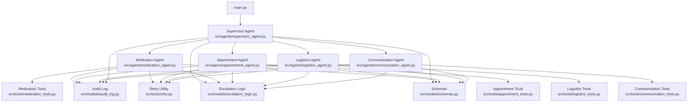
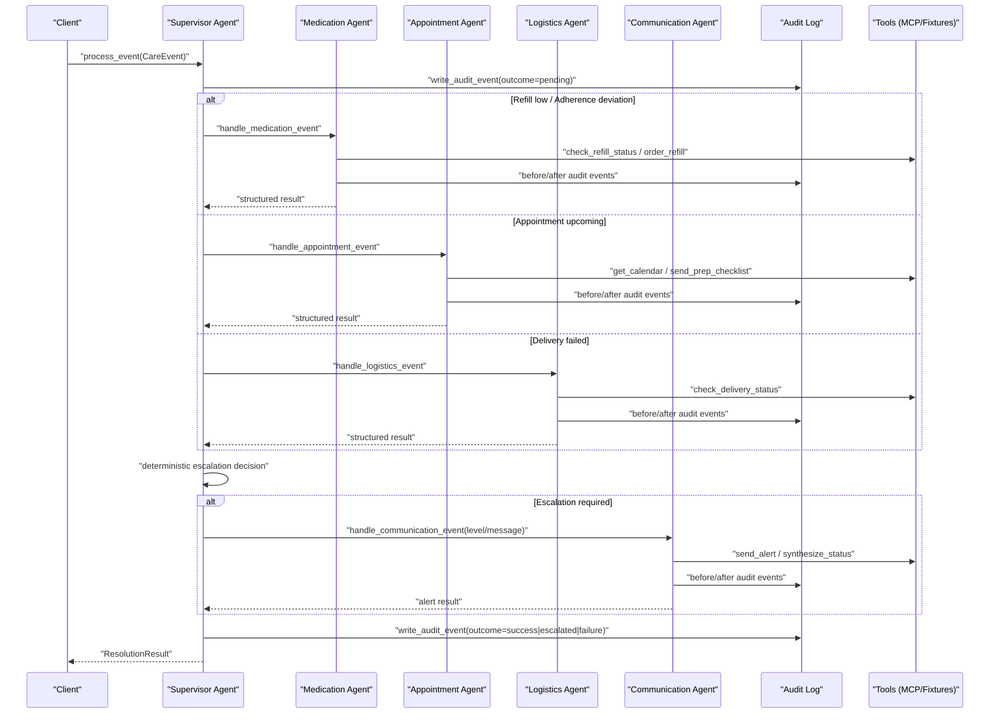
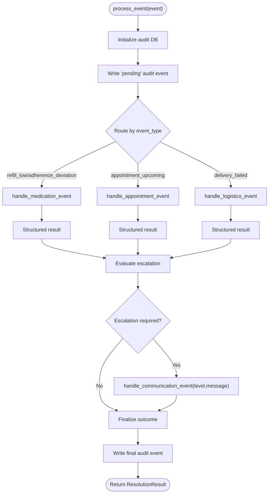
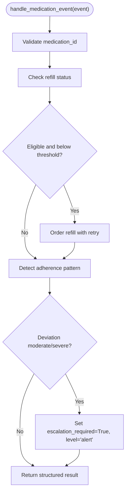
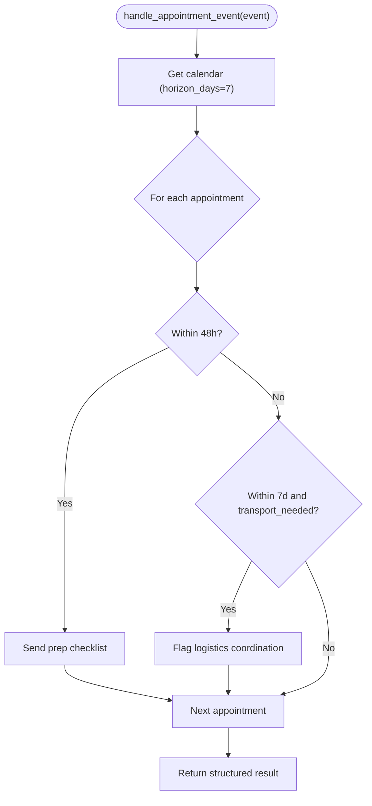
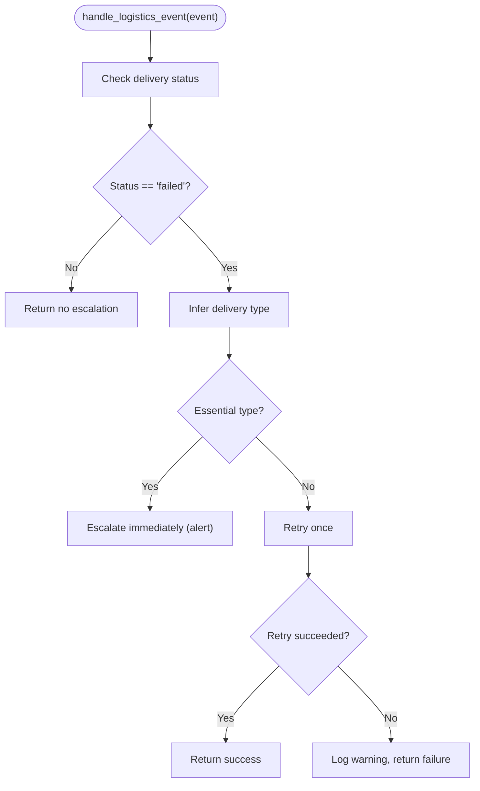
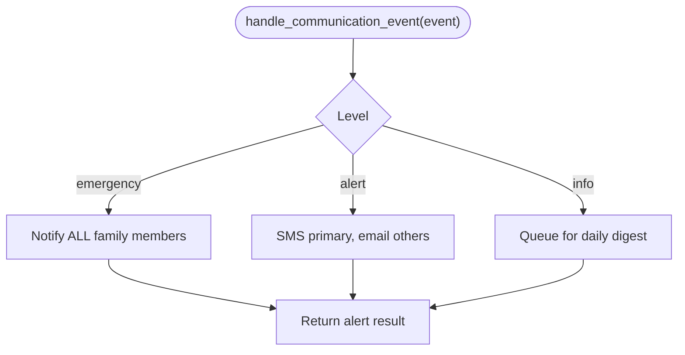
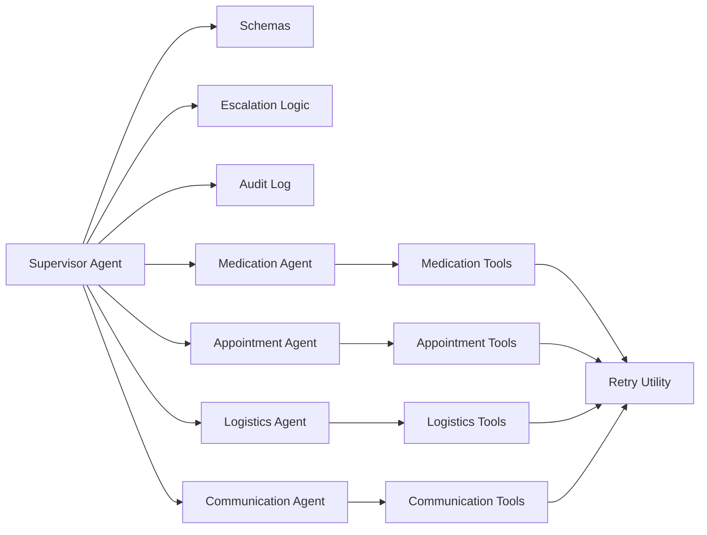

# Architecture Overview

<cite>
**Referenced Files in This Document**
- [main.py](file://main.py)
- [src/agents/supervisor_agent.py](file://src/agents/supervisor_agent.py)
- [src/agents/medication_agent.py](file://src/agents/medication_agent.py)
- [src/agents/appointment_agent.py](file://src/agents/appointment_agent.py)
- [src/agents/logistics_agent.py](file://src/agents/logistics_agent.py)
- [src/agents/communication_agent.py](file://src/agents/communication_agent.py)
- [src/models/schemas.py](file://src/models/schemas.py)
- [src/models/escalation_logic.py](file://src/models/escalation_logic.py)
- [src/models/audit_log.py](file://src/models/audit_log.py)
- [src/tools/retry.py](file://src/tools/retry.py)
- [src/tools/medication_tools.py](file://src/tools/medication_tools.py)
- [src/tools/appointment_tools.py](file://src/tools/appointment_tools.py)
- [src/tools/logistics_tools.py](file://src/tools/logistics_tools.py)
</cite>

## Table of Contents
1. Introduction
2. Project Structure
3. Core Components
4. Architecture Overview
5. Detailed Component Analysis
6. Dependency Analysis
7. Performance Considerations
8. Troubleshooting Guide
9. Conclusion
10. Appendices

## Introduction
CareBridge is a multi-agent care coordination system that routes care events through a Supervisor agent to specialized agents for medication, appointment, logistics, and communication. The design enforces deterministic routing and escalation logic, strict separation of concerns (no direct agent-to-agent calls), and an immutable audit trail for every action. It supports an optional Strands Agents SDK mode where the Supervisor can be exposed as an LLM-driven orchestrator with agents-as-tools; when unavailable, it falls back to deterministic direct routing without LLM involvement.

## Project Structure
The system is organized by capability:
- Agents: supervisor and four specialized agents
- Models: shared Pydantic v2 schemas, deterministic escalation rules, and SQLite-backed immutable audit log
- Tools: external integrations (pharmacy, calendar, delivery, messaging) wrapped with retry and audit-first patterns
- Entry point: demo scenario that initializes the system, loads fixtures, runs scenarios, and prints audit summaries

**Diagram sources**
- [main.py:92-171](file://main.py#L92-L171)
- [src/agents/supervisor_agent.py:259-395](file://src/agents/supervisor_agent.py#L259-L395)
- [src/agents/medication_agent.py:23-134](file://src/agents/medication_agent.py#L23-L134)
- [src/agents/appointment_agent.py:74-172](file://src/agents/appointment_agent.py#L74-L172)
- [src/agents/logistics_agent.py:182-235](file://src/agents/logistics_agent.py#L182-L235)
- [src/agents/communication_agent.py:28-115](file://src/agents/communication_agent.py#L28-L115)
- [src/models/audit_log.py:19-167](file://src/models/audit_log.py#L19-L167)
- [src/tools/retry.py:22-69](file://src/tools/retry.py#L22-L69)
- [src/models/escalation_logic.py:42-70](file://src/models/escalation_logic.py#L42-L70)
- [src/models/schemas.py:56-70](file://src/models/schemas.py#L56-L70)

**Section sources**
- [main.py:92-171](file://main.py#L92-L171)
- [src/agents/supervisor_agent.py:259-395](file://src/agents/supervisor_agent.py#L259-L395)

## Core Components
- Supervisor Agent: single entry point for care events; routes to specialized agents; writes immutable audit events before execution; makes deterministic escalation decisions; optionally wires agents-as-tools via Strands SDK.
- Specialized Agents:
  - Medication Agent: refill checks, refill ordering with retries, adherence detection.
  - Appointment Agent: upcoming appointment handling, prep checklist dispatch, transport flagging.
  - Logistics Agent: delivery failure handling with essential/non-essential escalation and retry.
  - Communication Agent: family alerts and daily digest batching; status synthesis.
- Models:
  - Schemas: Pydantic v2 models for all inter-component data contracts.
  - Escalation Logic: deterministic classification into auto/alert/approve and emergency triggers.
  - Audit Log: append-only SQLite storage with triggers preventing updates/deletes.
- Tools:
  - External integration wrappers with audit-first pattern and shared retry utility.
  - Retry utility: exponential backoff with configurable attempts.

**Section sources**
- [src/agents/supervisor_agent.py:259-395](file://src/agents/supervisor_agent.py#L259-L395)
- [src/agents/medication_agent.py:23-134](file://src/agents/medication_agent.py#L23-L134)
- [src/agents/appointment_agent.py:74-172](file://src/agents/appointment_agent.py#L74-L172)
- [src/agents/logistics_agent.py:182-235](file://src/agents/logistics_agent.py#L182-L235)
- [src/agents/communication_agent.py:28-115](file://src/agents/communication_agent.py#L28-L115)
- [src/models/schemas.py:56-70](file://src/models/schemas.py#L56-L70)
- [src/models/escalation_logic.py:42-70](file://src/models/escalation_logic.py#L42-L70)
- [src/models/audit_log.py:19-167](file://src/models/audit_log.py#L19-L167)
- [src/tools/retry.py:22-69](file://src/tools/retry.py#L22-L69)

## Architecture Overview
The system follows an event-driven architecture with deterministic routing and strict boundaries:
- CareEvent enters the Supervisor, which writes a pending audit event and routes to the appropriate specialized agent based on event_type.
- Each agent executes domain-specific tools, writing audit events before and after actions.
- Escalation is determined deterministically using hardcoded rules and agent results; if required, the Supervisor creates a new CareEvent routed to the Communication Agent for family notification.
- No direct agent-to-agent communication occurs; all cross-cutting flows go through the Supervisor or via shared models/tools.

**Diagram sources**
- [src/agents/supervisor_agent.py:285-395](file://src/agents/supervisor_agent.py#L285-L395)
- [src/agents/medication_agent.py:23-134](file://src/agents/medication_agent.py#L23-L134)
- [src/agents/appointment_agent.py:74-172](file://src/agents/appointment_agent.py#L74-L172)
- [src/agents/logistics_agent.py:182-235](file://src/agents/logistics_agent.py#L182-L235)
- [src/agents/communication_agent.py:28-115](file://src/agents/communication_agent.py#L28-L115)
- [src/models/audit_log.py:81-130](file://src/models/audit_log.py#L81-L130)

## Detailed Component Analysis

### Supervisor Agent
Responsibilities:
- Single entry point for care events; never calls external APIs directly.
- Routes events to specialized agents deterministically.
- Writes immutable audit events before any action.
- Applies deterministic escalation logic and routes to Communication Agent when needed.
- Supports Strands agents-as-tools wiring with graceful degradation.

Key behaviors:
- Routing table maps event types to agent handlers.
- Escalation combines hard-coded emergency triggers, classified executed actions, and agent-reported flags.
- Approval flow locates pending actions in the audit trail, records human decisions, and re-routes approved actions to the owning agent.

**Diagram sources**
- [src/agents/supervisor_agent.py:285-395](file://src/agents/supervisor_agent.py#L285-L395)
- [src/agents/supervisor_agent.py:432-593](file://src/agents/supervisor_agent.py#L432-L593)

**Section sources**
- [src/agents/supervisor_agent.py:259-395](file://src/agents/supervisor_agent.py#L259-L395)
- [src/agents/supervisor_agent.py:432-593](file://src/agents/supervisor_agent.py#L432-L593)
- [src/models/escalation_logic.py:42-70](file://src/models/escalation_logic.py#L42-L70)

### Medication Agent
Responsibilities:
- Check refill status and eligibility.
- Order refills with retry and audit-first pattern.
- Detect adherence deviations and escalate for moderate/severe cases.

Processing steps:
- Validate payload and check refill status.
- If eligible and below threshold, attempt refill order with retry; capture success/failure.
- Analyze adherence patterns; escalate if deviation severity warrants.

**Diagram sources**
- [src/agents/medication_agent.py:23-134](file://src/agents/medication_agent.py#L23-L134)
- [src/tools/medication_tools.py:65-152](file://src/tools/medication_tools.py#L65-L152)
- [src/tools/retry.py:22-69](file://src/tools/retry.py#L22-L69)

**Section sources**
- [src/agents/medication_agent.py:23-134](file://src/agents/medication_agent.py#L23-L134)
- [src/tools/medication_tools.py:65-152](file://src/tools/medication_tools.py#L65-L152)

### Appointment Agent
Responsibilities:
- Retrieve upcoming appointments within defined horizons.
- Send prep checklists for near-term appointments.
- Flag transportation needs for logistics coordination.

Processing steps:
- Load calendar and filter by recipient and horizon.
- For each appointment within 48 hours, send prep checklist.
- For each appointment within 7 days requiring transport, set logistics coordination flag.

**Diagram sources**
- [src/agents/appointment_agent.py:74-172](file://src/agents/appointment_agent.py#L74-L172)
- [src/tools/appointment_tools.py:39-80](file://src/tools/appointment_tools.py#L39-L80)

**Section sources**
- [src/agents/appointment_agent.py:74-172](file://src/agents/appointment_agent.py#L74-L172)
- [src/tools/appointment_tools.py:39-80](file://src/tools/appointment_tools.py#L39-L80)

### Logistics Agent
Responsibilities:
- Handle delivery failures with escalation rules.
- Differentiate essential vs non-essential deliveries.
- Retry non-essential failures once and log outcomes.

Processing steps:
- Check current delivery status; if not failed, return early.
- Infer delivery type from history; essential failures escalate immediately.
- Non-essential failures retry once; on persistent failure, log warning and return.

**Diagram sources**
- [src/agents/logistics_agent.py:182-235](file://src/agents/logistics_agent.py#L182-L235)
- [src/tools/logistics_tools.py:23-53](file://src/tools/logistics_tools.py#L23-L53)

**Section sources**
- [src/agents/logistics_agent.py:182-235](file://src/agents/logistics_agent.py#L182-L235)
- [src/tools/logistics_tools.py:23-53](file://src/tools/logistics_tools.py#L23-L53)

### Communication Agent
Responsibilities:
- Send family alerts based on level (info/alert/emergency).
- Batch info-level events into daily digests.
- Provide status synthesis for caregiver queries.

Processing steps:
- Determine level from event payload.
- Emergency: notify all family members via full channel blast.
- Alert: SMS to primary caregiver, email to others.
- Info: queue for daily digest.

**Diagram sources**
- [src/agents/communication_agent.py:28-115](file://src/agents/communication_agent.py#L28-L115)

**Section sources**
- [src/agents/communication_agent.py:28-115](file://src/agents/communication_agent.py#L28-L115)

### Data Models and Contracts
- CareEvent: typed event envelope with event_type constrained to four routed types.
- ResolutionResult: standardized response capturing resolution, actions, escalation, and audit IDs.
- Domain models: RefillStatus, RefillOrder, AdherencePattern, DeliveryStatus, DeliveryOrder, ChecklistResult, AlertResult, StatusSummary, PendingAction, FamilyPreferences.

These Pydantic v2 models ensure consistent validation across agents and tools.

**Section sources**
- [src/models/schemas.py:56-149](file://src/models/schemas.py#L56-L149)

### Deterministic Escalation Logic
- Classifies actions into autonomous, alert, or approve categories using hardcoded sets.
- Emergency triggers force at least alert-level escalation.
- Unknown actions default to approve for safety.

This ensures no LLM decides critical safety classifications.

**Section sources**
- [src/models/escalation_logic.py:42-70](file://src/models/escalation_logic.py#L42-L70)

### Immutable Audit Trail
- Every action writes a "before" audit event with outcome="pending" prior to execution.
- Follow-up events record success/failure/escalated outcomes.
- SQLite triggers prevent updates and deletes, ensuring immutability.
- Correlation IDs link related events across the lifecycle of a care event.

**Section sources**
- [src/models/audit_log.py:19-167](file://src/models/audit_log.py#L19-L167)

### Retry Mechanisms
- Shared with_retry utility provides exponential backoff (1s, 2s, 4s) with configurable attempts.
- Used by medication, appointment, logistics, and communication tools for resilient external calls.
- RetryExhausted exceptions propagate up to trigger escalation or error handling paths.

**Section sources**
- [src/tools/retry.py:22-69](file://src/tools/retry.py#L22-L69)

## Dependency Analysis
Agents depend on:
- Schemas for input/output contracts
- Escalation logic for deterministic decisions
- Audit log for compliance and traceability
- Tools for external integrations (currently fixture-based; MCP servers planned)
- Retry utility for resilience

**Diagram sources**
- [src/agents/supervisor_agent.py:259-395](file://src/agents/supervisor_agent.py#L259-L395)
- [src/agents/medication_agent.py:23-134](file://src/agents/medication_agent.py#L23-L134)
- [src/agents/appointment_agent.py:74-172](file://src/agents/appointment_agent.py#L74-L172)
- [src/agents/logistics_agent.py:182-235](file://src/agents/logistics_agent.py#L182-L235)
- [src/agents/communication_agent.py:28-115](file://src/agents/communication_agent.py#L28-L115)
- [src/tools/retry.py:22-69](file://src/tools/retry.py#L22-L69)

**Section sources**
- [src/agents/supervisor_agent.py:259-395](file://src/agents/supervisor_agent.py#L259-L395)
- [src/tools/retry.py:22-69](file://src/tools/retry.py#L22-L69)

## Performance Considerations
- Deterministic routing avoids unnecessary LLM calls; Strands mode is optional and gracefully degrades.
- Audit writes are lightweight SQLite operations with indexes on timestamp, correlation_id, and care_recipient_id.
- Retry utility uses exponential backoff to reduce load on external services during transient failures.
- Event processing is asynchronous where applicable, enabling concurrent tool calls within agents.

[No sources needed since this section provides general guidance]

## Troubleshooting Guide
Common issues and resolutions:
- Missing fixtures: Ensure all required JSON files exist under fixtures; main.py validates presence at startup.
- Audit database errors: Verify SQLite permissions and path; init_audit_db creates schema and triggers idempotently.
- Retry exhaustion: Inspect logs for RetryExhausted exceptions; adjust max_attempts or backend service health.
- Escalation anomalies: Review classify_action inputs and agent results; ensure emergency triggers are correctly set in payloads.
- Strands SDK unavailability: System falls back to deterministic routing; verify environment variables for Bedrock credentials if enabling LLM orchestration.

**Section sources**
- [main.py:45-63](file://main.py#L45-L63)
- [src/models/audit_log.py:19-78](file://src/models/audit_log.py#L19-L78)
- [src/tools/retry.py:22-69](file://src/tools/retry.py#L22-L69)
- [src/models/escalation_logic.py:42-70](file://src/models/escalation_logic.py#L42-L70)
- [src/agents/supervisor_agent.py:599-641](file://src/agents/supervisor_agent.py#L599-L641)

## Conclusion
CareBridge’s multi-agent architecture delivers robust, auditable care coordination through deterministic routing, strict separation of concerns, and resilient external integrations. The Supervisor orchestrates specialized agents while enforcing immutable audit trails and escalation policies. Optional Strands agents-as-tools enable LLM-driven orchestration without compromising safety-critical determinism. Production deployments should ensure fixture availability, audit database integrity, and proper logging and monitoring.

[No sources needed since this section summarizes without analyzing specific files]

## Appendices

### Technology Stack
- Python async/await for asynchronous event processing
- Pydantic v2 for data validation and model contracts
- SQLite for immutable audit storage with triggers
- MCP servers for future service integration (Day 2)
- Strands Agents SDK for optional LLM-based orchestration with agents-as-tools

**Section sources**
- [src/agents/supervisor_agent.py:599-641](file://src/agents/supervisor_agent.py#L599-L641)
- [src/models/schemas.py:1-149](file://src/models/schemas.py#L1-L149)
- [src/models/audit_log.py:19-167](file://src/models/audit_log.py#L19-L167)

### Infrastructure Requirements and Deployment Considerations
- Runtime: Python environment with asyncio support
- Storage: SQLite file accessible to the process; ensure write permissions and backups
- Logging: Configure stdout and file handlers; rotate logs in production
- Fixtures: Pre-seed medications, appointments, delivery_history, and family_members JSON files
- Monitoring: Track audit events, retry attempts, and escalation rates
- Security: Protect audit.db and logs; restrict access to sensitive identifiers
- Scalability: Consider horizontal scaling of agents and message queues for high-throughput environments

**Section sources**
- [main.py:19-31](file://main.py#L19-L31)
- [src/models/audit_log.py:16-78](file://src/models/audit_log.py#L16-L78)
- [src/agents/supervisor_agent.py:285-395](file://src/agents/supervisor_agent.py#L285-L395)