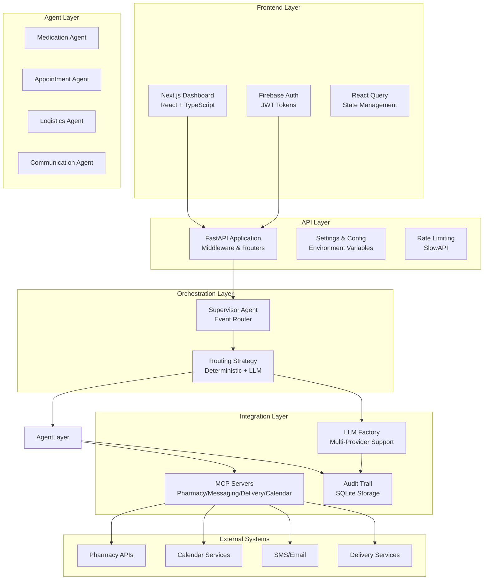
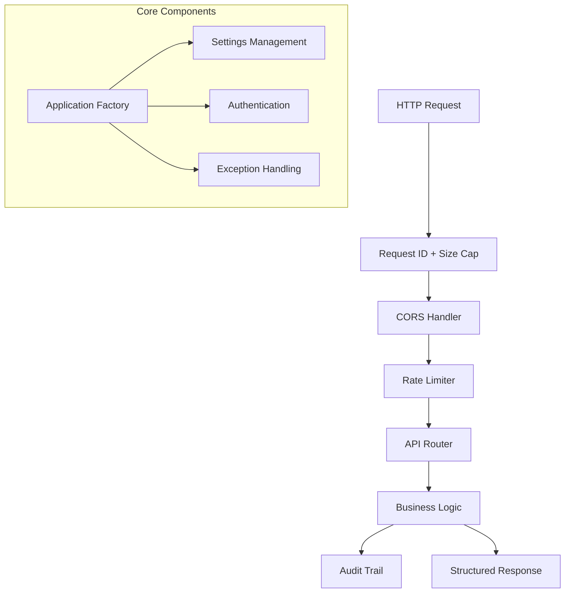
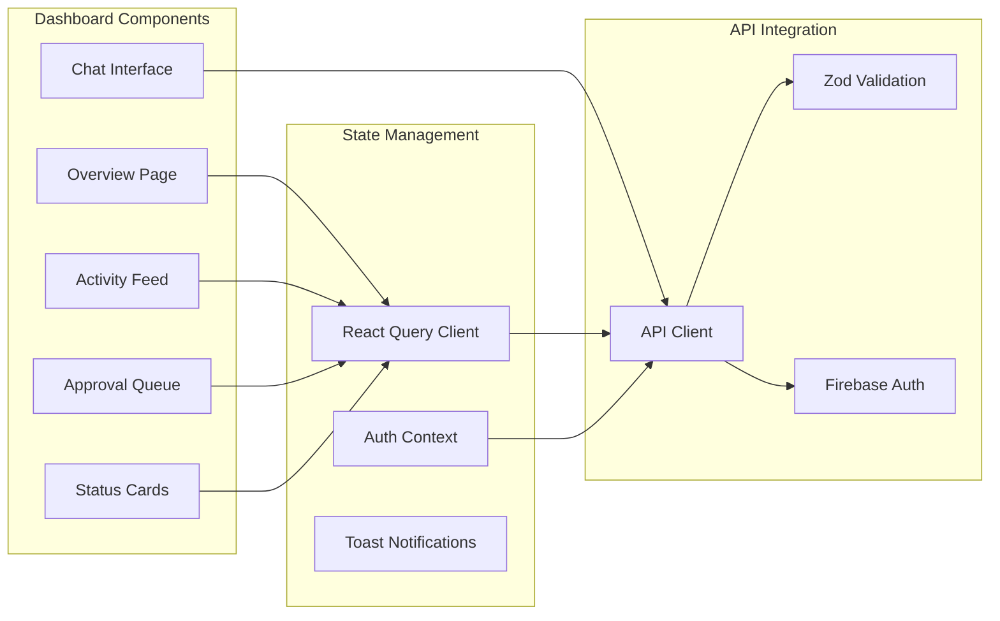
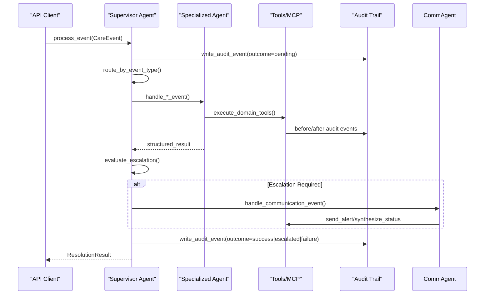
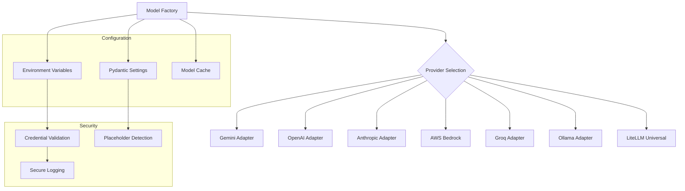
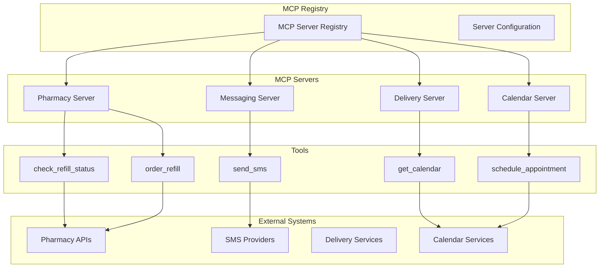
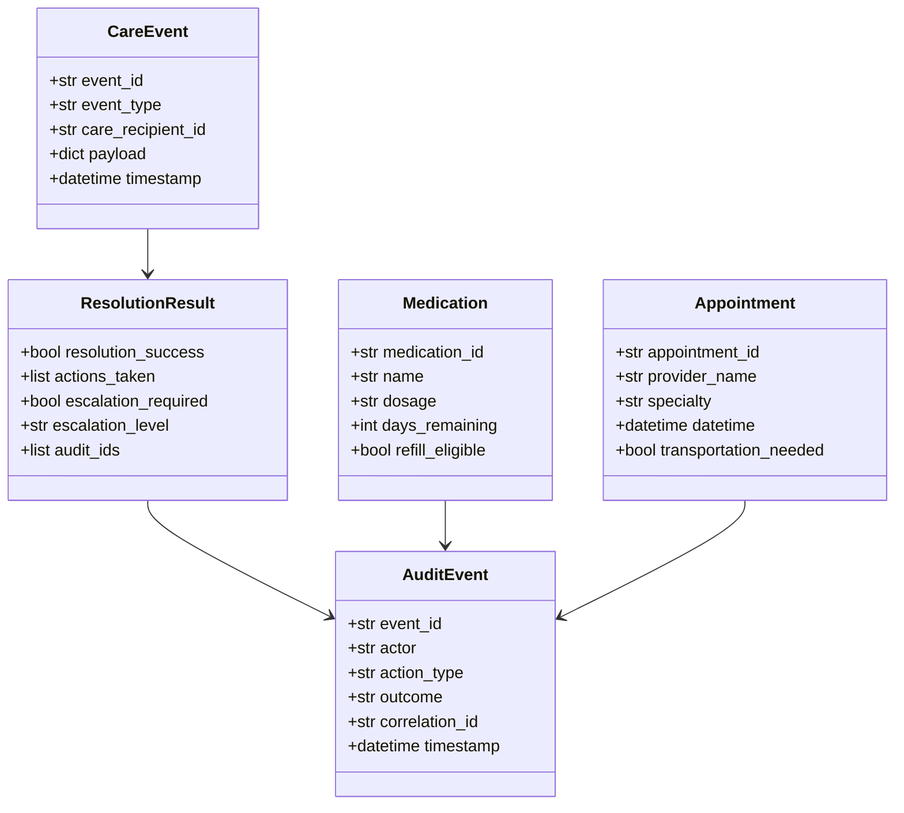
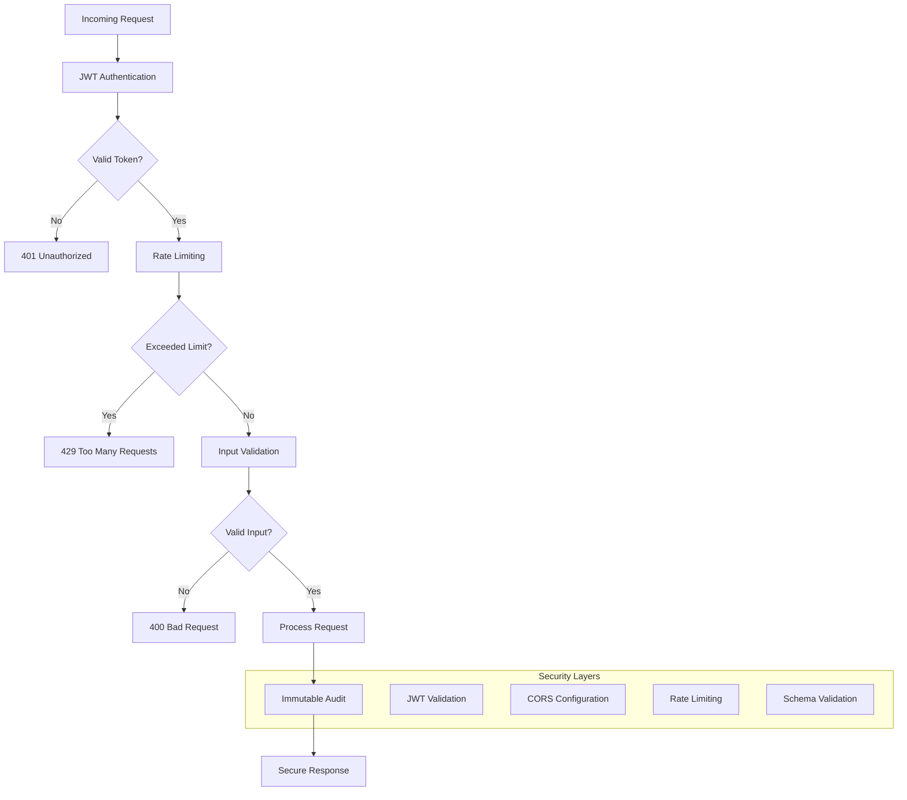

# Architecture Overview

<cite>
**Referenced Files in This Document**
- [src/api/main.py](file://src/api/main.py)
- [src/api/config.py](file://src/api/config.py)
- [src/runtime/model_factory.py](file://src/runtime/model_factory.py)
- [src/runtime/qoder_client.py](file://src/runtime/qoder_client.py)
- [src/mcp/__init__.py](file://src/mcp/__init__.py)
- [src/mcp/pharmacy_server.py](file://src/mcp/pharmacy_server.py)
- [src/ui/package.json](file://src/ui/package.json)
- [src/ui/app/dashboard/page.tsx](file://src/ui/app/dashboard/page.tsx)
- [src/ui/lib/api.ts](file://src/ui/lib/api.ts)
- [src/agents/supervisor_agent.py](file://src/agents/supervisor_agent.py)
- [src/agents/medication_agent.py](file://src/agents/medication_agent.py)
- [src/agents/appointment_agent.py](file://src/agents/appointment_agent.py)
- [src/agents/logistics_agent.py](file://src/agents/logistics_agent.py)
- [src/agents/communication_agent.py](file://src/agents/communication_agent.py)
- [src/models/schemas.py](file://src/models/schemas.py)
- [src/models/escalation_logic.py](file://src/models/escalation_logic.py)
- [src/models/audit_log.py](file://src/models/audit_log.py)
- [src/tools/retry.py](file://src/tools/retry.py)
</cite>

## Update Summary
**Changes Made**
- Added complete FastAPI backend architecture with comprehensive API layer
- Integrated Next.js frontend with React Query for state management
- Implemented multi-provider LLM integration through model factory pattern
- Added Model Context Protocol (MCP) servers for external system coordination
- Enhanced supervisor agent with both Strands SDK and Qoder runtime support
- Expanded audit trail and monitoring capabilities across all layers

## Table of Contents
1. Introduction
2. System Architecture
3. Backend Layer (FastAPI)
4. Frontend Layer (Next.js)
5. Multi-Agent Orchestration
6. LLM Integration Layer
7. External System Integration (MCP)
8. Data Models and Contracts
9. Security and Authentication
10. Deployment and Infrastructure
11. Performance Considerations
12. Troubleshooting Guide
13. Conclusion

## Introduction
CareBridge is a comprehensive multi-agent care coordination system that combines deterministic routing with optional LLM-driven orchestration. The system features a complete full-stack architecture with a FastAPI backend, Next.js frontend, and sophisticated multi-agent orchestration using both Strands Agents SDK and Qoder runtime. It supports multiple LLM providers through a unified factory pattern and integrates with external systems via Model Context Protocol (MCP) servers.

The design enforces deterministic routing and escalation logic, strict separation of concerns, and an immutable audit trail for every action. The system gracefully degrades when LLM services are unavailable, falling back to deterministic direct routing without compromising core functionality.

## System Architecture



**Diagram sources**
- [src/api/main.py:77-125](file://src/api/main.py#L77-L125)
- [src/runtime/model_factory.py:530-568](file://src/runtime/model_factory.py#L530-L568)
- [src/mcp/__init__.py:54-59](file://src/mcp/__init__.py#L54-L59)

## Backend Layer (FastAPI)

### Application Structure
The FastAPI backend provides a comprehensive REST API with middleware, authentication, rate limiting, and structured logging. The application follows a modular architecture with separate routers for different domains.



**Diagram sources**
- [src/api/main.py:77-125](file://src/api/main.py#L77-L125)
- [src/api/config.py:48-358](file://src/api/config.py#L48-L358)

### Key Features
- **Modular Routers**: Separate endpoints for health, auth, status, alerts, approvals, audit, query, medications, appointments, deliveries, settings, and MCP management
- **Middleware Pipeline**: Request ID tracking, size limits, CORS handling, and rate limiting
- **Configuration Management**: Pydantic-based settings with environment variable support and validation
- **Error Handling**: Structured exception handling with request IDs for tracing
- **Health Checks**: Comprehensive health and readiness endpoints

**Section sources**
- [src/api/main.py:77-125](file://src/api/main.py#L77-L125)
- [src/api/config.py:48-358](file://src/api/config.py#L48-L358)
- [src/api/routers/__init__.py:24-39](file://src/api/routers/__init__.py#L24-L39)

## Frontend Layer (Next.js)

### User Interface Architecture
The Next.js frontend provides a modern, responsive dashboard for care coordination with real-time updates, chat interface, and comprehensive data visualization.



**Diagram sources**
- [src/ui/app/dashboard/page.tsx:62-492](file://src/ui/app/dashboard/page.tsx#L62-L492)
- [src/ui/lib/api.ts:269-678](file://src/ui/lib/api.ts#L269-L678)

### Key Features
- **Real-time Updates**: Polling intervals for alerts (5s), approvals (10s), and status (30s)
- **Chat Interface**: Natural language queries with AI-powered responses
- **Responsive Design**: Mobile-first approach with Tailwind CSS
- **State Management**: React Query for server state with automatic caching and refetching
- **Form Validation**: Zod schemas for type-safe form handling
- **Authentication**: Firebase integration with JWT token management

**Section sources**
- [src/ui/app/dashboard/page.tsx:62-492](file://src/ui/app/dashboard/page.tsx#L62-L492)
- [src/ui/lib/api.ts:269-678](file://src/ui/lib/api.ts#L269-L678)
- [src/ui/package.json:1-35](file://src/ui/package.json#L1-L35)

## Multi-Agent Orchestration

### Supervisor Agent Architecture
The supervisor agent serves as the central orchestrator, routing care events to specialized agents based on event types and applying deterministic escalation logic.



**Diagram sources**
- [src/agents/supervisor_agent.py:285-395](file://src/agents/supervisor_agent.py#L285-L395)
- [src/agents/medication_agent.py:23-134](file://src/agents/medication_agent.py#L23-L134)

### Agent Specialization
Each agent handles specific domain responsibilities with clear boundaries:

- **Medication Agent**: Refill checks, ordering with retries, adherence detection
- **Appointment Agent**: Calendar management, prep checklists, transport coordination  
- **Logistics Agent**: Delivery failure handling, essential/non-essential classification
- **Communication Agent**: Family alerts, daily digests, status synthesis

**Section sources**
- [src/agents/supervisor_agent.py:285-395](file://src/agents/supervisor_agent.py#L285-L395)
- [src/agents/medication_agent.py:23-134](file://src/agents/medication_agent.py#L23-L134)
- [src/agents/appointment_agent.py:74-172](file://src/agents/appointment_agent.py#L74-L172)
- [src/agents/logistics_agent.py:182-235](file://src/agents/logistics_agent.py#L182-L235)
- [src/agents/communication_agent.py:28-115](file://src/agents/communication_agent.py#L28-L115)

## LLM Integration Layer

### Multi-Provider Factory Pattern
The LLM integration layer provides a unified interface to multiple AI providers through a factory pattern that supports runtime provider selection.



**Diagram sources**
- [src/runtime/model_factory.py:530-568](file://src/runtime/model_factory.py#L530-L568)
- [src/runtime/model_factory.py:115-145](file://src/runtime/model_factory.py#L115-L145)

### Supported Providers
- **Google Gemini**: Free tier with no credit card required
- **OpenAI**: GPT models with standard API
- **Anthropic**: Claude models with configurable parameters
- **AWS Bedrock**: Enterprise-grade models with AWS credential chain
- **Groq**: High-performance inference via OpenAI-compatible endpoint
- **Ollama**: Local model execution for privacy-sensitive deployments
- **LiteLLM**: Universal adapter supporting multiple provider formats

**Section sources**
- [src/runtime/model_factory.py:57-65](file://src/runtime/model_factory.py#L57-L65)
- [src/runtime/model_factory.py:276-451](file://src/runtime/model_factory.py#L276-L451)
- [src/api/config.py:146-224](file://src/api/config.py#L146-L224)

## External System Integration (MCP)

### Model Context Protocol Architecture
The MCP layer provides standardized interfaces to external systems through in-process servers that expose typed business functions as tools.



**Diagram sources**
- [src/mcp/__init__.py:54-59](file://src/mcp/__init__.py#L54-L59)
- [src/mcp/pharmacy_server.py:389-398](file://src/mcp/pharmacy_server.py#L389-L398)

### Tool Abstraction
Each MCP server exposes typed business functions that maintain clean separation between the tool interface and implementation logic.

**Section sources**
- [src/mcp/__init__.py:1-107](file://src/mcp/__init__.py#L1-L107)
- [src/mcp/pharmacy_server.py:139-330](file://src/mcp/pharmacy_server.py#L139-L330)

## Data Models and Contracts

### Schema Definitions
The system uses Pydantic v2 models for consistent data validation across all layers, ensuring type safety from frontend to backend to database.



**Diagram sources**
- [src/models/schemas.py:56-149](file://src/models/schemas.py#L56-L149)
- [src/ui/lib/api.ts:23-148](file://src/ui/lib/api.ts#L23-L148)

### Cross-Layer Consistency
Zod schemas in the frontend mirror Pydantic models in the backend, providing compile-time validation and IntelliSense support throughout the development experience.

**Section sources**
- [src/models/schemas.py:56-149](file://src/models/schemas.py#L56-L149)
- [src/ui/lib/api.ts:7-148](file://src/ui/lib/api.ts#L7-L148)

## Security and Authentication

### Multi-Layer Security
The system implements comprehensive security measures including JWT authentication, rate limiting, input validation, and secure credential management.



**Diagram sources**
- [src/api/main.py:95-119](file://src/api/main.py#L95-L119)
- [src/api/config.py:262-282](file://src/api/config.py#L262-L282)

### Credential Management
- **Environment Variables**: All secrets loaded from environment or .env files
- **Placeholder Detection**: Automatic detection of unfilled template credentials
- **Secure Logging**: Credentials never logged; only provider names and model IDs
- **Firebase Integration**: Optional OAuth flow with custom JWT issuance

**Section sources**
- [src/api/config.py:262-358](file://src/api/config.py#L262-L358)
- [src/runtime/model_factory.py:148-200](file://src/runtime/model_factory.py#L148-L200)

## Deployment and Infrastructure

### Container Architecture
The system is designed for containerized deployment with clear separation of concerns and configuration management.

```mermaid
graph TB
subgraph "Production Environment"
Web[Web Server<br/>Next.js App]
API[API Server<br/>FastAPI + Uvicorn]
DB[Database<br/>SQLite/Audit DB]
Cache[Cache<br/>Redis (Optional)]
end
subgraph "External Services"
LLM[LLM Providers<br/>Gemini/OpenAI/etc]
Auth[Auth Services<br/>Firebase]
MCP[External APIs<br/>Pharmacy/Calendar/etc]
end
subgraph "Monitoring"
Logs[Logging<br/>Structured JSON]
Metrics[Metrics<br/>Prometheus]
Health[Health Checks<br/>/health, /ready]
end
Web --> API
API --> DB
API --> Cache
API --> LLM
API --> Auth
API --> MCP
API --> Logs
API --> Metrics
API --> Health
```

### Configuration Management
- **Environment Variables**: Comprehensive configuration through environment variables
- **Demo Mode**: Development-friendly defaults with security guardrails
- **Feature Flags**: Runtime feature toggles for gradual rollout
- **Health Monitoring**: Comprehensive health and readiness endpoints

**Section sources**
- [src/api/config.py:48-358](file://src/api/config.py#L48-L358)
- [src/api/main.py:39-75](file://src/api/main.py#L39-L75)

## Performance Considerations

### Optimization Strategies
- **Caching**: Model instance caching with fingerprint-based invalidation
- **Connection Pooling**: Efficient database connections with SQLite
- **Async Processing**: Asynchronous request handling for concurrent operations
- **Lazy Loading**: Optional dependencies loaded only when needed
- **Rate Limiting**: Protection against abuse and resource exhaustion

### Scalability Patterns
- **Horizontal Scaling**: Stateless API servers behind load balancer
- **Database Scaling**: SQLite for single-instance; consider PostgreSQL for multi-instance
- **Cache Layer**: Redis for session storage and response caching
- **Message Queues**: Background processing for long-running tasks

## Troubleshooting Guide

### Common Issues and Solutions
- **LLM Provider Errors**: Check environment variables and provider credentials
- **MCP Server Issues**: Verify external service connectivity and fixture availability
- **Authentication Problems**: Validate JWT configuration and Firebase setup
- **Performance Issues**: Monitor audit trail growth and database performance
- **Deployment Failures**: Review environment configuration and dependency installation

### Diagnostic Tools
- **Health Endpoints**: `/health` for basic connectivity, `/ready` for full system status
- **Audit Trail**: Comprehensive logging with correlation IDs for request tracing
- **Configuration Inspection**: Runtime configuration validation and reporting
- **MCP Server Status**: Endpoint to inspect available MCP servers and tools

**Section sources**
- [src/api/main.py:95-119](file://src/api/main.py#L95-L119)
- [src/runtime/model_factory.py:570-589](file://src/runtime/model_factory.py#L570-L589)
- [src/models/audit_log.py:19-167](file://src/models/audit_log.py#L19-L167)

## Conclusion
CareBridge represents a comprehensive evolution from a simple multi-agent system to a full-stack enterprise application. The addition of a robust FastAPI backend, modern Next.js frontend, multi-provider LLM integration, and Model Context Protocol infrastructure creates a production-ready platform for care coordination.

The architecture maintains the core principles of deterministic routing, strict separation of concerns, and immutable audit trails while adding the flexibility and scalability needed for enterprise deployment. The graceful degradation patterns ensure system reliability even when external services are unavailable, making it suitable for critical healthcare environments where uptime is paramount.

Key architectural strengths include:
- **Resilience**: Multiple fallback mechanisms and graceful degradation
- **Extensibility**: Plugin architecture for new agents and integrations
- **Observability**: Comprehensive logging, metrics, and audit trails
- **Security**: Multi-layered security with credential management
- **Scalability**: Horizontal scaling patterns and efficient resource usage

This foundation positions CareBridge for future enhancements including advanced analytics, machine learning capabilities, and expanded integration ecosystems while maintaining the reliability and safety guarantees essential for healthcare applications.