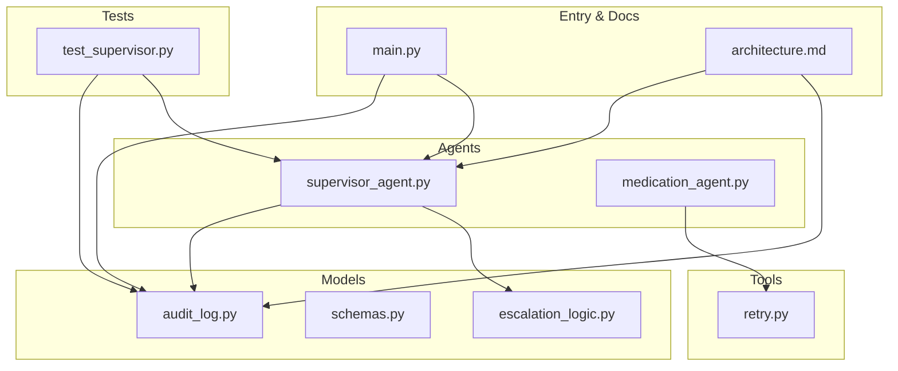
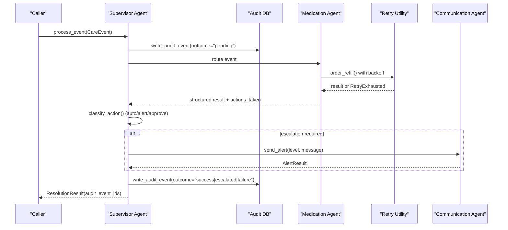
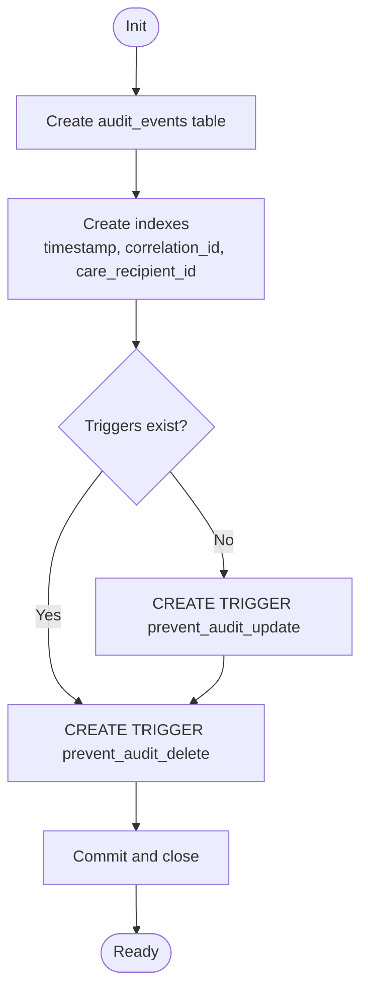
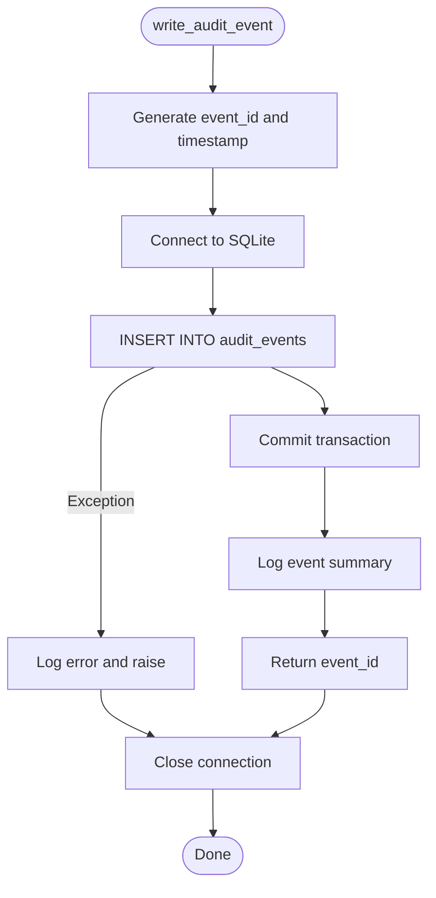
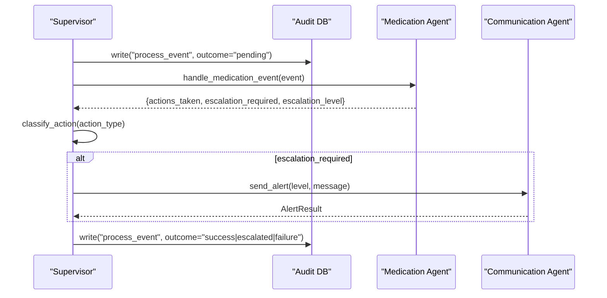
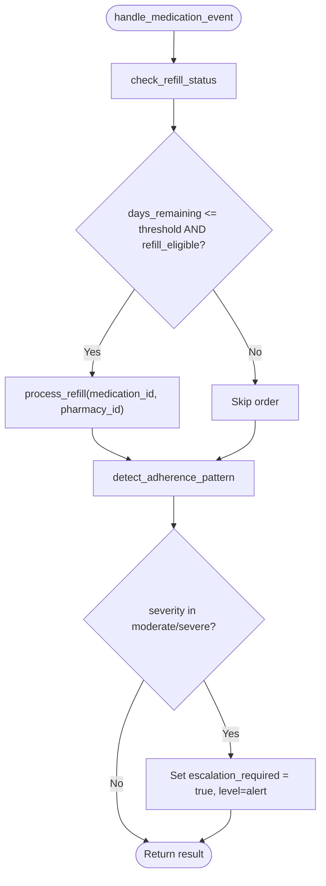
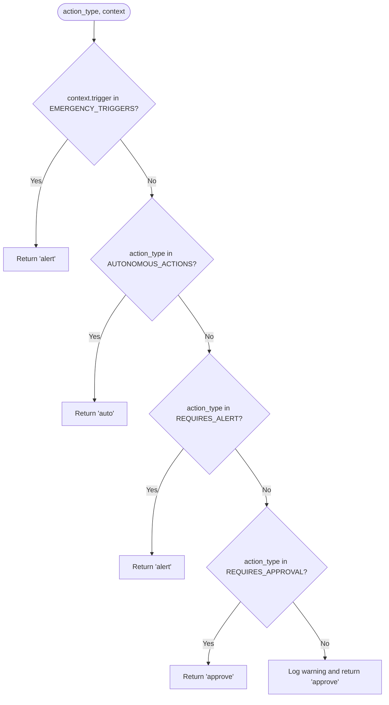
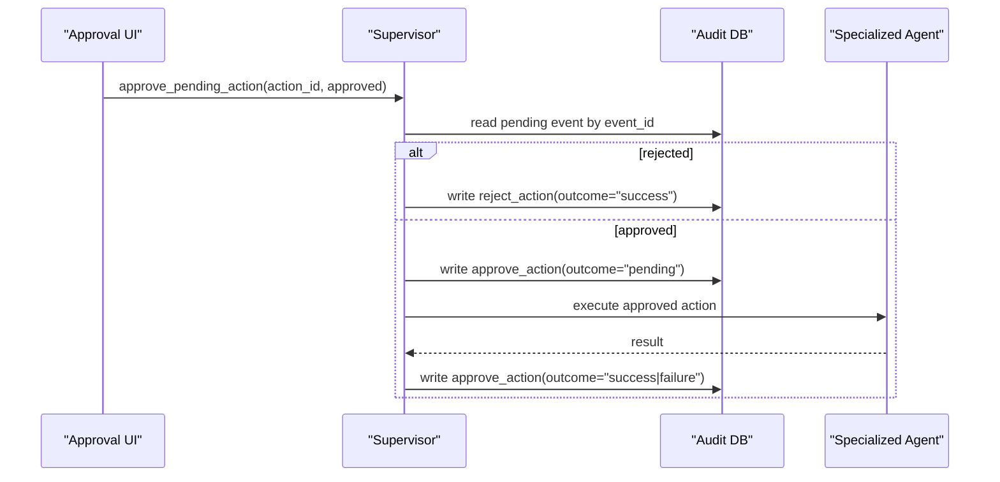
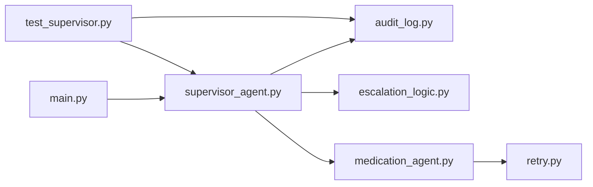

# Audit Trail System

<cite>
**Referenced Files in This Document**
- [audit_log.py](file://src/models/audit_log.py)
- [schemas.py](file://src/models/schemas.py)
- [escalation_logic.py](file://src/models/escalation_logic.py)
- [supervisor_agent.py](file://src/agents/supervisor_agent.py)
- [medication_agent.py](file://src/agents/medication_agent.py)
- [retry.py](file://src/tools/retry.py)
- [main.py](file://main.py)
- [architecture.md](file://architecture.md)
- [test_supervisor.py](file://tests/test_supervisor.py)
</cite>

## Table of Contents
1. [Introduction](#introduction)
2. [Project Structure](#project-structure)
3. [Core Components](#core-components)
4. [Architecture Overview](#architecture-overview)
5. [Detailed Component Analysis](#detailed-component-analysis)
6. [Dependency Analysis](#dependency-analysis)
7. [Performance Considerations](#performance-considerations)
8. [Troubleshooting Guide](#troubleshooting-guide)
9. [Conclusion](#conclusion)
10. [Appendices](#appendices)

## Introduction
This document explains CareBridge’s immutable audit trail system built on SQLite with database triggers that prevent modifications to audit records. The design enforces an “audit-before-action” principle: every agent action is recorded before execution, ensuring no action occurs without a record. The audit trail supports compliance requirements (tamper-evident logs), forensic analysis (complete event timelines per care recipient and correlation ID), and system monitoring (real-time visibility into actions and escalations). It also integrates tightly with the escalation system to ensure safety-critical decisions are always audited and reviewed.

## Project Structure
The audit trail spans models, agents, tools, tests, and documentation:
- Models define the schema, Pydantic data contracts, and deterministic escalation rules.
- Agents orchestrate events and write audit entries before executing any action.
- Tools provide shared utilities like retry logic for external calls.
- Tests validate immutability and completeness of audit logging.
- Architecture documentation describes end-to-end flows and deployment considerations.

**Diagram sources**
- [audit_log.py:19-78](file://src/models/audit_log.py#L19-L78)
- [supervisor_agent.py:285-395](file://src/agents/supervisor_agent.py#L285-L395)
- [medication_agent.py:23-134](file://src/agents/medication_agent.py#L23-L134)
- [retry.py:22-69](file://src/tools/retry.py#L22-L69)
- [main.py:143-177](file://main.py#L143-L177)
- [architecture.md:10-75](file://architecture.md#L10-L75)

**Section sources**
- [audit_log.py:19-78](file://src/models/audit_log.py#L19-L78)
- [supervisor_agent.py:285-395](file://src/agents/supervisor_agent.py#L285-L395)
- [architecture.md:10-75](file://architecture.md#L10-L75)

## Core Components
- Immutable audit database: SQLite table with BEFORE UPDATE and BEFORE DELETE triggers enforcing immutability.
- Audit event writer: Generates unique event IDs, timestamps, and writes structured events with actor, action type, rationale, outcome, correlation ID, and optional authorization reference.
- Query helper: Retrieves events filtered by care recipient or correlation ID, ordered by timestamp.
- Escalation classifier: Deterministic Python logic classifies actions as auto, alert, or approve; unknown actions default to approve for safety.
- Supervisor integration: Writes a “pending” audit event before routing and processing, then writes a follow-up event with final outcome.
- Agent integration: Each agent’s actions are wrapped with retries and produce audit events at key steps.

**Section sources**
- [audit_log.py:19-166](file://src/models/audit_log.py#L19-L166)
- [escalation_logic.py:13-70](file://src/models/escalation_logic.py#L13-L70)
- [supervisor_agent.py:285-395](file://src/agents/supervisor_agent.py#L285-L395)
- [medication_agent.py:23-134](file://src/agents/medication_agent.py#L23-L134)

## Architecture Overview
CareBridge uses an “audit-before-action” pattern enforced by both code flow and database-level triggers. Every process_event call begins by writing a pending audit entry, then routes to specialized agents. After execution, a follow-up audit entry records success, failure, or escalation. Escalation decisions are deterministic and never LLM-decided.

**Diagram sources**
- [supervisor_agent.py:285-395](file://src/agents/supervisor_agent.py#L285-L395)
- [medication_agent.py:137-159](file://src/agents/medication_agent.py#L137-L159)
- [retry.py:22-69](file://src/tools/retry.py#L22-L69)
- [audit_log.py:81-130](file://src/models/audit_log.py#L81-L130)

## Detailed Component Analysis

### Immutable Audit Database and Schema
- Schema defines a single audit_events table with fields for event identity, timing, actor, action type, care recipient, rationale, outcome, correlation, and optional authorization reference.
- Triggers enforce immutability:
  - BEFORE UPDATE trigger aborts updates with a clear error.
  - BEFORE DELETE trigger aborts deletions with a clear error.
- Indexes optimize queries by timestamp, correlation ID, and care recipient.

**Diagram sources**
- [audit_log.py:19-78](file://src/models/audit_log.py#L19-L78)

**Section sources**
- [audit_log.py:19-78](file://src/models/audit_log.py#L19-L78)

### Audit Event Writer and Query API
- write_audit_event generates UUID v4 event IDs, UTC timestamps, and inserts a new row. Errors are logged and re-raised; connections are closed in finally blocks.
- get_audit_events supports filtering by care_recipient_id and correlation_id, returning results ordered by newest first.

**Diagram sources**
- [audit_log.py:81-130](file://src/models/audit_log.py#L81-L130)

**Section sources**
- [audit_log.py:81-166](file://src/models/audit_log.py#L81-L166)

### Supervisor Integration and Audit-Before-Action
- process_event ensures the audit DB is initialized once per process.
- Writes a “pending” audit event before routing to specialized agents.
- Routes to the appropriate agent based on event type.
- Evaluates escalation deterministically using classify_action and agent-provided flags.
- If escalation is required, invokes Communication Agent to notify caregivers.
- Writes a follow-up audit event with final outcome (success, escalated, failure).
- Returns audit_event_ids to link all events for a given correlation.

**Diagram sources**
- [supervisor_agent.py:285-395](file://src/agents/supervisor_agent.py#L285-L395)
- [escalation_logic.py:42-70](file://src/models/escalation_logic.py#L42-L70)

**Section sources**
- [supervisor_agent.py:285-395](file://src/agents/supervisor_agent.py#L285-L395)

### Medication Agent and Retry-Aware Auditing
- handle_medication_event checks refill status, orders refills when eligible, and detects adherence deviations.
- process_refill wraps order_refill with exponential backoff via with_retry; failures after retries trigger escalation.
- Adherence detection can escalate alerts for moderate/severe deviations.

**Diagram sources**
- [medication_agent.py:23-134](file://src/agents/medication_agent.py#L23-L134)
- [retry.py:22-69](file://src/tools/retry.py#L22-L69)

**Section sources**
- [medication_agent.py:23-134](file://src/agents/medication_agent.py#L23-L134)
- [retry.py:22-69](file://src/tools/retry.py#L22-L69)

### Escalation Logic and Policy Enforcement
- classify_action maps action types to auto, alert, or approve using hardcoded sets.
- Unknown actions default to approve for safety.
- Emergency triggers in context elevate severity to alert at minimum.

**Diagram sources**
- [escalation_logic.py:13-70](file://src/models/escalation_logic.py#L13-L70)

**Section sources**
- [escalation_logic.py:13-70](file://src/models/escalation_logic.py#L13-L70)

### Human Approval Flow and Audit Linkage
- approve_pending_action locates a pending audit event, records human decision (approve/reject), and executes approved actions via the correct agent.
- Rejections log a rejection event; approvals log a pending decision followed by execution outcome.
- Authorization references link approval decisions to original pending actions.

**Diagram sources**
- [supervisor_agent.py:432-592](file://src/agents/supervisor_agent.py#L432-L592)

**Section sources**
- [supervisor_agent.py:432-592](file://src/agents/supervisor_agent.py#L432-L592)

## Dependency Analysis
- Supervisor depends on audit_log for persistence and escalation_logic for policy classification.
- Medication agent depends on retry utility for robust external calls and produces structured results consumed by supervisor.
- Main initializes the audit DB and orchestrates demo scenarios, printing audit summaries.
- Tests assert immutability and completeness of audit events across flows.

**Diagram sources**
- [main.py:143-177](file://main.py#L143-L177)
- [supervisor_agent.py:285-395](file://src/agents/supervisor_agent.py#L285-L395)
- [medication_agent.py:23-134](file://src/agents/medication_agent.py#L23-L134)
- [retry.py:22-69](file://src/tools/retry.py#L22-L69)
- [test_supervisor.py:204-275](file://tests/test_supervisor.py#L204-L275)

**Section sources**
- [main.py:143-177](file://main.py#L143-L177)
- [supervisor_agent.py:285-395](file://src/agents/supervisor_agent.py#L285-L395)
- [test_supervisor.py:204-275](file://tests/test_supervisor.py#L204-L275)

## Performance Considerations
- Write path: Each audit event performs a short-lived SQLite connection, INSERT, commit, and close. For high-volume environments, consider connection pooling or batching where feasible while preserving atomicity per event.
- Index usage: Queries filter by care_recipient_id and correlation_id; existing indexes support efficient retrieval. Ensure reporting queries leverage these filters.
- Trigger overhead: BEFORE UPDATE/DELETE triggers add minimal overhead but guarantee immutability. Avoid bulk operations that attempt updates/deletes on audit tables.
- Retry behavior: Exponential backoff reduces load on failing external systems; ensure audit events around retries capture each attempt’s state if needed.
- Data retention: Implement periodic archival or partitioning strategies outside the audit table (e.g., export to cold storage) while keeping the live table sized for performance.

[No sources needed since this section provides general guidance]

## Troubleshooting Guide
- Immutability errors: Any attempt to UPDATE or DELETE audit_events raises an integrity error due to triggers. Validate that your workflows only INSERT and SELECT.
- Missing audit events: Ensure init_audit_db runs before any write attempts; Supervisor initializes it lazily per process.
- Escalation not triggered: Verify classify_action inputs and that agent results include expected escalation flags.
- Retry exhaustion: When retries fail, escalation is raised; check logs for last_exception details and confirm downstream service health.

**Section sources**
- [audit_log.py:46-78](file://src/models/audit_log.py#L46-L78)
- [supervisor_agent.py:115-124](file://src/agents/supervisor_agent.py#L115-L124)
- [retry.py:14-69](file://src/tools/retry.py#L14-L69)
- [test_supervisor.py:223-275](file://tests/test_supervisor.py#L223-L275)

## Conclusion
CareBridge’s audit trail enforces strict immutability and an audit-before-action discipline through coordinated application logic and SQLite triggers. This design delivers tamper-evident logs suitable for compliance, supports forensic analysis via correlation IDs and timestamps, and enables real-time monitoring of agent actions and escalations. Deterministic escalation policies and human approval flows further strengthen safety and accountability.

[No sources needed since this section summarizes without analyzing specific files]

## Appendices

### Audit Event Schema and Data Contracts
- audit_events table fields: event_id, timestamp, actor, action_type, care_recipient_id, rationale, outcome, correlation_id, authorization_ref.
- Pydantic model AuditEvent mirrors the schema for structured validation across components.

**Section sources**
- [audit_log.py:28-44](file://src/models/audit_log.py#L28-L44)
- [schemas.py:44-54](file://src/models/schemas.py#L44-L54)

### Example Audit Log Queries and Reporting Patterns
- Filter by care recipient: Use get_audit_events(care_recipient_id="cr-001").
- Filter by correlation: Use get_audit_events(correlation_id="...") to reconstruct end-to-end flows.
- Recent activity: Results are ordered by timestamp DESC; use top N rows for dashboards.
- Pending actions: Identify events with outcome="pending" to build approval queues.

**Section sources**
- [audit_log.py:133-166](file://src/models/audit_log.py#L133-L166)
- [communication_tools.py:193-224](file://src/tools/communication_tools.py#L193-L224)

### Compliance and Security Benefits
- Tamper evidence: Triggers block modifications; any unauthorized attempt fails with explicit errors.
- Complete timeline: Correlation IDs link related actions across agents and approvals.
- Regulatory readiness: Immutable logs with timestamps and rationales support audits and incident response.

**Section sources**
- [audit_log.py:46-78](file://src/models/audit_log.py#L46-L78)
- [architecture.md:373-397](file://architecture.md#L373-L397)

### Integration with Escalation System
- Classification: classify_action determines whether actions require auto execution, alerting, or approval.
- Supervisor evaluation: Combines emergency triggers, action classification, and agent-reported flags to decide escalation.
- Human approval: approve_pending_action links decisions to original pending actions via authorization_ref.

**Section sources**
- [escalation_logic.py:13-70](file://src/models/escalation_logic.py#L13-L70)
- [supervisor_agent.py:178-234](file://src/agents/supervisor_agent.py#L178-L234)
- [supervisor_agent.py:432-592](file://src/agents/supervisor_agent.py#L432-L592)