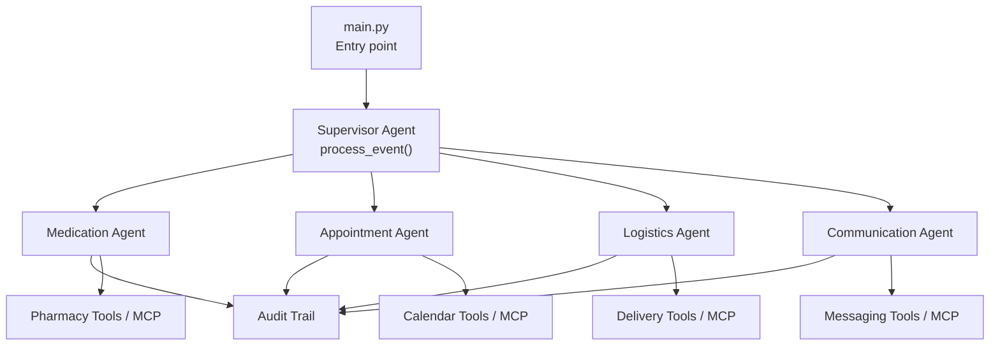
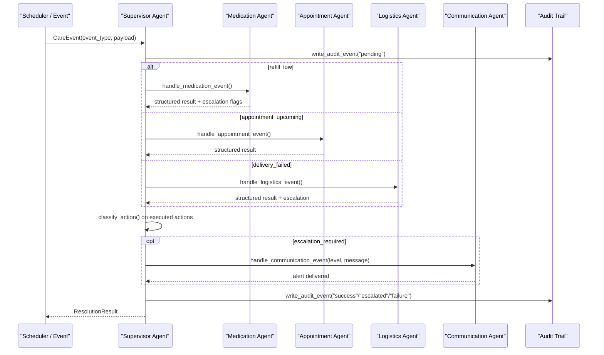
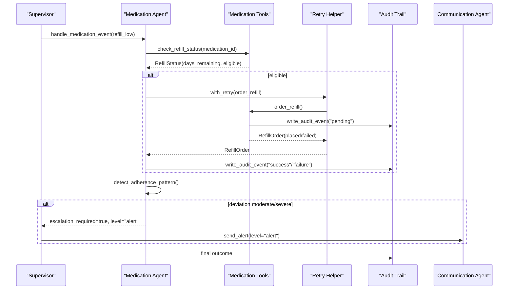
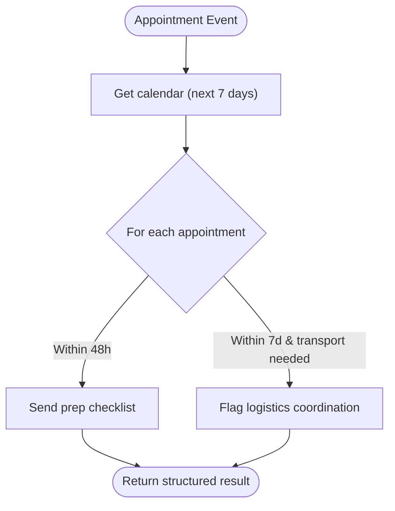
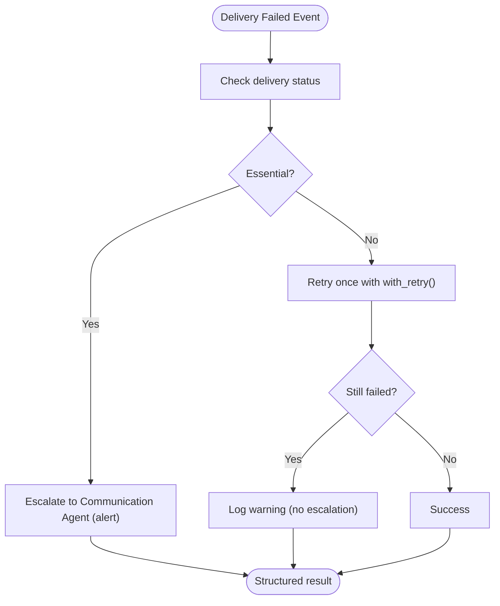
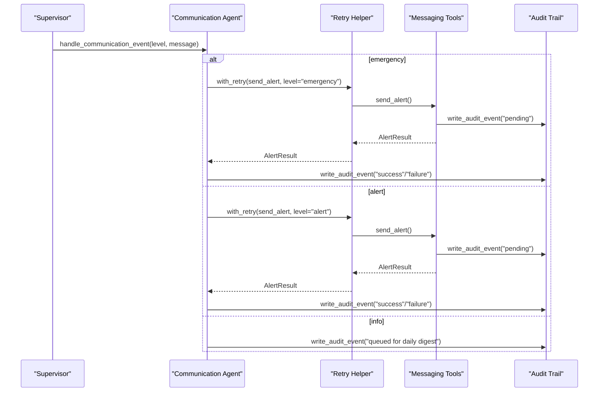
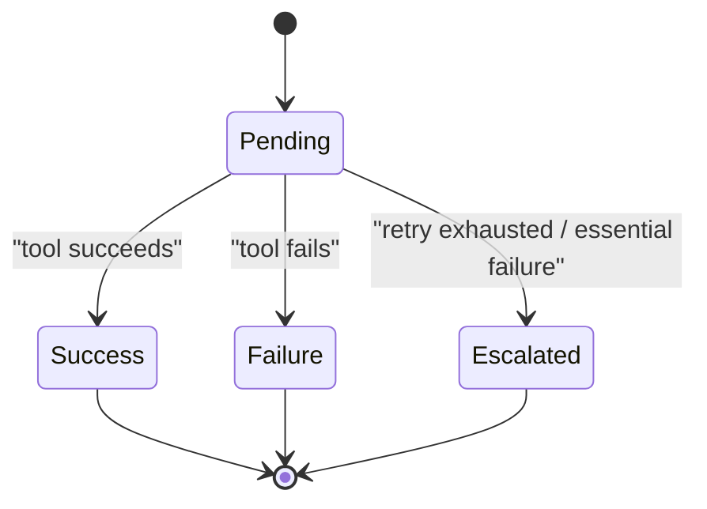
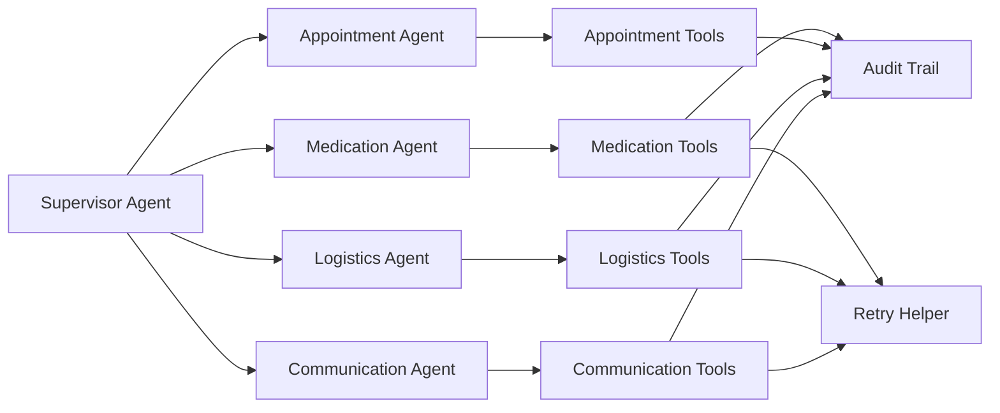

# Data Flow Patterns

<cite>
**Referenced Files in This Document**
- [main.py](file://main.py)
- [architecture.md](file://architecture.md)
- [AGENTS.md](file://AGENTS.md)
- [SPEC.md](file://SPEC.md)
- [src/agents/supervisor_agent.py](file://src/agents/supervisor_agent.py)
- [src/agents/medication_agent.py](file://src/agents/medication_agent.py)
- [src/agents/appointment_agent.py](file://src/agents/appointment_agent.py)
- [src/agents/logistics_agent.py](file://src/agents/logistics_agent.py)
- [src/agents/communication_agent.py](file://src/agents/communication_agent.py)
- [src/models/schemas.py](file://src/models/schemas.py)
- [src/models/escalation_logic.py](file://src/models/escalation_logic.py)
- [src/models/audit_log.py](file://src/models/audit_log.py)
- [src/tools/retry.py](file://src/tools/retry.py)
- [src/tools/medication_tools.py](file://src/tools/medication_tools.py)
- [src/tools/logistics_tools.py](file://src/tools/logistics_tools.py)
</cite>

## Table of Contents
1. Introduction
2. Project Structure
3. Core Components
4. Architecture Overview
5. Detailed Component Analysis
6. Dependency Analysis
7. Performance Considerations
8. Troubleshooting Guide
9. Conclusion

## Introduction
This document explains CareBridge’s event-driven data flow patterns that govern how care events move from detection to resolution. It covers happy paths for medication refills, appointment coordination, and delivery management; exception paths including retries, exponential backoff, and escalation; sequence diagrams of interactions among the supervisor, specialized agents, audit trail, and external services; examples of workflows, state transitions, and error handling; and performance considerations for concurrency, queuing, and scalability.

## Project Structure
CareBridge is organized around a Supervisor Agent that routes events to specialized agents (Medication, Appointment, Logistics, Communication). Each agent owns tools that interact with external systems via MCP or fixtures. All actions are classified deterministically and recorded in an immutable audit trail before execution. The entry point initializes the system, loads fixtures, creates the Supervisor (with graceful fallback), and runs demo scenarios.

**Diagram sources**
- [main.py:92-171](file://main.py#L92-L171)
- [src/agents/supervisor_agent.py:285-395](file://src/agents/supervisor_agent.py#L285-L395)
- [src/agents/medication_agent.py:23-134](file://src/agents/medication_agent.py#L23-L134)
- [src/agents/appointment_agent.py:74-172](file://src/agents/appointment_agent.py#L74-L172)
- [src/agents/logistics_agent.py:182-235](file://src/agents/logistics_agent.py#L182-L235)
- [src/agents/communication_agent.py:28-115](file://src/agents/communication_agent.py#L28-L115)

**Section sources**
- [main.py:1-182](file://main.py#L1-L182)
- [architecture.md:10-75](file://architecture.md#L10-L75)

## Core Components
- Supervisor Agent: Orchestrates routing, deterministic escalation, and audit-first processing. Provides process_event(), query_status(), approve_pending_action(), and Strands wiring.
- Specialized Agents:
  - Medication Agent: Refill checks, refill ordering with retry, adherence pattern detection.
  - Appointment Agent: Calendar retrieval, prep checklist dispatch, transport flagging.
  - Logistics Agent: Delivery status checks, failure handling with escalation rules, retry for non-essential deliveries.
  - Communication Agent: Alerting by level (info/alert/emergency), family preferences, status synthesis.
- Models and Policies:
  - Schemas define all inter-agent contracts (CareEvent, ResolutionResult, etc.).
  - Escalation logic classifies actions deterministically into auto/alert/approve.
- Audit Trail: Immutable SQLite table with triggers preventing updates/deletes; every action writes a “before” pending event then a follow-up outcome.
- Retry Utility: Shared with_retry() helper implementing 3 attempts with exponential backoff (1s, 2s, 4s).

**Section sources**
- [src/agents/supervisor_agent.py:17-109](file://src/agents/supervisor_agent.py#L17-L109)
- [src/agents/medication_agent.py:23-134](file://src/agents/medication_agent.py#L23-L134)
- [src/agents/appointment_agent.py:74-172](file://src/agents/appointment_agent.py#L74-L172)
- [src/agents/logistics_agent.py:182-235](file://src/agents/logistics_agent.py#L182-L235)
- [src/agents/communication_agent.py:28-115](file://src/agents/communication_agent.py#L28-L115)
- [src/models/schemas.py:56-149](file://src/models/schemas.py#L56-L149)
- [src/models/escalation_logic.py:13-71](file://src/models/escalation_logic.py#L13-L71)
- [src/models/audit_log.py:19-130](file://src/models/audit_log.py#L19-L130)
- [src/tools/retry.py:22-69](file://src/tools/retry.py#L22-L69)

## Architecture Overview
CareBridge uses an agents-as-tools pattern where the Supervisor delegates to specialized agents. External integrations are accessed through MCP servers (in-process SDK for pharmacy, messaging, delivery; SSE for calendar). Every action is classified deterministically and audited before execution.

**Diagram sources**
- [src/agents/supervisor_agent.py:285-395](file://src/agents/supervisor_agent.py#L285-L395)
- [src/agents/medication_agent.py:23-134](file://src/agents/medication_agent.py#L23-L134)
- [src/agents/appointment_agent.py:74-172](file://src/agents/appointment_agent.py#L74-L172)
- [src/agents/logistics_agent.py:182-235](file://src/agents/logistics_agent.py#L182-L235)
- [src/agents/communication_agent.py:28-115](file://src/agents/communication_agent.py#L28-L115)
- [src/models/escalation_logic.py:42-71](file://src/models/escalation_logic.py#L42-L71)
- [src/models/audit_log.py:81-130](file://src/models/audit_log.py#L81-L130)

## Detailed Component Analysis

### Medication Refill Happy Path
- Detection: Scheduler emits refill_low event with medication_id.
- Routing: Supervisor routes to Medication Agent.
- Processing:
  - Check refill status against threshold.
  - If eligible, order refill using shared retry helper.
  - Detect adherence patterns; moderate/severe deviations trigger alerts.
- Escalation: Deterministic classification marks order_refill as alert-level; if failures exhaust retries, escalate to Communication Agent.
- Audit: Before-action pending event written before any tool call; follow-up records success/failure/escalated.

**Diagram sources**
- [src/agents/medication_agent.py:23-134](file://src/agents/medication_agent.py#L23-L134)
- [src/tools/medication_tools.py:65-152](file://src/tools/medication_tools.py#L65-L152)
- [src/tools/retry.py:22-69](file://src/tools/retry.py#L22-L69)
- [src/models/audit_log.py:81-130](file://src/models/audit_log.py#L81-L130)
- [src/agents/communication_agent.py:28-115](file://src/agents/communication_agent.py#L28-L115)

**Section sources**
- [src/agents/medication_agent.py:23-134](file://src/agents/medication_agent.py#L23-L134)
- [src/tools/medication_tools.py:34-152](file://src/tools/medication_tools.py#L34-L152)
- [src/models/escalation_logic.py:21-26](file://src/models/escalation_logic.py#L21-L26)

### Appointment Coordination Happy Path
- Detection: appointment_upcoming event within near-term window.
- Routing: Supervisor routes to Appointment Agent.
- Processing:
  - Retrieve calendar for next 7 days.
  - For appointments within 48 hours, send prep checklist.
  - For appointments within 7 days requiring transportation, flag logistics coordination.
- Escalation: Typically auto; no escalation unless downstream failures occur.
- Audit: Calendar retrieval and checklist sending logged.

**Diagram sources**
- [src/agents/appointment_agent.py:74-172](file://src/agents/appointment_agent.py#L74-L172)

**Section sources**
- [src/agents/appointment_agent.py:74-172](file://src/agents/appointment_agent.py#L74-L172)

### Delivery Management Happy Path and Exception Handling
- Detection: delivery_failed event with delivery_id.
- Routing: Supervisor routes to Logistics Agent.
- Processing:
  - Check current delivery status.
  - Infer delivery type from fixtures; essential vs non-essential.
  - Essential failure → immediate escalation to Communication Agent.
  - Non-essential failure → retry once; if still failed, log warning.
- Escalation: Essential failures escalate at alert level; non-essential failures do not escalate after single retry.
- Audit: Status checks, escalations, retries, and outcomes recorded.

**Diagram sources**
- [src/agents/logistics_agent.py:23-152](file://src/agents/logistics_agent.py#L23-L152)
- [src/tools/logistics_tools.py:23-53](file://src/tools/logistics_tools.py#L23-L53)
- [src/tools/retry.py:22-69](file://src/tools/retry.py#L22-L69)

**Section sources**
- [src/agents/logistics_agent.py:182-235](file://src/agents/logistics_agent.py#L182-L235)
- [src/tools/logistics_tools.py:23-53](file://src/tools/logistics_tools.py#L23-L53)

### Communication and Escalation Flow
- Levels: info (batch digest), alert (SMS primary caregiver, email others), emergency (all channels, all family members).
- Retry: Alerts use shared retry helper; exhaustion raises RetryExhausted and is captured by the caller.
- Audit: Every alert attempt and outcome recorded.

**Diagram sources**
- [src/agents/communication_agent.py:28-115](file://src/agents/communication_agent.py#L28-L115)
- [src/tools/retry.py:22-69](file://src/tools/retry.py#L22-L69)
- [src/models/audit_log.py:81-130](file://src/models/audit_log.py#L81-L130)

**Section sources**
- [src/agents/communication_agent.py:28-115](file://src/agents/communication_agent.py#L28-L115)
- [AGENTS.md:130-163](file://AGENTS.md#L130-L163)

### State Transitions and Error Handling Patterns
- States: pending → success/failure/escalated.
- Errors:
  - Tool exceptions caught, logged, and followed by failure audit entries.
  - RetryExhausted raised when all attempts fail; callers convert to escalation or warnings per policy.
  - Unknown action types default to approve for safety.

**Diagram sources**
- [src/models/audit_log.py:19-130](file://src/models/audit_log.py#L19-L130)
- [src/tools/retry.py:22-69](file://src/tools/retry.py#L22-L69)
- [src/models/escalation_logic.py:42-71](file://src/models/escalation_logic.py#L42-L71)

**Section sources**
- [src/models/escalation_logic.py:42-71](file://src/models/escalation_logic.py#L42-L71)
- [src/tools/retry.py:22-69](file://src/tools/retry.py#L22-L69)

## Dependency Analysis
The system exhibits clear separation of concerns:
- Supervisor depends on agent handlers and deterministic escalation logic.
- Agents depend on their respective tools and shared utilities (retry, audit).
- Tools depend on fixtures/MCP and audit logging.
- No direct agent-to-agent calls; all cross-agent coordination goes through the Supervisor.

**Diagram sources**
- [src/agents/supervisor_agent.py:285-395](file://src/agents/supervisor_agent.py#L285-L395)
- [src/agents/medication_agent.py:23-134](file://src/agents/medication_agent.py#L23-L134)
- [src/agents/appointment_agent.py:74-172](file://src/agents/appointment_agent.py#L74-L172)
- [src/agents/logistics_agent.py:182-235](file://src/agents/logistics_agent.py#L182-L235)
- [src/agents/communication_agent.py:28-115](file://src/agents/communication_agent.py#L28-L115)
- [src/tools/retry.py:22-69](file://src/tools/retry.py#L22-L69)
- [src/models/audit_log.py:81-130](file://src/models/audit_log.py#L81-L130)

**Section sources**
- [AGENTS.md:25-33](file://AGENTS.md#L25-L33)
- [architecture.md:168-208](file://architecture.md#L168-L208)

## Performance Considerations
- Concurrency:
  - Async tool functions enable concurrent I/O-bound operations (e.g., multiple calendar fetches or alert sends).
  - Supervisor processes one event at a time per invocation; scale horizontally by running multiple processes or workers.
- Message Queuing:
  - Current implementation is in-process; for production, consider an external queue (e.g., Redis/RabbitMQ) to decouple event ingestion from processing.
  - Use correlation IDs to maintain traceability across queued messages.
- Scalability Patterns:
  - Horizontal scaling of Supervisor instances behind a load balancer.
  - Partition by care_recipient_id to avoid contention on shared state.
  - Batch info-level alerts into daily digests to reduce messaging overhead.
- Observability:
  - Leverage audit trail and logs for metrics (latency, failure rates, escalation frequency).
  - Add structured logging with correlation IDs for distributed tracing.

[No sources needed since this section provides general guidance]

## Troubleshooting Guide
Common issues and resolutions:
- Missing fixture files: Ensure required JSON fixtures exist; main.py validates presence at startup.
- Audit DB errors: Verify database initialization and permissions; immutability triggers prevent accidental modifications.
- Retry exhaustion: Inspect last_exception in RetryExhausted; confirm external service health and adjust thresholds if necessary.
- Escalation loops: Validate escalation logic inputs; ensure emergency triggers are correctly set in event payloads.
- Messaging failures: Confirm messaging MCP availability; fallback queues alerts in dashboard per policy.

**Section sources**
- [main.py:45-63](file://main.py#L45-L63)
- [src/models/audit_log.py:19-78](file://src/models/audit_log.py#L19-L78)
- [src/tools/retry.py:22-69](file://src/tools/retry.py#L22-L69)
- [AGENTS.md:154-163](file://AGENTS.md#L154-L163)

## Conclusion
CareBridge implements a robust, deterministic, and auditable event-driven architecture. The Supervisor orchestrates specialized agents, enforces strict boundaries, and ensures every action is classified and recorded before execution. Retry mechanisms with exponential backoff and clear escalation procedures provide resilience. The design supports horizontal scaling and can be extended with external message queues for higher throughput. The immutable audit trail guarantees traceability and compliance readiness.

[No sources needed since this section summarizes without analyzing specific files]