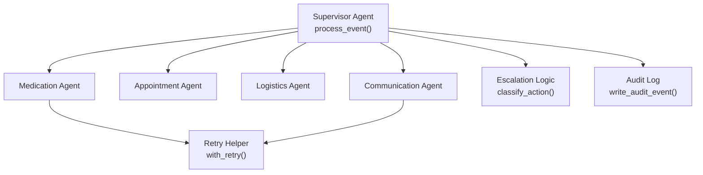
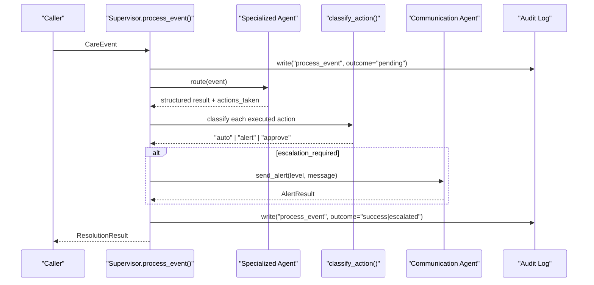
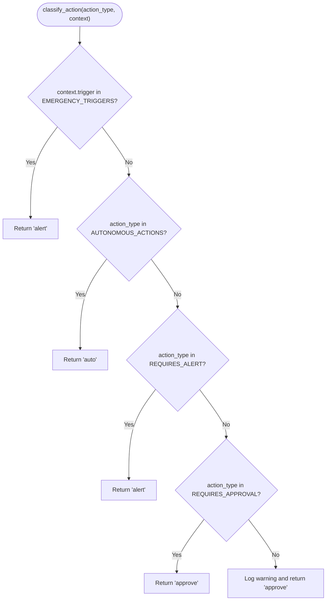
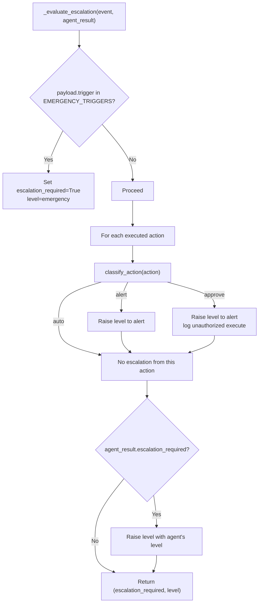
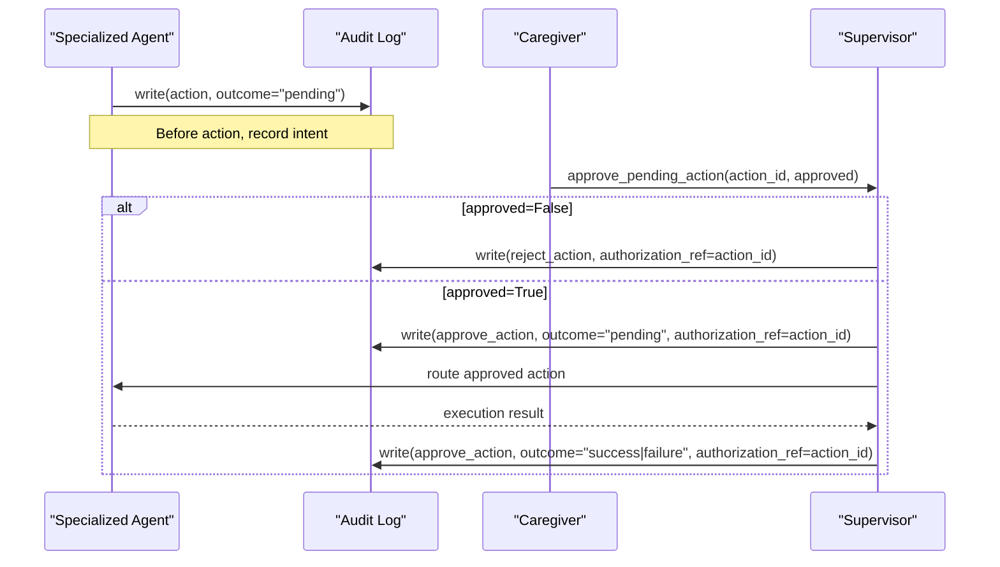
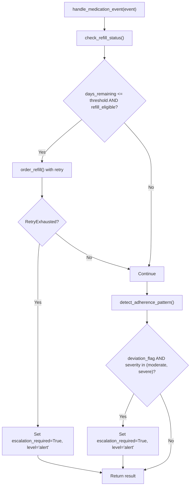
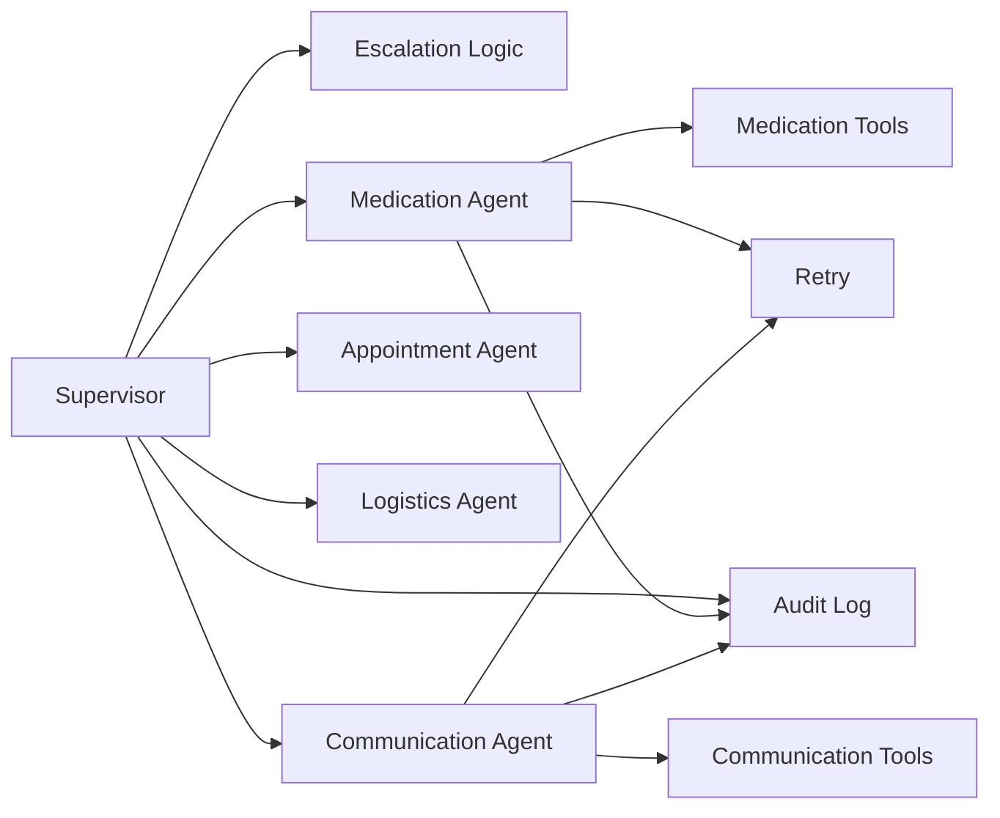
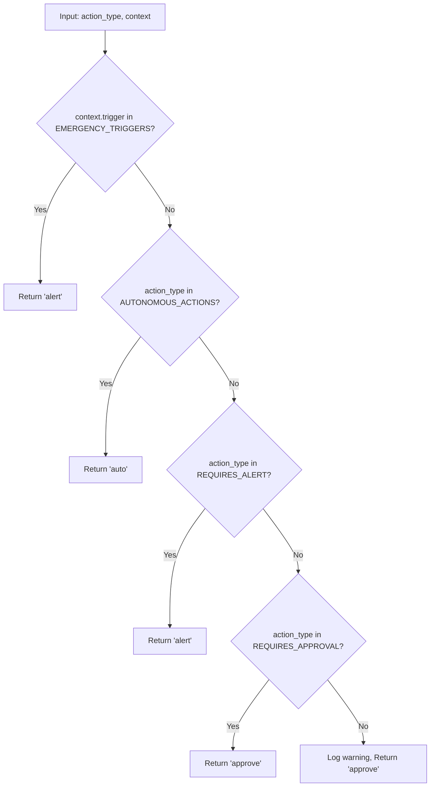
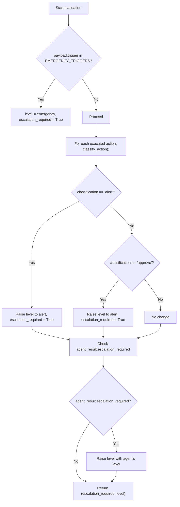

# Escalation Logic

<cite>
**Referenced Files in This Document**
- [escalation_logic.py](file://src/models/escalation_logic.py)
- [supervisor_agent.py](file://src/agents/supervisor_agent.py)
- [schemas.py](file://src/models/schemas.py)
- [audit_log.py](file://src/models/audit_log.py)
- [medication_agent.py](file://src/agents/medication_agent.py)
- [communication_agent.py](file://src/agents/communication_agent.py)
- [retry.py](file://src/tools/retry.py)
- [test_escalation_flow.py](file://tests/integration/test_escalation_flow.py)
- [test_approval_flow.py](file://tests/integration/test_approval_flow.py)
- [SPEC.md](file://SPEC.md)
- [AGENTS.md](file://AGENTS.md)
</cite>

## Table of Contents
1. Introduction
2. Project Structure
3. Core Components
4. Architecture Overview
5. Detailed Component Analysis
6. Dependency Analysis
7. Performance Considerations
8. Troubleshooting Guide
9. Conclusion
10. Appendices

## Introduction
This document explains CareBridge’s deterministic escalation logic that classifies actions as auto, alert, or approve based on safety-critical business rules. The system uses pure Python code (no LLM calls) to make escalation decisions, ensuring behavior is auditable and testable. It covers classification criteria for care events and severity levels, the integration with the human approval workflow, example scenarios, rule definitions, decision trees, edge case handling, consistency across agents, and audit trail guarantees.

## Project Structure
CareBridge implements a multi-agent architecture orchestrated by a Supervisor Agent. Specialized agents handle domain tasks (medication, appointment, logistics, communication). Escalation decisions are centralized and deterministic via a dedicated module. All actions are recorded in an immutable SQLite audit log.

**Diagram sources**
- [supervisor_agent.py:285-395](file://src/agents/supervisor_agent.py#L285-L395)
- [escalation_logic.py:42-70](file://src/models/escalation_logic.py#L42-L70)
- [audit_log.py:81-128](file://src/models/audit_log.py#L81-L128)
- [retry.py:22-69](file://src/tools/retry.py#L22-L69)

**Section sources**
- [supervisor_agent.py:1-641](file://src/agents/supervisor_agent.py#L1-L641)
- [schemas.py:56-71](file://src/models/schemas.py#L56-L71)
- [audit_log.py:1-167](file://src/models/audit_log.py#L1-L167)

## Core Components
- Deterministic classifier: classify_action(action_type, context) returns "auto", "alert", or "approve" using hardcoded sets and emergency triggers. Unknown actions default to "approve" for safety.
- Supervisor escalation engine: combines three deterministic sources — hard-coded emergency triggers, classification of executed actions, and agent-reported escalation flags — to decide if escalation is required and at what level.
- Approval workflow: pending actions created before execution; human approval or rejection is logged and enforced; approved actions are routed back to the owning agent for execution.
- Immutable audit trail: every action writes a “before” event prior to execution; outcomes are appended as follow-up events; database triggers prevent updates/deletes.

Key data models used by the escalation system:
- CareEvent: incoming event type and payload.
- ResolutionResult: outcome including whether escalation was required and its level.
- PendingAction: represents a human-decision-gated action awaiting approval.

**Section sources**
- [escalation_logic.py:13-70](file://src/models/escalation_logic.py#L13-L70)
- [supervisor_agent.py:178-234](file://src/agents/supervisor_agent.py#L178-L234)
- [schemas.py:44-71](file://src/models/schemas.py#L44-L71)
- [audit_log.py:19-78](file://src/models/audit_log.py#L19-L78)

## Architecture Overview
The Supervisor is the single entry point for care events. It routes to specialized agents, evaluates escalation deterministically, and when needed, invokes the Communication Agent to notify family members. All steps are captured in the audit trail.

**Diagram sources**
- [supervisor_agent.py:285-395](file://src/agents/supervisor_agent.py#L285-L395)
- [escalation_logic.py:42-70](file://src/models/escalation_logic.py#L42-L70)
- [communication_agent.py:28-115](file://src/agents/communication_agent.py#L28-L115)
- [audit_log.py:81-128](file://src/models/audit_log.py#L81-L128)

## Detailed Component Analysis

### Deterministic Classification Engine
- Classifies actions into three categories:
  - Auto: read-only or low-risk operations (e.g., check_refill_status, get_calendar).
  - Alert: operational changes that warrant notification (e.g., order_refill, schedule_appointment).
  - Approve: high-risk changes requiring explicit human authorization (e.g., cancel_appointment, change_medication_schedule).
- Emergency triggers in context elevate minimum escalation to alert; combined with supervisor-level logic, they can escalate to emergency.

Decision flow:

**Diagram sources**
- [escalation_logic.py:42-70](file://src/models/escalation_logic.py#L42-L70)

**Section sources**
- [escalation_logic.py:13-70](file://src/models/escalation_logic.py#L13-L70)

### Supervisor Escalation Evaluation
The Supervisor composes escalation from three deterministic sources:
1. Hard-coded emergency triggers from event payload.
2. Classification of actions actually executed during event handling.
3. Structured escalation flags returned by specialized agents.

It raises the escalation level using a strict ranking (info < alert < emergency) and ensures any APPROVE-category action executed without authorization escalates immediately.

**Diagram sources**
- [supervisor_agent.py:178-234](file://src/agents/supervisor_agent.py#L178-L234)

**Section sources**
- [supervisor_agent.py:178-234](file://src/agents/supervisor_agent.py#L178-L234)

### Human Approval Workflow
- Before executing any action in the APPROVE category, the system writes a “pending” audit event.
- A caregiver reviews and approves or rejects via approve_pending_action.
- Rejection logs a reject_action event and no execution occurs.
- Approval logs a human approve_action event, then re-dispatches the action to the owning agent for execution; results are logged with authorization_ref linking back to the original pending action.

**Diagram sources**
- [supervisor_agent.py:432-592](file://src/agents/supervisor_agent.py#L432-L592)
- [audit_log.py:81-128](file://src/models/audit_log.py#L81-L128)

**Section sources**
- [supervisor_agent.py:432-592](file://src/agents/supervisor_agent.py#L432-L592)
- [test_approval_flow.py:15-130](file://tests/integration/test_approval_flow.py#L15-L130)

### Medication Agent Escalation Triggers
- Refill ordering uses retry with exponential backoff; exhaustion triggers escalation to alert.
- Adherence deviations flagged as moderate or severe trigger escalation to alert.
- These agent-level signals feed into the Supervisor’s evaluation to determine final escalation.

**Diagram sources**
- [medication_agent.py:23-134](file://src/agents/medication_agent.py#L23-L134)
- [retry.py:22-69](file://src/tools/retry.py#L22-L69)

**Section sources**
- [medication_agent.py:23-134](file://src/agents/medication_agent.py#L23-L134)
- [retry.py:22-69](file://src/tools/retry.py#L22-L69)

### Communication Agent Notification Routing
- Based on level:
  - emergency: SMS + email + phone to all family members.
  - alert: SMS to primary caregiver, email to others.
  - info: batch into daily digest.
- Uses retry helper for messaging; failures are logged and escalated.

**Section sources**
- [communication_agent.py:28-115](file://src/agents/communication_agent.py#L28-L115)
- [communication_tools.py:54-157](file://src/tools/communication_tools.py#L54-L157)

## Dependency Analysis
- Supervisor depends on:
  - Escalation Logic for deterministic classification.
  - Specialized Agents for domain work.
  - Audit Log for immutability and traceability.
  - Retry utility for resilient external calls.
- Agents depend on:
  - Tools implementing domain functions.
  - Audit Log for pre/post action records.
  - Retry utility for robustness.
- Tests validate end-to-end flows for escalation and approvals.

**Diagram sources**
- [supervisor_agent.py:21-39](file://src/agents/supervisor_agent.py#L21-L39)
- [medication_agent.py:7-16](file://src/agents/medication_agent.py#L7-L16)
- [communication_agent.py:10-23](file://src/agents/communication_agent.py#L10-L23)
- [audit_log.py:81-128](file://src/models/audit_log.py#L81-L128)
- [retry.py:22-69](file://src/tools/retry.py#L22-L69)

**Section sources**
- [supervisor_agent.py:1-641](file://src/agents/supervisor_agent.py#L1-L641)
- [medication_agent.py:1-189](file://src/agents/medication_agent.py#L1-L189)
- [communication_agent.py:1-163](file://src/agents/communication_agent.py#L1-L163)
- [audit_log.py:1-167](file://src/models/audit_log.py#L1-L167)
- [retry.py:1-70](file://src/tools/retry.py#L1-L70)

## Performance Considerations
- Retry policy: 3 attempts with exponential backoff (1s, 2s, 4s) to reduce transient failures while bounding latency.
- Deterministic classification avoids non-deterministic LLM calls, keeping escalation decisions fast and consistent.
- Audit log writes occur before execution; ensure DB initialization happens once per process to avoid overhead.
- Communication alerts use retry; failures are surfaced quickly to maintain visibility.

[No sources needed since this section provides general guidance]

## Troubleshooting Guide
Common issues and how the system handles them:
- External API failure:
  - Retry helper retries up to 3 times; on exhaustion, raises RetryExhausted which agents catch and set escalation_required=True with level="alert".
- Messaging delivery failure:
  - Communication tools log failure and raise RuntimeError; retry wrapper surfaces RetryExhausted; Supervisor logs error and includes failure in actions_taken.
- Unknown action types:
  - classify_action defaults to "approve" and logs a warning; Supervisor treats this as needing human review.
- Missing medication_id:
  - Medication agent returns early with error action and no escalation.
- Approval not found or already resolved:
  - approve_pending_action raises ValueError; tests assert these constraints.

Validation via tests:
- Escalation flow verifies retry exhaustion leads to escalation and audit entries marked "escalated".
- Approval flow verifies pending → approve/reject → execution or rejection, with authorization_ref linkage.

**Section sources**
- [retry.py:14-69](file://src/tools/retry.py#L14-L69)
- [medication_agent.py:43-134](file://src/agents/medication_agent.py#L43-L134)
- [communication_agent.py:55-115](file://src/agents/communication_agent.py#L55-L115)
- [test_escalation_flow.py:16-97](file://tests/integration/test_escalation_flow.py#L16-L97)
- [test_approval_flow.py:15-130](file://tests/integration/test_approval_flow.py#L15-L130)

## Conclusion
CareBridge’s escalation system is built on deterministic, auditable rules implemented in pure Python. The Supervisor orchestrates routing, applies strict escalation logic combining emergency triggers, action classification, and agent signals, and integrates a human approval workflow for high-risk actions. The immutable audit trail ensures full traceability, while retry mechanisms and clear escalation paths provide resilience and visibility. This design guarantees consistent behavior across agents and environments, enabling safe, testable, and compliant care coordination.

[No sources needed since this section summarizes without analyzing specific files]

## Appendices

### Classification Criteria Summary
- Auto: check_refill_status, check_delivery_status, get_calendar, synthesize_status, send_daily_digest.
- Alert: order_refill, order_grocery, schedule_appointment, order_pharmacy_delivery.
- Approve: cancel_appointment, change_medication_schedule, add_service_provider, modify_health_record.
- Emergency triggers: fall_detection, emergency_room_visit, critical_medication_interaction.

**Section sources**
- [escalation_logic.py:13-39](file://src/models/escalation_logic.py#L13-L39)
- [AGENTS.md:130-151](file://AGENTS.md#L130-L151)
- [SPEC.md:320-361](file://SPEC.md#L320-L361)

### Decision Trees

#### Action Classification Tree

**Diagram sources**
- [escalation_logic.py:42-70](file://src/models/escalation_logic.py#L42-L70)

#### Escalation Level Decision Tree

**Diagram sources**
- [supervisor_agent.py:178-234](file://src/agents/supervisor_agent.py#L178-L234)

### Example Scenarios
- Refill low with pharmacy API down:
  - Medication agent attempts order_refill with retry; exhaustion triggers escalation to alert; Supervisor routes to Communication Agent; audit trail contains "escalated" outcome.
- Essential delivery failure:
  - Logistics reports failure; Supervisor escalates to alert; Communication Agent sends family alert; audit trail shows escalation.
- Adherence deviation (moderate):
  - Medication agent detects deviation_flag=True and severity=moderate; Supervisor escalates to alert; family notified.
- Pending action approval:
  - System writes pending audit event; caregiver approves; Supervisor executes via owning agent; audit trail links approval to execution via authorization_ref.

**Section sources**
- [test_escalation_flow.py:16-97](file://tests/integration/test_escalation_flow.py#L16-L97)
- [test_approval_flow.py:15-130](file://tests/integration/test_approval_flow.py#L15-L130)
- [medication_agent.py:73-134](file://src/agents/medication_agent.py#L73-L134)
- [supervisor_agent.py:285-395](file://src/agents/supervisor_agent.py#L285-L395)