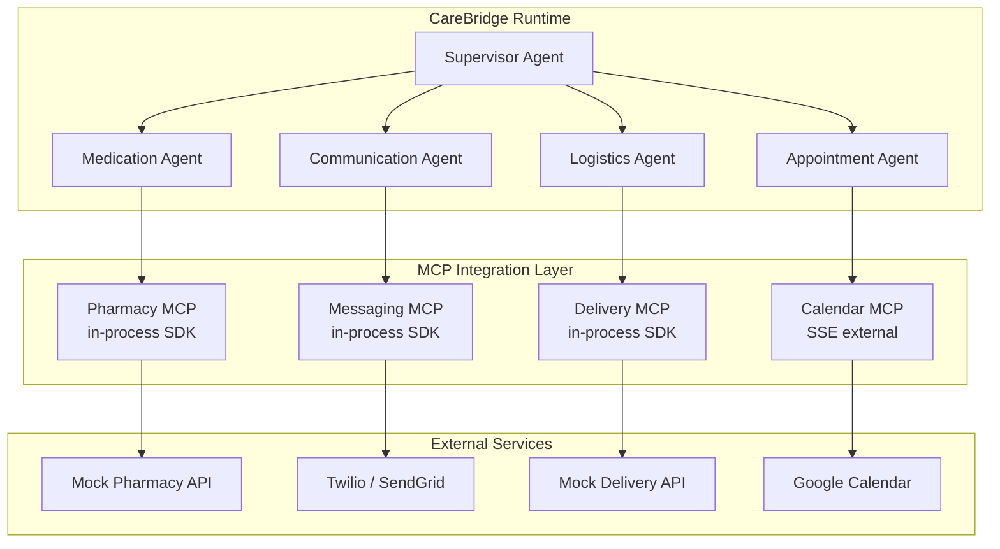
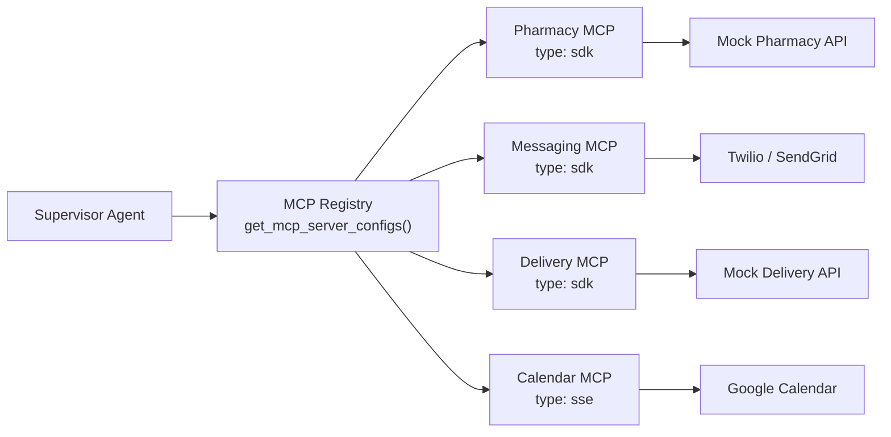
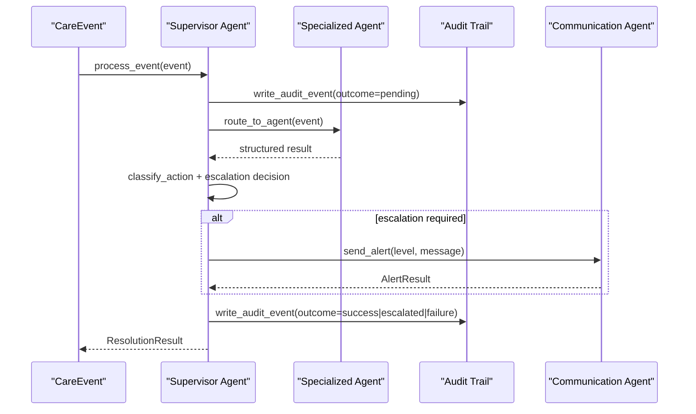
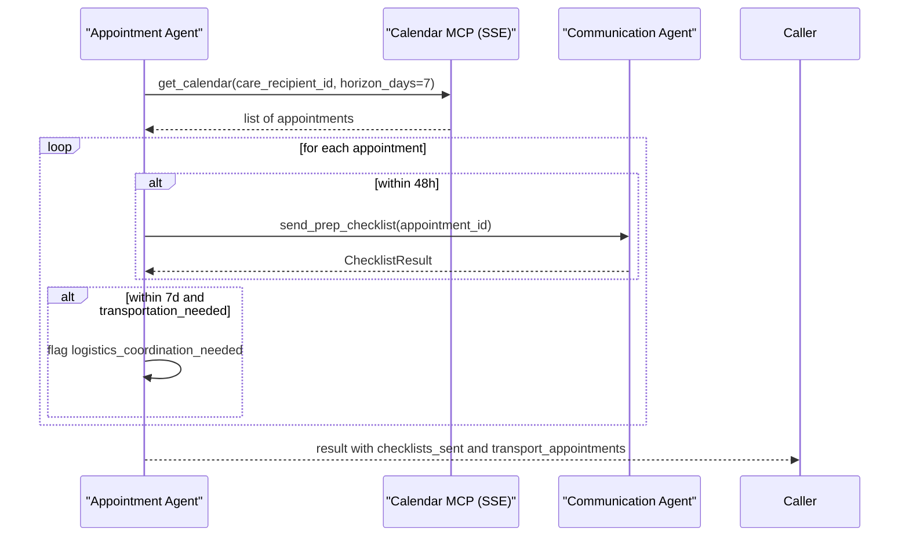
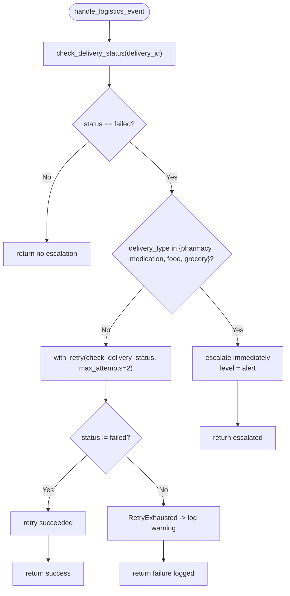
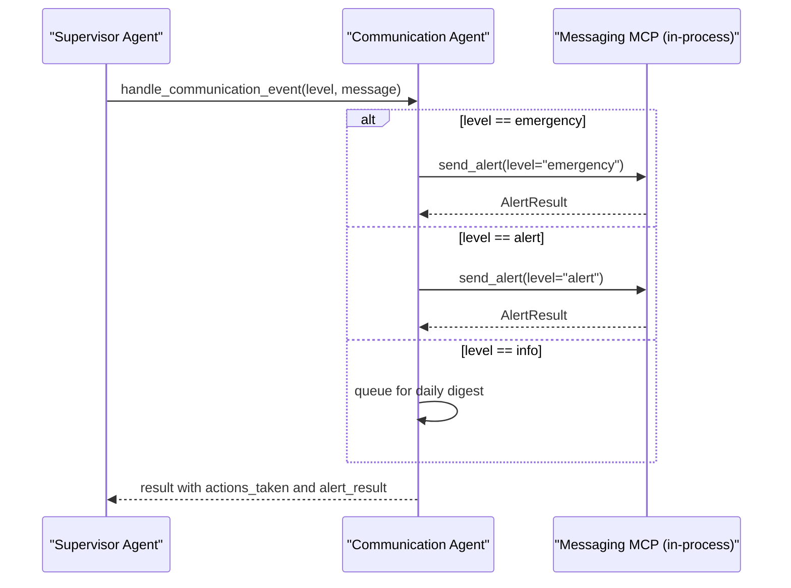
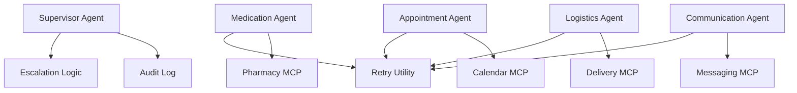

# MCP Integration Layer

<cite>
**Referenced Files in This Document**
- [architecture.md](file://architecture.md)
- [main.py](file://main.py)
- [supervisor_agent.py](file://src/agents/supervisor_agent.py)
- [medication_agent.py](file://src/agents/medication_agent.py)
- [appointment_agent.py](file://src/agents/appointment_agent.py)
- [logistics_agent.py](file://src/agents/logistics_agent.py)
- [communication_agent.py](file://src/agents/communication_agent.py)
- [retry.py](file://src/tools/retry.py)
- [pharmacy_server.py](file://src/mcp/pharmacy_server.py)
- [messaging_server.py](file://src/mcp/messaging_server.py)
- [delivery_server.py](file://src/mcp/delivery_server.py)
- [calendar_server.py](file://src/mcp/calendar_server.py)
- [mcp.py](file://src/api/routers/mcp.py)
- [schemas.py](file://src/api/schemas.py)
</cite>

## Update Summary
**Changes Made**
- Enhanced documentation to reflect the complete implementation of four specialized MCP servers (Pharmacy, Messaging, Delivery, Calendar)
- Added detailed coverage of in-process SDK architecture and SSE external transport patterns
- Updated examples to show actual server implementations and tool registration patterns
- Expanded security considerations for external integrations and PII handling
- Added comprehensive troubleshooting guidance for MCP server failures and fallback strategies

## Table of Contents
1. [Introduction](#introduction)
2. [Project Structure](#project-structure)
3. [Core Components](#core-components)
4. [Architecture Overview](#architecture-overview)
5. [Detailed Component Analysis](#detailed-component-analysis)
6. [Dependency Analysis](#dependency-analysis)
7. [Performance Considerations](#performance-considerations)
8. [Security & Compliance](#security--compliance)
9. [Troubleshooting Guide](#troubleshooting-guide)
10. [Conclusion](#conclusion)
11. [Appendices](#appendices)

## Introduction
This document explains CareBridge's Model Context Protocol (MCP) integration layer that connects the system to external services through in-process SDKs and an SSE transport. The implementation features four specialized MCP servers—Pharmacy, Messaging, Delivery, and Calendar—that enable supervisor agent coordination with external systems while maintaining strict audit trails and deterministic escalation logic.

The architecture supports different transport mechanisms based on service requirements: in-process SDK servers for Pharmacy, Messaging, and Delivery provide zero subprocess overhead and direct access to shared Python state, while the Calendar server uses SSE external transport via Qoder Connector for managed endpoint access. Configuration is expressed through a centralized registry pattern that enables flexible server registration and connection parameters.

Key benefits of this in-process MCP approach include zero subprocess overhead, direct access to shared Python state, simplified debugging, and consistent audit logging across all external integrations. The system provides robust fallback strategies for service failures, ensuring care coordination continues even when external services are unavailable.

## Project Structure
CareBridge organizes its runtime around a Supervisor Agent that routes care events to specialized agents. Each agent coordinates domain-specific work and integrates with MCP-backed tools or services. The MCP integration layer abstracts external integrations behind consistent tool interfaces while allowing different transports per server:



**Diagram sources**
- [architecture.md:211-226](file://architecture.md#L211-L226)

**Section sources**
- [architecture.md:211-262](file://architecture.md#L211-L262)
- [main.py:143-177](file://main.py#L143-L177)

## Core Components
The MCP integration layer consists of four specialized servers, each designed for specific care coordination domains:

### Specialized MCP Servers
- **Pharmacy MCP**: Handles medication refills, status checks, and schedule management with 10% simulated failure rate for retry testing
- **Messaging MCP**: Provides SMS and email delivery with validation for escalation levels (info/alert/emergency) and message persistence
- **Delivery MCP**: Manages grocery and pharmacy deliveries with essential vs non-essential routing logic and 15% simulated failure rate
- **Calendar MCP**: Offers appointment scheduling and retrieval with SSE external transport via Qoder Connector

### Key Responsibilities and Boundaries
Each server implements the same architectural pattern: typed business functions with thin async adapters, comprehensive audit logging, and consistent error handling. The servers maintain strict separation between business logic and transport concerns, enabling easy swapping between mock implementations and production connectors.

**Section sources**
- [pharmacy_server.py:1-398](file://src/mcp/pharmacy_server.py#L1-L398)
- [messaging_server.py:1-263](file://src/mcp/messaging_server.py#L1-L263)
- [delivery_server.py:1-418](file://src/mcp/delivery_server.py#L1-L418)
- [calendar_server.py:1-279](file://src/mcp/calendar_server.py#L1-L279)

## Architecture Overview
The MCP integration layer sits between CareBridge agents and external services, providing a unified interface regardless of underlying transport mechanism. The architecture emphasizes consistency, reliability, and observability across all integrations.



**Diagram sources**
- [architecture.md:211-226](file://architecture.md#L211-L226)
- [architecture.md:244-259](file://architecture.md#L244-L259)

**Section sources**
- [architecture.md:211-262](file://architecture.md#L211-L262)

## Detailed Component Analysis

### MCP Server Registration and Transport Selection
The system uses a centralized registry pattern for MCP server management. All four servers are registered in `src/mcp/__init__.py` and accessible through `get_mcp_server_configs()` function. The registry provides both individual server access via `get_server(name)` and bulk configuration retrieval.

Transport selection follows strategic principles:
- **In-process SDK**: Used for Pharmacy, Messaging, and Delivery servers to eliminate subprocess overhead and enable direct access to shared Python state (audit log, fixtures)
- **SSE External**: Used for Calendar server to leverage existing Qoder Connector infrastructure without additional lifecycle management

Configuration example structure:
```json
{
  "mcpServers": {
    "pharmacy":  { "type": "sdk" },
    "messaging": { "type": "sdk" },
    "delivery":  { "type": "sdk" },
    "calendar":  {
      "type": "sse",
      "url": "https://mcp.carebridge.dev/calendar",
      "headers": { "Authorization": "Bearer ${CALENDAR_TOKEN}" }
    }
  }
}
```

**Section sources**
- [architecture.md:228-259](file://architecture.md#L228-L259)
- [__init__.py:45-96](file://src/mcp/__init__.py#L45-L96)

### Supervisor Agent and Event Routing
The Supervisor Agent orchestrates care events through deterministic routing and escalation logic. It maintains the complete MCP server configuration and ensures all external interactions flow through specialized agents rather than direct API calls.



**Diagram sources**
- [supervisor_agent.py:285-395](file://src/agents/supervisor_agent.py#L285-L395)

**Section sources**
- [supervisor_agent.py:285-395](file://src/agents/supervisor_agent.py#L285-L395)

### Pharmacy MCP Server Implementation
The Pharmacy server provides medication management capabilities with comprehensive retry logic and audit logging. It includes three core tools:

- **check_refill_status**: Reads medication refill status from fixtures with threshold-based eligibility determination
- **order_refill**: Places refill orders with 10% simulated timeout rate for retry testing
- **get_medication_schedule**: Retrieves medication schedules for care recipients

The server implements sophisticated error handling with `PharmacyTimeoutError` exceptions and uses the shared retry utility for resilient operation. Every tool call writes exactly one audit event with actor="medication".


**Diagram sources**
- [medication_agent.py:23-134](file://src/agents/medication_agent.py#L23-L134)
- [medication_agent.py:137-159](file://src/agents/medication_agent.py#L137-L159)
- [retry.py:22-69](file://src/tools/retry.py#L22-L69)

**Section sources**
- [pharmacy_server.py:139-330](file://src/mcp/pharmacy_server.py#L139-L330)
- [medication_agent.py:23-159](file://src/agents/medication_agent.py#L23-L159)
- [retry.py:22-69](file://src/tools/retry.py#L22-L69)

### Calendar MCP Server Implementation
The Calendar server provides appointment management through an in-process mock that simulates Google Calendar functionality. It offers two primary tools:

- **get_calendar**: Retrieves upcoming appointments within a configurable horizon (default 30 days)
- **schedule_appointment**: Confirms new appointments with provider information

The server reads from `fixtures/appointments.json` and implements comprehensive audit logging with actor="appointment". Error handling includes proper exception auditing and logging for troubleshooting.



**Diagram sources**
- [appointment_agent.py:74-172](file://src/agents/appointment_agent.py#L74-L172)

**Section sources**
- [calendar_server.py:104-220](file://src/mcp/calendar_server.py#L104-L220)
- [appointment_agent.py:74-172](file://src/agents/appointment_agent.py#L74-L172)

### Delivery MCP Server Implementation
The Delivery server manages both grocery and pharmacy deliveries with sophisticated failure handling and essential vs non-essential routing logic. It includes three core tools:

- **check_delivery_status**: Reads delivery status from fixtures with expected delivery time calculations
- **order_grocery**: Places grocery orders with 15% simulated failure rate
- **order_pharmacy_delivery**: Places pharmacy deliveries with automatic care recipient resolution

The server implements `DeliveryFailedError` exceptions and uses the shared retry utility for resilient operation. Essential deliveries (pharmacy, medication, food, grocery) escalate immediately, while non-essential deliveries retry once before logging warnings.



**Diagram sources**
- [logistics_agent.py:182-235](file://src/agents/logistics_agent.py#L182-L235)
- [logistics_agent.py:23-152](file://src/agents/logistics_agent.py#L23-L152)
- [retry.py:22-69](file://src/tools/retry.py#L22-L69)

**Section sources**
- [delivery_server.py:164-342](file://src/mcp/delivery_server.py#L164-L342)
- [logistics_agent.py:23-152](file://src/agents/logistics_agent.py#L23-L152)
- [logistics_agent.py:182-235](file://src/agents/logistics_agent.py#L182-L235)
- [retry.py:22-69](file://src/tools/retry.py#L22-L69)

### Messaging MCP Server Implementation
The Messaging server provides SMS and email delivery capabilities with strict validation and audit logging. It includes two core tools:

- **send_sms**: Delivers SMS messages with level validation (info/alert/emergency)
- **send_email**: Sends email messages with the same validation and persistence

The server validates escalation levels against allowed values and persists all messages to `logs/messages.log` with ISO timestamps. Every tool call writes exactly one audit event with actor="communication". Invalid levels trigger immediate rejection with audit logging.



**Diagram sources**
- [communication_agent.py:28-115](file://src/agents/communication_agent.py#L28-L115)
- [communication_agent.py:118-146](file://src/agents/communication_agent.py#L118-L146)
- [retry.py:22-69](file://src/tools/retry.py#L22-L69)

**Section sources**
- [messaging_server.py:180-214](file://src/mcp/messaging_server.py#L180-L214)
- [communication_agent.py:28-146](file://src/agents/communication_agent.py#L28-L146)
- [retry.py:22-69](file://src/tools/retry.py#L22-L69)

### Tool Registration Patterns and Service Integration
All MCP servers follow a consistent pattern of typed business functions with thin async adapters. This design preserves spec-compliant signatures while enabling MCP tool exposure through the Qoder SDK's decorator pattern.

Integration points across agents:
- **Medication Agent**: Uses pharmacy tools for refill checks and orders with retry wrapping
- **Appointment Agent**: Calls calendar tools for retrieval and scheduling with prep checklist generation
- **Logistics Agent**: Leverages delivery tools for status checking and order placement with essential/non-essential routing
- **Communication Agent**: Integrates messaging tools for alerts with level-based routing and daily digest queuing

**Section sources**
- [pharmacy_server.py:336-398](file://src/mcp/pharmacy_server.py#L336-L398)
- [messaging_server.py:220-263](file://src/mcp/messaging_server.py#L220-L263)
- [delivery_server.py:348-418](file://src/mcp/delivery_server.py#L348-L418)
- [calendar_server.py:226-279](file://src/mcp/calendar_server.py#L226-L279)

## Dependency Analysis
The dependency structure shows clear separation between agents, tools, and MCP servers. Agents depend on tools and shared utilities, while MCP servers abstract external services with consistent interfaces.



**Diagram sources**
- [supervisor_agent.py:285-395](file://src/agents/supervisor_agent.py#L285-L395)
- [medication_agent.py:23-159](file://src/agents/medication_agent.py#L23-L159)
- [appointment_agent.py:74-172](file://src/agents/appointment_agent.py#L74-L172)
- [logistics_agent.py:182-235](file://src/agents/logistics_agent.py#L182-L235)
- [communication_agent.py:28-146](file://src/agents/communication_agent.py#L28-L146)
- [retry.py:22-69](file://src/tools/retry.py#L22-L69)

**Section sources**
- [supervisor_agent.py:285-395](file://src/agents/supervisor_agent.py#L285-L395)
- [retry.py:22-69](file://src/tools/retry.py#L22-L69)

## Performance Considerations
The in-process MCP architecture provides significant performance advantages:

- **Zero Subprocess Overhead**: In-process SDK servers eliminate subprocess lifecycle management and IPC overhead
- **Direct State Access**: Shared Python state access enables efficient audit logging and fixture reading
- **Faster Startup**: No MCP handshake required for in-process servers
- **Simplified Debugging**: Single process execution enables straightforward debugging and profiling
- **Retry Optimization**: Exponential backoff reduces transient failure impact while maintaining responsiveness

The SSE external Calendar server leverages existing connector infrastructure, avoiding additional deployment complexity while maintaining the same tool contract.

## Security & Compliance
The MCP integration layer implements comprehensive security measures:

### PII Protection
- Delivery addresses are used for order placement but never written to audit trails or logs
- All audit events reference identifiers only, never raw PII
- Message logs contain recipient IDs but not personal contact information

### Audit Trail Integrity
- Every tool call writes exactly one audit event with correlation IDs
- Audit events include actor identification, action types, and outcomes
- Immutable audit trail prevents modification or deletion of records

### Validation and Authorization
- Strict input validation for all tool parameters
- Level validation for messaging (info/alert/emergency only)
- Deterministic escalation logic prevents LLM manipulation of safety-critical decisions

### Fallback Strategies
- Retry mechanisms with exponential backoff for transient failures
- Graceful degradation when external services are unavailable
- Comprehensive error logging and escalation for persistent failures

**Section sources**
- [delivery_server.py:19-21](file://src/mcp/delivery_server.py#L19-L21)
- [messaging_server.py:120-137](file://src/mcp/messaging_server.py#L120-L137)
- [pharmacy_server.py:73-95](file://src/mcp/pharmacy_server.py#L73-L95)

## Troubleshooting Guide
Common issues and their resolutions:

### Missing or Invalid Event Payloads
- Agents validate inputs and return structured error actions
- Ensure required fields are present in CareEvent payloads
- Check audit trail for validation failure details

### External Service Failures
- Retry utility wraps calls with exponential backoff (1s, 2s, 4s)
- After exhaustion, agents set escalation flags and log outcomes
- Monitor for `RetryExhausted` exceptions in logs

### Audit Trail Consistency
- Supervisor writes audit events before processing and after completion
- Failures are recorded with correlation IDs for tracing
- Verify audit database connectivity and permissions

### MCP Server Issues
- Use `/mcp/servers` endpoint to verify server registration and tool availability
- Check server-specific logs for initialization errors
- Validate configuration files for correct transport settings

### Fallback Strategies
- If messaging fails, alerts are retried and escalated
- If calendar retrieval fails, appointment handling returns gracefully with warnings
- System degrades to deterministic routing when LLM is unavailable

**Section sources**
- [supervisor_agent.py:695-737](file://src/agents/supervisor_agent.py#L695-L737)
- [pharmacy_server.py:185-195](file://src/mcp/pharmacy_server.py#L185-L195)
- [calendar_server.py:151-161](file://src/mcp/calendar_server.py#L151-L161)
- [delivery_server.py:212-222](file://src/mcp/delivery_server.py#L212-L222)
- [messaging_server.py:125-137](file://src/mcp/messaging_server.py#L125-L137)
- [mcp.py:53-80](file://src/api/routers/mcp.py#L53-L80)

## Conclusion
CareBridge's MCP integration layer provides a robust, high-performance bridge to external services through in-process SDKs and SSE transport. The implementation demonstrates best practices for care coordination systems, emphasizing deterministic escalation, audit-before-action patterns, and comprehensive retry strategies.

The four specialized MCP servers (Pharmacy, Messaging, Delivery, Calendar) enable seamless coordination between internal agents and external services while maintaining strict security, compliance, and reliability standards. The in-process architecture eliminates subprocess overhead while providing direct access to shared state, and the SSE external transport leverages existing connector infrastructure for optimal deployment flexibility.

Configuration through centralized registries and consistent tool patterns enables easy extension and maintenance, while comprehensive audit logging and fallback strategies ensure operational resilience in production environments.

## Appendices

### Example: MCP Server Setup and Tool Registration
Server registration follows a consistent pattern across all four MCP servers:

1. **Define typed business functions** with spec-compliant signatures
2. **Create async adapter functions** using `@tool` decorator
3. **Register server** with `create_sdk_mcp_server` including name, version, and tools list
4. **Export server config** through central registry

Example server configuration structure:
```python
pharmacy_server = create_sdk_mcp_server(
    name="pharmacy",
    version="1.0.0",
    tools=[
        _check_refill_status_tool,
        _order_refill_tool,
        _get_medication_schedule_tool,
    ],
)
```

**Section sources**
- [pharmacy_server.py:389-398](file://src/mcp/pharmacy_server.py#L389-L398)
- [messaging_server.py:258-263](file://src/mcp/messaging_server.py#L258-L263)
- [delivery_server.py:409-418](file://src/mcp/delivery_server.py#L409-L418)
- [calendar_server.py:274-279](file://src/mcp/calendar_server.py#L274-L279)

### Example: Service Integration Patterns
Integration patterns demonstrate consistent error handling and retry logic:

- **Medication Agent**: check_refill_status → order_refill (with retry) → adherence detection
- **Appointment Agent**: get_calendar → send_prep_checklist → logistics flagging  
- **Logistics Agent**: check_delivery_status → retry on failure → escalate if essential
- **Communication Agent**: send_alert (with retry) → queue info-level for digest

These patterns ensure reliable operation across varying external service conditions while maintaining audit trails and appropriate escalation paths.

**Section sources**
- [medication_agent.py:23-159](file://src/agents/medication_agent.py#L23-L159)
- [appointment_agent.py:74-172](file://src/agents/appointment_agent.py#L74-L172)
- [logistics_agent.py:182-235](file://src/agents/logistics_agent.py#L182-L235)
- [communication_agent.py:28-146](file://src/agents/communication_agent.py#L28-L146)

### Example: API Introspection Endpoint
The `/mcp/servers` endpoint provides runtime introspection of registered MCP servers:

```bash
curl -H "Authorization: Bearer <token>" http://localhost:8000/mcp/servers
```

Response format:
```json
{
  "count": 4,
  "servers": [
    {
      "name": "pharmacy",
      "type": "sdk",
      "tools": ["check_refill_status", "order_refill", "get_medication_schedule"]
    },
    // ... other servers
  ]
}
```

This endpoint is useful for monitoring server health and verifying tool availability at runtime.

**Section sources**
- [mcp.py:53-80](file://src/api/routers/mcp.py#L53-L80)
- [schemas.py:181-194](file://src/api/schemas.py#L181-L194)