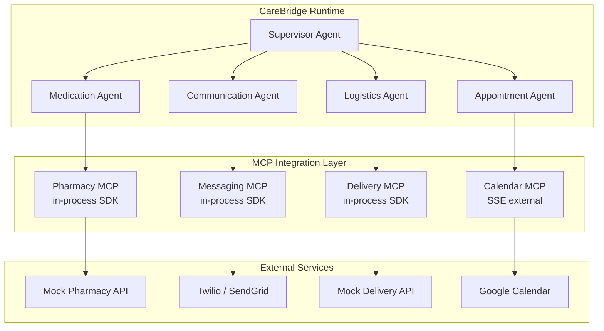
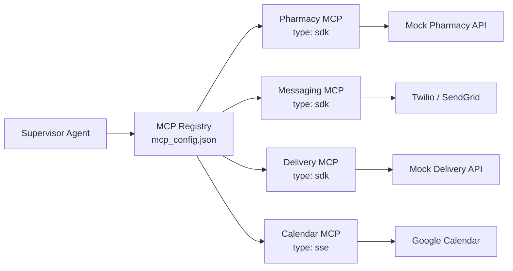
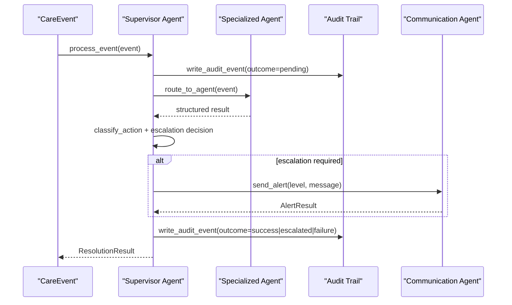
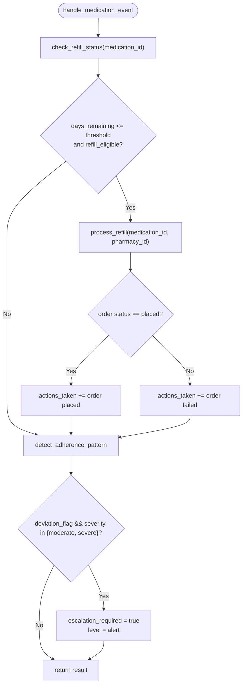
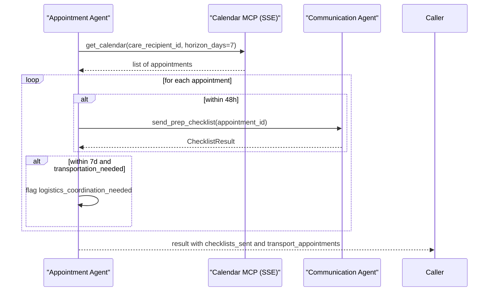
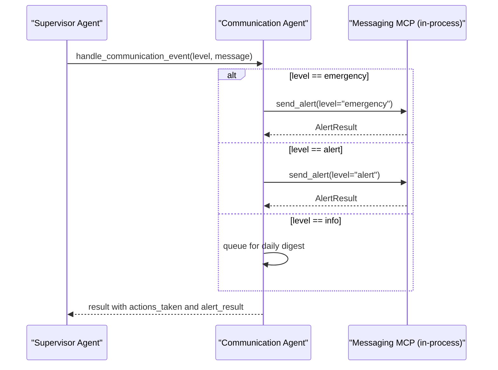
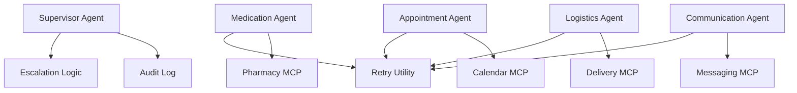

# MCP Integration Layer

<cite>
**Referenced Files in This Document**
- [architecture.md](file://architecture.md)
- [main.py](file://main.py)
- [supervisor_agent.py](file://src/agents/supervisor_agent.py)
- [medication_agent.py](file://src/agents/medication_agent.py)
- [appointment_agent.py](file://src/agents/appointment_agent.py)
- [logistics_agent.py](file://src/agents/logistics_agent.py)
- [communication_agent.py](file://src/agents/communication_agent.py)
- [retry.py](file://src/tools/retry.py)
</cite>

## Table of Contents
1. [Introduction](#introduction)
2. [Project Structure](#project-structure)
3. [Core Components](#core-components)
4. [Architecture Overview](#architecture-overview)
5. [Detailed Component Analysis](#detailed-component-analysis)
6. [Dependency Analysis](#dependency-analysis)
7. [Performance Considerations](#performance-considerations)
8. [Troubleshooting Guide](#troubleshooting-guide)
9. [Conclusion](#conclusion)
10. [Appendices](#appendices)

## Introduction
This document explains CareBridge’s Model Context Protocol (MCP) integration layer that connects the system to external services through in-process SDKs and an SSE transport. It covers how Pharmacy, Messaging, Delivery, and Calendar MCP servers are registered and used, why different transports are chosen, and how configuration is expressed via mcp_config.json. It also documents the benefits of in-process MCP for custom tools, including zero subprocess overhead, direct access to shared Python state, and simplified debugging. Finally, it provides examples of server setup patterns, tool registration approaches, and service integration flows with fallback strategies for failures.

## Project Structure
CareBridge organizes its runtime around a Supervisor Agent that routes care events to specialized agents. Each agent coordinates domain-specific work and integrates with MCP-backed tools or services. The MCP integration layer abstracts external integrations behind consistent tool interfaces while allowing different transports per server:
- In-process SDK for Pharmacy, Messaging, and Delivery to keep execution fast and debuggable within the same process.
- SSE external for Calendar where Qoder Connector already exposes a managed endpoint.

**Diagram sources**
- [architecture.md:211-226](file://architecture.md#L211-L226)

**Section sources**
- [architecture.md:211-262](file://architecture.md#L211-L262)
- [main.py:143-177](file://main.py#L143-L177)

## Core Components
- Supervisor Agent: Orchestrates event routing, deterministic escalation decisions, and audit-before-action logging. It never calls external APIs directly; all external interactions go through agents and MCP tools.
- Specialized Agents:
  - Medication Agent: Refill checks, refill ordering with retry, adherence pattern detection.
  - Appointment Agent: Calendar retrieval, prep checklist dispatch, transportation coordination flags.
  - Logistics Agent: Delivery failure handling with essential vs non-essential rules and retries.
  - Communication Agent: Family alerts at info/alert/emergency levels, daily digest batching.
- Retry Utility: Shared exponential backoff wrapper for external calls.
- MCP Servers:
  - Pharmacy, Messaging, Delivery: In-process SDK servers enabling direct tooling and shared state access.
  - Calendar: External SSE server provided by Qoder Connector.

Key responsibilities and boundaries are enforced by policy and audit trails, ensuring safety-critical actions are deterministic and auditable.

**Section sources**
- [supervisor_agent.py:285-395](file://src/agents/supervisor_agent.py#L285-L395)
- [medication_agent.py:23-134](file://src/agents/medication_agent.py#L23-L134)
- [appointment_agent.py:74-172](file://src/agents/appointment_agent.py#L74-L172)
- [logistics_agent.py:182-235](file://src/agents/logistics_agent.py#L182-L235)
- [communication_agent.py:28-115](file://src/agents/communication_agent.py#L28-L115)
- [retry.py:22-69](file://src/tools/retry.py#L22-L69)

## Architecture Overview
The MCP integration layer sits between CareBridge agents and external services. Configuration declares each server’s type and connection parameters. Transports are selected based on capability and existing infrastructure:
- In-process SDK servers provide zero-overhead tool calls and direct access to shared Python state such as the audit log.
- SSE external server leverages Qoder Connector for Calendar without adding lifecycle management complexity.

**Diagram sources**
- [architecture.md:211-226](file://architecture.md#L211-L226)
- [architecture.md:244-259](file://architecture.md#L244-L259)

**Section sources**
- [architecture.md:211-262](file://architecture.md#L211-L262)

## Detailed Component Analysis

### MCP Server Registration and Transport Selection
- Registration: Servers are declared under mcpServers with type and optional connection parameters.
- Transport rationale:
  - Pharmacy, Messaging, Delivery use in-process SDK for custom tools and direct host state access.
  - Calendar uses SSE because Qoder Connector already provides it.

Configuration example fields:
- pharmacy: type "sdk"
- messaging: type "sdk"
- delivery: type "sdk"
- calendar: type "sse", url, headers with Authorization token placeholder

Benefits of in-process MCP:
- No subprocess lifecycle management
- Direct access to shared Python state (e.g., audit log connection)
- Faster startup (no MCP handshake)
- Simpler debugging (single process)

**Section sources**
- [architecture.md:228-259](file://architecture.md#L228-L259)

### Supervisor Agent and Event Routing
The Supervisor processes events, writes audit entries before action, routes to specialized agents, evaluates escalation deterministically, and triggers communication when needed.

**Diagram sources**
- [supervisor_agent.py:285-395](file://src/agents/supervisor_agent.py#L285-L395)

**Section sources**
- [supervisor_agent.py:285-395](file://src/agents/supervisor_agent.py#L285-L395)

### Medication Agent and Pharmacy MCP Integration
- Handles refill status checks, orders refills with retry, and detects adherence deviations.
- Uses shared retry utility for resilient calls to underlying tools (which may wrap Pharmacy MCP).
- Escalation occurs on exhausted retries or moderate/severe adherence deviations.

**Diagram sources**
- [medication_agent.py:23-134](file://src/agents/medication_agent.py#L23-L134)
- [medication_agent.py:137-159](file://src/agents/medication_agent.py#L137-L159)
- [retry.py:22-69](file://src/tools/retry.py#L22-L69)

**Section sources**
- [medication_agent.py:23-159](file://src/agents/medication_agent.py#L23-L159)
- [retry.py:22-69](file://src/tools/retry.py#L22-L69)

### Appointment Agent and Calendar MCP Integration
- Retrieves upcoming appointments and sends prep checklists within 48 hours.
- Flags transportation needs within 7 days for logistics coordination.
- Integrates with Calendar MCP (SSE external) via get_calendar tool.

**Diagram sources**
- [appointment_agent.py:74-172](file://src/agents/appointment_agent.py#L74-L172)

**Section sources**
- [appointment_agent.py:74-172](file://src/agents/appointment_agent.py#L74-L172)

### Logistics Agent and Delivery MCP Integration
- Processes delivery failures with essential vs non-essential logic.
- Essential deliveries escalate immediately; non-essential deliveries retry once then log.
- Uses shared retry utility for robustness.

**Diagram sources**
- [logistics_agent.py:182-235](file://src/agents/logistics_agent.py#L182-L235)
- [logistics_agent.py:23-152](file://src/agents/logistics_agent.py#L23-L152)
- [retry.py:22-69](file://src/tools/retry.py#L22-L69)

**Section sources**
- [logistics_agent.py:23-152](file://src/agents/logistics_agent.py#L23-L152)
- [logistics_agent.py:182-235](file://src/agents/logistics_agent.py#L182-L235)
- [retry.py:22-69](file://src/tools/retry.py#L22-L69)

### Communication Agent and Messaging MCP Integration
- Sends family alerts at info/alert/emergency levels using retry-backed messaging tools.
- Info-level events are queued for daily digest; alert/emergency trigger immediate notifications.
- Integrates with Messaging MCP (in-process SDK) via send_alert tool.

**Diagram sources**
- [communication_agent.py:28-115](file://src/agents/communication_agent.py#L28-L115)
- [communication_agent.py:118-146](file://src/agents/communication_agent.py#L118-L146)
- [retry.py:22-69](file://src/tools/retry.py#L22-L69)

**Section sources**
- [communication_agent.py:28-146](file://src/agents/communication_agent.py#L28-L146)
- [retry.py:22-69](file://src/tools/retry.py#L22-L69)

### Tool Registration Patterns and Service Integration
- In-process MCP servers register tools that map directly to Python functions, enabling zero-overhead calls and direct access to shared state (e.g., audit log).
- External SSE Calendar server exposes tools over SSE; agents call them through standardized tool interfaces.
- Agents integrate by calling tools (e.g., check_refill_status, order_refill, get_calendar, check_delivery_status, send_alert), which may be backed by MCP servers.

Examples of integration points:
- Medication Agent calls tools for refill checks and orders, wrapped with retry.
- Appointment Agent retrieves calendar via get_calendar and sends prep checklists.
- Logistics Agent checks delivery status and retries as needed.
- Communication Agent sends alerts with retry and queues info-level messages.

**Section sources**
- [medication_agent.py:23-159](file://src/agents/medication_agent.py#L23-L159)
- [appointment_agent.py:74-172](file://src/agents/appointment_agent.py#L74-L172)
- [logistics_agent.py:182-235](file://src/agents/logistics_agent.py#L182-L235)
- [communication_agent.py:28-146](file://src/agents/communication_agent.py#L28-L146)
- [architecture.md:228-259](file://architecture.md#L228-L259)

## Dependency Analysis
Agents depend on tools and shared utilities; MCP servers abstract external services. The Supervisor depends on deterministic escalation logic and audit logging.

**Diagram sources**
- [supervisor_agent.py:285-395](file://src/agents/supervisor_agent.py#L285-L395)
- [medication_agent.py:23-159](file://src/agents/medication_agent.py#L23-L159)
- [appointment_agent.py:74-172](file://src/agents/appointment_agent.py#L74-L172)
- [logistics_agent.py:182-235](file://src/agents/logistics_agent.py#L182-L235)
- [communication_agent.py:28-146](file://src/agents/communication_agent.py#L28-L146)
- [retry.py:22-69](file://src/tools/retry.py#L22-L69)

**Section sources**
- [supervisor_agent.py:285-395](file://src/agents/supervisor_agent.py#L285-L395)
- [retry.py:22-69](file://src/tools/retry.py#L22-L69)

## Performance Considerations
- In-process MCP eliminates subprocess lifecycle overhead and enables direct access to shared Python state, improving performance and simplifying debugging.
- SSE external Calendar server leverages existing connector infrastructure, avoiding additional deployment complexity.
- Retry strategy uses exponential backoff to reduce transient failures impact.

[No sources needed since this section provides general guidance]

## Troubleshooting Guide
Common issues and mitigations:
- Missing or invalid event payloads: Agents validate inputs and return structured error actions; ensure required fields are present in CareEvent payloads.
- External service failures: Retry utility wraps calls with exponential backoff; after exhaustion, agents set escalation flags and log outcomes.
- Audit trail consistency: Supervisor writes audit events before processing and after completion; failures are recorded with correlation IDs for tracing.
- Fallback strategies: If messaging fails, alerts are retried and escalated; if calendar retrieval fails, appointment handling returns gracefully with warnings.

Operational tips:
- Verify mcp_config.json contains correct types and URLs for all servers.
- Ensure environment variables (e.g., CALENDAR_TOKEN) are set for SSE headers.
- Monitor logs for RetryExhausted exceptions and escalation events.

**Section sources**
- [supervisor_agent.py:285-395](file://src/agents/supervisor_agent.py#L285-L395)
- [medication_agent.py:23-134](file://src/agents/medication_agent.py#L23-L134)
- [appointment_agent.py:74-172](file://src/agents/appointment_agent.py#L74-L172)
- [logistics_agent.py:182-235](file://src/agents/logistics_agent.py#L182-L235)
- [communication_agent.py:28-146](file://src/agents/communication_agent.py#L28-L146)
- [retry.py:22-69](file://src/tools/retry.py#L22-L69)

## Conclusion
CareBridge’s MCP integration layer provides a flexible, high-performance bridge to external services through in-process SDKs and SSE transport. The design emphasizes deterministic escalation, audit-before-action, and robust retry strategies. In-process MCP servers enable zero-overhead tooling and direct state access, while SSE external servers leverage existing connectors. Configuration via mcp_config.json centralizes server registration and connection parameters, supporting secure and maintainable integrations across Pharmacy, Messaging, Delivery, and Calendar domains.

[No sources needed since this section summarizes without analyzing specific files]

## Appendices

### Example: MCP Server Setup and Tool Registration
- Register servers in mcp_config.json with type and connection details.
- Implement tools in Python modules and expose them via in-process MCP servers.
- For SSE external servers, configure URL and headers; agents call tools through standardized interfaces.

Example fields:
- pharmacy: type "sdk"
- messaging: type "sdk"
- delivery: type "sdk"
- calendar: type "sse", url, headers with Authorization token

**Section sources**
- [architecture.md:244-259](file://architecture.md#L244-L259)

### Example: Service Integration Patterns
- Medication Agent: check_refill_status → order_refill (with retry) → adherence detection.
- Appointment Agent: get_calendar → send_prep_checklist → logistics flagging.
- Logistics Agent: check_delivery_status → retry on failure → escalate if essential.
- Communication Agent: send_alert (with retry) → queue info-level for digest.

**Section sources**
- [medication_agent.py:23-159](file://src/agents/medication_agent.py#L23-L159)
- [appointment_agent.py:74-172](file://src/agents/appointment_agent.py#L74-L172)
- [logistics_agent.py:182-235](file://src/agents/logistics_agent.py#L182-L235)
- [communication_agent.py:28-146](file://src/agents/communication_agent.py#L28-L146)