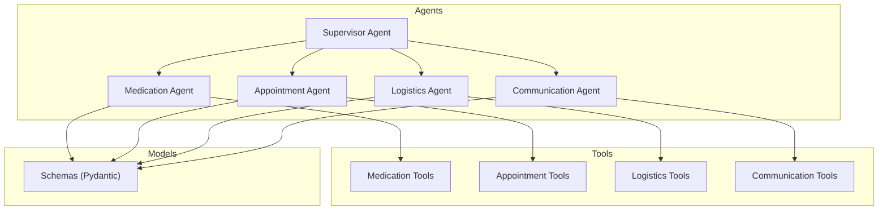
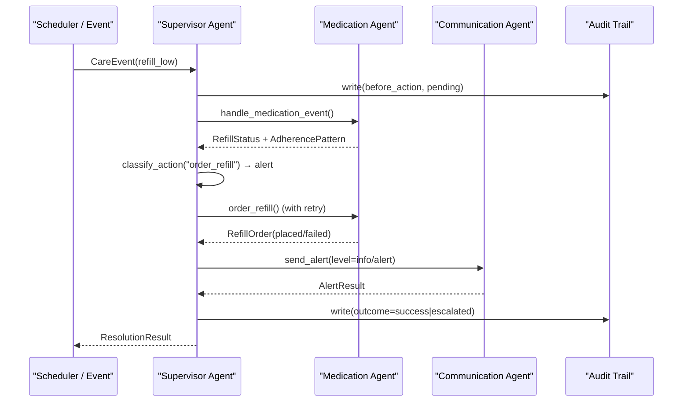
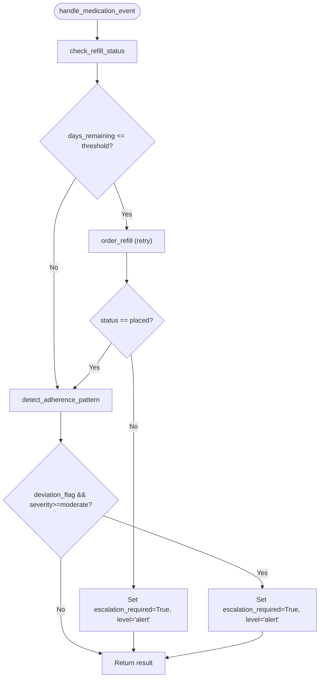
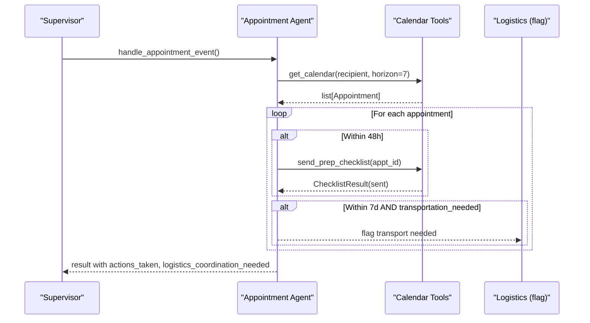
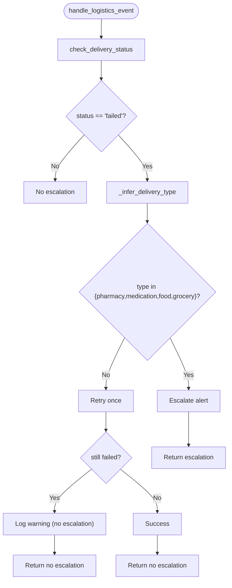
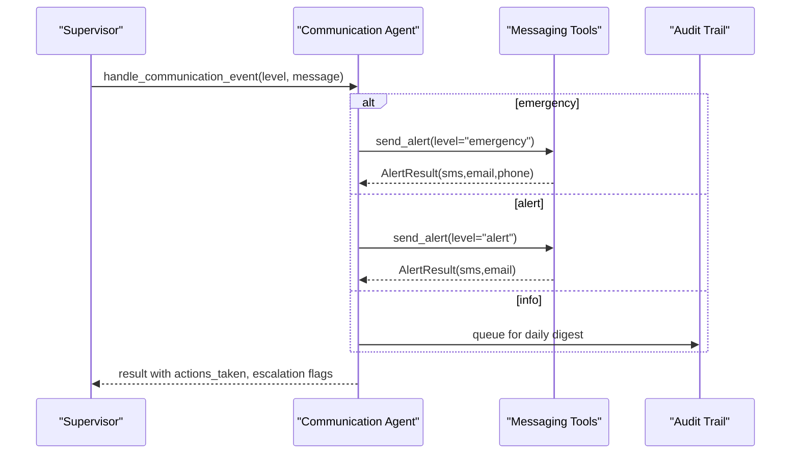
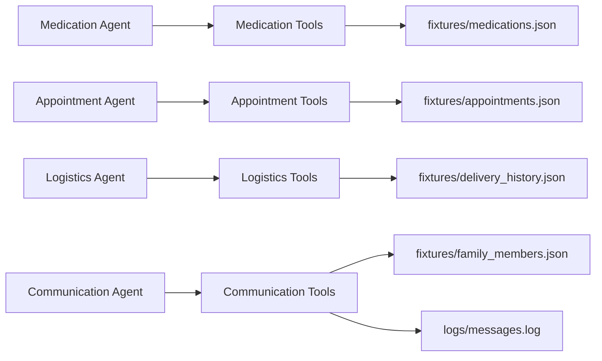

# Specialized Agents

<cite>
**Referenced Files in This Document**
- [AGENTS.md](file://AGENTS.md)
- [SPEC.md](file://SPEC.md)
- [architecture.md](file://architecture.md)
- [src/agents/supervisor_agent.py](file://src/agents/supervisor_agent.py)
- [src/agents/medication_agent.py](file://src/agents/medication_agent.py)
- [src/agents/appointment_agent.py](file://src/agents/appointment_agent.py)
- [src/agents/logistics_agent.py](file://src/agents/logistics_agent.py)
- [src/agents/communication_agent.py](file://src/agents/communication_agent.py)
- [src/tools/medication_tools.py](file://src/tools/medication_tools.py)
- [src/tools/appointment_tools.py](file://src/tools/appointment_tools.py)
- [src/tools/logistics_tools.py](file://src/tools/logistics_tools.py)
- [src/tools/communication_tools.py](file://src/tools/communication_tools.py)
- [src/models/schemas.py](file://src/models/schemas.py)
- [tests/test_medication_agent.py](file://tests/test_medication_agent.py)
- [tests/test_appointment_agent.py](file://tests/test_appointment_agent.py)
- [tests/test_logistics_agent.py](file://tests/test_logistics_agent.py)
</cite>

## Table of Contents
1. Introduction
2. Project Structure
3. Core Components
4. Architecture Overview
5. Detailed Component Analysis
6. Dependency Analysis
7. Performance Considerations
8. Troubleshooting Guide
9. Conclusion

## Introduction
This document explains CareBridge’s four specialized agents that operate as callable tools within the Supervisor Agent context: Medication, Appointment, Logistics, and Communication. It details their domain responsibilities, strict boundary rules enforced by AGENTS.md, agent interface patterns, tool definitions, response formats, workflows, error handling strategies, external integrations via the tools layer, and testing/debugging approaches for each agent.

## Project Structure
CareBridge organizes code into agents, tools, models, tests, and fixtures. Each specialized agent owns its handler and a corresponding tools module that encapsulates external interactions (mocked here). The Supervisor orchestrates events and enforces deterministic escalation and audit-before-action policies.

**Diagram sources**
- [architecture.md:10-75](file://architecture.md#L10-L75)
- [src/agents/supervisor_agent.py:599-641](file://src/agents/supervisor_agent.py#L599-L641)

**Section sources**
- [architecture.md:430-499](file://architecture.md#L430-L499)
- [src/agents/supervisor_agent.py:1-15](file://src/agents/supervisor_agent.py#L1-L15)

## Core Components
- Medication Agent: monitors refill status, orders refills when eligible, detects adherence deviations, and escalates on failures or significant deviations.
- Appointment Agent: retrieves upcoming appointments, sends prep checklists within 48 hours, and flags transportation needs within 7 days for logistics coordination.
- Logistics Agent: handles delivery failures with escalation rules for essential items, retries non-essential deliveries once, and logs outcomes.
- Communication Agent: sends alerts at info/alert/emergency levels, synthesizes care status from audit trail, and respects family preferences.

All agents return structured Pydantic models and never communicate directly with each other; all routing goes through the Supervisor.

**Section sources**
- [SPEC.md:76-251](file://SPEC.md#L76-L251)
- [AGENTS.md:8-21](file://AGENTS.md#L8-L21)

## Architecture Overview
The system uses Strands agents-as-tools to wrap specialized agents as callable tools for the Supervisor. The Supervisor routes events deterministically, applies escalation logic, writes immutable audit events before execution, and coordinates cross-agent actions only via itself.

**Diagram sources**
- [architecture.md:83-117](file://architecture.md#L83-L117)
- [src/agents/supervisor_agent.py:285-395](file://src/agents/supervisor_agent.py#L285-L395)

**Section sources**
- [SPEC.md:36-73](file://SPEC.md#L36-L73)
- [architecture.md:79-117](file://architecture.md#L79-L117)

## Detailed Component Analysis

### Medication Agent
Responsibilities:
- Check refill eligibility based on days remaining vs threshold.
- Order refills with retry and audit-before-action.
- Detect adherence patterns and escalate on moderate/severe deviations.

Key interfaces and behaviors:
- Entry: handle_medication_event(CareEvent) returns structured dict with actions_taken, escalation flags, and model dumps.
- Tools:
  - check_refill_status(medication_id) -> RefillStatus
  - order_refill(medication_id, pharmacy_id) -> RefillOrder (async, wrapped with retry)
  - detect_adherence_pattern(medication_id, window_days=7) -> AdherencePattern
- Escalation:
  - Retry exhaustion on order_refill triggers escalation level alert.
  - Adherence deviation severity >= moderate triggers alert.

Error handling:
- Missing medication_id returns an error action without escalation.
- Tool exceptions are logged and surfaced in actions_taken; retry exhaustion raises RetryExhausted which is caught and escalated.

Integration points:
- Uses fixture data for medications and simulates pharmacy API calls.
- Writes audit events before and after external calls.

Testing and debugging:
- Unit tests cover happy paths, invalid inputs, and retry exhaustion scenarios.
- Use temp_audit_db fixture to assert audit entries.
- Mock external calls to simulate failures and verify escalation behavior.

**Diagram sources**
- [src/agents/medication_agent.py:23-134](file://src/agents/medication_agent.py#L23-L134)
- [src/tools/medication_tools.py:34-153](file://src/tools/medication_tools.py#L34-L153)

**Section sources**
- [src/agents/medication_agent.py:1-189](file://src/agents/medication_agent.py#L1-L189)
- [src/tools/medication_tools.py:1-208](file://src/tools/medication_tools.py#L1-L208)
- [tests/test_medication_agent.py:1-177](file://tests/test_medication_agent.py#L1-L177)

### Appointment Agent
Responsibilities:
- Retrieve upcoming appointments within a horizon.
- Send prep checklists for appointments within 48 hours.
- Flag transportation needs within 7 days for logistics coordination.

Key interfaces and behaviors:
- Entry: handle_appointment_event(CareEvent) returns structured dict with actions_taken, logistics_coordination_needed, checklists_sent, transport_appointments.
- Tools:
  - get_calendar(care_recipient_id, horizon_days=30) -> list[Appointment]
  - schedule_appointment(provider_id, care_recipient_id, preferred_datetime) -> Appointment (async, with retry)
  - send_prep_checklist(appointment_id) -> ChecklistResult

Error handling:
- Unknown recipient returns no appointments message without escalation.
- Failed checklist sending logs errors and continues processing other appointments.

Integration points:
- Reads appointment fixtures and simulates calendar API scheduling.
- Writes audit events around scheduling operations.

Testing and debugging:
- Tests validate calendar retrieval, scheduling success/failure, and checklist delivery.
- Validate result structure keys and expected behaviors for edge cases.

**Diagram sources**
- [src/agents/appointment_agent.py:74-173](file://src/agents/appointment_agent.py#L74-L173)
- [src/tools/appointment_tools.py:39-242](file://src/tools/appointment_tools.py#L39-L242)

**Section sources**
- [src/agents/appointment_agent.py:1-173](file://src/agents/appointment_agent.py#L1-L173)
- [src/tools/appointment_tools.py:1-242](file://src/tools/appointment_tools.py#L1-L242)
- [tests/test_appointment_agent.py:1-127](file://tests/test_appointment_agent.py#L1-L127)

### Logistics Agent
Responsibilities:
- Handle delivery failures with escalation rules for essential items (pharmacy, medication, food, grocery).
- Retry non-essential deliveries once and log warnings if still failed.

Key interfaces and behaviors:
- Entry: handle_logistics_event(CareEvent) returns structured dict with escalation flags and actions_taken.
- Tools:
  - check_delivery_status(delivery_id) -> DeliveryStatus
  - order_grocery(care_recipient_id, items, delivery_address) -> DeliveryOrder (async)
  - order_pharmacy_delivery(medication_id, pharmacy_id, delivery_address) -> DeliveryOrder (async)

Error handling:
- Essential delivery failure immediately escalates with level alert.
- Non-essential delivery failure retries once; if still failed, logs warning without escalation.
- Missing or unknown delivery IDs trigger escalation.

Integration points:
- Reads delivery history fixtures to infer delivery type and status.
- Writes audit events for checks, retries, and escalations.

Testing and debugging:
- Tests cover delivered, failed, and invalid delivery statuses.
- Validate escalation behavior for essential failures and missing IDs.

**Diagram sources**
- [src/agents/logistics_agent.py:23-153](file://src/agents/logistics_agent.py#L23-L153)
- [src/tools/logistics_tools.py:23-220](file://src/tools/logistics_tools.py#L23-L220)

**Section sources**
- [src/agents/logistics_agent.py:1-236](file://src/agents/logistics_agent.py#L1-L236)
- [src/tools/logistics_tools.py:1-220](file://src/tools/logistics_tools.py#L1-L220)
- [tests/test_logistics_agent.py:1-148](file://tests/test_logistics_agent.py#L1-L148)

### Communication Agent
Responsibilities:
- Send alerts at info/alert/emergency levels respecting family preferences.
- Synthesize care status from audit trail for caregiver queries and daily digests.

Key interfaces and behaviors:
- Entry: handle_communication_event(CareEvent) returns structured dict with actions_taken and alert_result dump.
- Tools:
  - send_alert(recipient_id, message, level) -> AlertResult (async, with retry)
  - synthesize_status(care_recipient_id) -> StatusSummary
  - get_family_preferences(family_id) -> FamilyPreferences

Error handling:
- Emergency and alert levels use retry; exhaustion surfaces failure in actions_taken and sets escalation_required=True with appropriate level.
- Info-level events are queued for daily digest.

Integration points:
- Logs messages to logs/messages.log and writes audit events before and after sending.
- Reads family member fixtures to determine channels and targets.

Testing and debugging:
- While not included here, communication tool behavior can be validated by asserting logs/messages.log content and audit entries.
- Use retry mocking to test exhaustion paths.

**Diagram sources**
- [src/agents/communication_agent.py:28-163](file://src/agents/communication_agent.py#L28-L163)
- [src/tools/communication_tools.py:54-279](file://src/tools/communication_tools.py#L54-L279)

**Section sources**
- [src/agents/communication_agent.py:1-163](file://src/agents/communication_agent.py#L1-L163)
- [src/tools/communication_tools.py:1-279](file://src/tools/communication_tools.py#L1-L279)

## Dependency Analysis
Agent-to-agent boundaries:
- No direct agent-to-agent calls; all communication routes through the Supervisor.
- Each agent owns specific files per AGENTS.md ownership table.

External dependencies:
- Tools layer abstracts external services (pharmacy, calendar, delivery, messaging) using fixtures and mock behaviors.
- Audit trail is written before any external call; immutability enforced by database triggers.

**Diagram sources**
- [src/tools/medication_tools.py:21-31](file://src/tools/medication_tools.py#L21-L31)
- [src/tools/appointment_tools.py:22-36](file://src/tools/appointment_tools.py#L22-L36)
- [src/tools/logistics_tools.py:20-37](file://src/tools/logistics_tools.py#L20-L37)
- [src/tools/communication_tools.py:28-51](file://src/tools/communication_tools.py#L28-L51)

**Section sources**
- [AGENTS.md:53-69](file://AGENTS.md#L53-L69)
- [SPEC.md:364-392](file://SPEC.md#L364-L392)

## Performance Considerations
- Retry policy: 3 attempts with exponential backoff (1s, 2s, 4s) via shared retry helper.
- Latency target: single agent task under 5 seconds (mocked).
- Concurrency: support 10 concurrent care recipients.
- Audit-before-action ensures no silent failures and provides traceability.

[No sources needed since this section provides general guidance]

## Troubleshooting Guide
Common issues and resolutions:
- Missing medication_id in payload: Medication Agent returns error action without escalation; ensure upstream event construction includes required fields.
- Invalid IDs (medication, appointment, delivery): Tools raise ValueError; handlers surface errors in actions_taken and may escalate depending on context.
- External API failures: Tools catch exceptions, write failure audit events, and either return failure models or raise RuntimeError; retry exhaustion triggers escalation.
- Messaging failures: Communication Agent retries and surfaces failures in actions_taken; fallback queues alerts in dashboard only per AGENTS.md.

Debugging techniques:
- Inspect audit trail entries for before/after outcomes and correlation IDs.
- Review logs/messages.log for communication tool outputs.
- Use pytest with temp_audit_db to assert audit entries and behavior under mocked failures.

**Section sources**
- [AGENTS.md:108-163](file://AGENTS.md#L108-L163)
- [src/tools/communication_tools.py:142-157](file://src/tools/communication_tools.py#L142-L157)
- [tests/test_medication_agent.py:160-177](file://tests/test_medication_agent.py#L160-L177)

## Conclusion
CareBridge’s specialized agents provide clear, bounded responsibilities with strict enforcement against direct inter-agent communication. The Supervisor orchestrates routing, classification, and escalation deterministically while ensuring every action is audited before execution. Tools abstract external integrations, enabling robust testing and safe operation. The documented workflows, error handling, and testing strategies ensure reliability and maintainability across the system.