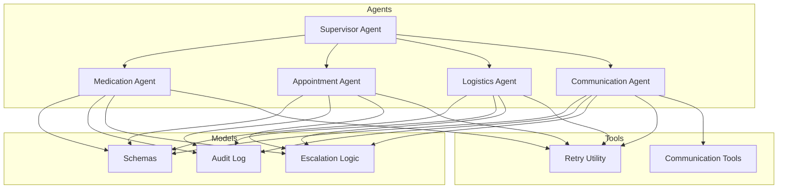
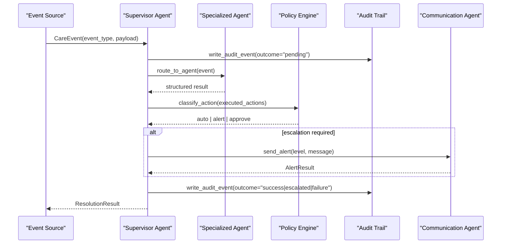
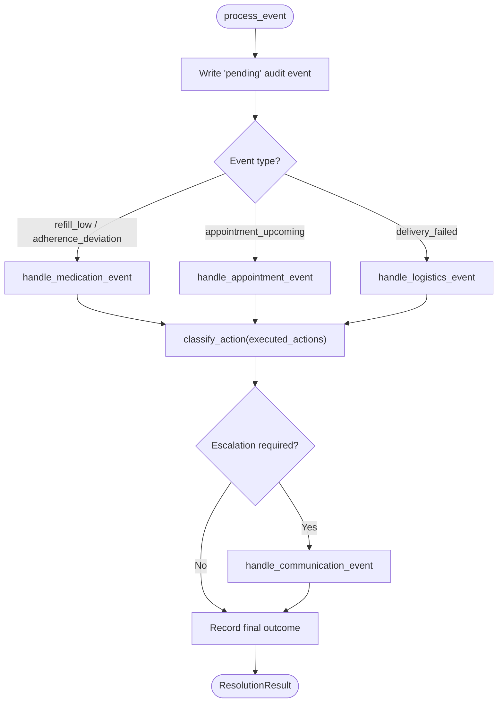
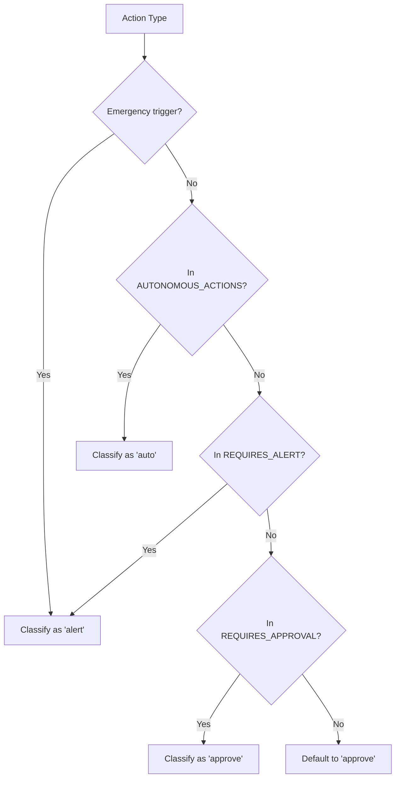
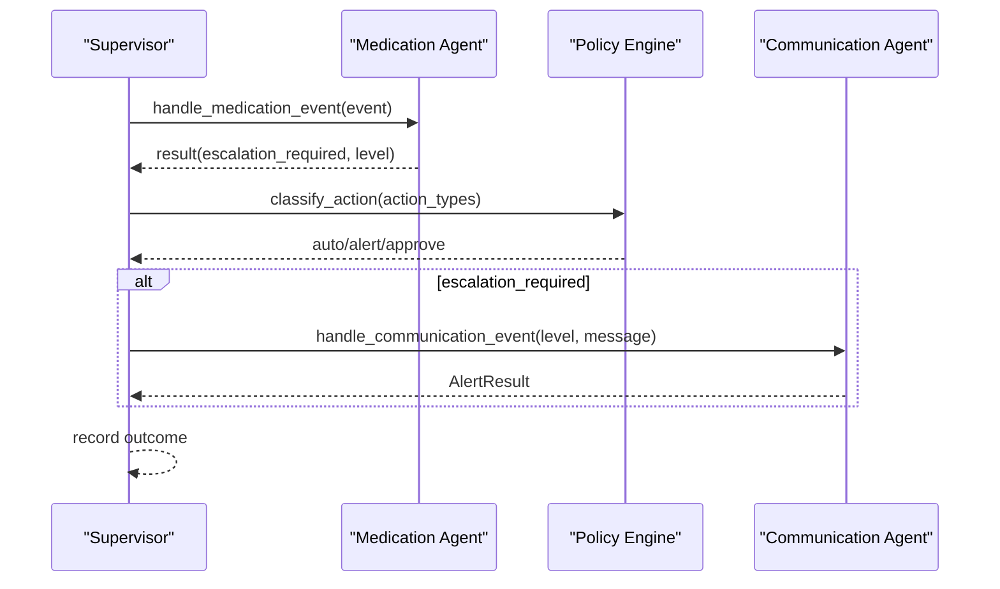
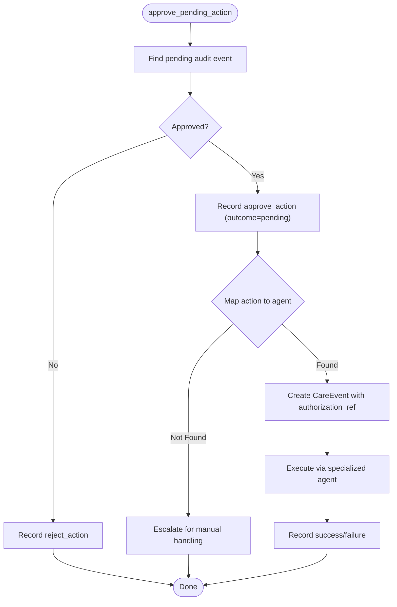
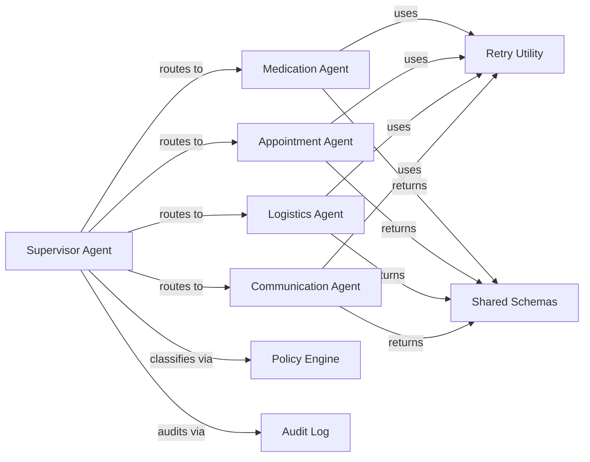

# Supervisor Agent

<cite>
**Referenced Files in This Document**
- [supervisor_agent.py](file://src/agents/supervisor_agent.py)
- [escalation_logic.py](file://src/models/escalation_logic.py)
- [schemas.py](file://src/models/schemas.py)
- [audit_log.py](file://src/models/audit_log.py)
- [medication_agent.py](file://src/agents/medication_agent.py)
- [appointment_agent.py](file://src/agents/appointment_agent.py)
- [logistics_agent.py](file://src/agents/logistics_agent.py)
- [communication_agent.py](file://src/agents/communication_agent.py)
- [retry.py](file://src/tools/retry.py)
- [communication_tools.py](file://src/tools/communication_tools.py)
- [architecture.md](file://architecture.md)
- [AGENTS.md](file://AGENTS.md)
- [test_supervisor.py](file://tests/test_supervisor.py)
</cite>

## Table of Contents
1. [Introduction](#introduction)
2. [Project Structure](#project-structure)
3. [Core Components](#core-components)
4. [Architecture Overview](#architecture-overview)
5. [Detailed Component Analysis](#detailed-component-analysis)
6. [Dependency Analysis](#dependency-analysis)
7. [Performance Considerations](#performance-considerations)
8. [Troubleshooting Guide](#troubleshooting-guide)
9. [Conclusion](#conclusion)
10. [Appendices](#appendices)

## Introduction
The Supervisor Agent is the central orchestrator for CareBridge’s multi-agent system. It receives care events, routes them to specialized agents (Medication, Appointment, Logistics, Communication), enforces deterministic escalation decisions via a Policy Engine, and ensures every action is audited before execution. The Supervisor uses Strands Agents SDK’s agents-as-tools pattern to wrap specialized agent handlers as callable tools when available; otherwise it falls back to direct deterministic routing without an LLM.

Key responsibilities:
- Event routing based on event type to the correct specialized agent
- Deterministic action classification through classify_action()
- Escalation handling with severity ranking and family notifications
- Audit-before-action immutability and correlation tracking
- Approval workflow for actions requiring human authorization
- Graceful degradation when Strands SDK or Bedrock are unavailable

[No sources needed since this section summarizes without analyzing specific files]

## Project Structure
CareBridge organizes code by feature layers:
- Agents: supervisor and four specialized agents
- Models: shared schemas, audit log, and escalation logic
- Tools: external integrations and retry utilities
- Tests: unit and integration tests
- Fixtures: mock data for development and testing

**Diagram sources**
- [supervisor_agent.py:1-641](file://src/agents/supervisor_agent.py#L1-L641)
- [medication_agent.py:1-189](file://src/agents/medication_agent.py#L1-L189)
- [appointment_agent.py:1-173](file://src/agents/appointment_agent.py#L1-L173)
- [logistics_agent.py:1-236](file://src/agents/logistics_agent.py#L1-L236)
- [communication_agent.py:1-163](file://src/agents/communication_agent.py#L1-L163)
- [schemas.py:1-150](file://src/models/schemas.py#L1-L150)
- [audit_log.py:1-167](file://src/models/audit_log.py#L1-L167)
- [escalation_logic.py:1-71](file://src/models/escalation_logic.py#L1-L71)
- [retry.py:1-70](file://src/tools/retry.py#L1-L70)
- [communication_tools.py:1-279](file://src/tools/communication_tools.py#L1-L279)

**Section sources**
- [architecture.md:10-75](file://architecture.md#L10-L75)
- [AGENTS.md:8-33](file://AGENTS.md#L8-L33)

## Core Components
- Supervisor Agent: entry point for care events, deterministic routing, escalation, approval, and audit-first orchestration
- Specialized Agents: domain-specific handlers for medication, appointments, logistics, and communication
- Policy Engine: deterministic classifier that categorizes actions into auto, alert, or approve
- Audit Trail: immutable SQLite-backed log ensuring every action is recorded before execution
- Retry Mechanism: shared utility providing exponential backoff for external calls
- Schemas: Pydantic models defining structured data exchanged between components

**Section sources**
- [supervisor_agent.py:1-641](file://src/agents/supervisor_agent.py#L1-L641)
- [escalation_logic.py:1-71](file://src/models/escalation_logic.py#L1-L71)
- [audit_log.py:1-167](file://src/models/audit_log.py#L1-L167)
- [retry.py:1-70](file://src/tools/retry.py#L1-L70)
- [schemas.py:1-150](file://src/models/schemas.py#L1-L150)

## Architecture Overview
The Supervisor coordinates specialized agents using the agents-as-tools pattern. When Strands SDK is available, the Supervisor wraps each specialized handler as a tool; otherwise, it uses direct deterministic routing. All cross-agent coordination flows through the Supervisor—specialized agents never call each other directly.

**Diagram sources**
- [supervisor_agent.py:285-395](file://src/agents/supervisor_agent.py#L285-L395)
- [escalation_logic.py:42-71](file://src/models/escalation_logic.py#L42-L71)
- [audit_log.py:81-130](file://src/models/audit_log.py#L81-L130)
- [communication_agent.py:28-115](file://src/agents/communication_agent.py#L28-L115)

**Section sources**
- [architecture.md:79-117](file://architecture.md#L79-L117)
- [AGENTS.md:25-33](file://AGENTS.md#L25-L33)

## Detailed Component Analysis

### Supervisor Routing and Event Processing
The Supervisor maps event types to specialized agents:
- refill_low and adherence_deviation → Medication Agent
- appointment_upcoming → Appointment Agent
- delivery_failed → Logistics Agent
- Escalation events → Communication Agent

It writes a pending audit event before processing, then determines escalation deterministically, and finally records the outcome.

**Diagram sources**
- [supervisor_agent.py:259-395](file://src/agents/supervisor_agent.py#L259-L395)
- [escalation_logic.py:42-71](file://src/models/escalation_logic.py#L42-L71)

**Section sources**
- [supervisor_agent.py:67-104](file://src/agents/supervisor_agent.py#L67-L104)
- [supervisor_agent.py:259-278](file://src/agents/supervisor_agent.py#L259-L278)
- [supervisor_agent.py:285-395](file://src/agents/supervisor_agent.py#L285-L395)

### Action Classification System
The Policy Engine classifies actions into three categories:
- Auto: check_refill_status, check_delivery_status, get_calendar, synthesize_status, send_daily_digest
- Alert: order_refill, order_grocery, schedule_appointment, order_pharmacy_delivery
- Approve: cancel_appointment, change_medication_schedule, add_service_provider, modify_health_record

Unknown actions default to approve for safety. Emergency triggers escalate at minimum to alert.

**Diagram sources**
- [escalation_logic.py:13-71](file://src/models/escalation_logic.py#L13-L71)

**Section sources**
- [escalation_logic.py:13-71](file://src/models/escalation_logic.py#L13-L71)
- [AGENTS.md:130-152](file://AGENTS.md#L130-L152)

### Escalation Handling and Family Notifications
The Supervisor evaluates escalation from three sources:
1. Hard-coded emergency triggers in event payload
2. Deterministic classification of executed actions
3. Structured escalation flags from specialized agents

When escalation is required, it builds an alert message and routes to the Communication Agent.

**Diagram sources**
- [supervisor_agent.py:178-234](file://src/agents/supervisor_agent.py#L178-L234)
- [supervisor_agent.py:347-366](file://src/agents/supervisor_agent.py#L347-L366)
- [communication_agent.py:28-115](file://src/agents/communication_agent.py#L28-L115)

**Section sources**
- [supervisor_agent.py:178-234](file://src/agents/supervisor_agent.py#L178-L234)
- [supervisor_agent.py:237-256](file://src/agents/supervisor_agent.py#L237-L256)
- [communication_agent.py:55-107](file://src/agents/communication_agent.py#L55-L107)

### Approval Workflow
Actions classified as approve require human authorization. The Supervisor:
- Locates pending audit events
- Records human decision (approve/reject)
- Routes approved actions to the correct specialized agent
- Logs execution outcomes

**Diagram sources**
- [supervisor_agent.py:432-592](file://src/agents/supervisor_agent.py#L432-L592)

**Section sources**
- [supervisor_agent.py:432-592](file://src/agents/supervisor_agent.py#L432-L592)
- [test_supervisor.py:137-197](file://tests/test_supervisor.py#L137-L197)

### State Management and Tool Invocation
The Supervisor maintains process-local state:
- Audit database initialization flag
- Resolved action IDs to prevent double resolution
- Agent routing tables mapping action types to agents and event types

Tool invocation follows strict boundaries:
- Supervisor never calls external APIs directly
- Each specialized agent owns its tools
- All tool calls are wrapped with retry logic where applicable

**Section sources**
- [supervisor_agent.py:106-108](file://src/agents/supervisor_agent.py#L106-L108)
- [supervisor_agent.py:67-104](file://src/agents/supervisor_agent.py#L67-L104)
- [retry.py:22-70](file://src/tools/retry.py#L22-L70)

### Audit Trail Compliance
Every action produces exactly one audit event with:
- Actor identification (supervisor, specialized agent, human)
- Action type and rationale
- Outcome (success, failure, pending, escalated)
- Correlation ID linking related actions
- Authorization reference for approved actions

The audit trail is immutable via SQLite triggers preventing UPDATE/DELETE operations.

**Section sources**
- [audit_log.py:19-78](file://src/models/audit_log.py#L19-L78)
- [audit_log.py:81-130](file://src/models/audit_log.py#L81-L130)
- [AGENTS.md:108-127](file://AGENTS.md#L108-L127)

## Dependency Analysis
The Supervisor has well-defined dependencies:
- Direct imports from specialized agents for routing
- Policy Engine for deterministic classification
- Audit log for compliance and traceability
- Shared schemas for structured data exchange
- Retry utilities for resilient external calls

**Diagram sources**
- [supervisor_agent.py:21-39](file://src/agents/supervisor_agent.py#L21-L39)
- [medication_agent.py:7-16](file://src/agents/medication_agent.py#L7-L16)
- [appointment_agent.py:9-17](file://src/agents/appointment_agent.py#L9-L17)
- [logistics_agent.py:8-15](file://src/agents/logistics_agent.py#L8-L15)
- [communication_agent.py:7-23](file://src/agents/communication_agent.py#L7-L23)

**Section sources**
- [supervisor_agent.py:21-39](file://src/agents/supervisor_agent.py#L21-L39)
- [AGENTS.md:53-69](file://AGENTS.md#L53-L69)

## Performance Considerations
- Deterministic routing avoids LLM overhead in production paths
- Retry mechanism prevents cascading failures with exponential backoff
- Audit logging uses efficient SQLite with appropriate indexes
- Process-local state minimizes database queries for common operations
- Asynchronous agent handlers enable concurrent processing where possible

[No sources needed since this section provides general guidance]

## Troubleshooting Guide
Common issues and resolutions:
- **Routing failures**: Check event_type validity and ensure all specialized agents are properly imported
- **Escalation not triggering**: Verify emergency triggers in event payload and action classifications
- **Approval workflow stuck**: Ensure pending audit events exist and have correct outcome="pending"
- **Audit trail immutability errors**: Use INSERT only, never UPDATE/DELETE audit_events table
- **External API failures**: Check retry exhaustion and verify fallback mechanisms are in place

**Section sources**
- [test_supervisor.py:204-276](file://tests/test_supervisor.py#L204-L276)
- [audit_log.py:46-75](file://src/models/audit_log.py#L46-L75)
- [retry.py:14-20](file://src/tools/retry.py#L14-L20)

## Conclusion
The Supervisor Agent serves as CareBridge's central orchestrator, implementing robust event routing, deterministic escalation, and comprehensive audit trails. Through the agents-as-tools pattern, it coordinates specialized agents while maintaining clear boundaries and compliance requirements. The system prioritizes safety through deterministic classification, immutable auditing, and graceful degradation when external dependencies are unavailable.

[No sources needed since this section summarizes without analyzing specific files]

## Appendices

### Example Decision-Making Patterns
- Low medication refill detected → check status → order refill if eligible → notify family
- Delivery failure for essential items → immediate escalation → family notification
- Adherence deviation with moderate/severe severity → alert primary caregiver

### Error Handling Strategies
- External API failures: retry with exponential backoff, then escalate
- Missing data: validate inputs early, return structured error responses
- Network timeouts: use shared retry utility with configurable attempts
- Database errors: ensure audit trail integrity, log failures prominently

**Section sources**
- [medication_agent.py:73-100](file://src/agents/medication_agent.py#L73-L100)
- [logistics_agent.py:78-100](file://src/agents/logistics_agent.py#L78-L100)
- [communication_agent.py:55-76](file://src/agents/communication_agent.py#L55-L76)