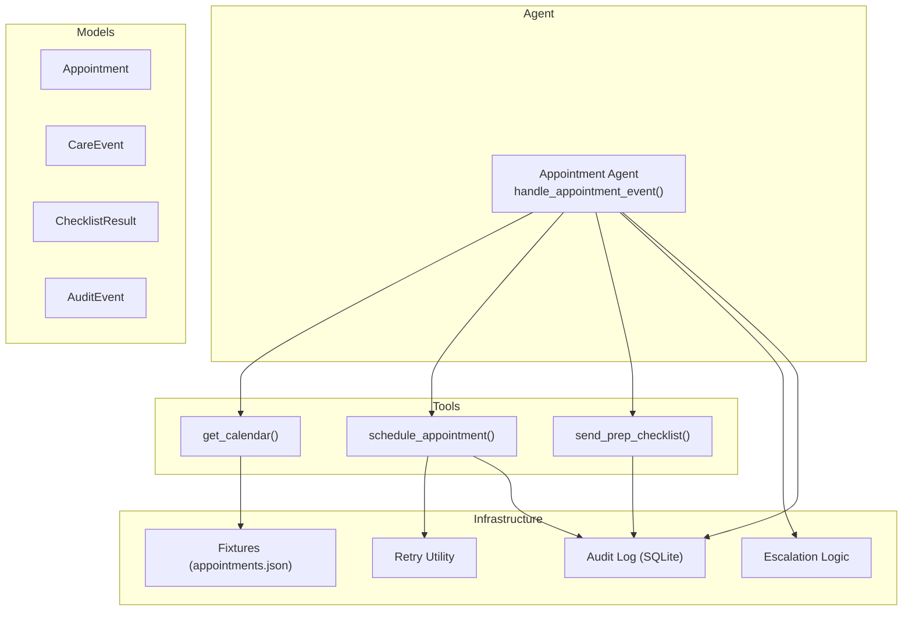
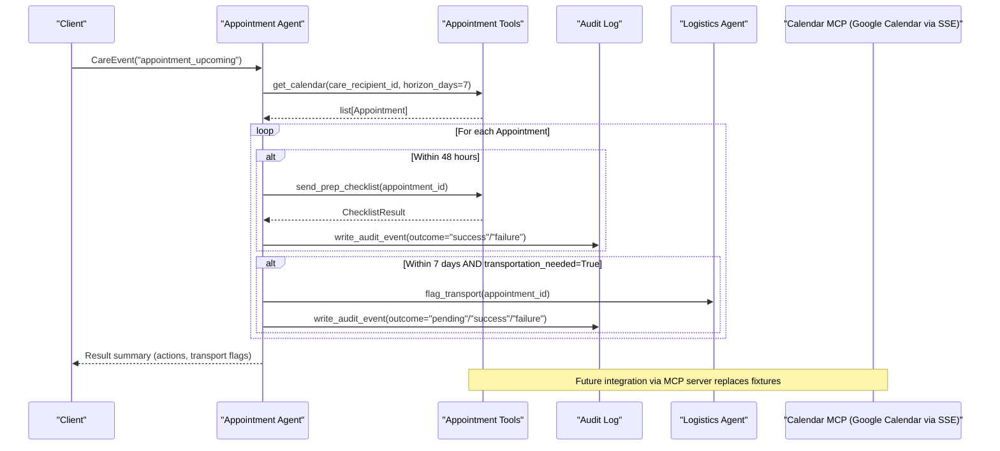
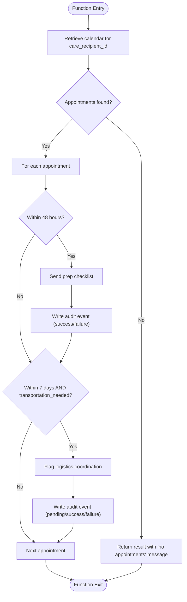
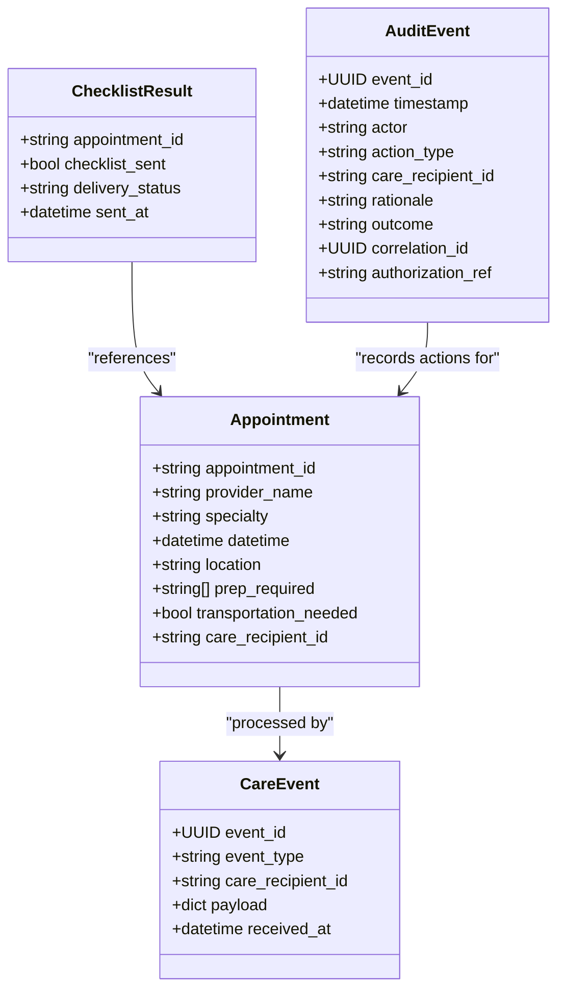
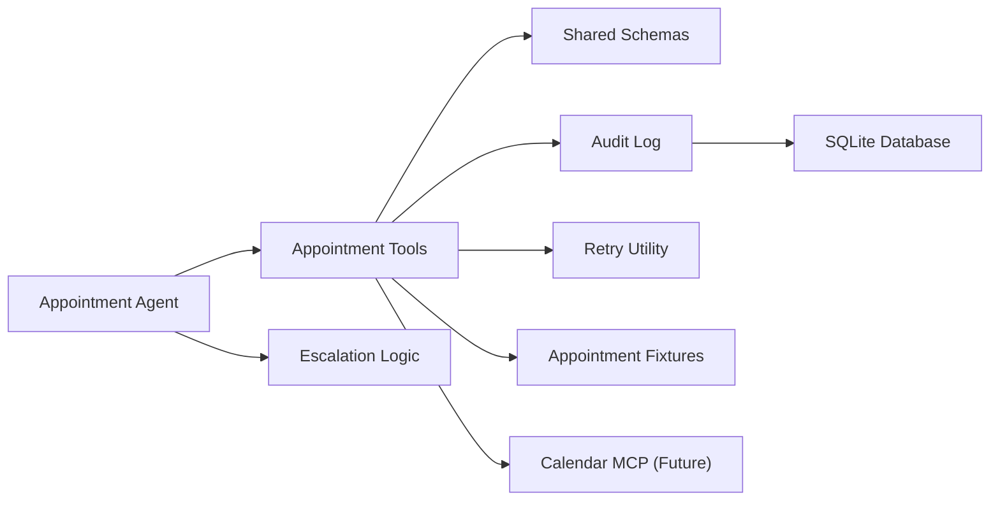

# Appointment Agent

<cite>
**Referenced Files in This Document**
- [appointment_agent.py](file://src/agents/appointment_agent.py)
- [appointment_tools.py](file://src/tools/appointment_tools.py)
- [schemas.py](file://src/models/schemas.py)
- [audit_log.py](file://src/models/audit_log.py)
- [escalation_logic.py](file://src/models/escalation_logic.py)
- [retry.py](file://src/tools/retry.py)
- [appointments.json](file://fixtures/appointments.json)
- [test_appointment_agent.py](file://tests/test_appointment_agent.py)
- [AGENTS.md](file://AGENTS.md)
- [SPEC.md](file://SPEC.md)
</cite>

## Table of Contents
1. [Introduction](#introduction)
2. [Project Structure](#project-structure)
3. [Core Components](#core-components)
4. [Architecture Overview](#architecture-overview)
5. [Detailed Component Analysis](#detailed-component-analysis)
6. [Dependency Analysis](#dependency-analysis)
7. [Performance Considerations](#performance-considerations)
8. [Troubleshooting Guide](#troubleshooting-guide)
9. [Conclusion](#conclusion)
10. [Appendices](#appendices)

## Introduction
The Appointment Agent coordinates healthcare provider calendars, prepares patients for upcoming appointments, and flags transportation needs for logistics coordination. It processes incoming care events, retrieves upcoming appointments within defined time windows, sends preparation checklists when needed, and signals the Logistics Agent for rides to medical appointments. All actions are audit-trailed and follow deterministic escalation rules.

Key responsibilities:
- Calendar management: retrieve upcoming appointments within a horizon window.
- Preparation checklist system: send prep instructions for appointments within 48 hours.
- Transportation coordination: flag appointments requiring transport within 7 days.
- Provider service management: schedule new appointments with providers (via tools).
- Audit trail integration: record before/after outcomes for compliance tracking.
- Error handling: robust retries and clear failure paths for scheduling conflicts and transport failures.

Note on Google Calendar API via SSE: The specification describes an external calendar MCP server that connects to Google Calendar via Qoder Connector using Server-Sent Events (SSE). In this implementation, appointment tools currently use fixture data; the same interfaces support future replacement by a real MCP server without changing agent logic.

**Section sources**
- [SPEC.md:128-165](file://SPEC.md#L128-L165)
- [SPEC.md:387-392](file://SPEC.md#L387-L392)
- [AGENTS.md:10-22](file://AGENTS.md#L10-L22)

## Project Structure
The Appointment Agent is composed of:
- Agent handler: event processing and orchestration logic.
- Tools: calendar retrieval, appointment scheduling, and checklist sending.
- Models: shared Pydantic schemas for structured data exchange.
- Audit log: immutable SQLite-backed audit trail.
- Escalation logic: deterministic classification of actions.
- Retry utility: exponential backoff for external calls.
- Fixtures: mock appointment data used during development/testing.

**Diagram sources**
- [appointment_agent.py:74-172](file://src/agents/appointment_agent.py#L74-L172)
- [appointment_tools.py:39-242](file://src/tools/appointment_tools.py#L39-L242)
- [schemas.py:23-116](file://src/models/schemas.py#L23-L116)
- [audit_log.py:81-130](file://src/models/audit_log.py#L81-L130)
- [escalation_logic.py:42-71](file://src/models/escalation_logic.py#L42-L71)
- [retry.py:22-70](file://src/tools/retry.py#L22-L70)
- [appointments.json:1-33](file://fixtures/appointments.json#L1-L33)

**Section sources**
- [appointment_agent.py:1-173](file://src/agents/appointment_agent.py#L1-L173)
- [appointment_tools.py:1-242](file://src/tools/appointment_tools.py#L1-L242)
- [schemas.py:1-150](file://src/models/schemas.py#L1-L150)
- [audit_log.py:1-167](file://src/models/audit_log.py#L1-L167)
- [escalation_logic.py:1-71](file://src/models/escalation_logic.py#L1-L71)
- [retry.py:1-70](file://src/tools/retry.py#L1-L70)
- [appointments.json:1-33](file://fixtures/appointments.json#L1-L33)

## Core Components
- Appointment Agent handler:
  - Processes incoming CareEvent of type appointment_upcoming.
  - Retrieves upcoming appointments within a 7-day horizon.
  - Sends prep checklists for appointments within 48 hours.
  - Flags logistics coordination for appointments within 7 days that require transportation.
  - Returns structured results summarizing actions taken and transport needs.

- Tools:
  - get_calendar(): loads fixtures, filters by care_recipient_id and horizon, returns Appointment objects.
  - schedule_appointment(): schedules a new appointment with retry and full audit trail (before/after).
  - send_prep_checklist(): validates appointment exists and returns ChecklistResult indicating delivery status.

- Models:
  - Appointment: core entity with datetime, location, prep_required, transportation_needed, and care_recipient_id.
  - CareEvent: input event with event_type, care_recipient_id, payload, received_at.
  - ChecklistResult: output from checklist sending with delivery_status and sent_at.
  - AuditEvent: immutable record of actor, action_type, rationale, outcome, correlation_id.

- Infrastructure:
  - Audit Log: append-only SQLite table with triggers preventing updates/deletes.
  - Escalation Logic: deterministic classification into auto/alert/approve categories.
  - Retry Utility: 3 attempts with exponential backoff for external calls.

**Section sources**
- [appointment_agent.py:25-172](file://src/agents/appointment_agent.py#L25-L172)
- [appointment_tools.py:39-242](file://src/tools/appointment_tools.py#L39-L242)
- [schemas.py:23-116](file://src/models/schemas.py#L23-L116)
- [audit_log.py:19-130](file://src/models/audit_log.py#L19-L130)
- [escalation_logic.py:13-71](file://src/models/escalation_logic.py#L13-L71)
- [retry.py:22-70](file://src/tools/retry.py#L22-L70)

## Architecture Overview
The Appointment Agent integrates with tools to manage calendars and coordinate logistics. It uses models for structured data and writes immutable audit events for every action. External calendar services can be integrated via MCP servers (Google Calendar through SSE), while current implementation uses fixtures for development and testing.

**Diagram sources**
- [appointment_agent.py:74-172](file://src/agents/appointment_agent.py#L74-L172)
- [appointment_tools.py:39-242](file://src/tools/appointment_tools.py#L39-L242)
- [audit_log.py:81-130](file://src/models/audit_log.py#L81-L130)
- [SPEC.md:387-392](file://SPEC.md#L387-L392)

## Detailed Component Analysis

### handle_appointment_event()
Responsibilities:
- Retrieve calendar for the care recipient within a 7-day horizon.
- Evaluate each appointment:
  - If within 48 hours: send prep checklist and record audit events.
  - If within 7 days and transportation_needed: flag logistics coordination.
- Return structured result including actions_taken, logistics_coordination_needed, checklists_sent, and transport_appointments.

Method signature and usage pattern:
- Input: CareEvent with event_type="appointment_upcoming".
- Output: dict with keys care_recipient_id, actions_taken, logistics_coordination_needed, checklists_sent, transport_appointments.
- Error handling: if no appointments found, returns early with descriptive actions.

**Diagram sources**
- [appointment_agent.py:74-172](file://src/agents/appointment_agent.py#L74-L172)
- [audit_log.py:81-130](file://src/models/audit_log.py#L81-L130)

**Section sources**
- [appointment_agent.py:74-172](file://src/agents/appointment_agent.py#L74-L172)
- [test_appointment_agent.py:97-127](file://tests/test_appointment_agent.py#L97-L127)

### Calendar Management and Scheduling
- get_calendar():
  - Loads appointment fixtures, filters by care_recipient_id and horizon_days.
  - Raises ValueError if no appointments found for the recipient.
  - Returns list of Appointment objects within the specified timeframe.

- schedule_appointment():
  - Writes a "before action" audit event with outcome="pending".
  - Uses retry utility for external API calls (currently simulated).
  - Writes "after action" audit event with outcome="success" or "failure".
  - Raises RuntimeError on failure after retries.

**Diagram sources**
- [schemas.py:23-116](file://src/models/schemas.py#L23-L116)
- [appointment_tools.py:39-200](file://src/tools/appointment_tools.py#L39-L200)

**Section sources**
- [appointment_tools.py:39-200](file://src/tools/appointment_tools.py#L39-L200)
- [schemas.py:23-116](file://src/models/schemas.py#L23-L116)

### Preparation Checklist System
- Triggered for appointments within 48 hours.
- Validates appointment existence and returns ChecklistResult with delivery status.
- Logs checklist sending and includes prep requirements from fixtures.

Usage pattern:
- Called by handle_appointment_event() for each qualifying appointment.
- Integrates with audit trail to record success or failure.

**Section sources**
- [appointment_agent.py:134-150](file://src/agents/appointment_agent.py#L134-L150)
- [appointment_tools.py:203-242](file://src/tools/appointment_tools.py#L203-L242)
- [appointments.json:1-33](file://fixtures/appointments.json#L1-L33)

### Transportation Coordination
- Flags appointments within 7 days that have transportation_needed=True.
- Signals Logistics Agent to arrange rides to medical appointments.
- Records audit events for logistics coordination attempts.

Integration points:
- handle_appointment_event() sets logistics_coordination_needed and lists transport_appointments.
- Future integration with Logistics Agent for ride arrangement.

**Section sources**
- [appointment_agent.py:152-159](file://src/agents/appointment_agent.py#L152-L159)
- [SPEC.md:161-164](file://SPEC.md#L161-L164)

### Provider Service Management
- schedule_appointment() creates new appointments with providers.
- Uses deterministic escalation logic to classify actions (alert category).
- Implements retry policy for external API calls.

Workflow:
- Classify action type.
- Write "before action" audit event.
- Execute scheduled appointment with retry.
- Write "after action" audit event with final outcome.

**Section sources**
- [appointment_tools.py:117-200](file://src/tools/appointment_tools.py#L117-L200)
- [escalation_logic.py:21-26](file://src/models/escalation_logic.py#L21-L26)

### Real-time Updates via Google Calendar API (SSE)
- Specification describes connecting to Google Calendar via Qoder Connector using Server-Sent Events (SSE).
- Current implementation uses fixtures; future replacement maintains same interfaces.
- Enables real-time appointment synchronization and updates.

Integration approach:
- Replace fixture-based get_calendar() with MCP server call.
- Maintain error handling and retry patterns.
- Ensure audit trail captures all calendar operations.

**Section sources**
- [SPEC.md:387-392](file://SPEC.md#L387-L392)
- [appointment_tools.py:83-115](file://src/tools/appointment_tools.py#L83-L115)

## Dependency Analysis
The Appointment Agent depends on several components:

**Diagram sources**
- [appointment_agent.py:13-17](file://src/agents/appointment_agent.py#L13-L17)
- [appointment_tools.py:15-18](file://src/tools/appointment_tools.py#L15-L18)
- [schemas.py:1-150](file://src/models/schemas.py#L1-L150)
- [audit_log.py:1-167](file://src/models/audit_log.py#L1-L167)
- [escalation_logic.py:1-71](file://src/models/escalation_logic.py#L1-L71)
- [retry.py:1-70](file://src/tools/retry.py#L1-L70)
- [appointments.json:1-33](file://fixtures/appointments.json#L1-L33)

**Section sources**
- [appointment_agent.py:13-17](file://src/agents/appointment_agent.py#L13-L17)
- [appointment_tools.py:15-18](file://src/tools/appointment_tools.py#L15-L18)

## Performance Considerations
- Calendar retrieval uses in-memory fixture loading for fast access during development.
- Retry utility implements exponential backoff (1s, 2s, 4s) for external API calls.
- Audit log writes are append-only with database indexes for efficient querying.
- Event processing loops through appointments efficiently with O(n) complexity.
- Timezone-aware datetime handling prevents scheduling conflicts across regions.

Optimization opportunities:
- Implement caching for frequently accessed appointment data.
- Batch audit log writes for high-volume scenarios.
- Use async I/O for external API calls to improve concurrency.

[No sources needed since this section provides general guidance]

## Troubleshooting Guide
Common issues and resolutions:

- No appointments found:
  - Verify care_recipient_id exists in fixtures.
  - Check horizon_days parameter for appropriate time window.
  - Review get_calendar() error handling and logging.

- Failed checklist sending:
  - Validate appointment_id exists in fixtures.
  - Check send_prep_checklist() error handling.
  - Review audit trail for detailed failure reasons.

- Scheduling conflicts:
  - Implement conflict detection in schedule_appointment().
  - Use retry utility for transient failures.
  - Log conflicts to audit trail with outcome="failure".

- Transportation failures:
  - Integrate with Logistics Agent for ride coordination.
  - Implement fallback mechanisms for failed rides.
  - Escalate to family members via Communication Agent.

- Audit trail immutability:
  - Ensure all writes go through write_audit_event().
  - Respect SQLite triggers preventing updates/deletes.
  - Use correlation_id to track related audit events.

**Section sources**
- [appointment_tools.py:62-65](file://src/tools/appointment_tools.py#L62-L65)
- [appointment_tools.py:226-229](file://src/tools/appointment_tools.py#L226-L229)
- [appointment_tools.py:183-200](file://src/tools/appointment_tools.py#L183-L200)
- [audit_log.py:46-78](file://src/models/audit_log.py#L46-L78)
- [retry.py:52-69](file://src/tools/retry.py#L52-L69)

## Conclusion
The Appointment Agent provides comprehensive calendar management and healthcare provider coordination capabilities. It handles appointment scheduling, preparation checklists, transportation coordination, and integrates with audit trails for compliance tracking. The architecture supports future integration with Google Calendar API via SSE while maintaining robust error handling and retry mechanisms. The deterministic escalation logic ensures safety-critical decisions follow predefined rules rather than LLM-driven classifications.

Key strengths:
- Structured data exchange using Pydantic models.
- Immutable audit trail for compliance and accountability.
- Robust error handling with retry mechanisms.
- Clear separation of concerns between agents and tools.
- Support for both current fixture-based development and future real API integration.

**Section sources**
- [SPEC.md:128-165](file://SPEC.md#L128-L165)
- [AGENTS.md:10-22](file://AGENTS.md#L10-L22)
- [appointment_agent.py:1-173](file://src/agents/appointment_agent.py#L1-L173)

## Appendices

### Method Signatures Reference
- handle_appointment_event(event: CareEvent) -> dict
- get_calendar(care_recipient_id: str, horizon_days: int = 30) -> list[Appointment]
- schedule_appointment(provider_id: str, care_recipient_id: str, preferred_datetime: datetime) -> Appointment
- send_prep_checklist(appointment_id: str) -> ChecklistResult

### Data Models Reference
- Appointment: appointment_id, provider_name, specialty, datetime, location, prep_required, transportation_needed, care_recipient_id
- CareEvent: event_id, event_type, care_recipient_id, payload, received_at
- ChecklistResult: appointment_id, checklist_sent, delivery_status, sent_at
- AuditEvent: event_id, timestamp, actor, action_type, care_recipient_id, rationale, outcome, correlation_id, authorization_ref

**Section sources**
- [appointment_agent.py:74-172](file://src/agents/appointment_agent.py#L74-L172)
- [appointment_tools.py:39-242](file://src/tools/appointment_tools.py#L39-L242)
- [schemas.py:23-116](file://src/models/schemas.py#L23-L116)