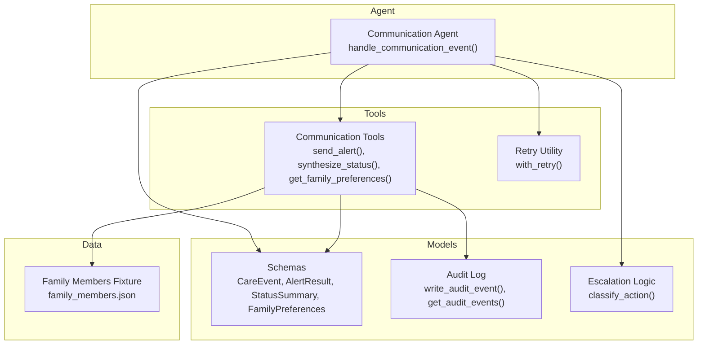
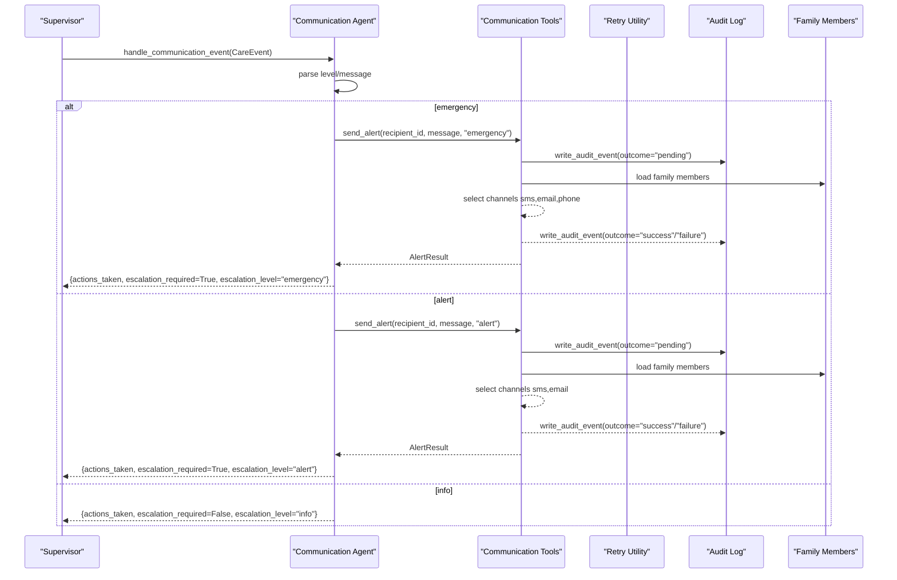
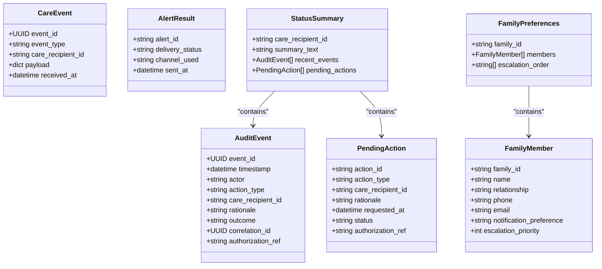
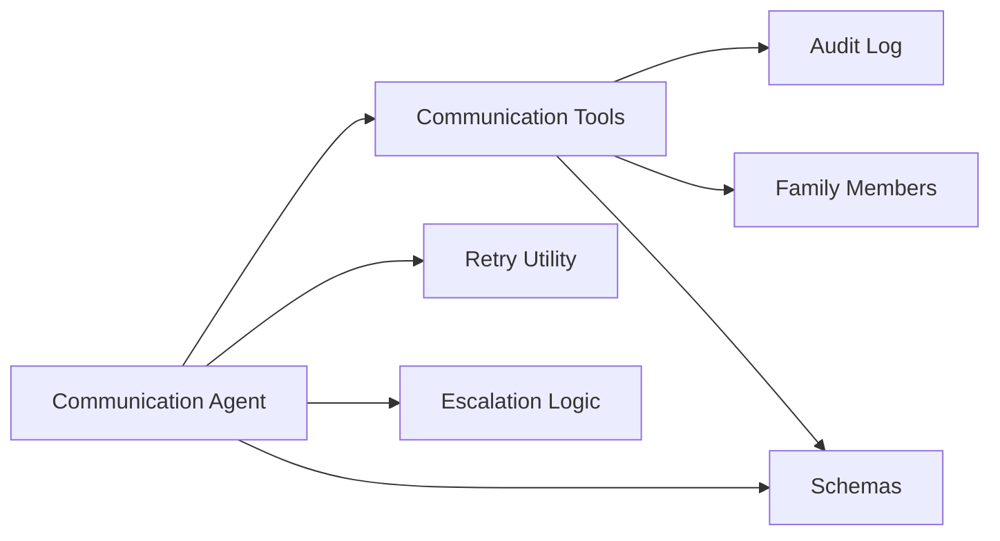
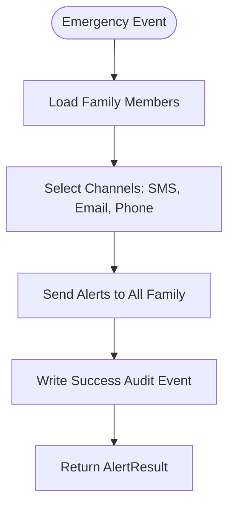
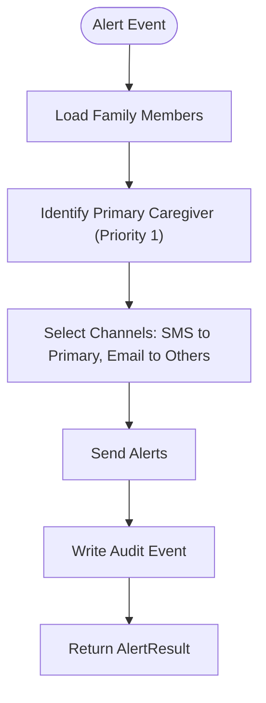

# Communication Agent

<cite>
**Referenced Files in This Document**
- [communication_agent.py](file://src/agents/communication_agent.py)
- [communication_tools.py](file://src/tools/communication_tools.py)
- [retry.py](file://src/tools/retry.py)
- [audit_log.py](file://src/models/audit_log.py)
- [schemas.py](file://src/models/schemas.py)
- [escalation_logic.py](file://src/models/escalation_logic.py)
- [family_members.json](file://fixtures/family_members.json)
- [test_communication_agent.py](file://tests/test_communication_agent.py)
</cite>

## Table of Contents
1. [Introduction](#introduction)
2. [Project Structure](#project-structure)
3. [Core Components](#core-components)
4. [Architecture Overview](#architecture-overview)
5. [Detailed Component Analysis](#detailed-component-analysis)
6. [Dependency Analysis](#dependency-analysis)
7. [Performance Considerations](#performance-considerations)
8. [Troubleshooting Guide](#troubleshooting-guide)
9. [Conclusion](#conclusion)
10. [Appendices](#appendices)

## Introduction
The Communication Agent is responsible for family notifications and care status synthesis. It processes incoming care events, determines the appropriate escalation level, and routes alerts to family members via SMS, email, or phone channels. It also synthesizes natural language summaries of recent care activities and pending actions for daily digests and caregiver queries. The agent integrates with a retry mechanism for reliable delivery and maintains an immutable audit trail for compliance.

## Project Structure
The Communication Agent spans agents, tools, models, and fixtures:
- Agent entry point handles communication events and orchestrates alerting and status synthesis.
- Tools implement messaging simulation, family preference resolution, and status synthesis using audit logs.
- Models define shared data structures (events, results, preferences).
- Retry utilities provide robust external call handling.
- Fixtures provide sample family member data used by tools.

**Diagram sources**
- [communication_agent.py:28-163](file://src/agents/communication_agent.py#L28-L163)
- [communication_tools.py:54-279](file://src/tools/communication_tools.py#L54-L279)
- [retry.py:22-69](file://src/tools/retry.py#L22-L69)
- [audit_log.py:81-167](file://src/models/audit_log.py#L81-L167)
- [schemas.py:56-149](file://src/models/schemas.py#L56-L149)
- [escalation_logic.py:42-71](file://src/models/escalation_logic.py#L42-L71)
- [family_members.json:1-30](file://fixtures/family_members.json#L1-L30)

**Section sources**
- [communication_agent.py:1-163](file://src/agents/communication_agent.py#L1-L163)
- [communication_tools.py:1-279](file://src/tools/communication_tools.py#L1-L279)
- [schemas.py:1-150](file://src/models/schemas.py#L1-L150)
- [audit_log.py:1-167](file://src/models/audit_log.py#L1-L167)
- [retry.py:1-70](file://src/tools/retry.py#L1-L70)
- [escalation_logic.py:1-71](file://src/models/escalation_logic.py#L1-L71)
- [family_members.json:1-30](file://fixtures/family_members.json#L1-L30)

## Core Components
- handle_communication_event(): Main entry point that processes CareEvent payloads, decides escalation, and triggers alerts or digest batching.
- send_family_alert(): Wraps send_alert with retry logic for reliable delivery.
- synthesize_status(): Builds natural language summaries from audit events and pending actions.
- send_alert(): Determines channels and targets based on severity; writes audit events before and after sending; simulates delivery by logging messages.
- get_family_preferences(): Loads family members and builds escalation order sorted by priority.
- with_retry(): Provides exponential backoff retries for external calls.
- Audit log: Immutable SQLite-backed event store ensuring compliance and traceability.

**Section sources**
- [communication_agent.py:28-163](file://src/agents/communication_agent.py#L28-L163)
- [communication_tools.py:54-279](file://src/tools/communication_tools.py#L54-L279)
- [retry.py:22-69](file://src/tools/retry.py#L22-L69)
- [audit_log.py:81-167](file://src/models/audit_log.py#L81-L167)

## Architecture Overview
The Communication Agent coordinates event-driven notifications and status synthesis:
- Events arrive as CareEvent objects with payload containing level and message.
- Based on level, the agent either sends immediate alerts (alert/emergency) or queues info-level events for daily digest.
- Alerts are sent via send_alert, which selects channels and recipients according to family preferences and severity.
- All actions are audited with before/after events for compliance.
- Status synthesis reads audit events to produce human-readable summaries.

**Diagram sources**
- [communication_agent.py:28-115](file://src/agents/communication_agent.py#L28-L115)
- [communication_tools.py:54-157](file://src/tools/communication_tools.py#L54-L157)
- [audit_log.py:81-130](file://src/models/audit_log.py#L81-L130)
- [family_members.json:1-30](file://fixtures/family_members.json#L1-L30)

## Detailed Component Analysis

### Event Handling and Escalation
- handle_communication_event() extracts care_recipient_id, level, and message from CareEvent.
- For emergency: sends full channel blast to all family members; sets escalation_required=True and escalation_level="emergency".
- For alert: sends SMS to primary caregiver and email to others; sets escalation_required=True and escalation_level="alert".
- For info: queues for daily digest without immediate notification; sets escalation_level="info".
- Returns structured result including actions_taken, escalation flags, and optional AlertResult.

Usage pattern:
- Call handle_communication_event(event) from the Supervisor when a care event occurs.
- Inspect returned dict to determine if escalation was required and what actions were taken.

**Section sources**
- [communication_agent.py:28-115](file://src/agents/communication_agent.py#L28-L115)
- [test_communication_agent.py:110-141](file://tests/test_communication_agent.py#L110-L141)

### Alert Delivery and Channel Selection
- send_alert() writes a "before action" audit event with outcome="pending".
- Loads family members from fixtures and selects channels/targets based on level:
  - emergency: sms,email,phone to all family members
  - alert: sms to primary caregiver (priority 1), email to others
  - info: batch into daily digest queue
- Simulates delivery by appending JSON-lines records to logs/messages.log.
- Writes follow-up audit event with outcome="success" or "failure".
- Returns AlertResult with delivery_status, channel_used, and sent_at.

Message composition system:
- Channels are determined deterministically by level and family preferences.
- Targets include names and channel types for clarity in logs.

Error handling:
- On failure, writes failure audit event and raises RuntimeError indicating messaging API failure.

Integration points:
- Currently simulates messaging via file logging; designed for future MCP-based integrations (Day 2).

**Section sources**
- [communication_tools.py:54-157](file://src/tools/communication_tools.py#L54-L157)
- [audit_log.py:81-130](file://src/models/audit_log.py#L81-L130)
- [test_communication_agent.py:23-55](file://tests/test_communication_agent.py#L23-L55)

### Retry Mechanism
- with_retry() wraps async or sync functions with up to 3 attempts and exponential backoff (1s, 2s, 4s).
- Logs warnings on each failed attempt and errors when all attempts are exhausted.
- Raises RetryExhausted with last_exception when retries fail.

Usage in Communication Agent:
- send_family_alert() uses with_retry(send_alert, ...) to ensure reliable delivery.
- handle_communication_event() catches RetryExhausted to log failures and mark escalation as required.

**Section sources**
- [retry.py:22-69](file://src/tools/retry.py#L22-L69)
- [communication_agent.py:118-146](file://src/agents/communication_agent.py#L118-L146)

### Status Synthesis
- synthesize_status(care_recipient_id) reads audit events for the recipient.
- Converts events to AuditEvent models and identifies pending actions where outcome="pending".
- Builds summary_text describing recent activity and pending items.
- Returns StatusSummary with care_recipient_id, summary_text, recent_events, and pending_actions.

Natural language summaries:
- If events exist: includes count, last action type/outcome/timestamp, and pending action count.
- If no events: indicates no recent events recorded.

Usage pattern:
- Call get_care_status(care_recipient_id) from the agent to retrieve StatusSummary for daily digests or caregiver queries.

**Section sources**
- [communication_tools.py:160-231](file://src/tools/communication_tools.py#L160-L231)
- [communication_agent.py:149-163](file://src/agents/communication_agent.py#L149-L163)
- [test_communication_agent.py:57-72](file://tests/test_communication_agent.py#L57-L72)

### Family Preferences and Escalation Order
- get_family_preferences(family_id) loads family members from fixtures and filters by family_id.
- Builds FamilyMember models and computes escalation_order sorted by escalation_priority ascending.
- Raises ValueError if family_id not found.

Example family structure:
- Three members with varying notification preferences and priorities.
- Primary caregiver identified by escalation_priority=1.

**Section sources**
- [communication_tools.py:234-279](file://src/tools/communication_tools.py#L234-L279)
- [family_members.json:1-30](file://fixtures/family_members.json#L1-L30)
- [test_communication_agent.py:74-89](file://tests/test_communication_agent.py#L74-L89)

### Data Models
Key models used by the Communication Agent:
- CareEvent: Represents incoming events with event_type, care_recipient_id, and payload.
- AlertResult: Captures delivery confirmation including channel_used and sent_at.
- StatusSummary: Contains summary_text, recent_events, and pending_actions.
- FamilyPreferences: Includes family_id, members list, and escalation_order.
- AuditEvent: Immutable record of agent actions with actor, action_type, rationale, outcome, correlation_id.

**Section sources**
- [schemas.py:56-149](file://src/models/schemas.py#L56-L149)

### Class Diagram

**Diagram sources**
- [schemas.py:34-149](file://src/models/schemas.py#L34-L149)

## Dependency Analysis
The Communication Agent depends on:
- Communication Tools for alerting and synthesis.
- Retry Utility for resilient external calls.
- Audit Log for compliance and history.
- Schemas for structured data exchange.
- Escalation Logic for deterministic classification.
- Family Members fixture for recipient targeting.

**Diagram sources**
- [communication_agent.py:10-23](file://src/agents/communication_agent.py#L10-L23)
- [communication_tools.py:14-24](file://src/tools/communication_tools.py#L14-L24)
- [audit_log.py:81-167](file://src/models/audit_log.py#L81-L167)
- [schemas.py:56-149](file://src/models/schemas.py#L56-L149)
- [escalation_logic.py:42-71](file://src/models/escalation_logic.py#L42-L71)
- [family_members.json:1-30](file://fixtures/family_members.json#L1-L30)

**Section sources**
- [communication_agent.py:10-23](file://src/agents/communication_agent.py#L10-L23)
- [communication_tools.py:14-24](file://src/tools/communication_tools.py#L14-L24)

## Performance Considerations
- Retry mechanism uses exponential backoff to reduce load on external services during transient failures.
- Audit log writes are append-only with indexes on timestamp, correlation_id, and care_recipient_id for efficient queries.
- Family member loading is fixture-based for fast access; consider caching for high-throughput scenarios.
- Status synthesis iterates audit events; consider pagination or time-bounded queries for large histories.

[No sources needed since this section provides general guidance]

## Troubleshooting Guide
Common issues and resolutions:
- Messaging API failure: send_alert() raises RuntimeError after writing failure audit event. Check logs/messages.log and audit.db for details.
- Retry exhaustion: RetryExhausted raised when all attempts fail. Inspect last_exception for root cause.
- Invalid family_id: get_family_preferences() raises ValueError. Verify family_id exists in fixtures.
- Empty status: synthesize_status() returns "No recent events" if no audit events exist. Ensure events are being written.

Debugging steps:
- Review audit.db for before/after audit events with correlation_id linking related actions.
- Check logs/messages.log for message delivery attempts and outcomes.
- Validate family_members.json structure and escalation priorities.

**Section sources**
- [communication_tools.py:142-157](file://src/tools/communication_tools.py#L142-L157)
- [retry.py:14-69](file://src/tools/retry.py#L14-L69)
- [audit_log.py:81-167](file://src/models/audit_log.py#L81-L167)
- [test_communication_agent.py:47-55](file://tests/test_communication_agent.py#L47-L55)

## Conclusion
The Communication Agent provides robust family notifications and care status synthesis through deterministic escalation, reliable retry mechanisms, and comprehensive audit trails. It supports SMS, email, and phone channels, with clear separation between immediate alerts and daily digests. The design ensures compliance through immutable audit logs and offers extensibility for future messaging service integrations.

[No sources needed since this section summarizes without analyzing specific files]

## Appendices

### Method Signatures and Usage Patterns

#### handle_communication_event()
- Purpose: Process CareEvent and route notifications based on escalation level.
- Parameters: event (CareEvent)
- Returns: dict with care_recipient_id, actions_taken, escalation_required, escalation_level, alert_result
- Usage: Called by Supervisor when care events occur; inspect return value for escalation decisions.

**Section sources**
- [communication_agent.py:28-115](file://src/agents/communication_agent.py#L28-L115)

#### synthesize_status()
- Purpose: Generate natural language summary of recent care activities and pending actions.
- Parameters: care_recipient_id (str)
- Returns: StatusSummary with summary_text, recent_events, pending_actions
- Usage: Called by get_care_status() for daily digests or caregiver queries.

**Section sources**
- [communication_tools.py:160-231](file://src/tools/communication_tools.py#L160-L231)
- [communication_agent.py:149-163](file://src/agents/communication_agent.py#L149-L163)

### Alert Generation Workflows

#### Emergency Alert Workflow

**Diagram sources**
- [communication_tools.py:93-140](file://src/tools/communication_tools.py#L93-L140)
- [audit_log.py:81-130](file://src/models/audit_log.py#L81-L130)

#### Alert Workflow

**Diagram sources**
- [communication_tools.py:96-140](file://src/tools/communication_tools.py#L96-L140)
- [audit_log.py:81-130](file://src/models/audit_log.py#L81-L130)

### Message Formatting Examples
- Emergency: Full channel blast to all family members with detailed message content.
- Alert: SMS to primary caregiver with concise alert; email to others with expanded details.
- Info: Batched into daily digest with routine updates.

**Section sources**
- [communication_tools.py:93-118](file://src/tools/communication_tools.py#L93-L118)

### Status Reporting Examples
- Recent activity summary: Includes event count, last action type/outcome/timestamp.
- Pending actions: Lists actions awaiting resolution with rationale and timestamps.
- Empty state: Indicates no recent events recorded for the care recipient.

**Section sources**
- [communication_tools.py:208-231](file://src/tools/communication_tools.py#L208-L231)