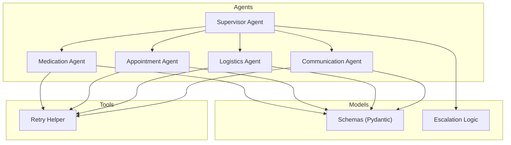
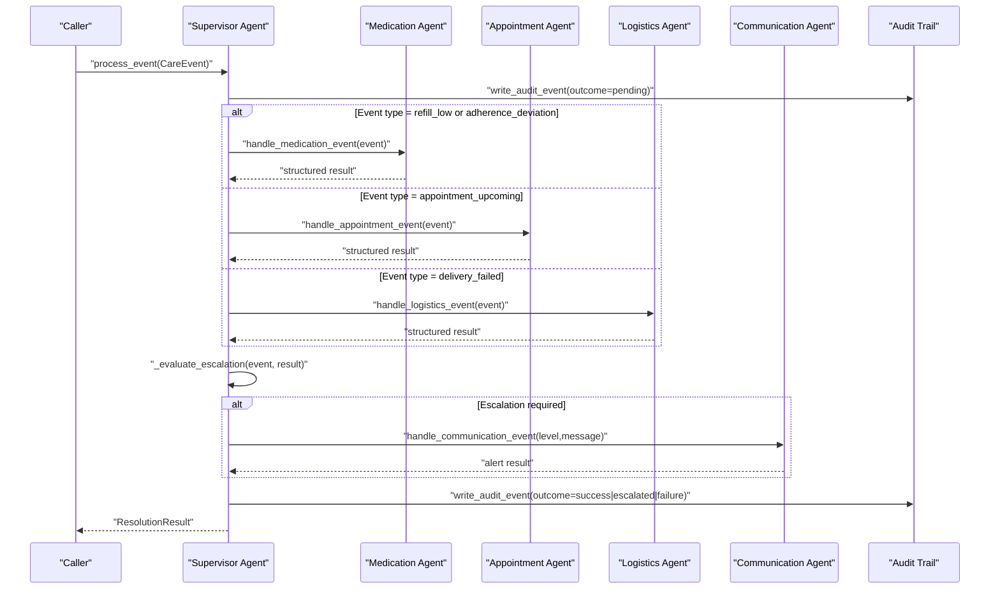
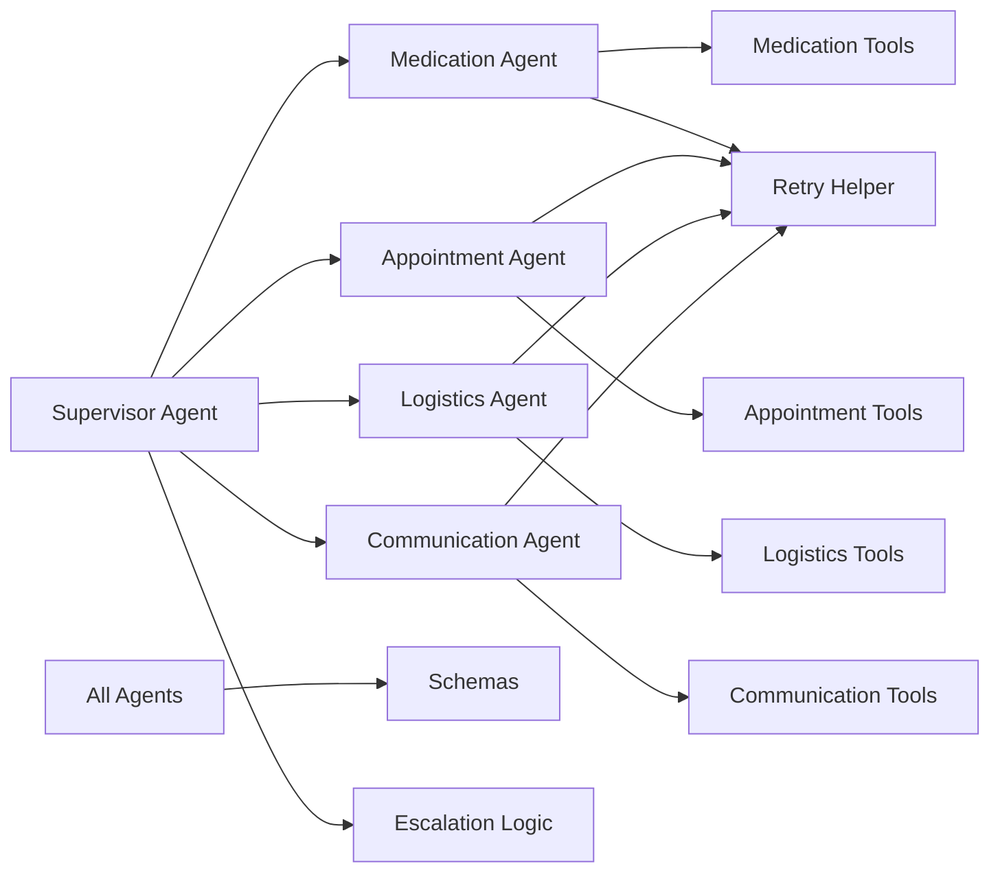

# Core Agents

<cite>
**Referenced Files in This Document**
- [supervisor_agent.py](file://src/agents/supervisor_agent.py)
- [medication_agent.py](file://src/agents/medication_agent.py)
- [appointment_agent.py](file://src/agents/appointment_agent.py)
- [logistics_agent.py](file://src/agents/logistics_agent.py)
- [communication_agent.py](file://src/agents/communication_agent.py)
- [schemas.py](file://src/models/schemas.py)
- [escalation_logic.py](file://src/models/escalation_logic.py)
- [retry.py](file://src/tools/retry.py)
- [AGENTS.md](file://AGENTS.md)
- [main.py](file://main.py)
- [test_supervisor.py](file://tests/test_supervisor.py)
- [test_medication_agent.py](file://tests/test_medication_agent.py)
</cite>

## Table of Contents
1. [Introduction](#introduction)
2. [Project Structure](#project-structure)
3. [Core Components](#core-components)
4. [Architecture Overview](#architecture-overview)
5. [Detailed Component Analysis](#detailed-component-analysis)
6. [Dependency Analysis](#dependency-analysis)
7. [Performance Considerations](#performance-considerations)
8. [Troubleshooting Guide](#troubleshooting-guide)
9. [Conclusion](#conclusion)

## Introduction
CareBridge implements a five-agent system for care coordination: one supervisor agent orchestrates four specialized agents (Medication, Appointment, Logistics, Communication). The supervisor is the single entry point for care events and enforces strict boundaries: no direct agent-to-agent calls, deterministic escalation logic, and an immutable audit trail written before any action executes. The system supports two orchestration modes:
- Deterministic direct routing via async functions when the Strands SDK is unavailable.
- Strands agents-as-tools mode that wraps each specialized agent as callable tools for LLM-driven orchestration while still enforcing deterministic escalation and audit rules.

This document explains the architecture, responsibilities, method signatures, behavior rules, invocation patterns, and error handling strategies across all agents.

## Project Structure
The core agent system lives under src/agents with shared models and tools:
- Agents: supervisor_agent.py, medication_agent.py, appointment_agent.py, logistics_agent.py, communication_agent.py
- Models: schemas.py (Pydantic v2 data contracts), escalation_logic.py (deterministic classification)
- Tools: retry.py (shared retry helper used by multiple agents)
- Entry point: main.py initializes audit DB, loads fixtures, runs demo scenarios
- Rules: AGENTS.md defines non-negotiable constraints on scope, communication, escalation, and failure recovery

**Diagram sources**
- [supervisor_agent.py:21-39](file://src/agents/supervisor_agent.py#L21-L39)
- [medication_agent.py:9-16](file://src/agents/medication_agent.py#L9-L16)
- [appointment_agent.py:13-17](file://src/agents/appointment_agent.py#L13-L17)
- [logistics_agent.py:11-15](file://src/agents/logistics_agent.py#L11-L15)
- [communication_agent.py:10-23](file://src/agents/communication_agent.py#L10-L23)
- [schemas.py:56-70](file://src/models/schemas.py#L56-L70)
- [escalation_logic.py:13-39](file://src/models/escalation_logic.py#L13-L39)
- [retry.py:22-69](file://src/tools/retry.py#L22-L69)

**Section sources**
- [AGENTS.md:8-33](file://AGENTS.md#L8-L33)
- [main.py:143-177](file://main.py#L143-L177)

## Core Components
- Supervisor Agent: routes events to specialized agents, applies deterministic escalation, writes audit events before execution, and optionally integrates with Strands agents-as-tools.
- Medication Agent: monitors refill status, orders refills with retries, detects adherence deviations, and escalates on failures or significant deviations.
- Appointment Agent: checks upcoming appointments within time windows, sends prep checklists, and flags transportation needs for logistics coordination.
- Logistics Agent: handles delivery failures, differentiates essential vs non-essential deliveries, retries non-essential failures, and escalates essential failures.
- Communication Agent: sends family alerts at appropriate severity levels, queues info-level updates into daily digests, and synthesizes status summaries.

Key shared contracts:
- CareEvent: typed event envelope with event_type, care_recipient_id, payload, received_at.
- ResolutionResult: standardized result returned by process_event with actions_taken and escalation metadata.
- Escalation classification: deterministic sets for autonomous, alert, and approve categories; emergency triggers are hard-coded.

**Section sources**
- [schemas.py:56-70](file://src/models/schemas.py#L56-L70)
- [escalation_logic.py:13-39](file://src/models/escalation_logic.py#L13-L39)
- [supervisor_agent.py:285-395](file://src/agents/supervisor_agent.py#L285-L395)

## Architecture Overview
The supervisor is the central orchestrator. It never calls external APIs directly; it routes work to specialized agents, evaluates escalation deterministically, and ensures every action is audited before execution. When escalation is required, it constructs a new CareEvent for the Communication Agent with level and message derived from the event and agent results.

**Diagram sources**
- [supervisor_agent.py:259-395](file://src/agents/supervisor_agent.py#L259-L395)
- [medication_agent.py:23-134](file://src/agents/medication_agent.py#L23-L134)
- [appointment_agent.py:74-172](file://src/agents/appointment_agent.py#L74-L172)
- [logistics_agent.py:182-235](file://src/agents/logistics_agent.py#L182-L235)
- [communication_agent.py:28-115](file://src/agents/communication_agent.py#L28-L115)

## Detailed Component Analysis

### Supervisor Agent
Responsibilities:
- Route incoming CareEvent to the correct specialized agent based on event_type.
- Write audit events before and after processing (immutable, append-only).
- Apply deterministic escalation using classify_action and hard-coded emergency triggers.
- On escalation, route to Communication Agent with constructed level/message.
- Support Strands agents-as-tools wiring by exposing specialized handlers as callable tools.

Key methods:
- process_event(event: CareEvent) -> ResolutionResult
  - Parameters: CareEvent with event_type in {"refill_low", "appointment_upcoming", "delivery_failed", "adherence_deviation"}
  - Returns: ResolutionResult with resolved flag, actions_taken list, escalation_required boolean, escalation_level ("info"|"alert"|"emergency"|None), audit_event_ids list
  - Behavior: Writes pending audit event, routes to specialized agent, evaluates escalation, optionally invokes Communication Agent, writes final outcome, returns structured result
- query_status(care_recipient_id: str, question: str) -> str
  - Parameters: recipient ID and natural language question
  - Returns: synthesized status string
  - Behavior: Uses synthesize_status tool, writes audit event
- approve_pending_action(action_id: str, approved: bool) -> None
  - Parameters: audit event_id of a pending action, approval decision
  - Returns: None
  - Behavior: Validates state, records human decision, routes approved actions to owning agent via re-dispatched CareEvent, logs outcomes
- create_supervisor_agent() -> Optional[Any]
  - Returns: Strands Agent instance if SDK available, else None (graceful degradation)

Behavior rules:
- No direct external API calls; only routing and orchestration.
- Escalation decisions are deterministic; never LLM-decided.
- Strict boundaries enforced: no direct agent-to-agent calls.

Invocation examples:
- Direct routing: main.py constructs CareEvent instances and calls process_event.
- Strands mode: create_supervisor_agent exposes handle_* functions as tools for LLM orchestration.

Error handling:
- Routing exceptions produce failure audit entries and return ResolutionResult with error actions.
- Communication Agent failures are captured and surfaced in actions_taken without silent failure.

**Section sources**
- [supervisor_agent.py:285-395](file://src/agents/supervisor_agent.py#L285-L395)
- [supervisor_agent.py:398-429](file://src/agents/supervisor_agent.py#L398-L429)
- [supervisor_agent.py:432-592](file://src/agents/supervisor_agent.py#L432-L592)
- [supervisor_agent.py:599-641](file://src/agents/supervisor_agent.py#L599-L641)
- [main.py:92-140](file://main.py#L92-L140)
- [test_supervisor.py:67-114](file://tests/test_supervisor.py#L67-L114)

### Medication Agent
Responsibilities:
- Check refill status for medications.
- Order refills when eligible, with retry logic.
- Detect adherence patterns and escalate on moderate/severe deviations.
- Return structured results including refill status/order and adherence analysis.

Key methods:
- handle_medication_event(event: CareEvent) -> dict
  - Parameters: CareEvent with payload containing medication_id
  - Returns: dict with keys medication_id, actions_taken, escalation_required, escalation_level, refill_status, refill_order, adherence
  - Behavior: Validates input, checks refill status, orders refill if eligible, detects adherence, sets escalation flags
- process_refill(medication_id: str, pharmacy_id: str) -> RefillOrder
  - Parameters: medication_id, pharmacy_id
  - Returns: RefillOrder with order details
  - Behavior: Wraps order_refill with retry; raises RetryExhausted on exhaustion
- check_and_flag_adherence(medication_id: str) -> AdherencePattern
  - Parameters: medication_id
  - Returns: AdherencePattern with deviation analysis
  - Behavior: Logs warnings for moderate/severe deviations

Behavior rules:
- Only interacts with pharmacy-related tools; no calendar or delivery access.
- All actions are audit-trailed by underlying tools.

Error handling:
- Missing medication_id returns error actions without escalation.
- Pharmacy API failures trigger retries; exhaustion escalates to alert.

Invocation examples:
- Supervisor routes refill_low and adherence_deviation events to this agent.
- Tests validate refill ordering and adherence detection paths.

**Section sources**
- [medication_agent.py:23-134](file://src/agents/medication_agent.py#L23-L134)
- [medication_agent.py:137-159](file://src/agents/medication_agent.py#L137-L159)
- [medication_agent.py:162-189](file://src/agents/medication_agent.py#L162-L189)
- [test_medication_agent.py:120-177](file://tests/test_medication_agent.py#L120-L177)

### Appointment Agent
Responsibilities:
- Retrieve upcoming appointments within defined time windows.
- Send prep checklists for appointments within 48 hours.
- Flag transportation needs for appointments within 7 days requiring transport.

Key methods:
- check_upcoming_appointments(care_recipient_id: str) -> list[dict]
  - Parameters: care_recipient_id
  - Returns: list of dicts with appointment, needs_checklist, needs_transport
  - Behavior: Queries calendar, computes time windows, filters relevant appointments
- handle_appointment_event(event: CareEvent) -> dict
  - Parameters: CareEvent (expected event_type="appointment_upcoming")
  - Returns: dict with care_recipient_id, actions_taken, logistics_coordination_needed, checklists_sent, transport_appointments
  - Behavior: Retrieves calendar, sends checklists for near-term appointments, flags logistics needs

Behavior rules:
- Calendar-only scope; no medication or delivery modifications.
- Time-based thresholds: 48 hours for checklists, 7 days for transport coordination.

Error handling:
- Missing appointments log warnings and return empty results.
- Checklist sending failures are logged and recorded in actions_taken.

Invocation examples:
- Supervisor routes appointment_upcoming events to this agent.
- Tests verify routing and expected actions.

**Section sources**
- [appointment_agent.py:25-71](file://src/agents/appointment_agent.py#L25-L71)
- [appointment_agent.py:74-172](file://src/agents/appointment_agent.py#L74-L172)
- [test_supervisor.py:79-89](file://tests/test_supervisor.py#L79-L89)

### Logistics Agent
Responsibilities:
- Handle delivery failures with escalation rules.
- Differentiate essential vs non-essential deliveries.
- Retry non-essential failures once; escalate essential failures immediately.

Key methods:
- process_delivery_failure(delivery_id: str, care_recipient_id: str) -> dict
  - Parameters: delivery_id, care_recipient_id
  - Returns: dict with delivery_id, status, escalated, escalation_level, retry_attempted, actions_taken
  - Behavior: Checks current status, infers delivery type, escalates essential failures, retries non-essential failures
- handle_logistics_event(event: CareEvent) -> dict
  - Parameters: CareEvent
  - Returns: dict with event_id, event_type, actions_taken, escalation_required, escalation_level
  - Behavior: Routes delivery_failed events to process_delivery_failure; logs other event types

Behavior rules:
- Delivery-only scope; no medication or appointment modifications.
- Essential delivery types: pharmacy, medication, food, grocery.

Error handling:
- Missing delivery IDs raise alert escalation.
- Non-essential retry exhaustion logs warning without escalation.

Invocation examples:
- Supervisor routes delivery_failed events to this agent.
- Tests confirm essential delivery escalation.

**Section sources**
- [logistics_agent.py:23-152](file://src/agents/logistics_agent.py#L23-L152)
- [logistics_agent.py:155-179](file://src/agents/logistics_agent.py#L155-L179)
- [logistics_agent.py:182-235](file://src/agents/logistics_agent.py#L182-L235)
- [test_supervisor.py:91-114](file://tests/test_supervisor.py#L91-L114)

### Communication Agent
Responsibilities:
- Send family alerts at appropriate severity levels (info, alert, emergency).
- Queue info-level events into daily digest batching.
- Synthesize status summaries for caregiver queries.

Key methods:
- handle_communication_event(event: CareEvent) -> dict
  - Parameters: CareEvent with payload containing level and message
  - Returns: dict with care_recipient_id, actions_taken, escalation_required, escalation_level, alert_result
  - Behavior: Routes to send_family_alert for alert/emergency; queues info events; returns structured results
- send_family_alert(care_recipient_id: str, message: str, level: str) -> AlertResult
  - Parameters: care_recipient_id, message, level
  - Returns: AlertResult with delivery confirmation
  - Behavior: Wraps send_alert with retry logic; raises RetryExhausted on exhaustion
- get_care_status(care_recipient_id: str) -> StatusSummary
  - Parameters: care_recipient_id
  - Returns: StatusSummary with summary text and recent events

Behavior rules:
- Messaging-only scope; no modification of care data.
- Emergency alerts notify all family members; alert level uses SMS/email mix; info level batches into digest.

Error handling:
- Retry exhaustion surfaces failures in actions_taken and maintains escalation flags.

Invocation examples:
- Supervisor invokes this agent when escalation is required.
- Main entry point uses query_status which internally calls synthesize_status.

**Section sources**
- [communication_agent.py:28-115](file://src/agents/communication_agent.py#L28-L115)
- [communication_agent.py:118-146](file://src/agents/communication_agent.py#L118-L146)
- [communication_agent.py:149-163](file://src/agents/communication_agent.py#L149-L163)
- [supervisor_agent.py:346-366](file://src/agents/supervisor_agent.py#L346-L366)

## Dependency Analysis
Agent dependencies and coupling:
- Supervisor depends on all specialized agents and shared models/tools.
- Specialized agents depend on their respective tools and shared retry utility.
- All agents use Pydantic schemas for structured data exchange.
- Escalation logic is centralized and deterministic.

**Diagram sources**
- [supervisor_agent.py:21-39](file://src/agents/supervisor_agent.py#L21-L39)
- [medication_agent.py:9-16](file://src/agents/medication_agent.py#L9-L16)
- [appointment_agent.py:13-17](file://src/agents/appointment_agent.py#L13-L17)
- [logistics_agent.py:11-15](file://src/agents/logistics_agent.py#L11-L15)
- [communication_agent.py:10-23](file://src/agents/communication_agent.py#L10-L23)
- [schemas.py:56-70](file://src/models/schemas.py#L56-L70)
- [escalation_logic.py:13-39](file://src/models/escalation_logic.py#L13-L39)
- [retry.py:22-69](file://src/tools/retry.py#L22-L69)

**Section sources**
- [AGENTS.md:8-33](file://AGENTS.md#L8-L33)
- [supervisor_agent.py:259-278](file://src/agents/supervisor_agent.py#L259-L278)

## Performance Considerations
- Retry strategy: Shared with_retry helper uses exponential backoff (1s, 2s, 4s) with 3 attempts, reducing transient failures impact.
- Deterministic routing: Supervisor routing is O(1) lookup by event_type, minimizing overhead.
- Audit logging: Immutable audit events add minimal overhead but ensure compliance and traceability.
- Time-window calculations: Appointment agent uses efficient datetime comparisons for filtering upcoming appointments.
- Batch processing: Communication agent queues info-level events for daily digest batching to reduce notification noise.

[No sources needed since this section provides general guidance]

## Troubleshooting Guide
Common issues and resolutions:
- Missing medication_id in medication events: Medication agent returns error actions without escalation; validate event payloads before submission.
- Pharmacy API failures: Retry exhaustion triggers alert escalation; monitor audit trail for failure reasons.
- Delivery not found: Logistics agent escalates with alert level; verify delivery IDs exist in fixtures.
- Communication failures: Retry exhaustion surfaces in actions_taken; check messaging service availability.
- Audit immutability: Attempting UPDATE/DELETE on audit_events raises integrity errors; use follow-up events instead.

Verification steps:
- Use test_supervisor.py to validate routing and escalation behavior.
- Use test_medication_agent.py to verify refill ordering and adherence detection.
- Check audit trail via get_audit_events to trace action sequences.

**Section sources**
- [test_supervisor.py:177-276](file://tests/test_supervisor.py#L177-L276)
- [test_medication_agent.py:141-177](file://tests/test_medication_agent.py#L141-L177)
- [AGENTS.md:108-127](file://AGENTS.md#L108-L127)

## Conclusion
CareBridge’s core agent system provides a robust, auditable, and deterministic care coordination framework. The supervisor agent enforces strict boundaries and routes events to specialized agents with clear responsibilities. The agents-as-tools pattern enables flexible orchestration while maintaining safety through deterministic escalation logic and immutable audit trails. This design ensures reliable operation even when external services fail, with comprehensive error handling and fallback mechanisms documented throughout the codebase.

[No sources needed since this section summarizes without analyzing specific files]