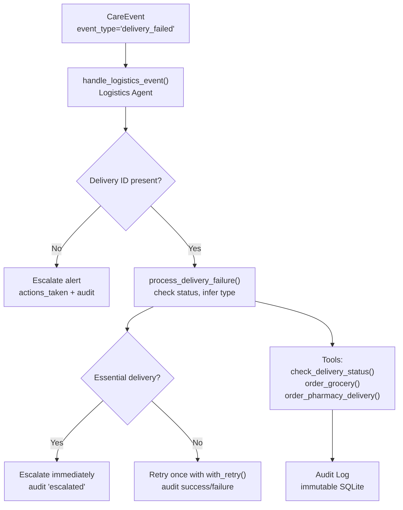
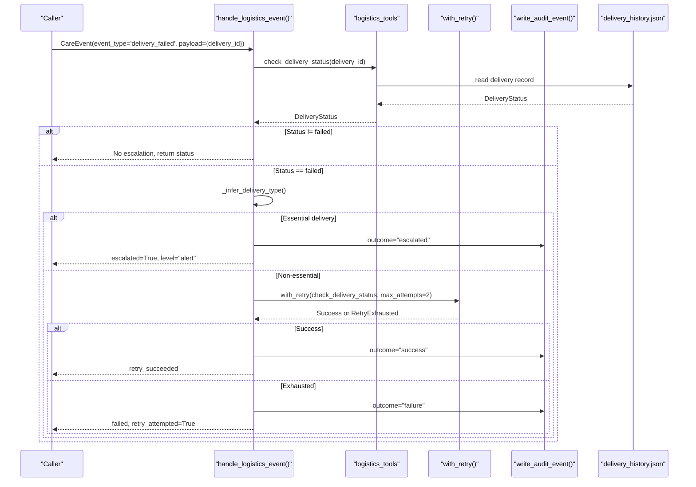
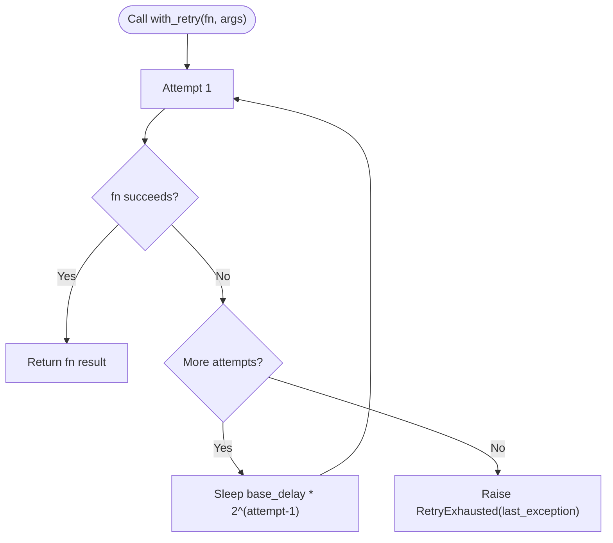
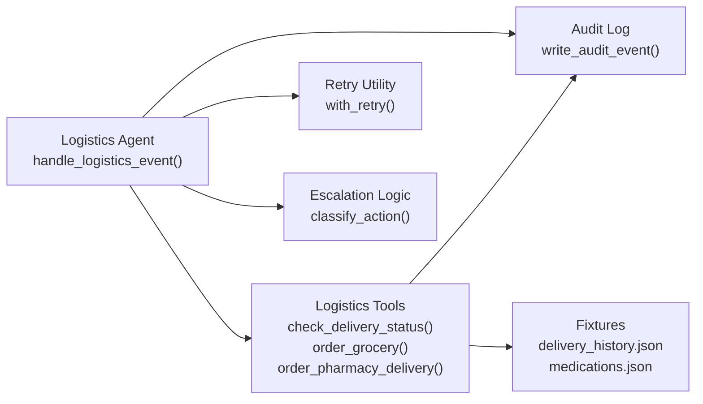

# Logistics Agent

<cite>
**Referenced Files in This Document**
- [logistics_agent.py](file://src/agents/logistics_agent.py)
- [logistics_tools.py](file://src/tools/logistics_tools.py)
- [retry.py](file://src/tools/retry.py)
- [escalation_logic.py](file://src/models/escalation_logic.py)
- [schemas.py](file://src/models/schemas.py)
- [audit_log.py](file://src/models/audit_log.py)
- [delivery_history.json](file://fixtures/delivery_history.json)
- [medications.json](file://fixtures/medications.json)
- [family_members.json](file://fixtures/family_members.json)
- [test_logistics_agent.py](file://tests/test_logistics_agent.py)
- [AGENTS.md](file://AGENTS.md)
</cite>

## Table of Contents
1. Introduction
2. Project Structure
3. Core Components
4. Architecture Overview
5. Detailed Component Analysis
6. Dependency Analysis
7. Performance Considerations
8. Troubleshooting Guide
9. Conclusion
10. Appendices

## Introduction
This document explains the Logistics Agent responsible for delivery coordination and failure management across pharmacy deliveries, grocery orders, and delivery status tracking. It details how failures are handled with escalation rules, retry mechanisms with exponential backoff, integration points with delivery service providers and inventory systems (via fixtures), and how audit trails are maintained. It also documents the primary event handler handle_logistics_event(), including method signatures, usage patterns, and concrete workflows for order placement, status monitoring, and failure recovery.

## Project Structure
The Logistics Agent is implemented as a focused agent that:
- Receives logistics events (e.g., delivery_failed) via handle_logistics_event()
- Uses tools to check delivery status and place orders (grocery/pharmacy)
- Applies deterministic escalation logic for essential deliveries
- Writes immutable audit trail entries for every action
- Leverages a shared retry utility for resilient external calls

**Diagram sources**
- [logistics_agent.py:182-236](file://src/agents/logistics_agent.py#L182-L236)
- [logistics_tools.py:23-53](file://src/tools/logistics_tools.py#L23-L53)
- [logistics_tools.py:56-129](file://src/tools/logistics_tools.py#L56-L129)
- [logistics_tools.py:131-220](file://src/tools/logistics_tools.py#L131-L220)
- [audit_log.py:81-130](file://src/models/audit_log.py#L81-L130)

**Section sources**
- [logistics_agent.py:1-236](file://src/agents/logistics_agent.py#L1-L236)
- [AGENTS.md:108-163](file://AGENTS.md#L108-L163)

## Core Components
- Event routing and handling: handle_logistics_event() routes delivery_failed events to process_delivery_failure() and logs actions.
- Failure processing: process_delivery_failure() checks current delivery status, infers delivery type from fixtures, escalates essential failures, and retries non-essential ones.
- Tools:
  - check_delivery_status(): reads delivery history from fixtures and returns DeliveryStatus.
  - order_grocery(): places grocery orders, writes pre/post audit events, simulates external API call.
  - order_pharmacy_delivery(): places pharmacy deliveries, resolves care_recipient_id from medication fixtures when possible, writes pre/post audit events.
- Retry utility: with_retry() provides exponential backoff (1s, 2s, 4s) with configurable max_attempts; raises RetryExhausted on full failure.
- Escalation logic: classify_action() determines auto/alert/approve categories deterministically; essential delivery failures escalate to alert level.
- Audit trail: write_audit_event() appends immutable records with correlation IDs linking related actions.

**Section sources**
- [logistics_agent.py:23-153](file://src/agents/logistics_agent.py#L23-L153)
- [logistics_tools.py:23-220](file://src/tools/logistics_tools.py#L23-L220)
- [retry.py:14-70](file://src/tools/retry.py#L14-L70)
- [escalation_logic.py:13-71](file://src/models/escalation_logic.py#L13-L71)
- [audit_log.py:81-130](file://src/models/audit_log.py#L81-L130)

## Architecture Overview
The Logistics Agent integrates with:
- Delivery service providers (simulated via fixtures): order placement and status checks
- Inventory systems (simulated via fixtures): medication and delivery history data
- Audit system: immutable logging for compliance and traceability
- Retry layer: resilience against transient failures and timeouts

**Diagram sources**
- [logistics_agent.py:182-236](file://src/agents/logistics_agent.py#L182-L236)
- [logistics_agent.py:23-153](file://src/agents/logistics_agent.py#L23-L153)
- [logistics_tools.py:23-53](file://src/tools/logistics_tools.py#L23-L53)
- [retry.py:22-70](file://src/tools/retry.py#L22-L70)
- [delivery_history.json:1-33](file://fixtures/delivery_history.json#L1-L33)

## Detailed Component Analysis

### Event Handler: handle_logistics_event()
- Purpose: Main entry point for logistics-related care events, specifically delivery failures.
- Behavior:
  - Validates presence of delivery_id in payload; if missing, escalates to alert.
  - Delegates to process_delivery_failure() for delivery_failed events.
  - For other event types, logs and returns without specific handling.
- Return structure:
  - event_id, event_type, actions_taken, escalation_required, escalation_level

Usage pattern example:
- Create a CareEvent with event_type='delivery_failed' and payload containing delivery_id.
- Call handle_logistics_event(event).
- Inspect result for escalation_required and escalation_level to determine next steps.

**Section sources**
- [logistics_agent.py:182-236](file://src/agents/logistics_agent.py#L182-L236)
- [schemas.py:56-62](file://src/models/schemas.py#L56-L62)

### Failure Processing: process_delivery_failure()
- Purpose: Handle failed deliveries with escalation rules based on delivery type.
- Behavior:
  - Checks current delivery status using check_delivery_status().
  - Infers delivery type from fixtures (_infer_delivery_type()).
  - If essential (pharmacy, medication, food, grocery), escalates immediately and writes audit event with outcome="escalated".
  - If non-essential, retries once using with_retry() with max_attempts=2; audits success or exhaustion.
- Return structure:
  - delivery_id, status, escalated, escalation_level, retry_attempted, actions_taken

Key flows:
- Essential delivery failure → immediate escalation.
- Non-essential delivery failure → retry once; if still failed, log warning and mark retry_exhausted.

**Section sources**
- [logistics_agent.py:23-153](file://src/agents/logistics_agent.py#L23-L153)
- [logistics_agent.py:155-180](file://src/agents/logistics_agent.py#L155-L180)
- [delivery_history.json:1-33](file://fixtures/delivery_history.json#L1-L33)

### Tools: Delivery Status and Order Placement
- check_delivery_status(delivery_id: str) -> DeliveryStatus
  - Reads delivery history from fixtures and returns structured status.
  - Raises ValueError if delivery_id not found.
- order_grocery(care_recipient_id: str, items: list[str], delivery_address: str) -> DeliveryOrder
  - Places grocery order, writes pre/post audit events, simulates external API call.
  - Returns DeliveryOrder with order_id, delivery_id, status="placed", expected_at.
  - Raises RuntimeError on simulated API failure.
- order_pharmacy_delivery(medication_id: str, pharmacy_id: str, delivery_address: str) -> DeliveryOrder
  - Places pharmacy delivery, attempts to resolve care_recipient_id from medications fixture.
  - Writes pre/post audit events, simulates external API call.
  - Returns DeliveryOrder with order_id, delivery_id, status="placed", expected_at.
  - Raises RuntimeError on simulated API failure.

Usage patterns:
- Place grocery order: call order_grocery() with recipient ID, item list, and address; inspect returned DeliveryOrder.
- Place pharmacy delivery: call order_pharmacy_delivery() with medication and pharmacy IDs and address; inspect returned DeliveryOrder.
- Monitor delivery: call check_delivery_status() periodically; handle ValueError for unknown IDs.

**Section sources**
- [logistics_tools.py:23-53](file://src/tools/logistics_tools.py#L23-L53)
- [logistics_tools.py:56-129](file://src/tools/logistics_tools.py#L56-L129)
- [logistics_tools.py:131-220](file://src/tools/logistics_tools.py#L131-L220)
- [schemas.py:96-109](file://src/models/schemas.py#L96-L109)

### Retry Mechanism: with_retry()
- Purpose: Provide resilient execution for async or sync functions with exponential backoff.
- Behavior:
  - Attempts up to max_attempts times (default 3).
  - Backoff delays: base_delay * 2^(attempt-1) (e.g., 1s, 2s, 4s).
  - Logs warnings on each failure; raises RetryExhausted with last_exception after all attempts fail.
- Usage in Logistics Agent:
  - Used to retry check_delivery_status() for non-essential failures with max_attempts=2.

**Diagram sources**
- [retry.py:22-70](file://src/tools/retry.py#L22-L70)

**Section sources**
- [retry.py:14-70](file://src/tools/retry.py#L14-L70)
- [logistics_agent.py:106-152](file://src/agents/logistics_agent.py#L106-L152)

### Escalation Logic: classify_action()
- Purpose: Deterministic classification of actions into auto/alert/approve categories.
- Behavior:
  - Checks emergency triggers in context to escalate at minimum to alert.
  - Maps known action types to categories; unknown defaults to approve for safety.
- Integration:
  - Used by tools to classify actions before execution; ensures consistent escalation policy.

**Section sources**
- [escalation_logic.py:13-71](file://src/models/escalation_logic.py#L13-L71)
- [AGENTS.md:130-152](file://AGENTS.md#L130-L152)

### Audit Trail Integration
- Purpose: Immutable, append-only audit log for all agent actions.
- Behavior:
  - write_audit_event() creates an event with actor, action_type, care_recipient_id, rationale, outcome, correlation_id.
  - Pre-action events written with outcome="pending"; follow-up events record final outcome.
  - Triggers prevent UPDATE/DELETE to ensure immutability.
- Usage in Logistics Agent:
  - Every tool and failure handling path writes audit events with appropriate outcomes and correlation IDs.

**Section sources**
- [audit_log.py:19-78](file://src/models/audit_log.py#L19-L78)
- [audit_log.py:81-130](file://src/models/audit_log.py#L81-L130)
- [logistics_tools.py:74-129](file://src/tools/logistics_tools.py#L74-L129)
- [logistics_tools.py:165-220](file://src/tools/logistics_tools.py#L165-L220)
- [logistics_agent.py:41-60](file://src/agents/logistics_agent.py#L41-L60)
- [logistics_agent.py:84-100](file://src/agents/logistics_agent.py#L84-L100)
- [logistics_agent.py:117-152](file://src/agents/logistics_agent.py#L117-L152)

### Communication with Family Notification System
- Scope: The Logistics Agent does not send family alerts directly per agent boundaries.
- Integration:
  - Escalation decisions (alert/emergency) are communicated to the Supervisor Agent, which coordinates messaging via the Communication Agent.
  - Audit trail includes correlation IDs to link logistics actions with subsequent notifications.

**Section sources**
- [AGENTS.md:8-21](file://AGENTS.md#L8-L21)
- [AGENTS.md:130-152](file://AGENTS.md#L130-L152)

## Dependency Analysis
The Logistics Agent depends on:
- Schemas for structured data exchange (CareEvent, DeliveryStatus, DeliveryOrder)
- Tools for delivery operations (status checks, order placement)
- Retry utility for resilient external calls
- Escalation logic for deterministic classification
- Audit log for immutable recording of actions
- Fixtures for simulated external systems (delivery history, medications)

**Diagram sources**
- [logistics_agent.py:182-236](file://src/agents/logistics_agent.py#L182-L236)
- [logistics_tools.py:23-220](file://src/tools/logistics_tools.py#L23-L220)
- [retry.py:22-70](file://src/tools/retry.py#L22-L70)
- [escalation_logic.py:42-71](file://src/models/escalation_logic.py#L42-L71)
- [audit_log.py:81-130](file://src/models/audit_log.py#L81-L130)
- [delivery_history.json:1-33](file://fixtures/delivery_history.json#L1-L33)
- [medications.json:1-33](file://fixtures/medications.json#L1-L33)

**Section sources**
- [schemas.py:56-109](file://src/models/schemas.py#L56-L109)
- [logistics_tools.py:23-220](file://src/tools/logistics_tools.py#L23-L220)
- [retry.py:22-70](file://src/tools/retry.py#L22-L70)
- [escalation_logic.py:42-71](file://src/models/escalation_logic.py#L42-L71)
- [audit_log.py:81-130](file://src/models/audit_log.py#L81-L130)
- [delivery_history.json:1-33](file://fixtures/delivery_history.json#L1-L33)
- [medications.json:1-33](file://fixtures/medications.json#L1-L33)

## Performance Considerations
- Retry strategy uses exponential backoff to reduce load on external APIs during transient failures.
- Fixture-based simulation avoids network latency in tests and development; production should replace with real API calls while preserving retry and audit patterns.
- Minimal synchronous operations in critical paths; asynchronous tools used for I/O-bound tasks.
- Audit logging is append-only and indexed for efficient querying by timestamp, correlation_id, and care_recipient_id.

[No sources needed since this section provides general guidance]

## Troubleshooting Guide
Common issues and resolutions:
- Missing delivery_id in delivery_failed event:
  - Result: escalation_required=True, escalation_level="alert"
  - Action: Validate event payload before calling handle_logistics_event()
- Unknown delivery_id:
  - Result: escalation_required=True, escalation_level="alert"
  - Action: Verify delivery_id exists in delivery_history.json or update fixtures
- External API timeout during order placement:
  - Result: RuntimeError raised; audit event logged with outcome="failure"
  - Action: Use with_retry() wrapper for resilience; monitor audit trail for correlation_id
- Non-essential delivery still failing after retry:
  - Result: retry_attempted=True, status="failed"
  - Action: Review failure_reason; consider manual intervention or alternative provider

**Section sources**
- [logistics_agent.py:205-221](file://src/agents/logistics_agent.py#L205-L221)
- [logistics_agent.py:41-60](file://src/agents/logistics_agent.py#L41-L60)
- [logistics_tools.py:117-129](file://src/tools/logistics_tools.py#L117-L129)
- [logistics_tools.py:208-220](file://src/tools/logistics_tools.py#L208-L220)
- [retry.py:52-70](file://src/tools/retry.py#L52-L70)

## Conclusion
The Logistics Agent provides robust delivery coordination and failure management through deterministic escalation, resilient retries, comprehensive auditing, and clear integration points with simulated external systems. Its design adheres to strict agent boundaries and safety-critical rules, ensuring reliable operation and traceability for essential deliveries like pharmacy and grocery orders.

[No sources needed since this section summarizes without analyzing specific files]

## Appendices

### Method Signatures and Usage Patterns
- handle_logistics_event(event: CareEvent) -> dict
  - Input: CareEvent with event_type and payload
  - Output: Dict with event_id, event_type, actions_taken, escalation_required, escalation_level
  - Example usage: See test cases for delivery_failed scenarios

- process_delivery_failure(delivery_id: str, care_recipient_id: str) -> dict
  - Input: delivery_id and care_recipient_id
  - Output: Dict with delivery_id, status, escalated, escalation_level, retry_attempted, actions_taken

- check_delivery_status(delivery_id: str) -> DeliveryStatus
  - Input: delivery_id
  - Output: DeliveryStatus with status, expected_at, failure_reason
  - Raises: ValueError if not found

- order_grocery(care_recipient_id: str, items: list[str], delivery_address: str) -> DeliveryOrder
  - Input: care_recipient_id, items list, delivery_address
  - Output: DeliveryOrder with order_id, delivery_id, status="placed", expected_at
  - Raises: RuntimeError on API failure

- order_pharmacy_delivery(medication_id: str, pharmacy_id: str, delivery_address: str) -> DeliveryOrder
  - Input: medication_id, pharmacy_id, delivery_address
  - Output: DeliveryOrder with order_id, delivery_id, status="placed", expected_at
  - Raises: RuntimeError on API failure

**Section sources**
- [logistics_agent.py:23-153](file://src/agents/logistics_agent.py#L23-L153)
- [logistics_agent.py:182-236](file://src/agents/logistics_agent.py#L182-L236)
- [logistics_tools.py:23-220](file://src/tools/logistics_tools.py#L23-L220)
- [schemas.py:56-109](file://src/models/schemas.py#L56-L109)
- [test_logistics_agent.py:18-94](file://tests/test_logistics_agent.py#L18-L94)

### Concrete Examples
- Delivery order placement:
  - Place grocery order: order_grocery("cr-001", ["Milk", "Bread"], "123 Care St")
  - Place pharmacy delivery: order_pharmacy_delivery("med-001", "pharm-001", "123 Care St")
- Status monitoring:
  - Check delivery status: check_delivery_status("del-001")
  - Handle failures: handle_logistics_event(CareEvent(event_type="delivery_failed", payload={"delivery_id": "del-003"}))
- Failure recovery:
  - Non-essential delivery retry: process_delivery_failure("del-002", "cr-001")
  - Essential delivery escalation: process_delivery_failure("del-003", "cr-001")

**Section sources**
- [test_logistics_agent.py:43-79](file://tests/test_logistics_agent.py#L43-L79)
- [test_logistics_agent.py:84-94](file://tests/test_logistics_agent.py#L84-L94)
- [test_logistics_agent.py:116-148](file://tests/test_logistics_agent.py#L116-L148)
- [delivery_history.json:1-33](file://fixtures/delivery_history.json#L1-L33)