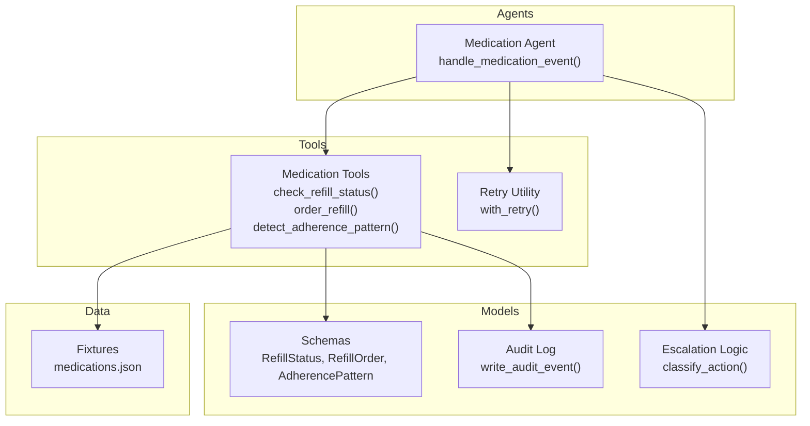
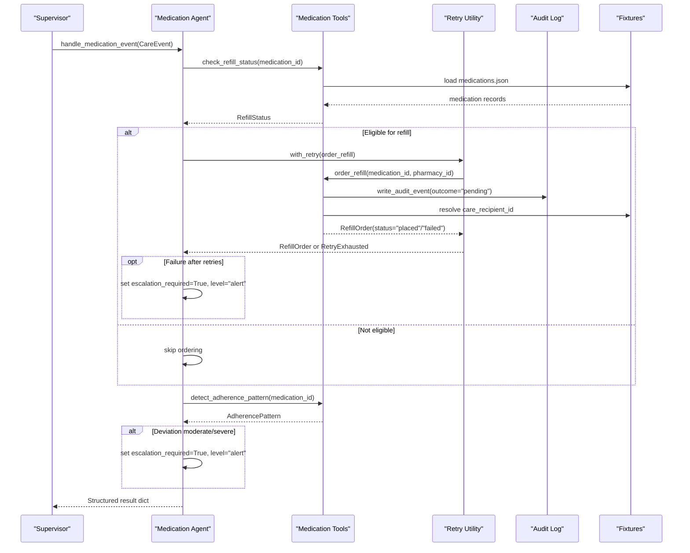
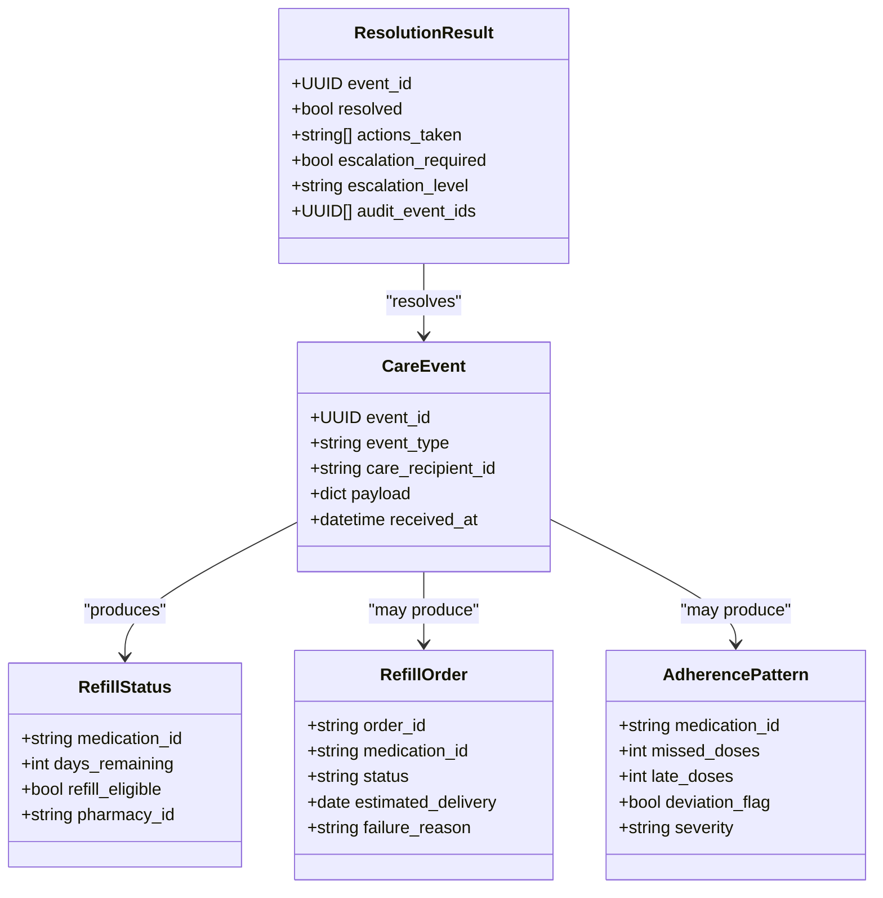
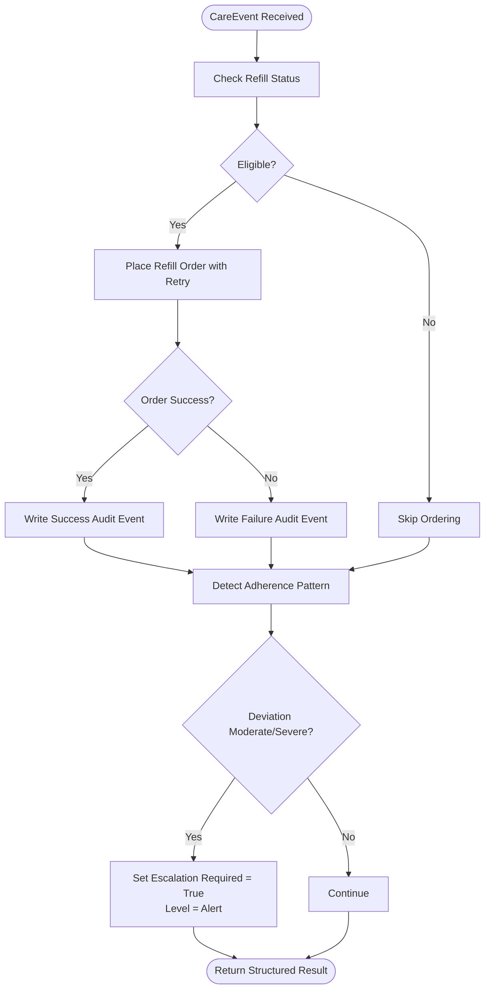
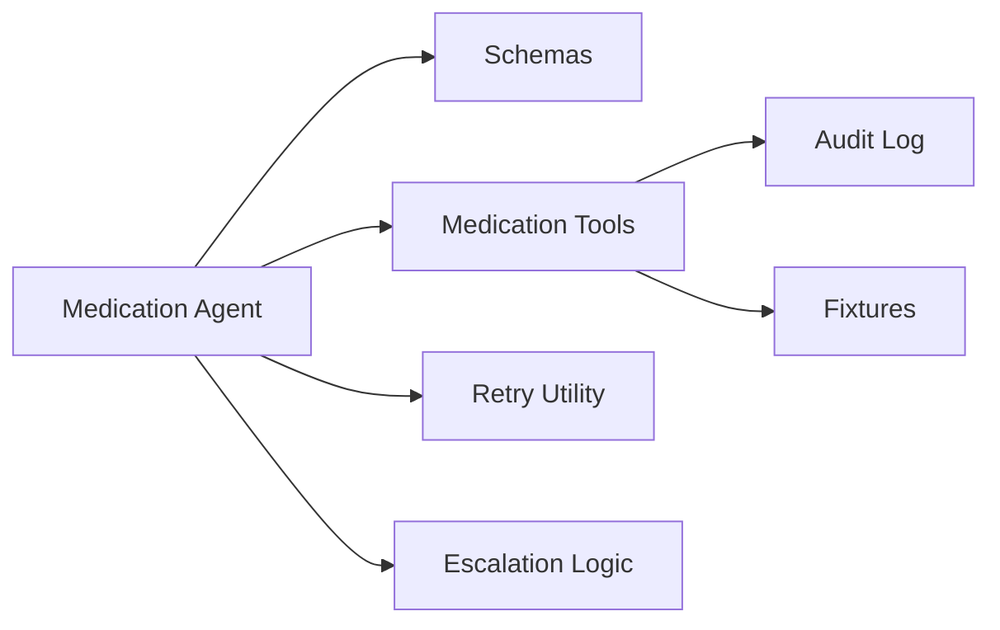

# Medication Agent

<cite>
**Referenced Files in This Document**
- [medication_agent.py](file://src/agents/medication_agent.py)
- [medication_tools.py](file://src/tools/medication_tools.py)
- [schemas.py](file://src/models/schemas.py)
- [audit_log.py](file://src/models/audit_log.py)
- [escalation_logic.py](file://src/models/escalation_logic.py)
- [retry.py](file://src/tools/retry.py)
- [medications.json](file://fixtures/medications.json)
- [test_medication_agent.py](file://tests/test_medication_agent.py)
- [test_refill_flow.py](file://tests/integration/test_refill_flow.py)
</cite>

## Table of Contents
1. [Introduction](#introduction)
2. [Project Structure](#project-structure)
3. [Core Components](#core-components)
4. [Architecture Overview](#architecture-overview)
5. [Detailed Component Analysis](#detailed-component-analysis)
6. [Dependency Analysis](#dependency-analysis)
7. [Performance Considerations](#performance-considerations)
8. [Troubleshooting Guide](#troubleshooting-guide)
9. [Conclusion](#conclusion)
10. [Appendices](#appendices)

## Introduction
This document explains the Medication Agent, which automates medication management and adherence monitoring within CareBridge. It covers refill monitoring, prescription ordering with retries, adherence pattern detection, escalation logic for critical events, and integration with pharmacy tools (simulated via fixtures). It also documents how the agent interacts with the audit trail system to record every action with an immutable log.

## Project Structure
The Medication Agent lives under agents and coordinates with tools that encapsulate pharmacy integrations and data models. Fixtures provide mock pharmacy data used by tools. Tests validate behavior at unit and integration levels.

**Diagram sources**
- [medication_agent.py:23-134](file://src/agents/medication_agent.py#L23-L134)
- [medication_tools.py:34-208](file://src/tools/medication_tools.py#L34-L208)
- [schemas.py:73-94](file://src/models/schemas.py#L73-L94)
- [audit_log.py:81-130](file://src/models/audit_log.py#L81-L130)
- [escalation_logic.py:42-71](file://src/models/escalation_logic.py#L42-L71)
- [retry.py:22-70](file://src/tools/retry.py#L22-L70)
- [medications.json:1-33](file://fixtures/medications.json#L1-L33)

**Section sources**
- [medication_agent.py:1-189](file://src/agents/medication_agent.py#L1-L189)
- [medication_tools.py:1-208](file://src/tools/medication_tools.py#L1-L208)
- [schemas.py:1-150](file://src/models/schemas.py#L1-L150)
- [audit_log.py:1-167](file://src/models/audit_log.py#L1-L167)
- [escalation_logic.py:1-71](file://src/models/escalation_logic.py#L1-L71)
- [retry.py:1-70](file://src/tools/retry.py#L1-L70)
- [medications.json:1-33](file://fixtures/medications.json#L1-L33)

## Core Components
- Medication Agent: Orchestrates event handling, refill eligibility checks, order placement with retry, and adherence analysis. Returns structured results including actions taken and escalation flags.
- Medication Tools: Implements refill status checks, refill ordering with audit logging, and adherence pattern detection using fixture data.
- Retry Utility: Provides exponential backoff retry for external calls; raises a specific exception when exhausted.
- Audit Trail: Immutable SQLite-backed log recording before/after outcomes for each action with correlation IDs.
- Escalation Logic: Deterministic classification of actions into auto/alert/approve categories and emergency triggers.

Key responsibilities:
- Refill monitoring: Check days remaining against thresholds and determine eligibility.
- Prescription ordering: Place orders through tools with robust retry and audit-first logging.
- Adherence monitoring: Detect missed or late doses and flag deviations with severity.
- Escalation: Trigger alerts for failed orders after retries and moderate/severe adherence deviations.

**Section sources**
- [medication_agent.py:23-134](file://src/agents/medication_agent.py#L23-L134)
- [medication_tools.py:34-208](file://src/tools/medication_tools.py#L34-L208)
- [retry.py:22-70](file://src/tools/retry.py#L22-L70)
- [audit_log.py:81-130](file://src/models/audit_log.py#L81-L130)
- [escalation_logic.py:42-71](file://src/models/escalation_logic.py#L42-L71)

## Architecture Overview
The Medication Agent processes CareEvent inputs from the Supervisor. It performs three main steps: check refill status, optionally place a refill order with retries, and analyze adherence patterns. Each step is logged to the audit trail where applicable. Results include structured data about refill status, order outcome, and adherence findings, along with escalation decisions.

**Diagram sources**
- [medication_agent.py:23-134](file://src/agents/medication_agent.py#L23-L134)
- [medication_tools.py:34-208](file://src/tools/medication_tools.py#L34-L208)
- [retry.py:22-70](file://src/tools/retry.py#L22-L70)
- [audit_log.py:81-130](file://src/models/audit_log.py#L81-L130)
- [medications.json:1-33](file://fixtures/medications.json#L1-L33)

## Detailed Component Analysis

### Medication Agent: handle_medication_event()
Responsibilities:
- Validate input payload and extract medication_id.
- Check refill status and log actions.
- If eligible, process refill with retry; capture order outcome and escalate on exhaustion.
- Detect adherence patterns and escalate for moderate/severe deviations.
- Return a structured result dict with all relevant fields.

Method signature, parameters, and return values:
- Function: handle_medication_event(event: CareEvent) -> dict
- Parameters:
  - event: CareEvent containing payload with medication_id
- Returns:
  - medication_id: str | None
  - actions_taken: list[str]
  - escalation_required: bool
  - escalation_level: "info" | "alert" | "emergency" | None
  - refill_status: RefillStatus model dump (if applicable)
  - refill_order: RefillOrder model dump (if applicable)
  - adherence: AdherencePattern model dump (if applicable)

Error handling:
- Missing medication_id returns early error in actions_taken without escalation.
- ValueError from refill status check returns error in actions_taken without escalation.
- RetryExhausted during refill ordering sets escalation_required=True and escalation_level="alert".
- Adherence check failures are caught and recorded in actions_taken.

Examples from tests:
- Refill low triggers order for med-001 due to days_remaining <= threshold.
- No refill ordered for med-002 with sufficient days remaining.
- Invalid medication_id returns error actions and no escalation.
- Retry exhaustion triggers alert-level escalation.

**Section sources**
- [medication_agent.py:23-134](file://src/agents/medication_agent.py#L23-L134)
- [test_medication_agent.py:120-177](file://tests/test_medication_agent.py#L120-L177)

#### Class and Data Model Relationships

**Diagram sources**
- [schemas.py:56-94](file://src/models/schemas.py#L56-L94)
- [schemas.py:64-71](file://src/models/schemas.py#L64-L71)

### Medication Tools: Pharmacy Integration
Functions:
- check_refill_status(medication_id: str) -> RefillStatus
  - Loads medications from fixtures and computes eligibility based on days_remaining vs refill_threshold.
  - Raises ValueError if medication not found.
- order_refill(medication_id: str, pharmacy_id: str) -> RefillOrder
  - Writes a pending audit event before attempting pharmacy API call.
  - Resolves care_recipient_id from fixtures for accurate audit logging.
  - Simulates pharmacy API call; writes success or failure follow-up audit events.
  - Returns RefillOrder with status "placed" or "failed" and optional failure reason.
- detect_adherence_pattern(medication_id: str, window_days: int = 7) -> AdherencePattern
  - Analyzes adherence over a time window using fixture-based simulation.
  - For med-001, simulates moderate deviation with missed and late doses; others show good adherence.
  - Raises ValueError if medication not found.

Integration points:
- Uses schemas for structured data exchange.
- Uses audit_log.write_audit_event for immutable logging.
- Uses fixtures/medications.json for mock pharmacy data.

**Section sources**
- [medication_tools.py:34-208](file://src/tools/medication_tools.py#L34-L208)
- [schemas.py:73-94](file://src/models/schemas.py#L73-L94)
- [audit_log.py:81-130](file://src/models/audit_log.py#L81-L130)
- [medications.json:1-33](file://fixtures/medications.json#L1-L33)

### Retry Utility: Robust External Calls
- with_retry(fn, *args, max_attempts=3, base_delay=1.0, **kwargs) -> Any
  - Retries async or sync functions with exponential backoff (1s, 2s, 4s).
  - Logs warnings per attempt and errors on final failure.
  - Raises RetryExhausted with last_exception when all attempts fail.

Usage in Medication Agent:
- Wraps order_refill to ensure resilience against transient pharmacy API failures.
- On RetryExhausted, the agent escalates to alert level.

**Section sources**
- [retry.py:22-70](file://src/tools/retry.py#L22-L70)
- [medication_agent.py:137-159](file://src/agents/medication_agent.py#L137-L159)

### Audit Trail: Immutable Logging
- write_audit_event(actor, action_type, care_recipient_id, rationale, outcome, correlation_id, authorization_ref=None, db_path="audit.db") -> str
  - Creates an immutable audit event with timestamp and unique event_id.
  - Enforces immutability via SQLite triggers preventing updates/deletes.
  - Used to record "pending" before action and "success"/"failure" after action.

Interaction with Medication Tools:
- order_refill writes pending audit event before API call and follow-up event with outcome.
- Correlation IDs link related events across the workflow.

**Section sources**
- [audit_log.py:19-130](file://src/models/audit_log.py#L19-L130)
- [medication_tools.py:81-152](file://src/tools/medication_tools.py#L81-L152)

### Escalation Logic: Deterministic Classification
- classify_action(action_type: str, context: dict | None = None) -> Literal["auto", "alert", "approve"]
  - Uses hardcoded sets for autonomous, alert-requiring, approval-requiring actions.
  - Emergency triggers escalate at minimum to alert level.
  - Unknown actions default to "approve" for safety.

Relevance to Medication Agent:
- While the agent sets escalation flags directly based on outcomes (e.g., retry exhaustion, adherence severity), classify_action provides deterministic categorization for other parts of the system.

**Section sources**
- [escalation_logic.py:42-71](file://src/models/escalation_logic.py#L42-L71)

### Refill Workflow Automation: End-to-End Flow

**Diagram sources**
- [medication_agent.py:57-134](file://src/agents/medication_agent.py#L57-L134)
- [medication_tools.py:65-152](file://src/tools/medication_tools.py#L65-L152)
- [retry.py:22-70](file://src/tools/retry.py#L22-L70)

### Adherence Tracking Algorithms
- detect_adherence_pattern(medication_id: str, window_days: int = 7) -> AdherencePattern
  - Simulates adherence analysis using fixture data.
  - For med-001, returns deviation_flag=True with severity="moderate" and counts for missed/late doses.
  - For other medications, returns deviation_flag=False with severity="none".

Adherence escalation:
- The agent escalates to alert level when deviation_flag is True and severity is "moderate" or "severe".

**Section sources**
- [medication_tools.py:155-208](file://src/tools/medication_tools.py#L155-L208)
- [medication_agent.py:101-125](file://src/agents/medication_agent.py#L101-L125)

### Error Handling Strategies
- Input validation: Missing medication_id returns early error in actions_taken without escalation.
- Tool exceptions: ValueError from refill/adherence checks are caught and recorded in actions_taken.
- Retry exhaustion: RetryExhausted triggers escalation_required=True and escalation_level="alert".
- Pharmacy API failures: order_refill catches exceptions, writes failure audit event, and returns RefillOrder with status "failed".

**Section sources**
- [medication_agent.py:43-71](file://src/agents/medication_agent.py#L43-L71)
- [medication_agent.py:90-99](file://src/agents/medication_agent.py#L90-L99)
- [medication_tools.py:134-152](file://src/tools/medication_tools.py#L134-L152)
- [retry.py:66-69](file://src/tools/retry.py#L66-L69)

## Dependency Analysis
The Medication Agent depends on:
- Schemas for structured data exchange between components.
- Medication Tools for pharmacy integration and adherence analysis.
- Retry Utility for resilient external calls.
- Audit Log for immutable action tracking.
- Escalation Logic for deterministic action classification.

**Diagram sources**
- [medication_agent.py:9-16](file://src/agents/medication_agent.py#L9-L16)
- [medication_tools.py:14-17](file://src/tools/medication_tools.py#L14-L17)
- [schemas.py:73-94](file://src/models/schemas.py#L73-L94)
- [audit_log.py:81-130](file://src/models/audit_log.py#L81-L130)
- [escalation_logic.py:42-71](file://src/models/escalation_logic.py#L42-L71)
- [medications.json:1-33](file://fixtures/medications.json#L1-L33)

**Section sources**
- [medication_agent.py:9-16](file://src/agents/medication_agent.py#L9-L16)
- [medication_tools.py:14-17](file://src/tools/medication_tools.py#L14-L17)

## Performance Considerations
- Retry strategy uses exponential backoff to reduce load on external APIs and improve resilience.
- Fixture-based tools avoid network latency in development/testing; real MCP integration planned for later phases.
- Audit logging is append-only and indexed for efficient querying by timestamp, correlation ID, and care recipient.
- Minimal computation in adherence detection; can be extended with more sophisticated algorithms if needed.

[No sources needed since this section provides general guidance]

## Troubleshooting Guide
Common issues and resolutions:
- Missing medication_id in event payload: Ensure payload contains medication_id; handler returns error in actions_taken.
- Medication not found: Verify medication exists in fixtures; tools raise ValueError which is caught and logged.
- Refill order failures: Check audit trail for pending/failure events; retry utility logs attempt details; escalation triggered on exhaustion.
- Adherence check failures: Inspect logs for ValueError; ensure medication_id is valid.

Audit trail queries:
- Use get_audit_events with care_recipient_id or correlation_id to trace actions and outcomes.

**Section sources**
- [medication_agent.py:43-71](file://src/agents/medication_agent.py#L43-L71)
- [medication_tools.py:49-62](file://src/tools/medication_tools.py#L49-L62)
- [medication_tools.py:134-152](file://src/tools/medication_tools.py#L134-L152)
- [audit_log.py:133-167](file://src/models/audit_log.py#L133-L167)

## Conclusion
The Medication Agent provides automated medication management with robust refill monitoring, adherence detection, and escalation logic. It integrates with pharmacy tools via simulated fixtures and maintains an immutable audit trail for all actions. The design emphasizes reliability through retries, clear error handling, and deterministic escalation rules.

[No sources needed since this section summarizes without analyzing specific files]

## Appendices

### Method Signatures Summary
- handle_medication_event(event: CareEvent) -> dict
  - Validates input, checks refill status, orders refills with retry, detects adherence, returns structured result with actions and escalation flags.
- check_refill_status(medication_id: str) -> RefillStatus
  - Computes eligibility based on days_remaining and refill_threshold.
- order_refill(medication_id: str, pharmacy_id: str) -> RefillOrder
  - Places refill order with audit logging and returns outcome.
- detect_adherence_pattern(medication_id: str, window_days: int = 7) -> AdherencePattern
  - Analyzes adherence and returns deviation analysis.
- with_retry(fn, *args, max_attempts=3, base_delay=1.0, **kwargs) -> Any
  - Retries function with exponential backoff; raises RetryExhausted on failure.
- write_audit_event(actor, action_type, care_recipient_id, rationale, outcome, correlation_id, authorization_ref=None, db_path="audit.db") -> str
  - Writes immutable audit event to SQLite database.

**Section sources**
- [medication_agent.py:23-134](file://src/agents/medication_agent.py#L23-L134)
- [medication_tools.py:34-208](file://src/tools/medication_tools.py#L34-L208)
- [retry.py:22-70](file://src/tools/retry.py#L22-L70)
- [audit_log.py:81-130](file://src/models/audit_log.py#L81-L130)

### Example Scenarios from Tests
- Refill low triggers order for med-001 due to low days remaining.
- No refill ordered for med-002 with sufficient days remaining.
- Invalid medication_id returns error actions without escalation.
- Retry exhaustion triggers alert-level escalation.
- Integration test verifies full flow with audit trail completeness.

**Section sources**
- [test_medication_agent.py:22-99](file://tests/test_medication_agent.py#L22-L99)
- [test_medication_agent.py:120-177](file://tests/test_medication_agent.py#L120-L177)
- [test_refill_flow.py:14-82](file://tests/integration/test_refill_flow.py#L14-L82)