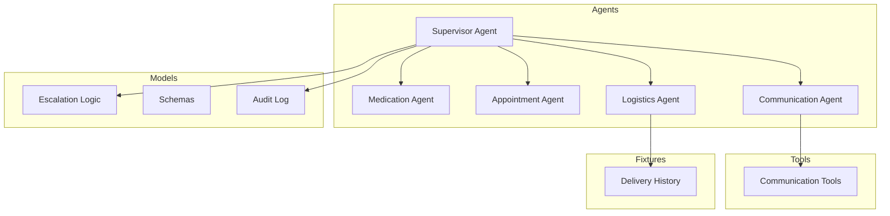
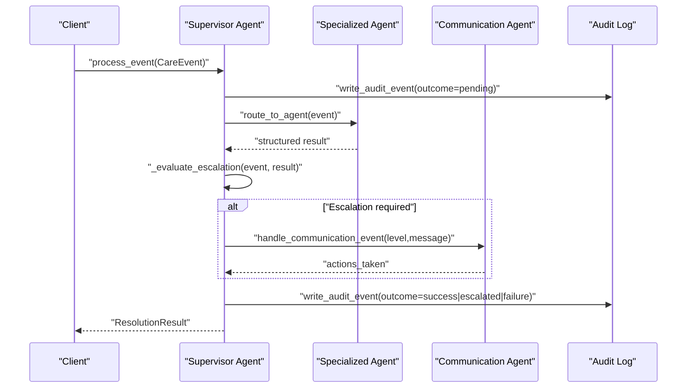
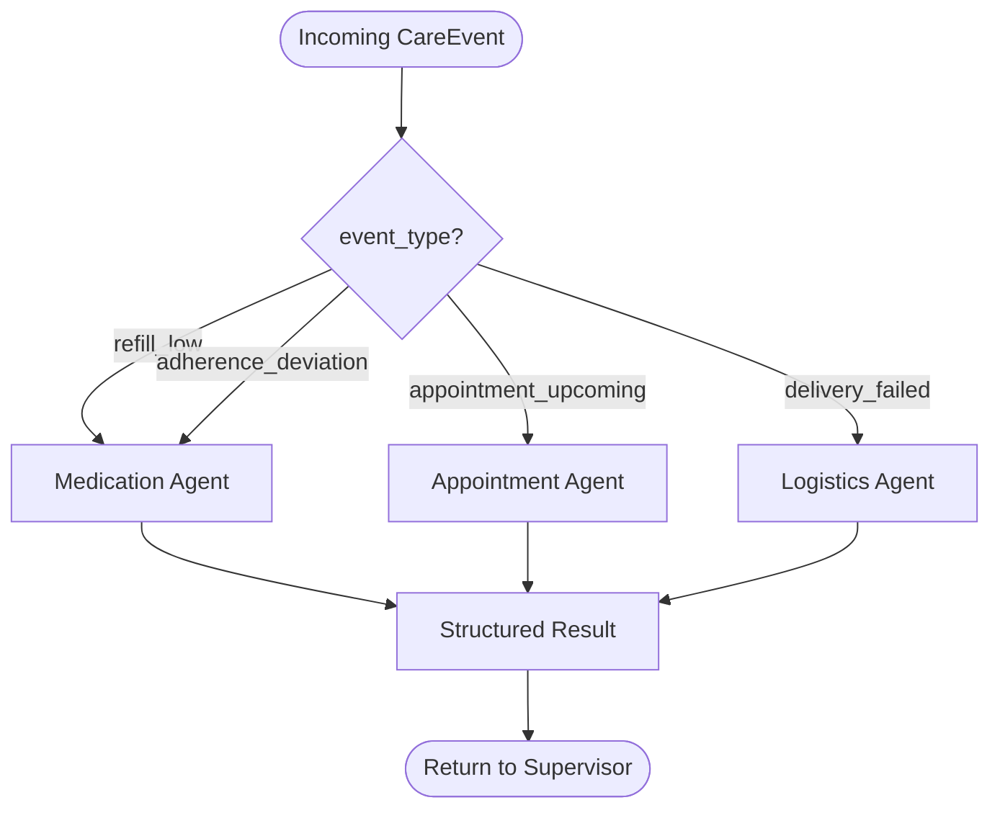
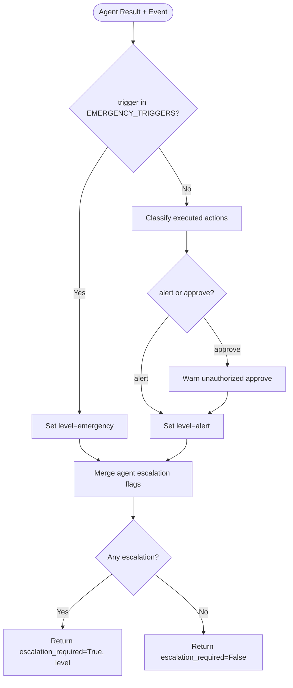
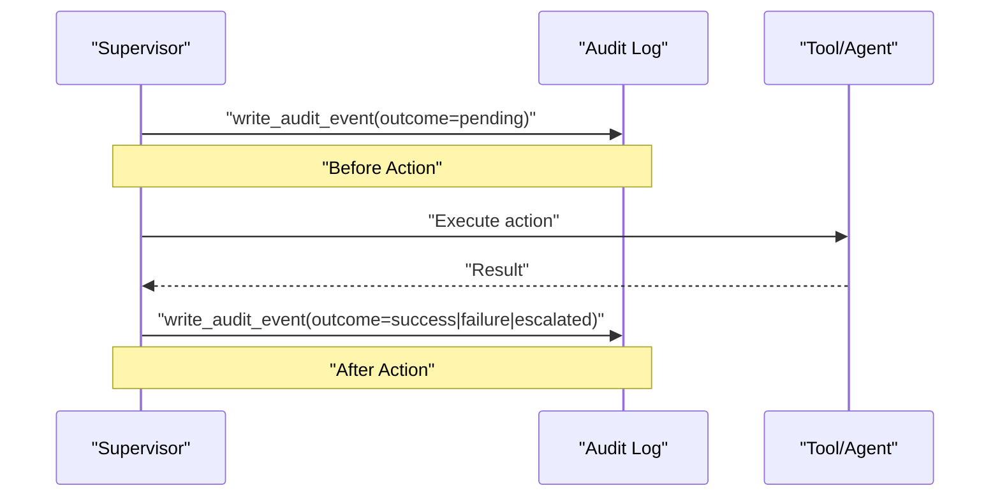
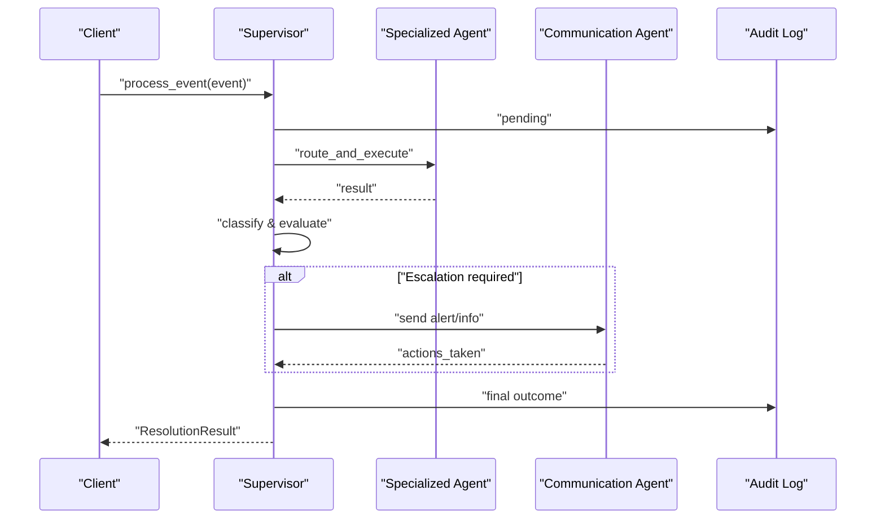
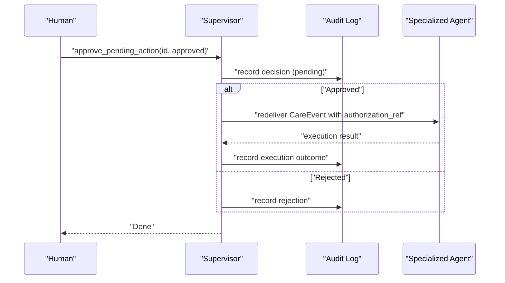
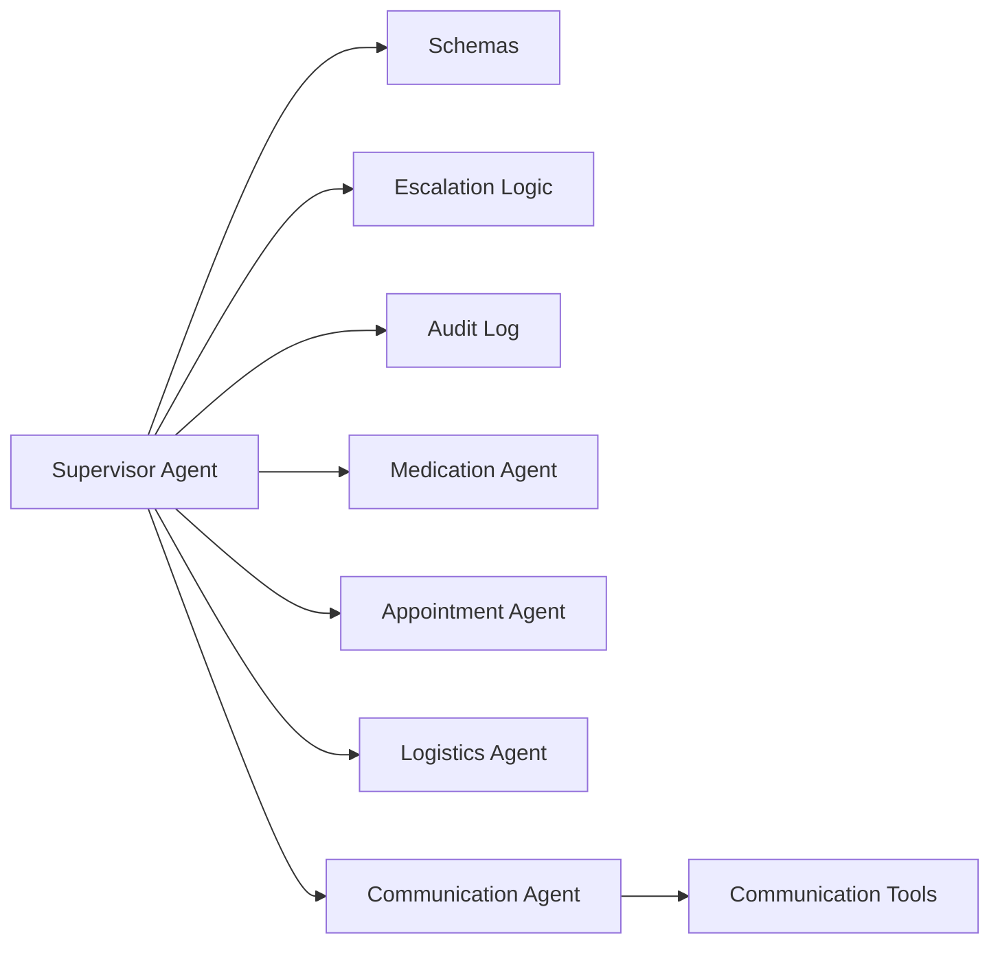

# Supervisor Agent

<cite>
**Referenced Files in This Document**
- [supervisor_agent.py](file://src/agents/supervisor_agent.py)
- [escalation_logic.py](file://src/models/escalation_logic.py)
- [schemas.py](file://src/models/schemas.py)
- [audit_log.py](file://src/models/audit_log.py)
- [medication_agent.py](file://src/agents/medication_agent.py)
- [appointment_agent.py](file://src/agents/appointment_agent.py)
- [logistics_agent.py](file://src/agents/logistics_agent.py)
- [communication_agent.py](file://src/agents/communication_agent.py)
- [communication_tools.py](file://src/tools/communication_tools.py)
- [delivery_history.json](file://fixtures/delivery_history.json)
- [test_supervisor.py](file://tests/test_supervisor.py)
- [AGENTS.md](file://AGENTS.md)
</cite>

## Table of Contents
1. [Introduction](#introduction)
2. [Project Structure](#project-structure)
3. [Core Components](#core-components)
4. [Architecture Overview](#architecture-overview)
5. [Detailed Component Analysis](#detailed-component-analysis)
6. [Dependency Analysis](#dependency-analysis)
7. [Performance Considerations](#performance-considerations)
8. [Troubleshooting Guide](#troubleshooting-guide)
9. [Conclusion](#conclusion)

## Introduction
The CareBridge Supervisor Agent is the central orchestrator for care coordination events. It receives incoming care events, routes them to specialized agents (Medication, Appointment, Logistics, Communication), makes deterministic escalation decisions using a strict classification function, and enforces an audit-first pattern where every action is logged before execution. The Supervisor never calls external APIs directly; all operations go through specialized agents and tools. It also provides a Strands Agents SDK integration that gracefully degrades when the SDK or Bedrock credentials are unavailable, falling back to deterministic direct routing.

Key responsibilities:
- Event routing by event type to specialized agents
- Deterministic escalation decision-making via classify_action() and emergency triggers
- Audit-first logging with immutable SQLite-backed audit trail
- Public API methods: process_event(), query_status(), approve_pending_action()
- Graceful degradation when Strands SDK is not available

## Project Structure
The Supervisor lives under src/agents and coordinates with other agents under the same package. Shared models live under src/models, tools under src/tools, and fixtures under fixtures/. Tests validate behavior under tests/.

**Diagram sources**
- [supervisor_agent.py:1-641](file://src/agents/supervisor_agent.py#L1-L641)
- [escalation_logic.py:1-71](file://src/models/escalation_logic.py#L1-L71)
- [audit_log.py:1-167](file://src/models/audit_log.py#L1-L167)
- [communication_agent.py:1-163](file://src/agents/communication_agent.py#L1-L163)
- [communication_tools.py:1-279](file://src/tools/communication_tools.py#L1-L279)
- [delivery_history.json:1-33](file://fixtures/delivery_history.json#L1-L33)

**Section sources**
- [supervisor_agent.py:1-641](file://src/agents/supervisor_agent.py#L1-L641)
- [AGENTS.md:1-207](file://AGENTS.md#L1-L207)

## Core Components
- Supervisor Agent: Orchestrates events, routes to specialists, escalates deterministically, logs everything first.
- Escalation Logic: Pure functions and sets defining autonomous, alert, and approval categories plus emergency triggers.
- Schemas: Pydantic models for CareEvent, ResolutionResult, PendingAction, StatusSummary, etc.
- Audit Log: Immutable SQLite database with triggers preventing updates/deletes; write_audit_event and get_audit_events.
- Specialized Agents: Medication, Appointment, Logistics, Communication — each owns specific tools and returns structured results.
- Communication Tools: Messaging simulation with family preferences and status synthesis.

Public API surface:
- process_event(event): Route, escalate, notify, audit, return ResolutionResult.
- query_status(care_recipient_id, question): Synthesize status via Communication tools and log the query.
- approve_pending_action(action_id, approved): Human approval workflow with audit-first execution.

**Section sources**
- [supervisor_agent.py:285-430](file://src/agents/supervisor_agent.py#L285-L430)
- [escalation_logic.py:13-71](file://src/models/escalation_logic.py#L13-L71)
- [schemas.py:44-150](file://src/models/schemas.py#L44-L150)
- [audit_log.py:19-167](file://src/models/audit_log.py#L19-L167)
- [communication_tools.py:160-231](file://src/tools/communication_tools.py#L160-L231)

## Architecture Overview
The Supervisor is the single entry point for care events. It writes a pending audit event, routes to the appropriate agent, evaluates escalation deterministically, optionally notifies family via Communication, and writes a final outcome audit event. All external interactions are performed by specialized agents and tools; the Supervisor never calls external APIs directly.

**Diagram sources**
- [supervisor_agent.py:285-395](file://src/agents/supervisor_agent.py#L285-L395)
- [audit_log.py:81-131](file://src/models/audit_log.py#L81-L131)
- [communication_agent.py:28-115](file://src/agents/communication_agent.py#L28-L115)

## Detailed Component Analysis

### Event Routing Logic
The Supervisor maps event types to specialized agents:
- refill_low and adherence_deviation → Medication Agent
- appointment_upcoming → Appointment Agent
- delivery_failed → Logistics Agent

Routing is enforced by _route_to_agent, which raises ValueError if an unknown event_type is encountered. The CareEvent schema constrains event_type to these four values, ensuring deterministic dispatch.

**Diagram sources**
- [supervisor_agent.py:259-279](file://src/agents/supervisor_agent.py#L259-L279)
- [schemas.py:56-62](file://src/models/schemas.py#L56-L62)

**Section sources**
- [supervisor_agent.py:259-279](file://src/agents/supervisor_agent.py#L259-L279)
- [schemas.py:56-62](file://src/models/schemas.py#L56-L62)

### Deterministic Escalation Decision-Making
Escalation is computed by combining three deterministic sources:
1. Hard-coded emergency triggers from EMERGENCY_TRIGGERS (e.g., fall_detection, emergency_room_visit, critical_medication_interaction).
2. Classification of executed actions via classify_action():
   - AUTONOMOUS_ACTIONS → auto
   - REQUIRES_ALERT → alert
   - REQUIRES_APPROVAL → approve
   - Unknown defaults to approve for safety
3. Structured escalation flags returned by the specialized agent (escalation_required, escalation_level).

The Supervisor aggregates severity using _raise_level based on a ranking: info < alert < emergency.

**Diagram sources**
- [supervisor_agent.py:178-234](file://src/agents/supervisor_agent.py#L178-L234)
- [escalation_logic.py:13-71](file://src/models/escalation_logic.py#L13-L71)

**Section sources**
- [supervisor_agent.py:178-234](file://src/agents/supervisor_agent.py#L178-L234)
- [escalation_logic.py:13-71](file://src/models/escalation_logic.py#L13-L71)

### Audit-First Pattern Implementation
Every action begins with a “before action” audit event with outcome="pending", written BEFORE execution. After execution, a follow-up event records the final outcome ("success", "failure", "escalated"). The audit database uses SQLite with triggers preventing UPDATE and DELETE, ensuring immutability.

Key behaviors:
- process_event writes a pending event at start and a final outcome event after processing.
- Communication tools write pending and success/failure events around send_alert.
- Approve flow writes human decision events before executing approved actions.

**Diagram sources**
- [audit_log.py:19-131](file://src/models/audit_log.py#L19-L131)
- [supervisor_agent.py:299-395](file://src/agents/supervisor_agent.py#L299-L395)
- [communication_tools.py:77-157](file://src/tools/communication_tools.py#L77-L157)

**Section sources**
- [audit_log.py:19-131](file://src/models/audit_log.py#L19-L131)
- [supervisor_agent.py:299-395](file://src/agents/supervisor_agent.py#L299-L395)
- [communication_tools.py:77-157](file://src/tools/communication_tools.py#L77-L157)

### Public API Methods

#### process_event(event)
- Writes a pending audit event
- Routes to the appropriate specialized agent
- Evaluates escalation deterministically
- If escalation is required, constructs a CareEvent for the Communication Agent with level and message
- Writes a final outcome audit event
- Returns ResolutionResult with actions_taken, escalation flags, and audit_event_ids

**Diagram sources**
- [supervisor_agent.py:285-395](file://src/agents/supervisor_agent.py#L285-L395)
- [audit_log.py:81-131](file://src/models/audit_log.py#L81-L131)

**Section sources**
- [supervisor_agent.py:285-395](file://src/agents/supervisor_agent.py#L285-L395)

#### query_status(care_recipient_id, question)
- Ensures audit DB initialized
- Calls synthesize_status from Communication tools to build a summary from recent audit events and pending actions
- Writes an audit event recording the query
- Returns synthesized status text

**Section sources**
- [supervisor_agent.py:398-430](file://src/agents/supervisor_agent.py#L398-L430)
- [communication_tools.py:160-231](file://src/tools/communication_tools.py#L160-L231)

#### approve_pending_action(action_id, approved)
- Validates action exists and is pending
- Records human decision in audit trail (reject or approve)
- For approvals:
  - Determines owning agent via _APPROVAL_AGENT_ROUTES
  - Reconstructs a CareEvent with authorization_ref and approved_action
  - Routes to the correct agent handler
  - Logs execution outcome
- Rejects are logged and never executed

**Diagram sources**
- [supervisor_agent.py:432-593](file://src/agents/supervisor_agent.py#L432-L593)
- [audit_log.py:81-131](file://src/models/audit_log.py#L81-L131)

**Section sources**
- [supervisor_agent.py:432-593](file://src/agents/supervisor_agent.py#L432-L593)

### Strands Agents SDK Integration with Graceful Degradation
- create_supervisor_agent() attempts to import strands and BedrockModel, then builds an Agent with the four specialized handlers as tools.
- If import fails or any exception occurs, it logs a warning and returns None, allowing callers to fall back to deterministic direct routing via process_event().
- The system prompt enforces boundaries: route to specialists, always audit, use classify_action, no external API calls.

**Section sources**
- [supervisor_agent.py:599-641](file://src/agents/supervisor_agent.py#L599-L641)

### Concrete Examples and Scenarios

#### Example: Refill Low Event Flow
- Event type: refill_low
- Routed to Medication Agent
- Medication checks refill status, may order refill with retry logic, detects adherence patterns
- If escalation required (e.g., moderate/severe adherence deviation or retry exhausted), Supervisor sends alert via Communication Agent
- Audit trail includes pending and final outcome events

**Section sources**
- [medication_agent.py:23-134](file://src/agents/medication_agent.py#L23-L134)
- [supervisor_agent.py:259-279](file://src/agents/supervisor_agent.py#L259-L279)
- [test_supervisor.py:67-78](file://tests/test_supervisor.py#L67-L78)

#### Example: Delivery Failed Event Flow
- Event type: delivery_failed
- Routed to Logistics Agent
- Logistics infers delivery type from fixtures; essential deliveries (pharmacy, medication, food, grocery) escalate immediately
- Non-essential deliveries retry once; if still failed, log and do not escalate
- Supervisor may escalate to Communication Agent depending on logistics result

**Section sources**
- [logistics_agent.py:182-236](file://src/agents/logistics_agent.py#L182-L236)
- [delivery_history.json:1-33](file://fixtures/delivery_history.json#L1-L33)
- [test_supervisor.py:91-115](file://tests/test_supervisor.py#L91-L115)

#### Example: Appointment Upcoming Event Flow
- Event type: appointment_upcoming
- Routed to Appointment Agent
- Retrieves calendar, sends prep checklists within 48 hours, flags transportation needs within 7 days
- No escalation unless downstream issues arise

**Section sources**
- [appointment_agent.py:74-173](file://src/agents/appointment_agent.py#L74-L173)
- [test_supervisor.py:79-90](file://tests/test_supervisor.py#L79-L90)

#### Example: Adherence Deviation Event Flow
- Event type: adherence_deviation
- Routed to Medication Agent
- Medication checks adherence patterns; if deviation_flag and severity in moderate/severe, escalation_required set
- Supervisor may send alert via Communication Agent

**Section sources**
- [medication_agent.py:101-134](file://src/agents/medication_agent.py#L101-L134)
- [supervisor_agent.py:259-279](file://src/agents/supervisor_agent.py#L259-L279)

### Error Handling Patterns
- Routing failures: Supervisor catches exceptions during routing, writes failure audit event, returns ResolutionResult with resolved=False and error description.
- Communication failures: Family alert dispatch errors are caught, logged, and included in actions_taken; never silently fail.
- Retry exhaustion: Tools like send_alert and order_refill use with_retry; RetryExhausted triggers escalation and audit logging.
- Approval validation: approve_pending_action raises ValueError for already resolved, nonexistent, or non-pending actions.

**Section sources**
- [supervisor_agent.py:319-340](file://src/agents/supervisor_agent.py#L319-L340)
- [supervisor_agent.py:347-366](file://src/agents/supervisor_agent.py#L347-L366)
- [communication_agent.py:55-115](file://src/agents/communication_agent.py#L55-L115)
- [communication_tools.py:142-157](file://src/tools/communication_tools.py#L142-L157)
- [supervisor_agent.py:450-462](file://src/agents/supervisor_agent.py#L450-L462)

### Strict Boundaries and Specialized Agent Requirement
- The Supervisor NEVER calls external APIs directly; all operations go through specialized agents and tools.
- Each agent has a strict scope defined in AGENTS.md; cross-agent calls are forbidden.
- All actions must be routed through the Supervisor and logged to the audit trail before execution.
- Unknown actions default to require approval for safety.

**Section sources**
- [AGENTS.md:8-21](file://AGENTS.md#L8-L21)
- [AGENTS.md:25-49](file://AGENTS.md#L25-L49)
- [supervisor_agent.py:1-15](file://src/agents/supervisor_agent.py#L1-L15)

## Dependency Analysis
The Supervisor depends on:
- Schemas for data contracts (CareEvent, ResolutionResult, PendingAction)
- Escalation Logic for deterministic classification
- Audit Log for immutable event storage
- Specialized Agents for domain-specific handling
- Communication Tools for messaging and status synthesis

**Diagram sources**
- [supervisor_agent.py:21-40](file://src/agents/supervisor_agent.py#L21-L40)
- [communication_agent.py:10-24](file://src/agents/communication_agent.py#L10-L24)

**Section sources**
- [supervisor_agent.py:21-40](file://src/agents/supervisor_agent.py#L21-L40)
- [communication_agent.py:10-24](file://src/agents/communication_agent.py#L10-L24)

## Performance Considerations
- Deterministic classification avoids LLM latency and ensures consistent behavior.
- Audit logging uses lightweight SQLite with indexes on timestamp, correlation_id, and care_recipient_id for efficient queries.
- Retry logic uses exponential backoff to reduce transient failures without overwhelming external systems.
- Communication batching for info-level events reduces noise and improves throughput.

[No sources needed since this section provides general guidance]

## Troubleshooting Guide
Common issues and resolutions:
- Routing failure: Check event_type validity and ensure the event matches one of the four supported types. Review audit events for failure details.
- Escalation not triggered: Verify classify_action mapping and ensure agent_result contains correct escalation flags. Confirm emergency triggers in payload.
- Approval workflow stuck: Ensure pending action exists and is in "pending" state. Check audit trail for human decision events.
- Communication failures: Inspect logs/messages.log and audit events for send_alert outcomes. Validate family members fixture and notification preferences.

**Section sources**
- [supervisor_agent.py:319-340](file://src/agents/supervisor_agent.py#L319-L340)
- [supervisor_agent.py:450-462](file://src/agents/supervisor_agent.py#L450-L462)
- [communication_tools.py:142-157](file://src/tools/communication_tools.py#L142-L157)
- [test_supervisor.py:223-275](file://tests/test_supervisor.py#L223-L275)

## Conclusion
The CareBridge Supervisor Agent provides a robust, deterministic orchestration layer for care coordination events. It enforces strict boundaries, ensures audit-first compliance, and offers clear public APIs for event processing, status querying, and human approval workflows. Its design prioritizes safety, traceability, and reliability, with graceful fallbacks when advanced integrations are unavailable.

[No sources needed since this section summarizes without analyzing specific files]