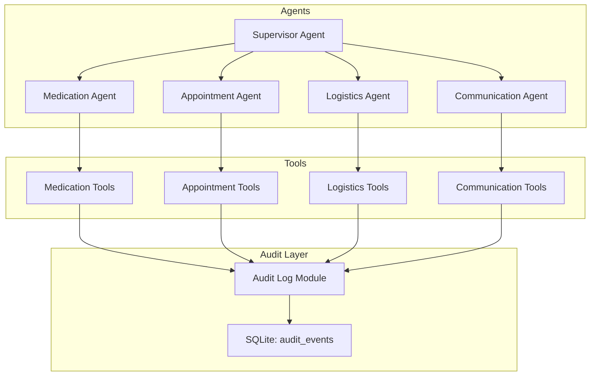
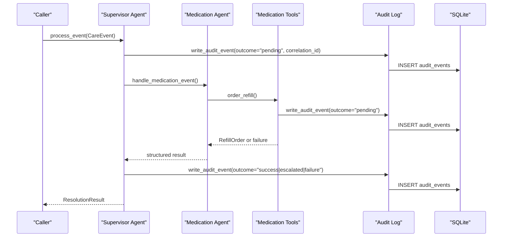
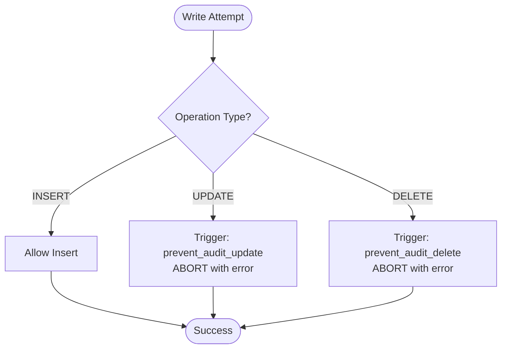
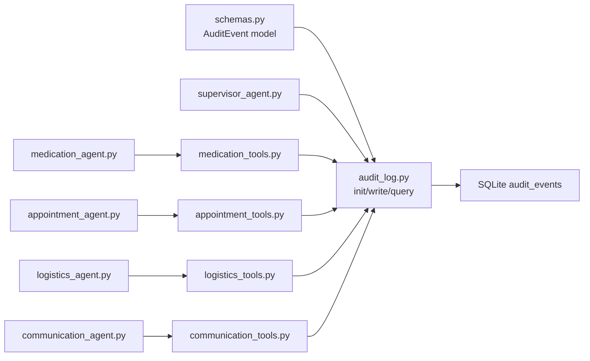

# Audit Trail Schema

<cite>
**Referenced Files in This Document**
- [audit_log.py](file://src/models/audit_log.py)
- [schemas.py](file://src/models/schemas.py)
- [supervisor_agent.py](file://src/agents/supervisor_agent.py)
- [medication_agent.py](file://src/agents/medication_agent.py)
- [appointment_agent.py](file://src/agents/appointment_agent.py)
- [logistics_agent.py](file://src/agents/logistics_agent.py)
- [communication_agent.py](file://src/agents/communication_agent.py)
- [medication_tools.py](file://src/tools/medication_tools.py)
- [appointment_tools.py](file://src/tools/appointment_tools.py)
- [logistics_tools.py](file://src/tools/logistics_tools.py)
- [communication_tools.py](file://src/tools/communication_tools.py)
- [test_supervisor.py](file://tests/test_supervisor.py)
</cite>

## Table of Contents
1. [Introduction](#introduction)
2. [Project Structure](#project-structure)
3. [Core Components](#core-components)
4. [Architecture Overview](#architecture-overview)
5. [Detailed Component Analysis](#detailed-component-analysis)
6. [Dependency Analysis](#dependency-analysis)
7. [Performance Considerations](#performance-considerations)
8. [Troubleshooting Guide](#troubleshooting-guide)
9. [Conclusion](#conclusion)
10. [Appendices](#appendices)

## Introduction
This document describes CareBridge’s immutable audit trail system designed for compliance and security. It explains the data model, SQLite schema, immutability enforcement via triggers, correlation tracking across agent interactions, and examples of audit events generated by different actors. It also provides guidance on querying audit trails for reporting and investigations while preserving integrity, and outlines HIPAA-aligned considerations such as data minimization, retention, and access controls.

## Project Structure
The audit trail is implemented as a dedicated module with:
- A Pydantic model defining the event contract
- An SQLite-backed store enforcing append-only semantics
- Agent and tool layers that emit audit events before and after actions
- Tests validating immutability and completeness

**Diagram sources**
- [supervisor_agent.py:285-395](file://src/agents/supervisor_agent.py#L285-L395)
- [medication_agent.py:23-134](file://src/agents/medication_agent.py#L23-L134)
- [appointment_agent.py:74-172](file://src/agents/appointment_agent.py#L74-L172)
- [logistics_agent.py:23-152](file://src/agents/logistics_agent.py#L23-L152)
- [communication_agent.py:28-115](file://src/agents/communication_agent.py#L28-L115)
- [medication_tools.py:65-152](file://src/tools/medication_tools.py#L65-L152)
- [appointment_tools.py:117-200](file://src/tools/appointment_tools.py#L117-L200)
- [logistics_tools.py:56-128](file://src/tools/logistics_tools.py#L56-L128)
- [communication_tools.py:54-157](file://src/tools/communication_tools.py#L54-L157)
- [audit_log.py:19-78](file://src/models/audit_log.py#L19-L78)

**Section sources**
- [audit_log.py:1-167](file://src/models/audit_log.py#L1-L167)
- [schemas.py:44-53](file://src/models/schemas.py#L44-L53)
- [supervisor_agent.py:285-395](file://src/agents/supervisor_agent.py#L285-L395)

## Core Components
- AuditEvent model defines the canonical fields and allowed values for actor and outcome.
- SQLite schema enforces primary keys, NOT NULL constraints, and indexes for efficient queries.
- Triggers enforce immutability by aborting UPDATE and DELETE operations.
- Write path ensures an initial “pending” event precedes any action, followed by a final outcome event.
- Correlation ID links all events belonging to one logical operation across agents.

Key implementation references:
- Model definition and allowed enumerations
- Database initialization and trigger creation
- Event writing and querying functions

**Section sources**
- [schemas.py:44-53](file://src/models/schemas.py#L44-L53)
- [audit_log.py:19-78](file://src/models/audit_log.py#L19-L78)
- [audit_log.py:81-130](file://src/models/audit_log.py#L81-L130)
- [audit_log.py:133-167](file://src/models/audit_log.py#L133-L167)

## Architecture Overview
CareBridge uses an “audit-first” pattern: every significant action writes a pending audit event before execution, then writes a follow-up event with success/failure/escalated outcome. The supervisor orchestrates specialized agents and ensures correlation IDs tie related events together.

**Diagram sources**
- [supervisor_agent.py:285-395](file://src/agents/supervisor_agent.py#L285-L395)
- [medication_agent.py:23-134](file://src/agents/medication_agent.py#L23-L134)
- [medication_tools.py:65-152](file://src/tools/medication_tools.py#L65-L152)
- [audit_log.py:81-130](file://src/models/audit_log.py#L81-L130)

## Detailed Component Analysis

### AuditEvent Model and Data Contract
- Fields:
  - event_id: unique identifier per event
  - timestamp: UTC ISO timestamp
  - actor: enumerated set of actors (supervisor, medication, appointment, logistics, communication, human)
  - action_type: descriptive name of the tool/action
  - care_recipient_id: recipient identifier
  - rationale: human-readable reason for the action
  - outcome: enumerated state (success, failure, pending, escalated)
  - correlation_id: shared UUID linking related events
  - authorization_ref: optional reference to human approval when applicable

Constraints and validation are enforced by both the Pydantic model and database schema.

**Section sources**
- [schemas.py:44-53](file://src/models/schemas.py#L44-L53)

### SQLite Schema, Indexes, and Constraints
- Table: audit_events
  - Primary key: event_id
  - NOT NULL columns: timestamp, actor, action_type, care_recipient_id, rationale, outcome, correlation_id
  - Optional column: authorization_ref
- Indexes:
  - idx_audit_timestamp on timestamp
  - idx_audit_correlation on correlation_id
  - idx_audit_recipient on care_recipient_id

These ensure fast time-based and correlation-based queries and enforce referential integrity at the row level.

**Section sources**
- [audit_log.py:28-44](file://src/models/audit_log.py#L28-L44)

### Immutability Enforcement via Triggers
- BEFORE UPDATE trigger prevents any modification to existing audit records
- BEFORE DELETE trigger prevents deletion of audit records
- Attempts to update or delete raise errors, verified by tests

**Diagram sources**
- [audit_log.py:46-78](file://src/models/audit_log.py#L46-L78)
- [test_supervisor.py:223-275](file://tests/test_supervisor.py#L223-L275)

**Section sources**
- [audit_log.py:46-78](file://src/models/audit_log.py#L46-L78)
- [test_supervisor.py:223-275](file://tests/test_supervisor.py#L223-L275)

### Correlation Tracking Mechanism
- Each logical operation generates a correlation_id (UUID)
- All related events (before-action, tool calls, follow-ups) share this ID
- Enables tracing multi-agent workflows end-to-end

Examples:
- Supervisor process_event writes a pending event, then a final outcome event sharing the same correlation_id
- Tool-level actions (e.g., order_refill) create their own correlation_id to group pre/post events for that specific call

**Section sources**
- [supervisor_agent.py:299-311](file://src/agents/supervisor_agent.py#L299-L311)
- [supervisor_agent.py:373-386](file://src/agents/supervisor_agent.py#L373-L386)
- [medication_tools.py:81-91](file://src/tools/medication_tools.py#L81-L91)
- [medication_tools.py:117-125](file://src/tools/medication_tools.py#L117-L125)

### Actor and Action Examples
Below are representative audit events produced by each actor type. These illustrate how rationale, outcome, and correlation_id are used to capture context and linkage.

- Supervisor
  - Before routing: outcome="pending", rationale includes event type being routed
  - After processing: outcome="success" or "escalated" or "failure"
  - Human approvals/rejections: actor="human", outcome="success", authorization_ref points to the pending action’s event_id

- Medication
  - order_refill: writes a pending event before API call, then success or failure follow-up
  - Adherence checks: may escalate based on severity; outcomes recorded accordingly

- Appointment
  - schedule_appointment: pending before external call, success/failure after
  - Checklist sending: logged as part of appointment workflow

- Logistics
  - check_delivery_status: logs lookup results and escalations for essential deliveries
  - order_grocery/order_pharmacy_delivery: pending before placement, success/failure after

- Communication
  - send_alert: pending before messaging, success/failure after; channels vary by level

- Human
  - approve_action/reject_action: records human decision with authorization_ref

These patterns ensure complete traceability and support compliance audits.

**Section sources**
- [supervisor_agent.py:303-311](file://src/agents/supervisor_agent.py#L303-L311)
- [supervisor_agent.py:373-386](file://src/agents/supervisor_agent.py#L373-L386)
- [supervisor_agent.py:477-506](file://src/agents/supervisor_agent.py#L477-L506)
- [medication_tools.py:81-152](file://src/tools/medication_tools.py#L81-L152)
- [appointment_tools.py:139-200](file://src/tools/appointment_tools.py#L139-L200)
- [logistics_agent.py:40-152](file://src/agents/logistics_agent.py#L40-L152)
- [logistics_tools.py:74-128](file://src/tools/logistics_tools.py#L74-L128)
- [communication_tools.py:77-157](file://src/tools/communication_tools.py#L77-L157)

### Querying Audit Trails for Reporting and Investigation
- Filter by care_recipient_id to reconstruct a recipient’s timeline
- Filter by correlation_id to trace a single operation across agents
- Order by timestamp descending to view most recent activity first
- Use these queries for:
  - Incident investigation
  - Compliance reporting
  - Operational dashboards

Implementation reference:
- get_audit_events supports optional filtering and ordering

**Section sources**
- [audit_log.py:133-167](file://src/models/audit_log.py#L133-L167)

## Dependency Analysis
The audit trail depends on:
- Pydantic models for validation and serialization
- SQLite for persistent storage
- Agents and tools that consistently call the audit layer before and after actions

**Diagram sources**
- [schemas.py:44-53](file://src/models/schemas.py#L44-L53)
- [audit_log.py:19-167](file://src/models/audit_log.py#L19-L167)
- [supervisor_agent.py:285-395](file://src/agents/supervisor_agent.py#L285-L395)
- [medication_agent.py:23-134](file://src/agents/medication_agent.py#L23-L134)
- [appointment_agent.py:74-172](file://src/agents/appointment_agent.py#L74-L172)
- [logistics_agent.py:23-152](file://src/agents/logistics_agent.py#L23-L152)
- [communication_agent.py:28-115](file://src/agents/communication_agent.py#L28-L115)
- [medication_tools.py:65-152](file://src/tools/medication_tools.py#L65-L152)
- [appointment_tools.py:117-200](file://src/tools/appointment_tools.py#L117-L200)
- [logistics_tools.py:56-128](file://src/tools/logistics_tools.py#L56-L128)
- [communication_tools.py:54-157](file://src/tools/communication_tools.py#L54-L157)

**Section sources**
- [audit_log.py:19-167](file://src/models/audit_log.py#L19-L167)
- [schemas.py:44-53](file://src/models/schemas.py#L44-L53)

## Performance Considerations
- Indexes on timestamp, correlation_id, and care_recipient_id optimize common query patterns
- Append-only design avoids expensive UPDATE/DELETE operations
- Minimal payload per event reduces I/O overhead
- Using correlation_id enables efficient grouping without full-table scans

[No sources needed since this section provides general guidance]

## Troubleshooting Guide
Common issues and resolutions:
- Attempting to update or delete audit records will fail due to triggers; use new inserts to record corrections or annotations if necessary
- Missing correlation_id can break traceability; ensure callers generate and propagate correlation_id consistently
- If audit events are missing, verify that agents/tools call write_audit_event before and after actions
- For failed external calls, confirm that failure paths still write audit events with outcome="failure"

Validation references:
- Tests assert immutability and presence of audit events

**Section sources**
- [audit_log.py:46-78](file://src/models/audit_log.py#L46-L78)
- [test_supervisor.py:207-275](file://tests/test_supervisor.py#L207-L275)

## Conclusion
CareBridge’s audit trail provides a robust, compliant foundation for recording every agent action with immutability guarantees, clear correlation tracking, and strong constraints. The combination of Pydantic validation, SQLite schema, and triggers ensures data integrity, while consistent usage across agents and tools enables comprehensive reporting and investigation capabilities aligned with HIPAA requirements.

[No sources needed since this section summarizes without analyzing specific files]

## Appendices

### HIPAA-Aligned Compliance Considerations
- Data minimization: Store only necessary identifiers and rationales; avoid embedding PHI in audit payloads
- Access controls: Restrict database access to authorized services and users; enforce least privilege
- Retention policies: Define lifecycle rules for archival and secure deletion where appropriate; note that current schema enforces immutability, so retention must be managed externally (e.g., export and archive)
- Integrity: Maintain append-only records; rely on triggers to prevent tampering
- Auditability: Use correlation_id to reconstruct workflows; leverage indexes for efficient retrieval

[No sources needed since this section provides general guidance]