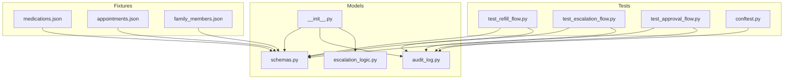
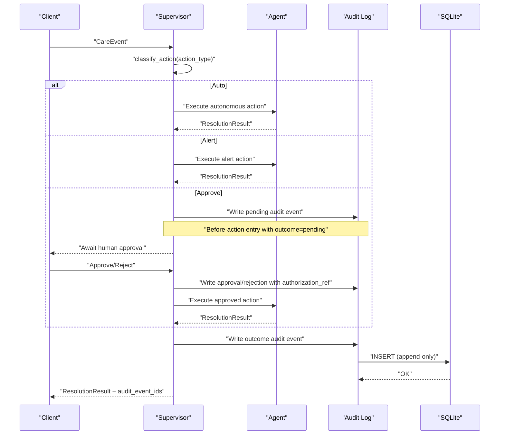
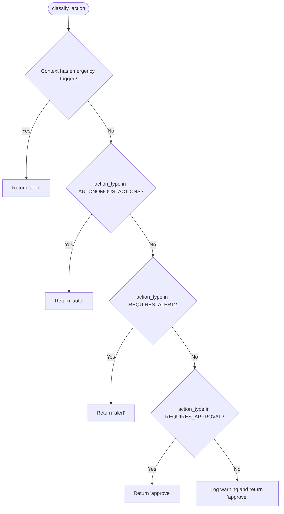
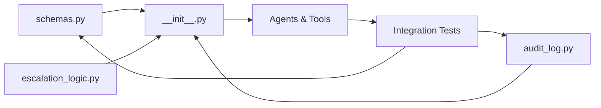
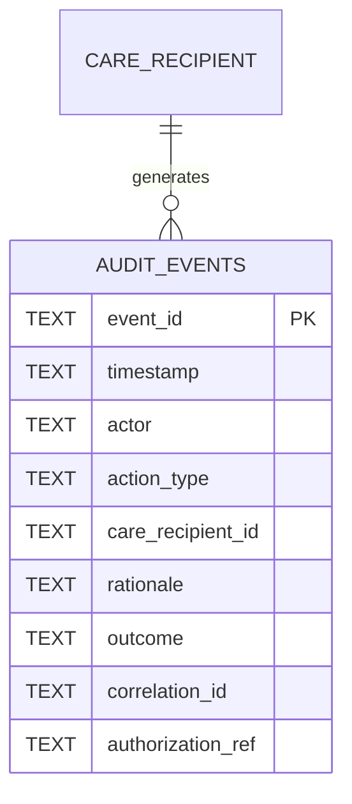
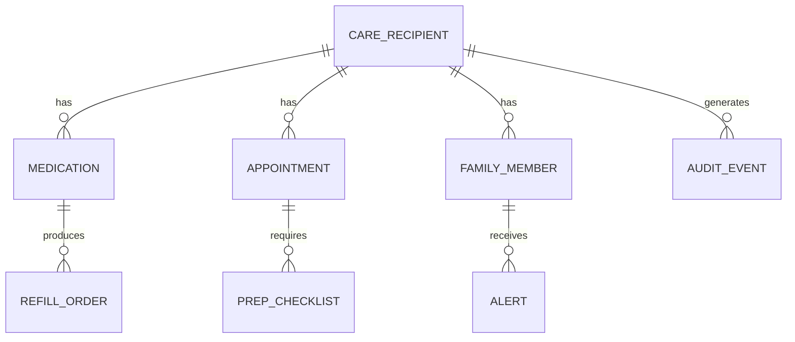

# Data Models and Schemas

<cite>
**Referenced Files in This Document**
- [schemas.py](file://src/models/schemas.py)
- [audit_log.py](file://src/models/audit_log.py)
- [escalation_logic.py](file://src/models/escalation_logic.py)
- [__init__.py](file://src/models/__init__.py)
- [medications.json](file://fixtures/medications.json)
- [appointments.json](file://fixtures/appointments.json)
- [family_members.json](file://fixtures/family_members.json)
- [test_escalation_flow.py](file://tests/integration/test_escalation_flow.py)
- [test_approval_flow.py](file://tests/integration/test_approval_flow.py)
- [test_refill_flow.py](file://tests/integration/test_refill_flow.py)
- [conftest.py](file://conftest.py)
- [architecture.md](file://architecture.md)
</cite>

## Table of Contents
1. Introduction
2. Project Structure
3. Core Components
4. Architecture Overview
5. Detailed Component Analysis
6. Dependency Analysis
7. Performance Considerations
8. Troubleshooting Guide
9. Conclusion
10. Appendices

## Introduction
This document provides comprehensive data model documentation for CareBridge’s Pydantic v2 models and the immutable audit trail schema used throughout the system. It focuses on structured data types for core entities (Medication, Appointment, FamilyMember, AuditEvent, CareEvent, ResolutionResult), their relationships, field definitions, validation rules, and business constraints. It also documents the SQLite-based immutable audit log with triggers preventing modifications, the deterministic escalation classification system (auto, alert, approve), sample serialization formats from fixtures, database schema diagrams, indexes, lifecycle and retention considerations, and security aspects for sensitive care information.

## Project Structure
CareBridge centralizes shared data models under src/models:
- schemas.py defines Pydantic v2 models for domain entities and API payloads.
- audit_log.py implements an append-only SQLite audit trail with immutability enforced by triggers.
- escalation_logic.py provides deterministic classification of actions into auto, alert, or approve categories.
- __init__.py re-exports key models and utilities for agents and tools.

**Diagram sources**
- [schemas.py:13-149](file://src/models/schemas.py#L13-L149)
- [audit_log.py:19-166](file://src/models/audit_log.py#L19-L166)
- [escalation_logic.py:13-70](file://src/models/escalation_logic.py#L13-L70)
- [__init__.py:3-19](file://src/models/__init__.py#L3-L19)
- [medications.json:1-33](file://fixtures/medications.json#L1-L33)
- [appointments.json:1-33](file://fixtures/appointments.json#L1-L33)
- [family_members.json:1-30](file://fixtures/family_members.json#L1-L30)
- [test_refill_flow.py:14-82](file://tests/integration/test_refill_flow.py#L14-L82)
- [test_escalation_flow.py:16-97](file://tests/integration/test_escalation_flow.py#L16-L97)
- [test_approval_flow.py:15-130](file://tests/integration/test_approval_flow.py#L15-L130)
- [conftest.py:7-60](file://conftest.py#L7-L60)

**Section sources**
- [schemas.py:1-149](file://src/models/schemas.py#L1-L149)
- [audit_log.py:1-166](file://src/models/audit_log.py#L1-L166)
- [escalation_logic.py:1-70](file://src/models/escalation_logic.py#L1-L70)
- [__init__.py:1-20](file://src/models/__init__.py#L1-L20)

## Core Components
This section summarizes the primary Pydantic models and their roles:
- Medication: Represents a prescribed medication with dosage, frequency, refill threshold, pharmacy, and care recipient linkage.
- Appointment: Captures scheduled provider visits with datetime, location, preparation requirements, transportation needs, and care recipient linkage.
- FamilyMember: Stores family contact details, notification preferences, and escalation priority.
- AuditEvent: Immutable record of agent/human actions with actor, action type, rationale, outcome, correlation ID, and optional authorization reference.
- CareEvent: Inbound event triggering care workflows (e.g., refill_low, appointment_upcoming, delivery_failed, adherence_deviation).
- ResolutionResult: Outcome of processing a CareEvent including whether resolved, actions taken, escalation flags, and linked audit events.
- Supporting models: RefillStatus, RefillOrder, AdherencePattern, DeliveryStatus, DeliveryOrder, ChecklistResult, AlertResult, StatusSummary, PendingAction, FamilyPreferences.

Key validation and constraints:
- Literal enums restrict fields to predefined values (e.g., outcomes, event types, severity levels).
- UUIDs for unique identifiers; timestamps use ISO format.
- Optional fields where appropriate (e.g., phone/email, estimated dates).
- Defaults for thresholds and booleans to ensure consistent behavior.

**Section sources**
- [schemas.py:13-149](file://src/models/schemas.py#L13-L149)

## Architecture Overview
The data architecture centers on Pydantic models for request/response contracts and an immutable audit trail for compliance. The supervisor orchestrates events through agents, producing ResolutionResults and writing audit events. Escalation logic deterministically classifies actions to enforce safety boundaries without LLM involvement.

**Diagram sources**
- [escalation_logic.py:42-70](file://src/models/escalation_logic.py#L42-L70)
- [audit_log.py:81-130](file://src/models/audit_log.py#L81-L130)
- [test_refill_flow.py:14-82](file://tests/integration/test_refill_flow.py#L14-L82)
- [test_approval_flow.py:15-130](file://tests/integration/test_approval_flow.py#L15-L130)
- [test_escalation_flow.py:16-97](file://tests/integration/test_escalation_flow.py#L16-L97)

## Detailed Component Analysis

### Medication Model
- Purpose: Encapsulates medication metadata required for refill and adherence tracking.
- Fields:
  - medication_id: string identifier
  - name: string
  - dosage: string
  - frequency: string
  - refill_threshold: integer defaulting to 5
  - pharmacy_id: string
  - care_recipient_id: string
- Validation: No explicit validators beyond Pydantic type enforcement; defaults ensure safe baseline behavior.
- Business constraints: Refill decisions compare days remaining against refill_threshold; pharmacy linkage ensures routing correctness.

Sample fixture usage demonstrates expected structure and additional computed fields like days_remaining used by tests/fixtures.

**Section sources**
- [schemas.py:13-21](file://src/models/schemas.py#L13-L21)
- [medications.json:1-33](file://fixtures/medications.json#L1-L33)
- [test_refill_flow.py:14-82](file://tests/integration/test_refill_flow.py#L14-L82)

### Appointment Model
- Purpose: Represents scheduled healthcare appointments with logistics and preparation details.
- Fields:
  - appointment_id: string
  - provider_name: string
  - specialty: string
  - datetime: datetime
  - location: string
  - prep_required: list of strings (default empty)
  - transportation_needed: boolean (default false)
  - care_recipient_id: string
- Validation: Datetime parsing via Pydantic; lists and booleans validated by type.
- Business constraints: Prep checklists and transportation needs drive downstream tasks (checklist and logistics).

**Section sources**
- [schemas.py:23-32](file://src/models/schemas.py#L23-L32)
- [appointments.json:1-33](file://fixtures/appointments.json#L1-L33)

### FamilyMember Model
- Purpose: Captures family contacts and escalation preferences.
- Fields:
  - family_id: string
  - name: string
  - relationship: string
  - phone: optional string
  - email: optional string
  - notification_preference: literal enum ("sms", "email", "both") default "both"
  - escalation_priority: integer default 1
- Validation: Enum restriction ensures consistent communication channels; priority ordering supports escalation sequences.

**Section sources**
- [schemas.py:34-42](file://src/models/schemas.py#L34-L42)
- [family_members.json:1-30](file://fixtures/family_members.json#L1-L30)

### AuditEvent Model
- Purpose: Immutable record of every agent/human action with full context for compliance and traceability.
- Fields:
  - event_id: UUID
  - timestamp: datetime
  - actor: literal enum ("supervisor", "medication", "appointment", "logistics", "communication", "human")
  - action_type: string
  - care_recipient_id: string
  - rationale: string
  - outcome: literal enum ("success", "failure", "pending", "escalated")
  - correlation_id: UUID linking related actions
  - authorization_ref: optional string referencing human approval
- Validation: Strict enums and UUIDs ensure integrity; timestamps are UTC ISO strings in storage.
- Storage: Persisted in SQLite with triggers preventing updates/deletes; append-only design guarantees immutability.

**Section sources**
- [schemas.py:44-54](file://src/models/schemas.py#L44-L54)
- [audit_log.py:19-78](file://src/models/audit_log.py#L19-L78)
- [audit_log.py:81-130](file://src/models/audit_log.py#L81-L130)

### CareEvent Model
- Purpose: Inbound event that triggers care workflows.
- Fields:
  - event_id: UUID (auto-generated)
  - event_type: literal enum ("refill_low", "appointment_upcoming", "delivery_failed", "adherence_deviation")
  - care_recipient_id: string
  - payload: dict carrying event-specific context
  - received_at: datetime (UTC default)
- Validation: Event type restricted to known workflow triggers; payload flexibility allows per-event specifics.

**Section sources**
- [schemas.py:56-62](file://src/models/schemas.py#L56-L62)
- [test_refill_flow.py:14-82](file://tests/integration/test_refill_flow.py#L14-L82)
- [test_escalation_flow.py:16-97](file://tests/integration/test_escalation_flow.py#L16-L97)

### ResolutionResult Model
- Purpose: Summarizes the result of processing a CareEvent.
- Fields:
  - event_id: UUID
  - resolved: boolean
  - actions_taken: list of strings describing executed steps
  - escalation_required: boolean
  - escalation_level: optional literal enum ("info", "alert", "emergency")
  - audit_event_ids: list of UUIDs linking to audit trail entries
- Validation: Ensures clear signaling of escalation needs and ties results to audit records.

**Section sources**
- [schemas.py:64-70](file://src/models/schemas.py#L64-L70)
- [test_refill_flow.py:14-82](file://tests/integration/test_refill_flow.py#L14-L82)
- [test_escalation_flow.py:16-97](file://tests/integration/test_escalation_flow.py#L16-L97)

### Additional Models
- RefillStatus: Tracks medication refill eligibility and remaining days.
- RefillOrder: Captures order placement and status with optional failure reasons.
- AdherencePattern: Records missed/late doses and deviation severity.
- DeliveryStatus/DeliveryOrder: Manage delivery lifecycle and failures.
- ChecklistResult/AlertResult: Track appointment prep checks and alerts sent.
- StatusSummary/PendingAction/FamilyPreferences: Aggregate status views, pending approvals, and family configuration.

**Section sources**
- [schemas.py:73-149](file://src/models/schemas.py#L73-L149)

### Escalation Logic Classification System
Deterministic classification ensures safety-critical decisions are not delegated to LLMs. Actions are categorized as:
- Auto: Autonomous actions (e.g., check_refill_status, get_calendar, synthesize_status).
- Alert: Actions requiring alert-level handling (e.g., order_refill, schedule_appointment).
- Approve: Actions requiring human approval (e.g., cancel_appointment, change_medication_schedule).
Emergency triggers escalate at minimum to alert level. Unknown actions default to approve for safety.

**Diagram sources**
- [escalation_logic.py:13-70](file://src/models/escalation_logic.py#L13-L70)

**Section sources**
- [escalation_logic.py:13-70](file://src/models/escalation_logic.py#L13-L70)
- [test_escalation_flow.py:16-97](file://tests/integration/test_escalation_flow.py#L16-L97)

## Dependency Analysis
- schemas.py is the canonical source of all Pydantic models and is re-exported via __init__.py for agents and tools.
- audit_log.py depends on Python’s sqlite3 and uuid modules; it initializes schema and triggers once per process.
- escalation_logic.py is pure Python with no external dependencies, ensuring deterministic behavior.
- Tests validate end-to-end flows using temporary audit databases and mock external services.

**Diagram sources**
- [__init__.py:3-19](file://src/models/__init__.py#L3-L19)
- [audit_log.py:19-166](file://src/models/audit_log.py#L19-L166)
- [escalation_logic.py:13-70](file://src/models/escalation_logic.py#L13-L70)

**Section sources**
- [__init__.py:1-20](file://src/models/__init__.py#L1-L20)
- [audit_log.py:1-166](file://src/models/audit_log.py#L1-L166)
- [escalation_logic.py:1-70](file://src/models/escalation_logic.py#L1-L70)

## Performance Considerations
- Indexes:
  - idx_audit_timestamp: Optimizes time-range queries on audit events.
  - idx_audit_correlation: Speeds up tracing correlated actions across workflows.
  - idx_audit_recipient: Enhances filtering by care_recipient_id.
- Immutability: Triggers prevent UPDATE/DELETE, reducing risk of accidental data corruption and simplifying consistency checks.
- Query patterns: Retrieval functions filter by care_recipient_id and correlation_id, leveraging indexes for efficient scans.
- Defaults: Using defaults for thresholds and booleans reduces validation overhead and ensures predictable behavior.

Recommendations:
- Keep payload dicts minimal and well-structured to avoid large BLOB-like columns.
- Partition or archive old audit logs periodically if volume grows significantly.
- Use connection pooling or persistent connections in high-throughput environments to reduce SQLite open/close overhead.

**Section sources**
- [audit_log.py:28-44](file://src/models/audit_log.py#L28-L44)
- [audit_log.py:133-166](file://src/models/audit_log.py#L133-L166)

## Troubleshooting Guide
Common issues and resolutions:
- Attempting to update or delete audit events raises IntegrityError due to triggers. Ensure all changes go through new INSERTs with updated correlation contexts.
- Unknown action types default to approve; verify action_type spelling and add to appropriate sets if needed.
- Temporary audit DB in tests: The conftest fixture rewrites function defaults to use a temp path; ensure your code respects db_path parameters.

Debugging tips:
- Use get_audit_events with care_recipient_id or correlation_id filters to inspect event chains.
- Validate escalation classification by calling classify_action with known action types and context.

**Section sources**
- [audit_log.py:46-78](file://src/models/audit_log.py#L46-L78)
- [escalation_logic.py:42-70](file://src/models/escalation_logic.py#L42-L70)
- [conftest.py:7-60](file://conftest.py#L7-L60)
- [test_supervisor.py:241-275](file://tests/test_supervisor.py#L241-L275)

## Conclusion
CareBridge’s data models provide a robust, validated foundation for care coordination workflows. Pydantic v2 schemas enforce strict contracts, while the immutable SQLite audit trail ensures compliance and traceability. Deterministic escalation logic safeguards critical decisions, and indexes optimize query performance. Together, these components support reliable, auditable, and secure care operations.

## Appendices

### Database Schema Diagram

**Diagram sources**
- [audit_log.py:28-44](file://src/models/audit_log.py#L28-L44)

### Entity Relationship Diagram

**Diagram sources**
- [architecture.md:263-328](file://architecture.md#L263-L328)

### Sample Serialization Formats
- Medication fixture shows JSON structure with medication_id, name, dosage, frequency, refill_threshold, pharmacy_id, care_recipient_id, and days_remaining.
- Appointment fixture includes provider details, datetime, location, prep_required list, transportation_needed boolean, and care_recipient_id.
- FamilyMember fixture captures contact info, notification_preference, and escalation_priority.

These samples align with Pydantic models and demonstrate expected API payloads.

**Section sources**
- [medications.json:1-33](file://fixtures/medications.json#L1-L33)
- [appointments.json:1-33](file://fixtures/appointments.json#L1-L33)
- [family_members.json:1-30](file://fixtures/family_members.json#L1-L30)
- [schemas.py:13-42](file://src/models/schemas.py#L13-L42)

### Data Lifecycle, Retention, and Security
- Lifecycle:
  - CareEvent enters the system and is processed by the supervisor, which writes before-action audit events (outcome=pending), executes actions, and writes outcome events.
  - ResolutionResult links back to audit events via audit_event_ids for traceability.
- Retention:
  - Audit events are append-only; implement periodic archival or partitioning strategies based on regulatory requirements.
  - Consider purging non-audit transient data (e.g., in-memory caches) while retaining audit logs indefinitely unless explicitly authorized.
- Security:
  - Enforce least privilege for database access; restrict write permissions to service accounts only.
  - Encrypt audit.db at rest and in transit if accessed remotely.
  - Validate all inputs via Pydantic models to prevent injection and malformed data.
  - Restrict escalation classifications to deterministic logic; never delegate safety-critical decisions to LLMs.

[No sources needed since this section provides general guidance]