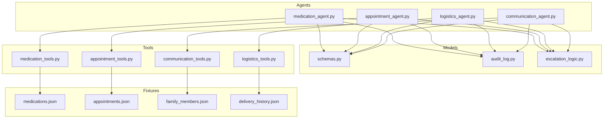
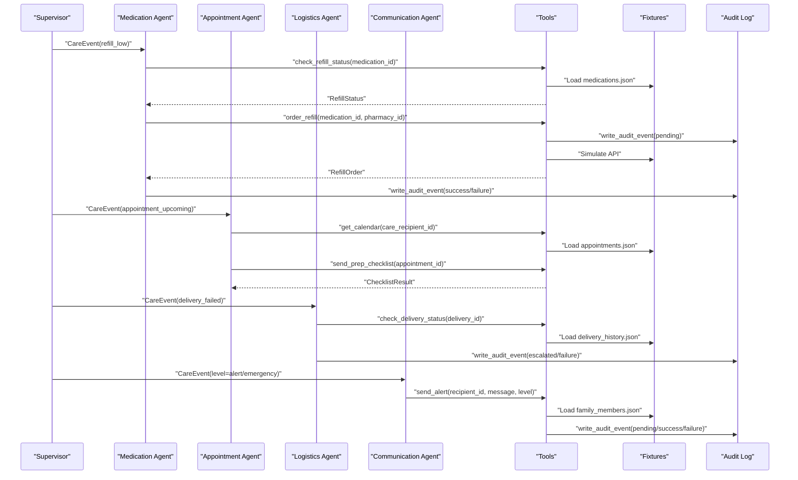
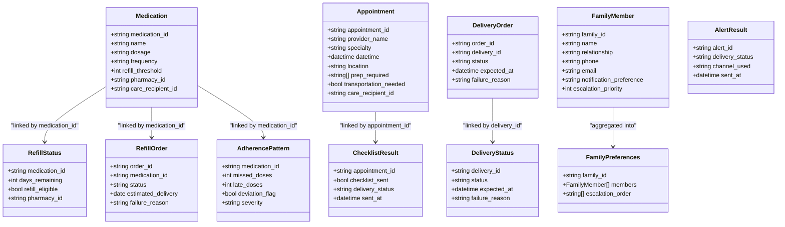

# Domain Models

<cite>
**Referenced Files in This Document**
- [schemas.py](file://src/models/schemas.py)
- [__init__.py](file://src/models/__init__.py)
- [medication_agent.py](file://src/agents/medication_agent.py)
- [appointment_agent.py](file://src/agents/appointment_agent.py)
- [logistics_agent.py](file://src/agents/logistics_agent.py)
- [communication_agent.py](file://src/agents/communication_agent.py)
- [medication_tools.py](file://src/tools/medication_tools.py)
- [appointment_tools.py](file://src/tools/appointment_tools.py)
- [logistics_tools.py](file://src/tools/logistics_tools.py)
- [communication_tools.py](file://src/tools/communication_tools.py)
- [audit_log.py](file://src/models/audit_log.py)
- [escalation_logic.py](file://src/models/escalation_logic.py)
- [medications.json](file://fixtures/medications.json)
- [appointments.json](file://fixtures/appointments.json)
- [family_members.json](file://fixtures/family_members.json)
- [delivery_history.json](file://fixtures/delivery_history.json)
</cite>

## Table of Contents
1. Introduction
2. Project Structure
3. Core Components
4. Architecture Overview
5. Detailed Component Analysis
6. Dependency Analysis
7. Performance Considerations
8. Troubleshooting Guide
9. Conclusion
10. Appendices

## Introduction
This document provides comprehensive data model documentation for CareBridge’s core domain models that underpin care coordination workflows. It focuses on the primary business entities used across medication management, appointment coordination, delivery logistics, and family communication. For each model, we define fields, types, validation rules, and business constraints; illustrate relationships; and show how models are instantiated and serialized by agents and tools. We also include sample structures derived from fixtures to demonstrate typical usage patterns and explain lifecycle interactions among entities.

## Project Structure
CareBridge organizes domain models as Pydantic v2 schemas shared across agents and tools. Agents orchestrate workflows using these models, while tools perform operations against simulated external systems (fixtures). Audit logging and escalation logic support safety and compliance.

**Diagram sources**
- [schemas.py:13-149](file://src/models/schemas.py#L13-L149)
- [medication_agent.py:1-189](file://src/agents/medication_agent.py#L1-L189)
- [appointment_agent.py:1-173](file://src/agents/appointment_agent.py#L1-L173)
- [logistics_agent.py:1-236](file://src/agents/logistics_agent.py#L1-L236)
- [communication_agent.py:1-163](file://src/agents/communication_agent.py#L1-L163)
- [medication_tools.py:1-208](file://src/tools/medication_tools.py#L1-L208)
- [appointment_tools.py:1-242](file://src/tools/appointment_tools.py#L1-L242)
- [logistics_tools.py:1-220](file://src/tools/logistics_tools.py#L1-L220)
- [communication_tools.py:1-279](file://src/tools/communication_tools.py#L1-L279)
- [audit_log.py:1-167](file://src/models/audit_log.py#L1-L167)
- [escalation_logic.py:1-71](file://src/models/escalation_logic.py#L1-L71)
- [medications.json:1-33](file://fixtures/medications.json#L1-L33)
- [appointments.json:1-33](file://fixtures/appointments.json#L1-L33)
- [family_members.json:1-30](file://fixtures/family_members.json#L1-L30)
- [delivery_history.json:1-33](file://fixtures/delivery_history.json#L1-L33)

**Section sources**
- [schemas.py:1-149](file://src/models/schemas.py#L1-L149)
- [__init__.py:1-20](file://src/models/__init__.py#L1-L20)

## Core Components
The following models form the backbone of CareBridge’s domain:

- Medication: Represents a prescribed medication with dosage, frequency, refill threshold, pharmacy linkage, and care recipient association.
- Appointment: Captures scheduled visits with provider details, timing, location, preparation requirements, transportation needs, and care recipient linkage.
- FamilyMember: Encapsulates contact and notification preferences for family members involved in care coordination.
- RefillStatus: Tracks remaining days and eligibility for refills per medication.
- RefillOrder: Records placement outcomes and estimated delivery dates for medication refills.
- AdherencePattern: Summarizes missed and late doses and flags deviations with severity levels.
- DeliveryStatus: Tracks delivery lifecycle states and expected arrival times.
- DeliveryOrder: Captures order placement results and expected delivery timestamps.
- ChecklistResult: Documents checklist dispatch status tied to appointments.
- AlertResult: Records alert delivery outcomes including channels used and timestamps.
- FamilyPreferences: Aggregates family members and their escalation ordering.

Key characteristics:
- All models are Pydantic v2 BaseModels ensuring runtime validation and serialization.
- Enums/Literals constrain allowed values for statuses, severities, and preferences.
- Optional fields provide flexibility for non-mandatory attributes.
- Relationships are expressed via string identifiers linking entities across domains.

**Section sources**
- [schemas.py:13-149](file://src/models/schemas.py#L13-L149)

## Architecture Overview
CareBridge uses an event-driven architecture where agents process CareEvent instances and coordinate actions through tools. The models above represent inputs, outputs, and intermediate state across these flows.

**Diagram sources**
- [medication_agent.py:23-134](file://src/agents/medication_agent.py#L23-L134)
- [appointment_agent.py:74-172](file://src/agents/appointment_agent.py#L74-L172)
- [logistics_agent.py:182-235](file://src/agents/logistics_agent.py#L182-L235)
- [communication_agent.py:28-115](file://src/agents/communication_agent.py#L28-L115)
- [medication_tools.py:34-152](file://src/tools/medication_tools.py#L34-L152)
- [appointment_tools.py:39-80](file://src/tools/appointment_tools.py#L39-L80)
- [logistics_tools.py:23-53](file://src/tools/logistics_tools.py#L23-L53)
- [communication_tools.py:54-157](file://src/tools/communication_tools.py#L54-L157)
- [audit_log.py:81-128](file://src/models/audit_log.py#L81-L128)

## Detailed Component Analysis

### Medication Model
Purpose:
- Represents a medication record linked to a pharmacy and care recipient.
- Supports refill threshold configuration to trigger refill checks.

Fields:
- medication_id: string identifier
- name: string
- dosage: string
- frequency: string
- refill_threshold: integer default 5
- pharmacy_id: string
- care_recipient_id: string

Validation and constraints:
- Required fields enforced by Pydantic.
- refill_threshold defaults to 5 if not provided.

Relationships:
- Links to RefillStatus via medication_id.
- Linked to RefillOrder via medication_id.
- Used by AdherencePattern via medication_id.

Sample instantiation pattern:
- Created or consumed by tools when loading fixtures and constructing models for processing.

Serialization:
- Pydantic model_dump() produces JSON-compatible dictionaries for agent responses and audit trails.

Common usage scenarios:
- Refill eligibility computed by comparing days_remaining to refill_threshold.
- Adherence analysis aggregates missed/late doses per medication.

**Section sources**
- [schemas.py:13-21](file://src/models/schemas.py#L13-L21)
- [medication_tools.py:34-62](file://src/tools/medication_tools.py#L34-L62)
- [medications.json:1-33](file://fixtures/medications.json#L1-L33)

### Appointment Model
Purpose:
- Captures upcoming healthcare appointments with preparation and transportation needs.

Fields:
- appointment_id: string identifier
- provider_name: string
- specialty: string
- datetime: datetime
- location: string
- prep_required: list of strings default []
- transportation_needed: boolean default False
- care_recipient_id: string

Validation and constraints:
- Required fields enforced by Pydantic.
- Boolean and list fields have sensible defaults.

Relationships:
- Linked to ChecklistResult via appointment_id.
- Used by Appointment Agent to determine checklist dispatch and logistics coordination.

Sample instantiation pattern:
- Constructed from fixture records within get_calendar and schedule_appointment flows.

Serialization:
- model_dump() yields structured dicts for tool outputs and agent decisions.

Common usage scenarios:
- Within 48 hours triggers prep checklist sending.
- Within 7 days with transportation_needed=True triggers logistics coordination.

**Section sources**
- [schemas.py:23-32](file://src/models/schemas.py#L23-L32)
- [appointment_tools.py:39-80](file://src/tools/appointment_tools.py#L39-L80)
- [appointments.json:1-33](file://fixtures/appointments.json#L1-L33)

### FamilyMember Model
Purpose:
- Defines a family member’s identity, relationship, contact info, and notification preferences.

Fields:
- family_id: string identifier
- name: string
- relationship: string
- phone: optional string
- email: optional string
- notification_preference: literal "sms", "email", "both" default "both"
- escalation_priority: integer default 1

Validation and constraints:
- Literal enum restricts notification_preference.
- Optional contact fields allow partial profiles.

Relationships:
- Grouped into FamilyPreferences via family_id.
- Used by Communication tools to route alerts based on escalation priority.

Sample instantiation pattern:
- Loaded from family_members.json and wrapped into FamilyPreferences with sorted escalation_order.

Serialization:
- model_dump() supports JSON logs and preference aggregation.

Common usage scenarios:
- Emergency alerts broadcast to all members.
- Alert-level notifications target primary caregiver via SMS and others via email.

**Section sources**
- [schemas.py:34-42](file://src/models/schemas.py#L34-L42)
- [communication_tools.py:234-278](file://src/tools/communication_tools.py#L234-L278)
- [family_members.json:1-30](file://fixtures/family_members.json#L1-L30)

### RefillStatus Model
Purpose:
- Indicates medication refill eligibility and remaining supply duration.

Fields:
- medication_id: string
- days_remaining: integer
- refill_eligible: boolean
- pharmacy_id: string

Validation and constraints:
- Boolean reflects eligibility based on threshold comparison.

Relationships:
- Derived from Medication via medication_id.
- Triggers RefillOrder creation when eligible and below threshold.

Common usage scenarios:
- Medication Agent checks status and decides whether to place a refill order.

**Section sources**
- [schemas.py:73-78](file://src/models/schemas.py#L73-L78)
- [medication_tools.py:34-62](file://src/tools/medication_tools.py#L34-L62)

### RefillOrder Model
Purpose:
- Records the outcome of a refill request including status and failure reasons.

Fields:
- order_id: string
- medication_id: string
- status: literal "placed" or "failed"
- estimated_delivery: optional date
- failure_reason: optional string

Validation and constraints:
- Status constrained to specific literals.
- Failure reason present only when failed.

Relationships:
- Tied to Medication via medication_id.
- Produced by medication tools during refill ordering.

Common usage scenarios:
- Success leads to tracking estimated delivery; failure logs rationale and may escalate.

**Section sources**
- [schemas.py:80-86](file://src/models/schemas.py#L80-L86)
- [medication_tools.py:65-152](file://src/tools/medication_tools.py#L65-L152)

### AdherencePattern Model
Purpose:
- Summarizes adherence metrics and deviation severity for a medication.

Fields:
- medication_id: string
- missed_doses: integer
- late_doses: integer
- deviation_flag: boolean
- severity: literal "none", "mild", "moderate", "severe"

Validation and constraints:
- Severity constrained to predefined levels.
- Flags indicate actionable deviations.

Relationships:
- Linked to Medication via medication_id.
- Used by Medication Agent to decide escalation for moderate/severe deviations.

Common usage scenarios:
- Moderate/severe deviations trigger family alerts and escalation.

**Section sources**
- [schemas.py:88-94](file://src/models/schemas.py#L88-L94)
- [medication_tools.py:155-208](file://src/tools/medication_tools.py#L155-L208)
- [medication_agent.py:101-134](file://src/agents/medication_agent.py#L101-L134)

### DeliveryStatus Model
Purpose:
- Tracks the current state of a delivery and any expected arrival time.

Fields:
- delivery_id: string
- status: literal "pending", "in_transit", "delivered", "failed"
- expected_at: optional datetime
- failure_reason: optional string

Validation and constraints:
- Status constrained to lifecycle literals.
- Failure reason populated on failures.

Relationships:
- Produced by logistics tools when checking delivery history.
- Used by Logistics Agent to determine escalation or retry behavior.

Common usage scenarios:
- Failed essential deliveries escalate immediately; non-essential retries once.

**Section sources**
- [schemas.py:96-101](file://src/models/schemas.py#L96-L101)
- [logistics_tools.py:23-53](file://src/tools/logistics_tools.py#L23-L53)
- [delivery_history.json:1-33](file://fixtures/delivery_history.json#L1-L33)

### DeliveryOrder Model
Purpose:
- Captures order placement results for deliveries including expected arrival.

Fields:
- order_id: string
- delivery_id: string
- status: literal "placed" or "failed"
- expected_at: optional datetime
- failure_reason: optional string

Validation and constraints:
- Status constrained to literals.
- Expected at indicates planned delivery time.

Relationships:
- Produced by logistics tools for grocery and pharmacy deliveries.
- Linked to DeliveryStatus via delivery_id.

Common usage scenarios:
- Order placement writes audit events and returns structured results for downstream handling.

**Section sources**
- [schemas.py:103-109](file://src/models/schemas.py#L103-L109)
- [logistics_tools.py:56-128](file://src/tools/logistics_tools.py#L56-L128)
- [logistics_tools.py:131-220](file://src/tools/logistics_tools.py#L131-L220)

### ChecklistResult Model
Purpose:
- Documents whether a prep checklist was sent for an appointment and its delivery status.

Fields:
- appointment_id: string
- checklist_sent: boolean
- delivery_status: string
- sent_at: optional datetime

Validation and constraints:
- Boolean indicates successful dispatch.
- Timestamp recorded upon sending.

Relationships:
- Tied to Appointment via appointment_id.
- Generated by appointment tools when sending checklists.

Common usage scenarios:
- Triggered for appointments within 48 hours to ensure patient readiness.

**Section sources**
- [schemas.py:111-116](file://src/models/schemas.py#L111-L116)
- [appointment_tools.py:203-242](file://src/tools/appointment_tools.py#L203-L242)

### AlertResult Model
Purpose:
- Records the outcome of alert delivery including channel used and timestamp.

Fields:
- alert_id: string
- delivery_status: string
- channel_used: string
- sent_at: datetime

Validation and constraints:
- Channel used reflects routing strategy (e.g., sms,email,phone).
- Sent timestamp ensures traceability.

Relationships:
- Produced by communication tools when sending alerts.
- Used by Communication Agent to summarize actions taken.

Common usage scenarios:
- Emergency and alert-level notifications routed according to family preferences.

**Section sources**
- [schemas.py:118-123](file://src/models/schemas.py#L118-L123)
- [communication_tools.py:54-157](file://src/tools/communication_tools.py#L54-L157)

### FamilyPreferences Model
Purpose:
- Aggregates family members and defines escalation order for notifications.

Fields:
- family_id: string
- members: list of FamilyMember
- escalation_order: list of strings (names)

Validation and constraints:
- Members list validated against FamilyMember schema.
- Escalation order derived from member priorities.

Relationships:
- Built from FamilyMember entries grouped by family_id.
- Used by Communication tools to route alerts appropriately.

Common usage scenarios:
- Determines targets for emergency blasts and prioritized alert routing.

**Section sources**
- [schemas.py:142-146](file://src/models/schemas.py#L142-L146)
- [communication_tools.py:234-278](file://src/tools/communication_tools.py#L234-L278)
- [family_members.json:1-30](file://fixtures/family_members.json#L1-L30)

## Dependency Analysis
Model dependencies and cross-entity relationships:

**Diagram sources**
- [schemas.py:13-149](file://src/models/schemas.py#L13-L149)

**Section sources**
- [schemas.py:13-149](file://src/models/schemas.py#L13-L149)

## Performance Considerations
- Fixture-based lookups are simple but can become bottlenecks at scale; consider caching loaded fixtures in memory for repeated queries.
- Pydantic validation adds minimal overhead but ensures correctness; avoid excessive re-parsing by reusing model instances where possible.
- Audit logging is append-only and safe; batch writes or use connection pooling if high throughput is required.
- Retry helpers reduce transient failures; tune retry counts and backoff strategies to balance responsiveness and resource usage.

[No sources needed since this section provides general guidance]

## Troubleshooting Guide
Common issues and resolutions:

- Missing identifiers:
  - Medication lookup failures raise ValueError when medication_id is not found in fixtures. Ensure IDs match fixtures and handle exceptions gracefully.
  - Appointment lookup failures raise ValueError when appointment_id is missing; validate inputs before calling send_prep_checklist.
  - Delivery lookup failures raise ValueError when delivery_id is not found; handle not_found cases and log audit events.

- Escalation misclassification:
  - Unknown action types default to approval for safety; verify action_type strings against escalation sets and update classification logic if new actions are introduced.

- Audit inconsistencies:
  - Always write a pending audit event before executing actions; ensure follow-up success/failure events are written with matching correlation_id to maintain traceability.

- Retry exhaustion:
  - RetryExhausted indicates all attempts failed; surface errors to supervisors and escalate accordingly.

**Section sources**
- [medication_tools.py:34-62](file://src/tools/medication_tools.py#L34-L62)
- [appointment_tools.py:203-242](file://src/tools/appointment_tools.py#L203-L242)
- [logistics_tools.py:23-53](file://src/tools/logistics_tools.py#L23-L53)
- [escalation_logic.py:42-71](file://src/models/escalation_logic.py#L42-L71)
- [audit_log.py:81-128](file://src/models/audit_log.py#L81-L128)

## Conclusion
CareBridge’s domain models provide a robust, validated foundation for care coordination across medication management, appointments, deliveries, and family communications. Their clear field definitions, constrained enums, and explicit relationships enable reliable workflows and consistent serialization. Agents leverage these models to orchestrate complex processes while maintaining auditability and safety through deterministic escalation logic. By adhering to the defined constraints and patterns, teams can extend functionality confidently while preserving system integrity.

[No sources needed since this section summarizes without analyzing specific files]

## Appendices

### Sample Data Structures from Fixtures
These examples reflect typical usage patterns observed in fixtures and tool implementations:

- Medication example structure:
  - Fields include medication_id, name, dosage, frequency, refill_threshold, pharmacy_id, care_recipient_id, and additional operational fields like days_remaining used by tools.

- Appointment example structure:
  - Fields include appointment_id, provider_name, specialty, datetime, location, prep_required, transportation_needed, care_recipient_id.

- FamilyMember example structure:
  - Fields include family_id, name, relationship, phone, email, notification_preference, escalation_priority.

- DeliveryHistory example structure:
  - Fields include delivery_id, order_id, status, expected_at, failure_reason, items, delivery_type, care_recipient_id.

These structures inform model instantiation and validation behaviors in tools and agents.

**Section sources**
- [medications.json:1-33](file://fixtures/medications.json#L1-L33)
- [appointments.json:1-33](file://fixtures/appointments.json#L1-L33)
- [family_members.json:1-30](file://fixtures/family_members.json#L1-L30)
- [delivery_history.json:1-33](file://fixtures/delivery_history.json#L1-L33)