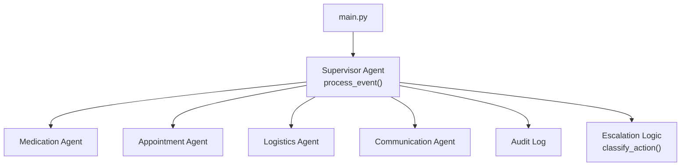
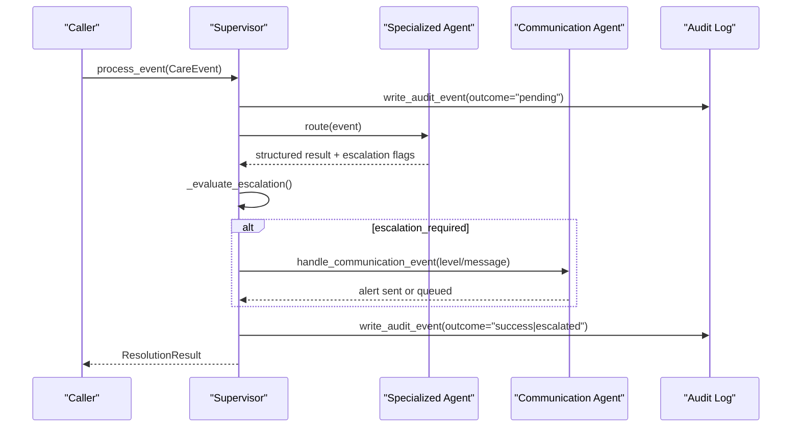
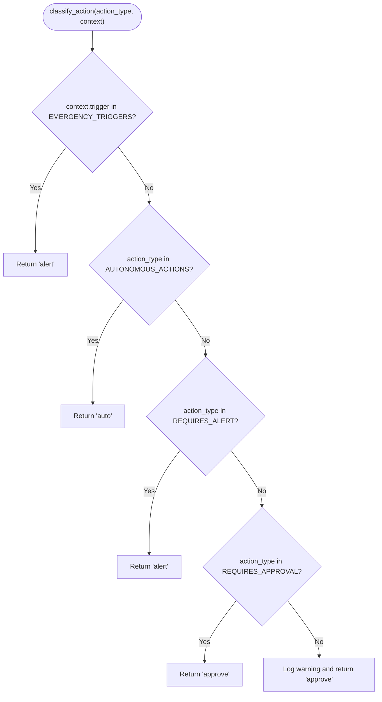
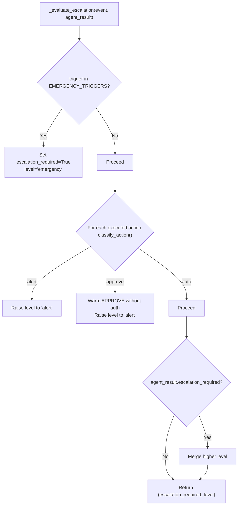
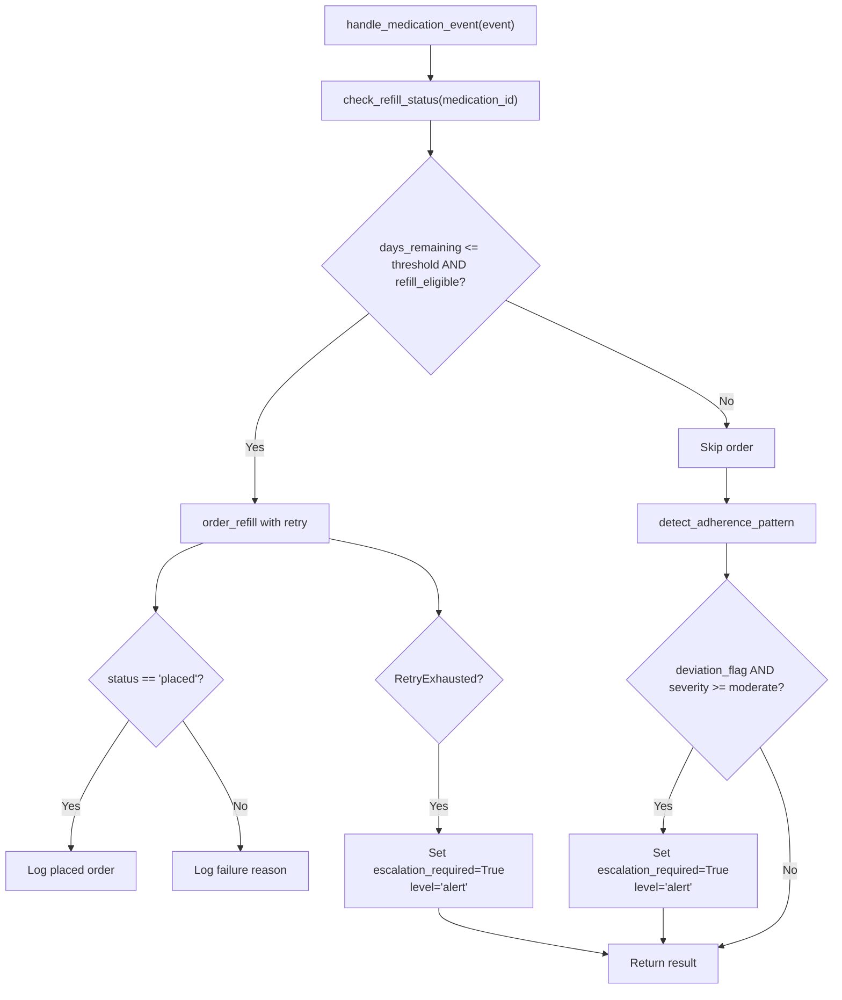
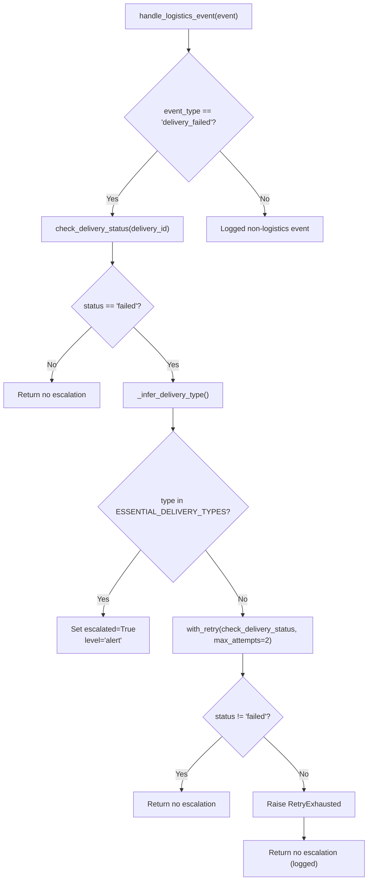
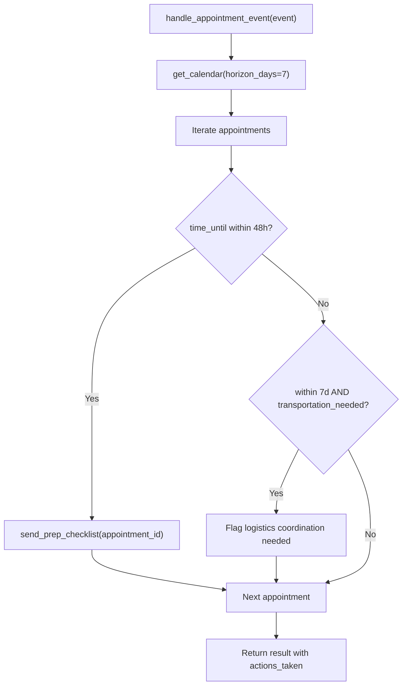
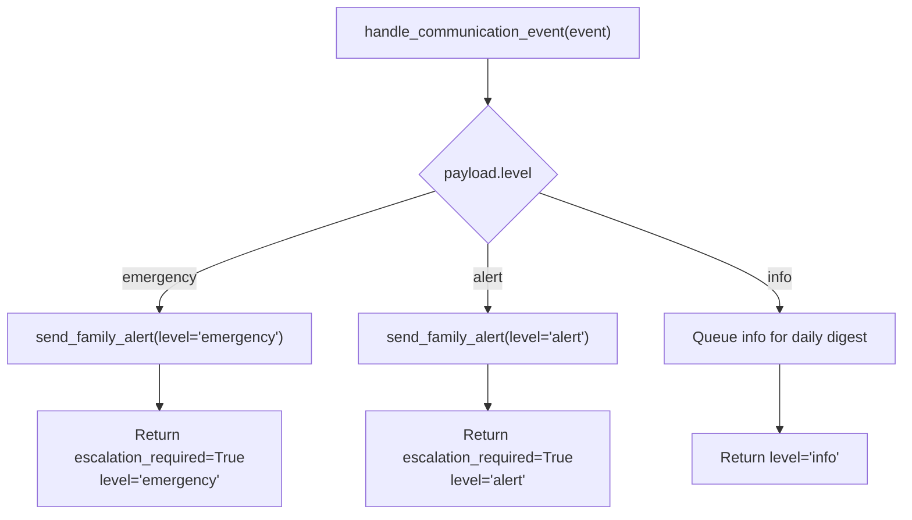
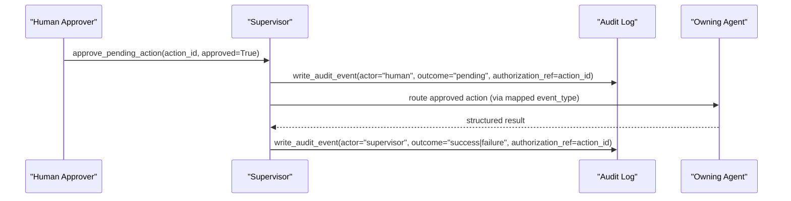
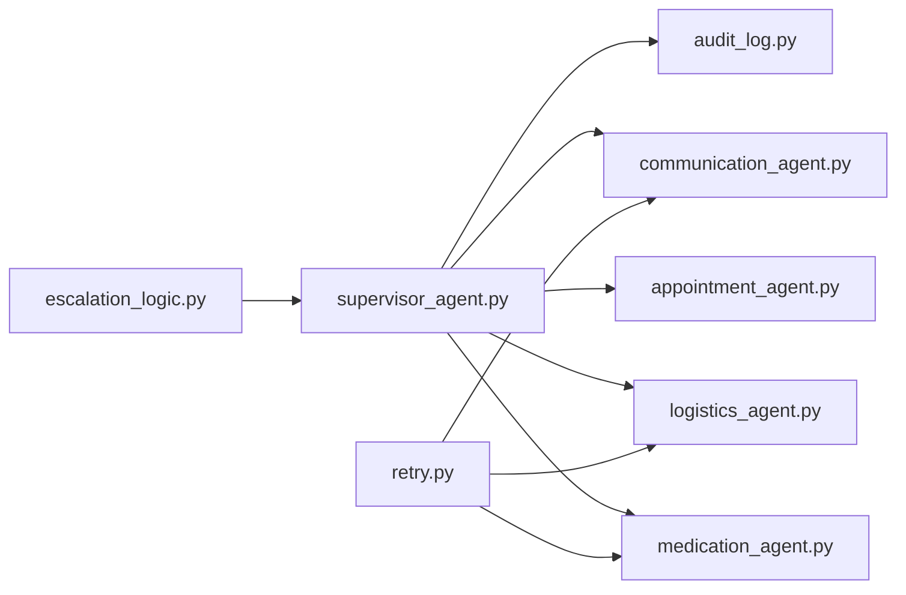

# Escalation Logic

<cite>
**Referenced Files in This Document**
- [escalation_logic.py](file://src/models/escalation_logic.py)
- [schemas.py](file://src/models/schemas.py)
- [supervisor_agent.py](file://src/agents/supervisor_agent.py)
- [medication_agent.py](file://src/agents/medication_agent.py)
- [logistics_agent.py](file://src/agents/logistics_agent.py)
- [appointment_agent.py](file://src/agents/appointment_agent.py)
- [communication_agent.py](file://src/agents/communication_agent.py)
- [audit_log.py](file://src/models/audit_log.py)
- [retry.py](file://src/tools/retry.py)
- [main.py](file://main.py)
- [test_escalation_flow.py](file://tests/integration/test_escalation_flow.py)
- [test_approval_flow.py](file://tests/integration/test_approval_flow.py)
- [AGENTS.md](file://AGENTS.md)
- [SPEC.md](file://SPEC.md)
</cite>

## Table of Contents
1. Introduction
2. Project Structure
3. Core Components
4. Architecture Overview
5. Detailed Component Analysis
6. Dependency Analysis
7. Performance Considerations
8. Troubleshooting Guide
9. Conclusion
10. Appendices

## Introduction
This document explains CareBridge’s deterministic escalation logic system for safety-critical decision making. It covers how actions are classified into auto (automatically executed), alert (informational notifications), and approve (requires human approval), how the rule-based decision matrix evaluates medication dosage changes, appointment scheduling conflicts, delivery failures, and adherence deviations, and how escalation levels map to ResolutionResult escalation_level values (info, alert, emergency). It also documents integration with the PendingAction model for human approval workflows, rationale generation for escalation decisions, guidance for extending rules, and testing approaches to validate correctness.

## Project Structure
CareBridge implements a supervisor-driven orchestration where specialized agents handle domain tasks and the supervisor applies deterministic escalation rules before any action executes. The audit trail is immutable and records every action with rationale and outcome.

**Diagram sources**
- [main.py:92-171](file://main.py#L92-L171)
- [supervisor_agent.py:285-395](file://src/agents/supervisor_agent.py#L285-L395)
- [escalation_logic.py:42-70](file://src/models/escalation_logic.py#L42-L70)
- [audit_log.py:81-128](file://src/models/audit_log.py#L81-L128)

**Section sources**
- [main.py:92-171](file://main.py#L92-L171)
- [supervisor_agent.py:285-395](file://src/agents/supervisor_agent.py#L285-L395)

## Core Components
- Deterministic classification engine: classifies actions as auto, alert, or approve using hardcoded sets and emergency triggers.
- Supervisor escalation evaluator: combines hard-coded emergency triggers, action classification results, and agent-reported escalation flags to determine if escalation is required and at what level.
- Specialized agents: implement domain-specific handling and set escalation flags when necessary (e.g., refill retries exhausted, essential delivery failure, moderate/severe adherence deviation).
- Communication agent: routes alerts by severity (info, alert, emergency) to family members according to preferences.
- Audit trail: immutable log capturing rationale, actor, action_type, outcome, correlation_id, and authorization_ref for approvals.
- Retry utility: standardizes retry behavior across external calls; exhaustion triggers escalation paths.

**Section sources**
- [escalation_logic.py:13-70](file://src/models/escalation_logic.py#L13-L70)
- [supervisor_agent.py:127-234](file://src/agents/supervisor_agent.py#L127-L234)
- [medication_agent.py:23-134](file://src/agents/medication_agent.py#L23-L134)
- [logistics_agent.py:23-152](file://src/agents/logistics_agent.py#L23-L152)
- [communication_agent.py:28-115](file://src/agents/communication_agent.py#L28-L115)
- [audit_log.py:81-128](file://src/models/audit_log.py#L81-L128)
- [retry.py:14-69](file://src/tools/retry.py#L14-L69)

## Architecture Overview
The supervisor orchestrates events, writes an immutable “before action” audit entry, routes to specialized agents, evaluates escalation deterministically, and then either completes or escalates to the communication agent. Approved pending actions are routed back to the owning agent for execution after human approval.

**Diagram sources**
- [supervisor_agent.py:285-395](file://src/agents/supervisor_agent.py#L285-L395)
- [audit_log.py:81-128](file://src/models/audit_log.py#L81-L128)
- [communication_agent.py:28-115](file://src/agents/communication_agent.py#L28-L115)

## Detailed Component Analysis

### Classification Engine
- Purpose: Pure Python function that maps action types to auto, alert, or approve based on hardcoded sets and emergency triggers. Unknown actions default to approve for safety.
- Inputs: action_type string and optional context dict.
- Outputs: Literal "auto", "alert", or "approve".
- Safety: No LLM involvement; deterministic and auditable.

**Diagram sources**
- [escalation_logic.py:42-70](file://src/models/escalation_logic.py#L42-L70)

**Section sources**
- [escalation_logic.py:13-70](file://src/models/escalation_logic.py#L13-L70)

### Supervisor Escalation Evaluator
- Combines three deterministic sources:
  - Hard-coded emergency triggers from event payload.
  - classify_action() applied to actions that actually executed during event handling.
  - Agent-reported escalation flags and levels.
- Uses a severity ranking to raise the escalation level when multiple sources indicate escalation.
- Builds alert messages referencing IDs only (no PII).

**Diagram sources**
- [supervisor_agent.py:178-234](file://src/agents/supervisor_agent.py#L178-L234)

**Section sources**
- [supervisor_agent.py:127-234](file://src/agents/supervisor_agent.py#L127-L234)

### Medication Agent Escalation Rules
- Refill threshold: If days_remaining <= threshold and eligible, attempts order_refill with retry. Exhaustion raises alert-level escalation.
- Adherence deviation: If deviation_flag is True and severity is moderate or severe, triggers alert-level escalation.
- Actions taken include status checks, refill ordering, and adherence analysis.

**Diagram sources**
- [medication_agent.py:23-134](file://src/agents/medication_agent.py#L23-L134)
- [retry.py:22-69](file://src/tools/retry.py#L22-L69)

**Section sources**
- [medication_agent.py:23-134](file://src/agents/medication_agent.py#L23-L134)
- [retry.py:22-69](file://src/tools/retry.py#L22-L69)

### Logistics Agent Escalation Rules
- Essential deliveries (pharmacy, medication, food, grocery): immediate escalation on failure.
- Non-essential deliveries: retry once; if still failed, log warning without escalation.
- Delivery type inferred from fixtures; missing data handled gracefully.

**Diagram sources**
- [logistics_agent.py:182-235](file://src/agents/logistics_agent.py#L182-L235)
- [logistics_agent.py:23-152](file://src/agents/logistics_agent.py#L23-L152)

**Section sources**
- [logistics_agent.py:23-152](file://src/agents/logistics_agent.py#L23-L152)
- [logistics_agent.py:182-235](file://src/agents/logistics_agent.py#L182-L235)

### Appointment Agent Handling
- Retrieves calendar within horizon and evaluates upcoming appointments.
- Within 48 hours: sends prep checklist via communication tools.
- Within 7 days and transportation_needed: flags logistics coordination need.
- Does not escalate directly; outcomes are captured in actions_taken.

**Diagram sources**
- [appointment_agent.py:74-172](file://src/agents/appointment_agent.py#L74-L172)

**Section sources**
- [appointment_agent.py:74-172](file://src/agents/appointment_agent.py#L74-L172)

### Communication Agent Alert Routing
- Routes alerts by level:
  - Emergency: notify all family members via SMS/email/calls.
  - Alert: SMS to primary caregiver, email to others.
  - Info: batch into daily digest unless urgent.
- Uses retry utility; failures are logged and escalated appropriately.

**Diagram sources**
- [communication_agent.py:28-115](file://src/agents/communication_agent.py#L28-L115)

**Section sources**
- [communication_agent.py:28-115](file://src/agents/communication_agent.py#L28-L115)

### Human Approval Workflow Integration
- PendingAction model represents actions awaiting human approval.
- approve_pending_action(action_id, approved) logs human decision, references original action via authorization_ref, and executes approved actions through the owning agent.
- Rejections are logged without execution; approvals are re-dispatched via the appropriate agent event type mapping.

**Diagram sources**
- [supervisor_agent.py:432-592](file://src/agents/supervisor_agent.py#L432-L592)
- [schemas.py:132-139](file://src/models/schemas.py#L132-L139)
- [audit_log.py:81-128](file://src/models/audit_log.py#L81-L128)

**Section sources**
- [supervisor_agent.py:432-592](file://src/agents/supervisor_agent.py#L432-L592)
- [schemas.py:132-139](file://src/models/schemas.py#L132-L139)

### Rationale Generation System
- Every audit event includes a rationale field explaining why the action was taken.
- Supervisor builds alert messages referencing IDs only (no PII).
- Agents append descriptive actions_taken strings summarizing steps and outcomes.
- Approval flow captures human rationale and links to original action via authorization_ref.

**Section sources**
- [audit_log.py:81-128](file://src/models/audit_log.py#L81-L128)
- [supervisor_agent.py:237-256](file://src/agents/supervisor_agent.py#L237-L256)
- [supervisor_agent.py:494-506](file://src/agents/supervisor_agent.py#L494-L506)

### Mapping Escalation Levels to ResolutionResult
- ResolutionResult escalation_level values:
  - info: routine updates, batched into daily digest.
  - alert: informational notifications requiring attention (e.g., refill orders, essential delivery failures, adherence deviations).
  - emergency: critical events requiring immediate multi-channel notification (e.g., fall detection, ER visit, critical medication interaction).
- Supervisor elevates levels using a severity ranking when multiple sources indicate escalation.

**Section sources**
- [schemas.py:64-70](file://src/models/schemas.py#L64-L70)
- [supervisor_agent.py:127-145](file://src/agents/supervisor_agent.py#L127-L145)
- [AGENTS.md:130-151](file://AGENTS.md#L130-L151)

### Scenario Examples and Automated Responses
- Medication refill low:
  - Auto: check_refill_status.
  - Alert: order_refill attempted; if exhausted, escalate to alert-level family notification.
  - Approve: change_medication_schedule requires human approval before execution.
- Appointment scheduling conflict:
  - Auto: get_calendar.
  - Alert: schedule_appointment may require alert-level notification depending on context.
  - Approve: cancel_appointment requires human approval.
- Delivery failure:
  - Auto: check_delivery_status.
  - Alert: essential delivery failure triggers immediate alert-level family notification.
  - Approve: modify_health_record requires human approval.
- Adherence deviation:
  - Auto: detect_adherence_pattern.
  - Alert: moderate/severe deviation triggers alert-level family notification.
  - Approve: add_service_provider requires human approval.

**Section sources**
- [medication_agent.py:23-134](file://src/agents/medication_agent.py#L23-L134)
- [logistics_agent.py:23-152](file://src/agents/logistics_agent.py#L23-L152)
- [appointment_agent.py:74-172](file://src/agents/appointment_agent.py#L74-L172)
- [communication_agent.py:28-115](file://src/agents/communication_agent.py#L28-L115)

### Extending Escalation Rules and Customizing Decision Criteria
- Add new action types to the appropriate set in the classification engine:
  - AUTONOMOUS_ACTIONS for auto-executed operations.
  - REQUIRES_ALERT for operations that should trigger informational notifications.
  - REQUIRES_APPROVAL for operations requiring explicit human authorization.
- Extend EMERGENCY_TRIGGERS for new critical signals that must escalate to emergency level.
- Update agent-specific escalation flags where domain logic determines severity (e.g., new adherence thresholds or delivery categories).
- Ensure audit rationale clearly explains the decision path and link to authorization_ref for approvals.

**Section sources**
- [escalation_logic.py:13-70](file://src/models/escalation_logic.py#L13-L70)
- [AGENTS.md:130-151](file://AGENTS.md#L130-L151)

### Testing Approaches for Escalation Logic Correctness
- Unit tests:
  - Validate classify_action returns correct categories for known and unknown actions.
  - Verify emergency triggers force at least alert-level escalation.
- Integration tests:
  - End-to-end flows: refill_low → order_refill → RetryExhausted → escalation to communication agent.
  - Delivery failure: essential delivery failure triggers alert-level escalation and family notification.
  - Adherence deviation: moderate/severe deviation triggers alert-level escalation.
  - Approval flow: create pending action → approve → execute → verify audit trail entries with authorization_ref.
- Audit immutability:
  - Attempt UPDATE/DELETE on audit_events and expect exceptions due to triggers.
- Mocking:
  - Use fixtures for medications, appointments, delivery history, and family members.
  - Mock external APIs to simulate failures and retries.

**Section sources**
- [test_escalation_flow.py:13-96](file://tests/integration/test_escalation_flow.py#L13-L96)
- [test_approval_flow.py:12-129](file://tests/integration/test_approval_flow.py#L12-L129)
- [audit_log.py:19-78](file://src/models/audit_log.py#L19-L78)
- [AGENTS.md:178-185](file://AGENTS.md#L178-L185)

## Dependency Analysis
The escalation system depends on clear boundaries between agents and centralized deterministic logic.

**Diagram sources**
- [escalation_logic.py:42-70](file://src/models/escalation_logic.py#L42-L70)
- [supervisor_agent.py:285-395](file://src/agents/supervisor_agent.py#L285-L395)
- [medication_agent.py:23-134](file://src/agents/medication_agent.py#L23-L134)
- [logistics_agent.py:182-235](file://src/agents/logistics_agent.py#L182-L235)
- [communication_agent.py:28-115](file://src/agents/communication_agent.py#L28-L115)
- [audit_log.py:81-128](file://src/models/audit_log.py#L81-L128)
- [retry.py:22-69](file://src/tools/retry.py#L22-L69)

**Section sources**
- [supervisor_agent.py:285-395](file://src/agents/supervisor_agent.py#L285-L395)
- [AGENTS.md:8-21](file://AGENTS.md#L8-L21)

## Performance Considerations
- Deterministic classification avoids LLM latency and ensures consistent decisions.
- Retry utility uses exponential backoff to reduce transient failures while bounding total wait time.
- Audit writes occur before execution to maintain consistency; batching or async writes could be considered for high-throughput scenarios.
- Communication agent queues info-level events into daily digests to minimize noise and optimize messaging costs.

[No sources needed since this section provides general guidance]

## Troubleshooting Guide
- Missing medication_id in medication event: returns error actions and no escalation.
- Delivery not found: logs failure and escalates to alert.
- External API failures: use with_retry; on exhaustion, escalate with alert or emergency depending on context.
- Approval not found or already resolved: raises ValueError to prevent duplicate processing.
- Family alert dispatch failure: logs error and includes failure in actions_taken; never silently fail.

**Section sources**
- [medication_agent.py:43-71](file://src/agents/medication_agent.py#L43-L71)
- [logistics_agent.py:41-60](file://src/agents/logistics_agent.py#L41-L60)
- [retry.py:22-69](file://src/tools/retry.py#L22-L69)
- [supervisor_agent.py:448-461](file://src/agents/supervisor_agent.py#L448-L461)
- [supervisor_agent.py:356-365](file://src/agents/supervisor_agent.py#L356-L365)

## Conclusion
CareBridge’s escalation logic is designed for safety-critical care coordination with deterministic classification, robust audit trails, and clear human oversight for sensitive actions. The system integrates specialized agents with a central supervisor that enforces escalation rules, generates rationale, and routes alerts appropriately. Extensibility is supported through configurable action sets and emergency triggers, while comprehensive testing ensures correctness and reliability.

[No sources needed since this section summarizes without analyzing specific files]

## Appendices

### Data Models Reference
- ResolutionResult: encapsulates resolution status, actions taken, escalation flags, and audit event IDs.
- PendingAction: models human-pending actions with rationale, requested_at, status, and authorization_ref.
- CareEvent: carries event_type, care_recipient_id, and payload for routing and processing.

**Section sources**
- [schemas.py:56-70](file://src/models/schemas.py#L56-L70)
- [schemas.py:132-139](file://src/models/schemas.py#L132-L139)

### Rule-Based Decision Matrix Summary
- Auto: check_refill_status, check_delivery_status, get_calendar, synthesize_status, send_daily_digest.
- Alert: order_refill, order_grocery, schedule_appointment, order_pharmacy_delivery.
- Approve: cancel_appointment, change_medication_schedule, add_service_provider, modify_health_record.
- Emergency triggers: fall_detection, emergency_room_visit, critical_medication_interaction.

**Section sources**
- [escalation_logic.py:13-39](file://src/models/escalation_logic.py#L13-L39)
- [AGENTS.md:130-151](file://AGENTS.md#L130-L151)