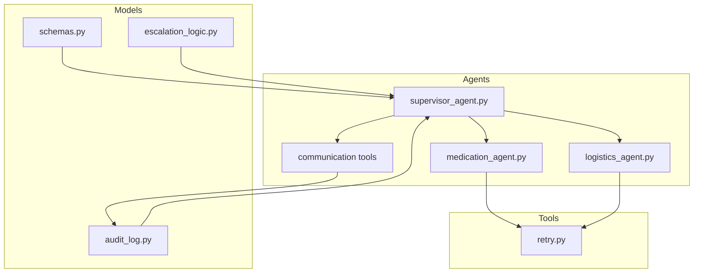
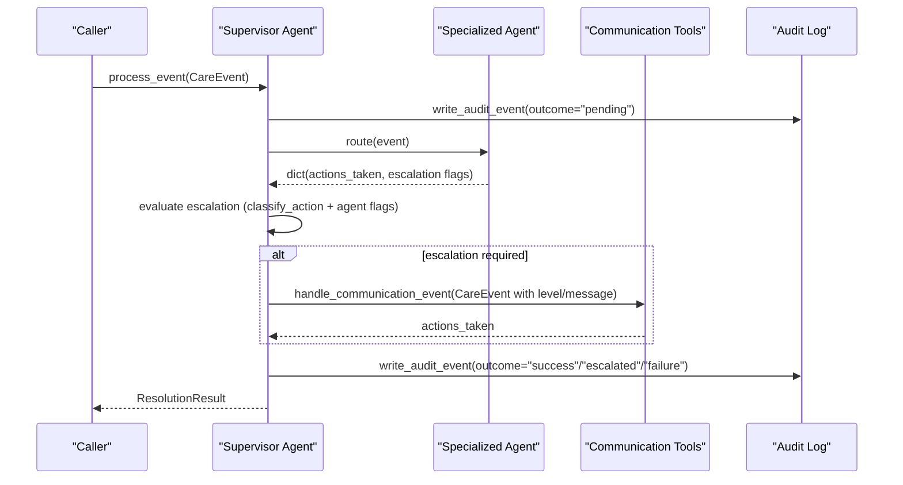
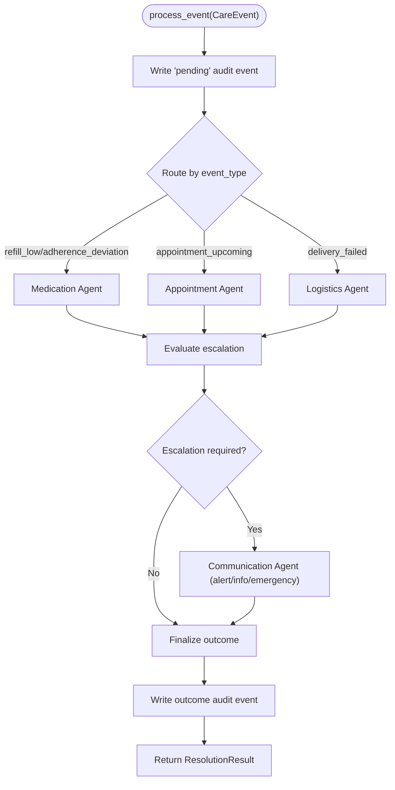
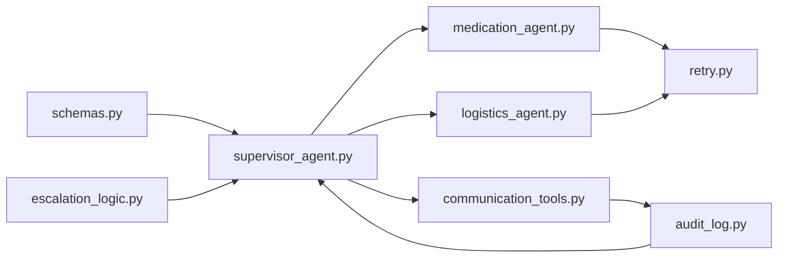

# Event Processing Models

<cite>
**Referenced Files in This Document**
- [schemas.py](file://src/models/schemas.py)
- [supervisor_agent.py](file://src/agents/supervisor_agent.py)
- [escalation_logic.py](file://src/models/escalation_logic.py)
- [audit_log.py](file://src/models/audit_log.py)
- [retry.py](file://src/tools/retry.py)
- [medication_agent.py](file://src/agents/medication_agent.py)
- [logistics_agent.py](file://src/agents/logistics_agent.py)
- [communication_tools.py](file://src/tools/communication_tools.py)
- [test_supervisor.py](file://tests/test_supervisor.py)
- [test_refill_flow.py](file://tests/integration/test_refill_flow.py)
- [test_escalation_flow.py](file://tests/integration/test_escalation_flow.py)
</cite>

## Table of Contents
1. [Introduction](#introduction)
2. [Project Structure](#project-structure)
3. [Core Components](#core-components)
4. [Architecture Overview](#architecture-overview)
5. [Detailed Component Analysis](#detailed-component-analysis)
6. [Dependency Analysis](#dependency-analysis)
7. [Performance Considerations](#performance-considerations)
8. [Troubleshooting Guide](#troubleshooting-guide)
9. [Conclusion](#conclusion)
10. [Appendices](#appendices)

## Introduction
This document explains CareBridge’s event processing models and flows with a focus on the input/output data structures used by the multi-agent system. It covers:
- The CareEvent model (event_id, event_type enumeration, care_recipient_id, payload, received_at).
- The ResolutionResult model (resolved status, actions_taken, escalation_required, escalation_level, audit_event_ids).
- The StatusSummary model that aggregates recent events and pending actions for status queries.
- How events flow through the supervisor agent to specialized agents and how results are aggregated.
- Error handling patterns, event validation, retry mechanisms, and guidance for extending the system with new event types and resolution strategies.

## Project Structure
CareBridge organizes event processing around a central supervisor that routes events to specialized agents (Medication, Appointment, Logistics, Communication). Data contracts between components are defined as Pydantic models. Auditability is enforced via an immutable SQLite audit log. External calls use a shared retry utility.

**Diagram sources**
- [schemas.py:56-71](file://src/models/schemas.py#L56-L71)
- [supervisor_agent.py:21-39](file://src/agents/supervisor_agent.py#L21-L39)
- [escalation_logic.py:13-39](file://src/models/escalation_logic.py#L13-L39)
- [audit_log.py:19-78](file://src/models/audit_log.py#L19-L78)
- [retry.py:22-69](file://src/tools/retry.py#L22-L69)
- [medication_agent.py:9-16](file://src/agents/medication_agent.py#L9-L16)
- [logistics_agent.py:11-15](file://src/agents/logistics_agent.py#L11-L15)
- [communication_tools.py:14-24](file://src/tools/communication_tools.py#L14-L24)

**Section sources**
- [schemas.py:56-71](file://src/models/schemas.py#L56-L71)
- [supervisor_agent.py:21-39](file://src/agents/supervisor_agent.py#L21-L39)
- [escalation_logic.py:13-39](file://src/models/escalation_logic.py#L13-L39)
- [audit_log.py:19-78](file://src/models/audit_log.py#L19-L78)
- [retry.py:22-69](file://src/tools/retry.py#L22-L69)
- [medication_agent.py:9-16](file://src/agents/medication_agent.py#L9-L16)
- [logistics_agent.py:11-15](file://src/agents/logistics_agent.py#L11-L15)
- [communication_tools.py:14-24](file://src/tools/communication_tools.py#L14-L24)

## Core Components
This section documents the primary data models used across the system.

- CareEvent
  - Fields:
    - event_id: unique identifier for the event.
    - event_type: one of refill_low, appointment_upcoming, delivery_failed, adherence_deviation.
    - care_recipient_id: identifier of the care recipient.
    - payload: structured context for the event (e.g., medication_id, delivery_id).
    - received_at: timestamp when the event was created.
  - Purpose: canonical input contract for all care events entering the system.

- ResolutionResult
  - Fields:
    - event_id: links result to the originating event.
    - resolved: boolean indicating whether the event was fully processed.
    - actions_taken: list of human-readable action descriptions executed during processing.
    - escalation_required: boolean flag indicating if escalation occurred.
    - escalation_level: optional severity level among info, alert, emergency.
    - audit_event_ids: list of audit event IDs produced while processing this event.
  - Purpose: canonical output contract from process_event() summarizing outcomes and audit linkage.

- StatusSummary
  - Fields:
    - care_recipient_id: the recipient being summarized.
    - summary_text: human-readable narrative of current status.
    - recent_events: list of recent AuditEvent entries for context.
    - pending_actions: list of PendingAction entries awaiting resolution.
  - Purpose: read-only aggregation used by query_status() to answer caregiver questions.

Additional supporting models include AuditEvent, PendingAction, RefillStatus, RefillOrder, AdherencePattern, DeliveryStatus, DeliveryOrder, AlertResult, FamilyMember, and FamilyPreferences, which are used throughout agents and tools to structure domain data.

**Section sources**
- [schemas.py:44-71](file://src/models/schemas.py#L44-L71)
- [schemas.py:125-139](file://src/models/schemas.py#L125-L139)

## Architecture Overview
The supervisor agent is the single entry point for care events. It writes an initial “pending” audit event before routing, then routes to the appropriate specialized agent based on event_type. After agent execution, it evaluates escalation deterministically using classification rules and agent-reported flags. If escalation is required, it creates a communication event to notify family members. Finally, it writes a follow-up audit event with the final outcome and returns a ResolutionResult.

**Diagram sources**
- [supervisor_agent.py:285-395](file://src/agents/supervisor_agent.py#L285-L395)
- [escalation_logic.py:42-70](file://src/models/escalation_logic.py#L42-L70)
- [audit_log.py:81-128](file://src/models/audit_log.py#L81-L128)
- [communication_tools.py:54-157](file://src/tools/communication_tools.py#L54-L157)

## Detailed Component Analysis

### CareEvent Model
- event_id: auto-generated UUID; ensures uniqueness per event.
- event_type: constrained to four values to enforce deterministic routing:
  - refill_low: medication refill checks/orders.
  - appointment_upcoming: scheduling-related tasks.
  - delivery_failed: logistics failure handling.
  - adherence_deviation: medication adherence analysis and alerts.
- care_recipient_id: ties the event to a specific individual.
- payload: flexible dictionary carrying event-specific context (e.g., medication_id, delivery_id).
- received_at: creation timestamp for ordering and auditing.

Validation and usage:
- The schema enforces event_type constraints at construction time.
- Agents validate payload fields (e.g., medication_id presence) and return error actions when missing or invalid.

Examples of event creation:
- Medication refill low: create a CareEvent with event_type "refill_low" and payload containing medication_id.
- Delivery failure: create a CareEvent with event_type "delivery_failed" and payload containing delivery_id.
- Adherence deviation: create a CareEvent with event_type "adherence_deviation" and payload containing medication_id.

**Section sources**
- [schemas.py:56-62](file://src/models/schemas.py#L56-L62)
- [medication_agent.py:43-51](file://src/agents/medication_agent.py#L43-L51)
- [test_refill_flow.py:23-27](file://tests/integration/test_refill_flow.py#L23-L27)
- [test_escalation_flow.py:25-29](file://tests/integration/test_escalation_flow.py#L25-L29)

### ResolutionResult Model
- event_id: links back to the original CareEvent.
- resolved: indicates successful completion of processing.
- actions_taken: descriptive list of actions executed (including errors when applicable).
- escalation_required: true when escalation logic determined further attention is needed.
- escalation_level: optional severity among info, alert, emergency.
- audit_event_ids: list of audit event IDs generated during processing for traceability.

Usage:
- Returned by process_event() after routing, escalation evaluation, and optional communication dispatch.
- Used by tests to assert outcomes such as escalation_required and presence of alert-related actions.

Example result characteristics:
- Successful non-escalated event: resolved=True, escalation_required=False.
- Escalated event: escalation_required=True, escalation_level set, actions_taken includes communication actions.
- Routing failure: resolved=False, actions_taken includes error description.

**Section sources**
- [schemas.py:64-71](file://src/models/schemas.py#L64-L71)
- [supervisor_agent.py:318-395](file://src/agents/supervisor_agent.py#L318-L395)
- [test_supervisor.py:67-115](file://tests/test_supervisor.py#L67-L115)
- [test_escalation_flow.py:16-54](file://tests/integration/test_escalation_flow.py#L16-L54)

### StatusSummary Model
- care_recipient_id: identifies the subject of the summary.
- summary_text: concise narrative describing recent activity and pending items.
- recent_events: list of AuditEvent objects representing recent audit trail entries.
- pending_actions: list of PendingAction objects derived from audit events with outcome "pending".

Usage:
- Produced by synthesize_status() to answer caregiver questions about a recipient’s current state.
- Aggregates audit events and transforms them into structured models for consumption by callers.

Example behavior:
- When there are recent events, summary_text references the last action and its outcome.
- When pending actions exist, summary_text notes the count of pending items awaiting resolution.

**Section sources**
- [schemas.py:125-139](file://src/models/schemas.py#L125-L139)
- [communication_tools.py:160-231](file://src/tools/communication_tools.py#L160-L231)
- [supervisor_agent.py:398-429](file://src/agents/supervisor_agent.py#L398-L429)

### Event Flow Through Supervisor to Specialized Agents
Routing:
- refill_low and adherence_deviation → Medication Agent.
- appointment_upcoming → Appointment Agent.
- delivery_failed → Logistics Agent.

Escalation decision:
- Deterministic classification via classify_action() on executed actions.
- Hard-coded emergency triggers escalate to emergency/alert.
- Agent-reported escalation flags can raise severity.

Communication dispatch:
- On escalation, a new CareEvent is constructed with level and message, routed to Communication Agent.

Audit-first pattern:
- Before any action, a pending audit event is written.
- After processing, a follow-up audit event records success, escalation, or failure.

**Diagram sources**
- [supervisor_agent.py:259-395](file://src/agents/supervisor_agent.py#L259-L395)
- [escalation_logic.py:42-70](file://src/models/escalation_logic.py#L42-L70)
- [audit_log.py:81-128](file://src/models/audit_log.py#L81-L128)

**Section sources**
- [supervisor_agent.py:259-395](file://src/agents/supervisor_agent.py#L259-L395)
- [escalation_logic.py:42-70](file://src/models/escalation_logic.py#L42-L70)

### Error Handling Patterns
- Routing failures: caught and recorded as failure audit events; ResolutionResult reflects error in actions_taken.
- Agent-level errors: agents catch exceptions, log details, and return structured error actions without crashing the pipeline.
- Retry exhaustion: external API calls wrapped with with_retry(); RetryExhausted propagates up to trigger escalation paths.
- Communication failures: fallback logs alert failures visibly in result and audit trail; never silently fail.

Retry mechanism:
- with_retry() performs up to three attempts with exponential backoff (1s, 2s, 4s).
- Raises RetryExhausted with the last exception when all attempts fail.

Examples:
- Medication refill order uses with_retry(order_refill, ...); on RetryExhausted, sets escalation_required and escalation_level="alert".
- Logistics non-essential delivery retries once; on persistent failure, logs warning and continues without escalation unless essential.

**Section sources**
- [retry.py:22-69](file://src/tools/retry.py#L22-L69)
- [medication_agent.py:73-100](file://src/agents/medication_agent.py#L73-L100)
- [logistics_agent.py:102-152](file://src/agents/logistics_agent.py#L102-L152)
- [supervisor_agent.py:318-366](file://src/agents/supervisor_agent.py#L318-L366)

### Event Validation
- Schema-level validation: CareEvent.event_type is constrained to four literals; invalid types cause construction-time validation errors.
- Payload validation: agents check required fields (e.g., medication_id) and return error actions when missing.
- Audit integrity: audit log prevents updates/deletes via database triggers; ensures immutability.

**Section sources**
- [schemas.py:56-62](file://src/models/schemas.py#L56-L62)
- [medication_agent.py:43-51](file://src/agents/medication_agent.py#L43-L51)
- [audit_log.py:46-75](file://src/models/audit_log.py#L46-L75)

### Extending the System
Adding a new event type:
- Update CareEvent.event_type literal to include the new type.
- Add routing in supervisor_agent._route_to_agent() to map the new event_type to a handler.
- Implement or extend the specialized agent to handle the new event semantics.
- Optionally add new action types and update escalation_logic classification sets if the new actions require alert/approval.
- Ensure audit logging and retry usage where external APIs are involved.

Adding a new resolution strategy:
- Introduce new action types in escalation_logic sets (AUTONOMOUS_ACTIONS, REQUIRES_ALERT, REQUIRES_APPROVAL).
- Extend supervisor_agent._executed_actions() to map event/agent results to action names for classification.
- Update approval routing tables (_APPROVAL_AGENT_ROUTES) and re-dispatch mapping (_AGENT_EVENT_TYPES) if needed.
- Add tests to verify classification, routing, escalation, and audit trail completeness.

**Section sources**
- [schemas.py:56-62](file://src/models/schemas.py#L56-L62)
- [supervisor_agent.py:67-104](file://src/agents/supervisor_agent.py#L67-L104)
- [supervisor_agent.py:148-175](file://src/agents/supervisor_agent.py#L148-L175)
- [escalation_logic.py:13-39](file://src/models/escalation_logic.py#L13-L39)
- [test_supervisor.py:19-56](file://tests/test_supervisor.py#L19-L56)

## Dependency Analysis
Key dependencies and relationships:
- schemas.py defines core models used across agents and tools.
- supervisor_agent.py depends on escalation_logic.py for deterministic classification and on audit_log.py for immutable audit trails.
- Specialized agents depend on tools (medication_tools, logistics_tools, communication_tools) and the retry utility.
- communication_tools.py consumes audit_log.py and produces StatusSummary aggregations.

**Diagram sources**
- [schemas.py:56-71](file://src/models/schemas.py#L56-L71)
- [supervisor_agent.py:21-39](file://src/agents/supervisor_agent.py#L21-L39)
- [escalation_logic.py:42-70](file://src/models/escalation_logic.py#L42-L70)
- [audit_log.py:81-128](file://src/models/audit_log.py#L81-L128)
- [medication_agent.py:9-16](file://src/agents/medication_agent.py#L9-L16)
- [logistics_agent.py:11-15](file://src/agents/logistics_agent.py#L11-L15)
- [communication_tools.py:14-24](file://src/tools/communication_tools.py#L14-L24)
- [retry.py:22-69](file://src/tools/retry.py#L22-L69)

**Section sources**
- [supervisor_agent.py:21-39](file://src/agents/supervisor_agent.py#L21-L39)
- [medication_agent.py:9-16](file://src/agents/medication_agent.py#L9-L16)
- [logistics_agent.py:11-15](file://src/agents/logistics_agent.py#L11-L15)
- [communication_tools.py:14-24](file://src/tools/communication_tools.py#L14-L24)
- [retry.py:22-69](file://src/tools/retry.py#L22-L69)

## Performance Considerations
- Deterministic routing and classification avoid LLM overhead for critical decisions, ensuring predictable performance.
- Retry with exponential backoff reduces transient failures impact while bounding total latency.
- Audit-first pattern adds minimal overhead but provides strong observability and compliance guarantees.
- Status synthesis reads from a local SQLite database; consider indexing and pagination for large datasets.

[No sources needed since this section provides general guidance]

## Troubleshooting Guide
Common issues and resolutions:
- Missing payload fields: agents return error actions; ensure payloads include required keys (e.g., medication_id).
- Routing failures: supervisor catches exceptions and records failure audit events; inspect actions_taken for error messages.
- Retry exhaustion: external API failures propagate as RetryExhausted; escalation paths will be triggered; review logs for last_exception details.
- Audit immutability: attempts to update/delete audit events raise integrity errors; rely on append-only writes.

Diagnostic steps:
- Inspect ResolutionResult.actions_taken for error descriptions.
- Query audit events by care_recipient_id or correlation_id to trace the full lifecycle.
- Verify escalation levels and communication dispatch when escalation_required is True.

**Section sources**
- [medication_agent.py:43-51](file://src/agents/medication_agent.py#L43-L51)
- [supervisor_agent.py:318-366](file://src/agents/supervisor_agent.py#L318-L366)
- [retry.py:22-69](file://src/tools/retry.py#L22-L69)
- [audit_log.py:46-75](file://src/models/audit_log.py#L46-L75)
- [test_supervisor.py:223-275](file://tests/test_supervisor.py#L223-L275)

## Conclusion
CareBridge’s event processing relies on strict data contracts (CareEvent, ResolutionResult, StatusSummary), deterministic routing and escalation, and an immutable audit trail. The supervisor orchestrates specialized agents, applies safety-critical classification rules, and ensures family notifications when necessary. Retry mechanisms and comprehensive error handling make the system robust against transient failures. Extensibility is supported through schema constraints, classification sets, and routing tables, enabling safe addition of new event types and resolution strategies.

[No sources needed since this section summarizes without analyzing specific files]

## Appendices

### Example Event Creation and Processing Flows
- Create a refill_low event with medication_id and process through supervisor; expect medication agent actions and potential escalation if order_refill requires alert.
- Create a delivery_failed event with delivery_id; expect logistics agent handling, possible escalation for essential deliveries, and communication dispatch.
- Create an adherence_deviation event with medication_id; expect adherence analysis and escalation if moderate/severe deviation detected.

**Section sources**
- [test_refill_flow.py:14-47](file://tests/integration/test_refill_flow.py#L14-L47)
- [test_escalation_flow.py:16-54](file://tests/integration/test_escalation_flow.py#L16-L54)
- [test_escalation_flow.py:56-81](file://tests/integration/test_escalation_flow.py#L56-L81)
- [test_escalation_flow.py:83-97](file://tests/integration/test_escalation_flow.py#L83-L97)