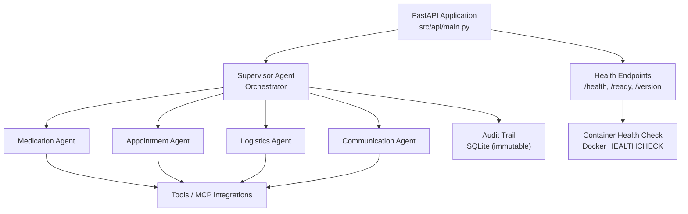
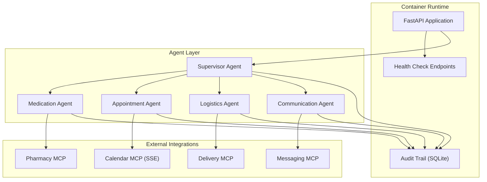
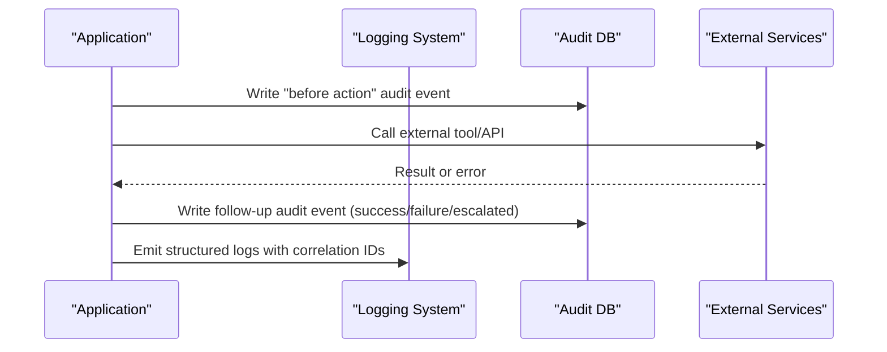
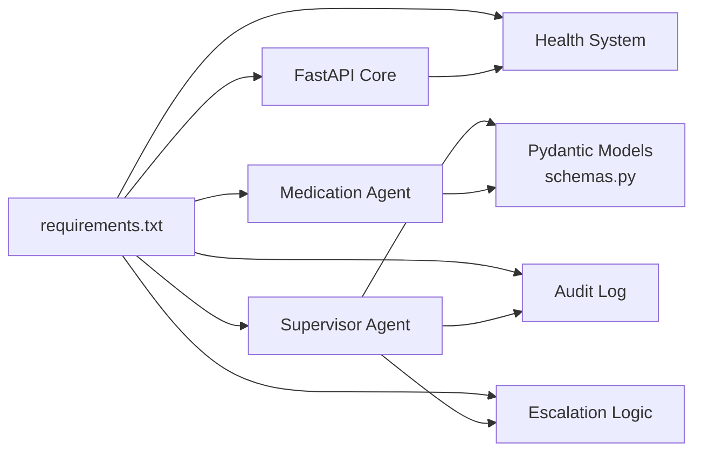

# Deployment Guide

<cite>
**Referenced Files in This Document**
- [Dockerfile](file://Dockerfile)
- [docker-compose.yml](file://docker-compose.yml)
- [.env.example](file://.env.example)
- [.env](file://.env)
- [.dockerignore](file://.dockerignore)
- [src/api/main.py](file://src/api/main.py)
- [src/api/config.py](file://src/api/config.py)
- [src/api/firebase_auth.py](file://src/api/firebase_auth.py)
- [src/api/routers/health.py](file://src/api/routers/health.py)
- [requirements.txt](file://requirements.txt)
- [SPEC.md](file://SPEC.md)
- [architecture.md](file://architecture.md)
- [src/models/audit_log.py](file://src/models/audit_log.py)
- [src/models/schemas.py](file://src/models/schemas.py)
- [src/models/escalation_logic.py](file://src/models/escalation_logic.py)
- [src/agents/supervisor_agent.py](file://src/agents/supervisor_agent.py)
- [src/agents/medication_agent.py](file://src/agents/medication_agent.py)
</cite>

## Update Summary
**Changes Made**
- Added comprehensive Docker containerization support with multi-stage builds and health checks
- Enhanced production deployment configuration with environment variable management
- Integrated health check endpoints for liveness, readiness, and version information
- Updated container orchestration with docker-compose for simplified deployment
- Added security hardening with non-root user execution and proper file permissions
- **Updated Firebase authentication to support cloud deployment scenarios with FIREBASE_CREDENTIALS_JSON environment variable**

## Table of Contents
1. Introduction
2. Project Structure
3. Core Components
4. Architecture Overview
5. Detailed Component Analysis
6. Dependency Analysis
7. Performance Considerations
8. Troubleshooting Guide
9. Conclusion
10. Appendices

## Introduction
This guide provides production deployment and operational guidance for CareBridge, an AI-powered care coordination system. It covers environment setup, configuration management, containerization, cloud deployment considerations using Boto3, scaling strategies, monitoring and logging, security, disaster recovery, health checks, and upgrade procedures. The goal is to help operators run CareBridge reliably in production while maintaining safety, auditability, and observability.

## Project Structure
CareBridge is a Python application with:
- A FastAPI-based REST API with comprehensive health check endpoints
- Agent-based orchestration via a Supervisor that routes events to specialized agents (Medication, Appointment, Logistics, Communication)
- An immutable SQLite audit trail used for compliance and traceability
- Pydantic v2 models for structured data exchange between components
- Deterministic escalation logic to ensure safety-critical decisions are not LLM-driven
- Complete Docker containerization support with multi-stage builds and health monitoring



**Diagram sources**
- [src/api/main.py:77-125](file://src/api/main.py#L77-L125)
- [src/api/routers/health.py:75-143](file://src/api/routers/health.py#L75-L143)
- [Dockerfile:65-68](file://Dockerfile#L65-L68)

**Section sources**
- [src/api/main.py:1-125](file://src/api/main.py#L1-L125)
- [architecture.md:329-370](file://architecture.md#L329-L370)

## Core Components
- **FastAPI Application**: Modern REST API with middleware for CORS, rate limiting, request ID tracking, and comprehensive exception handling
- **Health Check System**: Dedicated endpoints for liveness (`/health`), readiness (`/ready`), and version information (`/version`)
- **Configuration Management**: Pydantic Settings with environment variable validation and guardrails for production security
- **Supervisor Agent**: Routes events deterministically, enforces escalation rules, writes audit events before actions, and coordinates communication alerts when needed
- **Medication Agent**: Checks refill status, orders refills with retries, detects adherence deviations, and escalates as required
- **Audit Trail**: Immutable SQLite database with triggers preventing updates/deletes; every action is recorded with rationale and outcome
- **Schemas**: Pydantic v2 models define strict contracts for all inter-component data
- **Escalation Logic**: Pure Python classification into auto/alert/approve categories for safety-critical decisions

**Section sources**
- [src/api/main.py:39-75](file://src/api/main.py#L39-L75)
- [src/api/routers/health.py:75-143](file://src/api/routers/health.py#L75-L143)
- [src/api/config.py:48-358](file://src/api/config.py#L48-L358)
- [src/agents/supervisor_agent.py:285-395](file://src/agents/supervisor_agent.py#L285-L395)
- [src/agents/medication_agent.py:23-134](file://src/agents/medication_agent.py#L23-L134)
- [src/models/audit_log.py:19-78](file://src/models/audit_log.py#L19-L78)
- [src/models/schemas.py:56-70](file://src/models/schemas.py#L56-L70)
- [src/models/escalation_logic.py:42-70](file://src/models/escalation_logic.py#L42-L70)

## Architecture Overview
The system uses an agent-as-tools pattern where the Supervisor delegates tasks to specialized agents. All external interactions go through tools/MCP integrations, and every action is audited before execution. Production targets include Qoder Cloud Agents with managed runtime and identity isolation, while local development uses SQLite and mock integrations.



**Diagram sources**
- [architecture.md:10-75](file://architecture.md#L10-L75)
- [architecture.md:211-261](file://architecture.md#L211-L261)
- [src/api/routers/health.py:75-143](file://src/api/routers/health.py#L75-L143)

**Section sources**
- [architecture.md:10-75](file://architecture.md#L10-L75)
- [architecture.md:211-261](file://architecture.md#L211-L261)

## Detailed Component Analysis

### Environment Setup and Configuration
- **Python version**: Use Python 3.12+ as specified in the Dockerfile for optimal compatibility with modern dependencies
- **Dependencies**: Comprehensive requirements including FastAPI, uvicorn, Pydantic, Strands Agents, and provider-specific SDKs
- **Configuration management**:
  - Environment variables for all secrets and configuration via `.env` files or platform secret managers
  - Pydantic Settings with validation aliases and guardrails for production security
  - Build metadata injection via Docker build arguments (GIT_SHA, BUILD_TIMESTAMP)
  - Demo mode support for development with secure defaults

**Production Configuration Checklist:**
- Set `DEMO_MODE=false` for production deployments
- Configure JWT_SECRET_KEY with minimum 32 bytes
- Set BCRYPT_ROUNDS to 12 or higher
- Configure appropriate CORS_ORIGINS for your frontend domains
- Set up LLM_PROVIDER and corresponding API keys
- Configure database connections (SQLite for dev, PostgreSQL for production)

**Section sources**
- [Dockerfile:10-68](file://Dockerfile#L10-L68)
- [requirements.txt:1-36](file://requirements.txt#L1-L36)
- [src/api/config.py:48-358](file://src/api/config.py#L48-L358)
- [.env.example:1-141](file://.env.example#L1-L141)

### Containerization with Docker
CareBridge includes comprehensive Docker support with multi-stage builds and production-ready configurations:

**Multi-Stage Build Process:**
- **Builder Stage**: Compiles and downloads wheels for all dependencies with build tools
- **Runtime Stage**: Minimal Python slim image with non-root user execution and pre-installed wheels

**Security Features:**
- Non-root user execution (`appuser`)
- Exclusion of secrets, caches, and development artifacts via `.dockerignore`
- No sensitive data baked into images
- Proper file permissions and ownership

**Health Monitoring:**
- Built-in HEALTHCHECK directive checking `/health` endpoint
- Docker Compose integration with service-level health checks
- Graceful restart policies

**Deployment Commands:**
```bash
# Development with Docker Compose
cp .env.example .env
docker compose up --build

# Production build with metadata
docker build --build-arg BUILD_GIT_SHA=$(git rev-parse HEAD) \
             --build-arg BUILD_TIMESTAMP=$(date -u +%Y-%m-%dT%H:%M:%SZ) \
             -t carebridge-api .
```

**Section sources**
- [Dockerfile:1-69](file://Dockerfile#L1-L69)
- [docker-compose.yml:1-34](file://docker-compose.yml#L1-L34)
- [.dockerignore:1-43](file://.dockerignore#L1-L43)

### Health Check Endpoints and Operational Metrics
CareBridge provides comprehensive health monitoring through dedicated endpoints:

**Liveness Probe (`GET /health`):**
- Returns `{"status": "ok"}` when the process is running
- Used by Kubernetes liveness probes and Docker health checks
- No authentication required

**Readiness Probe (`GET /ready`):**
- Verifies core dependencies are available:
  - Audit database connectivity and schema integrity
  - MCP registry loading status
  - LLM provider availability (informational only)
- Returns HTTP 503 with `{"status": "degraded", ...}` if critical dependencies fail
- Includes detailed check results and provider information

**Version Information (`GET /version`):**
- Returns application metadata including app name, version, git SHA, build timestamp, and environment
- Useful for debugging and deployment verification

**Operational Metrics Integration:**
- Structured JSON logging enabled by default
- Request ID tracking for correlation across services
- Rate limiting with configurable thresholds
- Exception handlers that prevent stack trace leakage

**Section sources**
- [src/api/routers/health.py:1-143](file://src/api/routers/health.py#L1-L143)
- [src/api/main.py:95-120](file://src/api/main.py#L95-L120)
- [src/api/config.py:132-144](file://src/api/config.py#L132-L144)

### Cloud Deployment to AWS Using Boto3 Integration
- **Boto3 Integration**: Native support for AWS services including S3 for backups, Secrets Manager for credentials, and CloudWatch for logs/metrics
- **IAM Roles/Policies**: Least privilege access patterns for required operations (read/write audit backups, publish logs, read secrets)
- **Configuration Management**: Store sensitive values in AWS Secrets Manager or Parameter Store; load via Boto3 at runtime
- **Logging Strategy**: Stream logs to CloudWatch Logs with structured JSON format for parsing and analysis
- **Metrics Collection**: Emit custom metrics for event counts, error rates, latency, and business KPIs to CloudWatch Metrics

**AWS-Specific Considerations:**
- Prefer ECS/Fargate or Lambda depending on workload characteristics
- Use VPC networking with private subnets for outbound-only integrations
- Enable encryption at rest for persisted artifacts (audit backups in S3)
- Implement proper IAM role assumptions for cross-service communication

**Section sources**
- [requirements.txt:7](file://requirements.txt#L7)
- [SPEC.md:455-465](file://SPEC.md#L455-L465)
- [src/api/config.py:174-182](file://src/api/config.py#L174-L182)

### Firebase Authentication for Cloud Deployment
CareBridge supports hybrid identity authentication with Firebase, now enhanced for seamless cloud deployment without file system access:

**Firebase Configuration Options:**

**Priority 1: Environment Variable (Cloud Deployment)**
- `FIREBASE_CREDENTIALS_JSON`: Full Firebase service account JSON as a single-line environment variable
- Ideal for containerized environments and platforms that don't support file mounts
- Automatically parsed from JSON string during initialization

**Priority 2: File-Based Configuration (Traditional)**
- `FIREBASE_SERVICE_ACCOUNT_PATH`: Path to service account JSON file
- Falls back to file-based configuration when environment variable is not set
- Maintains backward compatibility with existing deployments

**Cloud Deployment Best Practices:**
- Store `FIREBASE_CREDENTIALS_JSON` in platform secret managers (AWS Secrets Manager, Azure Key Vault, etc.)
- Use single-line JSON format for environment variable compatibility
- Ensure proper escaping and encoding when passing JSON through environment variables
- Validate JSON structure before deployment to catch configuration errors early

**Configuration Example:**
```bash
# Cloud deployment with environment variable
export FIREBASE_AUTH_ENABLED=true
export FIREBASE_PROJECT_ID=your-project-id
export FIREBASE_CREDENTIALS_JSON='{"type":"service_account","project_id":"..."}'

# Traditional file-based deployment
export FIREBASE_AUTH_ENABLED=true
export FIREBASE_PROJECT_ID=your-project-id
export FIREBASE_SERVICE_ACCOUNT_PATH=/path/to/service-account.json
```

**Graceful Degradation:**
- If Firebase initialization fails, endpoints return 503 with clear error messages
- Logging provides detailed information about configuration issues
- Frontend can detect Firebase availability via `/auth/firebase/config` endpoint

**Section sources**
- [src/api/firebase_auth.py:43-133](file://src/api/firebase_auth.py#L43-L133)
- [src/api/config.py:235-246](file://src/api/config.py#L235-L246)
- [.env.example:134-143](file://.env.example#L134-L143)

### Local Development Setup
- **Direct Execution**: Run the FastAPI application directly with uvicorn for development
- **Demo Mode**: Automatic seeding of demo users and fixtures when DEMO_MODE=true
- **LLM Provider Flexibility**: Support for multiple providers (Gemini, Groq, Anthropic, OpenAI, Ollama, Bedrock) with graceful degradation
- **Hot Reload**: Development server supports automatic code reloading during development

**Development Commands:**
```bash
# Install dependencies
pip install -r requirements.txt

# Start development server
uvicorn src.api.main:app --reload --host 0.0.0.0 --port 8000

# Access API documentation
open http://localhost:8000/docs
```

**Section sources**
- [src/api/main.py:3-9](file://src/api/main.py#L3-L9)
- [src/api/config.py:66-82](file://src/api/config.py#L66-82)
- [.env.example:28-75](file://.env.example#L28-L75)

### Scaling Considerations
- **Concurrency Target**: Support multiple concurrent care recipients with horizontal scaling capabilities
- **Horizontal Scaling**: Multiple worker processes or containers per recipient or event queue partition
- **Event-Driven Architecture**: Message broker integration for fan-out patterns to workers
- **Database Scaling**: Migration path from SQLite (development) to PostgreSQL (production) for high concurrency
- **Retry Policies**: Exponential backoff with jitter for external calls to prevent thundering herds
- **Resource Tuning**: Worker count optimization based on CPU/memory profiles and external API rate limits

**Performance Optimization Techniques:**
- Connection pooling for database operations
- Caching strategies for frequently accessed data
- Asynchronous processing for I/O-bound operations
- Load balancing across multiple application instances

**Section sources**
- [SPEC.md:455-465](file://SPEC.md#L455-L465)
- [architecture.md:329-370](file://architecture.md#L329-L370)
- [src/agents/medication_agent.py:137-159](file://src/agents/medication_agent.py#L137-L159)

### Monitoring and Logging
- **Structured Logging**: JSON-formatted logs with consistent structure for easy parsing and analysis
- **Request Correlation**: X-Request-ID header propagation across service boundaries
- **Audit Trail Integration**: Every action writes immutable records to SQLite with full context
- **External Integration**: Centralized logging via CloudWatch Logs, Prometheus metrics, and alerting systems

**Monitoring Strategy:**
- Ship logs to centralized logging platforms (CloudWatch, ELK Stack, etc.)
- Emit metrics for event throughput, error rates, latency percentiles, and business KPIs
- Integrate alerting for critical failures (audit write failures, repeated external API errors)
- Implement distributed tracing for complex workflows



**Section sources**
- [src/api/main.py:25-31](file://src/api/main.py#L25-L31)
- [src/models/audit_log.py:81-130](file://src/models/audit_log.py#L81-L130)
- [SPEC.md:395-433](file://SPEC.md#L395-L433)

### Security Considerations
- **Authentication**: JWT authentication with configurable algorithms and token expiration
- **Secrets Management**: Environment-based configuration with validation and guardrails
- **Data Protection**: Encryption at rest (audit backups) and in transit (TLS for all external calls)
- **Least Privilege**: Restrictive IAM permissions for AWS integrations and service accounts
- **Input Validation**: Strict Pydantic schemas for all inputs/outputs to prevent injection attacks
- **Production Hardening**: Secure defaults enforced when DEMO_MODE=false

**Security Best Practices:**
- Rotate JWT secrets regularly and use cryptographically secure random values
- Implement proper CORS policies for frontend applications
- Use HTTPS/TLS for all external communications
- Regular security audits and dependency vulnerability scanning
- Implement proper session management and token refresh mechanisms

**Section sources**
- [SPEC.md:455-465](file://SPEC.md#L455-L465)
- [src/api/config.py:84-104](file://src/api/config.py#L84-L104)
- [src/models/schemas.py:56-70](file://src/models/schemas.py#L56-L70)

### Disaster Recovery and Backup Strategy
- **Audit Database Backups**: Regular snapshots of audit.db with append-only guarantees preserving tamper-evident history
- **Restore Procedures**: Stop writers, copy backup over active DB, verify schema and indexes, restart services
- **Offsite Storage**: Secure encrypted object store storage (S3) with retention policies and lifecycle management
- **RTO/RPO Definition**: Clear recovery time and point objectives with regular testing
- **Multi-Region Strategy**: Geographic redundancy for critical data and services

**Backup Automation:**
- Scheduled backup jobs with retention policies
- Automated restore testing and validation
- Cross-region replication for disaster recovery scenarios
- Point-in-time recovery capabilities with WAL mode

**Section sources**
- [src/models/audit_log.py:19-78](file://src/models/audit_log.py#L19-L78)
- [SPEC.md:395-433](file://SPEC.md#L395-L433)

### Upgrade Procedures and Database Migration
- **Pre-Upgrade Preparation**: Full backup of audit.db and application state, freeze writes during migration if necessary
- **Migration Strategy**: 
  - SQLite: Incremental SQL scripts with rollback plans and testing in staging environments
  - PostgreSQL: Migration frameworks like Alembic for schema changes with version control
- **Post-Upgrade Validation**: Schema verification, index validation, smoke tests against core flows
- **Rollback Procedures**: Quick rollback capabilities to previous versions with data consistency guarantees

**Upgrade Best Practices:**
- Blue-green deployments for zero-downtime upgrades
- Feature flags for gradual rollout of new functionality
- Comprehensive testing in staging environments mirroring production
- Monitoring and alerting during upgrade processes

**Section sources**
- [src/models/audit_log.py:19-78](file://src/models/audit_log.py#L19-L78)
- [architecture.md:329-370](file://architecture.md#L329-L370)

## Dependency Analysis
CareBridge depends on a comprehensive set of libraries organized by functional areas:

**Core Framework Dependencies:**
- FastAPI and Uvicorn for high-performance web serving
- Pydantic v2 for data validation and serialization
- Strands Agents for AI agent orchestration
- Pydantic Settings for configuration management

**AI/ML Provider Support:**
- Multiple LLM provider SDKs (Google Gemini, Anthropic, OpenAI, Groq, Ollama)
- LiteLLM for universal provider abstraction
- Model factory pattern for runtime provider selection

**Infrastructure Dependencies:**
- Boto3 for AWS service integration
- Firebase Admin SDK for authentication
- HTTP clients for external service communication



**Diagram sources**
- [requirements.txt:1-36](file://requirements.txt#L1-L36)
- [src/models/schemas.py:56-70](file://src/models/schemas.py#L56-L70)
- [src/api/routers/health.py:75-143](file://src/api/routers/health.py#L75-L143)

**Section sources**
- [requirements.txt:1-36](file://requirements.txt#L1-L36)
- [src/models/schemas.py:56-70](file://src/models/schemas.py#L56-L70)
- [src/agents/supervisor_agent.py:285-395](file://src/agents/supervisor_agent.py#L285-L395)
- [src/models/escalation_logic.py:42-70](file://src/models/escalation_logic.py#L42-L70)

## Performance Considerations
- **Latency Targets**: Single agent task under 5 seconds with optimized external calls through caching and timeouts
- **Concurrency Scaling**: Horizontal scaling to handle multiple care recipients with tuned worker pools
- **Retry Strategies**: Exponential backoff with jitter for transient failures, avoiding thundering herds
- **Database Optimization**: SQLite for development/staging, PostgreSQL for production-scale concurrency and durability
- **Observability**: Comprehensive instrumentation with metrics and structured logs for bottleneck identification

**Performance Monitoring:**
- Response time percentiles (p50, p95, p99)
- Error rate monitoring and alerting
- Resource utilization tracking (CPU, memory, disk I/O)
- External service dependency health monitoring

**Section sources**
- [SPEC.md:455-465](file://SPEC.md#L455-L465)
- [architecture.md:329-370](file://architecture.md#L329-L370)

## Troubleshooting Guide
Common issues and resolutions:

**Container Issues:**
- Missing environment variables: Verify `.env` file configuration and Docker Compose environment settings
- Port conflicts: Check port 8000 availability and update docker-compose.yml if needed
- Health check failures: Inspect `/ready` endpoint response for dependency status

**Firebase Authentication Issues:**
- Invalid FIREBASE_CREDENTIALS_JSON: Ensure JSON is properly formatted and contains all required fields
- File-based configuration: Verify FIREBASE_SERVICE_ACCOUNT_PATH points to valid service account file
- Initialization failures: Check logs for detailed error messages about Firebase configuration

**Application Issues:**
- Missing fixtures: Ensure all required JSON files exist under fixtures/ directory
- Audit database errors: Verify database path permissions and SQLite file accessibility
- External API failures: Check network connectivity, credentials, and rate limiting configurations
- Escalation loops: Review escalation logic and agent outputs for deterministic routing

**Debugging Tools:**
- Enable verbose logging with `LOG_LEVEL=DEBUG`
- Use correlation IDs to trace requests across services
- Leverage health check endpoints for automated diagnostics
- Monitor container logs and application metrics

**Section sources**
- [src/api/routers/health.py:86-123](file://src/api/routers/health.py#L86-L123)
- [src/models/audit_log.py:81-130](file://src/models/audit_log.py#L81-L130)
- [src/agents/supervisor_agent.py:318-339](file://src/agents/supervisor_agent.py#L318-L339)

## Conclusion
CareBridge provides a robust, auditable, and scalable foundation for care coordination with comprehensive production deployment support. The enhanced containerization, health monitoring, configuration management, and Firebase authentication capabilities enable reliable operation in production environments while maintaining safety, auditability, and observability standards. By following this deployment guide—covering environment setup, containerization, cloud integration, scaling, monitoring, security, disaster recovery, and upgrades—you can operate the system reliably in production while maintaining safety and compliance.

## Appendices

### Quick Start Commands

**Docker Compose Development:**
```bash
# Copy environment template
cp .env.example .env

# Start development environment
docker compose up --build

# Access API documentation
open http://localhost:8000/docs

# Check health status
curl http://localhost:8000/health
```

**Direct Development:**
```bash
# Install dependencies
pip install -r requirements.txt

# Start development server
uvicorn src.api.main:app --reload --host 0.0.0.0 --port 8000

# Verify audit database
python -c "import sqlite3; print(sqlite3.connect('audit.db').execute('SELECT COUNT(*) FROM audit_events').fetchone())"
```

**Production Deployment:**
```bash
# Build production image with metadata
docker build --build-arg BUILD_GIT_SHA=$(git rev-parse HEAD) \
             --build-arg BUILD_TIMESTAMP=$(date -u +%Y-%m-%dT%H:%M:%SZ) \
             -t carebridge-api:$(git rev-parse --short HEAD) .

# Deploy with production configuration
docker run -d \
  --name carebridge-prod \
  -p 8000:8000 \
  --env-file .env.production \
  --restart unless-stopped \
  carebridge-api:$(git rev-parse --short HEAD)
```

**Firebase Cloud Deployment:**
```bash
# Set Firebase credentials as environment variable
export FIREBASE_AUTH_ENABLED=true
export FIREBASE_PROJECT_ID=your-project-id
export FIREBASE_CREDENTIALS_JSON='{"type":"service_account","project_id":"..."}'

# Or use file-based configuration
export FIREBASE_SERVICE_ACCOUNT_PATH=/path/to/service-account.json
```

**Section sources**
- [docker-compose.yml:3-7](file://docker-compose.yml#L3-L7)
- [Dockerfile:65-68](file://Dockerfile#L65-L68)
- [requirements.txt:1-36](file://requirements.txt#L1-L36)
- [src/api/routers/health.py:75-84](file://src/api/routers/health.py#L75-L84)
- [.env.example:134-143](file://.env.example#L134-L143)