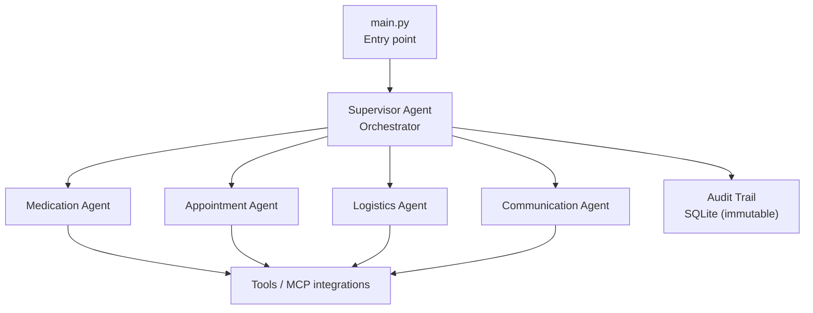
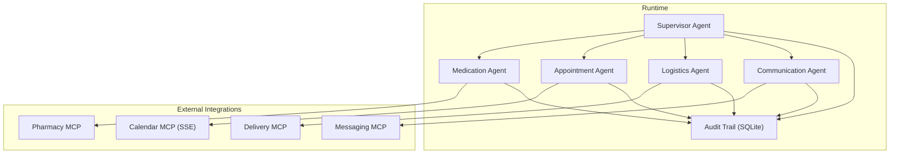
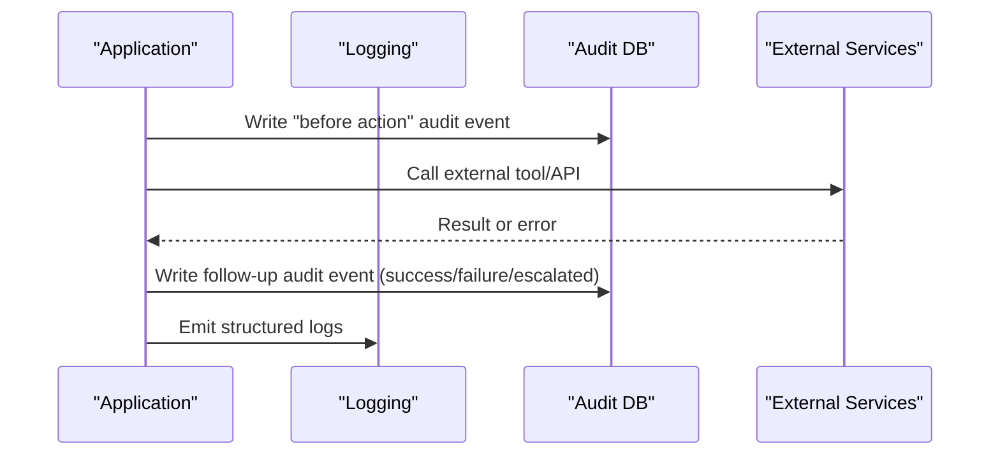
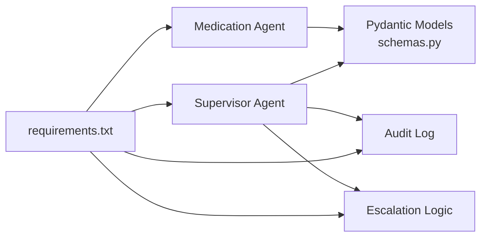

# Deployment Guide

<cite>
**Referenced Files in This Document**
- [main.py](file://main.py)
- [requirements.txt](file://requirements.txt)
- [pyproject.toml](file://pyproject.toml)
- [SPEC.md](file://SPEC.md)
- [architecture.md](file://architecture.md)
- [src/models/audit_log.py](file://src/models/audit_log.py)
- [src/models/schemas.py](file://src/models/schemas.py)
- [src/models/escalation_logic.py](file://src/models/escalation_logic.py)
- [src/agents/supervisor_agent.py](file://src/agents/supervisor_agent.py)
- [src/agents/medication_agent.py](file://src/agents/medication_agent.py)
</cite>

## Table of Contents
1. Introduction
2. Project Structure
3. Core Components
4. Architecture Overview
5. Detailed Component Analysis
6. Dependency Analysis
7. Performance Considerations
8. Troubleshooting Guide
9. Conclusion
10. Appendices

## Introduction
This guide provides production deployment and operational guidance for CareBridge, an AI-powered care coordination system. It covers environment setup, configuration management, containerization, cloud deployment considerations using Boto3, scaling strategies, monitoring and logging, security, disaster recovery, health checks, and upgrade procedures. The goal is to help operators run CareBridge reliably in production while maintaining safety, auditability, and observability.

## Project Structure
CareBridge is a Python application with:
- A single entry point that initializes the audit database, loads fixtures, and runs the demo scenario.
- Agent-based orchestration via a Supervisor that routes events to specialized agents (Medication, Appointment, Logistics, Communication).
- An immutable SQLite audit trail used for compliance and traceability.
- Pydantic v2 models for structured data exchange between components.
- Deterministic escalation logic to ensure safety-critical decisions are not LLM-driven.

**Diagram sources**
- [main.py:143-181](file://main.py#L143-L181)
- [src/agents/supervisor_agent.py:285-395](file://src/agents/supervisor_agent.py#L285-L395)
- [src/models/audit_log.py:19-78](file://src/models/audit_log.py#L19-L78)

**Section sources**
- [main.py:1-181](file://main.py#L1-L181)
- [architecture.md:329-370](file://architecture.md#L329-L370)

## Core Components
- Entry point: Initializes logging, audit DB, fixtures, optional Strands Supervisor, and runs the demo scenario.
- Supervisor Agent: Routes events deterministically, enforces escalation rules, writes audit events before actions, and coordinates communication alerts when needed.
- Medication Agent: Checks refill status, orders refills with retries, detects adherence deviations, and escalates as required.
- Audit Trail: Immutable SQLite database with triggers preventing updates/deletes; every action is recorded with rationale and outcome.
- Schemas: Pydantic v2 models define strict contracts for all inter-component data.
- Escalation Logic: Pure Python classification into auto/alert/approve categories for safety-critical decisions.

**Section sources**
- [main.py:19-31](file://main.py#L19-L31)
- [main.py:143-181](file://main.py#L143-L181)
- [src/agents/supervisor_agent.py:285-395](file://src/agents/supervisor_agent.py#L285-L395)
- [src/agents/medication_agent.py:23-134](file://src/agents/medication_agent.py#L23-L134)
- [src/models/audit_log.py:19-78](file://src/models/audit_log.py#L19-L78)
- [src/models/schemas.py:56-70](file://src/models/schemas.py#L56-L70)
- [src/models/escalation_logic.py:42-70](file://src/models/escalation_logic.py#L42-L70)

## Architecture Overview
The system uses an agent-as-tools pattern where the Supervisor delegates tasks to specialized agents. All external interactions go through tools/MCP integrations, and every action is audited before execution. Production targets include Qoder Cloud Agents with managed runtime and identity isolation, while local development uses SQLite and mock integrations.

**Diagram sources**
- [architecture.md:10-75](file://architecture.md#L10-L75)
- [architecture.md:211-261](file://architecture.md#L211-L261)
- [src/agents/supervisor_agent.py:259-278](file://src/agents/supervisor_agent.py#L259-L278)

**Section sources**
- [architecture.md:10-75](file://architecture.md#L10-L75)
- [architecture.md:211-261](file://architecture.md#L211-L261)

## Detailed Component Analysis

### Environment Setup and Configuration
- Python version: Use a recent stable Python 3.x compatible with Pydantic v2 and pytest-asyncio. Install dependencies from requirements.txt.
- Dependencies: strands-agents, pydantic, pytest, boto3, python-dotenv.
- Configuration management:
  - Use environment variables for secrets (API keys, tokens). Load via python-dotenv in your process or platform secret manager.
  - Ensure logs directory exists before starting the process.
  - Audit database path defaults to a file named audit.db; configure via environment if needed by overriding initialization parameters at startup.

Operational checklist:
- Create a virtual environment and install requirements.
- Provide .env with required secrets (e.g., AWS credentials if using Boto3).
- Ensure logs/ directory is writable.
- Verify audit.db can be created and written to.

**Section sources**
- [requirements.txt:1-8](file://requirements.txt#L1-L8)
- [main.py:19-31](file://main.py#L19-L31)
- [src/models/audit_log.py:16-25](file://src/models/audit_log.py#L16-L25)

### Containerization with Docker
Recommended approach:
- Base image: Official Python slim image matching your Python version.
- Copy project files, install dependencies, create logs directory, and set environment variables for secrets.
- Expose no ports unless you add an HTTP server; the current entry point runs a demo scenario. For production, wrap the async event processing loop behind a service (e.g., FastAPI) if you need HTTP endpoints.
- Health check: Implement a lightweight endpoint or command that verifies audit DB connectivity and fixture availability.
- Secrets: Mount secrets via environment variables or secret managers; do not bake secrets into images.

Example steps (conceptual):
- Build image with pip install -r requirements.txt.
- Run container with environment variables for secrets and volume mounts for logs and audit.db.
- Add a healthcheck script that calls init_audit_db() and reads a small query to confirm DB integrity.

[No sources needed since this section provides general guidance]

### Cloud Deployment to AWS Using Boto3 Integration
- Boto3 is included in dependencies; use it to interact with AWS services (e.g., S3 for backups, Secrets Manager for credentials, CloudWatch for logs/metrics).
- IAM roles/policies: Grant least privilege access for required operations (read/write audit backups, publish logs, read secrets).
- Configuration: Store sensitive values in AWS Secrets Manager or Parameter Store; load via Boto3 at runtime.
- Logging: Stream logs to CloudWatch Logs; consider structured JSON logs for parsing.
- Metrics: Emit custom metrics (event counts, error rates, latency) to CloudWatch Metrics.

Operational notes:
- Prefer running in a managed compute environment (e.g., ECS/Fargate or Lambda) depending on workload shape.
- Use VPC networking and private subnets for outbound-only integrations where possible.
- Enable encryption at rest for any persisted artifacts (e.g., audit backups in S3).

**Section sources**
- [requirements.txt:6-7](file://requirements.txt#L6-L7)
- [SPEC.md:455-465](file://SPEC.md#L455-L465)

### Local Development Setup
- Run the demo scenario directly: execute the entry point to initialize the audit DB, load fixtures, and process sample events.
- Fixtures: Ensure medications.json, appointments.json, delivery_history.json, and family_members.json exist under fixtures/.
- Optional LLM mode: If Strands SDK and Bedrock credentials are available, the Supervisor will attempt to create an LLM-backed agent; otherwise, deterministic routing is used automatically.

**Section sources**
- [main.py:45-63](file://main.py#L45-L63)
- [main.py:143-181](file://main.py#L143-L181)
- [src/agents/supervisor_agent.py:599-641](file://src/agents/supervisor_agent.py#L599-L641)

### Scaling Considerations
- Concurrency target: Support multiple concurrent care recipients (specification targets 10 concurrent recipients).
- Strategies:
  - Horizontal scaling: Run multiple worker processes or containers per recipient or per event queue partition.
  - Event-driven architecture: Use a message broker to fan out events to workers.
  - Database: For high concurrency, consider migrating the audit/state store from SQLite to PostgreSQL (as outlined in architecture docs).
  - Retry policy: Apply exponential backoff for external calls; the codebase includes retry helpers.
- Resource tuning: Adjust worker count based on CPU/memory profiles and external API rate limits.

**Section sources**
- [SPEC.md:455-465](file://SPEC.md#L455-L465)
- [architecture.md:329-370](file://architecture.md#L329-L370)
- [src/agents/medication_agent.py:137-159](file://src/agents/medication_agent.py#L137-L159)

### Monitoring and Logging
- Built-in logging: The entry point configures console and file handlers; ensure log rotation in production.
- Audit trail: Every action writes an immutable record to SQLite; queries support filtering by recipient and correlation ID.
- External integration:
  - Ship logs to centralized logging (e.g., CloudWatch Logs).
  - Emit metrics for event throughput, error rates, and latency.
  - Integrate alerting for critical failures (e.g., audit write failures, repeated external API errors).

**Diagram sources**
- [src/models/audit_log.py:81-130](file://src/models/audit_log.py#L81-L130)
- [src/agents/supervisor_agent.py:285-395](file://src/agents/supervisor_agent.py#L285-L395)

**Section sources**
- [main.py:22-31](file://main.py#L22-L31)
- [src/models/audit_log.py:81-130](file://src/models/audit_log.py#L81-L130)
- [SPEC.md:395-433](file://SPEC.md#L395-L433)

### Security Considerations
- Authentication: JWT authentication is specified for the caregiver UI; integrate token validation at the API boundary.
- Secrets management: Keep API keys and tokens in environment variables or a secure secret store; never commit secrets to source control.
- Data protection: Encrypt data at rest (e.g., audit backups) and in transit (TLS for all external calls).
- Least privilege: Restrict IAM permissions for Boto3 usage; isolate identities per tenant/family where applicable.
- Input validation: Enforce Pydantic schemas for all inputs/outputs to prevent injection and malformed data.

**Section sources**
- [SPEC.md:455-465](file://SPEC.md#L455-L465)
- [src/models/schemas.py:56-70](file://src/models/schemas.py#L56-L70)

### Disaster Recovery and Backup Strategy
- Audit database: Back up audit.db regularly (e.g., daily snapshots). Since SQLite is append-only with immutable triggers, backups preserve tamper-evident history.
- Restore procedure: Stop writers, copy backup over active DB, verify schema and indexes, restart services.
- Offsite storage: Store backups in a secure, encrypted object store (e.g., S3) with retention policies.
- RTO/RPO: Define acceptable recovery time and point objectives; test restores periodically.

**Section sources**
- [src/models/audit_log.py:19-78](file://src/models/audit_log.py#L19-L78)
- [SPEC.md:395-433](file://SPEC.md#L395-L433)

### Health Check Endpoints and Operational Metrics
- Health checks:
  - Process-level: Confirm logs directory exists and is writable.
  - Database-level: Connect to audit DB, run a simple SELECT to validate schema and indexes.
  - Fixture-level: Verify required fixture files exist and parse successfully.
- Metrics:
  - Track event processing counts, success/failure rates, escalation frequency, and average latency.
  - Export to your monitoring stack (e.g., CloudWatch Metrics, Prometheus).

[No sources needed since this section provides general guidance]

### Upgrade Procedures and Database Migration
- Pre-upgrade:
  - Back up audit.db and application state.
  - Freeze writes during migration if necessary.
- Migration strategy:
  - For SQLite: Use incremental SQL scripts to add tables/indexes safely; test migrations locally and in staging.
  - For PostgreSQL (production target): Use a migration framework (e.g., Alembic) to manage schema changes with rollback plans.
- Post-upgrade:
  - Validate schema and indexes.
  - Run smoke tests against core flows (refill low, appointment upcoming, delivery failed).
  - Monitor error rates and audit trails for anomalies.

**Section sources**
- [src/models/audit_log.py:19-78](file://src/models/audit_log.py#L19-L78)
- [architecture.md:329-370](file://architecture.md#L329-L370)

## Dependency Analysis
CareBridge depends on:
- Agent framework and tools (Strands Agents SDK) for orchestration and optional LLM capabilities.
- Pydantic for strict data contracts.
- Testing libraries for unit/integration tests.
- Boto3 for AWS integrations.
- python-dotenv for environment-based configuration.

**Diagram sources**
- [requirements.txt:1-8](file://requirements.txt#L1-L8)
- [src/models/schemas.py:56-70](file://src/models/schemas.py#L56-L70)
- [src/agents/supervisor_agent.py:285-395](file://src/agents/supervisor_agent.py#L285-L395)
- [src/models/escalation_logic.py:42-70](file://src/models/escalation_logic.py#L42-L70)

**Section sources**
- [requirements.txt:1-8](file://requirements.txt#L1-L8)
- [src/models/schemas.py:56-70](file://src/models/schemas.py#L56-L70)
- [src/agents/supervisor_agent.py:285-395](file://src/agents/supervisor_agent.py#L285-L395)
- [src/models/escalation_logic.py:42-70](file://src/models/escalation_logic.py#L42-L70)

## Performance Considerations
- Latency: Target single agent task under 5 seconds (mocked); optimize external calls with caching and timeouts.
- Concurrency: Scale horizontally to handle multiple care recipients; tune worker pools based on resource constraints.
- Retry policy: Use exponential backoff for transient failures; avoid thundering herds by jittering delays.
- Database: SQLite is suitable for dev/staging; migrate to PostgreSQL for production-scale concurrency and durability.
- Observability: Instrument key paths with metrics and structured logs to identify bottlenecks.

**Section sources**
- [SPEC.md:455-465](file://SPEC.md#L455-L465)
- [architecture.md:329-370](file://architecture.md#L329-L370)

## Troubleshooting Guide
Common issues and resolutions:
- Missing fixtures: Ensure all required JSON files exist under fixtures/; the entry point validates their presence.
- Audit DB errors: Verify DB path is writable; check SQLite permissions; review trigger creation logs.
- External API failures: Inspect logs for error messages; rely on retry logic and escalation paths; confirm credentials and network access.
- Escalation loops: Review escalation logic and agent outputs; ensure deterministic classification prevents misrouting.

Operational tips:
- Enable verbose logging during incidents.
- Correlate events using correlation IDs across audit entries.
- Use health checks to detect degraded states early.

**Section sources**
- [main.py:45-63](file://main.py#L45-L63)
- [src/models/audit_log.py:81-130](file://src/models/audit_log.py#L81-L130)
- [src/agents/supervisor_agent.py:318-339](file://src/agents/supervisor_agent.py#L318-L339)

## Conclusion
CareBridge provides a robust, auditable, and scalable foundation for care coordination. By following this deployment guide—covering environment setup, containerization, cloud integration, scaling, monitoring, security, disaster recovery, and upgrades—you can operate the system reliably in production while maintaining safety and compliance.

## Appendices

### Quick Start Commands
- Install dependencies: pip install -r requirements.txt
- Run demo: python main.py
- Verify audit DB: Confirm audit.db exists and contains events after run.

**Section sources**
- [requirements.txt:1-8](file://requirements.txt#L1-L8)
- [main.py:143-181](file://main.py#L143-L181)