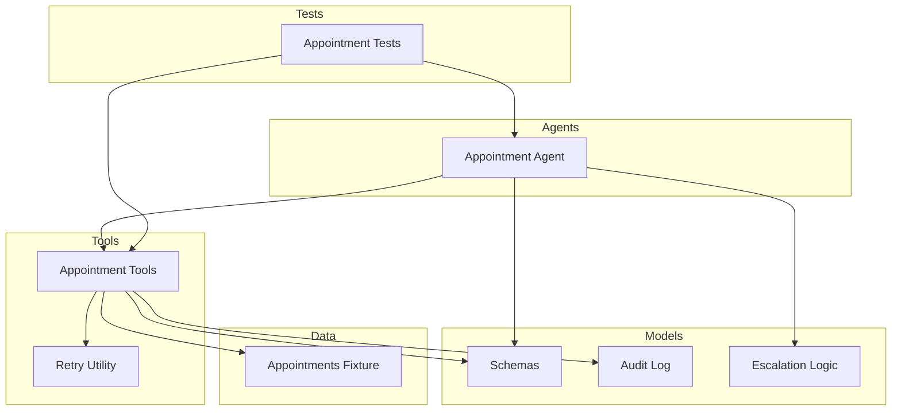
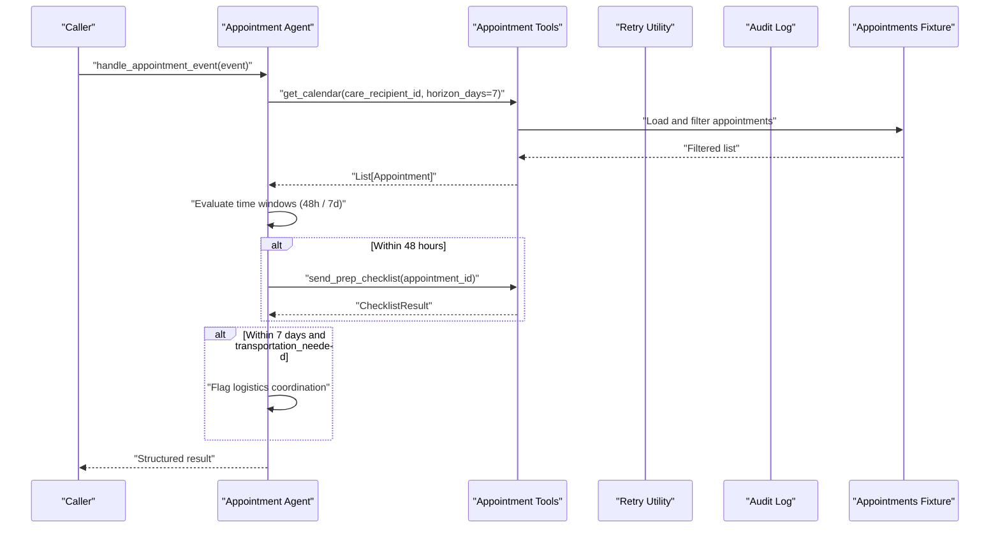
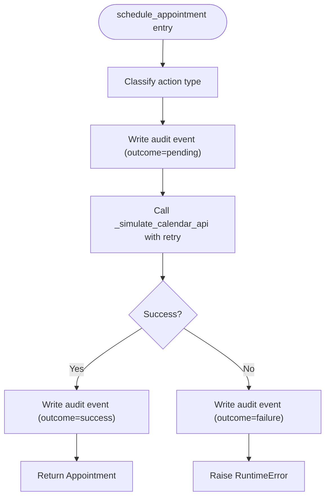
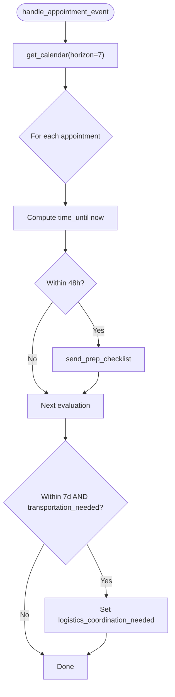
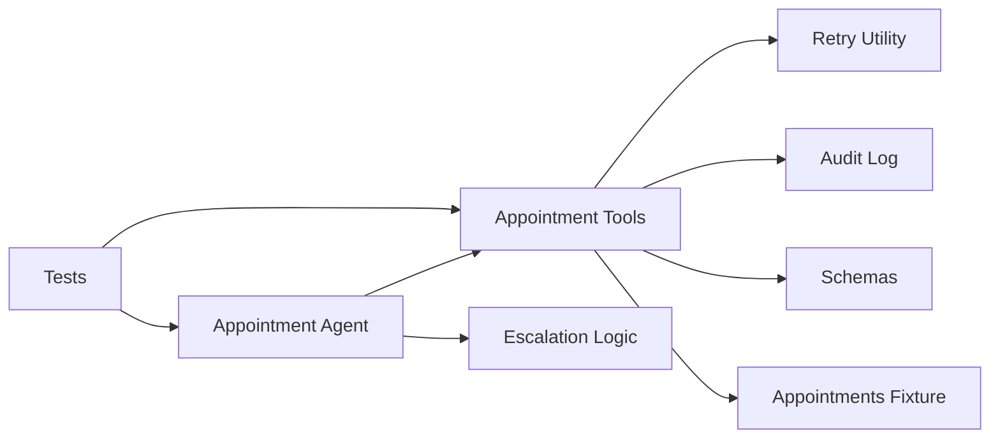

# Appointment Tools

<cite>
**Referenced Files in This Document**
- [appointment_tools.py](file://src/tools/appointment_tools.py)
- [appointment_agent.py](file://src/agents/appointment_agent.py)
- [schemas.py](file://src/models/schemas.py)
- [audit_log.py](file://src/models/audit_log.py)
- [escalation_logic.py](file://src/models/escalation_logic.py)
- [retry.py](file://src/tools/retry.py)
- [appointments.json](file://fixtures/appointments.json)
- [test_appointment_agent.py](file://tests/test_appointment_agent.py)
- [main.py](file://main.py)
- [AGENTS.md](file://AGENTS.md)
- [SPEC.md](file://SPEC.md)
</cite>

## Table of Contents
1. Introduction
2. Project Structure
3. Core Components
4. Architecture Overview
5. Detailed Component Analysis
6. Dependency Analysis
7. Performance Considerations
8. Troubleshooting Guide
9. Conclusion
10. Appendices

## Introduction
This document explains CareBridge’s appointment tools and how they integrate with calendar services to support scheduling, reminders, and provider coordination. The tools abstract external calendar providers (such as Google Calendar) behind standardized interfaces, enabling consistent behavior for retrieval, creation, and preparation workflows. They also enforce auditability, retry policies, and escalation rules across the system.

The appointment lifecycle is tracked from creation through completion, including status tracking via audit events and conflict detection via time-window checks. The documentation covers:
- Scheduling workflows and reminder automation patterns
- Integration with external calendar providers and data synchronization strategies
- Timezone handling and recurring appointment considerations
- Testing guidance and outage handling

## Project Structure
CareBridge organizes appointment functionality into agents and tools:
- Agents encapsulate business logic and orchestration (e.g., checking upcoming appointments, sending checklists, flagging logistics needs).
- Tools implement concrete operations against calendar services or mock backends, with retries and audit logging.
- Models define shared schemas used across components.
- Fixtures provide sample data for development and testing.
- Tests validate tool and agent behavior under happy and failure paths.

**Diagram sources**
- [appointment_agent.py:1-173](file://src/agents/appointment_agent.py#L1-L173)
- [appointment_tools.py:1-242](file://src/tools/appointment_tools.py#L1-L242)
- [schemas.py:1-150](file://src/models/schemas.py#L1-L150)
- [audit_log.py:1-167](file://src/models/audit_log.py#L1-L167)
- [escalation_logic.py:1-71](file://src/models/escalation_logic.py#L1-L71)
- [retry.py:1-70](file://src/tools/retry.py#L1-L70)
- [appointments.json:1-33](file://fixtures/appointments.json#L1-L33)
- [test_appointment_agent.py:1-127](file://tests/test_appointment_agent.py#L1-L127)

**Section sources**
- [appointment_agent.py:1-173](file://src/agents/appointment_agent.py#L1-L173)
- [appointment_tools.py:1-242](file://src/tools/appointment_tools.py#L1-L242)
- [schemas.py:1-150](file://src/models/schemas.py#L1-L150)
- [audit_log.py:1-167](file://src/models/audit_log.py#L1-L167)
- [escalation_logic.py:1-71](file://src/models/escalation_logic.py#L1-L71)
- [retry.py:1-70](file://src/tools/retry.py#L1-L70)
- [appointments.json:1-33](file://fixtures/appointments.json#L1-L33)
- [test_appointment_agent.py:1-127](file://tests/test_appointment_agent.py#L1-L127)

## Core Components
- Appointment Tools: Provide calendar access, scheduling, and checklist delivery using fixtures as a mock backend. They wrap external calls with retries and write immutable audit events before and after actions.
- Appointment Agent: Orchestrates care events related to appointments, evaluates time windows for checklists and transportation, and coordinates with other agents when needed.
- Shared Models: Define structured data such as Appointment, ChecklistResult, AuditEvent, and CareEvent.
- Retry Utility: Implements exponential backoff for external API calls.
- Escalation Logic: Classifies actions deterministically to determine whether they are autonomous, require alerting, or need approval.
- Audit Log: Immutable SQLite-backed event store ensuring every action is recorded with rationale and outcome.

Key responsibilities:
- get_calendar: Retrieve upcoming appointments within a horizon for a care recipient.
- schedule_appointment: Create an appointment with a provider, with audit and retry.
- send_prep_checklist: Deliver preparation instructions for upcoming appointments.
- check_upcoming_appointments: Identify appointments needing attention based on time windows.
- handle_appointment_event: End-to-end processing of appointment-related events.

**Section sources**
- [appointment_tools.py:25-80](file://src/tools/appointment_tools.py#L25-L80)
- [appointment_tools.py:117-200](file://src/tools/appointment_tools.py#L117-L200)
- [appointment_tools.py:203-242](file://src/tools/appointment_tools.py#L203-L242)
- [appointment_agent.py:25-71](file://src/agents/appointment_agent.py#L25-L71)
- [appointment_agent.py:74-173](file://src/agents/appointment_agent.py#L74-L173)
- [schemas.py:23-32](file://src/models/schemas.py#L23-L32)
- [schemas.py:111-116](file://src/models/schemas.py#L111-L116)
- [audit_log.py:81-130](file://src/models/audit_log.py#L81-L130)
- [retry.py:22-69](file://src/tools/retry.py#L22-L69)
- [escalation_logic.py:13-70](file://src/models/escalation_logic.py#L13-L70)

## Architecture Overview
The appointment subsystem follows a layered architecture:
- Agent layer handles event-driven workflows and decision logic.
- Tool layer implements concrete operations with resilience and observability.
- Model layer standardizes data contracts.
- External calendar integration is abstracted behind tools; currently simulated via fixtures but designed to be replaced by MCP-based calendar services.

**Diagram sources**
- [appointment_agent.py:74-173](file://src/agents/appointment_agent.py#L74-L173)
- [appointment_tools.py:39-80](file://src/tools/appointment_tools.py#L39-L80)
- [appointment_tools.py:203-242](file://src/tools/appointment_tools.py#L203-L242)
- [appointments.json:1-33](file://fixtures/appointments.json#L1-L33)

## Detailed Component Analysis

### Appointment Tools
Responsibilities:
- Load fixture data and filter by care recipient and time horizon.
- Schedule appointments asynchronously with retries and audit trails.
- Send preparation checklists and return delivery status.

Implementation highlights:
- Timezone-aware datetime handling ensures correct comparisons.
- Audit-first pattern writes pending outcomes before execution and final outcomes after success/failure.
- Retry utility wraps external calls with exponential backoff.

**Diagram sources**
- [appointment_tools.py:117-200](file://src/tools/appointment_tools.py#L117-L200)
- [retry.py:22-69](file://src/tools/retry.py#L22-L69)
- [audit_log.py:81-130](file://src/models/audit_log.py#L81-L130)

**Section sources**
- [appointment_tools.py:25-80](file://src/tools/appointment_tools.py#L25-L80)
- [appointment_tools.py:117-200](file://src/tools/appointment_tools.py#L117-L200)
- [appointment_tools.py:203-242](file://src/tools/appointment_tools.py#L203-L242)
- [retry.py:22-69](file://src/tools/retry.py#L22-L69)
- [audit_log.py:81-130](file://src/models/audit_log.py#L81-L130)

### Appointment Agent
Responsibilities:
- Check upcoming appointments and determine actions based on time windows.
- Send prep checklists for appointments within 48 hours.
- Flag logistics coordination for appointments within 7 days requiring transportation.
- Process appointment events end-to-end and return structured results.

Behavior rules:
- Uses UTC-aware datetimes for comparisons.
- Returns actionable summaries including checklists sent and transport flags.

**Diagram sources**
- [appointment_agent.py:74-173](file://src/agents/appointment_agent.py#L74-L173)

**Section sources**
- [appointment_agent.py:25-71](file://src/agents/appointment_agent.py#L25-L71)
- [appointment_agent.py:74-173](file://src/agents/appointment_agent.py#L74-L173)

### Data Models and Schemas
- Appointment: Represents provider details, specialty, scheduled time, location, preparation requirements, transportation needs, and care recipient association.
- ChecklistResult: Captures delivery status and timestamp for checklist dispatch.
- AuditEvent: Immutable record of actor, action, rationale, outcome, correlation, and optional authorization reference.
- CareEvent: Event envelope for incoming triggers like appointment_upcoming.

These models ensure consistent data exchange between agents and tools.

**Section sources**
- [schemas.py:23-32](file://src/models/schemas.py#L23-L32)
- [schemas.py:111-116](file://src/models/schemas.py#L111-L116)
- [schemas.py:44-53](file://src/models/schemas.py#L44-L53)
- [schemas.py:56-62](file://src/models/schemas.py#L56-L62)

### Retry and Resilience
- Exponential backoff with three attempts (1s, 2s, 4s) protects against transient failures.
- RetryExhausted exception indicates all attempts failed, enabling higher-level error handling and escalation.

**Section sources**
- [retry.py:14-69](file://src/tools/retry.py#L14-L69)

### Escalation and Safety
- Deterministic classification ensures safety-critical decisions are not delegated to LLMs.
- schedule_appointment is classified as requiring alert, while get_calendar is autonomous.

**Section sources**
- [escalation_logic.py:13-70](file://src/models/escalation_logic.py#L13-L70)

### Audit Trail
- Every action writes a “before” event with outcome=pending prior to execution.
- A follow-up event records the final outcome (success/failure), preserving immutability via SQLite triggers.

**Section sources**
- [audit_log.py:19-78](file://src/models/audit_log.py#L19-L78)
- [audit_log.py:81-130](file://src/models/audit_log.py#L81-L130)

## Dependency Analysis
The appointment subsystem has clear boundaries and dependencies:
- Appointment Agent depends on Appointment Tools and shared models.
- Appointment Tools depend on Retry, Audit Log, Schemas, and Fixture data.
- Escalation Logic is used to classify actions deterministically.
- Tests validate both tool and agent behaviors.

**Diagram sources**
- [appointment_agent.py:1-173](file://src/agents/appointment_agent.py#L1-L173)
- [appointment_tools.py:1-242](file://src/tools/appointment_tools.py#L1-L242)
- [retry.py:1-70](file://src/tools/retry.py#L1-L70)
- [audit_log.py:1-167](file://src/models/audit_log.py#L1-L167)
- [schemas.py:1-150](file://src/models/schemas.py#L1-L150)
- [appointments.json:1-33](file://fixtures/appointments.json#L1-L33)
- [test_appointment_agent.py:1-127](file://tests/test_appointment_agent.py#L1-L127)
- [escalation_logic.py:1-71](file://src/models/escalation_logic.py#L1-L71)

**Section sources**
- [appointment_agent.py:1-173](file://src/agents/appointment_agent.py#L1-L173)
- [appointment_tools.py:1-242](file://src/tools/appointment_tools.py#L1-L242)
- [retry.py:1-70](file://src/tools/retry.py#L1-L70)
- [audit_log.py:1-167](file://src/models/audit_log.py#L1-L167)
- [schemas.py:1-150](file://src/models/schemas.py#L1-L150)
- [appointments.json:1-33](file://fixtures/appointments.json#L1-L33)
- [test_appointment_agent.py:1-127](file://tests/test_appointment_agent.py#L1-L127)
- [escalation_logic.py:1-71](file://src/models/escalation_logic.py#L1-L71)

## Performance Considerations
- Time filtering uses simple iteration over fixture data; for large datasets, consider indexing by care_recipient_id and datetime ranges.
- Retry policy limits external call latency; tune base_delay and max_attempts if integrating real APIs with different SLAs.
- Audit log writes are synchronous; batch or async flush may be considered for high-throughput scenarios.
- Avoid unnecessary timezone conversions; maintain UTC throughout to minimize overhead.

## Troubleshooting Guide
Common issues and resolutions:
- No appointments found: Ensure care_recipient_id exists in fixtures and that the horizon includes the target dates.
- Invalid appointment_id for checklist: Verify the appointment_id matches fixture records.
- Calendar API failures: The tool raises a RuntimeError after retries; inspect logs and audit trail for failure reasons.
- Unknown recipient: The agent returns a structured result indicating no appointments; verify IDs and fixture data.

Operational checks:
- Confirm audit database initialization and immutability triggers are active.
- Validate retry behavior by simulating transient failures in tests.
- Use the demo scenario to exercise end-to-end flows and review audit summaries.

**Section sources**
- [appointment_tools.py:55-80](file://src/tools/appointment_tools.py#L55-L80)
- [appointment_tools.py:218-242](file://src/tools/appointment_tools.py#L218-L242)
- [appointment_agent.py:106-123](file://src/agents/appointment_agent.py#L106-L123)
- [audit_log.py:19-78](file://src/models/audit_log.py#L19-L78)
- [test_appointment_agent.py:18-79](file://tests/test_appointment_agent.py#L18-L79)
- [main.py:143-177](file://main.py#L143-L177)

## Conclusion
CareBridge’s appointment tools provide a robust foundation for scheduling, reminders, and provider coordination. By abstracting calendar services behind standardized interfaces, enforcing auditability, and applying deterministic escalation and retry policies, the system ensures reliable operation even under external service variability. The agent-layer workflows enable proactive care coordination, while fixtures and tests facilitate rapid development and validation.

## Appendices

### Appointment Lifecycle and Status Tracking
- Creation: schedule_appointment writes a pending audit event, executes the calendar call with retries, then records success or failure.
- Reminder Automation: For appointments within 48 hours, send_prep_checklist delivers preparation instructions and returns delivery status.
- Provider Coordination: For appointments within 7 days requiring transportation, the agent flags logistics coordination needs.
- Completion: Outcomes are captured in audit events; downstream processes can query these records for reporting and reconciliation.

**Section sources**
- [appointment_tools.py:117-200](file://src/tools/appointment_tools.py#L117-L200)
- [appointment_agent.py:126-160](file://src/agents/appointment_agent.py#L126-L160)
- [audit_log.py:81-130](file://src/models/audit_log.py#L81-L130)

### Integration with External Calendar Providers
- Current implementation uses fixtures to simulate calendar operations.
- Specification outlines an MCP-based calendar server connecting to Google Calendar via Qoder Connector, with fallback to in-process mock when unavailable.
- To integrate a real provider:
  - Replace _simulate_calendar_api with an MCP client call.
  - Maintain the same input/output contract (provider_id, care_recipient_id, preferred_datetime → Appointment).
  - Preserve retry and audit patterns.

**Section sources**
- [appointment_tools.py:83-114](file://src/tools/appointment_tools.py#L83-L114)
- [SPEC.md:387-392](file://SPEC.md#L387-L392)

### Timezone Handling and Recurring Appointments
- All datetime comparisons use UTC-aware datetimes to avoid ambiguity.
- Recurring appointments are not explicitly modeled in current fixtures; extend schemas and tools to support recurrence rules (e.g., RRULE) and generate individual occurrences for scheduling and reminders.

**Section sources**
- [appointment_tools.py:67-74](file://src/tools/appointment_tools.py#L67-L74)
- [appointment_agent.py:54-62](file://src/agents/appointment_agent.py#L54-L62)

### Testing Appointment Tool Integrations
- Unit tests cover happy paths and failure scenarios for get_calendar, schedule_appointment, and send_prep_checklist.
- Agent-level tests validate event processing and result structure.
- Use temp_audit_db fixtures to isolate audit writes during tests.

**Section sources**
- [test_appointment_agent.py:18-79](file://tests/test_appointment_agent.py#L18-L79)
- [test_appointment_agent.py:97-127](file://tests/test_appointment_agent.py#L97-L127)

### Handling Calendar Service Outages
- Retry policy provides resilience for transient failures.
- On exhaustion, raise RuntimeError and record failure in audit trail.
- Fallback strategy per specification: log to audit and notify caregiver to schedule manually.

**Section sources**
- [retry.py:22-69](file://src/tools/retry.py#L22-L69)
- [appointment_tools.py:183-200](file://src/tools/appointment_tools.py#L183-L200)
- [AGENTS.md:154-163](file://AGENTS.md#L154-L163)