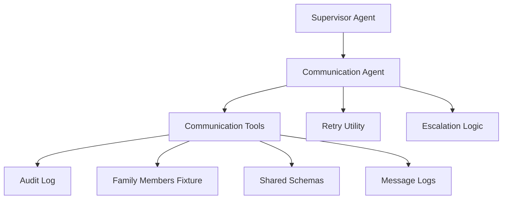
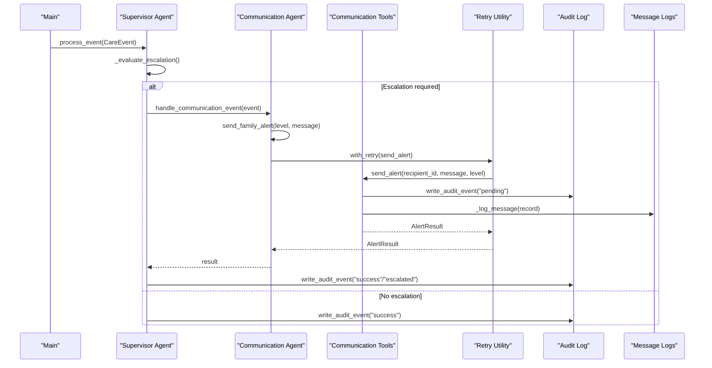
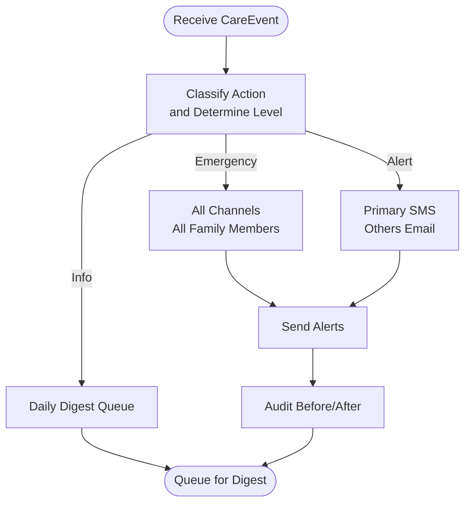
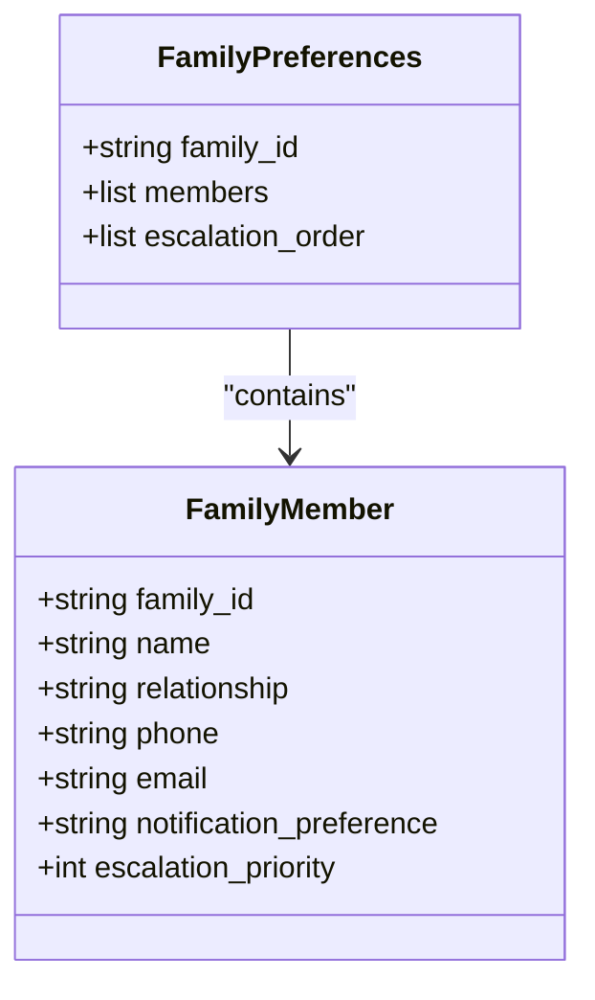
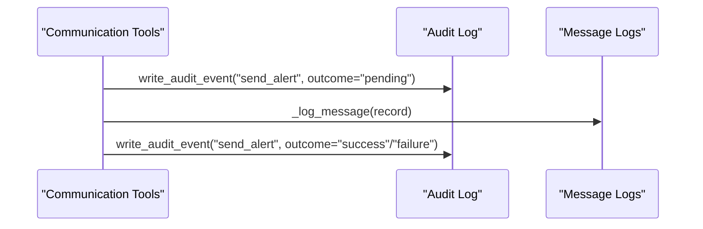
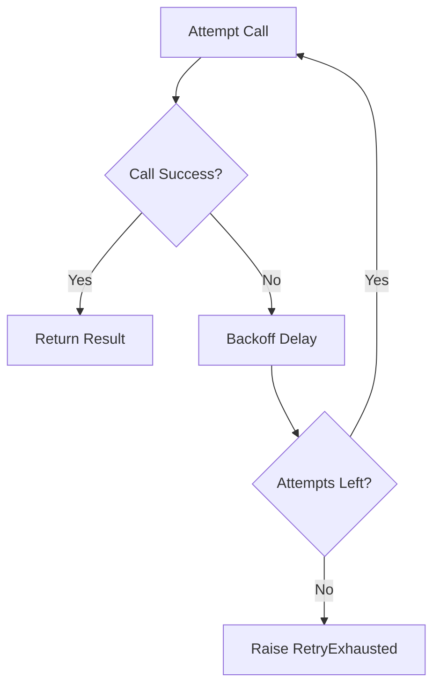
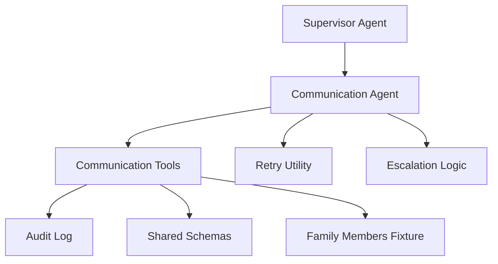

# Communication Tools

<cite>
**Referenced Files in This Document**
- [communication_tools.py](file://src/tools/communication_tools.py)
- [communication_agent.py](file://src/agents/communication_agent.py)
- [retry.py](file://src/tools/retry.py)
- [schemas.py](file://src/models/schemas.py)
- [audit_log.py](file://src/models/audit_log.py)
- [escalation_logic.py](file://src/models/escalation_logic.py)
- [supervisor_agent.py](file://src/agents/supervisor_agent.py)
- [family_members.json](file://fixtures/family_members.json)
- [main.py](file://main.py)
- [test_communication_agent.py](file://tests/test_communication_agent.py)
- [AGENTS.md](file://AGENTS.md)
- [SPEC.md](file://SPEC.md)
</cite>

## Table of Contents
1. Introduction
2. Project Structure
3. Core Components
4. Architecture Overview
5. Detailed Component Analysis
6. Dependency Analysis
7. Performance Considerations
8. Troubleshooting Guide
9. Compliance and Security
10. Configuration and Templates
11. Conclusion

## Introduction
This document explains CareBridge’s communication tools for SMS and email messaging, focusing on alert generation, notification delivery, and family communication workflows. It covers how alerts are generated and routed, how recipients are managed, how delivery status is tracked, and how retries and failures are handled. It also provides guidance on configuring templates and managing recipient preferences, along with compliance considerations relevant to healthcare communications.

The current implementation simulates external messaging (SMS/email/phone) by logging messages to a file. Real integrations with Twilio (SMS) and SendGrid (email) are planned as Day 2 via standardized tool interfaces.

## Project Structure
CareBridge organizes communication logic across agents, tools, models, and fixtures:
- Agents coordinate events and orchestrate routing.
- Tools implement messaging operations and utilities.
- Models define shared data structures and audit persistence.
- Fixtures provide sample family member data used for recipient management.

**Diagram sources**
- [supervisor_agent.py:285-395](file://src/agents/supervisor_agent.py#L285-L395)
- [communication_agent.py:28-146](file://src/agents/communication_agent.py#L28-L146)
- [communication_tools.py:54-157](file://src/tools/communication_tools.py#L54-L157)
- [retry.py:22-69](file://src/tools/retry.py#L22-L69)
- [audit_log.py:81-128](file://src/models/audit_log.py#L81-L128)
- [schemas.py:118-145](file://src/models/schemas.py#L118-L145)
- [escalation_logic.py:42-70](file://src/models/escalation_logic.py#L42-L70)
- [family_members.json:1-30](file://fixtures/family_members.json#L1-L30)

**Section sources**
- [supervisor_agent.py:285-395](file://src/agents/supervisor_agent.py#L285-L395)
- [communication_agent.py:28-146](file://src/agents/communication_agent.py#L28-L146)
- [communication_tools.py:54-157](file://src/tools/communication_tools.py#L54-L157)
- [retry.py:22-69](file://src/tools/retry.py#L22-L69)
- [audit_log.py:81-128](file://src/models/audit_log.py#L81-L128)
- [schemas.py:118-145](file://src/models/schemas.py#L118-L145)
- [escalation_logic.py:42-70](file://src/models/escalation_logic.py#L42-L70)
- [family_members.json:1-30](file://fixtures/family_members.json#L1-L30)

## Core Components
- Communication Tools: Implements alert sending, status synthesis, and family preference retrieval. Currently simulates messaging by writing records to logs/messages.log.
- Communication Agent: Coordinates event handling, determines escalation level, and invokes retry-wrapped alert sending.
- Retry Utility: Provides exponential backoff retries for external calls.
- Shared Schemas: Defines structured models for alerts, statuses, family members, and audit events.
- Audit Log: Immutable SQLite-backed audit trail capturing before/after outcomes.
- Escalation Logic: Deterministic classification of actions into auto/alert/approve categories.
- Family Members Fixture: Sample recipients with contact info, preferences, and escalation priorities.

Key responsibilities:
- Alert generation based on severity levels (info, alert, emergency).
- Recipient selection using escalation order and notification preferences.
- Delivery simulation and logging for tracking.
- Retry and failure handling with audit entries.

**Section sources**
- [communication_tools.py:54-157](file://src/tools/communication_tools.py#L54-L157)
- [communication_agent.py:28-146](file://src/agents/communication_agent.py#L28-L146)
- [retry.py:22-69](file://src/tools/retry.py#L22-L69)
- [schemas.py:118-145](file://src/models/schemas.py#L118-L145)
- [audit_log.py:81-128](file://src/models/audit_log.py#L81-L128)
- [escalation_logic.py:42-70](file://src/models/escalation_logic.py#L42-L70)
- [family_members.json:1-30](file://fixtures/family_members.json#L1-L30)

## Architecture Overview
The end-to-end flow starts when the Supervisor processes a care event and decides whether escalation is required. If so, it routes to the Communication Agent, which sends alerts through Communication Tools with retry support. All actions are audited.

**Diagram sources**
- [supervisor_agent.py:285-395](file://src/agents/supervisor_agent.py#L285-L395)
- [communication_agent.py:28-146](file://src/agents/communication_agent.py#L28-L146)
- [communication_tools.py:54-157](file://src/tools/communication_tools.py#L54-L157)
- [retry.py:22-69](file://src/tools/retry.py#L22-L69)
- [audit_log.py:81-128](file://src/models/audit_log.py#L81-L128)

**Section sources**
- [supervisor_agent.py:285-395](file://src/agents/supervisor_agent.py#L285-L395)
- [communication_agent.py:28-146](file://src/agents/communication_agent.py#L28-L146)
- [communication_tools.py:54-157](file://src/tools/communication_tools.py#L54-L157)
- [retry.py:22-69](file://src/tools/retry.py#L22-L69)
- [audit_log.py:81-128](file://src/models/audit_log.py#L81-L128)

## Detailed Component Analysis

### Alert Generation and Routing
- The Supervisor evaluates escalation deterministically using hard-coded triggers and action classifications.
- When escalation is required, it constructs an alert message referencing IDs only (no raw PII) and routes to the Communication Agent.
- The Communication Agent selects channels based on level:
  - Emergency: SMS + email + phone to all family members.
  - Alert: SMS to primary caregiver; email to others.
  - Info: Batch into daily digest queue.

**Diagram sources**
- [supervisor_agent.py:178-234](file://src/agents/supervisor_agent.py#L178-L234)
- [communication_agent.py:28-146](file://src/agents/communication_agent.py#L28-L146)
- [communication_tools.py:54-157](file://src/tools/communication_tools.py#L54-L157)

**Section sources**
- [supervisor_agent.py:178-234](file://src/agents/supervisor_agent.py#L178-L234)
- [communication_agent.py:28-146](file://src/agents/communication_agent.py#L28-L146)
- [communication_tools.py:54-157](file://src/tools/communication_tools.py#L54-L157)

### Message Templating and Content
- Alert messages are built from event context and agent results, referencing IDs rather than raw PII.
- The content includes key actions taken and the escalation level, suitable for SMS/email consumption.
- For future integration, templating can be extended to include dynamic fields (e.g., medication name, appointment time) while preserving privacy constraints.

**Section sources**
- [supervisor_agent.py:237-256](file://src/agents/supervisor_agent.py#L237-L256)
- [AGENTS.md:167-175](file://AGENTS.md#L167-L175)

### Recipient Management and Preferences
- Family members are loaded from fixtures and filtered by family_id.
- Each member has contact details, notification preferences (sms, email, both), and escalation priority.
- Escalation order is computed by sorting members by priority ascending.

**Diagram sources**
- [schemas.py:34-42](file://src/models/schemas.py#L34-L42)
- [schemas.py:142-145](file://src/models/schemas.py#L142-L145)
- [communication_tools.py:234-278](file://src/tools/communication_tools.py#L234-L278)
- [family_members.json:1-30](file://fixtures/family_members.json#L1-L30)

**Section sources**
- [communication_tools.py:234-278](file://src/tools/communication_tools.py#L234-L278)
- [schemas.py:34-42](file://src/models/schemas.py#L34-L42)
- [schemas.py:142-145](file://src/models/schemas.py#L142-L145)
- [family_members.json:1-30](file://fixtures/family_members.json#L1-L30)

### Delivery Status Tracking and Auditing
- Every alert attempt writes a “before action” audit event with outcome “pending”.
- On success or failure, a follow-up audit event records the final outcome.
- Message logs capture timestamp, recipient, target, channel, level, and message for traceability.

**Diagram sources**
- [communication_tools.py:77-157](file://src/tools/communication_tools.py#L77-L157)
- [audit_log.py:81-128](file://src/models/audit_log.py#L81-L128)

**Section sources**
- [communication_tools.py:77-157](file://src/tools/communication_tools.py#L77-L157)
- [audit_log.py:81-128](file://src/models/audit_log.py#L81-L128)

### Automated Alert Scenarios
- Medication reminders: Triggered when refill thresholds are reached; escalation may require alerting family if refills fail repeatedly.
- Appointment notifications: Sent when appointments are imminent; prep checklists can be queued via Communication Agent.
- Emergency alerts: Immediate multi-channel blast to all family members upon emergency triggers (e.g., fall detection, ER visit, critical medication interaction).

These scenarios are driven by the Supervisor’s deterministic escalation logic and the Communication Agent’s channel selection rules.

**Section sources**
- [escalation_logic.py:13-39](file://src/models/escalation_logic.py#L13-L39)
- [supervisor_agent.py:178-234](file://src/agents/supervisor_agent.py#L178-L234)
- [communication_agent.py:28-146](file://src/agents/communication_agent.py#L28-L146)

### Message Queuing and Daily Digests
- Info-level events are batched into a daily digest queue rather than immediate delivery.
- The Communication Agent logs these as queued for digest and defers actual dispatch to a background process or scheduler.

**Section sources**
- [communication_agent.py:99-107](file://src/agents/communication_agent.py#L99-L107)
- [communication_tools.py:104-108](file://src/tools/communication_tools.py#L104-L108)

### Retry Logic and Failure Handling
- External calls are wrapped with exponential backoff (3 attempts, base delay 1s).
- On exhaustion, a RetryExhausted exception is raised and surfaced to the caller for escalation.
- Failures are logged and recorded in the audit trail.

**Diagram sources**
- [retry.py:22-69](file://src/tools/retry.py#L22-L69)

**Section sources**
- [retry.py:22-69](file://src/tools/retry.py#L22-L69)
- [communication_agent.py:118-146](file://src/agents/communication_agent.py#L118-L146)

### Integration with Twilio and SendGrid (Planned)
- Current implementation simulates messaging by logging to files.
- Planned Day 2 integration will use standardized tool interfaces to call Twilio for SMS and SendGrid for email.
- The Communication Tools layer should abstract provider-specific calls behind consistent methods, enabling easy swapping or expansion.

[No sources needed since this section describes planned integration without analyzing specific files]

## Dependency Analysis
The communication subsystem depends on several core modules:
- Supervisor Agent orchestrates and routes events to the Communication Agent.
- Communication Agent coordinates alert sending and integrates retry logic.
- Communication Tools implement alert sending, status synthesis, and family preference retrieval.
- Retry Utility ensures resilient external calls.
- Audit Log captures immutable records of all actions.
- Shared Schemas enforce typed data contracts.
- Escalation Logic provides deterministic decision-making.
- Family Members Fixture supplies recipient data.

**Diagram sources**
- [supervisor_agent.py:285-395](file://src/agents/supervisor_agent.py#L285-L395)
- [communication_agent.py:28-146](file://src/agents/communication_agent.py#L28-L146)
- [communication_tools.py:54-157](file://src/tools/communication_tools.py#L54-L157)
- [retry.py:22-69](file://src/tools/retry.py#L22-L69)
- [audit_log.py:81-128](file://src/models/audit_log.py#L81-L128)
- [schemas.py:118-145](file://src/models/schemas.py#L118-L145)
- [escalation_logic.py:42-70](file://src/models/escalation_logic.py#L42-L70)
- [family_members.json:1-30](file://fixtures/family_members.json#L1-L30)

**Section sources**
- [supervisor_agent.py:285-395](file://src/agents/supervisor_agent.py#L285-L395)
- [communication_agent.py:28-146](file://src/agents/communication_agent.py#L28-L146)
- [communication_tools.py:54-157](file://src/tools/communication_tools.py#L54-L157)
- [retry.py:22-69](file://src/tools/retry.py#L22-L69)
- [audit_log.py:81-128](file://src/models/audit_log.py#L81-L128)
- [schemas.py:118-145](file://src/models/schemas.py#L118-L145)
- [escalation_logic.py:42-70](file://src/models/escalation_logic.py#L42-L70)
- [family_members.json:1-30](file://fixtures/family_members.json#L1-L30)

## Performance Considerations
- Retries use exponential backoff to reduce load on external services during transient failures.
- Info-level events are batched into daily digests to minimize immediate overhead.
- Logging to files is synchronous; consider asynchronous I/O for high-throughput environments.
- Audit log writes are append-only and indexed for efficient queries by timestamp, correlation ID, and care recipient ID.

[No sources needed since this section provides general guidance]

## Troubleshooting Guide
Common issues and resolutions:
- Messaging API unavailable: The system queues alerts and escalates with appropriate audit entries. Check logs/messages.log and audit.db for pending or failed actions.
- Retry exhaustion: Review RetryExhausted exceptions and last_exception details to diagnose underlying causes.
- Invalid family_id: get_family_preferences raises ValueError; verify fixture data and family identifiers.
- Missing fixtures: main.py validates required fixtures at startup; ensure all JSON files exist.

**Section sources**
- [communication_tools.py:142-157](file://src/tools/communication_tools.py#L142-L157)
- [retry.py:14-69](file://src/tools/retry.py#L14-L69)
- [communication_tools.py:234-253](file://src/tools/communication_tools.py#L234-L253)
- [main.py:45-63](file://main.py#L45-L63)

## Compliance and Security
- Privacy: Alert messages reference IDs only; raw PII is avoided in logs and audit entries.
- Audit immutability: Audit events cannot be updated or deleted; every action is recorded with rationale and outcome.
- Security: Secrets must be stored in environment variables; no hardcoded keys or tokens.
- HIPAA readiness: The architecture supports HIPAA requirements but is not certified; ensure encryption at rest/in transit, access controls, and retention policies align with regulatory needs.

**Section sources**
- [supervisor_agent.py:237-256](file://src/agents/supervisor_agent.py#L237-L256)
- [audit_log.py:1-167](file://src/models/audit_log.py#L1-L167)
- [AGENTS.md:167-175](file://AGENTS.md#L167-L175)
- [SPEC.md:469-475](file://SPEC.md#L469-L475)

## Configuration and Templates
- Recipient preferences: Manage per-member notification preferences (sms, email, both) and escalation priorities in family_members.json.
- Template guidelines: Build messages that include essential context (event type, IDs, key actions) while avoiding sensitive details. Extend templates to support dynamic fields for medications, appointments, and delivery updates.
- Channel selection: Configure behavior by level (emergency/alert/info) to determine channels and recipients.
- Testing: Use unit tests to validate alert levels, channel usage, and error paths.

**Section sources**
- [family_members.json:1-30](file://fixtures/family_members.json#L1-L30)
- [communication_tools.py:92-118](file://src/tools/communication_tools.py#L92-L118)
- [test_communication_agent.py:23-55](file://tests/test_communication_agent.py#L23-L55)
- [test_communication_agent.py:110-141](file://tests/test_communication_agent.py#L110-L141)

## Conclusion
CareBridge’s communication tools provide a robust foundation for generating and delivering alerts to families, with deterministic escalation, comprehensive auditing, and resilient retry logic. While current messaging is simulated, the design supports seamless integration with Twilio and SendGrid. By following the outlined configuration and compliance practices, teams can extend and operate the system safely and effectively for healthcare communications.

[No sources needed since this section summarizes without analyzing specific files]