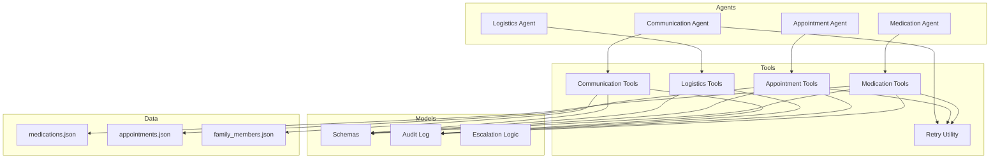
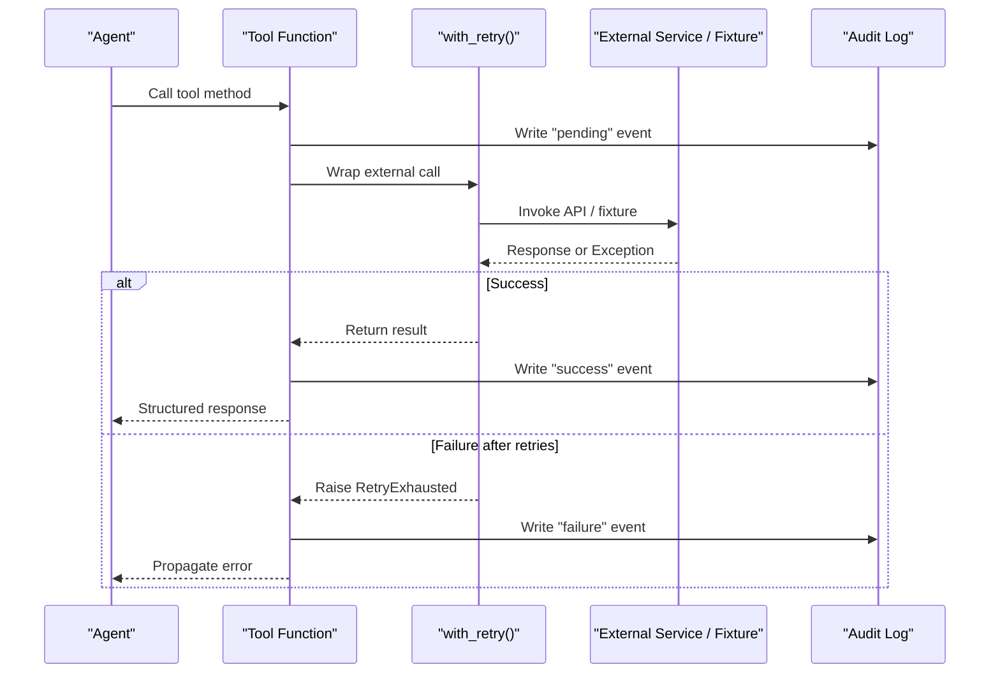
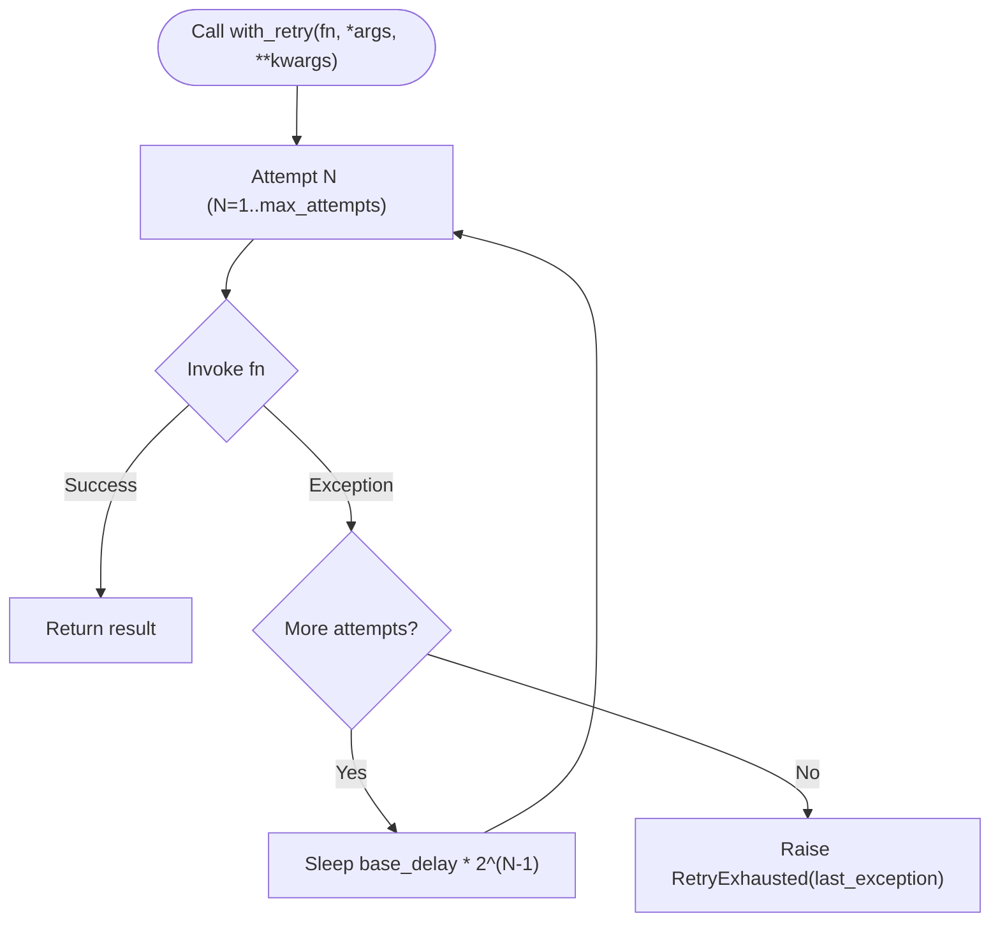
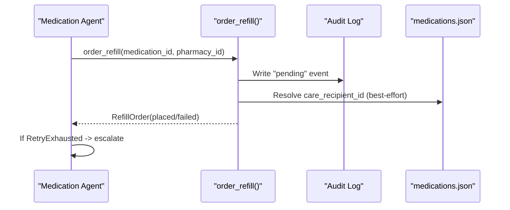
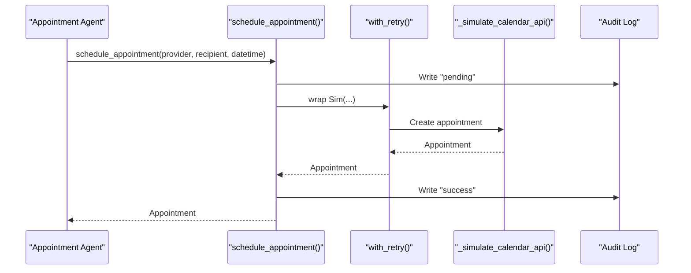
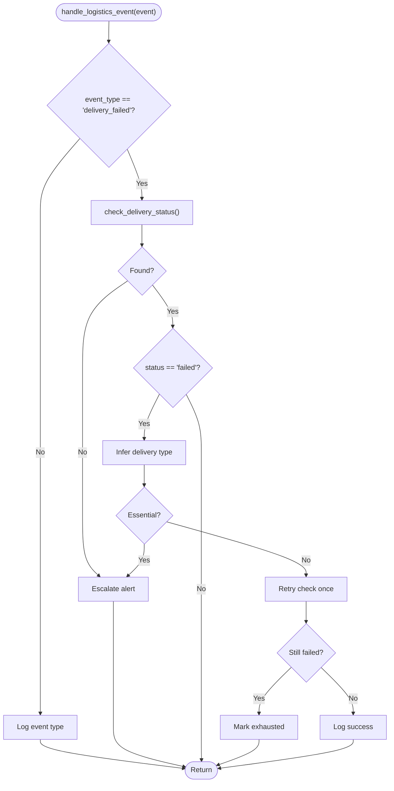
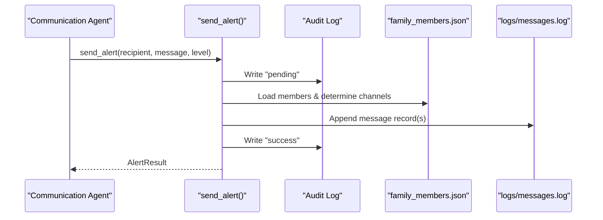
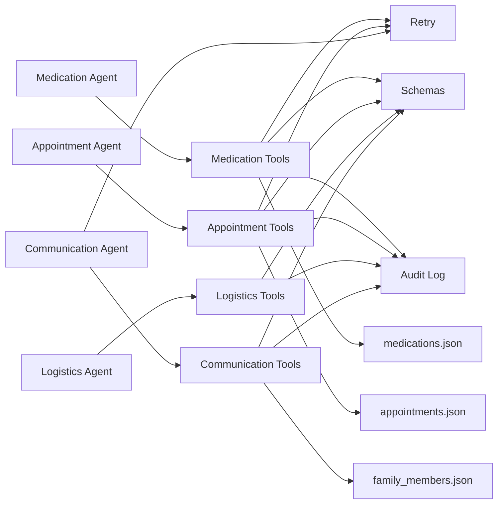

# External Integrations

<cite>
**Referenced Files in This Document**
- [retry.py](file://src/tools/retry.py)
- [medication_tools.py](file://src/tools/medication_tools.py)
- [appointment_tools.py](file://src/tools/appointment_tools.py)
- [logistics_tools.py](file://src/tools/logistics_tools.py)
- [communication_tools.py](file://src/tools/communication_tools.py)
- [medication_agent.py](file://src/agents/medication_agent.py)
- [appointment_agent.py](file://src/agents/appointment_agent.py)
- [logistics_agent.py](file://src/agents/logistics_agent.py)
- [communication_agent.py](file://src/agents/communication_agent.py)
- [schemas.py](file://src/models/schemas.py)
- [audit_log.py](file://src/models/audit_log.py)
- [escalation_logic.py](file://src/models/escalation_logic.py)
- [medications.json](file://fixtures/medications.json)
- [appointments.json](file://fixtures/appointments.json)
- [family_members.json](file://fixtures/family_members.json)
</cite>

## Table of Contents
1. Introduction
2. Project Structure
3. Core Components
4. Architecture Overview
5. Detailed Component Analysis
6. Dependency Analysis
7. Performance Considerations
8. Troubleshooting Guide
9. Conclusion
10. Appendices

## Introduction
This document describes CareBridge’s external integration layer: the tools abstraction that connects agents to external services (pharmacy, calendar, delivery, messaging). It explains how standardized tool interfaces hide service-specific details, how agents invoke tools, and how failures are handled with a shared retry mechanism. It also covers error handling strategies, timeout considerations, fallbacks, security considerations for API keys and authentication, and guidelines for adding new external services.

## Project Structure
CareBridge organizes integrations by domain under src/tools, with corresponding agents in src/agents orchestrating workflows and using shared models in src/models. Fixtures simulate external data for development and testing.

**Diagram sources**
- [medication_agent.py:23-134](file://src/agents/medication_agent.py#L23-L134)
- [appointment_agent.py:74-173](file://src/agents/appointment_agent.py#L74-L173)
- [logistics_agent.py:182-236](file://src/agents/logistics_agent.py#L182-L236)
- [communication_agent.py:28-163](file://src/agents/communication_agent.py#L28-L163)
- [medication_tools.py:1-208](file://src/tools/medication_tools.py#L1-L208)
- [appointment_tools.py:1-242](file://src/tools/appointment_tools.py#L1-L242)
- [logistics_tools.py:1-220](file://src/tools/logistics_tools.py#L1-L220)
- [communication_tools.py:1-279](file://src/tools/communication_tools.py#L1-L279)
- [retry.py:1-70](file://src/tools/retry.py#L1-L70)
- [schemas.py:1-150](file://src/models/schemas.py#L1-L150)
- [audit_log.py:1-167](file://src/models/audit_log.py#L1-L167)
- [medications.json:1-33](file://fixtures/medications.json#L1-L33)
- [appointments.json:1-33](file://fixtures/appointments.json#L1-L33)
- [family_members.json:1-30](file://fixtures/family_members.json#L1-L30)

**Section sources**
- [medication_agent.py:23-134](file://src/agents/medication_agent.py#L23-L134)
- [appointment_agent.py:74-173](file://src/agents/appointment_agent.py#L74-L173)
- [logistics_agent.py:182-236](file://src/agents/logistics_agent.py#L182-L236)
- [communication_agent.py:28-163](file://src/agents/communication_agent.py#L28-L163)
- [medication_tools.py:1-208](file://src/tools/medication_tools.py#L1-L208)
- [appointment_tools.py:1-242](file://src/tools/appointment_tools.py#L1-L242)
- [logistics_tools.py:1-220](file://src/tools/logistics_tools.py#L1-L220)
- [communication_tools.py:1-279](file://src/tools/communication_tools.py#L1-L279)
- [retry.py:1-70](file://src/tools/retry.py#L1-L70)
- [schemas.py:1-150](file://src/models/schemas.py#L1-L150)
- [audit_log.py:1-167](file://src/models/audit_log.py#L1-L167)

## Core Components
- Retry utility: A shared async/sync wrapper implementing exponential backoff with configurable attempts and base delay. It raises a specific exception when all attempts fail.
- Tool categories:
  - Medication tools: Pharmacy integration for refill checks, ordering refills, and adherence detection.
  - Appointment tools: Calendar connectivity for retrieving upcoming appointments, scheduling, and sending prep checklists.
  - Logistics tools: Delivery coordination for grocery and pharmacy deliveries, including status checks.
  - Communication tools: Messaging and notifications via SMS/email/phone, plus family preferences and status synthesis.
- Agents: Orchestrate tool usage, implement business rules, and handle escalation based on deterministic classification.
- Models: Pydantic schemas define consistent request/response contracts across components.
- Audit log: Immutable SQLite-backed audit trail capturing before/after outcomes for every action.
- Escalation logic: Hardcoded classification of actions into autonomous, alert, or approval paths.

Key responsibilities and interactions are illustrated below.

**Section sources**
- [retry.py:14-70](file://src/tools/retry.py#L14-L70)
- [medication_tools.py:34-208](file://src/tools/medication_tools.py#L34-L208)
- [appointment_tools.py:39-242](file://src/tools/appointment_tools.py#L39-L242)
- [logistics_tools.py:23-220](file://src/tools/logistics_tools.py#L23-L220)
- [communication_tools.py:54-279](file://src/tools/communication_tools.py#L54-L279)
- [schemas.py:13-150](file://src/models/schemas.py#L13-L150)
- [audit_log.py:81-167](file://src/models/audit_log.py#L81-L167)
- [escalation_logic.py:13-71](file://src/models/escalation_logic.py#L13-L71)

## Architecture Overview
The tool layer abstracts external APIs behind stable interfaces. Agents call tools; tools may read fixtures or call simulated MCP endpoints; all actions are audited. The retry utility centralizes resilience patterns.

**Diagram sources**
- [appointment_tools.py:117-200](file://src/tools/appointment_tools.py#L117-L200)
- [medication_tools.py:65-152](file://src/tools/medication_tools.py#L65-L152)
- [communication_tools.py:54-157](file://src/tools/communication_tools.py#L54-L157)
- [retry.py:22-70](file://src/tools/retry.py#L22-L70)
- [audit_log.py:81-129](file://src/models/audit_log.py#L81-L129)

## Detailed Component Analysis

### Retry Mechanism (retry.py)
- Purpose: Provide uniform retry behavior for transient failures across tools.
- Behavior:
  - Supports both sync and async functions.
  - Default configuration: 3 attempts with exponential backoff (base_delay=1.0s yields delays of 1s, 2s).
  - Logs warnings per failed attempt and errors on exhaustion.
  - Raises a dedicated exception carrying the last exception for callers to handle consistently.
- Usage pattern:
  - Wrap any external call that may be transiently unavailable.
  - Catch RetryExhausted at agent boundaries to trigger escalation or fallback.

**Diagram sources**
- [retry.py:22-70](file://src/tools/retry.py#L22-L70)

**Section sources**
- [retry.py:14-70](file://src/tools/retry.py#L14-L70)

### Medication Tools (Pharmacy Integration)
- Capabilities:
  - Check refill eligibility based on days remaining vs threshold.
  - Order refills with pre/post audit events and structured responses.
  - Detect adherence patterns and flag deviations for escalation.
- Data source: medications.json provides medication records and thresholds.
- Error handling:
  - Missing IDs raise ValueError.
  - Refill ordering returns a structured order with status and optional failure reason; exceptions are logged and followed by failure audit events.
- Agent integration:
  - Medication agent wraps order_refill with with_retry and escalates on RetryExhausted.

**Diagram sources**
- [medication_tools.py:65-152](file://src/tools/medication_tools.py#L65-L152)
- [medication_agent.py:137-159](file://src/agents/medication_agent.py#L137-L159)
- [medications.json:1-33](file://fixtures/medications.json#L1-L33)

**Section sources**
- [medication_tools.py:24-208](file://src/tools/medication_tools.py#L24-L208)
- [medication_agent.py:23-134](file://src/agents/medication_agent.py#L23-L134)
- [medications.json:1-33](file://fixtures/medications.json#L1-L33)

### Appointment Tools (Calendar Connectivity)
- Capabilities:
  - Retrieve upcoming appointments within a horizon.
  - Schedule appointments with retry and audit trails.
  - Send preparation checklists for near-term appointments.
- Data source: appointments.json provides scheduled entries and prep requirements.
- Error handling:
  - Missing recipients or appointments raise ValueError.
  - Scheduling failures raise RuntimeError after retries; audit captures failure outcome.

**Diagram sources**
- [appointment_tools.py:117-200](file://src/tools/appointment_tools.py#L117-L200)
- [appointment_tools.py:83-115](file://src/tools/appointment_tools.py#L83-L115)
- [audit_log.py:81-129](file://src/models/audit_log.py#L81-L129)

**Section sources**
- [appointment_tools.py:25-242](file://src/tools/appointment_tools.py#L25-L242)
- [appointment_agent.py:25-173](file://src/agents/appointment_agent.py#L25-L173)
- [appointments.json:1-33](file://fixtures/appointments.json#L1-L33)

### Logistics Tools (Delivery Coordination)
- Capabilities:
  - Check delivery status from delivery history.
  - Place grocery and pharmacy delivery orders with audit trails.
- Error handling:
  - Unknown delivery IDs raise ValueError.
  - Order placement logs and audits success or failure; exceptions propagate as RuntimeError.
- Agent integration:
  - Logistics agent classifies essential vs non-essential failures and applies escalation or retry accordingly.

**Diagram sources**
- [logistics_agent.py:23-153](file://src/agents/logistics_agent.py#L23-L153)
- [logistics_tools.py:23-220](file://src/tools/logistics_tools.py#L23-L220)

**Section sources**
- [logistics_tools.py:23-220](file://src/tools/logistics_tools.py#L23-L220)
- [logistics_agent.py:23-236](file://src/agents/logistics_agent.py#L23-L236)

### Communication Tools (SMS/Email Messaging)
- Capabilities:
  - Send alerts at different levels (info/alert/emergency) with channel selection.
  - Synthesize status summaries from audit events and pending actions.
  - Load family preferences and build escalation order.
- Data sources:
  - family_members.json defines members, contact info, and priorities.
  - logs/messages.log persists message records for simulation.
- Error handling:
  - Messaging failures raise RuntimeError; audit captures failure outcome.
  - Info-level events are queued for daily digest rather than immediate dispatch.

**Diagram sources**
- [communication_tools.py:54-157](file://src/tools/communication_tools.py#L54-L157)
- [communication_tools.py:32-52](file://src/tools/communication_tools.py#L32-L52)
- [family_members.json:1-30](file://fixtures/family_members.json#L1-L30)
- [audit_log.py:81-129](file://src/models/audit_log.py#L81-L129)

**Section sources**
- [communication_tools.py:54-279](file://src/tools/communication_tools.py#L54-L279)
- [communication_agent.py:28-163](file://src/agents/communication_agent.py#L28-L163)
- [family_members.json:1-30](file://fixtures/family_members.json#L1-L30)

### Protocol-Specific Examples (How Agents Invoke Tools)
- Medication flow:
  - Agent calls check_refill_status; if eligible, calls process_refill which wraps order_refill with with_retry; handles RetryExhausted by escalating.
- Appointment flow:
  - Agent retrieves calendar; for near-term appointments sends prep checklist; flags logistics needs for transportation-required appointments; schedules appointments with retry and audit.
- Logistics flow:
  - On delivery_failed events, agent checks status; essential failures escalate immediately; non-essential failures retry once and log outcomes.
- Communication flow:
  - Based on level, agent routes to send_family_alert; emergency/alert levels set escalation; info-level events are queued for digest.

These flows ensure consistent auditing, resilient retries, and deterministic escalation.

**Section sources**
- [medication_agent.py:23-134](file://src/agents/medication_agent.py#L23-L134)
- [appointment_agent.py:74-173](file://src/agents/appointment_agent.py#L74-L173)
- [logistics_agent.py:182-236](file://src/agents/logistics_agent.py#L182-L236)
- [communication_agent.py:28-163](file://src/agents/communication_agent.py#L28-L163)

## Dependency Analysis
- Coupling:
  - Agents depend on tools for external interactions.
  - Tools depend on models (schemas), audit logging, and fixtures; some use retry.
  - Escalation logic is used by agents and tools to classify actions deterministically.
- Cohesion:
  - Each tool module encapsulates a single domain (medication, appointment, logistics, communication).
  - Retry utility is centralized to avoid duplicated retry logic.
- External dependencies:
  - Fixtures provide realistic data for development/testing.
  - Audit log uses SQLite for immutable event storage.

**Diagram sources**
- [medication_agent.py:23-134](file://src/agents/medication_agent.py#L23-L134)
- [appointment_agent.py:74-173](file://src/agents/appointment_agent.py#L74-L173)
- [logistics_agent.py:182-236](file://src/agents/logistics_agent.py#L182-L236)
- [communication_agent.py:28-163](file://src/agents/communication_agent.py#L28-L163)
- [medication_tools.py:1-208](file://src/tools/medication_tools.py#L1-L208)
- [appointment_tools.py:1-242](file://src/tools/appointment_tools.py#L1-L242)
- [logistics_tools.py:1-220](file://src/tools/logistics_tools.py#L1-L220)
- [communication_tools.py:1-279](file://src/tools/communication_tools.py#L1-L279)
- [retry.py:1-70](file://src/tools/retry.py#L1-L70)
- [schemas.py:1-150](file://src/models/schemas.py#L1-L150)
- [audit_log.py:1-167](file://src/models/audit_log.py#L1-L167)
- [medications.json:1-33](file://fixtures/medications.json#L1-L33)
- [appointments.json:1-33](file://fixtures/appointments.json#L1-L33)
- [family_members.json:1-30](file://fixtures/family_members.json#L1-L30)

**Section sources**
- [schemas.py:1-150](file://src/models/schemas.py#L1-L150)
- [audit_log.py:1-167](file://src/models/audit_log.py#L1-L167)
- [escalation_logic.py:13-71](file://src/models/escalation_logic.py#L13-L71)

## Performance Considerations
- Retry strategy:
  - Exponential backoff reduces load on failing services and improves recovery chances.
  - Default parameters (3 attempts, base_delay=1s) balance responsiveness and resilience.
- I/O patterns:
  - Fixture reads are synchronous and lightweight; consider caching if datasets grow.
  - Audit writes are append-only; ensure database path is writable and disk space is sufficient.
- Timeouts:
  - Current implementations do not enforce explicit timeouts on external calls; add timeout wrappers around real MCP calls to prevent hangs.
- Concurrency:
  - Async tool functions allow parallelization where appropriate; ensure retry sleeps do not block event loops excessively.

[No sources needed since this section provides general guidance]

## Troubleshooting Guide
Common issues and resolutions:
- Missing identifiers:
  - ValueError raised when medication_id, appointment_id, or delivery_id not found in fixtures. Validate inputs and fixture completeness.
- Retry exhaustion:
  - RetryExhausted indicates all attempts failed; inspect logs for underlying exceptions and consider increasing max_attempts or base_delay.
- Audit inconsistencies:
  - Ensure “pending” events are written before external calls and “success”/“failure” events follow. Use correlation_id to trace related events.
- Escalation misclassification:
  - Verify action types against escalation sets; unknown actions default to “approve” for safety.

Operational tips:
- Monitor logs/ directory for message logs and review audit.db for event traces.
- For transient failures, adjust retry parameters in with_retry calls to match service SLAs.

**Section sources**
- [medication_tools.py:34-63](file://src/tools/medication_tools.py#L34-L63)
- [appointment_tools.py:39-80](file://src/tools/appointment_tools.py#L39-L80)
- [logistics_tools.py:23-54](file://src/tools/logistics_tools.py#L23-L54)
- [communication_tools.py:54-157](file://src/tools/communication_tools.py#L54-L157)
- [retry.py:22-70](file://src/tools/retry.py#L22-L70)
- [audit_log.py:81-167](file://src/models/audit_log.py#L81-L167)
- [escalation_logic.py:42-71](file://src/models/escalation_logic.py#L42-L71)

## Conclusion
CareBridge’s tool layer provides a robust, auditable, and resilient abstraction over external services. Standardized schemas, deterministic escalation, and centralized retry logic ensure consistent behavior across domains. Agents orchestrate workflows while tools encapsulate service interactions, enabling safe evolution to real MCP integrations. Following the established patterns simplifies adding new services and maintaining reliability.

[No sources needed since this section summarizes without analyzing specific files]

## Appendices

### Adding a New External Service (Integration Guidelines)
- Define schemas:
  - Add Pydantic models in schemas.py for requests/responses to maintain contract consistency.
- Implement tool function:
  - Create a function in the appropriate tools module that:
    - Reads fixtures or calls an external endpoint.
    - Writes a “pending” audit event before execution.
    - Wraps external calls with with_retry for resilience.
    - Writes “success” or “failure” audit events after execution.
    - Returns structured model instances.
- Integrate with agents:
  - Update relevant agent to call the new tool and handle RetryExhausted appropriately.
  - Classify action type using escalation_logic to determine autonomy, alert, or approval requirements.
- Testing:
  - Add or update fixtures to cover typical scenarios and edge cases.
  - Verify audit trail completeness and correctness using correlation_id.

Security considerations:
- API key management:
  - Store secrets in environment variables or secure secret managers; never hardcode keys in code or fixtures.
  - Inject credentials into tool functions via configuration or dependency injection.
- Authentication patterns:
  - Use token-based auth (e.g., OAuth2 client credentials) for MCP servers; refresh tokens as needed.
  - Enforce least privilege scopes for each integration.
- Auditing and compliance:
  - Ensure all sensitive operations produce audit events with rationale and outcomes.
  - Protect audit.db and logs from unauthorized access.

Timeouts and fallbacks:
- Configure timeouts for network calls to prevent resource leaks.
- Implement fallbacks such as local caching or graceful degradation when services are unavailable.
- Use RetryExhausted to trigger fallback workflows or escalate to human operators.

**Section sources**
- [schemas.py:13-150](file://src/models/schemas.py#L13-L150)
- [medication_tools.py:65-152](file://src/tools/medication_tools.py#L65-L152)
- [appointment_tools.py:117-200](file://src/tools/appointment_tools.py#L117-L200)
- [logistics_tools.py:56-220](file://src/tools/logistics_tools.py#L56-L220)
- [communication_tools.py:54-157](file://src/tools/communication_tools.py#L54-L157)
- [retry.py:22-70](file://src/tools/retry.py#L22-L70)
- [audit_log.py:81-167](file://src/models/audit_log.py#L81-L167)
- [escalation_logic.py:42-71](file://src/models/escalation_logic.py#L42-L71)