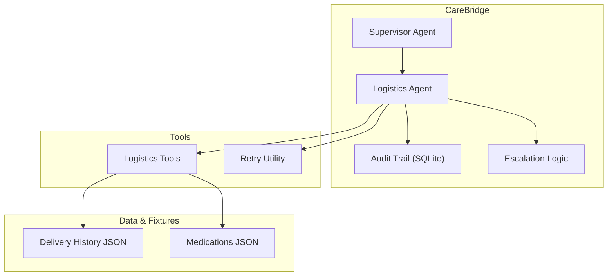
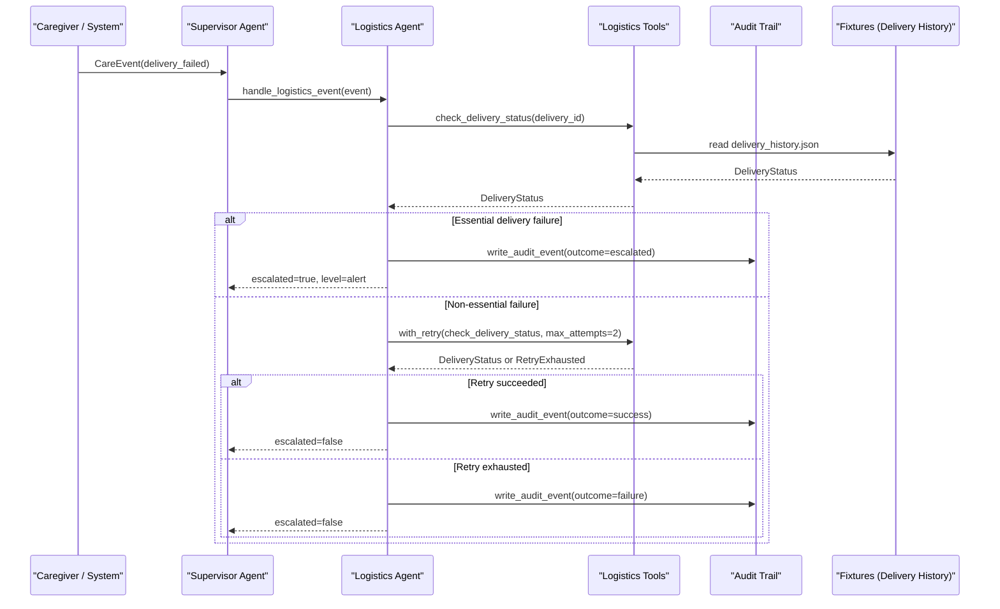
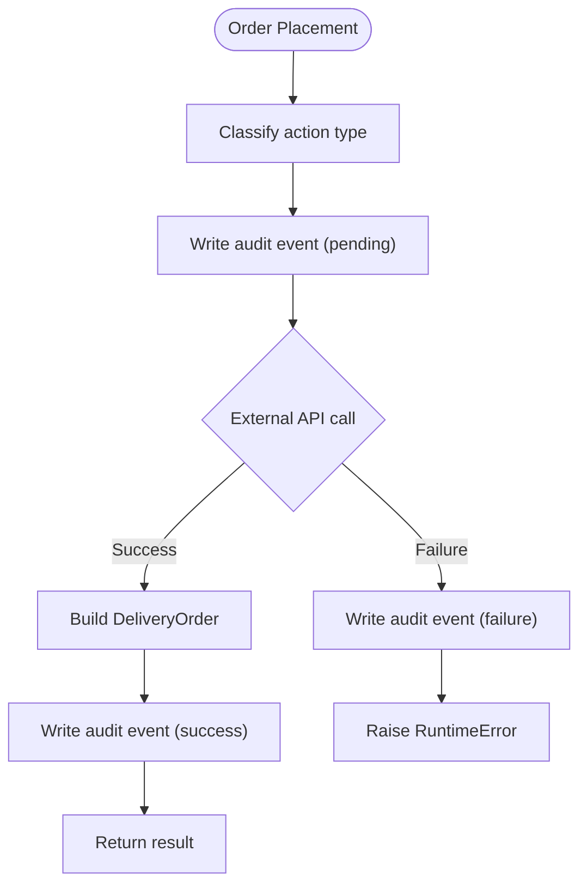
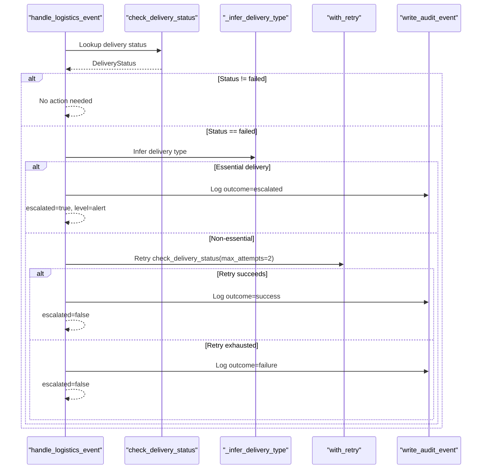
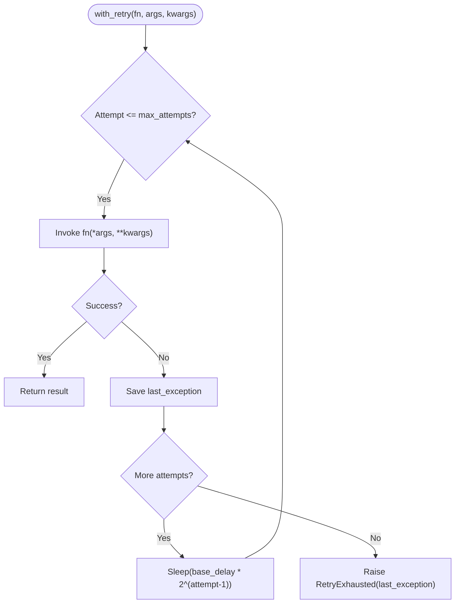
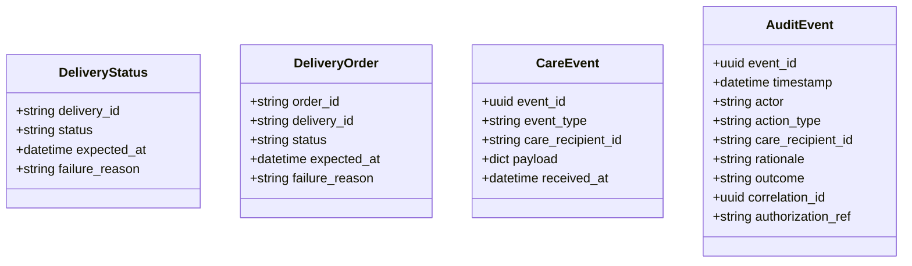
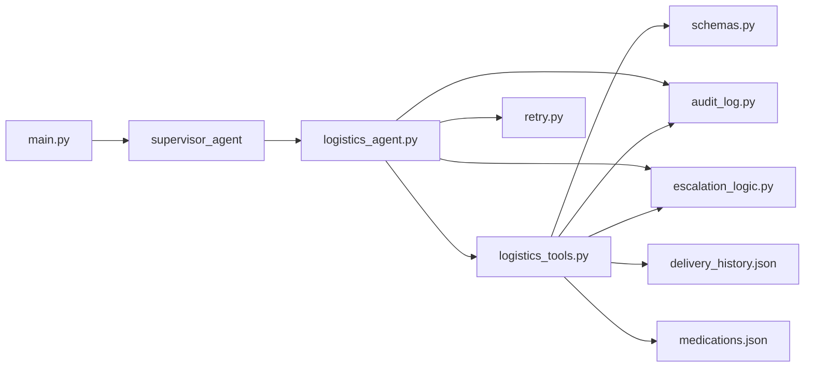

# Logistics Tools

<cite>
**Referenced Files in This Document**
- [logistics_tools.py](file://src/tools/logistics_tools.py)
- [logistics_agent.py](file://src/agents/logistics_agent.py)
- [retry.py](file://src/tools/retry.py)
- [schemas.py](file://src/models/schemas.py)
- [audit_log.py](file://src/models/audit_log.py)
- [escalation_logic.py](file://src/models/escalation_logic.py)
- [delivery_history.json](file://fixtures/delivery_history.json)
- [medications.json](file://fixtures/medications.json)
- [test_logistics_agent.py](file://tests/test_logistics_agent.py)
- [main.py](file://main.py)
- [architecture.md](file://architecture.md)
- [AGENTS.md](file://AGENTS.md)
</cite>

## Table of Contents
1. [Introduction](#introduction)
2. [Project Structure](#project-structure)
3. [Core Components](#core-components)
4. [Architecture Overview](#architecture-overview)
5. [Detailed Component Analysis](#detailed-component-analysis)
6. [Dependency Analysis](#dependency-analysis)
7. [Performance Considerations](#performance-considerations)
8. [Troubleshooting Guide](#troubleshooting-guide)
9. [Conclusion](#conclusion)

## Introduction
This document explains CareBridge’s logistics tools for delivery service coordination, focusing on pharmacy delivery ordering, grocery delivery coordination, and package tracking capabilities. It details how the system integrates with delivery service APIs (currently simulated via fixtures), manages supply chain operations for elderly care, and implements robust retry mechanisms for failed deliveries and service interruptions. It also provides examples of automated workflows including order placement, status monitoring, exception handling, integration patterns with multiple providers, fallback strategies, address validation considerations, route optimization notes, and delivery confirmation processes. Finally, it includes troubleshooting guidance for common delivery issues and provider connectivity problems.

## Project Structure
The logistics capability is implemented across agents and tools:
- Agents coordinate events and apply escalation rules.
- Tools perform domain actions such as placing orders and checking delivery status.
- Models define shared data structures and audit logging.
- Fixtures simulate external services for development and testing.

**Diagram sources**
- [architecture.md:10-75](file://architecture.md#L10-L75)
- [logistics_agent.py:1-20](file://src/agents/logistics_agent.py#L1-L20)
- [logistics_tools.py:1-20](file://src/tools/logistics_tools.py#L1-L20)
- [retry.py:1-15](file://src/tools/retry.py#L1-L15)
- [delivery_history.json:1-33](file://fixtures/delivery_history.json#L1-L33)
- [medications.json:1-33](file://fixtures/medications.json#L1-L33)

**Section sources**
- [architecture.md:10-75](file://architecture.md#L10-L75)
- [main.py:92-140](file://main.py#L92-L140)

## Core Components
- Logistics Tools: Provide functions to check delivery status, place grocery orders, and place pharmacy delivery orders. They write audit events before and after execution and simulate external API calls using fixtures.
- Logistics Agent: Processes logistics-related events, applies escalation rules for essential vs non-essential deliveries, and coordinates retries when appropriate.
- Retry Utility: Provides a standardized retry mechanism with exponential backoff for both sync and async functions.
- Schemas: Define Pydantic models for delivery statuses and orders used throughout the system.
- Audit Log: Immutable SQLite-backed audit trail ensuring every action is recorded before execution.
- Escalation Logic: Deterministic classification of actions into auto/alert/approve categories.

Key responsibilities:
- Order placement: Grocery and pharmacy delivery ordering with audit trails.
- Status monitoring: Querying delivery status from fixture-based history.
- Failure handling: Essential delivery failures escalate immediately; non-essential failures are retried once.
- Integration readiness: Designed to swap in real delivery MCP servers later.

**Section sources**
- [logistics_tools.py:23-220](file://src/tools/logistics_tools.py#L23-L220)
- [logistics_agent.py:23-153](file://src/agents/logistics_agent.py#L23-L153)
- [retry.py:14-70](file://src/tools/retry.py#L14-L70)
- [schemas.py:96-109](file://src/models/schemas.py#L96-L109)
- [audit_log.py:81-130](file://src/models/audit_log.py#L81-L130)
- [escalation_logic.py:13-71](file://src/models/escalation_logic.py#L13-L71)

## Architecture Overview
CareBridge uses an agent-as-tools pattern where the Supervisor orchestrates specialized agents. The Logistics Agent handles delivery events and delegates to Logistics Tools for order placement and status checks. External integrations are abstracted via MCP servers; currently, delivery APIs are simulated with fixtures.

**Diagram sources**
- [logistics_agent.py:182-236](file://src/agents/logistics_agent.py#L182-L236)
- [logistics_tools.py:23-53](file://src/tools/logistics_tools.py#L23-L53)
- [retry.py:22-70](file://src/tools/retry.py#L22-L70)
- [delivery_history.json:1-33](file://fixtures/delivery_history.json#L1-L33)

**Section sources**
- [architecture.md:79-117](file://architecture.md#L79-L117)
- [logistics_agent.py:182-236](file://src/agents/logistics_agent.py#L182-L236)

## Detailed Component Analysis

### Logistics Tools
Responsibilities:
- Check delivery status by reading from fixture-based delivery history.
- Place grocery orders and pharmacy delivery orders, simulating external API calls.
- Write audit events before and after execution to ensure traceability.
- Classify actions deterministically to determine alert requirements.

Key functions:
- check_delivery_status: Returns structured DeliveryStatus based on delivery_id lookup.
- order_grocery: Places a grocery order, generates IDs, sets expected arrival time, and audits success/failure.
- order_pharmacy_delivery: Places a pharmacy delivery order, resolves care recipient from medications fixture, and audits outcomes.

Error handling:
- Raises ValueError if delivery not found.
- Wraps external call failures with RuntimeError and logs errors.

Integration points:
- Reads from delivery_history.json and medications.json.
- Writes to immutable audit log.
- Uses deterministic escalation classifier.

**Diagram sources**
- [logistics_tools.py:56-129](file://src/tools/logistics_tools.py#L56-L129)
- [logistics_tools.py:131-220](file://src/tools/logistics_tools.py#L131-L220)
- [escalation_logic.py:42-71](file://src/models/escalation_logic.py#L42-L71)
- [audit_log.py:81-130](file://src/models/audit_log.py#L81-L130)

**Section sources**
- [logistics_tools.py:23-220](file://src/tools/logistics_tools.py#L23-L220)
- [delivery_history.json:1-33](file://fixtures/delivery_history.json#L1-L33)
- [medications.json:1-33](file://fixtures/medications.json#L1-L33)
- [audit_log.py:81-130](file://src/models/audit_log.py#L81-L130)
- [escalation_logic.py:42-71](file://src/models/escalation_logic.py#L42-L71)

### Logistics Agent
Responsibilities:
- Process logistics events, particularly delivery failures.
- Determine whether a delivery is essential (pharmacy, medication, food, grocery) and escalate immediately if so.
- For non-essential failures, attempt one retry using the shared retry utility.
- Record all actions in the audit trail and return structured results indicating escalation needs.

Key behaviors:
- _infer_delivery_type: Infers delivery type from fixture records to decide escalation path.
- process_delivery_failure: Orchestrates status checks, escalation decisions, and retries.
- handle_logistics_event: Routes events and aggregates actions taken.

**Diagram sources**
- [logistics_agent.py:23-153](file://src/agents/logistics_agent.py#L23-L153)
- [logistics_agent.py:155-180](file://src/agents/logistics_agent.py#L155-L180)
- [retry.py:22-70](file://src/tools/retry.py#L22-L70)
- [audit_log.py:81-130](file://src/models/audit_log.py#L81-L130)

**Section sources**
- [logistics_agent.py:23-153](file://src/agents/logistics_agent.py#L23-L153)
- [logistics_agent.py:155-180](file://src/agents/logistics_agent.py#L155-L180)
- [retry.py:22-70](file://src/tools/retry.py#L22-L70)

### Retry Mechanism
Implementation:
- with_retry supports both sync and async functions with configurable max attempts and base delay.
- Exponential backoff delays: base_delay * 2^(attempt-1).
- On exhaustion, raises RetryExhausted with the last exception attached.

Usage in logistics:
- Non-essential delivery failures trigger a single retry of status checks to confirm transient issues.
- Ensures consistent retry behavior across the system per AGENTS.md guidelines.

**Diagram sources**
- [retry.py:22-70](file://src/tools/retry.py#L22-L70)

**Section sources**
- [retry.py:1-70](file://src/tools/retry.py#L1-L70)
- [AGENTS.md:79-85](file://AGENTS.md#L79-L85)

### Data Models and Audit Trail
Models:
- DeliveryStatus and DeliveryOrder define structured outputs for status checks and order placements.
- CareEvent represents incoming logistics events.

Audit trail:
- Every action writes a “before” audit event with outcome=pending prior to execution.
- Subsequent events record final outcomes (success/failure/escalated).
- Database schema enforces immutability via triggers preventing updates/deletes.

**Diagram sources**
- [schemas.py:44-109](file://src/models/schemas.py#L44-L109)
- [audit_log.py:19-78](file://src/models/audit_log.py#L19-L78)

**Section sources**
- [schemas.py:44-109](file://src/models/schemas.py#L44-L109)
- [audit_log.py:19-130](file://src/models/audit_log.py#L19-L130)

### Integration Patterns and Fallback Strategies
Current state:
- External delivery APIs are simulated via fixtures for development and testing.
- The architecture documents plan for MCP servers to integrate real providers (pharmacy, messaging, delivery, calendar).

Fallback strategy:
- If delivery API unavailable, notify caregiver to place order manually and log to audit trail.
- Ensure no silent failures; every failure is logged and communicated.

Provider abstraction:
- Tools are designed to be swapped with real MCP implementations without changing agent logic.
- Classification and escalation remain deterministic and independent of provider specifics.

**Section sources**
- [architecture.md:211-260](file://architecture.md#L211-L260)
- [AGENTS.md:154-163](file://AGENTS.md#L154-L163)
- [logistics_tools.py:1-6](file://src/tools/logistics_tools.py#L1-L6)

### Address Validation, Route Optimization, and Delivery Confirmation
Address validation:
- Not implemented in current code; tools accept delivery_address strings without validation.
- Recommendation: Add address normalization and validation before order placement to reduce failed deliveries due to invalid addresses.

Route optimization:
- Not implemented; order placement simulates expected arrival times.
- Recommendation: Integrate with provider routing APIs to compute optimal routes and update expected_at accordingly.

Delivery confirmation:
- Status transitions include delivered/in_transit/pending/failed; confirmation occurs when status becomes delivered.
- Recommendation: Implement webhook or polling mechanisms to capture delivery confirmation events and update audit trail.

[No sources needed since this section provides general guidance]

## Dependency Analysis
Components and relationships:
- Logistics Agent depends on Logistics Tools, Retry Utility, Audit Log, and Escalation Logic.
- Logistics Tools depend on Schemas, Audit Log, Escalation Logic, and Fixture files.
- Main entry point initializes audit DB, loads fixtures, and runs demo scenarios that exercise logistics flows.

**Diagram sources**
- [main.py:92-140](file://main.py#L92-L140)
- [logistics_agent.py:1-20](file://src/agents/logistics_agent.py#L1-L20)
- [logistics_tools.py:1-20](file://src/tools/logistics_tools.py#L1-L20)
- [retry.py:1-15](file://src/tools/retry.py#L1-L15)
- [audit_log.py:1-15](file://src/models/audit_log.py#L1-L15)
- [escalation_logic.py:1-12](file://src/models/escalation_logic.py#L1-L12)
- [delivery_history.json:1-33](file://fixtures/delivery_history.json#L1-L33)
- [medications.json:1-33](file://fixtures/medications.json#L1-L33)

**Section sources**
- [main.py:92-140](file://main.py#L92-L140)
- [logistics_agent.py:1-20](file://src/agents/logistics_agent.py#L1-L20)
- [logistics_tools.py:1-20](file://src/tools/logistics_tools.py#L1-L20)

## Performance Considerations
- Fixture-based lookups are fast but limited to test/dev environments; production should use efficient database queries or caching for delivery status.
- Retry backoff prevents overwhelming external APIs during transient failures.
- Audit log writes are synchronous; consider batching or asynchronous writes in high-throughput scenarios.
- Avoid unnecessary fixture reads by caching delivery history in memory for repeated checks within a session.

[No sources needed since this section provides general guidance]

## Troubleshooting Guide
Common issues and resolutions:
- Delivery not found:
  - Symptom: ValueError raised when checking status for unknown delivery_id.
  - Resolution: Verify delivery_id exists in delivery_history.json or ensure proper creation flow.
- Missing delivery_id in event:
  - Symptom: Event processing escalates due to missing payload field.
  - Resolution: Ensure events include required delivery_id; add validation at ingestion.
- Provider connectivity problems:
  - Symptom: External API call fails; tool raises RuntimeError.
  - Resolution: Use retry mechanism; if exhausted, escalate and notify caregiver to place order manually per fallback strategy.
- Audit log write failures:
  - Symptom: Exception when writing audit events.
  - Resolution: Ensure audit.db is initialized and writable; check permissions and disk space.

Testing references:
- Unit tests cover happy paths and failure scenarios for logistics tools and agent handlers.
- Tests validate escalation behavior for essential vs non-essential deliveries and missing fields.

**Section sources**
- [logistics_tools.py:23-53](file://src/tools/logistics_tools.py#L23-L53)
- [logistics_agent.py:205-220](file://src/agents/logistics_agent.py#L205-L220)
- [test_logistics_agent.py:18-48](file://tests/test_logistics_agent.py#L18-L48)
- [test_logistics_agent.py:113-148](file://tests/test_logistics_agent.py#L113-L148)
- [audit_log.py:19-78](file://src/models/audit_log.py#L19-L78)

## Conclusion
CareBridge’s logistics tools provide a solid foundation for coordinating pharmacy and grocery deliveries, tracking package status, and handling failures through deterministic escalation and retry mechanisms. While current integrations rely on fixtures, the architecture is designed to seamlessly transition to real delivery service APIs via MCP servers. By enforcing audit-before-action, immutable logs, and clear escalation policies, the system ensures reliability and accountability in critical care coordination workflows. Future enhancements should include address validation, route optimization, and robust delivery confirmation processes to further improve operational efficiency and user experience.