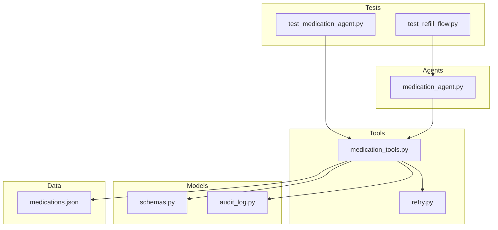
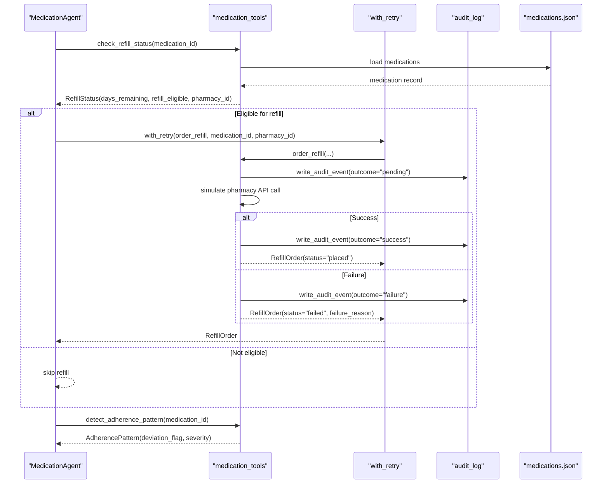
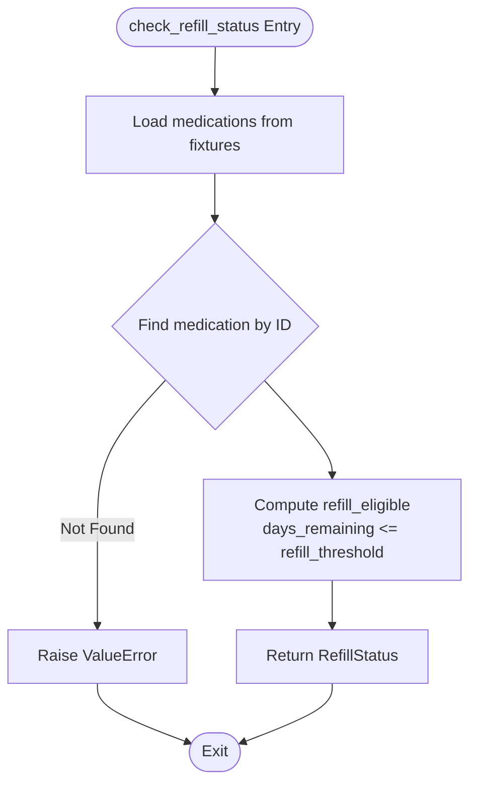
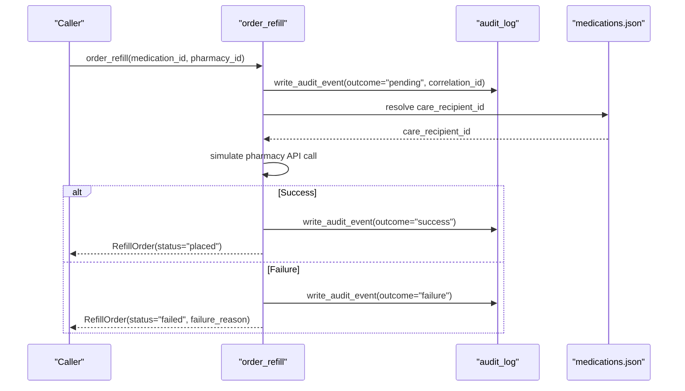
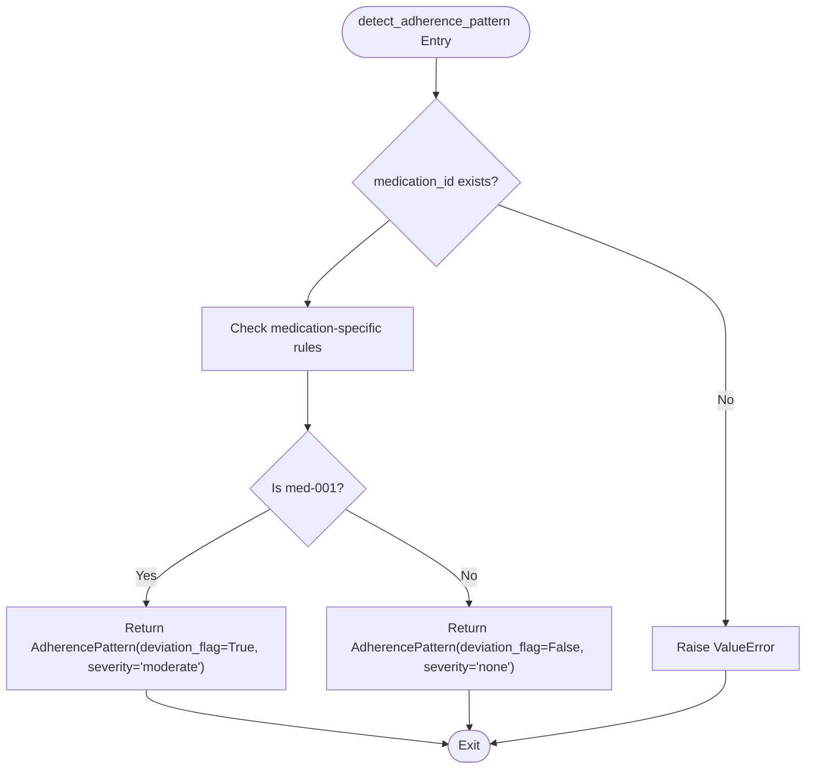
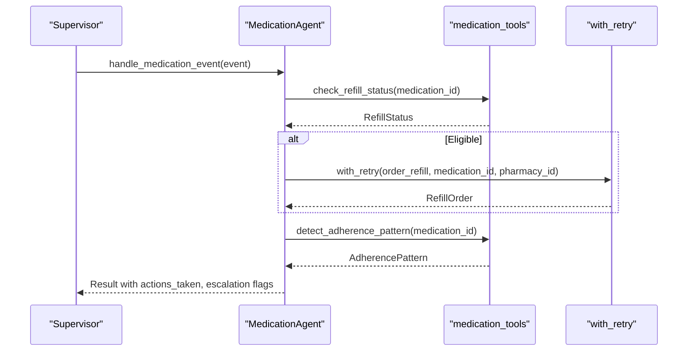
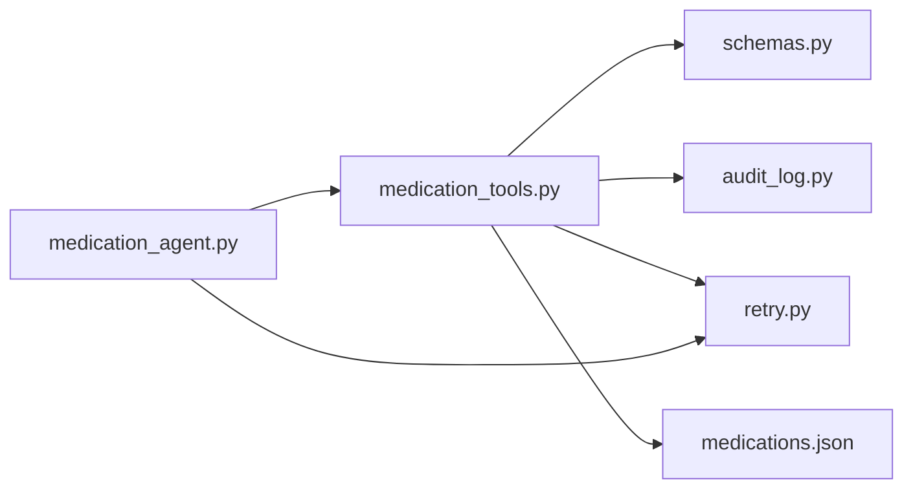

# Medication Tools

<cite>
**Referenced Files in This Document**
- [medication_tools.py](file://src/tools/medication_tools.py)
- [medications.json](file://fixtures/medications.json)
- [audit_log.py](file://src/models/audit_log.py)
- [schemas.py](file://src/models/schemas.py)
- [retry.py](file://src/tools/retry.py)
- [medication_agent.py](file://src/agents/medication_agent.py)
- [test_medication_agent.py](file://tests/test_medication_agent.py)
- [test_refill_flow.py](file://tests/integration/test_refill_flow.py)
- [architecture.md](file://architecture.md)
</cite>

## Table of Contents
1. [Introduction](#introduction)
2. [Project Structure](#project-structure)
3. [Core Components](#core-components)
4. [Architecture Overview](#architecture-overview)
5. [Detailed Component Analysis](#detailed-component-analysis)
6. [Dependency Analysis](#dependency-analysis)
7. [Performance Considerations](#performance-considerations)
8. [Troubleshooting Guide](#troubleshooting-guide)
9. [Security and Privacy Considerations](#security-and-privacy-considerations)
10. [Conclusion](#conclusion)

## Introduction
This document explains CareBridge’s medication tools that integrate with pharmacy services to manage refills, monitor inventory levels, and analyze adherence patterns. The tools provide three core functions:
- check_refill_status: monitors medication inventory levels and determines refill eligibility based on days remaining versus a configurable threshold.
- order_refill: places prescription orders with an audit trail that records pending events before API calls and success/failure outcomes after.
- detect_adherence_pattern: analyzes medication compliance over a time window and flags deviations for escalation.

The implementation currently uses fixture data to simulate external pharmacy APIs, enabling development and testing without live integrations. A planned transition to a real MCP-based pharmacy integration is documented, including how the standardized interfaces will remain unchanged while swapping out the underlying transport.

## Project Structure
The medication tools are implemented under src/tools and orchestrated by agents under src/agents. Shared models and utilities reside under src/models and src/tools respectively. Fixture data for development lives under fixtures. Tests validate behavior at both unit and integration levels.

**Diagram sources**
- [medication_tools.py:1-208](file://src/tools/medication_tools.py#L1-L208)
- [retry.py:1-70](file://src/tools/retry.py#L1-L70)
- [schemas.py:1-150](file://src/models/schemas.py#L1-L150)
- [audit_log.py:1-167](file://src/models/audit_log.py#L1-L167)
- [medication_agent.py:1-189](file://src/agents/medication_agent.py#L1-L189)
- [medications.json:1-33](file://fixtures/medications.json#L1-L33)
- [test_medication_agent.py:1-177](file://tests/test_medication_agent.py#L1-L177)
- [test_refill_flow.py:1-82](file://tests/integration/test_refill_flow.py#L1-L82)

**Section sources**
- [medication_tools.py:1-208](file://src/tools/medication_tools.py#L1-L208)
- [medication_agent.py:1-189](file://src/agents/medication_agent.py#L1-L189)
- [schemas.py:1-150](file://src/models/schemas.py#L1-L150)
- [audit_log.py:1-167](file://src/models/audit_log.py#L1-L167)
- [retry.py:1-70](file://src/tools/retry.py#L1-L70)
- [medications.json:1-33](file://fixtures/medications.json#L1-L33)
- [test_medication_agent.py:1-177](file://tests/test_medication_agent.py#L1-L177)
- [test_refill_flow.py:1-82](file://tests/integration/test_refill_flow.py#L1-L82)

## Core Components
- check_refill_status(medication_id): Loads medication fixtures and computes refill eligibility by comparing days_remaining to refill_threshold. Returns a RefillStatus model containing medication_id, days_remaining, refill_eligible, and pharmacy_id. Raises ValueError if the medication is not found.
- order_refill(medication_id, pharmacy_id): Asynchronous function that writes a pending audit event before attempting the pharmacy API call (currently simulated), then writes a follow-up event with outcome success or failure. Returns a RefillOrder model with order_id, status, estimated_delivery, and optional failure_reason.
- detect_adherence_pattern(medication_id, window_days=7): Analyzes adherence over a time window using fixture-driven logic. For specific medications (e.g., med-001), it simulates missed/late doses and returns deviation_flag and severity; otherwise returns good adherence.

These functions abstract external pharmacy services behind stable interfaces. Currently, they read from fixtures/medications.json and simulate API responses. The design supports replacing the simulation with a real MCP pharmacy integration without changing caller code.

**Section sources**
- [medication_tools.py:34-63](file://src/tools/medication_tools.py#L34-L63)
- [medication_tools.py:65-153](file://src/tools/medication_tools.py#L65-L153)
- [medication_tools.py:155-208](file://src/tools/medication_tools.py#L155-L208)
- [medications.json:1-33](file://fixtures/medications.json#L1-L33)
- [schemas.py:73-94](file://src/models/schemas.py#L73-L94)

## Architecture Overview
The medication tools are invoked by the Medication Agent, which orchestrates refill checks, ordering with retry, and adherence detection. Audit logging is integrated into order_refill to ensure every action has a complete trace.

**Diagram sources**
- [medication_agent.py:23-134](file://src/agents/medication_agent.py#L23-L134)
- [medication_tools.py:34-208](file://src/tools/medication_tools.py#L34-L208)
- [retry.py:22-70](file://src/tools/retry.py#L22-L70)
- [audit_log.py:81-131](file://src/models/audit_log.py#L81-L131)
- [medications.json:1-33](file://fixtures/medications.json#L1-L33)

## Detailed Component Analysis

### check_refill_status
- Purpose: Determine whether a medication is eligible for refill based on days_remaining vs refill_threshold.
- Data source: fixtures/medications.json.
- Logic:
  - Load all medications.
  - Find the record matching medication_id.
  - Compute refill_eligible = days_remaining <= refill_threshold.
  - Return RefillStatus with pharmacy_id for downstream ordering.
- Error handling: Raises ValueError when medication_id is not found.

Refill eligibility examples derived from fixtures:
- med-001 (Lisinopril): days_remaining=3, refill_threshold=5 → eligible=True.
- med-002 (Metformin): days_remaining=15, refill_threshold=5 → eligible=False.
- med-003 (Atorvastatin): days_remaining=8, refill_threshold=5 → eligible=False.

**Diagram sources**
- [medication_tools.py:34-63](file://src/tools/medication_tools.py#L34-L63)
- [medications.json:1-33](file://fixtures/medications.json#L1-L33)

**Section sources**
- [medication_tools.py:34-63](file://src/tools/medication_tools.py#L34-L63)
- [medications.json:1-33](file://fixtures/medications.json#L1-L33)
- [test_medication_agent.py:19-40](file://tests/test_medication_agent.py#L19-L40)

### order_refill
- Purpose: Place a refill order with an immutable audit trail.
- Audit-first pattern:
  - Writes a pending audit event before any API call.
  - Resolves care_recipient_id from fixtures for accurate auditing.
  - On success, writes a follow-up event with outcome="success".
  - On failure, writes a follow-up event with outcome="failure".
- Current implementation: Simulates pharmacy API call; returns a RefillOrder with status "placed" or "failed".
- Integration with retry: The Medication Agent wraps this function with with_retry to handle transient failures.

**Diagram sources**
- [medication_tools.py:65-153](file://src/tools/medication_tools.py#L65-L153)
- [audit_log.py:81-131](file://src/models/audit_log.py#L81-L131)
- [medications.json:1-33](file://fixtures/medications.json#L1-L33)

**Section sources**
- [medication_tools.py:65-153](file://src/tools/medication_tools.py#L65-L153)
- [audit_log.py:81-131](file://src/models/audit_log.py#L81-L131)
- [test_medication_agent.py:42-77](file://tests/test_medication_agent.py#L42-L77)

### detect_adherence_pattern
- Purpose: Analyze adherence over a time window and flag deviations.
- Logic:
  - Validates medication_id exists in fixtures.
  - For med-001, simulates moderate deviation with missed_doses and late_doses.
  - For other medications, returns good adherence.
- Output: AdherencePattern with deviation_flag and severity used by the agent to determine escalation.

**Diagram sources**
- [medication_tools.py:155-208](file://src/tools/medication_tools.py#L155-L208)
- [medications.json:1-33](file://fixtures/medications.json#L1-L33)

**Section sources**
- [medication_tools.py:155-208](file://src/tools/medication_tools.py#L155-L208)
- [test_medication_agent.py:79-99](file://tests/test_medication_agent.py#L79-L99)

### Medication Agent Orchestration
- handle_medication_event:
  - Step 1: Check refill status.
  - Step 2: If eligible, process refill via process_refill (wraps order_refill with retry).
  - Step 3: Detect adherence pattern and log alerts for moderate/severe deviations.
  - Step 4: Evaluate escalation requirements based on refill failures and adherence deviations.
- process_refill: Uses with_retry to attempt order_refill up to 3 times with exponential backoff.
- check_and_flag_adherence: Synchronous wrapper around detect_adherence_pattern with alerting logs.

**Diagram sources**
- [medication_agent.py:23-134](file://src/agents/medication_agent.py#L23-L134)
- [medication_agent.py:137-189](file://src/agents/medication_agent.py#L137-L189)
- [retry.py:22-70](file://src/tools/retry.py#L22-L70)
- [medication_tools.py:34-208](file://src/tools/medication_tools.py#L34-L208)

**Section sources**
- [medication_agent.py:23-189](file://src/agents/medication_agent.py#L23-L189)
- [retry.py:22-70](file://src/tools/retry.py#L22-L70)

## Dependency Analysis
- medication_tools depends on:
  - schemas for structured return types (RefillStatus, RefillOrder, AdherencePattern).
  - audit_log for immutable audit events.
  - retry for resilient API calls.
  - fixtures for mock pharmacy data.
- medication_agent depends on:
  - medication_tools for core functionality.
  - retry for orchestration-level retries.
  - escalation_logic for classifying actions (imported but not analyzed here).
- audit_log provides:
  - init_audit_db to set schema and immutability triggers.
  - write_audit_event to append-only record events.
  - get_audit_events for querying by care_recipient_id or correlation_id.

**Diagram sources**
- [medication_tools.py:1-208](file://src/tools/medication_tools.py#L1-L208)
- [medication_agent.py:1-189](file://src/agents/medication_agent.py#L1-L189)
- [schemas.py:1-150](file://src/models/schemas.py#L1-L150)
- [audit_log.py:1-167](file://src/models/audit_log.py#L1-L167)
- [retry.py:1-70](file://src/tools/retry.py#L1-L70)
- [medications.json:1-33](file://fixtures/medications.json#L1-L33)

**Section sources**
- [medication_tools.py:1-208](file://src/tools/medication_tools.py#L1-L208)
- [medication_agent.py:1-189](file://src/agents/medication_agent.py#L1-L189)
- [schemas.py:1-150](file://src/models/schemas.py#L1-L150)
- [audit_log.py:1-167](file://src/models/audit_log.py#L1-L167)
- [retry.py:1-70](file://src/tools/retry.py#L1-L70)
- [medications.json:1-33](file://fixtures/medications.json#L1-L33)

## Performance Considerations
- Fixture loading: Each tool call loads fixtures from disk. Consider caching the loaded list per process to avoid repeated I/O.
- Retry strategy: with_retry uses exponential backoff (1s, 2s, 4s) across 3 attempts. This mitigates transient failures but adds latency; tune base_delay and max_attempts if needed.
- Audit logging: SQLite writes are append-only and protected by triggers. Ensure database initialization occurs once per process to avoid overhead.
- Asynchronous operations: order_refill is async; ensure callers use async contexts to avoid blocking.

[No sources needed since this section provides general guidance]

## Troubleshooting Guide
Common issues and resolutions:
- Medication not found:
  - Symptoms: ValueError raised by check_refill_status or detect_adherence_pattern.
  - Resolution: Verify medication_id exists in fixtures/medications.json.
- Missing medication_id in event payload:
  - Symptoms: Agent returns error actions and no processing.
  - Resolution: Ensure CareEvent includes payload.medication_id.
- API failures during refill:
  - Symptoms: order_refill returns RefillOrder(status="failed") with failure_reason; audit trail shows outcome="failure".
  - Resolution: Inspect logs and audit events; retry may succeed on transient errors.
- Retry exhaustion:
  - Symptoms: RetryExhausted raised by with_retry; agent sets escalation_required=True and escalation_level="alert".
  - Resolution: Investigate persistent failures; escalate to human review.

**Section sources**
- [medication_tools.py:34-63](file://src/tools/medication_tools.py#L34-L63)
- [medication_tools.py:65-153](file://src/tools/medication_tools.py#L65-L153)
- [medication_agent.py:23-134](file://src/agents/medication_agent.py#L23-L134)
- [retry.py:14-70](file://src/tools/retry.py#L14-L70)
- [test_medication_agent.py:141-177](file://tests/test_medication_agent.py#L141-L177)

## Security and Privacy Considerations
- Authentication:
  - When transitioning to a real MCP pharmacy integration, authenticate requests using secure credentials (e.g., bearer tokens) configured via environment variables or secrets management.
  - Avoid hardcoding tokens in source; use configuration files or secure vaults.
- Data privacy:
  - Audit events include care_recipient_id and rationale; ensure access controls limit who can query audit logs.
  - Minimize sensitive data in logs; redact PHI where possible.
  - Use HTTPS for all external API calls and enforce certificate validation.
- Immutability:
  - Audit events are append-only with SQLite triggers preventing updates/deletes; preserve integrity for compliance and auditing.
- Testing with fixtures:
  - Fixture data should not contain real PHI; use synthetic identifiers and values for development and tests.

[No sources needed since this section provides general guidance]

## Conclusion
CareBridge’s medication tools provide a robust abstraction over pharmacy services, enabling refill monitoring, ordering with comprehensive audit trails, and adherence analysis. The current fixture-based approach supports rapid development and testing, while the architecture facilitates a seamless transition to a real MCP pharmacy integration. Standardized interfaces, immutable audit logging, and retry mechanisms ensure reliability, observability, and maintainability.

[No sources needed since this section summarizes without analyzing specific files]