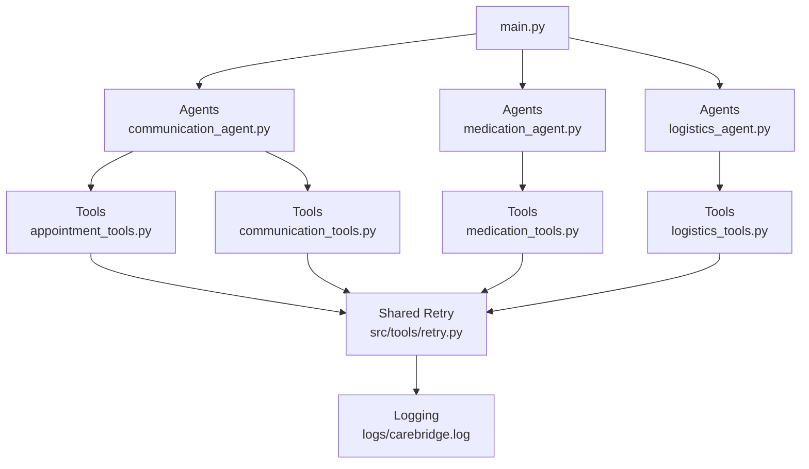
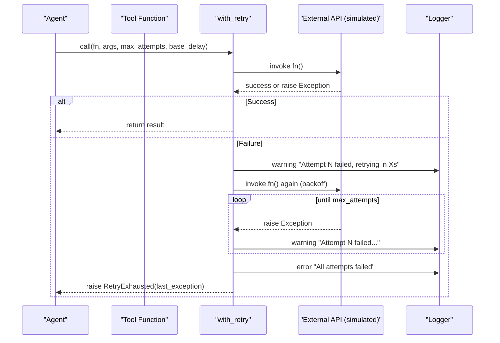
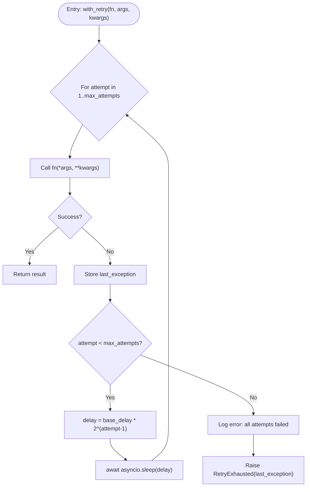
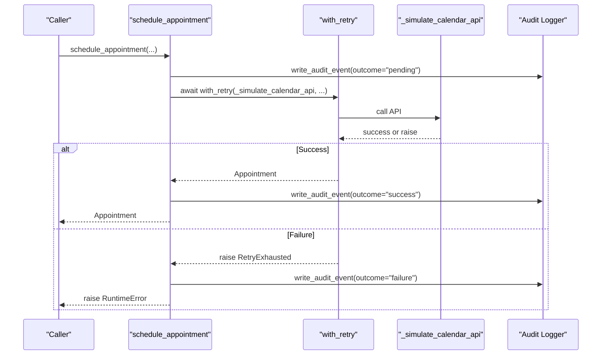
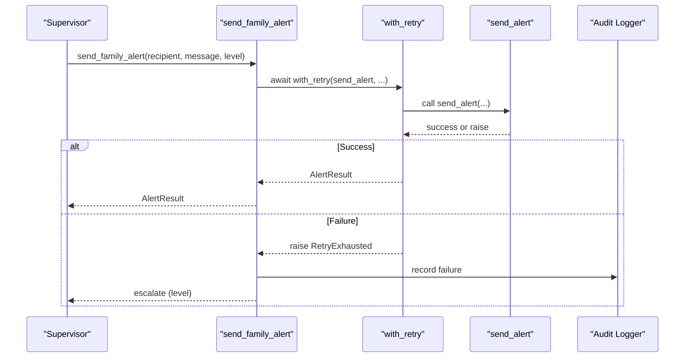
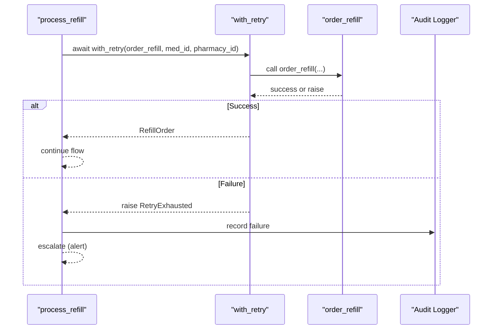
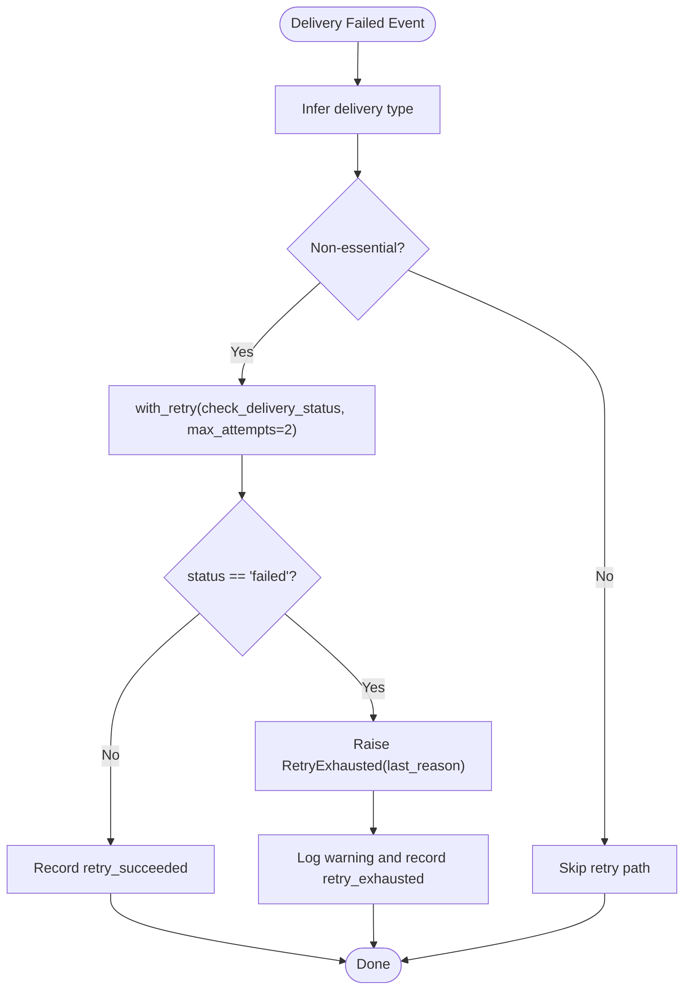
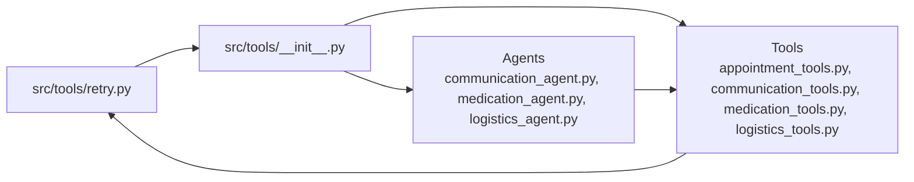

# Retry Mechanism

<cite>
**Referenced Files in This Document**
- [retry.py](file://src/tools/retry.py)
- [tools/__init__.py](file://src/tools/__init__.py)
- [appointment_tools.py](file://src/tools/appointment_tools.py)
- [communication_agent.py](file://src/agents/communication_agent.py)
- [medication_agent.py](file://src/agents/medication_agent.py)
- [logistics_agent.py](file://src/agents/logistics_agent.py)
- [main.py](file://main.py)
</cite>

## Table of Contents
1. [Introduction](#introduction)
2. [Project Structure](#project-structure)
3. [Core Components](#core-components)
4. [Architecture Overview](#architecture-overview)
5. [Detailed Component Analysis](#detailed-component-analysis)
6. [Dependency Analysis](#dependency-analysis)
7. [Performance Considerations](#performance-considerations)
8. [Troubleshooting Guide](#troubleshooting-guide)
9. [Conclusion](#conclusion)
10. [Appendices](#appendices)

## Introduction
This document explains CareBridge’s retry mechanism for handling transient failures during external tool calls. It focuses on the exponential backoff implementation, the with_retry decorator pattern, and the RetryExhausted exception handling used across agents and tools. It also provides guidance on configuration options (attempts, delays), failure classification strategies, integration points with external APIs, examples of usage patterns, best practices for retriable vs non-retriable errors, circuit breaker considerations, monitoring/logging, and tuning parameters based on service characteristics.

## Project Structure
CareBridge centralizes retry logic in a shared utility and exposes it via the tools package. Agents and tools wrap external API calls with this utility to ensure resilience against transient network issues and service unavailability. The main entry point initializes logging and orchestrates demo scenarios that exercise these paths.

**Diagram sources**
- [main.py:143-182](file://main.py#L143-L182)
- [communication_agent.py:118-146](file://src/agents/communication_agent.py#L118-L146)
- [medication_agent.py:137-159](file://src/agents/medication_agent.py#L137-L159)
- [logistics_agent.py:100-152](file://src/agents/logistics_agent.py#L100-L152)
- [appointment_tools.py:117-200](file://src/tools/appointment_tools.py#L117-L200)
- [retry.py:22-69](file://src/tools/retry.py#L22-L69)

**Section sources**
- [main.py:143-182](file://main.py#L143-L182)
- [tools/__init__.py:1-6](file://src/tools/__init__.py#L1-L6)

## Core Components
- RetryExhausted exception: Raised when all retry attempts fail; carries the last exception for diagnostics.
- with_retry helper: Wraps async or sync functions with exponential backoff, configurable attempts and base delay, logs each attempt and final failure, and raises RetryExhausted on exhaustion.
- Tools package export: Re-exports with_retry and RetryExhausted for consistent use across agents and tools.

Key behaviors:
- Exponential backoff: delay = base_delay * 2^(attempt - 1). Default base_delay is 1.0 seconds, producing 1s, 2s, 4s between attempts.
- Logging: Warning logs per failed attempt with retry timing; error log on final failure.
- Exception propagation: Only RetryExhausted is raised after exhausting retries; callers can catch and escalate accordingly.

**Section sources**
- [retry.py:14-69](file://src/tools/retry.py#L14-L69)
- [tools/__init__.py:1-6](file://src/tools/__init__.py#L1-L6)

## Architecture Overview
The retry mechanism integrates into external tool calls at the boundary where network or service interactions occur. Agents orchestrate business flows and delegate to tools; tools perform the actual calls (currently simulated) and rely on with_retry for resilience. When retries are exhausted, agents handle escalation and audit logging consistently.

**Diagram sources**
- [retry.py:22-69](file://src/tools/retry.py#L22-L69)
- [appointment_tools.py:117-200](file://src/tools/appointment_tools.py#L117-L200)
- [communication_agent.py:118-146](file://src/agents/communication_agent.py#L118-L146)
- [medication_agent.py:137-159](file://src/agents/medication_agent.py#L137-L159)
- [logistics_agent.py:100-152](file://src/agents/logistics_agent.py#L100-L152)

## Detailed Component Analysis

### Retry Utility: with_retry and RetryExhausted
- Purpose: Provide uniform retry behavior for both async and sync functions with exponential backoff.
- Configuration:
  - max_attempts: Number of total attempts (default 3).
  - base_delay: Base delay in seconds (default 1.0); backoff multiplies by powers of two.
- Behavior:
  - Detects coroutine functions and awaits appropriately.
  - Logs warnings per failed attempt including delay before next retry.
  - On final failure, logs an error and raises RetryExhausted carrying the last exception.
- Integration:
  - Exported via tools package for consistent import across agents and tools.

**Diagram sources**
- [retry.py:22-69](file://src/tools/retry.py#L22-L69)

**Section sources**
- [retry.py:14-69](file://src/tools/retry.py#L14-L69)
- [tools/__init__.py:1-6](file://src/tools/__init__.py#L1-L6)

### Appointment Tools: Scheduling with Retry
- Usage: schedule_appointment wraps the simulated calendar API call using with_retry.
- Audit trail: Writes pending audit event before execution and success/failure events after.
- Error handling: Converts final failure to RuntimeError after retries, preserving context.

**Diagram sources**
- [appointment_tools.py:117-200](file://src/tools/appointment_tools.py#L117-L200)
- [retry.py:22-69](file://src/tools/retry.py#L22-L69)

**Section sources**
- [appointment_tools.py:117-200](file://src/tools/appointment_tools.py#L117-L200)

### Communication Agent: Alerting with Retry and Escalation
- Usage: send_family_alert wraps send_alert with with_retry to ensure resilient messaging.
- Escalation: Agents catch RetryExhausted and mark escalation_required with appropriate level.
- Audit trail: Alerts write pending/success/failure audit events around the operation.

**Diagram sources**
- [communication_agent.py:118-146](file://src/agents/communication_agent.py#L118-L146)
- [retry.py:22-69](file://src/tools/retry.py#L22-L69)

**Section sources**
- [communication_agent.py:60-163](file://src/agents/communication_agent.py#L60-L163)

### Medication Agent: Refill Ordering with Retry
- Usage: process_refill wraps order_refill with with_retry for pharmacy API calls.
- Escalation: Catch RetryExhausted and set escalation_required with alert level.
- Audit trail: order_refill writes pending/success/failure audit events internally.

**Diagram sources**
- [medication_agent.py:137-159](file://src/agents/medication_agent.py#L137-L159)
- [retry.py:22-69](file://src/tools/retry.py#L22-L69)

**Section sources**
- [medication_agent.py:80-189](file://src/agents/medication_agent.py#L80-L189)

### Logistics Agent: Delivery Failure Handling with Custom Retry
- Usage: For non-essential delivery failures, logistics_agent uses with_retry with custom max_attempts=2 to re-check status.
- Policy: If status remains failed after retries, constructs RetryExhausted with last failure reason and logs accordingly.
- Audit trail: Records retry_attempted, retry_succeeded, or retry_exhausted outcomes.

**Diagram sources**
- [logistics_agent.py:100-152](file://src/agents/logistics_agent.py#L100-L152)
- [retry.py:22-69](file://src/tools/retry.py#L22-L69)

**Section sources**
- [logistics_agent.py:100-152](file://src/agents/logistics_agent.py#L100-L152)

## Dependency Analysis
- Centralized dependency: All agents and tools depend on src/tools/retry.py for retry behavior.
- Package-level exposure: src/tools/__init__.py re-exports with_retry and RetryExhausted for clean imports.
- Coupling: Agents are decoupled from retry internals; they only consume the public interface.
- External integrations: Tools currently simulate external APIs; future MCP-based integrations will benefit from the same retry layer.

**Diagram sources**
- [retry.py:22-69](file://src/tools/retry.py#L22-L69)
- [tools/__init__.py:1-6](file://src/tools/__init__.py#L1-L6)
- [communication_agent.py:118-146](file://src/agents/communication_agent.py#L118-L146)
- [medication_agent.py:137-159](file://src/agents/medication_agent.py#L137-L159)
- [logistics_agent.py:100-152](file://src/agents/logistics_agent.py#L100-L152)
- [appointment_tools.py:117-200](file://src/tools/appointment_tools.py#L117-L200)

**Section sources**
- [tools/__init__.py:1-6](file://src/tools/__init__.py#L1-L6)
- [retry.py:22-69](file://src/tools/retry.py#L22-L69)

## Performance Considerations
- Backoff strategy: Exponential backoff reduces load on failing services and avoids thundering herds. Default base_delay of 1.0 yields 1s, 2s, 4s gaps.
- Attempt limits: Default max_attempts=3 balances resilience and latency; adjust per service SLA and failure rates.
- Async sleep: Non-blocking waits prevent thread contention while waiting for backoff intervals.
- Logging overhead: Each retry logs warnings; ensure log levels and sinks are tuned to avoid performance impact under high throughput.

[No sources needed since this section provides general guidance]

## Troubleshooting Guide
Common issues and how to diagnose them:
- RetryExhausted exceptions: Indicates all attempts failed; inspect last_exception for root cause (network timeout, service unavailable, etc.).
- Missing fixtures: Some tools read fixture files; missing files cause errors before retry logic applies. Ensure required fixtures exist at startup.
- Audit trail gaps: Verify audit events are written for pending/success/failure states to trace lifecycle and pinpoint failures.
- Logging visibility: Check logs/carebridge.log for retry warnings and final errors; correlate timestamps with external service outages.

Operational steps:
- Increase max_attempts or base_delay temporarily for known unstable services.
- Add circuit breaker wrappers around external calls if repeated failures persist.
- Use correlation_id from audit events to trace end-to-end flows across agents and tools.

**Section sources**
- [main.py:19-31](file://main.py#L19-L31)
- [appointment_tools.py:117-200](file://src/tools/appointment_tools.py#L117-L200)
- [communication_agent.py:60-163](file://src/agents/communication_agent.py#L60-L163)
- [medication_agent.py:80-189](file://src/agents/medication_agent.py#L80-L189)
- [logistics_agent.py:100-152](file://src/agents/logistics_agent.py#L100-L152)

## Conclusion
CareBridge’s retry mechanism provides a consistent, configurable approach to handling transient failures across external tool calls. The with_retry helper implements exponential backoff and surfaces failures via RetryExhausted, enabling agents to escalate and audit appropriately. By centralizing retry logic and integrating it into tools and agents, CareBridge improves resilience and operational visibility. Tuning parameters and adopting circuit breaker patterns can further enhance reliability under adverse conditions.

[No sources needed since this section summarizes without analyzing specific files]

## Appendices

### Configuration Options Summary
- max_attempts: Total number of attempts (default 3). Adjust based on service stability and acceptable latency.
- base_delay: Base delay in seconds (default 1.0). Controls backoff spacing; higher values reduce pressure on failing services.
- Failure classification: Identify retriable errors (e.g., timeouts, 5xx) vs non-retriable (e.g., 4xx client errors). Wrap external calls to classify and decide whether to retry or fail fast.

[No sources needed since this section provides general guidance]

### Best Practices
- Retriable vs non-retriable errors:
  - Retriable: Network timeouts, temporary service unavailability, rate limiting with retry-after headers.
  - Non-retriable: Invalid input, authorization failures, permanent resource not found.
- Circuit breaker pattern:
  - Add a circuit breaker around external calls to short-circuit requests during prolonged outages.
  - Combine with retry to avoid cascading failures and reduce load on degraded services.
- Monitoring and logging:
  - Log each retry attempt with delay and error details.
  - Emit metrics: retry counts, failure rates, time-to-success, and circuit breaker state transitions.
  - Correlate events using correlation_id across audit logs and application logs.

[No sources needed since this section provides general guidance]

### Examples of Implementing Retry Logic
- Appointment scheduling: Wrap simulated calendar API call with with_retry; capture audit events for pending/success/failure.
- Family alerts: Wrap messaging API call with with_retry; escalate on RetryExhausted and record audit events.
- Medication refill: Wrap pharmacy API call with with_retry; escalate on RetryExhausted and record audit events.
- Delivery checks: Use with_retry with custom max_attempts to re-check delivery status; construct RetryExhausted if still failed.

**Section sources**
- [appointment_tools.py:117-200](file://src/tools/appointment_tools.py#L117-L200)
- [communication_agent.py:118-146](file://src/agents/communication_agent.py#L118-L146)
- [medication_agent.py:137-159](file://src/agents/medication_agent.py#L137-L159)
- [logistics_agent.py:100-152](file://src/agents/logistics_agent.py#L100-L152)