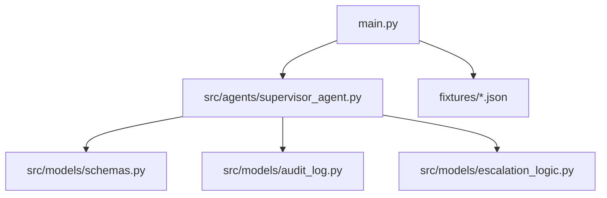
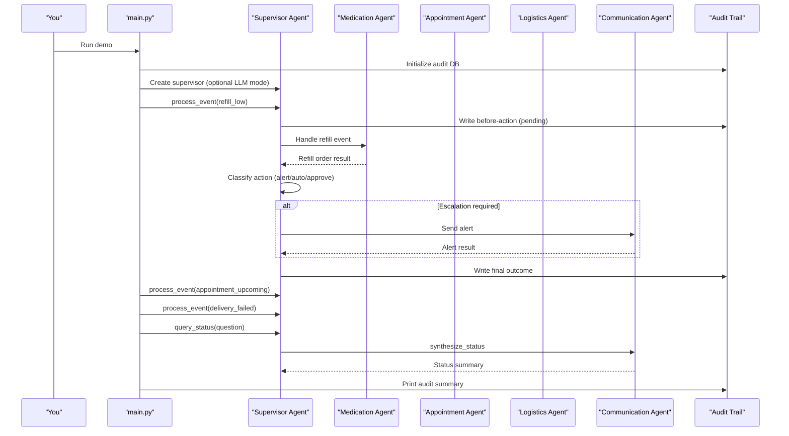
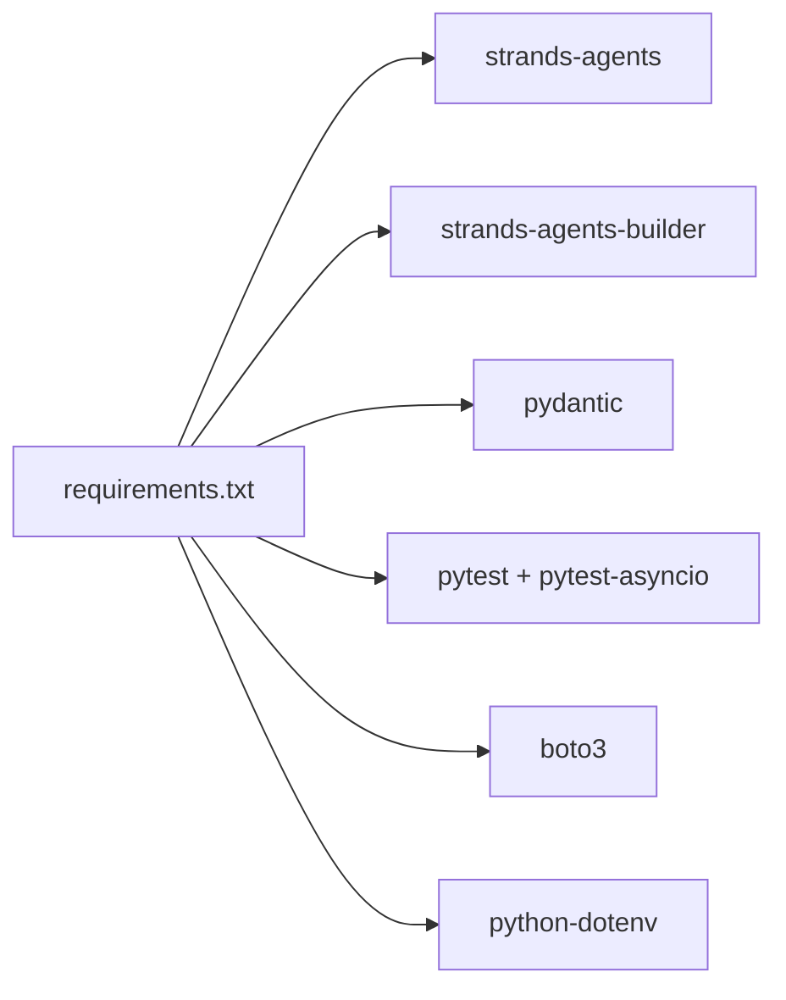

# Getting Started

<cite>
**Referenced Files in This Document**
- [main.py](file://main.py)
- [requirements.txt](file://requirements.txt)
- [pyproject.toml](file://pyproject.toml)
- [architecture.md](file://architecture.md)
- [SPEC.md](file://SPEC.md)
- [AGENTS.md](file://AGENTS.md)
- [src/models/schemas.py](file://src/models/schemas.py)
- [src/agents/supervisor_agent.py](file://src/agents/supervisor_agent.py)
- [src/models/audit_log.py](file://src/models/audit_log.py)
- [src/models/escalation_logic.py](file://src/models/escalation_logic.py)
</cite>

## Table of Contents
1. Introduction
2. Project Structure
3. Core Components
4. Architecture Overview
5. Detailed Component Analysis
6. Dependency Analysis
7. Performance Considerations
8. Troubleshooting Guide
9. Conclusion
10. Appendices

## Introduction
CareBridge is an AI-powered care coordination system that orchestrates specialized agents to manage medication refills, appointments, deliveries, and family communications. The application includes a demo scenario that processes several care events end-to-end and prints a concise audit summary. This guide helps you set up the environment, run the demo, and understand basic usage patterns for event processing and status queries.

## Project Structure
The repository is organized into clear layers:
- Entry point and demo runner at the root
- Agents (Supervisor and specialists) under src/agents
- Shared data models under src/models
- Tools for external integrations under src/tools
- Fixtures for mock data under fixtures
- Tests under tests
- Configuration files such as requirements.txt and pyproject.toml

**Diagram sources**
- [main.py:1-182](file://main.py#L1-L182)
- [src/agents/supervisor_agent.py:1-641](file://src/agents/supervisor_agent.py#L1-L641)
- [src/models/schemas.py:1-150](file://src/models/schemas.py#L1-L150)
- [src/models/audit_log.py:1-167](file://src/models/audit_log.py#L1-L167)
- [src/models/escalation_logic.py:1-71](file://src/models/escalation_logic.py#L1-L71)

**Section sources**
- [main.py:1-182](file://main.py#L1-L182)
- [architecture.md:430-499](file://architecture.md#L430-L499)

## Core Components
- Supervisor Agent: Orchestrates routing, escalation decisions, and audit logging. Provides process_event and query_status APIs used by the demo.
- Data Models: Pydantic v2 schemas define structured inputs/outputs for all agent interactions.
- Audit Trail: Immutable SQLite-backed log capturing every action with rationale and outcome.
- Escalation Logic: Deterministic classification of actions into auto, alert, or approve categories.

Key responsibilities:
- Event routing to specialized agents (medication, appointment, logistics, communication)
- Deterministic escalation based on policy rules
- Immutable audit trail before and after actions
- Graceful fallback when optional LLM orchestration is unavailable

**Section sources**
- [src/agents/supervisor_agent.py:1-641](file://src/agents/supervisor_agent.py#L1-L641)
- [src/models/schemas.py:1-150](file://src/models/schemas.py#L1-L150)
- [src/models/audit_log.py:1-167](file://src/models/audit_log.py#L1-L167)
- [src/models/escalation_logic.py:1-71](file://src/models/escalation_logic.py#L1-L71)

## Architecture Overview
CareBridge uses an “agents-as-tools” pattern where the Supervisor coordinates specialized agents. In development, it runs deterministically without requiring external LLM services; optional Strands SDK integration can be enabled if available.

**Diagram sources**
- [main.py:92-174](file://main.py#L92-L174)
- [src/agents/supervisor_agent.py:285-429](file://src/agents/supervisor_agent.py#L285-L429)
- [src/models/audit_log.py:81-130](file://src/models/audit_log.py#L81-L130)

## Detailed Component Analysis

### Installation and Environment Setup
- Python version: Use Python 3.11+ as specified in project rules.
- Virtual environment: Recommended to isolate dependencies.
- Install dependencies from requirements.txt.
- Ensure fixture files exist in the fixtures directory.
- Optional: Configure environment variables via dotenv if using external integrations.

Steps:
1. Create and activate a virtual environment with Python 3.11+.
2. Install dependencies:
   - pip install -r requirements.txt
3. Verify fixtures:
   - Confirm medications.json, appointments.json, delivery_history.json, and family_members.json are present in fixtures/.
4. Optional environment configuration:
   - If using external services (e.g., Bedrock credentials), create a .env file and load via python-dotenv. Do not commit secrets.

Notes:
- The demo initializes an immutable audit database automatically on first run.
- Logging writes to logs/carebridge.log; ensure the logs directory exists or let the app create it.

**Section sources**
- [requirements.txt:1-8](file://requirements.txt#L1-L8)
- [AGENTS.md:73-88](file://AGENTS.md#L73-L88)
- [main.py:19-31](file://main.py#L19-L31)
- [src/models/audit_log.py:19-78](file://src/models/audit_log.py#L19-L78)

### Development Environment Setup
- IDE recommendations:
  - VS Code with Python extension and Pylance
  - PyCharm Professional or Community Edition
- Debugging configuration:
  - Set working directory to the repository root so imports resolve correctly.
  - Enable logging to both stdout and file for visibility.
  - Use breakpoints in main.py and supervisor_agent.py to inspect event flows.
- Testing:
  - pytest is configured with asyncio_mode = "auto" and testpaths = ["tests"].
  - Run tests with pytest to validate unit and integration scenarios.

**Section sources**
- [pyproject.toml:1-4](file://pyproject.toml#L1-L4)
- [AGENTS.md:73-88](file://AGENTS.md#L73-L88)

### Running the Demo
Run the main application to execute the Day 1 demo scenario:
- Command: python main.py
- What happens:
  - Initializes the audit database
  - Loads fixture data
  - Attempts to create the Strands Supervisor Agent (gracefully falls back if unavailable)
  - Processes three care events:
    - Medication refill running low
    - Appointment upcoming within 48 hours
    - Pharmacy delivery failed
  - Answers a caregiver status query
  - Prints an audit summary

Expected outputs:
- Console logs showing each step and resolution
- File logs in logs/carebridge.log
- Audit events recorded in audit.db

**Section sources**
- [main.py:92-174](file://main.py#L92-L174)
- [src/agents/supervisor_agent.py:599-641](file://src/agents/supervisor_agent.py#L599-L641)

### Basic Usage Patterns
- Process an event:
  - Construct a CareEvent with event_type, care_recipient_id, and payload
  - Call process_event to route to the appropriate agent and get a ResolutionResult
- Query status:
  - Call query_status with care_recipient_id and a natural language question
  - Returns a synthesized status string based on recent audit events and state

Examples of event types:
- refill_low
- appointment_upcoming
- delivery_failed
- adherence_deviation

These patterns are exposed through the Supervisor Agent and used by the demo.

**Section sources**
- [src/agents/supervisor_agent.py:285-429](file://src/agents/supervisor_agent.py#L285-L429)
- [src/models/schemas.py:56-70](file://src/models/schemas.py#L56-L70)

## Dependency Analysis
Core runtime dependencies:
- strands-agents and strands-agents-builder: Optional LLM orchestration via Strands SDK
- pydantic: Data validation and modeling
- pytest and pytest-asyncio: Testing framework and async support
- boto3: AWS SDK (used if Bedrock integration is enabled)
- python-dotenv: Environment variable loading

Optional components:
- Strands SDK and Bedrock model require credentials and network access; the app gracefully degrades to deterministic routing when unavailable.

**Diagram sources**
- [requirements.txt:1-8](file://requirements.txt#L1-L8)

**Section sources**
- [requirements.txt:1-8](file://requirements.txt#L1-L8)
- [src/agents/supervisor_agent.py:599-641](file://src/agents/supervisor_agent.py#L599-L641)

## Performance Considerations
- Deterministic routing avoids unnecessary LLM calls in development, reducing latency.
- Retry logic uses exponential backoff for external API calls to improve resilience.
- Audit trail writes occur before actions to ensure immutability and observability.
- In-process MCP servers reduce overhead compared to subprocess-based integrations.

[No sources needed since this section provides general guidance]

## Troubleshooting Guide
Common issues and resolutions:
- Missing dependencies:
  - Symptom: ImportError or ModuleNotFoundError
  - Resolution: Install dependencies with pip install -r requirements.txt
- Missing fixtures:
  - Symptom: FileNotFoundError during startup
  - Resolution: Ensure all four fixture files exist in fixtures/
- Audit database errors:
  - Symptom: sqlite3 errors when writing audit events
  - Resolution: Check permissions for creating audit.db and logs directory; re-run to initialize schema
- Strands SDK unavailable:
  - Symptom: Warning about Strands SDK not available
  - Resolution: Install strands-agents and configure credentials if you want LLM mode; otherwise, deterministic mode continues to work
- Environment variables:
  - Symptom: External integrations fail due to missing keys
  - Resolution: Create .env with required variables and ensure python-dotenv loads them; do not commit .env

Debugging tips:
- Inspect logs/carebridge.log for detailed traces
- Review audit.db entries to see action outcomes and correlation IDs
- Use breakpoints in main.py and supervisor_agent.py to step through event processing

**Section sources**
- [main.py:45-63](file://main.py#L45-L63)
- [src/models/audit_log.py:19-78](file://src/models/audit_log.py#L19-L78)
- [src/agents/supervisor_agent.py:599-641](file://src/agents/supervisor_agent.py#L599-L641)

## Conclusion
You now have everything needed to install, configure, and run CareBridge locally. The demo exercises core workflows—medication refills, appointment handling, delivery failures, and status queries—while maintaining a complete, immutable audit trail. For development, use deterministic routing by default and optionally enable LLM orchestration with proper credentials. Refer to the troubleshooting section for common setup issues and consult the architecture and spec documents for deeper understanding.

[No sources needed since this section summarizes without analyzing specific files]

## Appendices

### Quick Start Checklist
- Install Python 3.11+ and create a virtual environment
- Install dependencies from requirements.txt
- Verify fixture files exist
- Run python main.py to execute the demo
- Check logs/carebridge.log and audit.db for results

**Section sources**
- [requirements.txt:1-8](file://requirements.txt#L1-L8)
- [main.py:143-174](file://main.py#L143-L174)