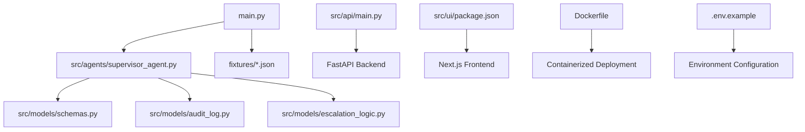
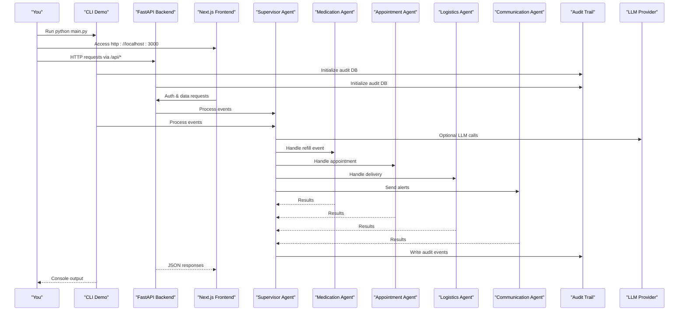
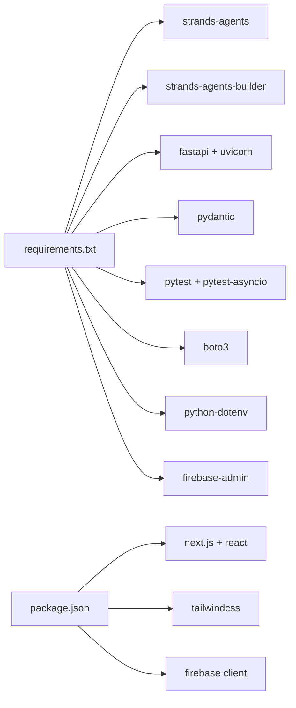

# Getting Started

<cite>
**Referenced Files in This Document**
- [main.py](file://main.py)
- [requirements.txt](file://requirements.txt)
- [pyproject.toml](file://pyproject.toml)
- [architecture.md](file://architecture.md)
- [SPEC.md](file://SPEC.md)
- [AGENTS.md](file://AGENTS.md)
- [src/models/schemas.py](file://src/models/schemas.py)
- [src/agents/supervisor_agent.py](file://src/agents/supervisor_agent.py)
- [src/models/audit_log.py](file://src/models/audit_log.py)
- [src/models/escalation_logic.py](file://src/models/escalation_logic.py)
- [Dockerfile](file://Dockerfile)
- [docker-compose.yml](file://docker-compose.yml)
- [src/api/main.py](file://src/api/main.py)
- [src/api/config.py](file://src/api/config.py)
- [src/runtime/model_factory.py](file://src/runtime/model_factory.py)
- [.env.example](file://.env.example)
- [src/ui/package.json](file://src/ui/package.json)
- [src/ui/next.config.ts](file://src/ui/next.config.ts)
- [src/ui/lib/firebase.ts](file://src/ui/lib/firebase.ts)
</cite>

## Update Summary
**Changes Made**
- Added comprehensive FastAPI backend setup instructions with environment configuration
- Added Next.js frontend development setup and configuration
- Added Docker deployment instructions for both API and full stack
- Added multi-provider LLM configuration with detailed environment variable setup
- Updated installation section to include new dependencies and services
- Enhanced troubleshooting guide with API-specific issues
- Added frontend-backend integration guidance

## Table of Contents
1. Introduction
2. Project Structure
3. Core Components
4. Architecture Overview
5. Detailed Component Analysis
6. Dependency Analysis
7. Performance Considerations
8. Troubleshooting Guide
9. Conclusion
10. Appendices

## Introduction
CareBridge is an AI-powered care coordination system that orchestrates specialized agents to manage medication refills, appointments, deliveries, and family communications. The application now includes a complete web stack with a FastAPI backend, Next.js frontend, Docker deployment support, and multi-provider LLM configuration. The system provides both a command-line demo and a full web interface for care coordination workflows.

## Project Structure
The repository is organized into clear layers:
- Entry point and demo runner at the root
- FastAPI backend under src/api with REST endpoints and authentication
- Next.js frontend under src/ui with React components and Firebase integration
- Agents (Supervisor and specialists) under src/agents
- Shared data models under src/models
- Tools for external integrations under src/tools
- Fixtures for mock data under fixtures
- Tests under tests
- Configuration files such as requirements.txt, pyproject.toml, and .env.example
- Docker deployment files including Dockerfile and docker-compose.yml



**Diagram sources**
- [main.py:1-200](file://main.py#L1-L200)
- [src/agents/supervisor_agent.py:1-641](file://src/agents/supervisor_agent.py#L1-L641)
- [src/api/main.py:1-125](file://src/api/main.py#L1-L125)
- [src/ui/package.json:1-35](file://src/ui/package.json#L1-L35)
- [Dockerfile:1-69](file://Dockerfile#L1-L69)
- [.env.example:1-141](file://.env.example#L1-L141)

**Section sources**
- [main.py:1-200](file://main.py#L1-L200)
- [architecture.md:430-499](file://architecture.md#L430-L499)

## Core Components
- Supervisor Agent: Orchestrates routing, escalation decisions, and audit logging. Provides process_event and query_status APIs used by the demo.
- FastAPI Backend: RESTful API with authentication, rate limiting, CORS, and structured logging
- Next.js Frontend: Modern web interface with Firebase authentication and real-time updates
- Multi-Provider LLM Support: Configurable LLM providers (Gemini, Groq, Bedrock, Anthropic, OpenAI, Ollama, LiteLLM)
- Docker Deployment: Containerized deployment with health checks and multi-stage builds
- Audit Trail: Immutable SQLite-backed log capturing every action with rationale and outcome
- Escalation Logic: Deterministic classification of actions into auto, alert, or approve categories

Key responsibilities:
- Event routing to specialized agents (medication, appointment, logistics, communication)
- Deterministic escalation based on policy rules
- Immutable audit trail before and after actions
- Graceful fallback when optional LLM orchestration is unavailable
- Web-based user interface with secure authentication
- Containerized deployment with health monitoring

**Section sources**
- [src/agents/supervisor_agent.py:1-641](file://src/agents/supervisor_agent.py#L1-L641)
- [src/models/schemas.py:1-150](file://src/models/schemas.py#L1-L150)
- [src/models/audit_log.py:1-167](file://src/models/audit_log.py#L1-L167)
- [src/models/escalation_logic.py:1-71](file://src/models/escalation_logic.py#L1-L71)
- [src/api/main.py:1-125](file://src/api/main.py#L1-L125)
- [src/ui/package.json:1-35](file://src/ui/package.json#L1-L35)

## Architecture Overview
CareBridge uses an "agents-as-tools" pattern where the Supervisor coordinates specialized agents. The system now supports multiple deployment modes: command-line demo, web API, and containerized deployment. In development, it runs deterministically without requiring external LLM services; optional Strands SDK integration can be enabled if available.



**Diagram sources**
- [main.py:94-199](file://main.py#L94-L199)
- [src/api/main.py:39-125](file://src/api/main.py#L39-L125)
- [src/agents/supervisor_agent.py:285-429](file://src/agents/supervisor_agent.py#L285-L429)
- [src/models/audit_log.py:81-130](file://src/models/audit_log.py#L81-L130)
- [src/runtime/model_factory.py:530-567](file://src/runtime/model_factory.py#L530-L567)

## Detailed Component Analysis

### Installation and Environment Setup

**Updated** Added comprehensive setup for FastAPI backend, Next.js frontend, Docker deployment, and multi-provider LLM configuration.

#### Prerequisites
- Python 3.11+ (recommended 3.12 for optimal wheel availability)
- Node.js 18+ for frontend development
- Docker and Docker Compose for containerized deployment
- Git for version control

#### Backend Setup
1. Create and activate a virtual environment:
   ```bash
   python -m venv venv
   source venv/bin/activate  # On Windows: venv\Scripts\activate
   ```

2. Install backend dependencies:
   ```bash
   pip install -r requirements.txt
   ```

3. Configure environment variables:
   ```bash
   cp .env.example .env
   # Edit .env with your preferred LLM provider credentials
   ```

#### Frontend Setup
1. Navigate to the frontend directory:
   ```bash
   cd src/ui
   ```

2. Install frontend dependencies:
   ```bash
   npm install
   ```

3. Configure frontend environment:
   ```bash
   # Create .env.local file
   echo "NEXT_PUBLIC_API_URL=http://localhost:8000" > .env.local
   ```

#### Docker Setup
1. Build and run with Docker Compose:
   ```bash
   docker compose up --build
   ```

2. Or build individual containers:
   ```bash
   docker build -t carebridge-api .
   docker run -p 8000:8000 --env-file .env carebridge-api
   ```

**Section sources**
- [requirements.txt:1-36](file://requirements.txt#L1-L36)
- [src/ui/package.json:1-35](file://src/ui/package.json#L1-L35)
- [Dockerfile:1-69](file://Dockerfile#L1-L69)
- [docker-compose.yml:1-34](file://docker-compose.yml#L1-L34)
- [.env.example:1-141](file://.env.example#L1-L141)

### Development Environment Setup

**Updated** Added IDE recommendations for full-stack development and debugging configuration for all components.

#### IDE Recommendations
- **VS Code**: With Python extension, Pylance, ESLint, TypeScript, and Docker extensions
- **PyCharm Professional**: For advanced Python debugging and database tools
- **WebStorm**: For Next.js frontend development with built-in debugging

#### Debugging Configuration
- **Backend**: Set working directory to repository root, enable logging to stdout and file
- **Frontend**: Configure VS Code launch config for Next.js development server
- **Database**: Use SQLite browser for audit.db and auth.db inspection
- **API Testing**: Use Swagger UI at http://localhost:8000/docs for API exploration

#### Testing Setup
- **Backend**: pytest with asyncio_mode = "auto" and testpaths = ["tests"]
- **Frontend**: Jest testing framework configured with Next.js
- **Integration**: End-to-end tests for API and frontend interactions

**Section sources**
- [pyproject.toml:1-4](file://pyproject.toml#L1-L4)
- [AGENTS.md:73-88](file://AGENTS.md#L73-L88)
- [src/api/main.py:1-125](file://src/api/main.py#L1-L125)

### Running the Application

**Updated** Added multiple ways to run CareBridge: CLI demo, web API, and full-stack development.

#### Command Line Demo
Run the main application to execute the Day 1 demo scenario:
```bash
python main.py
```

This executes:
- Initializes the audit database
- Loads fixture data
- Attempts to create the Strands Supervisor Agent (gracefully falls back if unavailable)
- Processes three care events: medication refill, appointment upcoming, pharmacy delivery failed
- Answers a caregiver status query
- Prints an audit summary

#### FastAPI Backend
Start the web API server:
```bash
uvicorn src.api.main:app --host 0.0.0.0 --port 8000
```

Access the interactive API documentation at http://localhost:8000/docs

#### Next.js Frontend
Start the development server:
```bash
cd src/ui
npm run dev
```

Access the web interface at http://localhost:3000

#### Full Stack Development
Run both backend and frontend simultaneously:
```bash
# Terminal 1: Start backend
python -m uvicorn src.api.main:app --reload

# Terminal 2: Start frontend
cd src/ui && npm run dev
```

**Section sources**
- [main.py:94-199](file://main.py#L94-L199)
- [src/api/main.py:1-125](file://src/api/main.py#L1-L125)
- [src/ui/package.json:1-35](file://src/ui/package.json#L1-L35)

### Basic Usage Patterns

**Updated** Added web API usage patterns alongside existing CLI patterns.

#### CLI Usage
- Process an event: Construct a CareEvent with event_type, care_recipient_id, and payload, then call process_event
- Query status: Call query_status with care_recipient_id and a natural language question

#### Web API Usage
- Authentication: Use POST /api/auth/login with email/password or Google sign-in
- Event Processing: POST /api/events with CareEvent JSON structure
- Status Queries: GET /api/status/{care_recipient_id}?query=natural+language+question
- Dashboard: Access http://localhost:3000 for the web interface

#### Event Types
- refill_low: Medication running low
- appointment_upcoming: Upcoming medical appointments
- delivery_failed: Pharmacy delivery issues
- adherence_deviation: Medication adherence problems

These patterns are exposed through both the Supervisor Agent CLI and the FastAPI REST endpoints.

**Section sources**
- [src/agents/supervisor_agent.py:285-429](file://src/agents/supervisor_agent.py#L285-L429)
- [src/models/schemas.py:56-70](file://src/models/schemas.py#L56-L70)
- [src/api/routers/query.py:1-100](file://src/api/routers/query.py#L1-L100)

### Multi-Provider LLM Configuration

**New Section** Added comprehensive LLM provider configuration options.

#### Supported Providers
- **Google Gemini**: Free tier, no credit card required
- **Groq**: OpenAI-compatible endpoint with free tier
- **Amazon Bedrock**: AWS cloud service with IAM authentication
- **Anthropic**: Direct Claude API access
- **OpenAI**: GPT models with standard API key
- **Ollama**: Local inference, no API key needed
- **LiteLLM**: Universal adapter for any provider

#### Configuration Steps
1. Copy environment template: `cp .env.example .env`
2. Set `LLM_PROVIDER` to your chosen provider
3. Configure provider-specific credentials
4. Restart the application to apply changes

#### Provider-Specific Setup
- **Gemini**: Set `GEMINI_API_KEY` from Google AI Studio
- **Groq**: Set `GROQ_API_KEY` from Groq console
- **Bedrock**: Configure AWS credentials via environment or IAM role
- **Anthropic**: Set `ANTHROPIC_API_KEY` from Anthropic console
- **OpenAI**: Set `OPENAI_API_KEY` from OpenAI dashboard
- **Ollama**: Run `ollama serve` locally and pull desired model
- **LiteLLM**: Set `LITELLM_MODEL` in provider-prefixed format

**Section sources**
- [src/runtime/model_factory.py:1-604](file://src/runtime/model_factory.py#L1-L604)
- [.env.example:1-141](file://.env.example#L1-L141)
- [src/api/config.py:146-224](file://src/api/config.py#L146-L224)

### Docker Deployment

**New Section** Added containerized deployment instructions.

#### Quick Start with Docker Compose
```bash
# Copy environment file and configure
cp .env.example .env
# Edit .env with your settings

# Build and start all services
docker compose up --build
```

#### Individual Service Deployment
```bash
# Build API container
docker build -t carebridge-api .

# Run with environment variables
docker run -p 8000:8000 --env-file .env carebridge-api
```

#### Production Considerations
- Health checks are configured for container orchestration
- Multi-stage builds optimize image size
- Non-root user for security
- Structured logging for observability
- Rate limiting and request size limits enabled

**Section sources**
- [Dockerfile:1-69](file://Dockerfile#L1-L69)
- [docker-compose.yml:1-34](file://docker-compose.yml#L1-L34)

## Dependency Analysis

**Updated** Added new dependencies for FastAPI backend, Next.js frontend, and Docker deployment.

Core runtime dependencies:
- **strands-agents and strands-agents-builder**: Optional LLM orchestration via Strands SDK
- **fastapi and uvicorn**: High-performance web framework and ASGI server
- **pydantic**: Data validation and modeling across the stack
- **pytest and pytest-asyncio**: Testing framework and async support
- **boto3**: AWS SDK for Bedrock integration
- **python-dotenv**: Environment variable loading
- **firebase-admin**: Firebase authentication backend
- **next.js and react**: Modern frontend framework and UI library
- **tailwindcss**: Utility-first CSS framework

Optional components:
- Multiple LLM provider SDKs (gemini, anthropic, openai, ollama, litellm)
- Docker for containerized deployment
- Firebase client SDK for frontend authentication



**Diagram sources**
- [requirements.txt:1-36](file://requirements.txt#L1-L36)
- [src/ui/package.json:1-35](file://src/ui/package.json#L1-L35)

**Section sources**
- [requirements.txt:1-36](file://requirements.txt#L1-L36)
- [src/ui/package.json:1-35](file://src/ui/package.json#L1-L35)

## Performance Considerations

**Updated** Added performance considerations for web API and frontend components.

- Deterministic routing avoids unnecessary LLM calls in development, reducing latency
- Retry logic uses exponential backoff for external API calls to improve resilience
- Audit trail writes occur before actions to ensure immutability and observability
- In-process MCP servers reduce overhead compared to subprocess-based integrations
- FastAPI provides high-performance async request handling
- Next.js offers optimized bundling and code splitting for better frontend performance
- Docker multi-stage builds minimize container image size and startup time
- Rate limiting prevents API abuse and ensures fair resource allocation
- Request size limits protect against memory exhaustion attacks

## Troubleshooting Guide

**Updated** Added troubleshooting for FastAPI backend, Next.js frontend, Docker deployment, and LLM configuration issues.

### Common Issues and Resolutions

#### Backend Issues
- **Missing dependencies**: Install with `pip install -r requirements.txt`
- **Import errors**: Ensure virtual environment is activated and dependencies installed
- **Database errors**: Check permissions for creating audit.db and auth.db files
- **API not starting**: Verify port 8000 is available and no conflicting processes

#### Frontend Issues
- **Module not found**: Run `npm install` in src/ui directory
- **Build errors**: Check Node.js version compatibility (18+)
- **API connection failed**: Ensure backend is running on localhost:8000
- **Firebase authentication**: Verify NEXT_PUBLIC_FIREBASE_* environment variables

#### Docker Issues
- **Build failures**: Check Docker daemon is running and sufficient disk space
- **Port conflicts**: Change port mapping in docker-compose.yml if 8000 is in use
- **Permission errors**: Ensure proper file ownership and permissions
- **Network issues**: Verify container networking and firewall settings

#### LLM Configuration Issues
- **Provider not available**: Check LLM_PROVIDER setting and corresponding API keys
- **Authentication failures**: Verify environment variables contain valid credentials
- **Model not found**: Check model names match provider specifications
- **Rate limiting**: Monitor API quotas and implement retry logic

#### Environment Configuration
- **Missing .env file**: Copy from .env.example and fill in required values
- **Invalid credentials**: Replace placeholder values with actual API keys
- **CORS errors**: Configure CORS_ORIGINS to include frontend domain
- **JWT secret**: Generate secure JWT_SECRET_KEY for production deployments

### Debugging Tips
- Inspect logs/carebridge.log for detailed backend traces
- Review audit.db entries to see action outcomes and correlation IDs
- Use Swagger UI at http://localhost:8000/docs for API testing
- Check browser developer console for frontend errors
- Use Docker logs: `docker compose logs -f api`
- Enable debug logging: Set LOG_LEVEL=DEBUG in environment

**Section sources**
- [main.py:45-63](file://main.py#L45-L63)
- [src/models/audit_log.py:19-78](file://src/models/audit_log.py#L19-L78)
- [src/agents/supervisor_agent.py:599-641](file://src/agents/supervisor_agent.py#L599-L641)
- [src/api/config.py:262-282](file://src/api/config.py#L262-L282)
- [src/runtime/model_factory.py:148-200](file://src/runtime/model_factory.py#L148-L200)

## Conclusion
You now have everything needed to install, configure, and run CareBridge using multiple deployment methods. The system supports command-line demos, web APIs, and containerized deployments with comprehensive LLM provider support. The demo exercises core workflows—medication refills, appointment handling, delivery failures, and status queries—while maintaining a complete, immutable audit trail. For development, use deterministic routing by default and optionally enable LLM orchestration with proper credentials. Refer to the troubleshooting section for common setup issues and consult the architecture and spec documents for deeper understanding.

## Appendices

### Quick Start Checklist
- Install Python 3.11+ and Node.js 18+ and create a virtual environment
- Install backend dependencies from requirements.txt
- Install frontend dependencies in src/ui directory
- Copy .env.example to .env and configure LLM provider
- Run python main.py to execute the CLI demo
- Start FastAPI backend with uvicorn src.api.main:app
- Start Next.js frontend with npm run dev in src/ui
- Access web interface at http://localhost:3000
- Check logs/carebridge.log and audit.db for results

### Environment Variables Reference
- **LLM_PROVIDER**: Select between gemini, groq, bedrock, anthropic, openai, ollama, litellm
- **GEMINI_API_KEY**: Required for Google Gemini provider
- **GROQ_API_KEY**: Required for Groq provider
- **AWS_ACCESS_KEY_ID**: Required for Amazon Bedrock provider
- **ANTHROPIC_API_KEY**: Required for Anthropic provider
- **OPENAI_API_KEY**: Required for OpenAI provider
- **JWT_SECRET_KEY**: Required for production authentication
- **DEMO_MODE**: Enable demo mode for development
- **CORS_ORIGINS**: Configure allowed frontend domains

**Section sources**
- [requirements.txt:1-36](file://requirements.txt#L1-L36)
- [src/ui/package.json:1-35](file://src/ui/package.json#L1-L35)
- [main.py:143-199](file://main.py#L143-L199)
- [.env.example:1-141](file://.env.example#L1-L141)