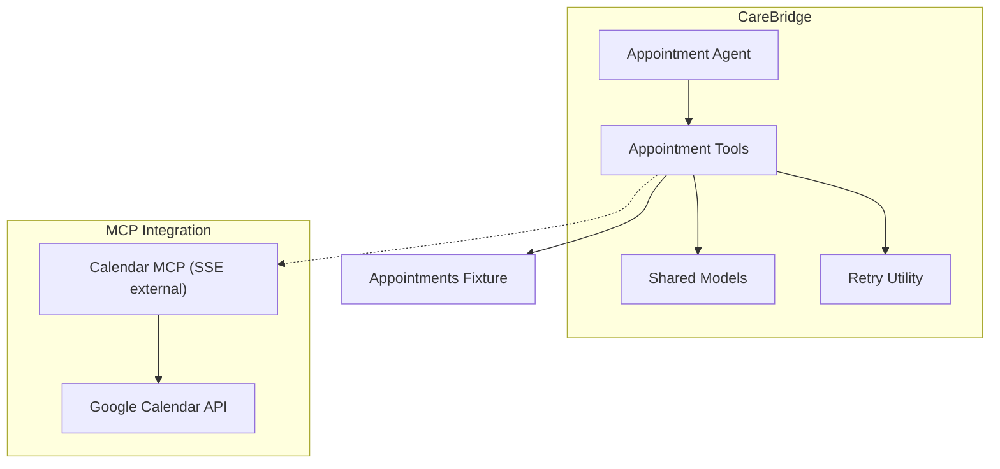
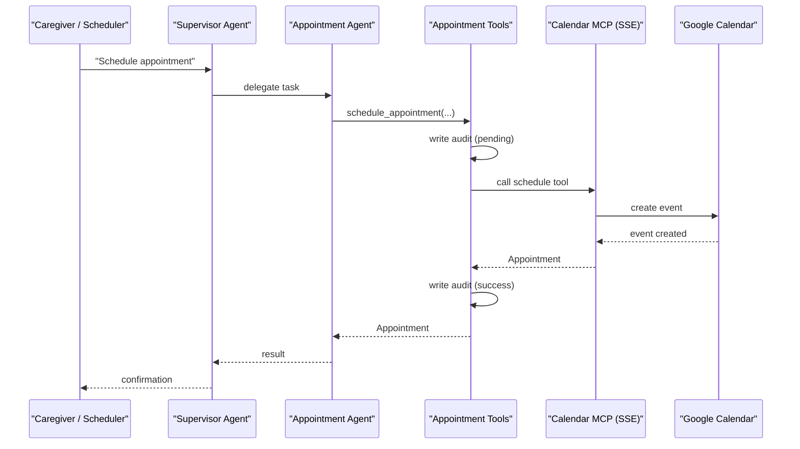
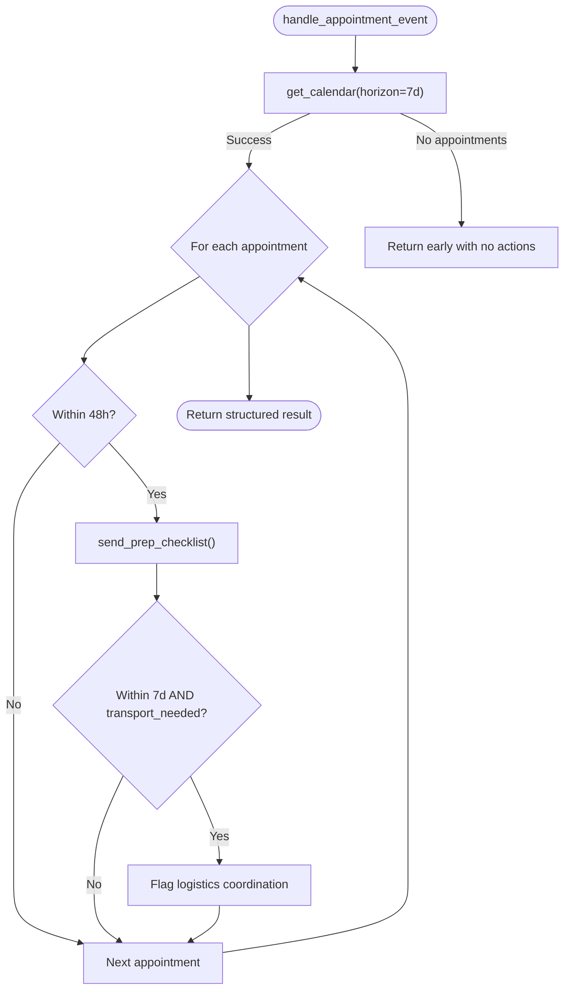
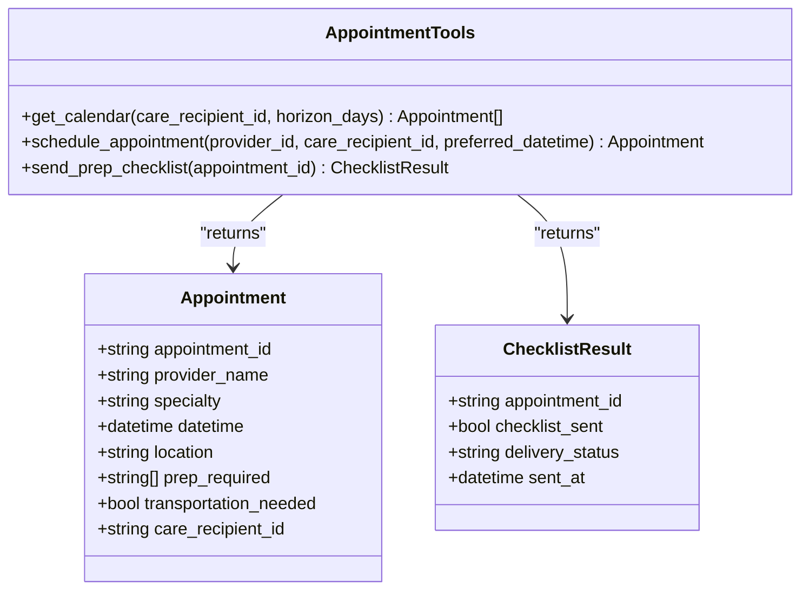
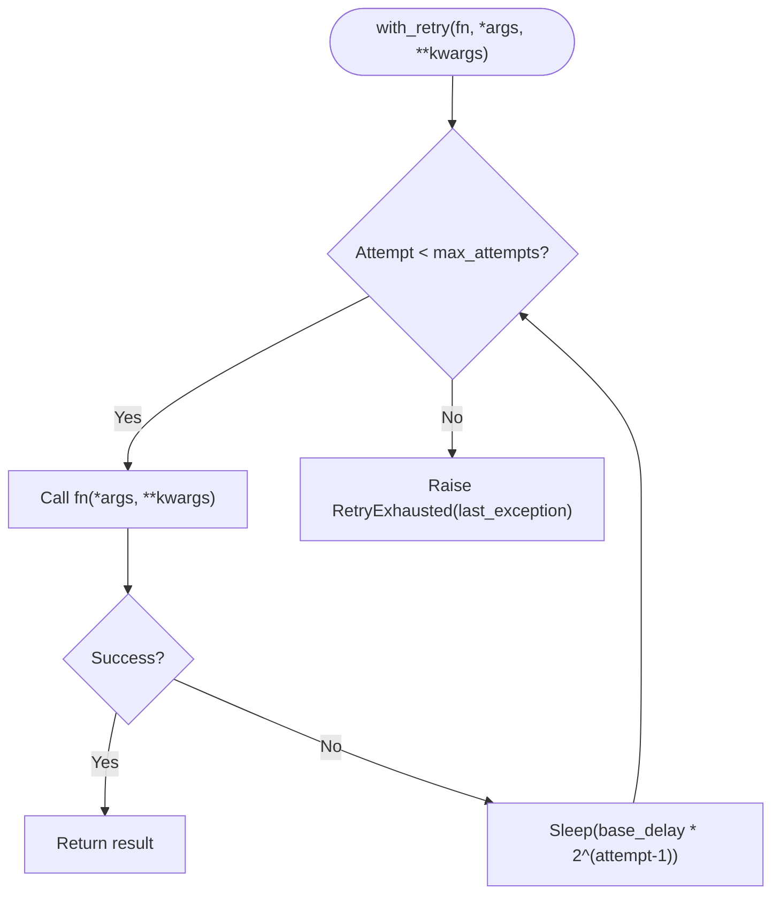
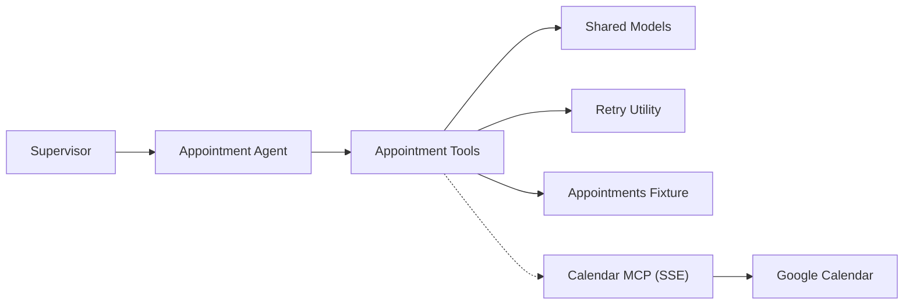

# Calendar MCP Server

<cite>
**Referenced Files in This Document**
- [main.py](file://main.py)
- [appointment_agent.py](file://src/agents/appointment_agent.py)
- [appointment_tools.py](file://src/tools/appointment_tools.py)
- [schemas.py](file://src/models/schemas.py)
- [retry.py](file://src/tools/retry.py)
- [appointments.json](file://fixtures/appointments.json)
- [architecture.md](file://architecture.md)
- [SPEC.md](file://SPEC.md)
- [test_appointment_agent.py](file://tests/test_appointment_agent.py)
</cite>

## Table of Contents
1. [Introduction](#introduction)
2. [Project Structure](#project-structure)
3. [Core Components](#core-components)
4. [Architecture Overview](#architecture-overview)
5. [Detailed Component Analysis](#detailed-component-analysis)
6. [Dependency Analysis](#dependency-analysis)
7. [Performance Considerations](#performance-considerations)
8. [Troubleshooting Guide](#troubleshooting-guide)
9. [Conclusion](#conclusion)
10. [Appendices](#appendices)

## Introduction
This document explains the Calendar MCP Server implementation for appointment scheduling and calendar management within CareBridge. It covers how appointments are retrieved, scheduled, and coordinated with reminders and logistics. It also documents the planned Google Calendar integration via an SSE-based MCP transport, real-time update considerations, timezone handling, synchronization strategies, and error handling patterns used across the system.

## Project Structure
The calendar-related functionality is implemented as a combination of:
- An Appointment Agent that orchestrates event-driven workflows (check upcoming appointments, send prep checklists, flag transportation needs).
- Appointment Tools that encapsulate calendar operations (read upcoming appointments, schedule new appointments, send prep checklists).
- Shared models defining data contracts (Appointment, ChecklistResult, etc.).
- A retry utility to handle transient failures.
- Fixtures providing mock appointment data for development and testing.
- Architecture and specification documents describing MCP transport choices and server contracts.

**Diagram sources**
- [appointment_agent.py:25-71](file://src/agents/appointment_agent.py#L25-L71)
- [appointment_tools.py:39-80](file://src/tools/appointment_tools.py#L39-L80)
- [appointment_tools.py:83-114](file://src/tools/appointment_tools.py#L83-L114)
- [retry.py:22-69](file://src/tools/retry.py#L22-L69)
- [architecture.md:228-259](file://architecture.md#L228-L259)

**Section sources**
- [appointment_agent.py:25-71](file://src/agents/appointment_agent.py#L25-L71)
- [appointment_tools.py:39-80](file://src/tools/appointment_tools.py#L39-L80)
- [architecture.md:228-259](file://architecture.md#L228-L259)

## Core Components
- Appointment Agent: Evaluates upcoming appointments and triggers actions such as sending prep checklists or flagging transportation needs based on time windows and flags.
- Appointment Tools: Provide calendar read/write capabilities using fixtures in development; includes a simulated scheduling path intended to be replaced by a real MCP call later.
- Retry Utility: Provides exponential backoff retries for external calls.
- Shared Models: Define strict schemas for appointments, checklists, audit events, and care events.
- Fixtures: Supply sample appointment data for deterministic behavior during tests and demos.

Key responsibilities:
- Retrieve upcoming appointments within a configurable horizon.
- Determine if a prep checklist should be sent (within 48 hours).
- Determine if transportation coordination is needed (within 7 days and flagged).
- Schedule new appointments with audit logging and retries.
- Send preparation checklists and return delivery status.

**Section sources**
- [appointment_agent.py:25-71](file://src/agents/appointment_agent.py#L25-L71)
- [appointment_agent.py:74-172](file://src/agents/appointment_agent.py#L74-L172)
- [appointment_tools.py:39-80](file://src/tools/appointment_tools.py#L39-L80)
- [appointment_tools.py:117-200](file://src/tools/appointment_tools.py#L117-L200)
- [appointment_tools.py:203-241](file://src/tools/appointment_tools.py#L203-L241)
- [schemas.py:23-31](file://src/models/schemas.py#L23-L31)
- [schemas.py:111-116](file://src/models/schemas.py#L111-L116)
- [retry.py:22-69](file://src/tools/retry.py#L22-L69)
- [appointments.json:1-33](file://fixtures/appointments.json#L1-L33)

## Architecture Overview
The system uses an agent-as-tools pattern where the Supervisor delegates tasks to specialized agents. The Appointment Agent interacts with calendar services through tools. In production, the Calendar MCP server will connect to Google Calendar via an SSE transport configured in the MCP registry. During development, appointment reads use fixtures and scheduling is simulated.

**Diagram sources**
- [appointment_tools.py:117-200](file://src/tools/appointment_tools.py#L117-L200)
- [architecture.md:228-259](file://architecture.md#L228-L259)

**Section sources**
- [architecture.md:228-259](file://architecture.md#L228-L259)
- [SPEC.md:364-392](file://SPEC.md#L364-L392)

## Detailed Component Analysis

### Appointment Agent
Responsibilities:
- Check upcoming appointments within near-term windows.
- Trigger prep checklist dispatch for appointments within 48 hours.
- Flag transportation coordination for appointments within 7 days when required.
- Handle appointment events end-to-end and return structured results.

Behavior highlights:
- Normalizes timezone-aware datetimes before computing time deltas.
- Gracefully handles missing calendars by returning empty results or early exit paths.
- Aggregates actions taken and returns lists of affected appointment IDs.

**Diagram sources**
- [appointment_agent.py:74-172](file://src/agents/appointment_agent.py#L74-L172)
- [appointment_agent.py:25-71](file://src/agents/appointment_agent.py#L25-L71)

**Section sources**
- [appointment_agent.py:25-71](file://src/agents/appointment_agent.py#L25-L71)
- [appointment_agent.py:74-172](file://src/agents/appointment_agent.py#L74-L172)

### Appointment Tools
Responsibilities:
- Read upcoming appointments from fixtures filtered by care recipient and horizon.
- Simulate scheduling an appointment with audit logging and retries.
- Send preparation checklists and return delivery status.

Implementation notes:
- get_calendar parses ISO datetimes and filters by UTC now and horizon window.
- schedule_appointment writes audit events before and after execution and wraps the underlying call with retries.
- send_prep_checklist validates the appointment exists and returns a ChecklistResult.

**Diagram sources**
- [schemas.py:23-31](file://src/models/schemas.py#L23-L31)
- [schemas.py:111-116](file://src/models/schemas.py#L111-L116)
- [appointment_tools.py:39-80](file://src/tools/appointment_tools.py#L39-L80)
- [appointment_tools.py:117-200](file://src/tools/appointment_tools.py#L117-L200)
- [appointment_tools.py:203-241](file://src/tools/appointment_tools.py#L203-L241)

**Section sources**
- [appointment_tools.py:39-80](file://src/tools/appointment_tools.py#L39-L80)
- [appointment_tools.py:83-114](file://src/tools/appointment_tools.py#L83-L114)
- [appointment_tools.py:117-200](file://src/tools/appointment_tools.py#L117-L200)
- [appointment_tools.py:203-241](file://src/tools/appointment_tools.py#L203-L241)
- [schemas.py:23-31](file://src/models/schemas.py#L23-L31)
- [schemas.py:111-116](file://src/models/schemas.py#L111-L116)

### Retry Mechanism
Purpose:
- Provide consistent retry behavior with exponential backoff for external calls.
- Wrap both async and sync functions uniformly.

Behavior:
- Retries up to a configurable number of attempts with base delay doubling each attempt.
- Raises a specific exception when all attempts are exhausted, preserving the last exception.

**Diagram sources**
- [retry.py:22-69](file://src/tools/retry.py#L22-L69)

**Section sources**
- [retry.py:22-69](file://src/tools/retry.py#L22-L69)

### Data Models
Key models used by calendar features:
- Appointment: Represents a scheduled visit with provider details, time, location, prep requirements, transportation needs, and care recipient linkage.
- ChecklistResult: Captures whether a prep checklist was sent and its delivery status.
- AuditEvent and CareEvent: Support auditability and event-driven processing.

**Section sources**
- [schemas.py:23-31](file://src/models/schemas.py#L23-L31)
- [schemas.py:111-116](file://src/models/schemas.py#L111-L116)
- [schemas.py:44-53](file://src/models/schemas.py#L44-L53)
- [schemas.py:56-61](file://src/models/schemas.py#L56-L61)

### MCP Transport and Google Calendar Integration
Planned integration:
- Calendar MCP server connects to Google Calendar via Qoder Connector using SSE transport.
- Configuration specifies server type, URL, and authorization headers.
- Current implementation uses fixtures for reading and a simulated scheduler; this will be replaced by a real MCP call.

Operational implications:
- SSE enables real-time updates from the calendar service.
- Authorization is handled via bearer tokens configured in MCP settings.
- Fallback to in-process mock ensures continuity when connector is unavailable.

**Section sources**
- [architecture.md:228-259](file://architecture.md#L228-L259)
- [SPEC.md:364-392](file://SPEC.md#L364-L392)
- [appointment_tools.py:83-114](file://src/tools/appointment_tools.py#L83-L114)

## Dependency Analysis
High-level dependencies:
- Appointment Agent depends on Appointment Tools for calendar operations.
- Appointment Tools depend on shared models and the retry utility.
- Tools read from fixtures in development; in production, they will call the Calendar MCP server.
- The Supervisor orchestrates events and routes them to the Appointment Agent.

**Diagram sources**
- [appointment_agent.py:25-71](file://src/agents/appointment_agent.py#L25-L71)
- [appointment_tools.py:39-80](file://src/tools/appointment_tools.py#L39-L80)
- [retry.py:22-69](file://src/tools/retry.py#L22-L69)
- [architecture.md:228-259](file://architecture.md#L228-L259)

**Section sources**
- [appointment_agent.py:25-71](file://src/agents/appointment_agent.py#L25-L71)
- [appointment_tools.py:39-80](file://src/tools/appointment_tools.py#L39-L80)
- [retry.py:22-69](file://src/tools/retry.py#L22-L69)
- [architecture.md:228-259](file://architecture.md#L228-L259)

## Performance Considerations
- Timezone normalization: Ensure all datetimes are timezone-aware before comparisons to avoid incorrect scheduling decisions.
- Horizon filtering: Limit calendar queries to relevant windows (e.g., 7 days) to reduce processing overhead.
- Retry policy: Use exponential backoff to mitigate transient failures without overwhelming external services.
- Audit logging: Keep audit writes lightweight and asynchronous where possible to avoid blocking critical paths.
- SSE updates: Leverage server-sent events to minimize polling and reduce latency for real-time changes.

[No sources needed since this section provides general guidance]

## Troubleshooting Guide
Common issues and resolutions:
- No appointments found:
  - Cause: Invalid care_recipient_id or missing fixture data.
  - Resolution: Verify the care recipient identifier and ensure fixtures contain valid records.
- Prep checklist not sent:
  - Cause: Appointment outside the 48-hour window or invalid appointment ID.
  - Resolution: Confirm appointment timing and existence; adjust workflow thresholds if necessary.
- Scheduling failure:
  - Cause: External calendar service unavailability or network errors.
  - Resolution: Rely on retry mechanism; if exhausted, escalate and notify caregivers; verify MCP connectivity and credentials.
- Timezone mismatches:
  - Cause: Naive datetimes causing incorrect time calculations.
  - Resolution: Normalize datetimes to UTC before comparisons; ensure incoming data includes timezone information.

**Section sources**
- [appointment_tools.py:39-80](file://src/tools/appointment_tools.py#L39-L80)
- [appointment_tools.py:117-200](file://src/tools/appointment_tools.py#L117-L200)
- [appointment_agent.py:74-172](file://src/agents/appointment_agent.py#L74-L172)
- [retry.py:22-69](file://src/tools/retry.py#L22-L69)

## Conclusion
The Calendar MCP Server integration in CareBridge provides a robust foundation for appointment scheduling and calendar management. The current implementation uses fixtures and simulation for development, with a clear path to replace these with a real SSE-based MCP server connected to Google Calendar. The design emphasizes auditability, resilience via retries, and clear separation of concerns between agents and tools. With proper timezone handling, horizon filtering, and error escalation, the system supports reliable automation of provider availability checks, patient scheduling, and reminder management.

[No sources needed since this section summarizes without analyzing specific files]

## Appendices

### Example Scenarios
- Recurring appointments:
  - Strategy: Store recurrence rules in the Appointment model or linked metadata; on retrieval, expand recurring instances within the horizon window.
  - Conflict detection: Compare expanded instances against existing events to detect overlaps.
- Resource conflicts:
  - Strategy: When scheduling, request available slots and validate against resource constraints (provider, room, equipment).
  - Fallback: If conflicts arise, propose alternative times and re-attempt scheduling.
- Last-minute changes:
  - Strategy: Use SSE to receive real-time updates; trigger rescheduling workflows and notify affected parties promptly.
  - Coordination: Update logistics and communication channels automatically upon change.

[No sources needed since this section provides conceptual guidance]

### Testing References
- Unit tests cover happy paths and failure scenarios for calendar tools and the appointment agent handler.
- Tests validate retrieval of appointments, scheduling outcomes, and error propagation.

**Section sources**
- [test_appointment_agent.py:18-65](file://tests/test_appointment_agent.py#L18-L65)