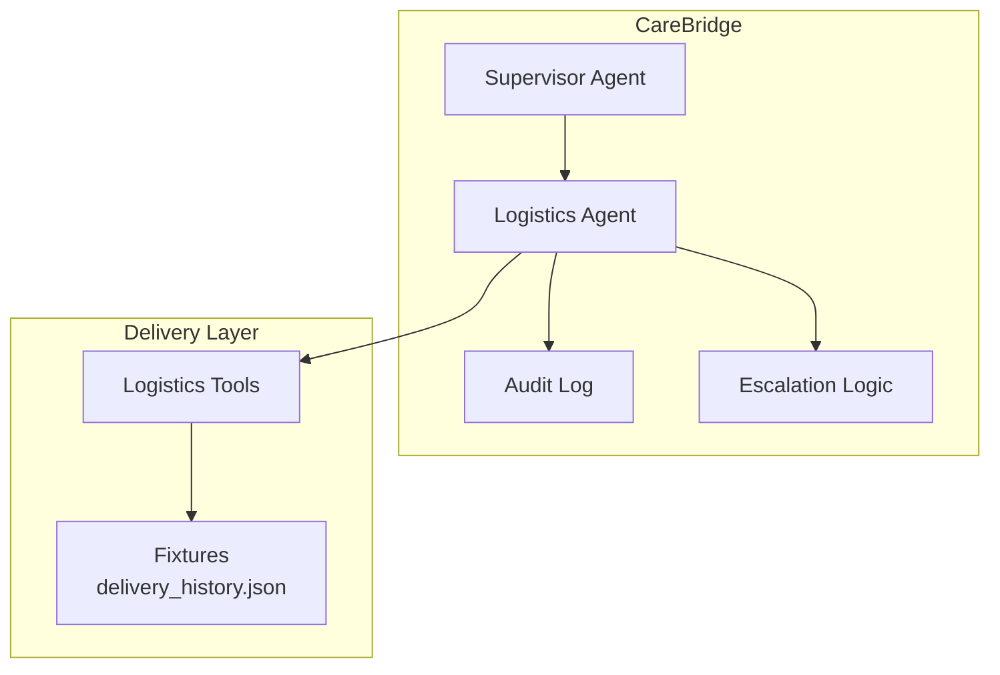
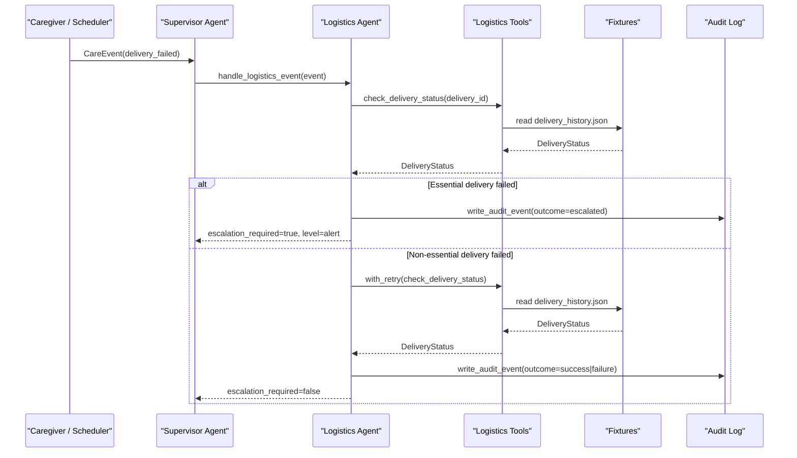
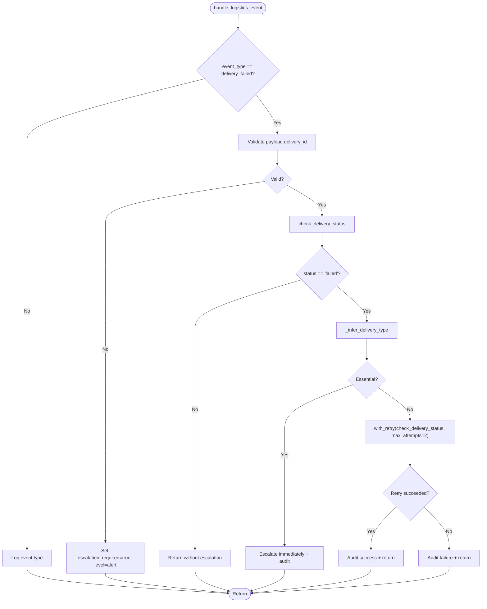
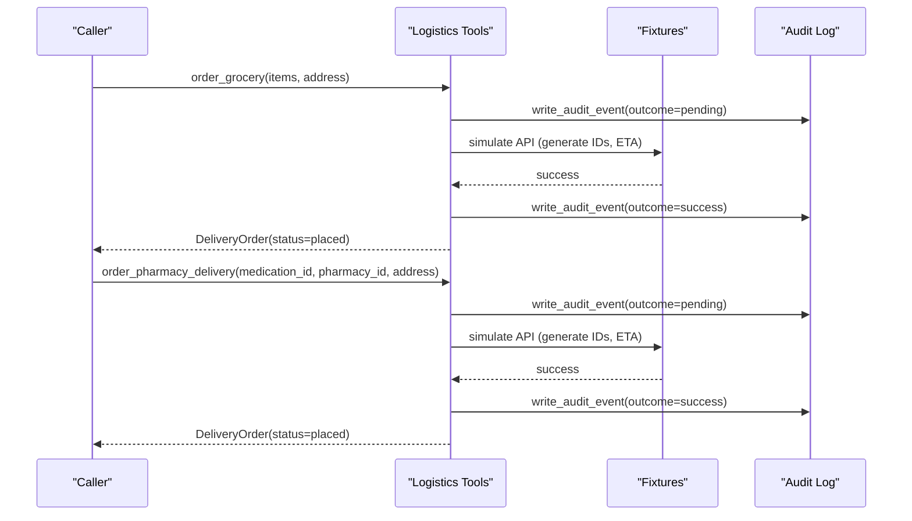
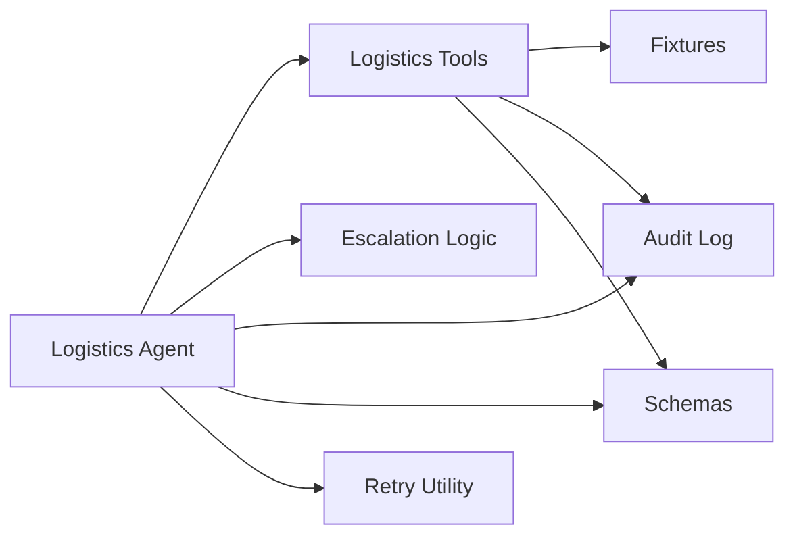

# Delivery MCP Server

<cite>
**Referenced Files in This Document**
- [main.py](file://main.py)
- [architecture.md](file://architecture.md)
- [src/agents/logistics_agent.py](file://src/agents/logistics_agent.py)
- [src/tools/logistics_tools.py](file://src/tools/logistics_tools.py)
- [src/models/schemas.py](file://src/models/schemas.py)
- [src/models/escalation_logic.py](file://src/models/escalation_logic.py)
- [src/models/audit_log.py](file://src/models/audit_log.py)
- [src/tools/retry.py](file://src/tools/retry.py)
- [fixtures/delivery_history.json](file://fixtures/delivery_history.json)
- [tests/test_logistics_agent.py](file://tests/test_logistics_agent.py)
</cite>

## Table of Contents
1. [Introduction](#introduction)
2. [Project Structure](#project-structure)
3. [Core Components](#core-components)
4. [Architecture Overview](#architecture-overview)
5. [Detailed Component Analysis](#detailed-component-analysis)
6. [Dependency Analysis](#dependency-analysis)
7. [Performance Considerations](#performance-considerations)
8. [Troubleshooting Guide](#troubleshooting-guide)
9. [Conclusion](#conclusion)
10. [Appendices](#appendices)

## Introduction
This document provides detailed documentation for the Delivery MCP Server implementation within CareBridge, focusing on logistics and delivery coordination services. It covers order placement, tracking integration, delivery scheduling, exception handling, and multi-provider support patterns for pharmacy and grocery deliveries. It also explains order management workflows, failure handling with retry logic, escalation rules, and auditability. The current implementation uses in-process tools backed by JSON fixtures to simulate external delivery providers, enabling deterministic behavior during development and testing.

## Project Structure
The delivery-related functionality is implemented across agents, tools, models, and fixtures:
- Agents coordinate events and apply escalation policies.
- Tools implement delivery operations (status checks, order placement).
- Models define shared data contracts (delivery status, orders, events).
- Fixtures provide mock provider responses for development and tests.
- Audit logging ensures every action is recorded before execution.

**Diagram sources**
- [architecture.md:12-75](file://architecture.md#L12-L75)
- [src/agents/logistics_agent.py:1-20](file://src/agents/logistics_agent.py#L1-L20)
- [src/tools/logistics_tools.py:1-20](file://src/tools/logistics_tools.py#L1-L20)
- [src/models/audit_log.py:1-15](file://src/models/audit_log.py#L1-L15)
- [src/models/escalation_logic.py:1-15](file://src/models/escalation_logic.py#L1-L15)
- [fixtures/delivery_history.json:1-33](file://fixtures/delivery_history.json#L1-L33)

**Section sources**
- [architecture.md:12-75](file://architecture.md#L12-L75)
- [main.py:92-140](file://main.py#L92-L140)

## Core Components
- Logistics Agent: Processes delivery events, applies escalation rules based on delivery type, and coordinates retries or alerts.
- Logistics Tools: Implements delivery status checks and order placement for grocery and pharmacy deliveries using fixture-backed mocks.
- Schemas: Define strict data contracts for delivery statuses, orders, and care events.
- Escalation Logic: Deterministic classification of actions into auto, alert, or approve categories.
- Retry Utility: Provides exponential backoff retry for external calls.
- Audit Log: Immutable SQLite-based audit trail ensuring every action is recorded before execution.

Key responsibilities:
- Order placement: Grocery and pharmacy delivery orders are placed via tools that simulate external APIs and return structured results.
- Tracking integration: Delivery status is retrieved from fixtures and mapped to standardized schemas.
- Exception handling: Essential deliveries escalate immediately; non-essential deliveries are retried once with audit logging.
- Multi-provider pattern: Tools abstract provider differences behind a consistent interface; currently simulated via fixtures.

**Section sources**
- [src/agents/logistics_agent.py:23-152](file://src/agents/logistics_agent.py#L23-L152)
- [src/tools/logistics_tools.py:23-219](file://src/tools/logistics_tools.py#L23-L219)
- [src/models/schemas.py:96-108](file://src/models/schemas.py#L96-L108)
- [src/models/escalation_logic.py:42-70](file://src/models/escalation_logic.py#L42-L70)
- [src/tools/retry.py:22-69](file://src/tools/retry.py#L22-L69)
- [src/models/audit_log.py:81-128](file://src/models/audit_log.py#L81-L128)

## Architecture Overview
The Delivery MCP Server integrates as an in-process MCP server providing logistics tools. The Supervisor Agent orchestrates specialized agents, including the Logistics Agent, which handles delivery events and routes them to appropriate tools. External integrations are mocked via fixtures for development and testing.

**Diagram sources**
- [architecture.md:83-108](file://architecture.md#L83-L108)
- [src/agents/logistics_agent.py:182-235](file://src/agents/logistics_agent.py#L182-L235)
- [src/tools/logistics_tools.py:23-53](file://src/tools/logistics_tools.py#L23-L53)
- [src/models/audit_log.py:81-128](file://src/models/audit_log.py#L81-L128)
- [fixtures/delivery_history.json:1-33](file://fixtures/delivery_history.json#L1-L33)

**Section sources**
- [architecture.md:12-75](file://architecture.md#L12-L75)
- [main.py:92-140](file://main.py#L92-L140)

## Detailed Component Analysis

### Logistics Agent
Responsibilities:
- Process delivery_failed events with escalation rules.
- Infer delivery type from fixtures to determine essential vs non-essential handling.
- Apply retry logic for non-essential failures and escalate essential failures.
- Write audit events for all outcomes.

Key behaviors:
- Essential deliveries (pharmacy, medication, food, grocery) trigger immediate escalation.
- Non-essential deliveries are retried once; if still failed, logged and no escalation.
- Missing or invalid delivery IDs result in escalation and audit logging.

**Diagram sources**
- [src/agents/logistics_agent.py:182-235](file://src/agents/logistics_agent.py#L182-L235)
- [src/agents/logistics_agent.py:23-152](file://src/agents/logistics_agent.py#L23-L152)
- [src/tools/retry.py:22-69](file://src/tools/retry.py#L22-L69)

**Section sources**
- [src/agents/logistics_agent.py:23-152](file://src/agents/logistics_agent.py#L23-L152)
- [src/agents/logistics_agent.py:155-179](file://src/agents/logistics_agent.py#L155-L179)
- [src/agents/logistics_agent.py:182-235](file://src/agents/logistics_agent.py#L182-L235)

### Logistics Tools
Responsibilities:
- Provide delivery status checks against fixtures.
- Place grocery and pharmacy delivery orders with simulated API calls.
- Ensure audit-before-action for all operations.
- Raise exceptions on failures to propagate errors up the call stack.

Key functions:
- check_delivery_status: Reads delivery history from fixtures and returns a DeliveryStatus.
- order_grocery: Places a grocery order, simulates external API, audits before/after, returns DeliveryOrder.
- order_pharmacy_delivery: Places a pharmacy delivery order, resolves care_recipient_id from medications fixtures when possible, audits before/after, returns DeliveryOrder.

**Diagram sources**
- [src/tools/logistics_tools.py:56-128](file://src/tools/logistics_tools.py#L56-L128)
- [src/tools/logistics_tools.py:131-219](file://src/tools/logistics_tools.py#L131-L219)
- [src/models/audit_log.py:81-128](file://src/models/audit_log.py#L81-L128)

**Section sources**
- [src/tools/logistics_tools.py:23-53](file://src/tools/logistics_tools.py#L23-L53)
- [src/tools/logistics_tools.py:56-128](file://src/tools/logistics_tools.py#L56-L128)
- [src/tools/logistics_tools.py:131-219](file://src/tools/logistics_tools.py#L131-L219)

### Data Models (Schemas)
Shared Pydantic models ensure consistent data exchange:
- DeliveryStatus: Represents delivery state, expected arrival, and optional failure reason.
- DeliveryOrder: Represents order creation with IDs, status, and expected arrival.
- CareEvent: Encapsulates event type, recipient, payload, and timestamp.

These models standardize inputs and outputs across agents and tools, reducing ambiguity and improving reliability.

**Section sources**
- [src/models/schemas.py:96-108](file://src/models/schemas.py#L96-L108)
- [src/models/schemas.py:56-62](file://src/models/schemas.py#L56-L62)

### Escalation Logic
Deterministic classification ensures safety-critical decisions are not delegated to LLMs:
- Autonomous actions: Read-only or safe operations (e.g., check_delivery_status).
- Alert-required actions: Placing orders (grocery/pharmacy), scheduling appointments.
- Approval-required actions: Destructive or clinical changes.
- Emergency triggers: Elevate to at least alert level.

This logic gates execution paths and informs whether human approval or notifications are required.

**Section sources**
- [src/models/escalation_logic.py:42-70](file://src/models/escalation_logic.py#L42-L70)

### Retry Utility
Provides robust retry with exponential backoff for external calls:
- Default 3 attempts with base delay 1s (1s, 2s, 4s).
- Wraps last exception in RetryExhausted when all attempts fail.
- Used by logistics agent to retry non-essential delivery status checks.

**Section sources**
- [src/tools/retry.py:22-69](file://src/tools/retry.py#L22-L69)

### Audit Logging
Immutable audit trail records every action before execution:
- Schema enforces actor, action_type, rationale, outcome, correlation_id.
- Triggers prevent updates/deletes to maintain immutability.
- Functions to write and query events support observability and debugging.

**Section sources**
- [src/models/audit_log.py:19-78](file://src/models/audit_log.py#L19-L78)
- [src/models/audit_log.py:81-128](file://src/models/audit_log.py#L81-L128)
- [src/models/audit_log.py:133-167](file://src/models/audit_log.py#L133-L167)

## Dependency Analysis
The delivery system has clear boundaries and dependencies:
- Logistics Agent depends on Logistics Tools, Escalation Logic, and Audit Log.
- Logistics Tools depend on Fixtures and Audit Log.
- Schemas are consumed across components to enforce contracts.
- Retry utility is used by the Logistics Agent for resilient operations.

**Diagram sources**
- [src/agents/logistics_agent.py:1-20](file://src/agents/logistics_agent.py#L1-L20)
- [src/tools/logistics_tools.py:1-20](file://src/tools/logistics_tools.py#L1-L20)
- [src/models/schemas.py:1-10](file://src/models/schemas.py#L1-L10)
- [src/models/escalation_logic.py:1-15](file://src/models/escalation_logic.py#L1-L15)
- [src/models/audit_log.py:1-15](file://src/models/audit_log.py#L1-L15)
- [src/tools/retry.py:1-15](file://src/tools/retry.py#L1-L15)
- [fixtures/delivery_history.json:1-33](file://fixtures/delivery_history.json#L1-L33)

**Section sources**
- [src/agents/logistics_agent.py:1-20](file://src/agents/logistics_agent.py#L1-L20)
- [src/tools/logistics_tools.py:1-20](file://src/tools/logistics_tools.py#L1-L20)
- [src/models/schemas.py:1-10](file://src/models/schemas.py#L1-L10)

## Performance Considerations
- Fixture-backed mocking eliminates network latency during development and tests, enabling fast iteration.
- In-process MCP servers reduce overhead compared to subprocess-based integrations.
- Retry with exponential backoff mitigates transient failures without overwhelming external systems.
- Audit log writes occur before execution; ensure database performance is adequate under load.

[No sources needed since this section provides general guidance]

## Troubleshooting Guide
Common issues and resolutions:
- Delivery not found: check_delivery_status raises ValueError; ensure valid delivery_id exists in fixtures.
- Missing delivery_id in payload: handle_logistics_event escalates; validate incoming events.
- Order placement failures: tools raise RuntimeError; inspect logs and audit events for details.
- Retry exhaustion: RetryExhausted indicates all attempts failed; review external service health and adjust retry parameters if necessary.

Verification steps:
- Run unit tests for logistics tools and agent handlers to confirm expected behavior.
- Inspect audit events to trace the full lifecycle of delivery operations.
- Validate fixtures contain correct delivery types and statuses for scenario testing.

**Section sources**
- [tests/test_logistics_agent.py:18-37](file://tests/test_logistics_agent.py#L18-L37)
- [tests/test_logistics_agent.py:40-79](file://tests/test_logistics_agent.py#L40-L79)
- [tests/test_logistics_agent.py:81-94](file://tests/test_logistics_agent.py#L81-L94)
- [tests/test_logistics_agent.py:113-148](file://tests/test_logistics_agent.py#L113-L148)
- [src/tools/logistics_tools.py:23-53](file://src/tools/logistics_tools.py#L23-L53)
- [src/tools/logistics_tools.py:117-128](file://src/tools/logistics_tools.py#L117-L128)
- [src/tools/logistics_tools.py:208-219](file://src/tools/logistics_tools.py#L208-L219)

## Conclusion
The Delivery MCP Server implementation provides a robust foundation for logistics and delivery coordination within CareBridge. It supports order placement for pharmacy and grocery deliveries, tracks delivery status via fixtures, and applies deterministic escalation rules for failures. The architecture emphasizes auditability, resilience through retries, and clear separation of concerns between agents, tools, and models. Future enhancements can include real provider integrations, advanced route optimization, and expanded service types while maintaining the established patterns for safety and observability.

[No sources needed since this section summarizes without analyzing specific files]

## Appendices

### Example Scenarios
- Partial deliveries: Not explicitly modeled in current fixtures; extend delivery_history.json to represent partial fulfillment and update tools to handle subset items.
- Failed delivery attempts: Covered by del-003 in fixtures; handled via escalation for essential deliveries and retry for non-essential.
- Delivery rescheduling: Extend tools to accept new expected_at timestamps and update fixtures accordingly; ensure audit events reflect changes.

**Section sources**
- [fixtures/delivery_history.json:1-33](file://fixtures/delivery_history.json#L1-L33)
- [src/tools/logistics_tools.py:56-128](file://src/tools/logistics_tools.py#L56-L128)
- [src/tools/logistics_tools.py:131-219](file://src/tools/logistics_tools.py#L131-L219)

### Provider-Specific Integrations
Current implementation uses fixtures to simulate providers. To integrate real providers:
- Replace fixture reads with HTTP calls to provider APIs.
- Map provider-specific fields to DeliveryStatus and DeliveryOrder schemas.
- Maintain audit-before-action and error handling patterns.
- Use retry utility for resilient calls and classify actions via escalation logic.

**Section sources**
- [src/tools/logistics_tools.py:23-53](file://src/tools/logistics_tools.py#L23-L53)
- [src/models/schemas.py:96-108](file://src/models/schemas.py#L96-L108)
- [src/models/escalation_logic.py:42-70](file://src/models/escalation_logic.py#L42-L70)

### Real-Time Tracking Capabilities
Tracking is currently fixture-based. For real-time updates:
- Introduce polling or webhook mechanisms to fetch live status from providers.
- Update DeliveryStatus objects with latest expected_at and status transitions.
- Emit CareEvents for significant status changes to trigger downstream actions.

**Section sources**
- [src/tools/logistics_tools.py:23-53](file://src/tools/logistics_tools.py#L23-L53)
- [src/models/schemas.py:56-62](file://src/models/schemas.py#L56-L62)

### Rate Calculations and Delivery Confirmation
Rate calculations and confirmation processes are not implemented in current code. To add:
- Extend DeliveryOrder to include cost fields and confirmation flags.
- Implement provider-specific rate computation in tools.
- Record confirmation events in audit log upon successful delivery.

**Section sources**
- [src/models/schemas.py:103-108](file://src/models/schemas.py#L103-L108)
- [src/models/audit_log.py:81-128](file://src/models/audit_log.py#L81-L128)