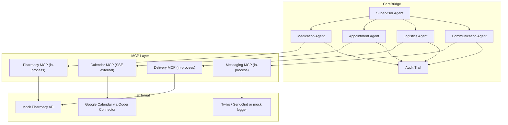
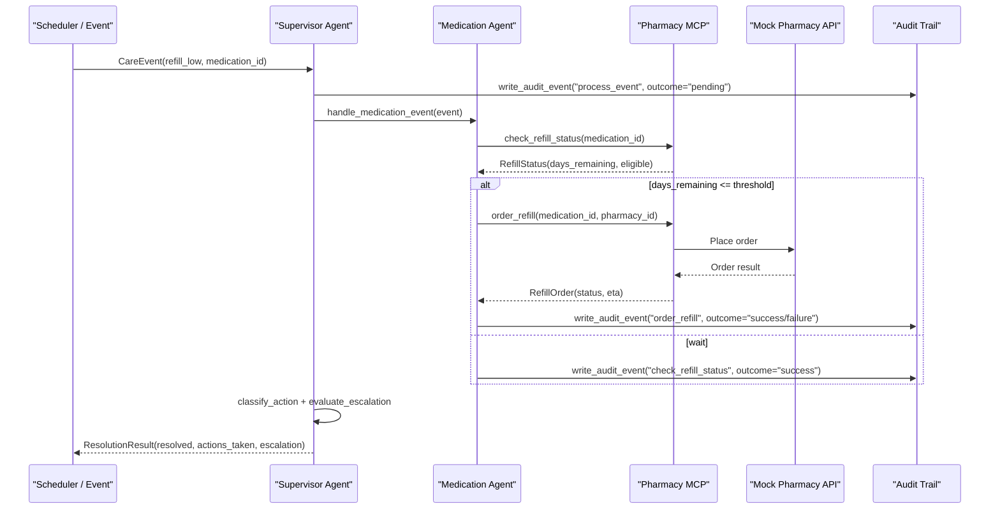
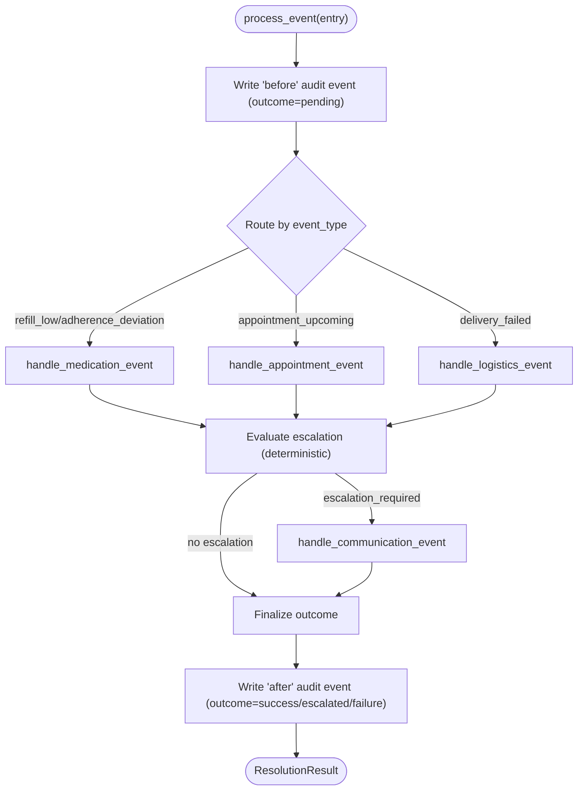
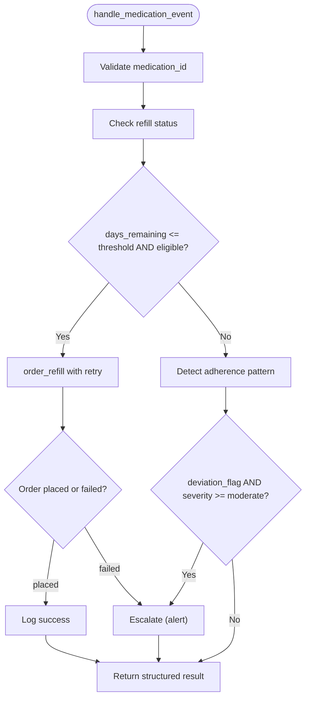
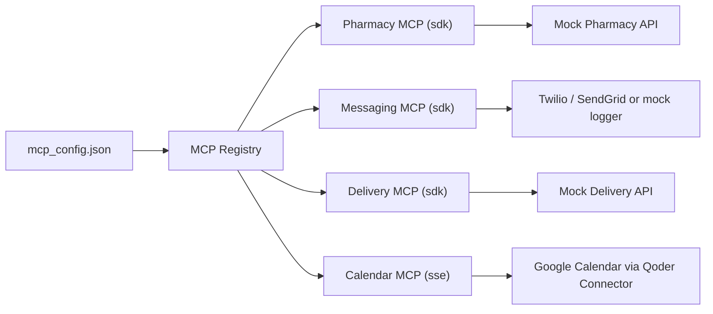
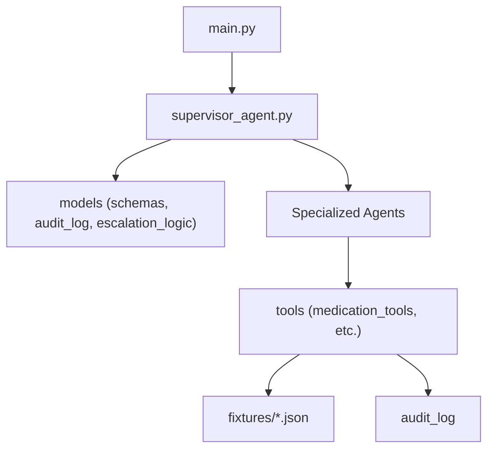

# MCP Overview and Architecture

<cite>
**Referenced Files in This Document**
- [main.py](file://main.py)
- [architecture.md](file://architecture.md)
- [SPEC.md](file://SPEC.md)
- [supervisor_agent.py](file://src/agents/supervisor_agent.py)
- [medication_agent.py](file://src/agents/medication_agent.py)
- [medication_tools.py](file://src/tools/medication_tools.py)
</cite>

## Table of Contents
1. [Introduction](#introduction)
2. [Project Structure](#project-structure)
3. [Core Components](#core-components)
4. [Architecture Overview](#architecture-overview)
5. [Detailed Component Analysis](#detailed-component-analysis)
6. [Dependency Analysis](#dependency-analysis)
7. [Performance Considerations](#performance-considerations)
8. [Troubleshooting Guide](#troubleshooting-guide)
9. [Conclusion](#conclusion)
10. [Appendices](#appendices)

## Introduction
This document explains CareBridge’s Model Context Protocol (MCP) architecture with a focus on the in-process service pattern. It describes how MCP standardizes tool interfaces so AI agents can integrate seamlessly with external services, and how the Qoder MCP SDK pattern using create_sdk_mcp_server enables service registration and discovery. It also details why in-process MCP servers are advantageous over traditional API calls—reducing latency, simplifying error handling, and improving testability—and provides architectural diagrams mapping agents, tools, and MCP servers. Finally, it covers service lifecycle management, configuration patterns, and monitoring approaches specific to MCP implementations in CareBridge.

## Project Structure
CareBridge is organized around agents that orchestrate care workflows and tools that encapsulate domain operations. The MCP integration layer abstracts external systems behind standardized tool interfaces. Key directories:
- src/agents: Specialized agents (Medication, Appointment, Logistics, Communication) and the Supervisor orchestrator
- src/tools: Domain-specific tool functions (e.g., medication refills, adherence detection)
- src/models: Data schemas, escalation logic, and immutable audit trail
- fixtures: JSON data used for mock external APIs
- main.py: Entry point that initializes logging, loads fixtures, creates the supervisor agent, and runs demo scenarios

**Diagram sources**
- [architecture.md:10-75](file://architecture.md#L10-L75)
- [architecture.md:211-262](file://architecture.md#L211-L262)

**Section sources**
- [main.py:1-182](file://main.py#L1-L182)
- [architecture.md:430-499](file://architecture.md#L430-L499)

## Core Components
- Supervisor Agent: Orchestrates events, routes to specialized agents, applies deterministic escalation logic, and ensures every action is audited before execution.
- Specialized Agents: Encapsulate domain responsibilities (medications, appointments, logistics, communication).
- Tools: Implement concrete operations like checking refill status, ordering refills, and detecting adherence patterns.
- MCP Servers: Provide standardized tool interfaces to external services; most run in-process via Qoder’s SDK, except calendar which uses SSE.

Key implementation highlights:
- Supervisor routing and escalation are deterministic and never LLM-decided.
- Audit-before-action is enforced across all critical paths.
- In-process MCP servers eliminate subprocess overhead and enable direct access to shared state (e.g., audit log connection).

**Section sources**
- [supervisor_agent.py:1-641](file://src/agents/supervisor_agent.py#L1-L641)
- [SPEC.md:36-251](file://SPEC.md#L36-L251)
- [architecture.md:211-262](file://architecture.md#L211-L262)

## Architecture Overview
The system uses an “agents-as-tools” pattern where the Supervisor holds instances of specialized agents as callable tools. MCP servers provide standardized tool interfaces to external services. For example, the Medication Agent interacts with the Pharmacy MCP server to check refill status and place orders.

**Diagram sources**
- [supervisor_agent.py:285-395](file://src/agents/supervisor_agent.py#L285-L395)
- [medication_agent.py:23-134](file://src/agents/medication_agent.py#L23-L134)
- [medication_tools.py:65-152](file://src/tools/medication_tools.py#L65-L152)
- [architecture.md:83-108](file://architecture.md#L83-L108)

## Detailed Component Analysis

### Supervisor Agent
Responsibilities:
- Route care events to specialized agents based on event_type.
- Apply deterministic escalation logic using classification tables.
- Ensure audit-before-action for all critical operations.
- Manage approval flows for actions requiring human authorization.

Key behaviors:
- process_event writes a pending audit entry, routes to the appropriate agent, evaluates escalation, optionally triggers communication alerts, and writes a final outcome.
- approve_pending_action locates pending actions in the audit trail, records human decisions, and re-routes approved actions to the owning agent.

**Diagram sources**
- [supervisor_agent.py:285-395](file://src/agents/supervisor_agent.py#L285-L395)

**Section sources**
- [supervisor_agent.py:1-641](file://src/agents/supervisor_agent.py#L1-L641)

### Medication Agent
Responsibilities:
- Check refill status and determine eligibility.
- Order refills with retry logic and audit trails.
- Detect adherence patterns and escalate when deviations exceed thresholds.

Processing flow:
- Validate input (medication_id).
- Check refill status from fixtures or MCP-backed tools.
- If eligible, attempt refill order with retries; capture success/failure and escalate if exhausted.
- Detect adherence patterns; alert family for moderate/severe deviations.

**Diagram sources**
- [medication_agent.py:23-134](file://src/agents/medication_agent.py#L23-L134)
- [medication_tools.py:65-152](file://src/tools/medication_tools.py#L65-L152)

**Section sources**
- [medication_agent.py:1-189](file://src/agents/medication_agent.py#L1-L189)
- [medication_tools.py:1-208](file://src/tools/medication_tools.py#L1-L208)

### MCP Integration Pattern (In-Process Services)
CareBridge uses Qoder’s in-process MCP SDK pattern (create_sdk_mcp_server) for Pharmacy, Messaging, and Delivery servers. The Calendar server uses SSE via Qoder Connector.

Benefits of in-process MCP:
- No subprocess lifecycle management
- Direct access to shared Python state (audit log connection)
- Faster startup (no MCP handshake)
- Simpler debugging (single process)

Configuration:
- mcp_config.json declares server types and endpoints; SDK-type servers run in-process, SSE-type connects externally.

**Diagram sources**
- [architecture.md:211-262](file://architecture.md#L211-L262)

**Section sources**
- [architecture.md:211-262](file://architecture.md#L211-L262)
- [SPEC.md:364-392](file://SPEC.md#L364-L392)

## Dependency Analysis
Components and their relationships:
- main.py initializes logging, loads fixtures, creates the supervisor agent, and runs demo scenarios.
- supervisor_agent.py depends on models (schemas, audit_log, escalation_logic) and specialized agent handlers.
- medication_agent.py depends on tools (medication_tools) and retry utilities.
- medication_tools.py reads fixtures and writes audit events; integrates with MCP-backed tools conceptually.

**Diagram sources**
- [main.py:1-182](file://main.py#L1-L182)
- [supervisor_agent.py:1-641](file://src/agents/supervisor_agent.py#L1-L641)
- [medication_tools.py:1-208](file://src/tools/medication_tools.py#L1-L208)

**Section sources**
- [main.py:1-182](file://main.py#L1-L182)
- [supervisor_agent.py:1-641](file://src/agents/supervisor_agent.py#L1-L641)
- [medication_tools.py:1-208](file://src/tools/medication_tools.py#L1-L208)

## Performance Considerations
- In-process MCP servers reduce latency by eliminating subprocess overhead and network handshakes.
- Deterministic escalation logic avoids unnecessary LLM calls, keeping response times predictable.
- Retry policies with exponential backoff improve resilience without blocking long-running tasks.
- Audit-before-action ensures consistent observability with minimal performance impact due to lightweight SQLite writes.

[No sources needed since this section provides general guidance]

## Troubleshooting Guide
Common issues and resolutions:
- Missing fixture files: Ensure required fixtures exist before running; main.py validates presence at startup.
- Routing failures: Verify event_type matches known routes; supervisor raises ValueError for unknown types.
- Audit DB initialization: Supervisor ensures audit DB is initialized once per process; failures prevent unsafe execution.
- External MCP connectivity: Calendar uses SSE; ensure connector availability or fallback to in-process mock.

Operational checks:
- Confirm mcp_config.json lists all servers and correct transport types.
- Validate that each agent’s tools are registered and callable.
- Review logs for retry exhaustion and escalation notifications.

**Section sources**
- [main.py:45-63](file://main.py#L45-L63)
- [supervisor_agent.py:259-278](file://src/agents/supervisor_agent.py#L259-L278)
- [architecture.md:211-262](file://architecture.md#L211-L262)

## Conclusion
CareBridge’s MCP architecture leverages in-process services to provide low-latency, reliable integrations between AI agents and external systems. The Qoder MCP SDK pattern with create_sdk_mcp_server standardizes tool interfaces and simplifies service registration and discovery. Combined with deterministic escalation, audit-before-action, and robust retry strategies, this design delivers resilient care coordination workflows that are easy to test, debug, and monitor.

[No sources needed since this section summarizes without analyzing specific files]

## Appendices

### Service Lifecycle Management
- Initialization: main.py sets up logging, loads fixtures, and creates the supervisor agent.
- Registration: MCP servers are declared in mcp_config.json; SDK-type servers run in-process, SSE-type connects externally.
- Shutdown: Single-process model simplifies cleanup; ensure audit DB remains intact for immutability.

**Section sources**
- [main.py:143-182](file://main.py#L143-L182)
- [architecture.md:211-262](file://architecture.md#L211-L262)

### Configuration Patterns
- Transport selection: SDK vs SSE based on service needs and existing connectors.
- Environment variables: Tokens and keys injected via environment; calendar server uses Authorization headers.
- Fallbacks: Calendar falls back to in-process mock if connector unavailable.

**Section sources**
- [architecture.md:244-262](file://architecture.md#L244-L262)
- [SPEC.md:387-392](file://SPEC.md#L387-L392)

### Monitoring Approaches
- Immutable audit trail: Every action recorded before execution; SQLite triggers prevent updates/deletes.
- Logging: Structured logs for routing, errors, escalations, and outcomes.
- Observability: Cloud logs and metrics available in production deployments; evaluations track agent behavior.

**Section sources**
- [SPEC.md:395-433](file://SPEC.md#L395-L433)
- [architecture.md:329-370](file://architecture.md#L329-L370)