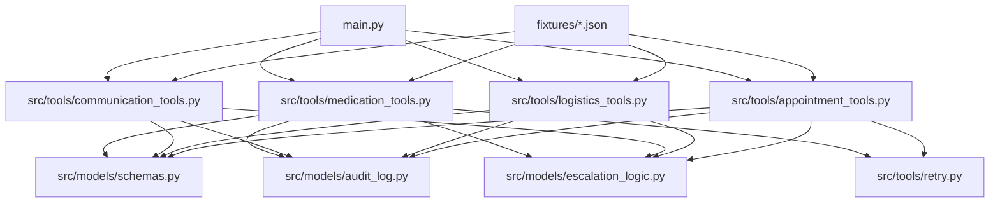
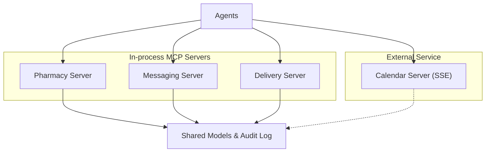
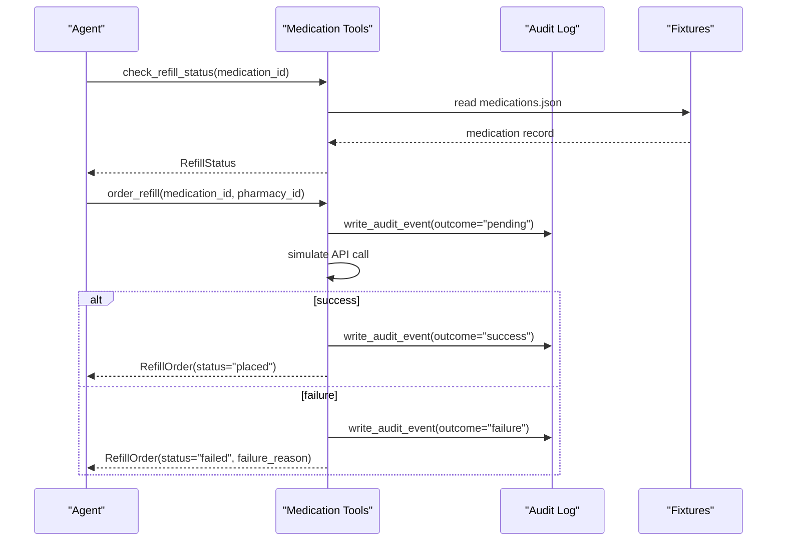
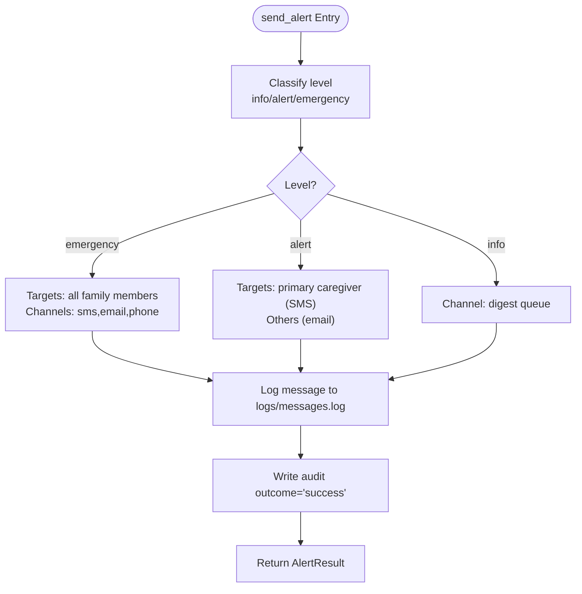
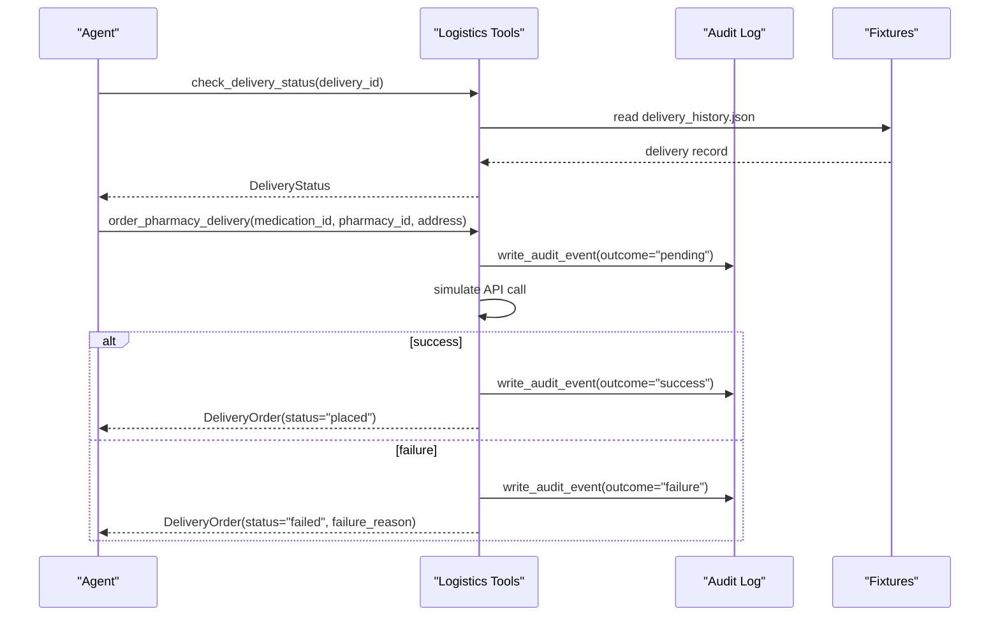
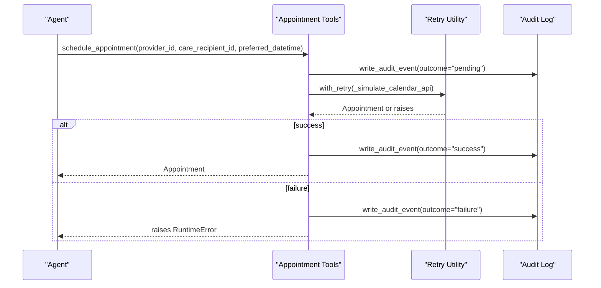
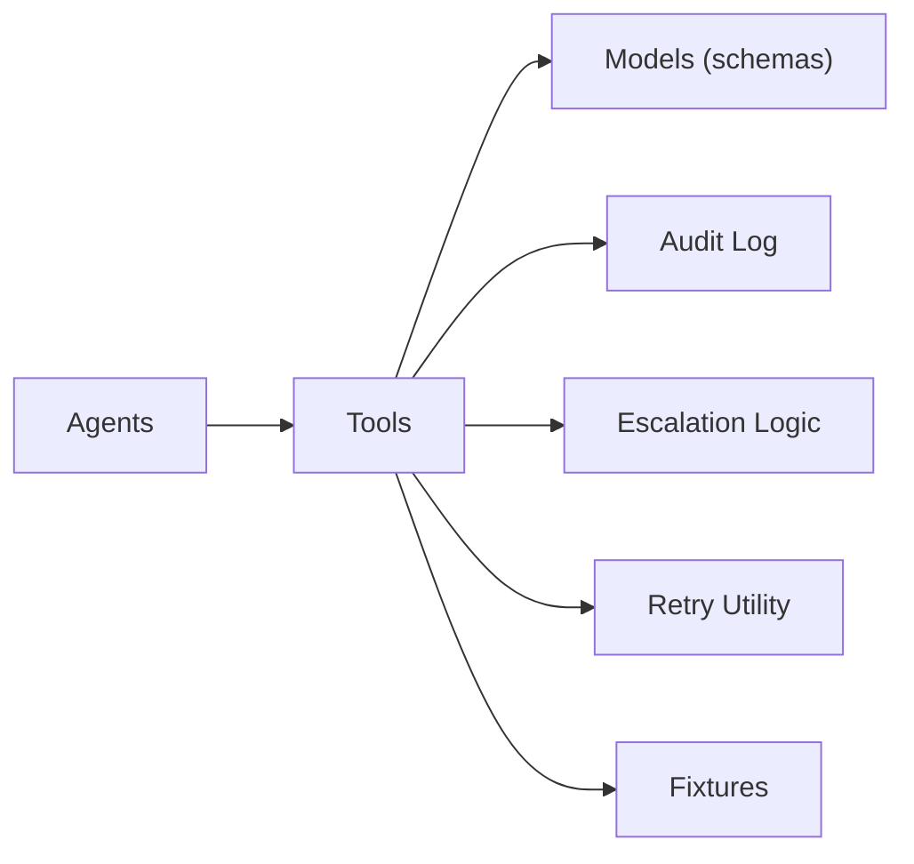

# MCP Servers

<cite>
**Referenced Files in This Document**
- [main.py](file://main.py)
- [architecture.md](file://architecture.md)
- [SPEC.md](file://SPEC.md)
- [pyproject.toml](file://pyproject.toml)
- [src/tools/medication_tools.py](file://src/tools/medication_tools.py)
- [src/tools/communication_tools.py](file://src/tools/communication_tools.py)
- [src/tools/logistics_tools.py](file://src/tools/logistics_tools.py)
- [src/tools/appointment_tools.py](file://src/tools/appointment_tools.py)
- [src/models/schemas.py](file://src/models/schemas.py)
- [src/models/audit_log.py](file://src/models/audit_log.py)
- [src/models/escalation_logic.py](file://src/models/escalation_logic.py)
- [src/tools/retry.py](file://src/tools/retry.py)
- [fixtures/medications.json](file://fixtures/medications.json)
- [fixtures/appointments.json](file://fixtures/appointments.json)
- [fixtures/delivery_history.json](file://fixtures/delivery_history.json)
- [fixtures/family_members.json](file://fixtures/family_members.json)
- [tests/integration/test_escalation_flow.py](file://tests/integration/test_escalation_flow.py)
</cite>

## Table of Contents
1. [Introduction](#introduction)
2. [Project Structure](#project-structure)
3. [Core Components](#core-components)
4. [Architecture Overview](#architecture-overview)
5. [Detailed Component Analysis](#detailed-component-analysis)
6. [Dependency Analysis](#dependency-analysis)
7. [Performance Considerations](#performance-considerations)
8. [Troubleshooting Guide](#troubleshooting-guide)
9. [Conclusion](#conclusion)
10. [Appendices](#appendices)

## Introduction
This document describes CareBridge’s Model Context Protocol (MCP) server implementations with a focus on the in-process service architecture. It explains how agents integrate with external services through standardized tool interfaces, and documents each MCP server implementation: pharmacy, messaging, delivery, and calendar. It also details the Qoder MCP SDK pattern for in-process registration using create_sdk_mcp_server, provides tool specifications including function signatures, parameter validation, and response formats, and covers mock behaviors and failure simulation for testing. Finally, it addresses service discovery, error handling, monitoring approaches, and guidelines for developing new MCP servers following established patterns and contracts.

## Project Structure
CareBridge organizes functionality into tools that implement domain operations (pharmacy, communication, logistics, appointments), shared models for data schemas, an immutable audit log, deterministic escalation logic, and a retry utility. The entry point initializes logging, loads fixtures, and runs demo scenarios. Configuration for tests is centralized under pytest options.

**Diagram sources**
- [main.py:1-182](file://main.py#L1-L182)
- [src/tools/medication_tools.py:1-208](file://src/tools/medication_tools.py#L1-L208)
- [src/tools/communication_tools.py:1-279](file://src/tools/communication_tools.py#L1-L279)
- [src/tools/logistics_tools.py:1-220](file://src/tools/logistics_tools.py#L1-L220)
- [src/tools/appointment_tools.py:1-242](file://src/tools/appointment_tools.py#L1-L242)
- [src/models/schemas.py:1-150](file://src/models/schemas.py#L1-L150)
- [src/models/audit_log.py:1-167](file://src/models/audit_log.py#L1-L167)
- [src/models/escalation_logic.py:1-71](file://src/models/escalation_logic.py#L1-L71)
- [src/tools/retry.py:1-69](file://src/tools/retry.py#L1-L69)
- [fixtures/medications.json:1-33](file://fixtures/medications.json#L1-L33)
- [fixtures/appointments.json:1-33](file://fixtures/appointments.json#L1-L33)
- [fixtures/delivery_history.json:1-33](file://fixtures/delivery_history.json#L1-L33)
- [fixtures/family_members.json:1-30](file://fixtures/family_members.json#L1-L30)

**Section sources**
- [main.py:1-182](file://main.py#L1-L182)
- [pyproject.toml:1-4](file://pyproject.toml#L1-L4)

## Core Components
- Shared data models define the contract between agents and tools, ensuring consistent request/response shapes across domains.
- Immutable audit logging records every action with before/after outcomes and correlation IDs to trace end-to-end flows.
- Deterministic escalation logic classifies actions into auto, alert, or approve categories without LLM involvement.
- Retry utility standardizes resilient calls to external APIs with exponential backoff.

Key responsibilities:
- Medication tools: refill status checks, refill ordering, adherence analysis.
- Communication tools: alerts, status synthesis, family preferences.
- Logistics tools: delivery status checks, grocery and pharmacy delivery orders.
- Appointment tools: calendar queries, appointment scheduling, prep checklists.

**Section sources**
- [src/models/schemas.py:1-150](file://src/models/schemas.py#L1-L150)
- [src/models/audit_log.py:1-167](file://src/models/audit_log.py#L1-L167)
- [src/models/escalation_logic.py:1-71](file://src/models/escalation_logic.py#L1-L71)
- [src/tools/retry.py:1-69](file://src/tools/retry.py#L1-L69)

## Architecture Overview
CareBridge uses an in-process MCP server pattern for most services (pharmacy, messaging, delivery) via Qoder’s create_sdk_mcp_server, enabling direct access to shared state and zero subprocess overhead. The calendar service connects externally via SSE through a Qoder Connector.

**Diagram sources**
- [architecture.md:228-262](file://architecture.md#L228-L262)
- [SPEC.md:364-392](file://SPEC.md#L364-L392)

**Section sources**
- [architecture.md:228-262](file://architecture.md#L228-L262)
- [SPEC.md:364-392](file://SPEC.md#L364-L392)

## Detailed Component Analysis

### Pharmacy MCP (in-process)
Purpose: Provide medication management tools for checking refill eligibility and placing refill orders.

Tools and behavior:
- check_refill_status(medication_id: str) -> RefillStatus
  - Reads medications from fixtures; computes days_remaining vs refill_threshold to determine eligibility; returns pharmacy_id.
  - Raises ValueError if medication not found.
- order_refill(medication_id: str, pharmacy_id: str) -> RefillOrder
  - Writes a pending audit event before execution; simulates API call; writes success or failure follow-up events; returns order details.
  - On exception, logs error and returns a failed order with failure_reason.
- detect_adherence_pattern(medication_id: str, window_days: int = 7) -> AdherencePattern
  - Mocks adherence analysis; returns deviation severity based on fixture data.

Parameter validation and response formats:
- Inputs validated against fixture keys; responses conform to Pydantic models RefillStatus, RefillOrder, AdherencePattern.

Mock behaviors and failure simulation:
- Simulated API calls return synthetic results; exceptions are caught and recorded in audit trail.

**Diagram sources**
- [src/tools/medication_tools.py:34-152](file://src/tools/medication_tools.py#L34-L152)
- [src/models/audit_log.py:81-130](file://src/models/audit_log.py#L81-L130)
- [fixtures/medications.json:1-33](file://fixtures/medications.json#L1-L33)

**Section sources**
- [src/tools/medication_tools.py:1-208](file://src/tools/medication_tools.py#L1-L208)
- [src/models/schemas.py:73-94](file://src/models/schemas.py#L73-L94)
- [fixtures/medications.json:1-33](file://fixtures/medications.json#L1-L33)

### Messaging MCP (in-process)
Purpose: Provide SMS/email delivery and alerting capabilities.

Tools and behavior:
- send_alert(recipient_id: str, message: str, level: Literal["info","alert","emergency"]) -> AlertResult
  - Determines channels and targets based on level; logs messages to logs/messages.log; writes pending and final audit events; returns AlertResult with channel_used and sent_at.
  - Raises RuntimeError on failure after retries.
- synthesize_status(care_recipient_id: str) -> StatusSummary
  - Aggregates recent audit events and pending actions to produce a human-readable summary.
- get_family_preferences(family_id: str) -> FamilyPreferences
  - Loads family members from fixtures and builds escalation order by priority.

Parameter validation and response formats:
- Level enforced via Literal; responses conform to AlertResult, StatusSummary, FamilyPreferences.

Mock behaviors and failure simulation:
- Messages are persisted as JSON lines; failures raise RuntimeError and are captured in audit trail.

**Diagram sources**
- [src/tools/communication_tools.py:54-157](file://src/tools/communication_tools.py#L54-L157)
- [src/tools/communication_tools.py:160-231](file://src/tools/communication_tools.py#L160-L231)
- [src/tools/communication_tools.py:234-279](file://src/tools/communication_tools.py#L234-L279)
- [src/models/schemas.py:118-146](file://src/models/schemas.py#L118-L146)

**Section sources**
- [src/tools/communication_tools.py:1-279](file://src/tools/communication_tools.py#L1-L279)
- [src/models/schemas.py:118-146](file://src/models/schemas.py#L118-L146)
- [fixtures/family_members.json:1-30](file://fixtures/family_members.json#L1-L30)

### Delivery MCP (in-process)
Purpose: Coordinate logistics for grocery and pharmacy deliveries.

Tools and behavior:
- check_delivery_status(delivery_id: str) -> DeliveryStatus
  - Reads delivery history from fixtures; returns current status and expected arrival; raises ValueError if not found.
- order_grocery(care_recipient_id: str, items: list[str], delivery_address: str) -> DeliveryOrder
  - Writes pending audit event; simulates API call; writes success/failure audit events; returns DeliveryOrder.
- order_pharmacy_delivery(medication_id: str, pharmacy_id: str, delivery_address: str) -> DeliveryOrder
  - Resolves care_recipient_id from medication fixtures when possible; writes pending audit event; simulates API call; writes success/failure audit events; returns DeliveryOrder.

Parameter validation and response formats:
- Inputs validated against fixture keys; responses conform to DeliveryStatus and DeliveryOrder.

Mock behaviors and failure simulation:
- Simulated API calls return synthetic order and delivery IDs; exceptions are logged and raised as RuntimeError.

**Diagram sources**
- [src/tools/logistics_tools.py:23-53](file://src/tools/logistics_tools.py#L23-L53)
- [src/tools/logistics_tools.py:131-219](file://src/tools/logistics_tools.py#L131-L219)
- [src/models/audit_log.py:81-130](file://src/models/audit_log.py#L81-L130)
- [fixtures/delivery_history.json:1-33](file://fixtures/delivery_history.json#L1-L33)

**Section sources**
- [src/tools/logistics_tools.py:1-220](file://src/tools/logistics_tools.py#L1-L220)
- [src/models/schemas.py:96-109](file://src/models/schemas.py#L96-L109)
- [fixtures/delivery_history.json:1-33](file://fixtures/delivery_history.json#L1-L33)

### Calendar MCP (external SSE)
Purpose: Manage appointments via an external SSE-based server exposed by the Qoder Connector.

Tools and behavior:
- get_calendar(care_recipient_id: str, horizon_days: int = 30) -> list[Appointment]
  - Filters upcoming appointments within horizon; raises ValueError if none found.
- schedule_appointment(provider_id: str, care_recipient_id: str, preferred_datetime: datetime) -> Appointment
  - Writes pending audit event; uses retry utility for simulated API call; writes success/failure audit events; returns Appointment.
- send_prep_checklist(appointment_id: str) -> ChecklistResult
  - Validates appointment existence; returns checklist delivery result.

Parameter validation and response formats:
- Inputs validated against fixture keys; responses conform to Appointment and ChecklistResult.

Mock behaviors and failure simulation:
- Simulated calendar API returns synthetic appointment; errors are wrapped and retried per retry policy.

**Diagram sources**
- [src/tools/appointment_tools.py:39-80](file://src/tools/appointment_tools.py#L39-L80)
- [src/tools/appointment_tools.py:117-200](file://src/tools/appointment_tools.py#L117-L200)
- [src/tools/retry.py:22-69](file://src/tools/retry.py#L22-L69)
- [src/models/audit_log.py:81-130](file://src/models/audit_log.py#L81-L130)

**Section sources**
- [src/tools/appointment_tools.py:1-242](file://src/tools/appointment_tools.py#L1-L242)
- [src/models/schemas.py:23-32](file://src/models/schemas.py#L23-L32)
- [src/tools/retry.py:1-69](file://src/tools/retry.py#L1-L69)

### Qoder MCP SDK Pattern (create_sdk_mcp_server)
- In-process servers use create_sdk_mcp_server to register tools directly in the host process, avoiding subprocess lifecycle and enabling direct access to shared Python state (e.g., audit log connection).
- Transport rationale:
  - Pharmacy, messaging, delivery: in-process SDK for custom tools and zero overhead.
  - Calendar: external SSE via Qoder Connector.
- Configuration example shows server types and connector settings.

**Section sources**
- [architecture.md:228-262](file://architecture.md#L228-L262)
- [SPEC.md:364-392](file://SPEC.md#L364-L392)

## Dependency Analysis
The system exhibits clear separation of concerns:
- Tools depend on shared models and utilities (audit log, escalation logic, retry).
- Agents orchestrate tools and handle outcomes.
- Fixtures provide deterministic test data.

**Diagram sources**
- [src/tools/medication_tools.py:1-208](file://src/tools/medication_tools.py#L1-L208)
- [src/tools/communication_tools.py:1-279](file://src/tools/communication_tools.py#L1-L279)
- [src/tools/logistics_tools.py:1-220](file://src/tools/logistics_tools.py#L1-L220)
- [src/tools/appointment_tools.py:1-242](file://src/tools/appointment_tools.py#L1-L242)
- [src/models/schemas.py:1-150](file://src/models/schemas.py#L1-L150)
- [src/models/audit_log.py:1-167](file://src/models/audit_log.py#L1-L167)
- [src/models/escalation_logic.py:1-71](file://src/models/escalation_logic.py#L1-L71)
- [src/tools/retry.py:1-69](file://src/tools/retry.py#L1-L69)
- [fixtures/medications.json:1-33](file://fixtures/medications.json#L1-L33)
- [fixtures/appointments.json:1-33](file://fixtures/appointments.json#L1-L33)
- [fixtures/delivery_history.json:1-33](file://fixtures/delivery_history.json#L1-L33)
- [fixtures/family_members.json:1-30](file://fixtures/family_members.json#L1-L30)

**Section sources**
- [src/tools/medication_tools.py:1-208](file://src/tools/medication_tools.py#L1-L208)
- [src/tools/communication_tools.py:1-279](file://src/tools/communication_tools.py#L1-L279)
- [src/tools/logistics_tools.py:1-220](file://src/tools/logistics_tools.py#L1-L220)
- [src/tools/appointment_tools.py:1-242](file://src/tools/appointment_tools.py#L1-L242)
- [src/models/schemas.py:1-150](file://src/models/schemas.py#L1-L150)
- [src/models/audit_log.py:1-167](file://src/models/audit_log.py#L1-L167)
- [src/models/escalation_logic.py:1-71](file://src/models/escalation_logic.py#L1-L71)
- [src/tools/retry.py:1-69](file://src/tools/retry.py#L1-L69)

## Performance Considerations
- In-process MCP servers eliminate subprocess overhead and enable direct state access, improving startup time and simplifying debugging.
- Retry utility standardizes resilience with exponential backoff to reduce transient failures.
- Fixture-driven mocks ensure deterministic performance during tests and development.

[No sources needed since this section provides general guidance]

## Troubleshooting Guide
Common issues and resolutions:
- Missing fixtures: Ensure required fixture files exist; main entry point validates presence at startup.
- Audit DB initialization: Confirm audit database is initialized before running scenarios; triggers enforce immutability.
- Retry exhaustion: When external calls fail repeatedly, RetryExhausted is raised; integration tests verify escalation paths trigger family alerts and audit outcomes.
- Validation errors: Parameter mismatches raise ValueError; inspect fixture keys and model constraints.

Recommended steps:
- Check logs/messages.log for communication outputs.
- Inspect audit.db for event sequences and correlation IDs.
- Use integration tests to validate end-to-end flows and escalation behavior.

**Section sources**
- [main.py:45-63](file://main.py#L45-L63)
- [src/models/audit_log.py:19-78](file://src/models/audit_log.py#L19-L78)
- [tests/integration/test_escalation_flow.py:1-41](file://tests/integration/test_escalation_flow.py#L1-L41)
- [src/tools/retry.py:14-69](file://src/tools/retry.py#L14-L69)

## Conclusion
CareBridge’s MCP server design leverages in-process registration for fast, stateful integrations while maintaining a robust audit trail and deterministic escalation logic. Standardized tools and models ensure consistency across domains, and retry mechanisms improve resilience. The calendar service integrates externally via SSE, demonstrating flexible transport choices. Following the documented patterns enables reliable extension with new MCP servers.

[No sources needed since this section summarizes without analyzing specific files]

## Appendices

### Tool Specifications Summary
- Pharmacy
  - check_refill_status(medication_id: str) -> RefillStatus
  - order_refill(medication_id: str, pharmacy_id: str) -> RefillOrder
  - detect_adherence_pattern(medication_id: str, window_days: int = 7) -> AdherencePattern
- Messaging
  - send_alert(recipient_id: str, message: str, level: Literal["info","alert","emergency"]) -> AlertResult
  - synthesize_status(care_recipient_id: str) -> StatusSummary
  - get_family_preferences(family_id: str) -> FamilyPreferences
- Delivery
  - check_delivery_status(delivery_id: str) -> DeliveryStatus
  - order_grocery(care_recipient_id: str, items: list[str], delivery_address: str) -> DeliveryOrder
  - order_pharmacy_delivery(medication_id: str, pharmacy_id: str, delivery_address: str) -> DeliveryOrder
- Calendar
  - get_calendar(care_recipient_id: str, horizon_days: int = 30) -> list[Appointment]
  - schedule_appointment(provider_id: str, care_recipient_id: str, preferred_datetime: datetime) -> Appointment
  - send_prep_checklist(appointment_id: str) -> ChecklistResult

**Section sources**
- [src/tools/medication_tools.py:34-208](file://src/tools/medication_tools.py#L34-L208)
- [src/tools/communication_tools.py:54-279](file://src/tools/communication_tools.py#L54-L279)
- [src/tools/logistics_tools.py:23-220](file://src/tools/logistics_tools.py#L23-L220)
- [src/tools/appointment_tools.py:39-242](file://src/tools/appointment_tools.py#L39-L242)
- [src/models/schemas.py:13-146](file://src/models/schemas.py#L13-L146)

### Guidelines for Developing New MCP Servers
- Use create_sdk_mcp_server for in-process registration to avoid subprocess overhead and access shared state directly.
- Define tools with strict input validation using Pydantic models; return structured responses only.
- Implement audit-first pattern: write a pending audit event before executing, then update with success/failure outcomes.
- Apply deterministic escalation logic for actions requiring alerts or approvals; never rely on LLM classification.
- Use retry utility for external calls to ensure resilience with exponential backoff.
- Leverage fixtures for deterministic testing and mock behaviors; add new fixtures as needed.
- Configure transports appropriately: in-process SDK for internal services, SSE for external connectors.

**Section sources**
- [architecture.md:228-262](file://architecture.md#L228-L262)
- [SPEC.md:364-392](file://SPEC.md#L364-L392)
- [src/models/escalation_logic.py:1-71](file://src/models/escalation_logic.py#L1-L71)
- [src/tools/retry.py:1-69](file://src/tools/retry.py#L1-L69)
- [src/models/audit_log.py:81-130](file://src/models/audit_log.py#L81-L130)