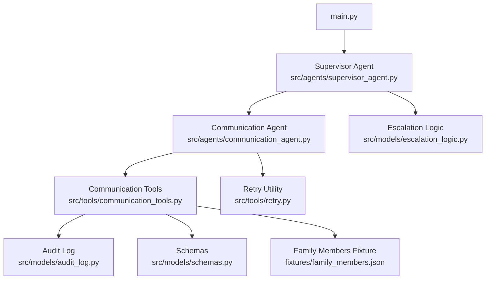
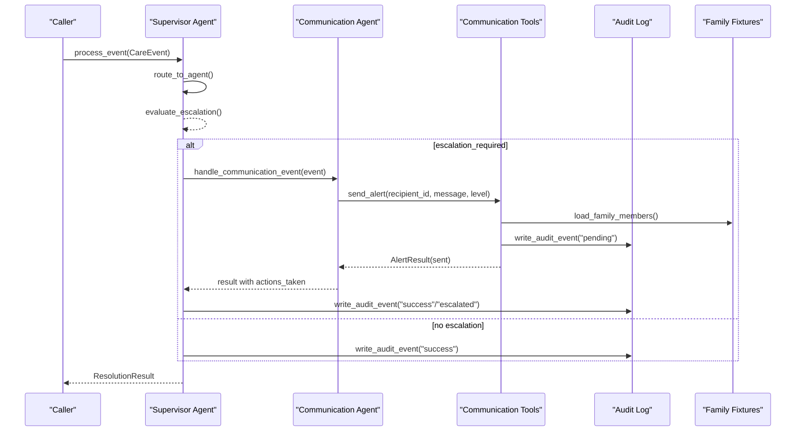
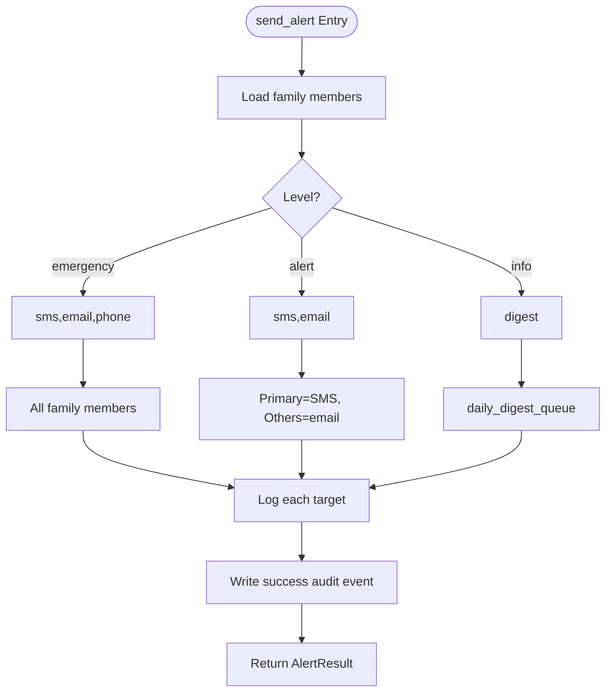
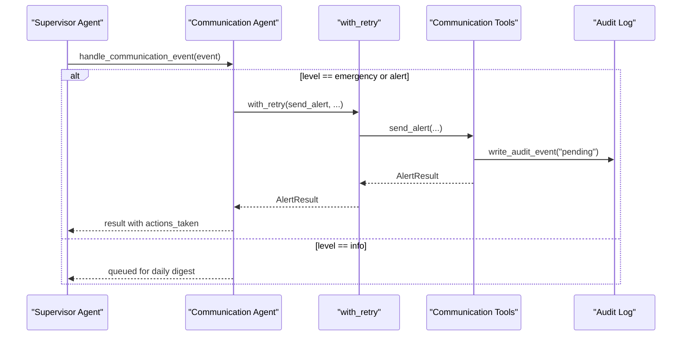
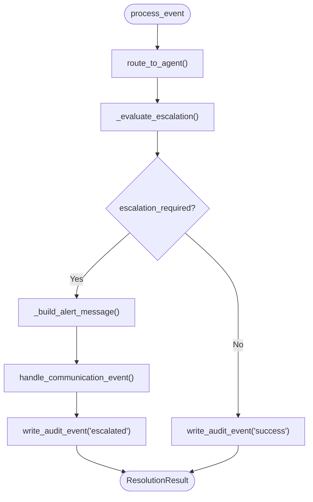
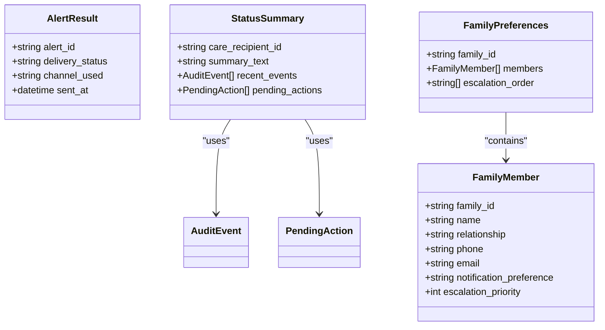
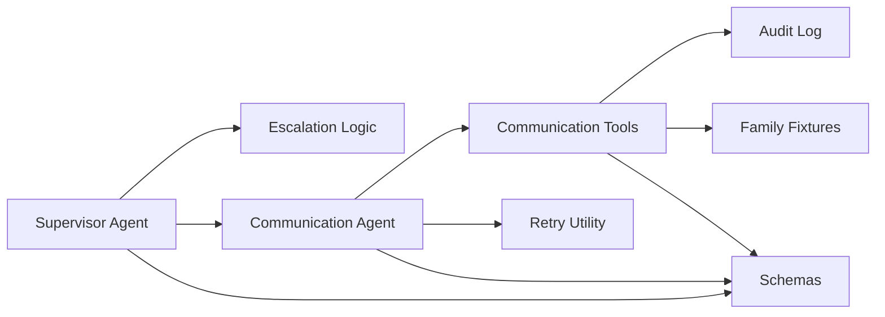

# Messaging MCP Server

<cite>
**Referenced Files in This Document**
- [main.py](file://main.py)
- [architecture.md](file://architecture.md)
- [src/agents/supervisor_agent.py](file://src/agents/supervisor_agent.py)
- [src/agents/communication_agent.py](file://src/agents/communication_agent.py)
- [src/tools/communication_tools.py](file://src/tools/communication_tools.py)
- [src/models/schemas.py](file://src/models/schemas.py)
- [src/models/escalation_logic.py](file://src/models/escalation_logic.py)
- [src/models/audit_log.py](file://src/models/audit_log.py)
- [src/tools/retry.py](file://src/tools/retry.py)
- [fixtures/family_members.json](file://fixtures/family_members.json)
</cite>

## Table of Contents
1. [Introduction](#introduction)
2. [Project Structure](#project-structure)
3. [Core Components](#core-components)
4. [Architecture Overview](#architecture-overview)
5. [Detailed Component Analysis](#detailed-component-analysis)
6. [Dependency Analysis](#dependency-analysis)
7. [Performance Considerations](#performance-considerations)
8. [Troubleshooting Guide](#troubleshooting-guide)
9. [Conclusion](#conclusion)
10. [Appendices](#appendices)

## Introduction
This document describes the messaging capabilities within CareBridge’s MCP server implementation, focusing on SMS and email delivery services as used by the Communication Agent and tools. The system currently simulates external messaging APIs (SMS, email, phone) by logging to a file, with clear extension points for integrating real providers such as Twilio for SMS and SendGrid for email. It documents alerting levels, recipient selection, retry behavior, audit trails, and how automated workflows trigger notifications for events like medication refills, upcoming appointments, and delivery failures.

## Project Structure
The messaging subsystem is implemented across agents, tools, models, and fixtures:
- Supervisor orchestrates event routing and escalation decisions.
- Communication Agent coordinates outbound alerts and status synthesis.
- Communication Tools simulate message dispatch and manage family preferences.
- Models define shared schemas, escalation rules, and an immutable audit log.
- Fixtures provide sample family members and contact preferences.

**Diagram sources**
- [main.py:92-171](file://main.py#L92-L171)
- [src/agents/supervisor_agent.py:285-395](file://src/agents/supervisor_agent.py#L285-L395)
- [src/agents/communication_agent.py:28-146](file://src/agents/communication_agent.py#L28-L146)
- [src/tools/communication_tools.py:54-157](file://src/tools/communication_tools.py#L54-L157)
- [src/models/audit_log.py:81-128](file://src/models/audit_log.py#L81-L128)
- [src/models/schemas.py:118-145](file://src/models/schemas.py#L118-L145)
- [src/models/escalation_logic.py:42-70](file://src/models/escalation_logic.py#L42-L70)
- [src/tools/retry.py:22-69](file://src/tools/retry.py#L22-L69)
- [fixtures/family_members.json:1-30](file://fixtures/family_members.json#L1-L30)

**Section sources**
- [main.py:92-171](file://main.py#L92-L171)
- [architecture.md:228-262](file://architecture.md#L228-L262)

## Core Components
- Supervisor Agent routes care events to specialized agents and decides escalation deterministically. When escalation is required, it constructs a communication event and invokes the Communication Agent.
- Communication Agent handles alerting logic based on severity levels (info, alert, emergency), applies retries, and returns structured results.
- Communication Tools implement send_alert, which selects recipients and channels based on level and family preferences, logs messages, and writes audit events.
- Retry utility provides exponential backoff for failed messaging calls.
- Models define data contracts (AlertResult, StatusSummary, FamilyPreferences, etc.), escalation classification, and an immutable audit trail.

Key responsibilities:
- Message composition: built from event context and agent actions; includes IDs only (no PII).
- Recipient management: derived from family fixture data and escalation priority.
- Delivery status tracking: via AlertResult and audit events.
- Error handling: exceptions are logged, audited, and surfaced with retry semantics.

**Section sources**
- [src/agents/supervisor_agent.py:285-395](file://src/agents/supervisor_agent.py#L285-L395)
- [src/agents/communication_agent.py:28-146](file://src/agents/communication_agent.py#L28-L146)
- [src/tools/communication_tools.py:54-157](file://src/tools/communication_tools.py#L54-L157)
- [src/tools/retry.py:22-69](file://src/tools/retry.py#L22-L69)
- [src/models/schemas.py:118-145](file://src/models/schemas.py#L118-L145)
- [src/models/escalation_logic.py:42-70](file://src/models/escalation_logic.py#L42-L70)
- [src/models/audit_log.py:81-128](file://src/models/audit_log.py#L81-L128)

## Architecture Overview
The messaging flow integrates with the broader CareBridge orchestration:
- Events enter via main demo or external triggers.
- Supervisor routes to specialized agents and evaluates escalation.
- If escalation is needed, a communication event is created and sent to the Communication Agent.
- Communication Agent uses Communication Tools to simulate sending alerts and records outcomes in the audit log.
- Retry logic ensures resilience against transient failures.

**Diagram sources**
- [src/agents/supervisor_agent.py:285-395](file://src/agents/supervisor_agent.py#L285-L395)
- [src/agents/communication_agent.py:28-146](file://src/agents/communication_agent.py#L28-L146)
- [src/tools/communication_tools.py:54-157](file://src/tools/communication_tools.py#L54-L157)
- [src/models/audit_log.py:81-128](file://src/models/audit_log.py#L81-L128)
- [fixtures/family_members.json:1-30](file://fixtures/family_members.json#L1-L30)

## Detailed Component Analysis

### Communication Tools: send_alert
- Determines channel usage and targets based on alert level:
  - Emergency: SMS + email + phone to all family members.
  - Alert: SMS to primary caregiver (priority 1), email to others.
  - Info: batch into daily digest queue.
- Logs each target to a JSON-lines file under logs/messages.log.
- Writes before-action and after-action audit events with correlation IDs.
- Returns AlertResult indicating delivery_status and channel_used.

**Diagram sources**
- [src/tools/communication_tools.py:54-157](file://src/tools/communication_tools.py#L54-L157)
- [fixtures/family_members.json:1-30](file://fixtures/family_members.json#L1-L30)

**Section sources**
- [src/tools/communication_tools.py:54-157](file://src/tools/communication_tools.py#L54-L157)
- [src/models/audit_log.py:81-128](file://src/models/audit_log.py#L81-L128)
- [fixtures/family_members.json:1-30](file://fixtures/family_members.json#L1-L30)

### Communication Agent: handle_communication_event and send_family_alert
- Reads event payload for level and message.
- For emergency/alert levels, sends family alerts using Communication Tools with retry.
- For info-level events, queues them for daily digest.
- Wraps send_alert with with_retry to handle transient failures (3 attempts, exponential backoff).
- Returns structured result including actions_taken and escalation flags.

**Diagram sources**
- [src/agents/communication_agent.py:28-146](file://src/agents/communication_agent.py#L28-L146)
- [src/tools/retry.py:22-69](file://src/tools/retry.py#L22-L69)
- [src/tools/communication_tools.py:54-157](file://src/tools/communication_tools.py#L54-L157)
- [src/models/audit_log.py:81-128](file://src/models/audit_log.py#L81-L128)

**Section sources**
- [src/agents/communication_agent.py:28-146](file://src/agents/communication_agent.py#L28-L146)
- [src/tools/retry.py:22-69](file://src/tools/retry.py#L22-L69)

### Supervisor Agent: escalation and communication routing
- Routes events to specialized agents and evaluates escalation deterministically.
- Builds alert messages referencing IDs only (no PII).
- On escalation, creates a communication event and invokes the Communication Agent.
- Records before-action and after-action audit events with correlation IDs.

**Diagram sources**
- [src/agents/supervisor_agent.py:285-395](file://src/agents/supervisor_agent.py#L285-L395)
- [src/models/escalation_logic.py:42-70](file://src/models/escalation_logic.py#L42-L70)
- [src/models/audit_log.py:81-128](file://src/models/audit_log.py#L81-L128)

**Section sources**
- [src/agents/supervisor_agent.py:285-395](file://src/agents/supervisor_agent.py#L285-L395)
- [src/models/escalation_logic.py:42-70](file://src/models/escalation_logic.py#L42-L70)

### Data Models and Preferences
- AlertResult captures delivery confirmation and channel used.
- StatusSummary aggregates recent audit events and pending actions for caregiver queries.
- FamilyPreferences defines family members, notification preferences, and escalation order.
- EscalationLogic classifies actions deterministically to ensure safety-critical decisions are never LLM-decided.

**Diagram sources**
- [src/models/schemas.py:118-145](file://src/models/schemas.py#L118-L145)
- [src/models/schemas.py:34-42](file://src/models/schemas.py#L34-L42)

**Section sources**
- [src/models/schemas.py:118-145](file://src/models/schemas.py#L118-L145)
- [src/models/schemas.py:34-42](file://src/models/schemas.py#L34-L42)
- [src/models/escalation_logic.py:42-70](file://src/models/escalation_logic.py#L42-L70)

## Dependency Analysis
- Supervisor depends on specialized agents and escalation logic; it does not call external APIs directly.
- Communication Agent depends on Communication Tools and Retry utility.
- Communication Tools depend on fixtures for recipient data and Audit Log for immutability.
- All components use shared schemas for consistent data exchange.

**Diagram sources**
- [src/agents/supervisor_agent.py:285-395](file://src/agents/supervisor_agent.py#L285-L395)
- [src/agents/communication_agent.py:28-146](file://src/agents/communication_agent.py#L28-L146)
- [src/tools/communication_tools.py:54-157](file://src/tools/communication_tools.py#L54-L157)
- [src/models/escalation_logic.py:42-70](file://src/models/escalation_logic.py#L42-L70)
- [src/models/audit_log.py:81-128](file://src/models/audit_log.py#L81-L128)
- [src/models/schemas.py:118-145](file://src/models/schemas.py#L118-L145)

**Section sources**
- [src/agents/supervisor_agent.py:285-395](file://src/agents/supervisor_agent.py#L285-L395)
- [src/agents/communication_agent.py:28-146](file://src/agents/communication_agent.py#L28-L146)
- [src/tools/communication_tools.py:54-157](file://src/tools/communication_tools.py#L54-L157)
- [src/models/escalation_logic.py:42-70](file://src/models/escalation_logic.py#L42-L70)
- [src/models/audit_log.py:81-128](file://src/models/audit_log.py#L81-L128)
- [src/models/schemas.py:118-145](file://src/models/schemas.py#L118-L145)

## Performance Considerations
- Retry strategy uses exponential backoff (1s, 2s, 4s) with up to 3 attempts to mitigate transient failures without excessive delays.
- Logging to files is append-only and lightweight; consider batching or async writers if throughput increases.
- Audit log writes are synchronous per event; ensure database path and permissions are optimized for production.
- Family member lookup reads from fixtures; caching can reduce repeated I/O if processing high volumes.

[No sources needed since this section provides general guidance]

## Troubleshooting Guide
Common issues and resolutions:
- Messaging API failure:
  - Symptoms: RuntimeError raised after retries; audit event outcome set to failure.
  - Actions: Check logs/messages.log for target delivery attempts; review retry logs; verify family fixture data and contact fields.
- Invalid recipients:
  - Symptoms: Missing phone/email in family fixture; escalation priority misconfiguration.
  - Actions: Validate fixtures; ensure notification_preference aligns with intended channels.
- Rate limiting:
  - Symptoms: External provider throttling; transient errors during send_alert.
  - Actions: Rely on with_retry for backoff; adjust base_delay and max_attempts if integrating real providers; monitor rate limit headers and adapt accordingly.
- Escalation not triggered:
  - Symptoms: No communication event dispatched despite critical events.
  - Actions: Verify classify_action outputs and EMERGENCY_TRIGGERS; confirm supervisor evaluation logic and event payloads include expected fields.

**Section sources**
- [src/tools/communication_tools.py:142-157](file://src/tools/communication_tools.py#L142-L157)
- [src/tools/retry.py:22-69](file://src/tools/retry.py#L22-L69)
- [src/models/escalation_logic.py:42-70](file://src/models/escalation_logic.py#L42-L70)
- [src/agents/supervisor_agent.py:285-395](file://src/agents/supervisor_agent.py#L285-L395)

## Conclusion
CareBridge’s messaging subsystem provides a robust foundation for SMS and email notifications through deterministic escalation, structured data models, and resilient retry mechanisms. While current implementations simulate external providers, the architecture cleanly supports integration with Twilio for SMS and SendGrid for email. Automated workflows—such as medication refill reminders, appointment alerts, and delivery failure notifications—are orchestrated by the Supervisor and executed by the Communication Agent, with full auditability and error handling.

[No sources needed since this section summarizes without analyzing specific files]

## Appendices

### Integration Patterns for Twilio and SendGrid
- Current state: Simulated messaging via file logging; Day 2 plan to integrate real providers.
- Recommended pattern:
  - Replace _log_message with provider SDK calls (Twilio for SMS, SendGrid for email).
  - Maintain channel selection logic based on level and family preferences.
  - Preserve audit-first pattern: write before-action audit events prior to provider calls; record outcomes post-call.
  - Use with_retry around provider calls to handle rate limits and transient errors.

**Section sources**
- [architecture.md:228-262](file://architecture.md#L228-L262)
- [src/tools/communication_tools.py:54-157](file://src/tools/communication_tools.py#L54-L157)
- [src/tools/retry.py:22-69](file://src/tools/retry.py#L22-L69)

### Example Workflows
- Appointment reminders:
  - Triggered by appointment_upcoming events; Supervisor may escalate to alert level; Communication Agent sends SMS/email to primary caregiver and others.
- Medication alerts:
  - Triggered by refill_low or adherence_deviation; escalation may require alert or emergency depending on severity; family notified via selected channels.
- Family notifications:
  - Delivery_failed events can escalate to alert or emergency; family receives multi-channel notifications based on level and preferences.

**Section sources**
- [src/agents/supervisor_agent.py:285-395](file://src/agents/supervisor_agent.py#L285-L395)
- [src/agents/communication_agent.py:28-146](file://src/agents/communication_agent.py#L28-L146)
- [src/tools/communication_tools.py:54-157](file://src/tools/communication_tools.py#L54-L157)