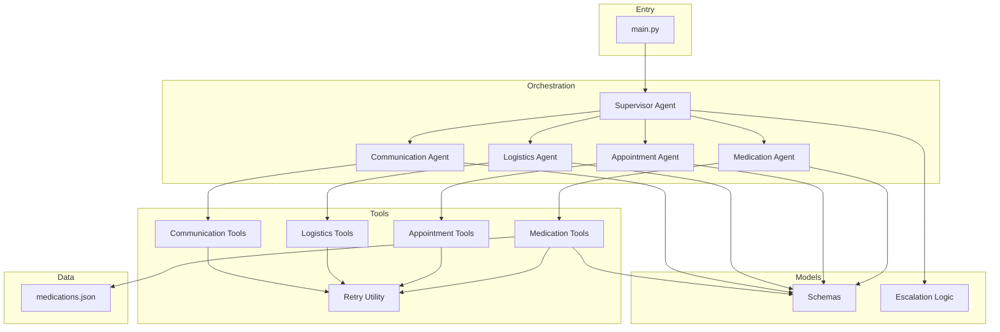
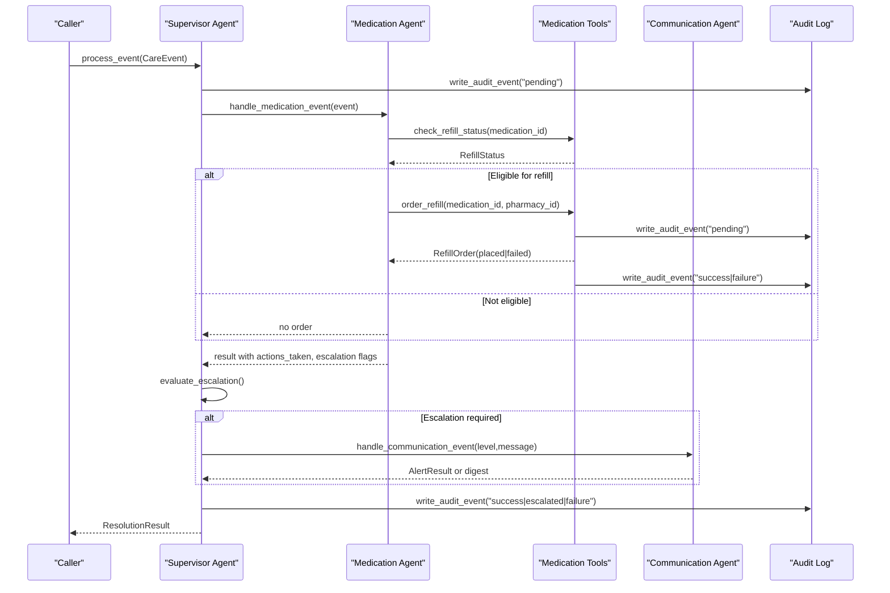
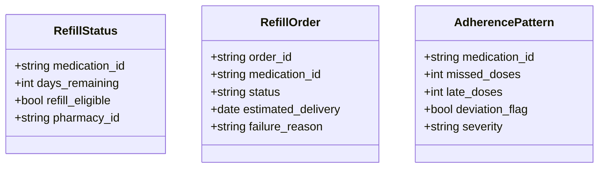
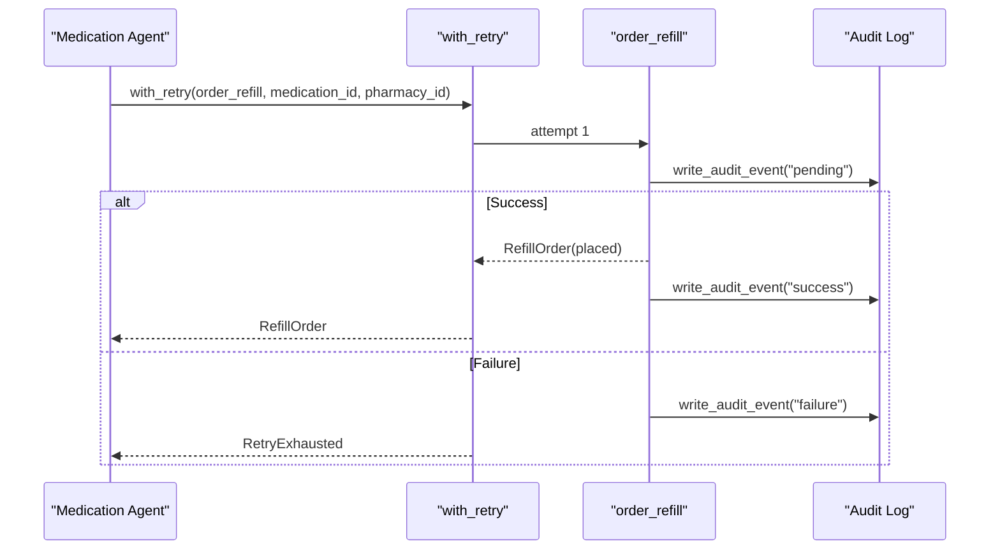
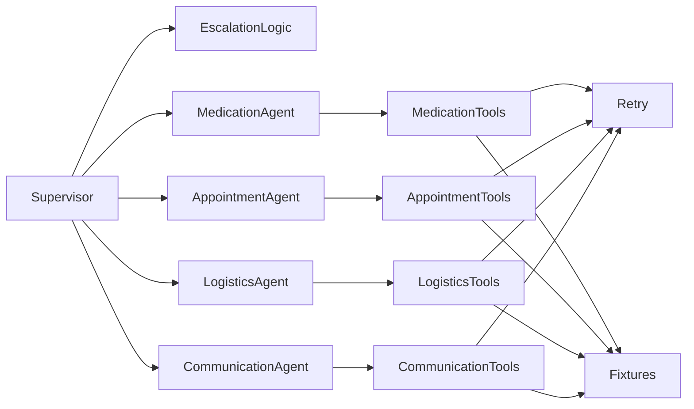

# Pharmacy MCP Server

<cite>
**Referenced Files in This Document**
- [main.py](file://main.py)
- [medication_tools.py](file://src/tools/medication_tools.py)
- [medication_agent.py](file://src/agents/medication_agent.py)
- [supervisor_agent.py](file://src/agents/supervisor_agent.py)
- [schemas.py](file://src/models/schemas.py)
- [retry.py](file://src/tools/retry.py)
- [escalation_logic.py](file://src/models/escalation_logic.py)
- [appointment_tools.py](file://src/tools/appointment_tools.py)
- [logistics_tools.py](file://src/tools/logistics_tools.py)
- [communication_tools.py](file://src/tools/communication_tools.py)
- [appointment_agent.py](file://src/agents/appointment_agent.py)
- [logistics_agent.py](file://src/agents/logistics_agent.py)
- [communication_agent.py](file://src/agents/communication_agent.py)
- [medications.json](file://fixtures/medications.json)
- [test_refill_flow.py](file://tests/integration/test_refill_flow.py)
</cite>

## Table of Contents
1. [Introduction](#introduction)
2. [Project Structure](#project-structure)
3. [Core Components](#core-components)
4. [Architecture Overview](#architecture-overview)
5. [Detailed Component Analysis](#detailed-component-analysis)
6. [Dependency Analysis](#dependency-analysis)
7. [Performance Considerations](#performance-considerations)
8. [Troubleshooting Guide](#troubleshooting-guide)
9. [Conclusion](#conclusion)
10. [Appendices](#appendices)

## Introduction
This document provides comprehensive documentation for the Pharmacy MCP Server implementation focused on medication management services within CareBridge. It covers all available tools and agents that support prescription lookup, refill status checking, inventory-aware ordering, pharmacy coordination, adherence monitoring, and communication escalation. The system uses deterministic routing and audit-first patterns to ensure safety and traceability. Mock behaviors are implemented via fixtures and simulated APIs to enable testing scenarios such as out-of-stock medications, prescription rejections, and pharmacy unavailability.

## Project Structure
CareBridge is organized into agents (orchestration), tools (external integrations), models (shared schemas), and fixtures (mock data). The main entry point initializes logging, loads fixtures, and runs demo scenarios that exercise the full pipeline: event ingestion, agent routing, tool execution, audit logging, and optional family notifications.

**Diagram sources**
- [main.py:1-182](file://main.py#L1-L182)
- [supervisor_agent.py:1-641](file://src/agents/supervisor_agent.py#L1-L641)
- [medication_agent.py:1-189](file://src/agents/medication_agent.py#L1-L189)
- [appointment_agent.py:1-173](file://src/agents/appointment_agent.py#L1-L173)
- [logistics_agent.py:1-236](file://src/agents/logistics_agent.py#L1-L236)
- [communication_agent.py:1-163](file://src/agents/communication_agent.py#L1-L163)
- [medication_tools.py:1-208](file://src/tools/medication_tools.py#L1-L208)
- [appointment_tools.py:1-242](file://src/tools/appointment_tools.py#L1-L242)
- [logistics_tools.py:1-220](file://src/tools/logistics_tools.py#L1-L220)
- [communication_tools.py:1-279](file://src/tools/communication_tools.py#L1-L279)
- [retry.py:1-70](file://src/tools/retry.py#L1-L70)
- [schemas.py:1-150](file://src/models/schemas.py#L1-L150)
- [escalation_logic.py:1-71](file://src/models/escalation_logic.py#L1-L71)
- [medications.json:1-33](file://fixtures/medications.json#L1-L33)

**Section sources**
- [main.py:1-182](file://main.py#L1-L182)

## Core Components
- Medication tools provide refill eligibility checks, refill ordering with audit-first behavior, and adherence pattern detection using fixture-backed mock data.
- Medication agent orchestrates refill checks, orders refills when eligible, detects adherence deviations, and escalates based on severity or retry exhaustion.
- Supervisor routes events deterministically, enforces audit-first patterns, evaluates escalation rules, and coordinates family notifications through the Communication Agent.
- Retry utility standardizes exponential backoff across external calls and raises a consistent exception type when retries are exhausted.
- Escalation logic classifies actions into autonomous, alert, or approval categories deterministically.

Key responsibilities:
- Prescription lookup and refill eligibility: check_refill_status reads medication fixtures and computes eligibility based on days_remaining vs. refill_threshold.
- Refill ordering: order_refill writes pending audit, simulates pharmacy API, then records success or failure; wrapped by retry logic in the agent layer.
- Adherence detection: detect_adherence_pattern returns deviation flags and severity for analysis and potential alerts.
- Coordination: Supervisor ensures proper routing, escalation, and audit trail linkage across agents.

**Section sources**
- [medication_tools.py:24-208](file://src/tools/medication_tools.py#L24-L208)
- [medication_agent.py:23-189](file://src/agents/medication_agent.py#L23-L189)
- [supervisor_agent.py:285-395](file://src/agents/supervisor_agent.py#L285-L395)
- [retry.py:14-70](file://src/tools/retry.py#L14-L70)
- [escalation_logic.py:13-71](file://src/models/escalation_logic.py#L13-L71)

## Architecture Overview
The system follows an event-driven architecture where the Supervisor receives CareEvent objects, routes them to specialized agents, executes tools with audit-first semantics, and applies deterministic escalation rules. Family notifications are dispatched when required.

**Diagram sources**
- [supervisor_agent.py:285-395](file://src/agents/supervisor_agent.py#L285-L395)
- [medication_agent.py:23-189](file://src/agents/medication_agent.py#L23-L189)
- [medication_tools.py:65-152](file://src/tools/medication_tools.py#L65-L152)
- [communication_agent.py:28-115](file://src/agents/communication_agent.py#L28-L115)

## Detailed Component Analysis

### Medication Tools
- check_refill_status(medication_id: str) -> RefillStatus
  - Reads medication fixtures and computes refill_eligible based on days_remaining <= refill_threshold.
  - Returns days_remaining, pharmacy_id, and eligibility flag.
  - Raises ValueError if medication_id not found.
- order_refill(medication_id: str, pharmacy_id: str) -> RefillOrder
  - Writes a pending audit event before attempting the pharmacy API call.
  - Simulates placement and returns RefillOrder with status "placed" or "failed".
  - On failure, writes a follow-up audit event with outcome "failure" and includes failure_reason.
  - Resolves care_recipient_id from fixtures when possible for accurate audit context.
- detect_adherence_pattern(medication_id: str, window_days: int = 7) -> AdherencePattern
  - Returns adherence metrics including missed_doses, late_doses, deviation_flag, and severity.
  - For med-001, simulates moderate deviation; others return good adherence.
  - Raises ValueError if medication_id not found.

Mock behaviors and failure simulation:
- order_refill can simulate failures by raising exceptions; the function catches them and returns a failed RefillOrder with failure_reason, enabling tests for pharmacy unavailability or rejection scenarios.
- adherence detection can be tuned by modifying fixture-based conditions to simulate adherence issues.

Response schemas:
- RefillStatus: medication_id, days_remaining, refill_eligible, pharmacy_id.
- RefillOrder: order_id, medication_id, status ("placed" | "failed"), estimated_delivery (optional), failure_reason (optional).
- AdherencePattern: medication_id, missed_doses, late_doses, deviation_flag, severity ("none" | "mild" | "moderate" | "severe").

Common workflows:
- Automatic refill ordering: When days_remaining <= threshold and refill_eligible, the Medication Agent triggers order_refill with retry logic.
- Insurance verification processes: While not explicitly modeled here, the same audit-first pattern and structured responses can be extended to include insurance checks by adding new tool functions and updating escalation logic accordingly.

Error handling and retry logic:
- order_refill wraps external calls and logs outcomes; the Medication Agent uses with_retry to attempt up to 3 times with exponential backoff.
- RetryExhausted is raised when all attempts fail, prompting escalation in the agent.

**Section sources**
- [medication_tools.py:24-208](file://src/tools/medication_tools.py#L24-L208)
- [schemas.py:73-94](file://src/models/schemas.py#L73-L94)
- [retry.py:22-70](file://src/tools/retry.py#L22-L70)

#### Class Diagram: Medication Models

**Diagram sources**
- [schemas.py:73-94](file://src/models/schemas.py#L73-L94)

### Medication Agent
- handle_medication_event(event: CareEvent) -> dict
  - Validates payload contains medication_id.
  - Checks refill status and orders refill if eligible.
  - Detects adherence patterns and sets escalation flags for moderate/severe deviations.
  - Returns structured result with actions_taken, escalation_required, escalation_level, and model dumps for status/order/adherence.
- process_refill(medication_id: str, pharmacy_id: str) -> RefillOrder
  - Wraps order_refill with with_retry (3 attempts, exponential backoff).
  - Raises RetryExhausted on complete failure, which the caller treats as escalation.
- check_and_flag_adherence(medication_id: str) -> AdherencePattern
  - Wrapper around detect_adherence_pattern with logging for alerts.

Escalation procedures:
- If refill order fails after retries, sets escalation_required=True and escalation_level="alert".
- If adherence deviation is moderate or severe, sets escalation_required=True and escalation_level="alert".

**Section sources**
- [medication_agent.py:23-189](file://src/agents/medication_agent.py#L23-L189)
- [retry.py:22-70](file://src/tools/retry.py#L22-L70)

#### Sequence Diagram: Refill Ordering with Retry

**Diagram sources**
- [medication_agent.py:137-159](file://src/agents/medication_agent.py#L137-L159)
- [medication_tools.py:65-152](file://src/tools/medication_tools.py#L65-L152)
- [retry.py:22-70](file://src/tools/retry.py#L22-L70)

### Supervisor Agent
- process_event(event: CareEvent) -> ResolutionResult
  - Ensures audit DB initialized, writes pending supervisor event, routes to appropriate agent, evaluates escalation deterministically, dispatches Communication Agent when needed, and writes final outcome event.
- approve_pending_action(action_id: str, approved: bool) -> None
  - Records human decision, routes approved actions to owning agent, handles unknown routes by escalating for manual handling.
- query_status(care_recipient_id: str, question: str) -> str
  - Synthesizes status via Communication Agent and logs the query.

Escalation evaluation:
- Combines hard-coded emergency triggers, classify_action results for executed actions, and agent-reported escalation flags to determine final level.

**Section sources**
- [supervisor_agent.py:285-395](file://src/agents/supervisor_agent.py#L285-L395)
- [supervisor_agent.py:432-593](file://src/agents/supervisor_agent.py#L432-L593)
- [supervisor_agent.py:398-430](file://src/agents/supervisor_agent.py#L398-L430)
- [escalation_logic.py:42-71](file://src/models/escalation_logic.py#L42-L71)

### Logistics Tools and Agent
- logistics_tools.check_delivery_status(delivery_id: str) -> DeliveryStatus
  - Reads delivery history fixtures and returns current status and expected arrival.
- logistics_tools.order_grocery(...) and order_pharmacy_delivery(...)
  - Place orders with audit-first pattern; simulate external delivery APIs and record success/failure.
- logistics_agent.process_delivery_failure(delivery_id: str, care_recipient_id: str) -> dict
  - Essential deliveries (pharmacy, medication, food, grocery) escalate immediately on failure.
  - Non-essential deliveries retry once; if still failed, log warning without escalation.

**Section sources**
- [logistics_tools.py:23-220](file://src/tools/logistics_tools.py#L23-L220)
- [logistics_agent.py:23-236](file://src/agents/logistics_agent.py#L23-L236)

### Appointment Tools and Agent
- appointment_tools.get_calendar(care_recipient_id: str, horizon_days: int = 30) -> list[Appointment]
  - Filters upcoming appointments within horizon for the recipient.
- appointment_tools.schedule_appointment(...) -> Appointment
  - Schedules with audit-first pattern and retry wrapper.
- appointment_tools.send_prep_checklist(appointment_id: str) -> ChecklistResult
  - Sends prep checklist and returns delivery status.
- appointment_agent.handle_appointment_event(event: CareEvent) -> dict
  - Retrieves calendar, sends checklists for near-term appointments, flags transportation needs for logistics coordination.

**Section sources**
- [appointment_tools.py:39-242](file://src/tools/appointment_tools.py#L39-L242)
- [appointment_agent.py:25-173](file://src/agents/appointment_agent.py#L25-L173)

### Communication Tools and Agent
- communication_tools.send_alert(recipient_id: str, message: str, level: Literal["info","alert","emergency"]) -> AlertResult
  - Simulates messaging channels based on level; logs messages and writes audit events.
- communication_tools.synthesize_status(care_recipient_id: str) -> StatusSummary
  - Builds summary from recent audit events and pending actions.
- communication_agent.handle_communication_event(event: CareEvent) -> dict
  - Routes alerts by level; emergency/alert trigger send_family_alert with retry; info queued for daily digest.

**Section sources**
- [communication_tools.py:54-279](file://src/tools/communication_tools.py#L54-L279)
- [communication_agent.py:28-163](file://src/agents/communication_agent.py#L28-L163)

## Dependency Analysis
- Agents depend on tools for external operations and on schemas for structured data exchange.
- Supervisor depends on escalation logic to classify actions deterministically and on Communication Agent for notifications.
- Tools depend on fixtures for mock data and on audit logging for compliance.
- Retry utility is shared across tools and agents to standardize resilience.

**Diagram sources**
- [supervisor_agent.py:1-641](file://src/agents/supervisor_agent.py#L1-L641)
- [medication_agent.py:1-189](file://src/agents/medication_agent.py#L1-L189)
- [appointment_agent.py:1-173](file://src/agents/appointment_agent.py#L1-L173)
- [logistics_agent.py:1-236](file://src/agents/logistics_agent.py#L1-L236)
- [communication_agent.py:1-163](file://src/agents/communication_agent.py#L1-L163)
- [medication_tools.py:1-208](file://src/tools/medication_tools.py#L1-L208)
- [appointment_tools.py:1-242](file://src/tools/appointment_tools.py#L1-L242)
- [logistics_tools.py:1-220](file://src/tools/logistics_tools.py#L1-L220)
- [communication_tools.py:1-279](file://src/tools/communication_tools.py#L1-L279)
- [retry.py:1-70](file://src/tools/retry.py#L1-L70)
- [escalation_logic.py:1-71](file://src/models/escalation_logic.py#L1-L71)

**Section sources**
- [supervisor_agent.py:1-641](file://src/agents/supervisor_agent.py#L1-L641)
- [medication_tools.py:1-208](file://src/tools/medication_tools.py#L1-L208)
- [retry.py:1-70](file://src/tools/retry.py#L1-L70)
- [escalation_logic.py:1-71](file://src/models/escalation_logic.py#L1-L71)

## Performance Considerations
- Retry strategy uses exponential backoff (1s, 2s, 4s) to reduce load on external systems during transient failures.
- Fixture-based mocks avoid network latency and allow deterministic performance testing.
- Audit-first pattern adds minimal overhead but ensures compliance and traceability.
- Batch processing of communication digests reduces repeated messaging overhead.

[No sources needed since this section provides general guidance]

## Troubleshooting Guide
Common issues and resolutions:
- Missing medication_id in event payload: Medication Agent returns error action and does not proceed; validate input before invoking.
- Medication not found: check_refill_status and detect_adherence_pattern raise ValueError; ensure medication exists in fixtures.
- Pharmacy API failure: order_refill returns failed RefillOrder with failure_reason; use RetryExhausted to escalate and notify family.
- Delivery not found: Logistics Agent returns escalated alert; verify delivery_id and fixture records.
- Family alert dispatch failure: Communication Agent logs error and includes failure in actions_taken; Supervisor marks escalation and continues.

Audit trail verification:
- Every process_event produces at least two audit events (pending + outcome); correlation_id links related entries.
- Use get_audit_events to inspect recent activity and pending actions for debugging.

**Section sources**
- [medication_agent.py:43-71](file://src/agents/medication_agent.py#L43-L71)
- [medication_tools.py:49-62](file://src/tools/medication_tools.py#L49-L62)
- [medication_tools.py:134-152](file://src/tools/medication_tools.py#L134-L152)
- [logistics_agent.py:41-60](file://src/agents/logistics_agent.py#L41-L60)
- [communication_agent.py:67-75](file://src/agents/communication_agent.py#L67-L75)
- [test_refill_flow.py:14-82](file://tests/integration/test_refill_flow.py#L14-L82)

## Conclusion
The Pharmacy MCP Server implementation provides robust medication management services with deterministic routing, audit-first compliance, and resilient retry mechanisms. Tools and agents collaborate to support prescription lookup, refill eligibility, ordering, adherence monitoring, and coordinated communications. Mock behaviors enable comprehensive testing for scenarios like out-of-stock medications, prescription rejections, and pharmacy unavailability. The system’s design ensures safety-critical decisions remain deterministic and auditable.

[No sources needed since this section summarizes without analyzing specific files]

## Appendices

### Tool Reference Summary
- check_refill_status(medication_id: str) -> RefillStatus
  - Parameters: medication_id (required)
  - Validation: medication_id must exist in fixtures
  - Response: RefillStatus with eligibility and pharmacy association
- order_refill(medication_id: str, pharmacy_id: str) -> RefillOrder
  - Parameters: medication_id (required), pharmacy_id (required)
  - Behavior: Writes pending audit, simulates pharmacy API, returns placed/failed
  - Failure simulation: Exceptions caught and recorded as failure with reason
- detect_adherence_pattern(medication_id: str, window_days: int = 7) -> AdherencePattern
  - Parameters: medication_id (required), window_days (default 7)
  - Behavior: Returns adherence metrics and severity for analysis
- schedule_appointment(provider_id: str, care_recipient_id: str, preferred_datetime: datetime) -> Appointment
  - Parameters: provider_id, care_recipient_id, preferred_datetime
  - Behavior: Audit-first scheduling with retry wrapper
- send_prep_checklist(appointment_id: str) -> ChecklistResult
  - Parameters: appointment_id (required)
  - Behavior: Sends checklist and returns delivery status
- check_delivery_status(delivery_id: str) -> DeliveryStatus
  - Parameters: delivery_id (required)
  - Behavior: Reads delivery history and returns current status
- order_grocery(care_recipient_id: str, items: list[str], delivery_address: str) -> DeliveryOrder
  - Parameters: care_recipient_id, items, delivery_address
  - Behavior: Places grocery order with audit-first pattern
- order_pharmacy_delivery(medication_id: str, pharmacy_id: str, delivery_address: str) -> DeliveryOrder
  - Parameters: medication_id, pharmacy_id, delivery_address
  - Behavior: Places pharmacy delivery with audit-first pattern
- send_alert(recipient_id: str, message: str, level: Literal["info","alert","emergency"]) -> AlertResult
  - Parameters: recipient_id, message, level
  - Behavior: Simulates messaging channels based on level; writes audit events
- synthesize_status(care_recipient_id: str) -> StatusSummary
  - Parameters: care_recipient_id (required)
  - Behavior: Builds summary from audit events and pending actions

**Section sources**
- [medication_tools.py:34-208](file://src/tools/medication_tools.py#L34-L208)
- [appointment_tools.py:39-242](file://src/tools/appointment_tools.py#L39-L242)
- [logistics_tools.py:23-220](file://src/tools/logistics_tools.py#L23-L220)
- [communication_tools.py:54-279](file://src/tools/communication_tools.py#L54-L279)

### Data Models Reference
- RefillStatus: medication_id, days_remaining, refill_eligible, pharmacy_id
- RefillOrder: order_id, medication_id, status ("placed" | "failed"), estimated_delivery (optional), failure_reason (optional)
- AdherencePattern: medication_id, missed_doses, late_doses, deviation_flag, severity ("none" | "mild" | "moderate" | "severe")
- DeliveryStatus: delivery_id, status ("pending" | "in_transit" | "delivered" | "failed"), expected_at (optional), failure_reason (optional)
- DeliveryOrder: order_id, delivery_id, status ("placed" | "failed"), expected_at (optional), failure_reason (optional)
- AlertResult: alert_id, delivery_status, channel_used, sent_at
- StatusSummary: care_recipient_id, summary_text, recent_events, pending_actions

**Section sources**
- [schemas.py:73-150](file://src/models/schemas.py#L73-L150)

### Testing Scenarios
- Automatic refill ordering: Submit refill_low event for med-001; expect order placed and audit trail entries.
- No refill needed: Submit refill_low event for med-002; expect no order and no escalation for order itself.
- Audit completeness: Verify at least two supervisor audit events per process_event with shared correlation_id.

**Section sources**
- [test_refill_flow.py:14-82](file://tests/integration/test_refill_flow.py#L14-L82)