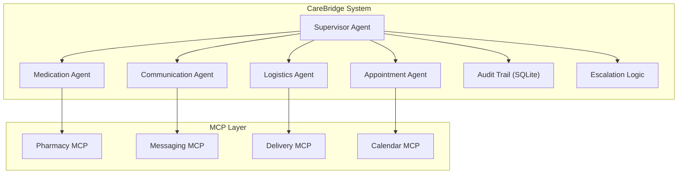
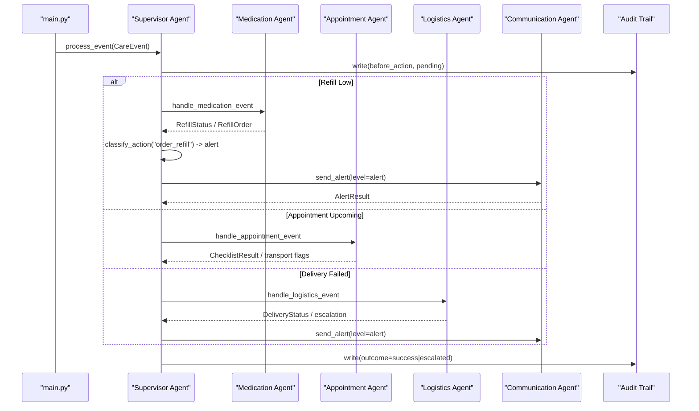
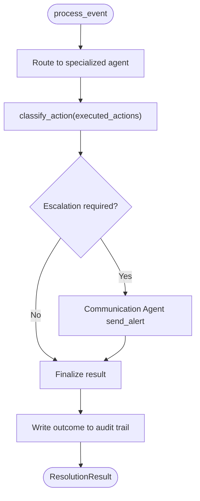
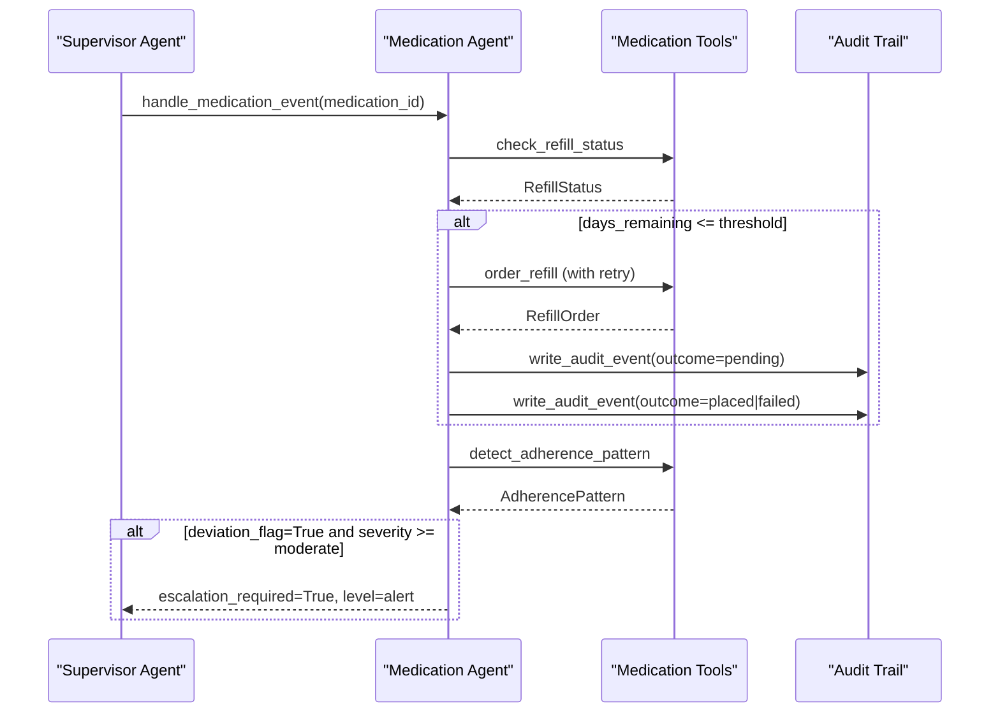
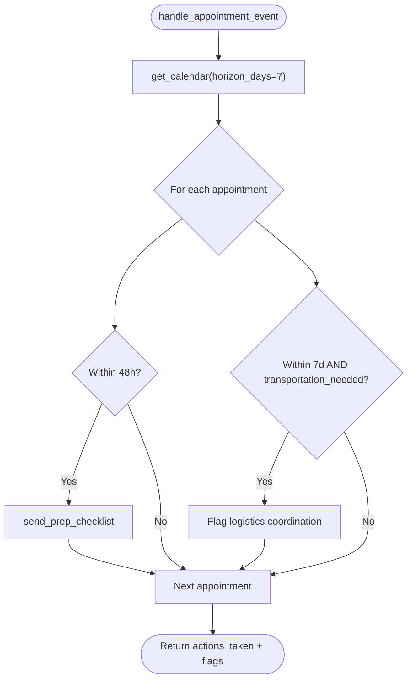
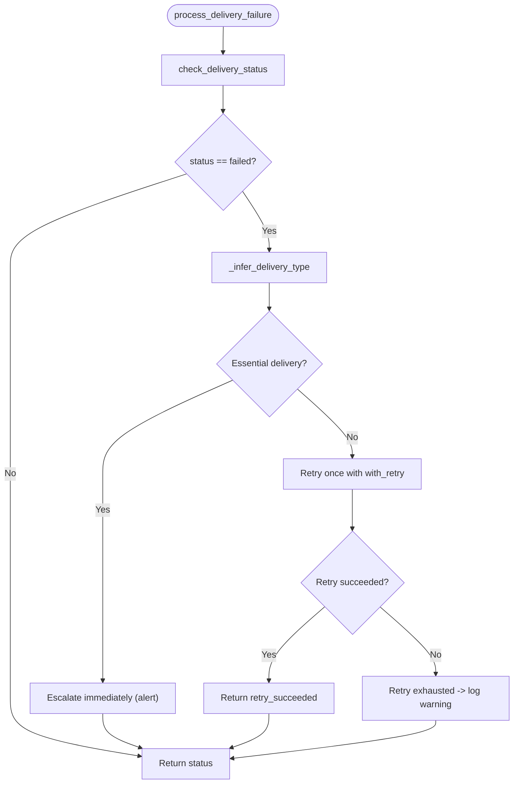
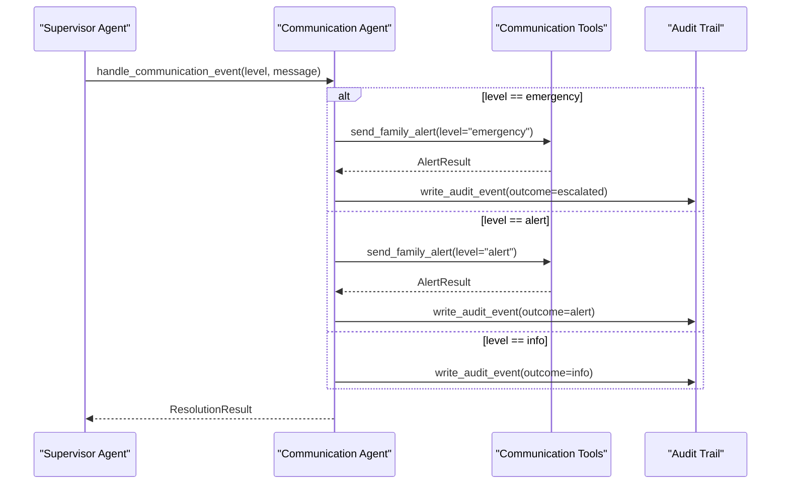
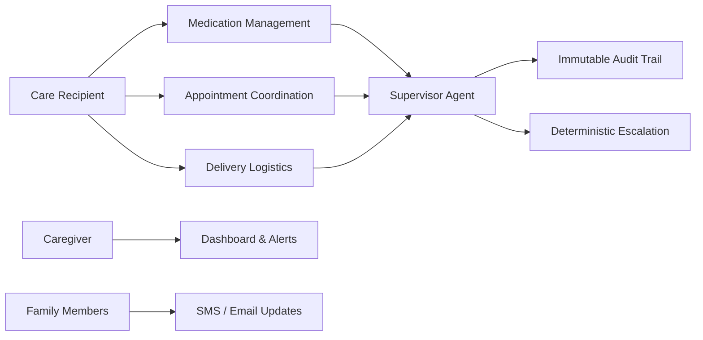
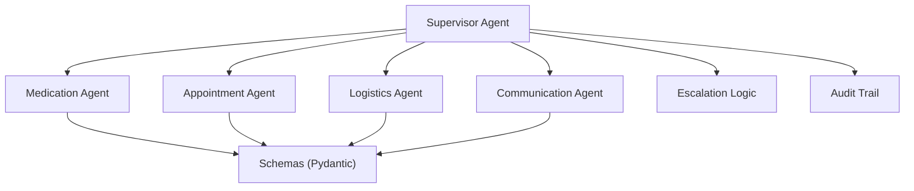

# Project Overview

<cite>
**Referenced Files in This Document**
- [SPEC.md](file://SPEC.md)
- [AGENTS.md](file://AGENTS.md)
- [architecture.md](file://architecture.md)
- [main.py](file://main.py)
- [src/agents/supervisor_agent.py](file://src/agents/supervisor_agent.py)
- [src/agents/medication_agent.py](file://src/agents/medication_agent.py)
- [src/agents/appointment_agent.py](file://src/agents/appointment_agent.py)
- [src/agents/logistics_agent.py](file://src/agents/logistics_agent.py)
- [src/agents/communication_agent.py](file://src/agents/communication_agent.py)
- [src/models/schemas.py](file://src/models/schemas.py)
- [src/models/escalation_logic.py](file://src/models/escalation_logic.py)
- [src/models/audit_log.py](file://src/models/audit_log.py)
</cite>

## Table of Contents
1. [Introduction](#introduction)
2. [Project Structure](#project-structure)
3. [Core Components](#core-components)
4. [Architecture Overview](#architecture-overview)
5. [Detailed Component Analysis](#detailed-component-analysis)
6. [Dependency Analysis](#dependency-analysis)
7. [Performance Considerations](#performance-considerations)
8. [Troubleshooting Guide](#troubleshooting-guide)
9. [Conclusion](#conclusion)

## Introduction
CareBridge is an autonomous care coordination system that owns the end-to-end workflow for elderly care management. It automates medication management, appointment scheduling, delivery logistics, and family communication through a multi-agent AI architecture. The system reduces caregiver burden by proactively monitoring adherence, coordinating refills and deliveries, preparing families for upcoming appointments, and surfacing exceptions with deterministic escalation logic.

The problem CareBridge addresses:
- Caregiver burden is high; adult children coordinate care while older adults age in place.
- Medication adherence among older adults with chronic conditions is low, leading to health risks and costs.
- Existing tools are fragmented across silos (medication apps, calendars, grocery apps, messaging). No single system owns the full coordination workflow.

Target users:
- Caregiver (primary user): Adult child who coordinates care via a web dashboard and receives proactive alerts.
- Care recipient (passive beneficiary): Older adult living independently; no app required, optional voice check-in.
- Family members (secondary): Siblings and relatives who receive SMS/email updates based on preferences.

Value proposition:
- End-to-end ownership of the coordination workflow: from detecting a low refill to ordering it, notifying family, and logging every action in an immutable audit trail.
- Deterministic safety: escalation logic is code-based, not LLM-driven, ensuring consistent, auditable decisions.
- Practical outcomes: fewer missed doses, timely appointments, reliable deliveries, and clear visibility for caregivers.

Practical examples:
- Medication refill monitoring: When days remaining fall below threshold, the system orders a refill, notifies the caregiver, and logs the action before execution.
- Appointment coordination: For appointments within 48 hours, the system sends preparation checklists; if transportation is needed within seven days, it flags logistics coordination.
- Delivery failure handling: Essential deliveries (pharmacy, food) trigger immediate alerts; non-essential items retry once and log warnings.

**Section sources**
- [SPEC.md:10-23](file://SPEC.md#L10-L23)
- [SPEC.md:26-33](file://SPEC.md#L26-L33)
- [SPEC.md:320-361](file://SPEC.md#L320-L361)
- [architecture.md:10-75](file://architecture.md#L10-L75)

## Project Structure
CareBridge organizes responsibilities into specialized agents under src/agents, shared data models under src/models, tool integrations under src/tools, and MCP servers under src/mcp. The entry point main.py initializes the audit database, loads fixtures, creates the Supervisor Agent (if available), and runs a demo scenario that exercises refill, appointment, and delivery flows.

Key structural highlights:
- Agents-as-tools pattern: The Supervisor routes events to specialized agents rather than calling external APIs directly.
- Immutable audit trail: Every action writes a “before action” event before execution; SQLite triggers prevent updates or deletions.
- Deterministic escalation: classify_action() categorizes actions as auto, alert, or approve; emergency triggers are hard-coded.
- MCP integration: In-process SDK for pharmacy, messaging, and delivery; external SSE for calendar.

**Diagram sources**
- [architecture.md:10-75](file://architecture.md#L10-L75)
- [src/agents/supervisor_agent.py:43-61](file://src/agents/supervisor_agent.py#L43-L61)
- [src/models/escalation_logic.py:13-39](file://src/models/escalation_logic.py#L13-L39)
- [src/models/audit_log.py:19-78](file://src/models/audit_log.py#L19-L78)

**Section sources**
- [main.py:143-177](file://main.py#L143-L177)
- [architecture.md:430-499](file://architecture.md#L430-L499)

## Core Components
CareBridge’s core components implement a clear separation of concerns:
- Supervisor Agent: Orchestrates events, applies escalation logic, maintains context, and ensures audit-before-action.
- Specialized Agents:
  - Medication Agent: Monitors refill status, orders refills when eligible, detects adherence deviations.
  - Appointment Agent: Retrieves calendars, sends prep checklists, flags transportation needs.
  - Logistics Agent: Manages delivery statuses, escalates essential failures, retries non-essential ones.
  - Communication Agent: Sends alerts at appropriate levels, synthesizes status summaries, respects family preferences.
- Data Models: Pydantic v2 schemas define structured contracts between agents and tools.
- Escalation Logic: Deterministic classification of actions to ensure safety and compliance.
- Audit Trail: Immutable SQLite storage capturing rationale, outcome, and correlation IDs.

Operational principles:
- Agents never call external APIs directly; they use tools and MCP servers.
- All actions are classified deterministically before execution.
- Every action writes to the audit trail before executing; failures are logged and escalated.

**Section sources**
- [src/agents/supervisor_agent.py:285-395](file://src/agents/supervisor_agent.py#L285-L395)
- [src/agents/medication_agent.py:23-134](file://src/agents/medication_agent.py#L23-L134)
- [src/agents/appointment_agent.py:74-172](file://src/agents/appointment_agent.py#L74-L172)
- [src/agents/logistics_agent.py:23-152](file://src/agents/logistics_agent.py#L23-L152)
- [src/agents/communication_agent.py:28-115](file://src/agents/communication_agent.py#L28-L115)
- [src/models/schemas.py:13-149](file://src/models/schemas.py#L13-L149)
- [src/models/escalation_logic.py:42-71](file://src/models/escalation_logic.py#L42-L71)
- [src/models/audit_log.py:81-131](file://src/models/audit_log.py#L81-L131)

## Architecture Overview
CareBridge uses the Strands Agents SDK’s agents-as-tools pattern. The Supervisor Agent holds instances of specialized agents in its tools list. When an event arrives, the Supervisor routes it to the correct agent, applies deterministic escalation logic, and writes audit events before and after execution.

High-level flow:
- Events enter via main.py demo scenarios (refill_low, appointment_upcoming, delivery_failed).
- Supervisor processes each event, routes to the appropriate agent, and evaluates escalation.
- If escalation is required, the Communication Agent sends alerts at the appropriate level.
- All actions are recorded in the immutable audit trail.

**Diagram sources**
- [main.py:92-140](file://main.py#L92-L140)
- [src/agents/supervisor_agent.py:285-395](file://src/agents/supervisor_agent.py#L285-L395)
- [src/agents/medication_agent.py:23-134](file://src/agents/medication_agent.py#L23-L134)
- [src/agents/appointment_agent.py:74-172](file://src/agents/appointment_agent.py#L74-L172)
- [src/agents/logistics_agent.py:182-200](file://src/agents/logistics_agent.py#L182-L200)
- [src/agents/communication_agent.py:28-115](file://src/agents/communication_agent.py#L28-L115)
- [src/models/audit_log.py:81-131](file://src/models/audit_log.py#L81-L131)

**Section sources**
- [architecture.md:79-117](file://architecture.md#L79-L117)
- [architecture.md:120-165](file://architecture.md#L120-L165)

## Detailed Component Analysis

### Supervisor Agent Analysis
The Supervisor Agent is the orchestrator. It routes events to specialized agents, applies deterministic escalation logic, and ensures audit-before-action. It supports both Strands agents-as-tools wiring and direct routing when the SDK is unavailable.

Key behaviors:
- Routes events by type: refill_low/adherence_deviation to Medication Agent; appointment_upcoming to Appointment Agent; delivery_failed to Logistics Agent.
- Evaluates escalation using classify_action() and hard-coded emergency triggers.
- Builds alert messages referencing IDs only (no PII).
- Writes follow-up audit events with final outcomes.

**Diagram sources**
- [src/agents/supervisor_agent.py:285-395](file://src/agents/supervisor_agent.py#L285-L395)
- [src/models/escalation_logic.py:42-71](file://src/models/escalation_logic.py#L42-L71)
- [src/models/audit_log.py:81-131](file://src/models/audit_log.py#L81-L131)

**Section sources**
- [src/agents/supervisor_agent.py:43-61](file://src/agents/supervisor_agent.py#L43-L61)
- [src/agents/supervisor_agent.py:178-234](file://src/agents/supervisor_agent.py#L178-L234)
- [src/agents/supervisor_agent.py:259-278](file://src/agents/supervisor_agent.py#L259-L278)

### Medication Agent Analysis
The Medication Agent monitors refill status, orders refills when eligible, and detects adherence deviations. It integrates with retry logic and escalation rules.

Key behaviors:
- Checks refill status; if days_remaining <= threshold and eligible, orders refill.
- Detects adherence patterns; flags moderate/severe deviations for family alerts.
- Uses with_retry helper for order_refill; raises RetryExhausted on repeated failures.

**Diagram sources**
- [src/agents/medication_agent.py:23-134](file://src/agents/medication_agent.py#L23-L134)
- [src/agents/medication_agent.py:137-159](file://src/agents/medication_agent.py#L137-L159)
- [src/agents/medication_agent.py:162-189](file://src/agents/medication_agent.py#L162-L189)
- [src/models/audit_log.py:81-131](file://src/models/audit_log.py#L81-L131)

**Section sources**
- [src/agents/medication_agent.py:23-134](file://src/agents/medication_agent.py#L23-L134)
- [src/agents/medication_agent.py:137-189](file://src/agents/medication_agent.py#L137-L189)

### Appointment Agent Analysis
The Appointment Agent manages provider calendars, coordinates transportation, and sends preparation checklists.

Key behaviors:
- Retrieves upcoming appointments within a horizon window.
- For appointments within 48 hours, sends prep checklists.
- Flags transportation needs within seven days for logistics coordination.

**Diagram sources**
- [src/agents/appointment_agent.py:25-71](file://src/agents/appointment_agent.py#L25-L71)
- [src/agents/appointment_agent.py:74-172](file://src/agents/appointment_agent.py#L74-L172)

**Section sources**
- [src/agents/appointment_agent.py:74-172](file://src/agents/appointment_agent.py#L74-L172)

### Logistics Agent Analysis
The Logistics Agent handles delivery failures with escalation rules. Essential deliveries (pharmacy, medication, food, grocery) escalate immediately; non-essential deliveries retry once and log warnings.

Key behaviors:
- Checks delivery status; infers delivery type from fixtures.
- Escalates essential failures; retries non-essential failures.
- Writes audit events for all outcomes.

**Diagram sources**
- [src/agents/logistics_agent.py:23-152](file://src/agents/logistics_agent.py#L23-L152)
- [src/agents/logistics_agent.py:155-179](file://src/agents/logistics_agent.py#L155-L179)

**Section sources**
- [src/agents/logistics_agent.py:23-152](file://src/agents/logistics_agent.py#L23-L152)
- [src/agents/logistics_agent.py:155-179](file://src/agents/logistics_agent.py#L155-L179)

### Communication Agent Analysis
The Communication Agent generates proactive family updates, handles two-way queries, and respects per-member notification preferences.

Key behaviors:
- Emergency level: SMS + email + phone call to all family members.
- Alert level: SMS to primary caregiver, email to others.
- Info level: batch into daily digest unless urgent.
- Synthesizes status summaries from audit trail and current state.

**Diagram sources**
- [src/agents/communication_agent.py:28-115](file://src/agents/communication_agent.py#L28-L115)
- [src/agents/communication_agent.py:118-146](file://src/agents/communication_agent.py#L118-L146)
- [src/models/audit_log.py:81-131](file://src/models/audit_log.py#L81-L131)

**Section sources**
- [src/agents/communication_agent.py:28-115](file://src/agents/communication_agent.py#L28-L115)
- [src/agents/communication_agent.py:118-163](file://src/agents/communication_agent.py#L118-L163)

### Conceptual Overview
Care coordination challenges include fragmented tools, caregiver fatigue, and medication non-adherence. CareBridge consolidates these workflows into a single system that owns the end-to-end process. By automating routine tasks and escalating exceptions, it reduces manual effort and improves outcomes for care recipients.

[No sources needed since this diagram shows conceptual workflow, not actual code structure]

## Dependency Analysis
CareBridge enforces strict agent boundaries and inter-agent communication rules. Specialized agents do not call each other directly; all coordination passes through the Supervisor. Data models are shared via Pydantic schemas, ensuring type safety and consistency.

**Diagram sources**
- [AGENTS.md:8-21](file://AGENTS.md#L8-L21)
- [AGENTS.md:25-33](file://AGENTS.md#L25-L33)
- [src/models/schemas.py:1-149](file://src/models/schemas.py#L1-L149)
- [src/models/escalation_logic.py:13-39](file://src/models/escalation_logic.py#L13-L39)
- [src/models/audit_log.py:19-78](file://src/models/audit_log.py#L19-L78)

**Section sources**
- [AGENTS.md:8-21](file://AGENTS.md#L8-L21)
- [AGENTS.md:25-33](file://AGENTS.md#L25-L33)
- [src/models/schemas.py:1-149](file://src/models/schemas.py#L1-L149)

## Performance Considerations
- Latency target: Single agent task under five seconds (mocked).
- Concurrency: Support ten concurrent care recipients.
- Retry policy: Three attempts with exponential backoff (1s, 2s, 4s).
- Audit retention: Immutable and indefinite.
- Error visibility: All failures logged and escalated; never silently fail.

These targets guide implementation choices such as async I/O-bound tools, shared retry helpers, and deterministic classification to minimize overhead and ensure reliability.

[No sources needed since this section provides general guidance]

## Troubleshooting Guide
Common issues and resolutions:
- Missing fixture files: main.py validates required fixtures; missing files raise FileNotFoundError. Ensure medications.json, appointments.json, delivery_history.json, and family_members.json exist.
- Audit database initialization: init_audit_db() creates schema and triggers; ensure audit.db is writable.
- Strands SDK availability: create_supervisor_agent() returns None if unavailable; fallback to deterministic direct routing.
- External API failures: RetryExhausted indicates three attempts failed; escalate with alert level and log outcome.
- Escalation misclassification: Verify classify_action() inputs and ensure unknown actions default to approve for safety.

Debugging steps:
- Review audit trail entries for actor, action_type, rationale, and outcome.
- Check logs/carebridge.log for error messages and stack traces.
- Validate Pydantic model fields for type mismatches.
- Confirm MCP server registration and connectivity.

**Section sources**
- [main.py:45-63](file://main.py#L45-L63)
- [main.py:143-177](file://main.py#L143-L177)
- [src/models/audit_log.py:19-78](file://src/models/audit_log.py#L19-L78)
- [src/agents/medication_agent.py:137-159](file://src/agents/medication_agent.py#L137-L159)
- [src/models/escalation_logic.py:42-71](file://src/models/escalation_logic.py#L42-L71)

## Conclusion
CareBridge delivers an autonomous, end-to-end care coordination system that reduces caregiver burden and improves medication adherence through proactive monitoring, automated workflows, and deterministic escalation. Its multi-agent architecture ensures clear boundaries, robust auditing, and scalable operations. By owning the entire coordination workflow, CareBridge provides practical value to caregivers, care recipients, and family members while maintaining safety and compliance through immutable audit trails and code-based escalation logic.

[No sources needed since this section summarizes without analyzing specific files]