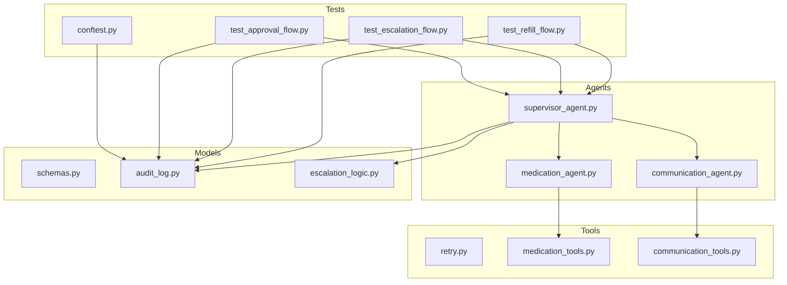
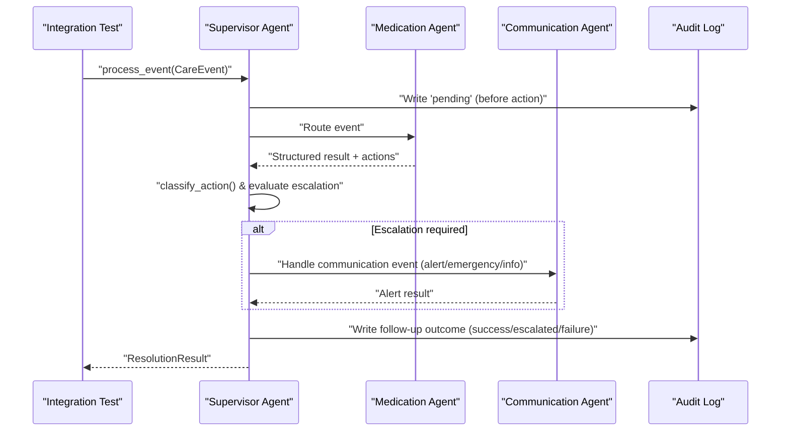
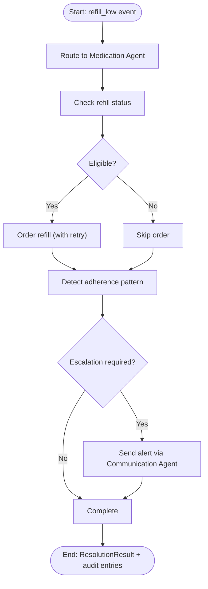
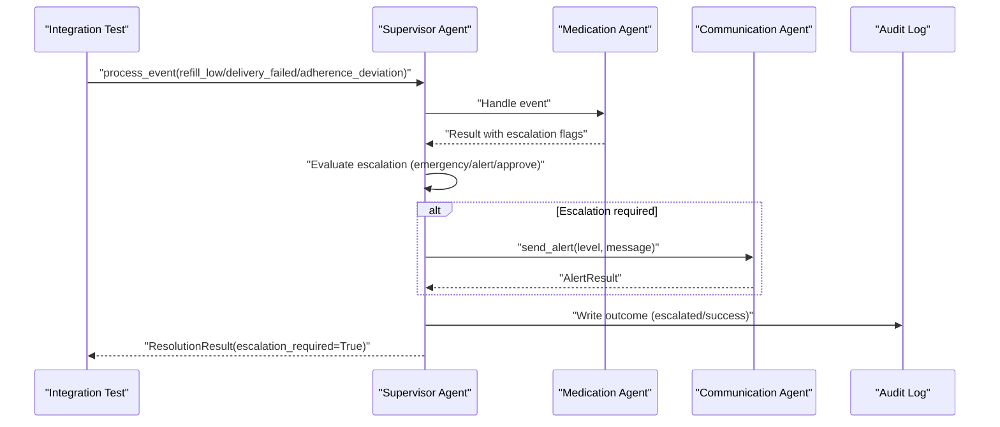
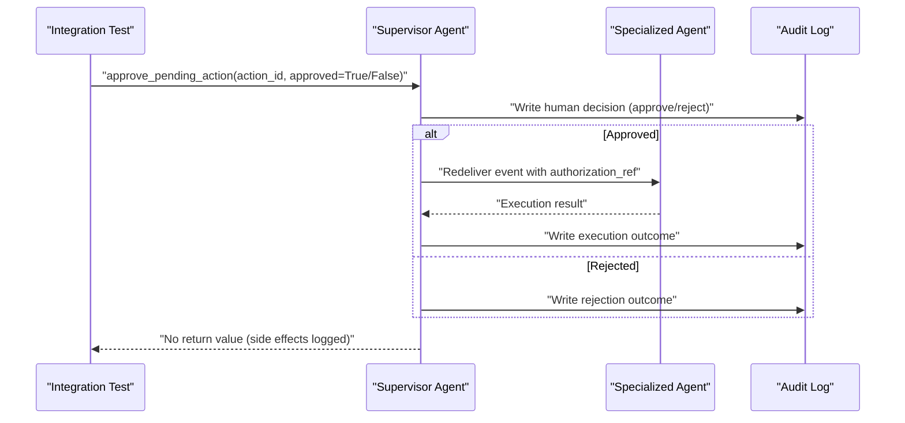
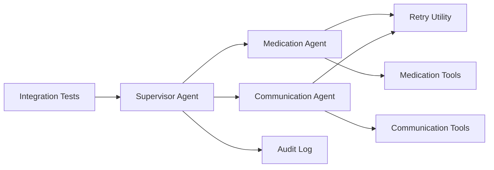

# Integration Testing

<cite>
**Referenced Files in This Document**
- [test_refill_flow.py](file://tests/integration/test_refill_flow.py)
- [test_escalation_flow.py](file://tests/integration/test_escalation_flow.py)
- [test_approval_flow.py](file://tests/integration/test_approval_flow.py)
- [conftest.py](file://conftest.py)
- [supervisor_agent.py](file://src/agents/supervisor_agent.py)
- [medication_agent.py](file://src/agents/medication_agent.py)
- [communication_agent.py](file://src/agents/communication_agent.py)
- [schemas.py](file://src/models/schemas.py)
- [audit_log.py](file://src/models/audit_log.py)
- [escalation_logic.py](file://src/models/escalation_logic.py)
- [retry.py](file://src/tools/retry.py)
- [medication_tools.py](file://src/tools/medication_tools.py)
- [communication_tools.py](file://src/tools/communication_tools.py)
- [AGENTS.md](file://AGENTS.md)
- [SPEC.md](file://SPEC.md)
</cite>

## Table of Contents
1. [Introduction](#introduction)
2. [Project Structure](#project-structure)
3. [Core Components](#core-components)
4. [Architecture Overview](#architecture-overview)
5. [Detailed Component Analysis](#detailed-component-analysis)
6. [Dependency Analysis](#dependency-analysis)
7. [Performance Considerations](#performance-considerations)
8. [Troubleshooting Guide](#troubleshooting-guide)
9. [Conclusion](#conclusion)
10. [Appendices](#appendices)

## Introduction
This document provides comprehensive integration testing guidance for CareBridge, focusing on end-to-end workflow validation across three primary scenarios:
- Refill flow testing for medication management workflows
- Escalation flow testing for safety-critical decision paths
- Approval flow testing for human-in-the-loop processes

It explains how tests simulate complete care recipient journeys from event creation through resolution, including multi-agent coordination and inter-component communication. It also covers environment setup with mock external services and MCP servers, strategies for concurrent operations and state management across agents, and examples for validating audit trail integrity and compliance requirements.

## Project Structure
CareBridge’s integration tests live under tests/integration and exercise the full pipeline via the Supervisor Agent. The tests construct CareEvent objects, invoke process_event or approve_pending_action, and assert outcomes against structured results and the immutable audit trail. Shared test fixtures and isolation are provided by conftest.py, which sets up a temporary SQLite audit database per test run and resets supervisor state to ensure deterministic behavior.

**Diagram sources**
- [test_refill_flow.py:1-82](file://tests/integration/test_refill_flow.py#L1-L82)
- [test_escalation_flow.py:1-97](file://tests/integration/test_escalation_flow.py#L1-L97)
- [test_approval_flow.py:1-130](file://tests/integration/test_approval_flow.py#L1-L130)
- [conftest.py:1-60](file://conftest.py#L1-L60)
- [supervisor_agent.py:1-641](file://src/agents/supervisor_agent.py#L1-L641)
- [medication_agent.py:1-189](file://src/agents/medication_agent.py#L1-L189)
- [communication_agent.py:1-163](file://src/agents/communication_agent.py#L1-L163)
- [schemas.py:1-150](file://src/models/schemas.py#L1-L150)
- [audit_log.py:1-167](file://src/models/audit_log.py#L1-L167)
- [escalation_logic.py:1-71](file://src/models/escalation_logic.py#L1-L71)
- [retry.py:1-70](file://src/tools/retry.py#L1-L70)
- [medication_tools.py:1-208](file://src/tools/medication_tools.py#L1-L208)
- [communication_tools.py:1-279](file://src/tools/communication_tools.py#L1-L279)

**Section sources**
- [test_refill_flow.py:1-82](file://tests/integration/test_refill_flow.py#L1-L82)
- [test_escalation_flow.py:1-97](file://tests/integration/test_escalation_flow.py#L1-L97)
- [test_approval_flow.py:1-130](file://tests/integration/test_approval_flow.py#L1-L130)
- [conftest.py:1-60](file://conftest.py#L1-L60)

## Core Components
- Supervisor Agent: Orchestrates routing, escalation decisions, and audit-first logging; exposes process_event and approve_pending_action used by integration tests.
- Medication Agent: Handles refill checks, orders refills with retry, and detects adherence deviations; integrates with tools that simulate pharmacy APIs.
- Communication Agent: Sends family alerts based on escalation level; uses retry logic and logs messages as mock delivery.
- Audit Trail: Immutable SQLite-backed log ensuring every action is recorded before execution; tests validate completeness and correlation.
- Retry Utility: Provides exponential backoff retries for external calls; tests use it to simulate failures and verify escalation.
- Fixtures and Mocks: JSON fixtures simulate medications and family members; communication tools log messages to files to simulate messaging channels.

**Section sources**
- [supervisor_agent.py:285-395](file://src/agents/supervisor_agent.py#L285-L395)
- [medication_agent.py:23-134](file://src/agents/medication_agent.py#L23-L134)
- [communication_agent.py:28-115](file://src/agents/communication_agent.py#L28-L115)
- [audit_log.py:19-78](file://src/models/audit_log.py#L19-L78)
- [retry.py:22-69](file://src/tools/retry.py#LL22-L69)
- [medication_tools.py:34-62](file://src/tools/medication_tools.py#L34-L62)
- [communication_tools.py:54-157](file://src/tools/communication_tools.py#L54-L157)

## Architecture Overview
The integration tests drive end-to-end flows through the Supervisor Agent, which routes events to specialized agents, applies deterministic escalation rules, and ensures an immutable audit trail. When escalation is required, the Communication Agent is invoked to notify family members. Approvals are handled via a human-in-the-loop path where pending actions are created, reviewed, and either executed or rejected.

**Diagram sources**
- [supervisor_agent.py:285-395](file://src/agents/supervisor_agent.py#L285-L395)
- [medication_agent.py:23-134](file://src/agents/medication_agent.py#L23-L134)
- [communication_agent.py:28-115](file://src/agents/communication_agent.py#L28-L115)
- [audit_log.py:81-130](file://src/models/audit_log.py#L81-L130)

## Detailed Component Analysis

### Refill Flow Testing
Purpose: Validate end-to-end medication refill processing when low days remain, including audit trail completeness and escalation triggers for ALERT-category actions.

Key behaviors verified:
- Event routed to Medication Agent and resolved
- Refill order placed when eligible (days_remaining <= threshold)
- Audit trail contains at least two entries (pending + follow-up)
- Escalation occurs due to ALERT classification for order_refill
- No refill order when not eligible

**Diagram sources**
- [test_refill_flow.py:14-48](file://tests/integration/test_refill_flow.py#L14-L48)
- [medication_agent.py:57-124](file://src/agents/medication_agent.py#L57-L124)
- [supervisor_agent.py:178-234](file://src/agents/supervisor_agent.py#L178-L234)
- [audit_log.py:81-130](file://src/models/audit_log.py#L81-L130)

**Section sources**
- [test_refill_flow.py:14-82](file://tests/integration/test_refill_flow.py#L14-L82)
- [medication_agent.py:23-134](file://src/agents/medication_agent.py#L23-L134)
- [supervisor_agent.py:178-234](file://src/agents/supervisor_agent.py#L178-L234)
- [audit_log.py:81-130](file://src/models/audit_log.py#L81-L130)

### Escalation Flow Testing
Purpose: Validate safety-critical decision paths when retries are exhausted or essential deliveries fail, ensuring escalation to family notifications and proper audit trail evidence.

Key behaviors verified:
- RetryExhausted caught by Medication Agent triggers escalation
- Supervisor detects escalation_required and routes to Communication Agent
- Family alert actions present in result
- Audit trail includes escalated outcome entries
- Delivery failure for essential items escalates immediately
- Adherence deviation with moderate severity escalates

**Diagram sources**
- [test_escalation_flow.py:16-97](file://tests/integration/test_escalation_flow.py#L16-L97)
- [medication_agent.py:90-124](file://src/agents/medication_agent.py#L90-L124)
- [supervisor_agent.py:178-234](file://src/agents/supervisor_agent.py#L178-L234)
- [communication_agent.py:55-115](file://src/agents/communication_agent.py#L55-L115)
- [audit_log.py:81-130](file://src/models/audit_log.py#L81-L130)

**Section sources**
- [test_escalation_flow.py:16-97](file://tests/integration/test_escalation_flow.py#L16-L97)
- [medication_agent.py:90-124](file://src/agents/medication_agent.py#L90-L124)
- [supervisor_agent.py:178-234](file://src/agents/supervisor_agent.py#L178-L234)
- [communication_agent.py:55-115](file://src/agents/communication_agent.py#L55-L115)

### Approval Flow Testing
Purpose: Validate human-in-the-loop processes where pending actions require explicit approval before execution, ensuring authorization references and audit trail integrity.

Key behaviors verified:
- Pending action created and approved via approve_pending_action(approved=True)
- Execution routed to correct agent based on action type
- Authorization reference links approval to execution
- Rejection logs reject_action without execution
- Combined flows (event processing + separate approval) produce independent audit trails

**Diagram sources**
- [test_approval_flow.py:15-130](file://tests/integration/test_approval_flow.py#L15-L130)
- [supervisor_agent.py:432-592](file://src/agents/supervisor_agent.py#L432-L592)
- [audit_log.py:81-130](file://src/models/audit_log.py#L81-L130)

**Section sources**
- [test_approval_flow.py:15-130](file://tests/integration/test_approval_flow.py#L15-L130)
- [supervisor_agent.py:432-592](file://src/agents/supervisor_agent.py#L432-L592)
- [audit_log.py:81-130](file://src/models/audit_log.py#L81-L130)

## Dependency Analysis
Integration tests depend on:
- Supervisor Agent for orchestration and escalation
- Specialized agents for domain-specific handling
- Audit Log for immutability and correlation
- Retry utility for robust external call simulation
- Tools layer for mocking external services (pharmacy, messaging)

**Diagram sources**
- [test_refill_flow.py:1-82](file://tests/integration/test_refill_flow.py#L1-L82)
- [test_escalation_flow.py:1-97](file://tests/integration/test_escalation_flow.py#L1-L97)
- [test_approval_flow.py:1-130](file://tests/integration/test_approval_flow.py#L1-L130)
- [supervisor_agent.py:1-641](file://src/agents/supervisor_agent.py#L1-L641)
- [medication_agent.py:1-189](file://src/agents/medication_agent.py#L1-L189)
- [communication_agent.py:1-163](file://src/agents/communication_agent.py#L1-L163)
- [audit_log.py:1-167](file://src/models/audit_log.py#L1-L167)
- [retry.py:1-70](file://src/tools/retry.py#L1-L70)
- [medication_tools.py:1-208](file://src/tools/medication_tools.py#L1-L208)
- [communication_tools.py:1-279](file://src/tools/communication_tools.py#L1-L279)

**Section sources**
- [supervisor_agent.py:1-641](file://src/agents/supervisor_agent.py#L1-L641)
- [medication_agent.py:1-189](file://src/agents/medication_agent.py#L1-L189)
- [communication_agent.py:1-163](file://src/agents/communication_agent.py#L1-L163)
- [audit_log.py:1-167](file://src/models/audit_log.py#L1-L167)
- [retry.py:1-70](file://src/tools/retry.py#L1-L70)
- [medication_tools.py:1-208](file://src/tools/medication_tools.py#L1-L208)
- [communication_tools.py:1-279](file://src/tools/communication_tools.py#L1-L279)

## Performance Considerations
- Concurrency: Support multiple concurrent care recipients; tests should isolate state using temp audit DB and clear supervisor caches per run.
- Retries: Use shared retry utility with exponential backoff to avoid flaky tests; mock external failures deterministically.
- Audit overhead: Minimize query frequency; batch assertions on audit events after flow completion.
- Fixture loading: Load fixtures once per test context to reduce I/O overhead.

[No sources needed since this section provides general guidance]

## Troubleshooting Guide
Common issues and resolutions:
- Audit DB path mismatch: Ensure conftest patches DB_PATH and function defaults correctly; verify _audit_db_initialized reset per test.
- Missing correlation IDs: Confirm all audit events share correlation_id within a single event flow.
- Escalation not triggered: Verify classify_action inputs and agent_result flags; check EMERGENCY_TRIGGERS and REQUIRES_ALERT sets.
- Retry exhaustion not simulated: Patch external calls to raise exceptions consistently; confirm RetryExhausted propagation.
- Approval flow state leakage: Clear _resolved_action_ids between tests to prevent reuse of action IDs.

**Section sources**
- [conftest.py:7-60](file://conftest.py#L7-L60)
- [audit_log.py:19-78](file://src/models/audit_log.py#L19-L78)
- [escalation_logic.py:13-39](file://src/models/escalation_logic.py#L13-L39)
- [retry.py:14-69](file://src/tools/retry.py#L14-L69)
- [supervisor_agent.py:106-108](file://src/agents/supervisor_agent.py#L106-L108)

## Conclusion
CareBridge’s integration tests validate end-to-end workflows across refill, escalation, and approval flows, ensuring robust multi-agent coordination, deterministic escalation, and immutable audit trails. By leveraging temporary databases, fixture-based mocks, and retry utilities, tests reliably simulate real-world scenarios while maintaining isolation and repeatability. Compliance requirements are enforced through strict audit logging, authorization references, and escalation policies.

[No sources needed since this section summarizes without analyzing specific files]

## Appendices

### Environment Setup for Mock External Services and MCP Servers
- Pharmacy MCP: Simulates refill checks and orders; can be configured to introduce random timeouts for failure simulation.
- Messaging MCP: Logs messages to files; supports SMS/email simulation for alerts and daily digests.
- Delivery MCP: Simulates delivery statuses with configurable failure rates to exercise escalation paths.
- Calendar MCP: Connects via SSE or falls back to in-process mock if unavailable.

Configuration tips:
- Use environment variables for credentials; never hardcode secrets.
- Set feature flags to enable/disable MCP integrations during tests.
- Ensure logs directory exists and is writable for message persistence.

**Section sources**
- [SPEC.md:364-392](file://SPEC.md#L364-L392)
- [communication_tools.py:42-52](file://src/tools/communication_tools.py#L42-L52)
- [AGENTS.md:167-175](file://AGENTS.md#L167-L175)

### Testing Strategies for Concurrent Operations and State Management
- Isolate state per test using temp audit DB and cleared supervisor caches.
- Use unique correlation IDs per event to avoid cross-test contamination.
- Serialize access to shared resources if necessary; otherwise rely on per-test isolation.
- Validate concurrency by running multiple events concurrently and asserting no race conditions in audit trail ordering.

**Section sources**
- [conftest.py:7-60](file://conftest.py#L7-L60)
- [supervisor_agent.py:106-108](file://src/agents/supervisor_agent.py#L106-L108)
- [audit_log.py:81-130](file://src/models/audit_log.py#L81-L130)

### Examples of Testing Audit Trail Integrity and Compliance Requirements
- Immutability: Attempt UPDATE/DELETE on audit_events; expect exceptions due to triggers.
- Completeness: Assert minimum number of audit events per flow (before + after).
- Correlation: Verify shared correlation_id across related events.
- Authorization: Confirm authorization_ref links approvals to executions.
- PII Safety: Ensure audit entries reference IDs, not raw PII.

**Section sources**
- [audit_log.py:28-78](file://src/models/audit_log.py#L28-L78)
- [test_approval_flow.py:23-56](file://tests/integration/test_approval_flow.py#L23-L56)
- [AGENTS.md:108-127](file://AGENTS.md#L108-L127)
- [AGENTS.md:167-175](file://AGENTS.md#L167-L175)