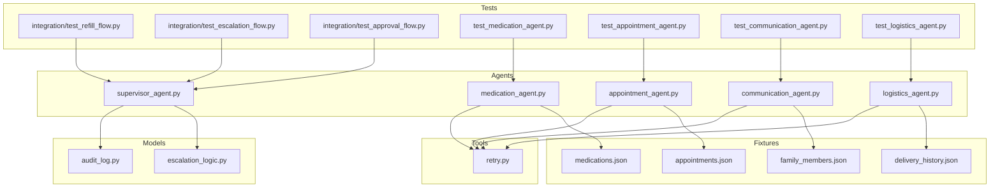
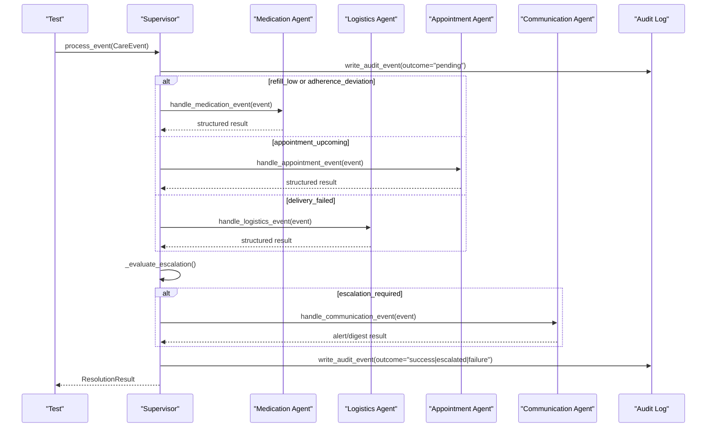
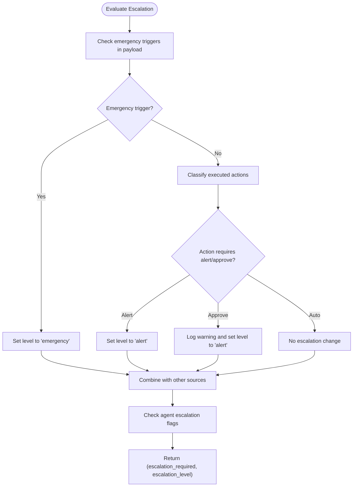
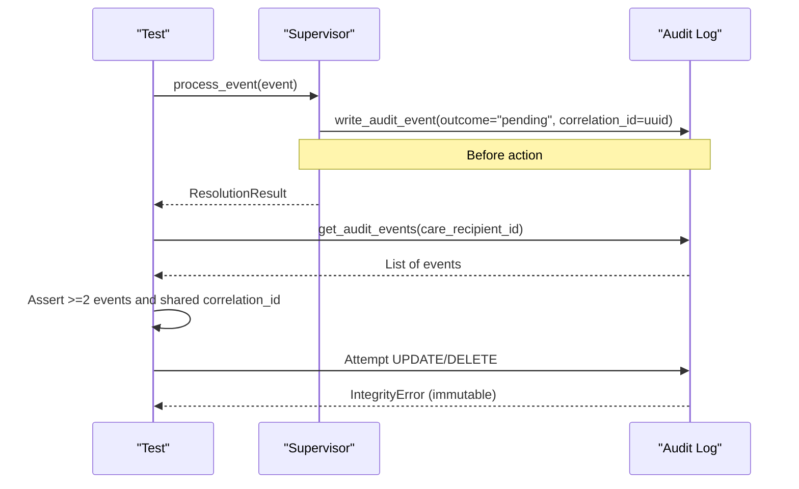
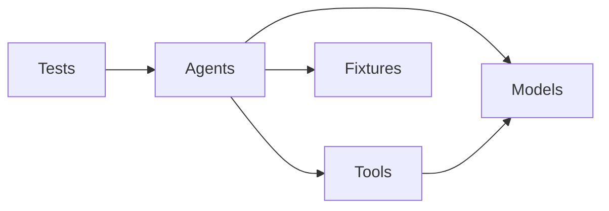

# Testing Patterns and Best Practices

<cite>
**Referenced Files in This Document**
- [conftest.py](file://conftest.py)
- [pyproject.toml](file://pyproject.toml)
- [fixtures/appointments.json](file://fixtures/appointments.json)
- [fixtures/delivery_history.json](file://fixtures/delivery_history.json)
- [fixtures/family_members.json](file://fixtures/family_members.json)
- [fixtures/medications.json](file://fixtures/medications.json)
- [src/models/audit_log.py](file://src/models/audit_log.py)
- [src/models/escalation_logic.py](file://src/models/escalation_logic.py)
- [src/tools/retry.py](file://src/tools/retry.py)
- [src/agents/supervisor_agent.py](file://src/agents/supervisor_agent.py)
- [tests/integration/test_refill_flow.py](file://tests/integration/test_refill_flow.py)
- [tests/integration/test_escalation_flow.py](file://tests/integration/test_escalation_flow.py)
- [tests/integration/test_approval_flow.py](file://tests/integration/test_approval_flow.py)
- [tests/test_medication_agent.py](file://tests/test_medication_agent.py)
- [tests/test_appointment_agent.py](file://tests/test_appointment_agent.py)
- [tests/test_communication_agent.py](file://tests/test_communication_agent.py)
- [tests/test_logistics_agent.py](file://tests/test_logistics_agent.py)
</cite>

## Table of Contents
1. Introduction
2. Project Structure
3. Core Components
4. Architecture Overview
5. Detailed Component Analysis
6. Dependency Analysis
7. Performance Considerations
8. Troubleshooting Guide
9. Conclusion
10. Appendices

## Introduction
This document defines consistent testing patterns and best practices for CareBridge, focusing on:
- Fixture management using JSON fixtures for realistic test data
- External service integration testing via mocking and API simulation
- Agent behavior validation, escalation logic verification, and audit trail integrity
- Guidance for writing effective tests for new features
- Performance and load testing considerations for concurrent care recipients
- Security aspects, error handling patterns, and debugging techniques for multi-agent interactions

The goal is to ensure reliable, deterministic, and maintainable tests that validate the full event-driven pipeline from the Supervisor through specialized agents to external integrations and back into an immutable audit trail.

## Project Structure
CareBridge uses a layered structure with clear separation between agents, tools, models, and tests:
- Agents implement domain-specific handlers (medication, appointment, logistics, communication)
- Tools encapsulate external integrations and utilities (e.g., retry)
- Models define schemas, escalation rules, and the immutable audit log
- Tests are organized by scope: unit-style agent/tool tests and end-to-end integration flows
- Fixtures provide deterministic, realistic datasets for appointments, deliveries, family members, and medications
- A shared pytest configuration enables async test execution and centralized fixtures

**Diagram sources**
- [src/agents/supervisor_agent.py:259-395](file://src/agents/supervisor_agent.py#L259-L395)
- [src/models/audit_log.py:19-78](file://src/models/audit_log.py#L19-L78)
- [src/models/escalation_logic.py:42-70](file://src/models/escalation_logic.py#L42-L70)
- [src/tools/retry.py:22-69](file://src/tools/retry.py#L22-L69)
- [fixtures/appointments.json:1-33](file://fixtures/appointments.json#L1-L33)
- [fixtures/delivery_history.json:1-33](file://fixtures/delivery_history.json#L1-L33)
- [fixtures/family_members.json:1-30](file://fixtures/family_members.json#L1-L30)
- [fixtures/medications.json:1-33](file://fixtures/medications.json#L1-L33)

**Section sources**
- [pyproject.toml:1-4](file://pyproject.toml#L1-L4)
- [conftest.py:7-60](file://conftest.py#L7-L60)

## Core Components
- Shared test environment: An autouse fixture ensures every test runs against a temporary audit database, resets supervisor state, and restores defaults after each test. This isolates side effects and guarantees deterministic outcomes across tests.
- Deterministic escalation: Escalation decisions are pure functions based on hardcoded classification tables and emergency triggers, ensuring tests can assert exact behavior without LLM nondeterminism.
- Immutable audit trail: The audit log enforces append-only semantics via SQLite triggers; tests verify both creation and immutability constraints.
- Retry strategy: A shared retry utility standardizes retries with exponential backoff and a specific exception type, enabling consistent failure-mode testing.

Key responsibilities:
- Supervisor orchestrates routing, escalation, and audit-first processing
- Specialized agents handle domain operations and return structured results
- Tools abstract external calls and utilities
- Models define schemas, escalation rules, and audit persistence

**Section sources**
- [conftest.py:7-60](file://conftest.py#L7-L60)
- [src/models/escalation_logic.py:13-39](file://src/models/escalation_logic.py#L13-L39)
- [src/models/audit_log.py:19-78](file://src/models/audit_log.py#L19-L78)
- [src/tools/retry.py:14-69](file://src/tools/retry.py#L14-L69)
- [src/agents/supervisor_agent.py:285-395](file://src/agents/supervisor_agent.py#L285-L395)

## Architecture Overview
CareBridge processes care events through a deterministic pipeline:
- The Supervisor writes a “pending” audit event before any action executes
- It routes the event to the appropriate specialized agent
- Escalation is evaluated deterministically using classify_action and agent-provided flags
- If escalation is required, the Communication Agent is invoked to notify family members
- A follow-up audit event records the final outcome

**Diagram sources**
- [src/agents/supervisor_agent.py:285-395](file://src/agents/supervisor_agent.py#L285-L395)
- [src/models/escalation_logic.py:42-70](file://src/models/escalation_logic.py#L42-L70)
- [src/models/audit_log.py:81-130](file://src/models/audit_log.py#L81-L130)

## Detailed Component Analysis

### Fixture Management
Use JSON fixtures to provide realistic, deterministic data for tests:
- Appointments: Validate scheduling, prep checklists, transportation needs
- Delivery history: Validate status checks, failure reasons, essential vs non-essential items
- Family members: Validate notification preferences, escalation order, contact info
- Medications: Validate refill eligibility thresholds, adherence patterns, pharmacy mapping

Best practices:
- Reference fixture IDs directly in tests (e.g., med-001, del-003) to keep assertions stable
- Keep fixtures small and focused per domain
- Use fixtures to drive both happy paths and edge cases (e.g., failed deliveries, low days remaining)

Example usage patterns:
- Appointment tool tests read calendar entries for cr-001 and assert presence and fields
- Logistics tool tests assert statuses and failure reasons for known delivery IDs
- Communication tool tests assert family preference retrieval and escalation ordering
- Medication tool tests assert refill eligibility and adherence pattern detection

**Section sources**
- [fixtures/appointments.json:1-33](file://fixtures/appointments.json#L1-L33)
- [fixtures/delivery_history.json:1-33](file://fixtures/delivery_history.json#L1-L33)
- [fixtures/family_members.json:1-30](file://fixtures/family_members.json#L1-L30)
- [fixtures/medications.json:1-33](file://fixtures/medications.json#L1-L33)
- [tests/test_appointment_agent.py:18-79](file://tests/test_appointment_agent.py#L18-L79)
- [tests/test_logistics_agent.py:18-94](file://tests/test_logistics_agent.py#L18-L94)
- [tests/test_communication_agent.py:74-89](file://tests/test_communication_agent.py#L74-L89)
- [tests/test_medication_agent.py:19-99](file://tests/test_medication_agent.py#L19-L99)

### External Service Integration Testing
Strategy:
- Mock external APIs at the tool layer using unittest.mock.patch and AsyncMock
- Simulate failures to exercise retry logic and error propagation
- Assert that tools either return structured failure responses or raise expected exceptions
- For communication tools, mock family member loading to simulate messaging API failures

Patterns observed:
- Patching internal simulation helpers to raise errors and asserting wrapped exceptions
- Patching uuid generation to force failure paths within try blocks
- Using patch to simulate API downtime and verifying retry exhaustion behavior

**Section sources**
- [tests/test_appointment_agent.py:49-62](file://tests/test_appointment_agent.py#L49-L62)
- [tests/test_logistics_agent.py:55-79](file://tests/test_logistics_agent.py#L55-L79)
- [tests/test_communication_agent.py:47-55](file://tests/test_communication_agent.py#L47-L55)
- [tests/test_medication_agent.py:52-77](file://tests/test_medication_agent.py#L52-L77)
- [src/tools/retry.py:22-69](file://src/tools/retry.py#L22-L69)

### Agent Behavior Validation
Agent-level tests validate:
- Correct routing of events to specialized agents
- Structured result shapes and keys
- Handling of invalid inputs and missing payloads
- Error messages and actions_taken content for user-facing feedback

Examples:
- Medication agent: refill_low triggers refill orders when eligible; no refill otherwise; invalid medication returns error
- Appointment agent: retrieves calendar for valid recipient; unknown recipient returns “no appointments”; result contains expected keys
- Logistics agent: escalates on essential delivery failures; delivered deliveries do not escalate; missing/invalid IDs escalate
- Communication agent: sends alerts for alert/emergency levels; info batches to digest; raises on messaging failures

**Section sources**
- [tests/test_medication_agent.py:120-177](file://tests/test_medication_agent.py#L120-L177)
- [tests/test_appointment_agent.py:97-127](file://tests/test_appointment_agent.py#L97-L127)
- [tests/test_logistics_agent.py:113-148](file://tests/test_logistics_agent.py#L113-L148)
- [tests/test_communication_agent.py:110-141](file://tests/test_communication_agent.py#L110-L141)

### Escalation Logic Verification
Escalation is deterministic and tested thoroughly:
- classify_action maps actions to auto/alert/approve categories
- Emergency triggers elevate severity
- Supervisor evaluates escalation based on executed actions and agent-provided flags
- Integration tests assert escalation_required and escalation_level for various scenarios

Patterns:
- Refill_low with low days remaining triggers alert category actions
- Failed essential pharmacy delivery triggers immediate escalation
- Adherence deviation with moderate severity triggers alert escalation

**Diagram sources**
- [src/agents/supervisor_agent.py:178-234](file://src/agents/supervisor_agent.py#L178-L234)
- [src/models/escalation_logic.py:42-70](file://src/models/escalation_logic.py#L42-L70)

**Section sources**
- [tests/test_supervisor.py:19-57](file://tests/test_supervisor.py#L19-L57)
- [tests/integration/test_escalation_flow.py:16-97](file://tests/integration/test_escalation_flow.py#L16-L97)
- [src/agents/supervisor_agent.py:178-234](file://src/agents/supervisor_agent.py#L178-L234)

### Audit Trail Integrity Checks
The audit trail is central to correctness and compliance:
- Every process_event call writes at least two events (before and after)
- Events are linked by correlation_id
- Immutability is enforced by SQLite triggers; tests assert UPDATE/DELETE attempts fail
- Approval flow logs human decisions and execution outcomes with authorization_ref

Testing patterns:
- Assert minimum number of audit events per process_event
- Verify correlation_id consistency across supervisor events
- Confirm approval/rejection events include authorization references
- Validate immutability by attempting direct DB modifications and expecting integrity errors

**Diagram sources**
- [src/agents/supervisor_agent.py:285-395](file://src/agents/supervisor_agent.py#L285-L395)
- [src/models/audit_log.py:19-78](file://src/models/audit_log.py#L19-L78)
- [tests/test_supervisor.py:204-276](file://tests/test_supervisor.py#L204-L276)

**Section sources**
- [tests/integration/test_refill_flow.py:64-82](file://tests/integration/test_refill_flow.py#L64-L82)
- [tests/integration/test_approval_flow.py:15-130](file://tests/integration/test_approval_flow.py#L15-L130)
- [tests/test_supervisor.py:204-276](file://tests/test_supervisor.py#L204-L276)
- [src/models/audit_log.py:81-167](file://src/models/audit_log.py#L81-L167)

### Approval Flow Testing
Approval flows ensure human oversight for sensitive actions:
- Create pending actions via audit events
- Approve or reject using approve_pending_action
- Verify audit trail includes human decision and execution outcomes
- Ensure rejected actions do not execute and approved actions route to correct agents

Patterns:
- Assertions on approve_action and reject_action event types
- Authorization references linking approvals to original actions
- No supervisor execution events for rejected actions

**Section sources**
- [tests/integration/test_approval_flow.py:15-130](file://tests/integration/test_approval_flow.py#L15-L130)
- [src/agents/supervisor_agent.py:432-592](file://src/agents/supervisor_agent.py#L432-L592)

### Writing Effective Tests for New Features
Guidelines:
- Prefer integration tests for end-to-end flows (refill, escalation, approval)
- Use unit-style tests for tool and agent handlers to isolate behavior
- Leverage fixtures for realistic data and deterministic IDs
- Mock external services at the tool boundary to avoid flaky network dependencies
- Assert structured results, escalation flags, and audit trail completeness
- Cover error paths: invalid inputs, API failures, retry exhaustion

Recommended structure:
- Arrange: Build CareEvent using helper functions
- Act: Call handler or process_event
- Assert: Result shape, escalation flags, actions_taken, audit events

**Section sources**
- [tests/test_medication_agent.py:107-177](file://tests/test_medication_agent.py#L107-L177)
- [tests/test_appointment_agent.py:86-127](file://tests/test_appointment_agent.py#L86-L127)
- [tests/test_logistics_agent.py:101-148](file://tests/test_logistics_agent.py#L101-L148)
- [tests/test_communication_agent.py:97-141](file://tests/test_communication_agent.py#L97-L141)

## Dependency Analysis
CareBridge’s testing relies on clear dependencies:
- Tests depend on agents and models for behavior validation
- Agents depend on tools for external integrations and utilities
- Models provide deterministic escalation rules and immutable audit persistence
- Fixtures supply stable data for tools and agents to operate against

**Diagram sources**
- [src/agents/supervisor_agent.py:259-395](file://src/agents/supervisor_agent.py#L259-L395)
- [src/models/escalation_logic.py:42-70](file://src/models/escalation_logic.py#L42-L70)
- [src/models/audit_log.py:81-167](file://src/models/audit_log.py#L81-L167)
- [src/tools/retry.py:22-69](file://src/tools/retry.py#L22-L69)
- [fixtures/medications.json:1-33](file://fixtures/medications.json#L1-L33)
- [fixtures/appointments.json:1-33](file://fixtures/appointments.json#L1-L33)
- [fixtures/delivery_history.json:1-33](file://fixtures/delivery_history.json#L1-L33)
- [fixtures/family_members.json:1-30](file://fixtures/family_members.json#L1-L30)

**Section sources**
- [pyproject.toml:1-4](file://pyproject.toml#L1-L4)
- [conftest.py:7-60](file://conftest.py#L7-L60)

## Performance Considerations
- Use in-memory or temp audit databases per test to avoid disk contention
- Limit fixture sizes to only what is needed for each test scenario
- Avoid real network calls; mock external APIs to keep tests fast and deterministic
- For concurrency testing, consider parallel test execution with isolated audit DBs per process
- Measure test runtime and identify slow paths (e.g., retry delays); adjust base_delay in tests if necessary

Load testing approaches:
- Simulate multiple concurrent care recipients by running parameterized tests with different IDs
- Use asyncio to dispatch multiple process_event calls concurrently and assert audit trail integrity
- Monitor memory usage and ensure fixtures are loaded efficiently
- Validate that escalation and audit logging remain consistent under load

[No sources needed since this section provides general guidance]

## Troubleshooting Guide
Common issues and debugging techniques:
- Audit DB path conflicts: The autouse fixture rewrites default parameters and patches module attributes to ensure tests use a temp DB
- Stale state: Supervisor caches are cleared per test to prevent cross-test contamination
- Mocking pitfalls: Patch the correct module path where the function is imported; for async functions, use AsyncMock
- Retry behavior: When simulating failures, ensure mocks raise exceptions consistently to exhaust retries and trigger escalation
- Escalation mismatches: Verify classify_action mappings and agent-provided escalation flags

Debugging steps:
- Inspect audit events for correlation_id chains to trace event flow
- Print or log structured results to confirm actions_taken and escalation flags
- Isolate failing tests by reducing payloads to minimal scenarios
- Use targeted patches to simulate specific failure modes (API down, invalid IDs)

**Section sources**
- [conftest.py:7-60](file://conftest.py#L7-L60)
- [src/agents/supervisor_agent.py:115-124](file://src/agents/supervisor_agent.py#L115-L124)
- [src/tools/retry.py:14-69](file://src/tools/retry.py#L14-L69)
- [tests/test_supervisor.py:204-276](file://tests/test_supervisor.py#L204-L276)

## Conclusion
CareBridge’s testing strategy emphasizes deterministic behavior, robust isolation, and comprehensive coverage of critical paths:
- Fixtures provide stable, realistic data
- Mocking isolates external dependencies while validating integration points
- Escalation logic is pure and verifiable
- Audit trail integrity is enforced and tested rigorously
- Approval flows ensure human oversight for sensitive actions

Adhering to these patterns ensures new features integrate smoothly, maintain reliability, and preserve compliance with safety-critical requirements.

[No sources needed since this section summarizes without analyzing specific files]

## Appendices

### Recommended Test Checklist for New Features
- Define fixture data covering normal and edge cases
- Write unit tests for tools and agent handlers
- Add integration tests for end-to-end flows
- Mock external services and simulate failures
- Assert structured results, escalation flags, and audit trail completeness
- Cover approval/rejection flows where applicable
- Validate immutability of audit events
- Ensure tests run independently with isolated state

[No sources needed since this section provides general guidance]