# Testing Strategy

<cite>
**Referenced Files in This Document**
- [pyproject.toml](file://pyproject.toml)
- [requirements.txt](file://requirements.txt)
- [conftest.py](file://conftest.py)
- [tests/api/conftest.py](file://tests/api/conftest.py)
- [tests/integration/test_refill_flow.py](file://tests/integration/test_refill_flow.py)
- [tests/integration/test_escalation_flow.py](file://tests/integration/test_escalation_flow.py)
- [tests/integration/test_approval_flow.py](file://tests/integration/test_approval_flow.py)
- [tests/test_medication_agent.py](file://tests/test_medication_agent.py)
- [tests/test_appointment_agent.py](file://tests/test_appointment_agent.py)
- [tests/test_communication_agent.py](file://tests/test_communication_agent.py)
- [tests/test_logistics_agent.py](file://tests/test_logistics_agent.py)
- [tests/test_supervisor.py](file://tests/test_supervisor.py)
- [tests/api/test_auth.py](file://tests/api/test_auth.py)
- [tests/api/test_firebase_auth.py](file://tests/api/test_firebase_auth.py)
- [tests/api/test_middleware.py](file://tests/api/test_middleware.py)
- [tests/api/test_rate_limit.py](file://tests/api/test_rate_limit.py)
- [tests/api/test_health.py](file://tests/api/test_health.py)
- [tests/api/test_audit.py](file://tests/api/test_audit.py)
- [tests/api/test_query.py](file://tests/api/test_query.py)
- [tests/api/test_status.py](file://tests/api/test_status.py)
- [tests/api/test_appointments_crud.py](file://tests/api/test_appointments_crud.py)
- [tests/api/test_medications_crud.py](file://tests/api/test_medications_crud.py)
- [tests/api/test_approvals.py](file://tests/api/test_approvals.py)
- [tests/api/test_settings_crud.py](file://tests/api/test_settings_crud.py)
- [fixtures/medications.json](file://fixtures/medications.json)
- [fixtures/appointments.json](file://fixtures/appointments.json)
</cite>

## Update Summary
**Changes Made**
- Added comprehensive API endpoint testing coverage including authentication, middleware, rate limiting, and Firebase integration
- Expanded test fixtures and configuration for REST API testing with FastAPI TestClient
- Added detailed documentation for authentication flows, middleware functionality, and rate limiting behavior
- Enhanced coverage of Firebase authentication integration testing patterns
- Updated performance considerations to include API load testing approaches

## Table of Contents
1. Introduction
2. Project Structure
3. Core Components
4. Architecture Overview
5. Detailed Component Analysis
6. Dependency Analysis
7. Performance Considerations
8. Troubleshooting Guide
9. Conclusion

## Introduction
This document describes the multi-layered testing strategy for CareBridge, ensuring system reliability and correctness across unit tests, integration flows, and comprehensive API endpoint testing. It explains how pytest is configured for async support, how fixtures and mocks are used to simulate external services, and how end-to-end scenarios (refill, escalation, approval) validate agent behavior, escalation logic, and audit trail integrity. The updated strategy now includes extensive coverage of REST API endpoints, authentication flows, middleware functionality, rate limiting behavior, and Firebase authentication integration. Guidance is also provided for writing effective tests for new features and considerations for performance and load testing concurrent care recipient scenarios.

## Project Structure
CareBridge organizes tests by scope:
- Unit tests per agent and tool under tests/
- Integration tests covering end-to-end workflows under tests/integration/
- Comprehensive API endpoint tests under tests/api/ covering authentication, CRUD operations, middleware, and rate limiting
- JSON fixtures under fixtures/ providing realistic data for tools and agents
- Shared test configuration via conftest.py and pytest settings in pyproject.toml
- API-specific fixtures and environment setup in tests/api/conftest.py

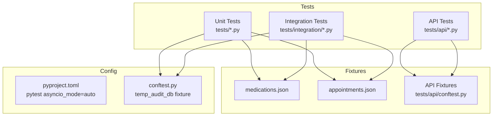

**Diagram sources**
- [pyproject.toml:1-4](file://pyproject.toml#L1-L4)
- [conftest.py:1-60](file://conftest.py#L1-L60)
- [tests/api/conftest.py:1-140](file://tests/api/conftest.py#L1-L140)
- [fixtures/medications.json:1-33](file://fixtures/medications.json#L1-L33)
- [fixtures/appointments.json:1-33](file://fixtures/appointments.json#L1-L33)

**Section sources**
- [pyproject.toml:1-4](file://pyproject.toml#L1-L4)
- [requirements.txt:1-8](file://requirements.txt#L1-L8)
- [conftest.py:1-60](file://conftest.py#L1-L60)
- [tests/api/conftest.py:1-140](file://tests/api/conftest.py#L1-L140)

## Core Components
- Async test execution: pytest is configured with asyncio_mode auto so async tests run without explicit markers.
- Isolation: A shared temp_audit_db fixture rewrites default DB paths and resets supervisor state per test, ensuring isolation and deterministic outcomes.
- API Testing Infrastructure: Comprehensive test client setup with temporary databases, demo user seeding, and rate limit configuration.
- Fixtures: JSON fixtures provide deterministic medication and appointment data for tools and agents.
- Mocking: External APIs are simulated or patched at the module level to control behavior and failure modes.

Key patterns observed:
- Tool-level assertions on return values and error handling.
- Agent-level assertions on event routing, actions taken, and escalation flags.
- End-to-end verification of audit trail entries, correlation IDs, and outcomes.
- API endpoint testing with proper authentication, authorization, and error handling validation.

**Section sources**
- [pyproject.toml:1-4](file://pyproject.toml#L1-L4)
- [conftest.py:7-60](file://conftest.py#L7-L60)
- [tests/api/conftest.py:31-87](file://tests/api/conftest.py#L31-L87)
- [fixtures/medications.json:1-33](file://fixtures/medications.json#L1-L33)
- [fixtures/appointments.json:1-33](file://fixtures/appointments.json#L1-L33)

## Architecture Overview
The testing architecture mirrors the runtime architecture: events flow through a supervisor that routes to specialized agents (medication, appointment, logistics, communication). Tests assert both functional outcomes and audit trail integrity. The API layer provides comprehensive endpoint testing for authentication, CRUD operations, and business logic.

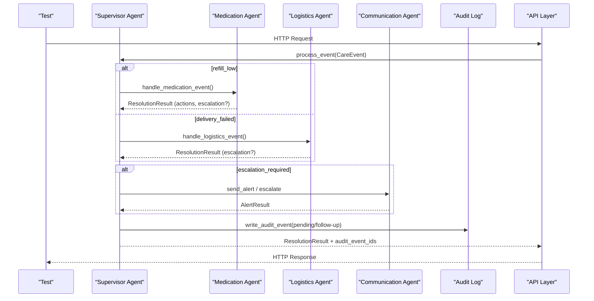

**Diagram sources**
- [tests/integration/test_refill_flow.py:14-48](file://tests/integration/test_refill_flow.py#L14-L48)
- [tests/integration/test_escalation_flow.py:16-54](file://tests/integration/test_escalation_flow.py#L16-L54)
- [tests/test_supervisor.py:67-115](file://tests/test_supervisor.py#L67-L115)
- [tests/api/test_auth.py:4-91](file://tests/api/test_auth.py#L4-L91)

## Detailed Component Analysis

### API Authentication Testing
Comprehensive authentication flow testing covers login, token refresh, user profile access, and security enforcement:
- Login endpoint validates credentials and returns proper token pairs
- Token type enforcement prevents misuse of refresh tokens for protected routes
- User profile endpoint returns appropriate user information with role-based access
- Security headers and request ID propagation verified across all endpoints

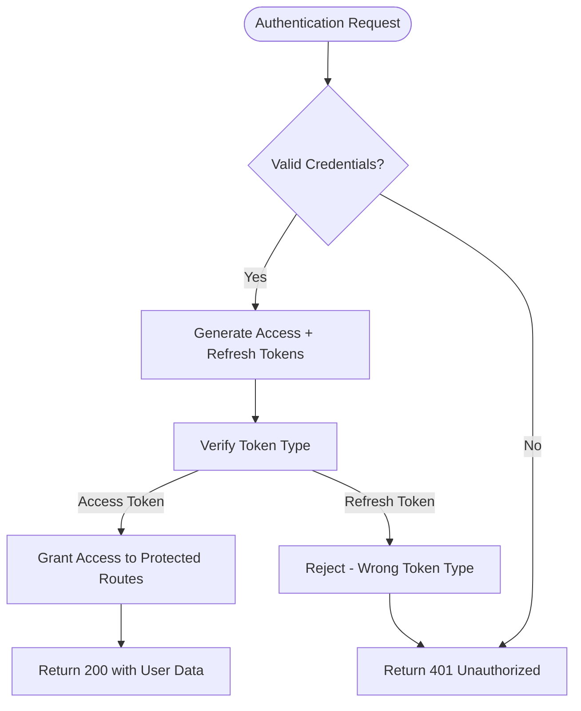

**Diagram sources**
- [tests/api/test_auth.py:4-91](file://tests/api/test_auth.py#L4-L91)

**Section sources**
- [tests/api/test_auth.py:4-91](file://tests/api/test_auth.py#L4-L91)

### Firebase Authentication Integration Testing
Firebase authentication testing validates token exchange, user linking, and configuration management:
- Token exchange creates or links users based on Firebase UID
- Email verification status enforced during authentication
- Configuration endpoint exposes Firebase availability status
- Proper error handling for invalid tokens and unverified emails

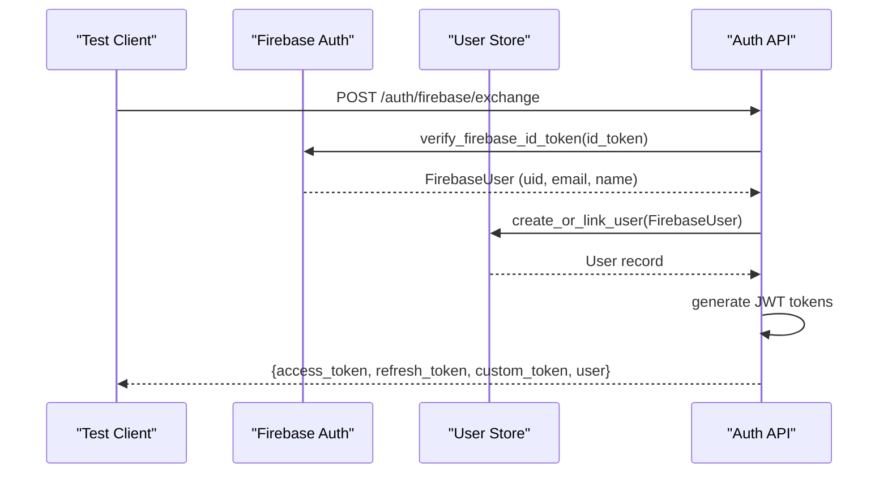

**Diagram sources**
- [tests/api/test_firebase_auth.py:62-98](file://tests/api/test_firebase_auth.py#L62-L98)

**Section sources**
- [tests/api/test_firebase_auth.py:62-186](file://tests/api/test_firebase_auth.py#L62-L186)

### Middleware Functionality Testing
Middleware testing ensures observability, security, and request/response processing:
- Request ID generation and propagation across all responses
- Error envelope standardization preventing stack trace leakage
- PII protection in logging outputs
- Request size limits enforced before routing

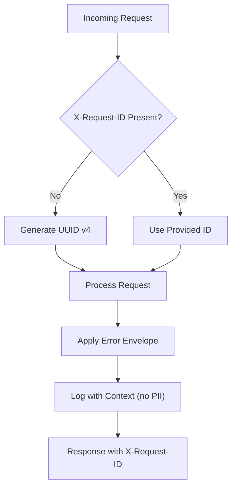

**Diagram sources**
- [tests/api/test_middleware.py:10-81](file://tests/api/test_middleware.py#L10-L81)

**Section sources**
- [tests/api/test_middleware.py:10-81](file://tests/api/test_middleware.py#L10-L81)

### Rate Limiting Behavior Testing
Rate limiting tests validate endpoint protection and burst handling:
- Authentication endpoints properly rate limited to prevent brute force attacks
- Health endpoints exempt from rate limiting for monitoring purposes
- Standardized error responses for rate limit exceeded scenarios
- Configurable rate limits through environment variables

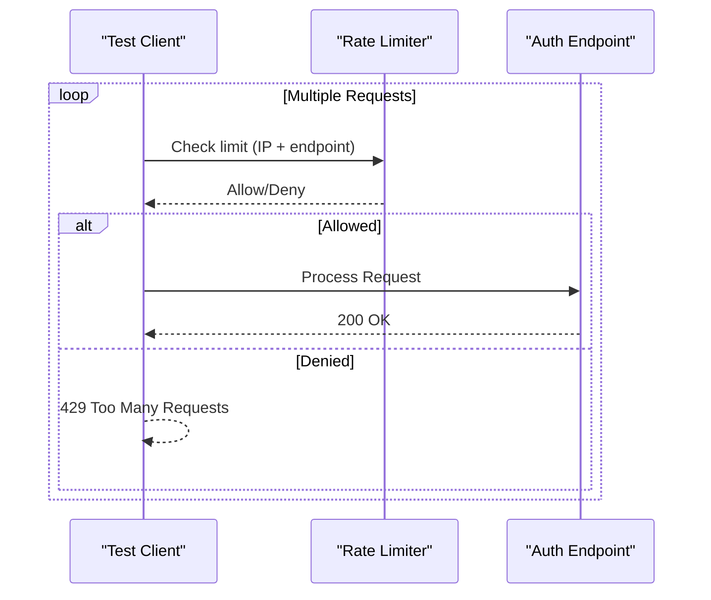

**Diagram sources**
- [tests/api/test_rate_limit.py:13-49](file://tests/api/test_rate_limit.py#L13-L49)

**Section sources**
- [tests/api/test_rate_limit.py:13-49](file://tests/api/test_rate_limit.py#L13-L49)

### Refill Flow Integration
End-to-end validation of refill_low events:
- Event routed to medication agent; refill ordered when days_remaining <= threshold.
- Audit trail includes pending and follow-up entries linked by correlation_id.
- Escalation occurs for alert-category actions like order_refill.

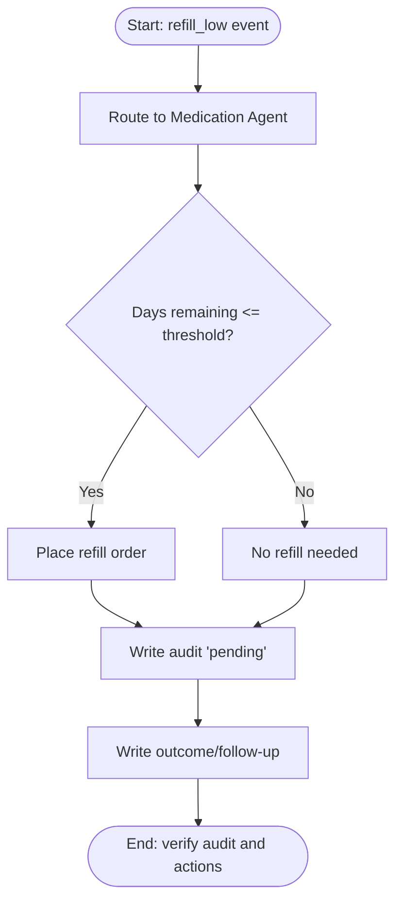

**Diagram sources**
- [tests/integration/test_refill_flow.py:14-48](file://tests/integration/test_refill_flow.py#L14-L48)
- [tests/integration/test_refill_flow.py:49-63](file://tests/integration/test_refill_flow.py#L49-L63)
- [tests/integration/test_refill_flow.py:64-82](file://tests/integration/test_refill_flow.py#L64-L82)

**Section sources**
- [tests/integration/test_refill_flow.py:14-82](file://tests/integration/test_refill_flow.py#L14-L82)

### Escalation Flow Integration
Validates that failures and critical events trigger escalation:
- Retry exhaustion from pharmacy API leads to escalation and family alerts.
- Essential delivery failures escalate immediately.
- Adherence deviations with moderate severity escalate.

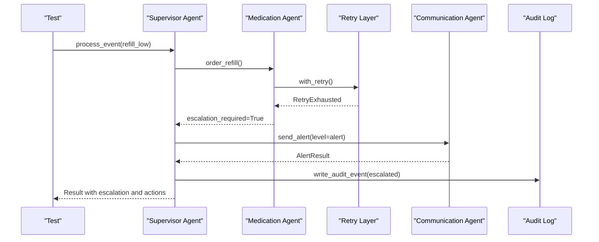

**Diagram sources**
- [tests/integration/test_escalation_flow.py:16-54](file://tests/integration/test_escalation_flow.py#L16-L54)
- [tests/integration/test_escalation_flow.py:56-82](file://tests/integration/test_escalation_flow.py#L56-L82)
- [tests/integration/test_escalation_flow.py:83-97](file://tests/integration/test_escalation_flow.py#L83-L97)

**Section sources**
- [tests/integration/test_escalation_flow.py:16-97](file://tests/integration/test_escalation_flow.py#L16-L97)

### Approval Flow Integration
Validates human-in-the-loop approvals:
- Pending actions created in audit log can be approved or rejected.
- Approvals execute actions and record authorization references.
- Rejections log rejection rationale without execution.

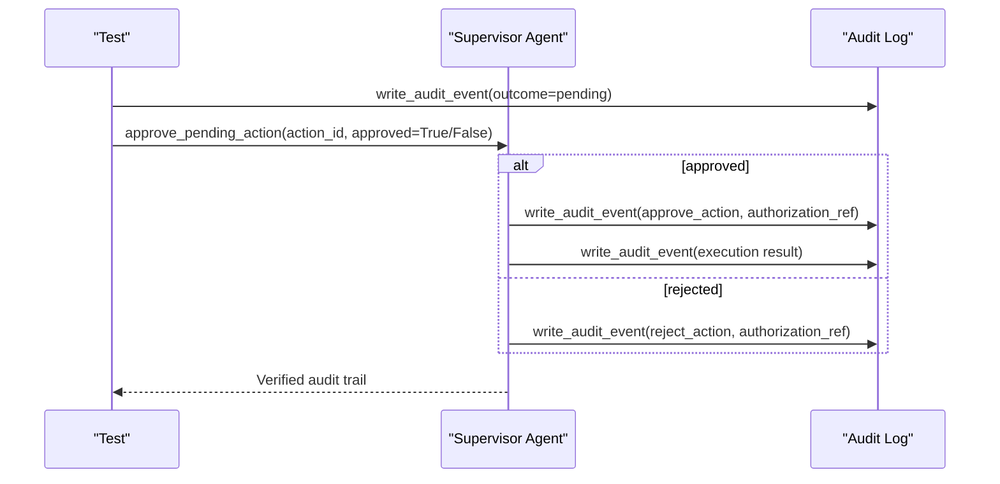

**Diagram sources**
- [tests/integration/test_approval_flow.py:15-57](file://tests/integration/test_approval_flow.py#L15-L57)
- [tests/integration/test_approval_flow.py:58-96](file://tests/integration/test_approval_flow.py#L58-L96)
- [tests/integration/test_approval_flow.py:97-130](file://tests/integration/test_approval_flow.py#L97-L130)

**Section sources**
- [tests/integration/test_approval_flow.py:15-130](file://tests/integration/test_approval_flow.py#L15-L130)

### Unit Testing Patterns: Agents and Tools
- Medication agent and tools:
  - Assert refill eligibility and adherence pattern detection against fixture data.
  - Simulate API failures and verify retry exhaustion triggers escalation.
- Appointment agent and tools:
  - Validate calendar retrieval, scheduling, and checklist sending.
  - Handle invalid recipients and API failures gracefully.
- Communication agent and tools:
  - Verify alert levels (info/alert/emergency) and channel selection.
  - Synthesize status summaries and family preferences.
- Logistics agent and tools:
  - Check delivery statuses and order placements.
  - Escalate on essential delivery failures and missing identifiers.

```mermaid
classDiagram
class TestCheckRefillStatus
class TestOrderRefill
class TestDetectAdherencePattern
class TestHandleMedicationEvent
class TestGetCalendar
class TestScheduleAppointment
class TestSendPrepChecklist
class TestHandleAppointmentEvent
class TestSendAlert
class TestSynthesizeStatus
class TestGetFamilyPreferences
class TestHandleCommunicationEvent
class TestCheckDeliveryStatus
class TestOrderGrocery
class TestOrderPharmacyDelivery
class TestHandleLogisticsEvent
```

**Diagram sources**
- [tests/test_medication_agent.py:19-177](file://tests/test_medication_agent.py#L19-L177)
- [tests/test_appointment_agent.py:18-127](file://tests/test_appointment_agent.py#L18-L127)
- [tests/test_communication_agent.py:23-141](file://tests/test_communication_agent.py#L23-L141)
- [tests/test_logistics_agent.py:18-148](file://tests/test_logistics_agent.py#L18-L148)

**Section sources**
- [tests/test_medication_agent.py:19-177](file://tests/test_medication_agent.py#L19-L177)
- [tests/test_appointment_agent.py:18-127](file://tests/test_appointment_agent.py#L18-L127)
- [tests/test_communication_agent.py:23-141](file://tests/test_communication_agent.py#L23-L141)
- [tests/test_logistics_agent.py:18-148](file://tests/test_logistics_agent.py#L18-L148)

### Supervisor Agent and Escalation Logic
- Routing: Events route to appropriate agents based on type.
- Escalation classification: Deterministic action classification ensures safety defaults.
- Query status: Aggregates synthesized status for care recipients.
- Approval workflow: Enforces idempotency and validates resolution states.

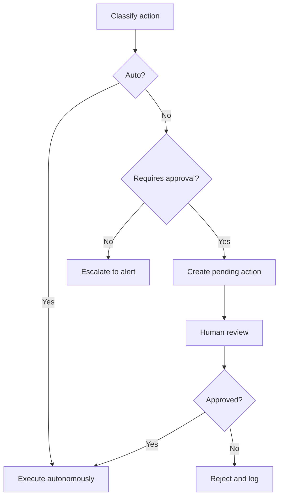

**Diagram sources**
- [tests/test_supervisor.py:19-57](file://tests/test_supervisor.py#L19-L57)
- [tests/test_supervisor.py:67-115](file://tests/test_supervisor.py#L67-L115)
- [tests/test_supervisor.py:137-197](file://tests/test_supervisor.py#L137-L197)

**Section sources**
- [tests/test_supervisor.py:19-197](file://tests/test_supervisor.py#L19-L197)

### Audit Trail Integrity
- Every process_event writes multiple audit events (pending and follow-up).
- Immutability enforced via database triggers; attempts to update/delete raise integrity errors.
- Correlation IDs link related events across flows.

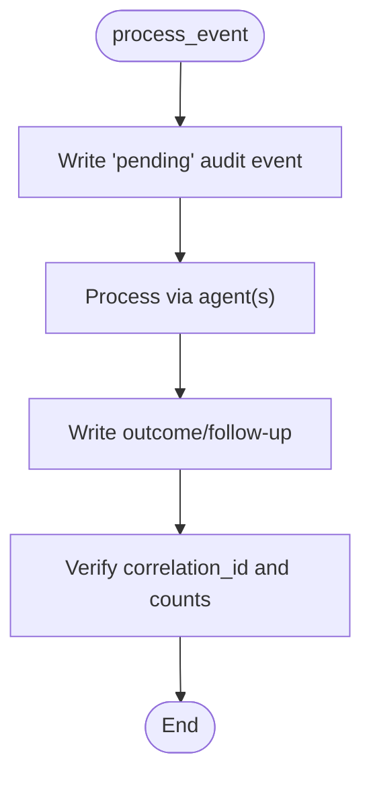

**Diagram sources**
- [tests/integration/test_refill_flow.py:64-82](file://tests/integration/test_refill_flow.py#L64-L82)
- [tests/test_supervisor.py:207-276](file://tests/test_supervisor.py#L207-L276)

**Section sources**
- [tests/integration/test_refill_flow.py:64-82](file://tests/integration/test_refill_flow.py#L64-L82)
- [tests/test_supervisor.py:207-276](file://tests/test_supervisor.py#L207-L276)

### API Endpoint Testing Coverage
Comprehensive API endpoint testing covers:
- **Health & Status**: Public endpoints for health checks, readiness, and version information
- **CRUD Operations**: Full Create, Read, Update, Delete operations for appointments and medications
- **Query Interface**: Natural language query processing backed by Supervisor agent
- **Settings Management**: User preference updates with validation and audit trails
- **Approval Queue**: Human-in-the-loop approval workflows with role-based access control

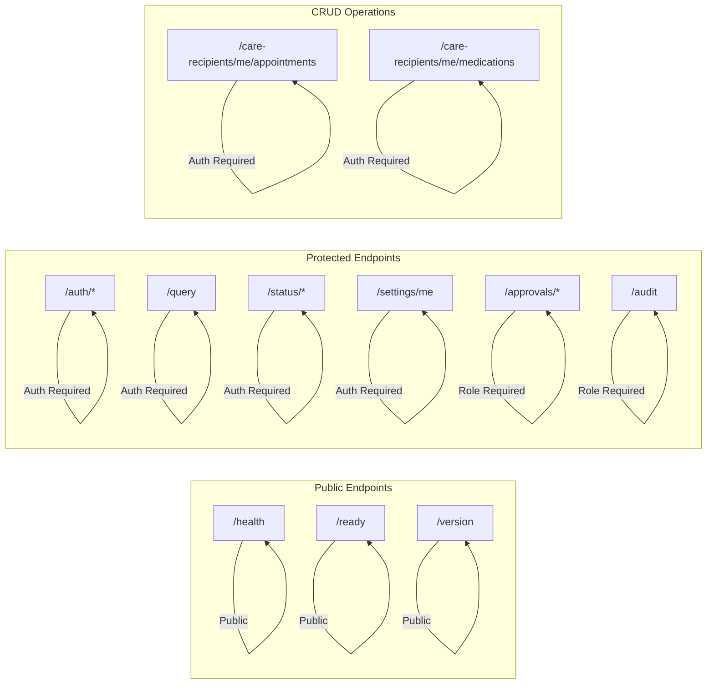

**Diagram sources**
- [tests/api/test_health.py:4-44](file://tests/api/test_health.py#L4-L44)
- [tests/api/test_appointments_crud.py:23-174](file://tests/api/test_appointments_crud.py#L23-L174)
- [tests/api/test_medications_crud.py:14-182](file://tests/api/test_medications_crud.py#L14-L182)
- [tests/api/test_query.py:4-47](file://tests/api/test_query.py#L4-L47)
- [tests/api/test_settings_crud.py:6-134](file://tests/api/test_settings_crud.py#L6-L134)
- [tests/api/test_approvals.py:4-68](file://tests/api/test_approvals.py#L4-L68)
- [tests/api/test_audit.py:9-112](file://tests/api/test_audit.py#L9-L112)

**Section sources**
- [tests/api/test_health.py:4-44](file://tests/api/test_health.py#L4-L44)
- [tests/api/test_appointments_crud.py:23-174](file://tests/api/test_appointments_crud.py#L23-L174)
- [tests/api/test_medications_crud.py:14-182](file://tests/api/test_medications_crud.py#L14-L182)
- [tests/api/test_query.py:4-47](file://tests/api/test_query.py#L4-L47)
- [tests/api/test_settings_crud.py:6-134](file://tests/api/test_settings_crud.py#L6-L134)
- [tests/api/test_approvals.py:4-68](file://tests/api/test_approvals.py#L4-L68)
- [tests/api/test_audit.py:9-112](file://tests/api/test_audit.py#L9-L112)

## Dependency Analysis
External dependencies relevant to testing:
- pytest and pytest-asyncio enable async test execution.
- Strands agents framework provides agent abstractions.
- Pydantic models ensure schema validation in tests.
- FastAPI TestClient enables comprehensive API endpoint testing.
- Boto3 and python-dotenv may be used for environment/config but are not directly invoked in the analyzed tests.

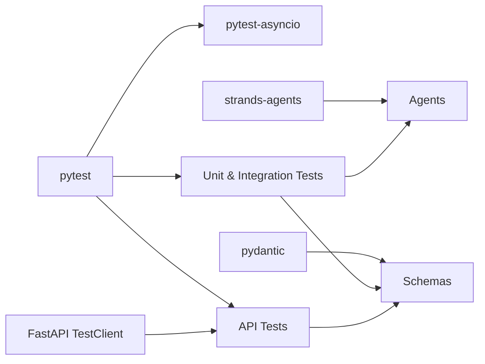

**Diagram sources**
- [requirements.txt:1-8](file://requirements.txt#L1-L8)

**Section sources**
- [requirements.txt:1-8](file://requirements.txt#L1-L8)

## Performance Considerations
- Use isolated temp databases per test to avoid contention and ensure deterministic results.
- Prefer targeted mocking of external APIs to minimize flakiness and speed up tests.
- For concurrency and load testing:
  - Run parallel test suites using pytest-xdist to simulate concurrent care recipients.
  - Introduce controlled backpressure by patching slow external calls and asserting timeouts/retries.
  - Measure end-to-end latency for approval flows under load to identify bottlenecks in audit logging and agent routing.
  - Validate that escalation pathways remain responsive under high event throughput.
- **API Load Testing**: 
  - Use rate limiting tests to validate endpoint protection under high traffic scenarios.
  - Test authentication endpoints with concurrent login requests to verify rate limiting effectiveness.
  - Monitor memory usage during bulk operations like appointment and medication creation.
  - Validate response times for paginated audit queries under increasing data volumes.

[No sources needed since this section provides general guidance]

## Troubleshooting Guide
Common issues and resolutions:
- Audit DB path conflicts: Ensure the temp_audit_db fixture runs; it rewrites function defaults and patches module-level constants to use a temporary database.
- State leakage between tests: The fixture clears resolved-action caches and resets supervisor flags to maintain independence.
- External API flakiness: Patch specific modules where APIs are called; simulate failures to exercise retry and escalation paths.
- Invalid identifiers: Tests assert ValueError for unknown medications, appointments, deliveries, and families; ensure fixtures contain expected IDs.
- **API Testing Issues**:
  - Authentication failures: Verify demo user seeding and JWT secret configuration in test environment.
  - Rate limiting interference: Ensure limiter.reset() is called between tests to clear in-memory counters.
  - Environment variable conflicts: Use monkeypatch to isolate test configurations and clear settings cache after changes.
  - Database isolation: Confirm temp_audit_db fixture is active before API app initialization.

**Section sources**
- [conftest.py:7-60](file://conftest.py#L7-L60)
- [tests/api/conftest.py:31-57](file://tests/api/conftest.py#L31-L57)
- [tests/test_medication_agent.py:36-40](file://tests/test_medication_agent.py#L36-L40)
- [tests/test_appointment_agent.py:28-32](file://tests/test_appointment_agent.py#L28-L32)
- [tests/test_logistics_agent.py:34-38](file://tests/test_logistics_agent.py#L34-L38)
- [tests/test_communication_agent.py:86-90](file://tests/test_communication_agent.py#L86-L90)

## Conclusion
CareBridge's testing strategy combines robust unit tests, comprehensive integration flows, strict audit trail verification, and extensive API endpoint testing to ensure reliability and correctness. The enhanced test suite now covers authentication flows, middleware functionality, rate limiting behavior, and Firebase authentication integration alongside traditional agent and tool testing. Async support, isolated fixtures, and targeted mocking enable fast, deterministic tests that cover normal operations, error conditions, and escalation scenarios. Following these patterns will help maintain high-quality coverage as new features are added, while performance and load testing practices ensure scalability under concurrent care recipient workloads. The comprehensive API testing infrastructure provides confidence in endpoint behavior, security, and performance characteristics.