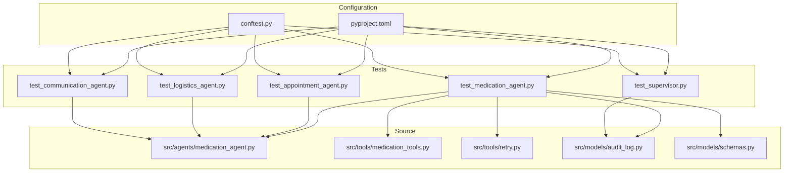
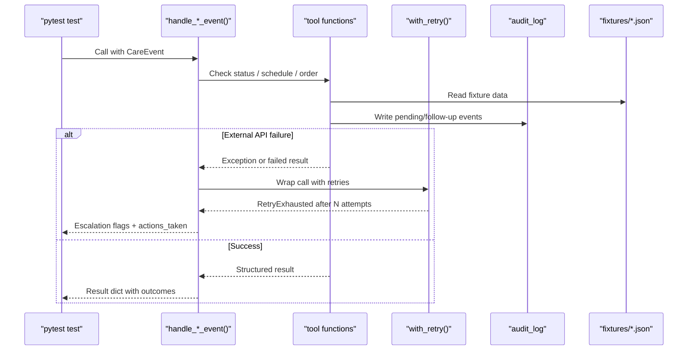
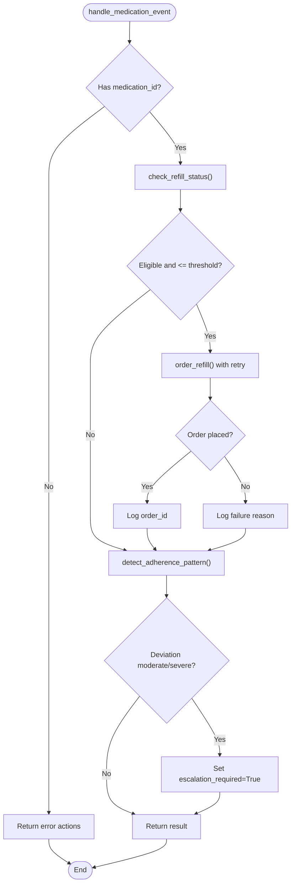
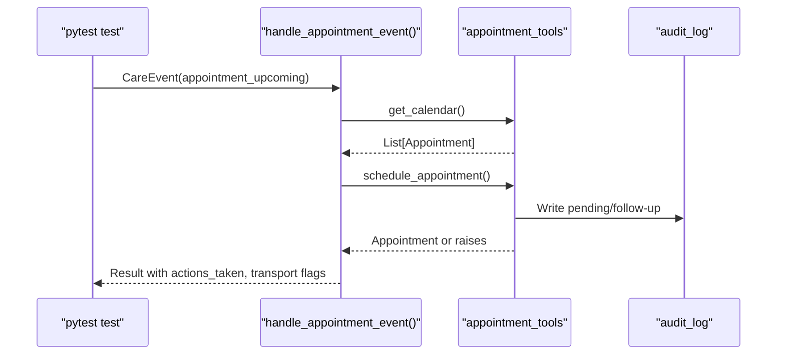
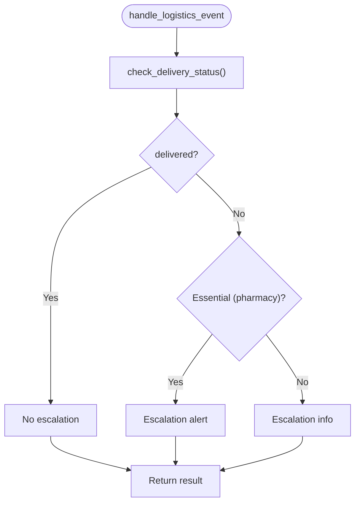
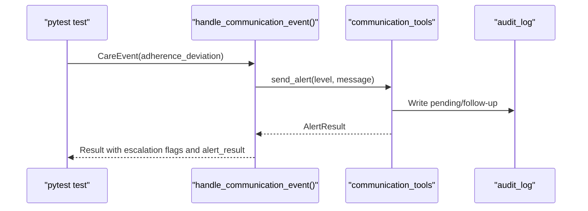
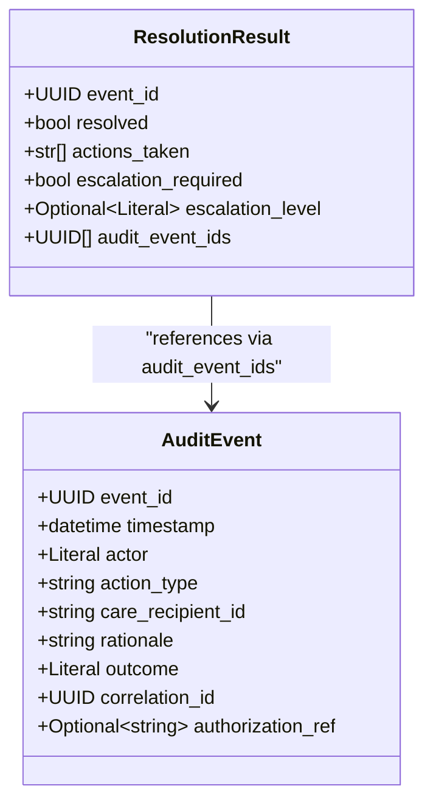
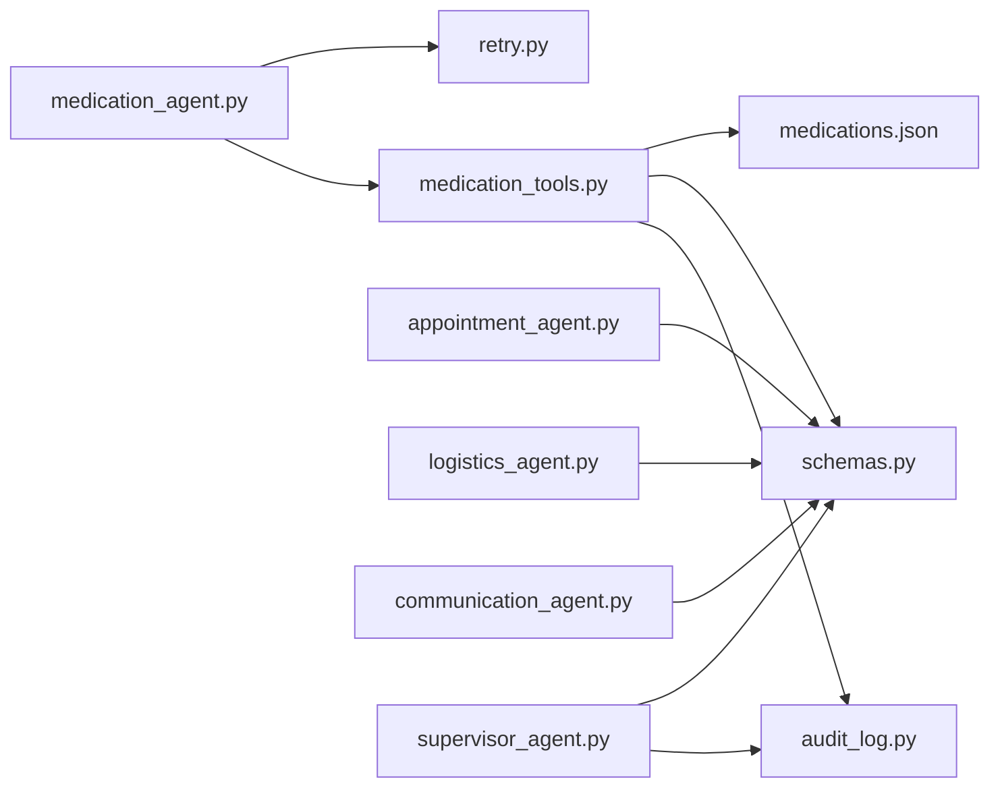

# Unit Testing

<cite>
**Referenced Files in This Document**
- [pyproject.toml](file://pyproject.toml)
- [conftest.py](file://conftest.py)
- [src/tools/retry.py](file://src/tools/retry.py)
- [src/models/audit_log.py](file://src/models/audit_log.py)
- [src/models/schemas.py](file://src/models/schemas.py)
- [src/agents/medication_agent.py](file://src/agents/medication_agent.py)
- [src/tools/medication_tools.py](file://src/tools/medication_tools.py)
- [tests/test_medication_agent.py](file://tests/test_medication_agent.py)
- [tests/test_appointment_agent.py](file://tests/test_appointment_agent.py)
- [tests/test_logistics_agent.py](file://tests/test_logistics_agent.py)
- [tests/test_communication_agent.py](file://tests/test_communication_agent.py)
- [tests/test_supervisor.py](file://tests/test_supervisor.py)
- [fixtures/medications.json](file://fixtures/medications.json)
</cite>

## Table of Contents
1. [Introduction](#introduction)
2. [Project Structure](#project-structure)
3. [Core Components](#core-components)
4. [Architecture Overview](#architecture-overview)
5. [Detailed Component Analysis](#detailed-component-analysis)
6. [Dependency Analysis](#dependency-analysis)
7. [Performance Considerations](#performance-considerations)
8. [Troubleshooting Guide](#troubleshooting-guide)
9. [Conclusion](#conclusion)
10. [Appendices](#appendices)

## Introduction
This document explains how CareBridge tests individual agents and tools in isolation using pytest with automatic async support. It covers testing patterns for the medication agent (refill status checks, order placement, adherence detection), appointment scheduling, logistics coordination, and communication tools. It also documents mocking strategies for external dependencies using unittest.mock and AsyncMock, fixture usage for test data and temporary audit databases, and best practices for testing error handling, retry exhaustion, and edge cases.

## Project Structure
CareBridge organizes tests by agent/tool domain under tests/, with shared configuration and fixtures at the repository root. The pytest configuration enables automatic asyncio mode so async tests run without explicit event loop setup. A global autouse fixture ensures each test runs against an isolated SQLite audit database and resets supervisor state to keep tests independent.

**Diagram sources**
- [pyproject.toml:1-4](file://pyproject.toml#L1-L4)
- [conftest.py:1-60](file://conftest.py#L1-L60)
- [tests/test_medication_agent.py:1-177](file://tests/test_medication_agent.py#L1-L177)
- [tests/test_appointment_agent.py:1-127](file://tests/test_appointment_agent.py#L1-L127)
- [tests/test_logistics_agent.py:1-148](file://tests/test_logistics_agent.py#L1-L148)
- [tests/test_communication_agent.py:1-141](file://tests/test_communication_agent.py#L1-L141)
- [tests/test_supervisor.py:1-276](file://tests/test_supervisor.py#L1-L276)
- [src/agents/medication_agent.py:1-189](file://src/agents/medication_agent.py#L1-L189)
- [src/tools/medication_tools.py:1-208](file://src/tools/medication_tools.py#L1-L208)
- [src/tools/retry.py:1-70](file://src/tools/retry.py#L1-L70)
- [src/models/audit_log.py:1-167](file://src/models/audit_log.py#L1-L167)
- [src/models/schemas.py:1-150](file://src/models/schemas.py#L1-L150)

**Section sources**
- [pyproject.toml:1-4](file://pyproject.toml#L1-L4)
- [conftest.py:1-60](file://conftest.py#L1-L60)

## Core Components
- Pytest configuration: Automatic asyncio mode is enabled so async tests execute without manual event loops.
- Global audit DB fixture: An autouse fixture creates a temporary SQLite database per test, rewrites default parameters for audit functions to use the temp path, and resets supervisor state to ensure isolation.
- Shared retry utility: A centralized retry helper provides exponential backoff and raises a specific exception when all attempts are exhausted; tests can assert on this behavior.
- Data models: Pydantic models define structured inputs/outputs used across agents and tools; tests assert model fields and types.

Key responsibilities:
- Medication agent: Refill eligibility checks, ordering refills with retries, adherence pattern detection, escalation decisions.
- Appointment agent: Calendar retrieval, scheduling, checklist dispatch.
- Logistics agent: Delivery status checks, grocery/pharmacy delivery orders.
- Communication agent: Alerting via multiple channels, status synthesis, family preferences.
- Supervisor: Routing events to specialized agents, escalation routing, approval workflow, audit trail verification.

**Section sources**
- [pyproject.toml:1-4](file://pyproject.toml#L1-L4)
- [conftest.py:1-60](file://conftest.py#L1-L60)
- [src/tools/retry.py:1-70](file://src/tools/retry.py#L1-L70)
- [src/models/schemas.py:1-150](file://src/models/schemas.py#L1-L150)

## Architecture Overview
The testing architecture isolates each agent’s handler and tool functions while sharing a common audit database and retry mechanism. Tests mock external APIs or simulate failures to validate error paths and escalation logic.

**Diagram sources**
- [src/agents/medication_agent.py:23-134](file://src/agents/medication_agent.py#L23-L134)
- [src/tools/medication_tools.py:65-152](file://src/tools/medication_tools.py#L65-L152)
- [src/tools/retry.py:22-69](file://src/tools/retry.py#L22-L69)
- [src/models/audit_log.py:81-128](file://src/models/audit_log.py#L81-L128)
- [fixtures/medications.json:1-33](file://fixtures/medications.json#L1-L33)

## Detailed Component Analysis

### Medication Agent and Tools
Testing focuses on:
- Refill status checks: Validate days remaining, eligibility, and pharmacy mapping from fixtures.
- Order placement: Assert successful placement and failure handling; verify audit events written before and after the action.
- Adherence detection: Confirm deviation flags and severity for known medications.
- Event handler: Ensure refill_low triggers orders when eligible, no order when not eligible, and proper error handling for missing or invalid IDs.
- Retry exhaustion: Force underlying calls to fail repeatedly to trigger RetryExhausted and confirm escalation.

**Diagram sources**
- [src/agents/medication_agent.py:23-134](file://src/agents/medication_agent.py#L23-L134)
- [src/tools/medication_tools.py:34-62](file://src/tools/medication_tools.py#L34-L62)
- [src/tools/medication_tools.py:155-208](file://src/tools/medication_tools.py#L155-L208)

**Section sources**
- [tests/test_medication_agent.py:19-100](file://tests/test_medication_agent.py#L19-L100)
- [tests/test_medication_agent.py:120-177](file://tests/test_medication_agent.py#L120-L177)
- [src/agents/medication_agent.py:23-189](file://src/agents/medication_agent.py#L23-L189)
- [src/tools/medication_tools.py:34-208](file://src/tools/medication_tools.py#L34-L208)
- [src/tools/retry.py:14-69](file://src/tools/retry.py#L14-L69)
- [fixtures/medications.json:1-33](file://fixtures/medications.json#L1-L33)

### Appointment Agent and Tools
Testing covers:
- Calendar retrieval: Verify returned appointments belong to the correct care recipient and are valid models.
- Scheduling: Assert new appointment creation and handle simulated calendar API failures.
- Checklist dispatch: Confirm checklist sent status and timestamps; validate invalid appointment handling.
- Event handler: Ensure upcoming appointments are processed, unknown recipients return appropriate messages, and results include expected keys.

**Diagram sources**
- [tests/test_appointment_agent.py:18-79](file://tests/test_appointment_agent.py#L18-L79)
- [tests/test_appointment_agent.py:97-127](file://tests/test_appointment_agent.py#L97-L127)

**Section sources**
- [tests/test_appointment_agent.py:18-79](file://tests/test_appointment_agent.py#L18-L79)
- [tests/test_appointment_agent.py:97-127](file://tests/test_appointment_agent.py#L97-L127)

### Logistics Agent and Tools
Testing includes:
- Delivery status checks: Validate delivered vs failed statuses and failure reasons; assert invalid ID handling.
- Grocery and pharmacy deliveries: Assert successful placements and handle simulated API failures.
- Event handler: Ensure essential delivery failures escalate, delivered items do not escalate, and missing/invalid IDs trigger escalation.

**Diagram sources**
- [tests/test_logistics_agent.py:18-94](file://tests/test_logistics_agent.py#L18-L94)
- [tests/test_logistics_agent.py:113-148](file://tests/test_logistics_agent.py#L113-L148)

**Section sources**
- [tests/test_logistics_agent.py:18-94](file://tests/test_logistics_agent.py#L18-L94)
- [tests/test_logistics_agent.py:113-148](file://tests/test_logistics_agent.py#L113-L148)

### Communication Agent and Tools
Testing validates:
- Alert sending: Different levels route to appropriate channels (sms,email for alert; sms,email,phone for emergency; digest for info).
- Status synthesis: Returns a summary string and handles empty histories gracefully.
- Family preferences: Verifies member lists and escalation order sorting.
- Event handler: Ensures alert-level escalations, emergency channel selection, and info-level batching into daily digests.

**Diagram sources**
- [tests/test_communication_agent.py:23-90](file://tests/test_communication_agent.py#L23-L90)
- [tests/test_communication_agent.py:110-141](file://tests/test_communication_agent.py#L110-L141)

**Section sources**
- [tests/test_communication_agent.py:23-90](file://tests/test_communication_agent.py#L23-L90)
- [tests/test_communication_agent.py:110-141](file://tests/test_communication_agent.py#L110-L141)

### Supervisor Agent and Audit Trail
Testing confirms:
- Action classification: Deterministic categorization into auto/alert/approve categories.
- Event routing: Correct delegation to specialized agents based on event type.
- Approval workflow: Approving or rejecting pending actions logs appropriate audit events; double resolution raises errors; nonexistent actions raise errors.
- Audit immutability: Attempted updates/deletes on audit_events raise integrity errors due to triggers.

**Diagram sources**
- [src/models/schemas.py:64-71](file://src/models/schemas.py#L64-L71)
- [src/models/schemas.py:44-54](file://src/models/schemas.py#L44-L54)

**Section sources**
- [tests/test_supervisor.py:19-57](file://tests/test_supervisor.py#L19-L57)
- [tests/test_supervisor.py:64-115](file://tests/test_supervisor.py#L64-L115)
- [tests/test_supervisor.py:137-197](file://tests/test_supervisor.py#L137-L197)
- [tests/test_supervisor.py:204-276](file://tests/test_supervisor.py#L204-L276)
- [src/models/audit_log.py:19-78](file://src/models/audit_log.py#L19-L78)

## Dependency Analysis
- Agents depend on tools for domain operations and on schemas for structured I/O.
- Tools depend on fixtures for deterministic data and on audit logging for compliance.
- Retry utility centralizes resilience; agents wrap critical calls to leverage consistent backoff and error signaling.
- Tests mock external APIs or inject failures to validate error paths and escalation logic.

**Diagram sources**
- [src/agents/medication_agent.py:1-189](file://src/agents/medication_agent.py#L1-L189)
- [src/tools/medication_tools.py:1-208](file://src/tools/medication_tools.py#L1-L208)
- [src/tools/retry.py:1-70](file://src/tools/retry.py#L1-L70)
- [src/models/audit_log.py:1-167](file://src/models/audit_log.py#L1-L167)
- [src/models/schemas.py:1-150](file://src/models/schemas.py#L1-L150)
- [fixtures/medications.json:1-33](file://fixtures/medications.json#L1-L33)

**Section sources**
- [src/agents/medication_agent.py:1-189](file://src/agents/medication_agent.py#L1-L189)
- [src/tools/medication_tools.py:1-208](file://src/tools/medication_tools.py#L1-L208)
- [src/tools/retry.py:1-70](file://src/tools/retry.py#L1-L70)
- [src/models/audit_log.py:1-167](file://src/models/audit_log.py#L1-L167)
- [src/models/schemas.py:1-150](file://src/models/schemas.py#L1-L150)
- [fixtures/medications.json:1-33](file://fixtures/medications.json#L1-L33)

## Performance Considerations
- Use fixtures for deterministic data to avoid network latency and flaky tests.
- Keep retry tests minimal; rely on the shared retry utility to enforce consistent backoff and avoid long-running tests.
- Isolate side effects with the autouse audit DB fixture to prevent cross-test interference and ensure fast teardown.

## Troubleshooting Guide
Common issues and resolutions:
- Missing medication_id in payload: Handlers return error actions; tests assert presence of error messages and absence of escalation.
- Invalid IDs: Tools raise ValueError; tests assert exception messages match expected patterns.
- External API failures: Mocks simulate exceptions; handlers either return structured failures or raise specific exceptions; tests assert raised exceptions or failure states.
- Retry exhaustion: Forcing repeated failures leads to RetryExhausted; tests assert escalation flags and actions indicating retries were exhausted.
- Audit immutability: Attempts to update/delete audit events raise integrity errors; tests assert these exceptions to ensure compliance.

**Section sources**
- [tests/test_medication_agent.py:141-177](file://tests/test_medication_agent.py#L141-L177)
- [tests/test_appointment_agent.py:49-79](file://tests/test_appointment_agent.py#L49-L79)
- [tests/test_logistics_agent.py:55-79](file://tests/test_logistics_agent.py#L55-L79)
- [tests/test_communication_agent.py:47-55](file://tests/test_communication_agent.py#L47-L55)
- [tests/test_supervisor.py:177-197](file://tests/test_supervisor.py#L177-L197)
- [tests/test_supervisor.py:223-276](file://tests/test_supervisor.py#L223-L276)

## Conclusion
CareBridge’s unit testing strategy isolates agents and tools, leverages a shared retry mechanism, and enforces strict audit compliance through a temporary immutable database. Tests cover happy paths, error conditions, retry exhaustion, and escalation logic, ensuring robust validation of both functional behavior and operational safeguards.

## Appendices

### Best Practices Summary
- Organize tests by agent/tool domain with clear classes and methods.
- Use fixtures for deterministic data and temporary audit databases.
- Mock external APIs with patch and AsyncMock where necessary.
- Assert structured results using Pydantic models and their fields.
- Validate escalation logic and audit trails for every critical path.
- Keep tests fast and deterministic by avoiding real network calls.