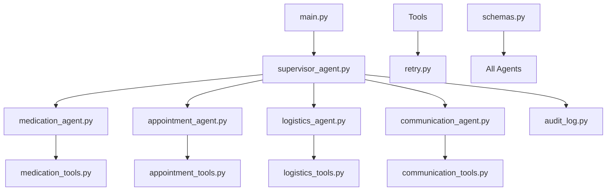
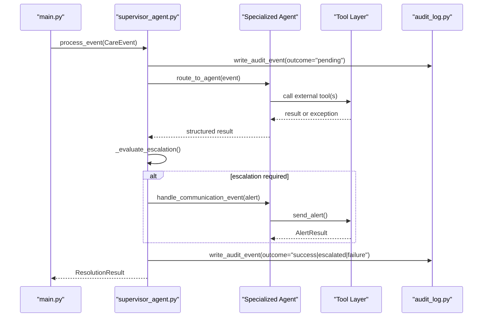
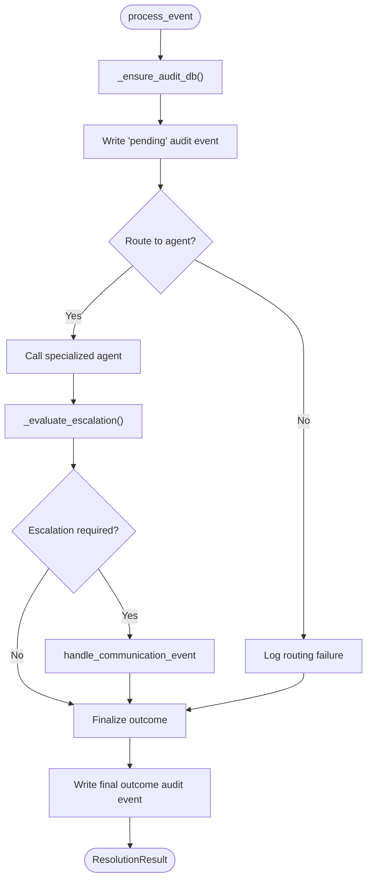
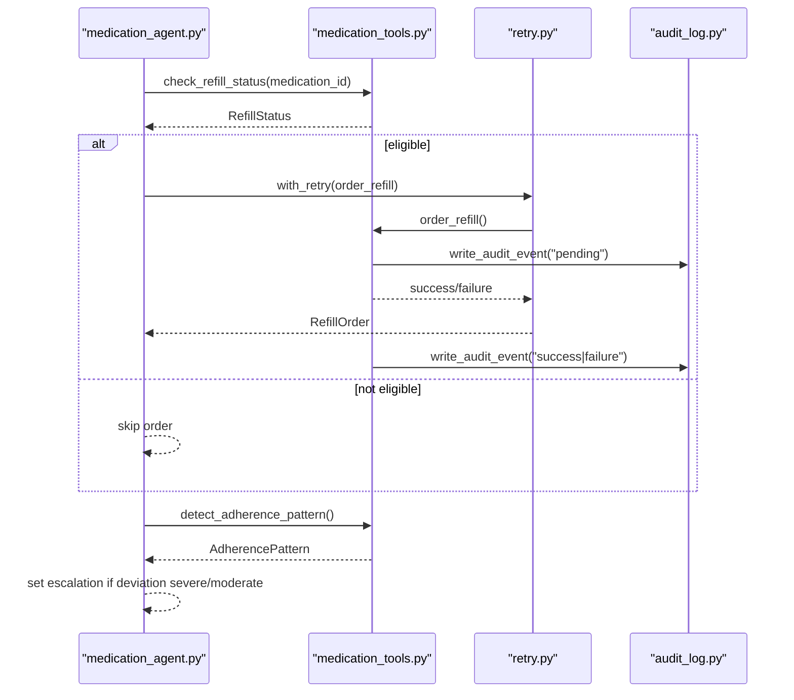
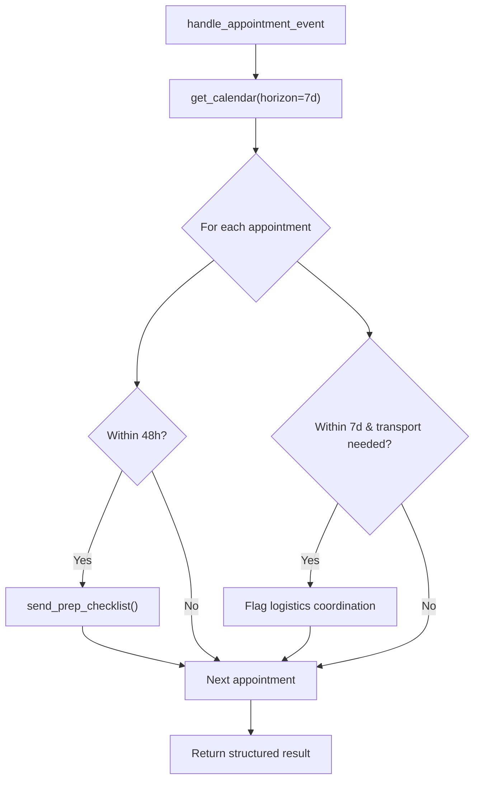
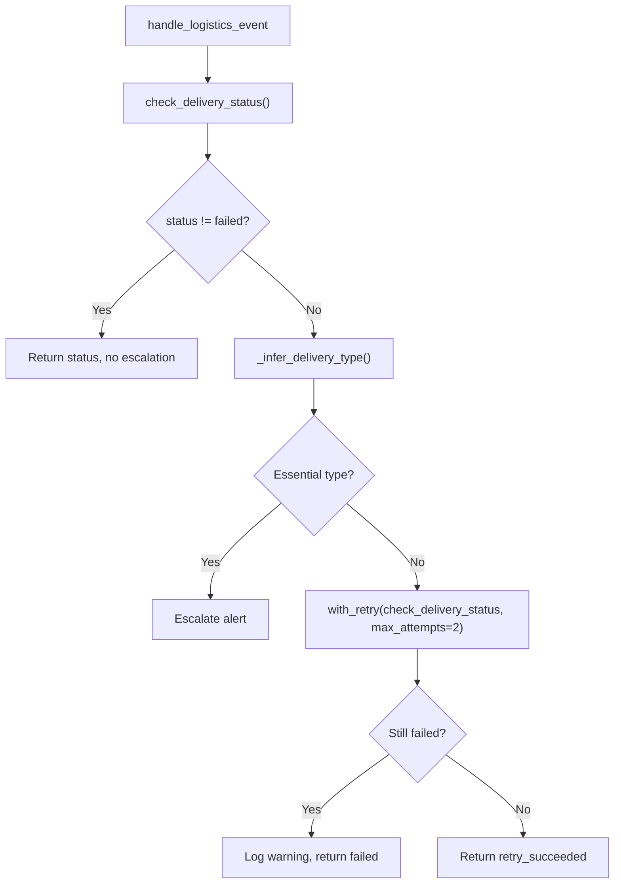
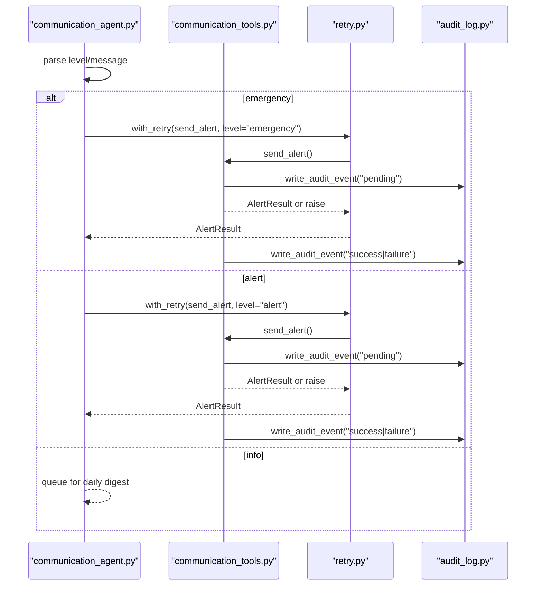
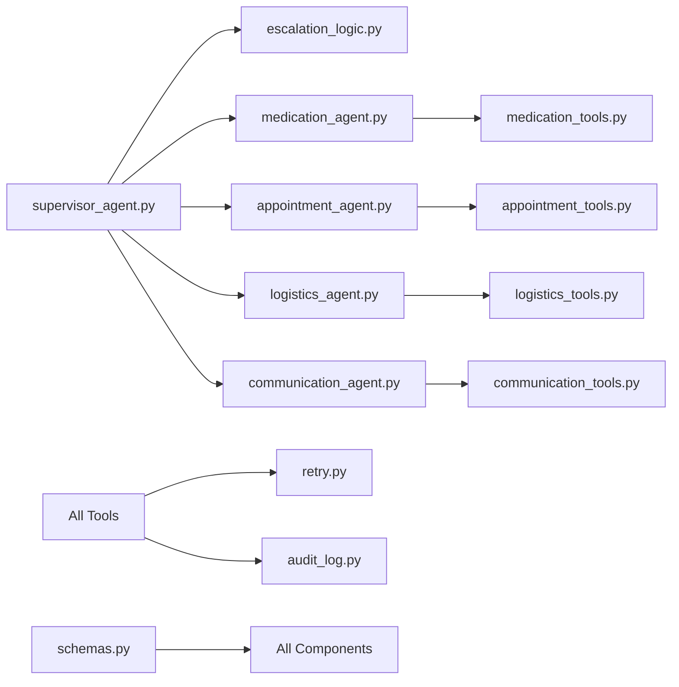

# Troubleshooting and FAQ

<cite>
**Referenced Files in This Document**
- [main.py](file://main.py)
- [audit_log.py](file://src/models/audit_log.py)
- [escalation_logic.py](file://src/models/escalation_logic.py)
- [retry.py](file://src/tools/retry.py)
- [supervisor_agent.py](file://src/agents/supervisor_agent.py)
- [medication_agent.py](file://src/agents/medication_agent.py)
- [appointment_agent.py](file://src/agents/appointment_agent.py)
- [logistics_agent.py](file://src/agents/logistics_agent.py)
- [communication_agent.py](file://src/agents/communication_agent.py)
- [medication_tools.py](file://src/tools/medication_tools.py)
- [appointment_tools.py](file://src/tools/appointment_tools.py)
- [logistics_tools.py](file://src/tools/logistics_tools.py)
- [communication_tools.py](file://src/tools/communication_tools.py)
- [schemas.py](file://src/models/schemas.py)
- [requirements.txt](file://requirements.txt)
</cite>

## Table of Contents
1. Introduction
2. Project Structure
3. Core Components
4. Architecture Overview
5. Detailed Component Analysis
6. Dependency Analysis
7. Performance Considerations
8. Troubleshooting Guide
9. Conclusion
10. Appendices

## Introduction
This document provides comprehensive troubleshooting guidance for CareBridge, focusing on diagnosing and resolving common issues during development and production. It covers:
- Debugging agent behavior using the immutable audit trail to trace decisions
- Resolving integration issues with external services (MCP server connectivity, API timeouts, retry failures)
- Performance troubleshooting (memory usage, database query performance, concurrent processing bottlenecks)
- Diagnosing escalation logic issues and agent routing problems
- Interpreting error messages and applying resolution steps
- Frequently asked questions about system behavior, configuration, and extensions
- Collecting diagnostics and reporting bugs effectively

## Project Structure
CareBridge is organized into agents, tools, models, and a main entry point that initializes logging, fixtures, and the supervisor orchestration. The immutable audit trail records every action before execution, enabling precise post-mortem analysis.

**Diagram sources**
- [main.py:1-182](file://main.py#L1-L182)
- [supervisor_agent.py:1-641](file://src/agents/supervisor_agent.py#L1-L641)
- [medication_agent.py:1-189](file://src/agents/medication_agent.py#L1-L189)
- [appointment_agent.py:1-173](file://src/agents/appointment_agent.py#L1-L173)
- [logistics_agent.py:1-236](file://src/agents/logistics_agent.py#L1-L236)
- [communication_agent.py:1-163](file://src/agents/communication_agent.py#L1-L163)
- [medication_tools.py:1-208](file://src/tools/medication_tools.py#L1-L208)
- [appointment_tools.py:1-242](file://src/tools/appointment_tools.py#L1-L242)
- [logistics_tools.py:1-220](file://src/tools/logistics_tools.py#L1-L220)
- [communication_tools.py:1-279](file://src/tools/communication_tools.py#L1-L279)
- [audit_log.py:1-167](file://src/models/audit_log.py#L1-L167)
- [retry.py:1-70](file://src/tools/retry.py#L1-L70)
- [schemas.py:1-150](file://src/models/schemas.py#L1-L150)

**Section sources**
- [main.py:1-182](file://main.py#L1-L182)
- [schemas.py:1-150](file://src/models/schemas.py#L1-L150)

## Core Components
- Supervisor Agent: Orchestrates events, routes to specialized agents, applies deterministic escalation rules, and writes immutable audit entries before actions.
- Specialized Agents: Medication, Appointment, Logistics, Communication — each encapsulates domain logic and integrates with tools.
- Tools: External integrations (pharmacy, calendar, delivery, messaging) wrapped with retry and audit-first patterns.
- Audit Trail: Immutable SQLite-backed log ensuring every action is recorded pre/post with correlation IDs.
- Escalation Logic: Pure function classifying actions as auto/alert/approve; emergency triggers escalate immediately.
- Retry Utility: Shared exponential backoff wrapper for resilient external calls.

Key responsibilities and failure points are mapped below to guide diagnosis.

**Section sources**
- [supervisor_agent.py:1-641](file://src/agents/supervisor_agent.py#L1-L641)
- [escalation_logic.py:1-71](file://src/models/escalation_logic.py#L1-L71)
- [audit_log.py:1-167](file://src/models/audit_log.py#L1-L167)
- [retry.py:1-70](file://src/tools/retry.py#L1-L70)

## Architecture Overview
The end-to-end flow starts at the main entry point, which initializes the audit DB, loads fixtures, creates the supervisor (with graceful fallback if Strands SDK unavailable), and processes demo events. Each event is routed deterministically, escalated via pure logic, and fully audited.

**Diagram sources**
- [main.py:92-177](file://main.py#L92-L177)
- [supervisor_agent.py:285-395](file://src/agents/supervisor_agent.py#L285-L395)
- [audit_log.py:81-130](file://src/models/audit_log.py#L81-L130)
- [communication_agent.py:28-115](file://src/agents/communication_agent.py#L28-L115)
- [communication_tools.py:54-157](file://src/tools/communication_tools.py#L54-L157)

## Detailed Component Analysis

### Supervisor Agent
- Responsibilities: Event routing, deterministic escalation, communication dispatch, approval re-execution, and audit-first lifecycle.
- Common issues:
  - Routing errors when event_type is not recognized.
  - Escalation misclassification due to unknown action types defaulting to approve.
  - Approval path failures when no automated route exists.
- Diagnostics:
  - Inspect audit events for “process_event” pending/failure outcomes.
  - Check escalation classification results by reviewing executed actions mapping.

**Diagram sources**
- [supervisor_agent.py:115-125](file://src/agents/supervisor_agent.py#L115-L125)
- [supervisor_agent.py:178-234](file://src/agents/supervisor_agent.py#L178-L234)
- [supervisor_agent.py:285-395](file://src/agents/supervisor_agent.py#L285-L395)

**Section sources**
- [supervisor_agent.py:67-104](file://src/agents/supervisor_agent.py#L67-L104)
- [supervisor_agent.py:148-175](file://src/agents/supervisor_agent.py#L148-L175)
- [supervisor_agent.py:178-234](file://src/agents/supervisor_agent.py#L178-L234)
- [supervisor_agent.py:285-395](file://src/agents/supervisor_agent.py#L285-L395)
- [supervisor_agent.py:432-592](file://src/agents/supervisor_agent.py#L432-L592)

### Medication Agent
- Responsibilities: Refill status checks, refill ordering with retries, adherence detection, escalation on failures/deviations.
- Common issues:
  - Missing medication_id in payload.
  - Refill order retries exhausted leading to alert escalation.
  - Adherence deviations flagged as moderate/severe requiring alerts.
- Diagnostics:
  - Review audit events for “order_refill” pending/success/failure sequences.
  - Validate fixture data integrity for medications.

**Diagram sources**
- [medication_agent.py:23-134](file://src/agents/medication_agent.py#L23-L134)
- [medication_agent.py:137-159](file://src/agents/medication_agent.py#L137-L159)
- [medication_tools.py:65-152](file://src/tools/medication_tools.py#L65-L152)
- [retry.py:22-69](file://src/tools/retry.py#L22-L69)
- [audit_log.py:81-130](file://src/models/audit_log.py#L81-L130)

**Section sources**
- [medication_agent.py:23-134](file://src/agents/medication_agent.py#L23-L134)
- [medication_agent.py:137-159](file://src/agents/medication_agent.py#L137-L159)
- [medication_tools.py:34-62](file://src/tools/medication_tools.py#L34-L62)
- [medication_tools.py:155-208](file://src/tools/medication_tools.py#L155-L208)

### Appointment Agent
- Responsibilities: Calendar retrieval, checklist dispatch, transportation flagging.
- Common issues:
  - No appointments found for recipient.
  - Checklist sending failures.
- Diagnostics:
  - Verify appointment fixtures and time windows.
  - Inspect logs for failed checklist sends.

**Diagram sources**
- [appointment_agent.py:74-172](file://src/agents/appointment_agent.py#L74-L172)
- [appointment_tools.py:39-80](file://src/tools/appointment_tools.py#L39-L80)
- [appointment_tools.py:203-242](file://src/tools/appointment_tools.py#L203-L242)

**Section sources**
- [appointment_agent.py:25-71](file://src/agents/appointment_agent.py#L25-L71)
- [appointment_agent.py:74-172](file://src/agents/appointment_agent.py#L74-L172)
- [appointment_tools.py:39-80](file://src/tools/appointment_tools.py#L39-L80)
- [appointment_tools.py:117-200](file://src/tools/appointment_tools.py#L117-L200)

### Logistics Agent
- Responsibilities: Delivery failure handling, essential vs non-essential escalation, retry attempts.
- Common issues:
  - Delivery not found.
  - Essential delivery failures require immediate escalation.
  - Non-essential retries exhausted without recovery.
- Diagnostics:
  - Check delivery history fixtures and inferred delivery type.
  - Review audit events for escalation and retry outcomes.

**Diagram sources**
- [logistics_agent.py:23-152](file://src/agents/logistics_agent.py#L23-L152)
- [logistics_agent.py:155-179](file://src/agents/logistics_agent.py#L155-L179)
- [logistics_agent.py:182-235](file://src/agents/logistics_agent.py#L182-L235)
- [retry.py:22-69](file://src/tools/retry.py#L22-L69)

**Section sources**
- [logistics_agent.py:23-152](file://src/agents/logistics_agent.py#L23-L152)
- [logistics_agent.py:155-179](file://src/agents/logistics_agent.py#L155-L179)
- [logistics_agent.py:182-235](file://src/agents/logistics_agent.py#L182-L235)

### Communication Agent
- Responsibilities: Family notifications across channels based on severity, daily digest queuing, status synthesis.
- Common issues:
  - Messaging API failures after retries.
  - Info-level events queued but not delivered immediately.
- Diagnostics:
  - Inspect logs/messages.log for sent targets and channels.
  - Review audit events for send_alert pending/success/failure.

**Diagram sources**
- [communication_agent.py:28-115](file://src/agents/communication_agent.py#L28-L115)
- [communication_agent.py:118-146](file://src/agents/communication_agent.py#L118-L146)
- [communication_tools.py:54-157](file://src/tools/communication_tools.py#L54-L157)
- [retry.py:22-69](file://src/tools/retry.py#L22-L69)
- [audit_log.py:81-130](file://src/models/audit_log.py#L81-L130)

**Section sources**
- [communication_agent.py:28-115](file://src/agents/communication_agent.py#L28-L115)
- [communication_agent.py:118-146](file://src/agents/communication_agent.py#L118-L146)
- [communication_tools.py:54-157](file://src/tools/communication_tools.py#L54-L157)
- [communication_tools.py:160-231](file://src/tools/communication_tools.py#L160-L231)

## Dependency Analysis
- Coupling:
  - Supervisor depends on all specialized agents and escalation logic.
  - Agents depend on tools for external interactions and on retry utilities.
  - Tools depend on fixtures and audit logging.
- Cohesion:
  - Each agent encapsulates domain-specific workflows.
  - Tools abstract external integrations with consistent retry and audit patterns.
- External dependencies:
  - Optional Strands SDK for LLM-based orchestration; falls back to deterministic routing.
  - Pydantic for schema validation.
  - Logging and SQLite for audit trail.

**Diagram sources**
- [supervisor_agent.py:1-641](file://src/agents/supervisor_agent.py#L1-L641)
- [escalation_logic.py:1-71](file://src/models/escalation_logic.py#L1-L71)
- [medication_agent.py:1-189](file://src/agents/medication_agent.py#L1-L189)
- [appointment_agent.py:1-173](file://src/agents/appointment_agent.py#L1-L173)
- [logistics_agent.py:1-236](file://src/agents/logistics_agent.py#L1-L236)
- [communication_agent.py:1-163](file://src/agents/communication_agent.py#L1-L163)
- [medication_tools.py:1-208](file://src/tools/medication_tools.py#L1-L208)
- [appointment_tools.py:1-242](file://src/tools/appointment_tools.py#L1-L242)
- [logistics_tools.py:1-220](file://src/tools/logistics_tools.py#L1-L220)
- [communication_tools.py:1-279](file://src/tools/communication_tools.py#L1-L279)
- [retry.py:1-70](file://src/tools/retry.py#L1-L70)
- [audit_log.py:1-167](file://src/models/audit_log.py#L1-L167)
- [schemas.py:1-150](file://src/models/schemas.py#L1-L150)

**Section sources**
- [requirements.txt:1-8](file://requirements.txt#L1-L8)
- [supervisor_agent.py:599-641](file://src/agents/supervisor_agent.py#L599-L641)

## Performance Considerations
- Memory usage:
  - Avoid loading large fixture files repeatedly; cache where appropriate.
  - Prefer streaming or pagination for large datasets in future MCP integrations.
- Database query performance:
  - Use indexes on timestamp, correlation_id, care_recipient_id for efficient queries.
  - Limit audit event queries by filtering on correlation_id or care_recipient_id.
- Concurrent processing:
  - Single-process orchestration in Day 1; ensure async handlers do not block.
  - Monitor retry loops for excessive delays; tune base_delay and max_attempts if necessary.
- External API latency:
  - Wrap all external calls with with_retry to mitigate transient failures.
  - Log detailed timing and error context for profiling.

[No sources needed since this section provides general guidance]

## Troubleshooting Guide

### Immutable Audit Trail Debugging
- Purpose: Trace decision-making and agent behavior through append-only events.
- Steps:
  - Initialize audit DB at startup.
  - For any issue, retrieve events filtered by correlation_id or care_recipient_id.
  - Inspect actor, action_type, rationale, outcome fields to reconstruct the sequence.
- Common findings:
  - Pending outcomes without follow-up indicate uncompleted actions.
  - Failure outcomes include rationale explaining the cause.

**Section sources**
- [audit_log.py:19-78](file://src/models/audit_log.py#L19-L78)
- [audit_log.py:81-130](file://src/models/audit_log.py#L81-L130)
- [audit_log.py:133-167](file://src/models/audit_log.py#L133-L167)
- [main.py:78-90](file://main.py#L78-L90)

### Integration Issues: MCP Server Connectivity
- Symptoms:
  - Tool calls fail with network errors or timeouts.
  - RetryExhausted exceptions raised after multiple attempts.
- Diagnosis:
  - Confirm MCP endpoints are reachable and credentials configured.
  - Check logs for specific error messages from tool layers.
  - Validate retry parameters (max_attempts, base_delay).
- Resolution:
  - Increase max_attempts or base_delay cautiously to accommodate slow servers.
  - Add circuit breaker or fallback paths for critical operations.
  - Ensure audit events capture both pending and failure states for traceability.

**Section sources**
- [retry.py:22-69](file://src/tools/retry.py#L22-L69)
- [medication_tools.py:65-152](file://src/tools/medication_tools.py#L65-L152)
- [appointment_tools.py:117-200](file://src/tools/appointment_tools.py#L117-L200)
- [logistics_tools.py:56-128](file://src/tools/logistics_tools.py#L56-L128)
- [communication_tools.py:54-157](file://src/tools/communication_tools.py#L54-L157)

### API Timeout Handling
- Behavior:
  - with_retry implements exponential backoff (1s, 2s, 4s) with configurable base_delay.
  - Exceptions propagate as RetryExhausted after exhausting attempts.
- Actions:
  - Tune retry parameters per service characteristics.
  - Instrument timeouts explicitly in tool implementations.
  - Log warnings on each retry attempt for observability.

**Section sources**
- [retry.py:22-69](file://src/tools/retry.py#L22-L69)
- [medication_agent.py:137-159](file://src/agents/medication_agent.py#L137-L159)
- [communication_agent.py:118-146](file://src/agents/communication_agent.py#L118-L146)

### Retry Mechanism Failures
- Indicators:
  - RetryExhausted exceptions with last_exception details.
  - Audit events showing repeated pending outcomes followed by failure.
- Remediation:
  - Investigate root cause from last_exception message.
  - Adjust retry strategy or implement idempotency keys for safe retries.
  - Ensure downstream services support retry semantics.

**Section sources**
- [retry.py:14-69](file://src/tools/retry.py#L14-L69)
- [medication_agent.py:90-99](file://src/agents/medication_agent.py#L90-L99)
- [communication_agent.py:67-75](file://src/agents/communication_agent.py#L67-L75)

### Performance Troubleshooting
- Memory:
  - Profile fixture loading and avoid redundant reads.
  - Use generators for large lists where possible.
- Database:
  - Query audit events with filters to reduce load.
  - Monitor SQLite file size and consider archival strategies.
- Concurrency:
  - Ensure async functions are awaited properly.
  - Avoid blocking I/O in async contexts.

**Section sources**
- [audit_log.py:133-167](file://src/models/audit_log.py#L133-L167)
- [communication_tools.py:160-231](file://src/tools/communication_tools.py#L160-L231)

### Escalation Logic Issues
- Symptoms:
  - Unexpected alerts or approvals.
  - Emergency triggers not escalating as expected.
- Diagnosis:
  - Review classify_action outputs for executed actions.
  - Check EMERGENCY_TRIGGERS presence in event payloads.
  - Validate agent_result escalation flags.
- Resolution:
  - Update escalation sets only via controlled changes aligned with policy.
  - Add logging for unknown action types to catch misconfigurations.

**Section sources**
- [escalation_logic.py:13-70](file://src/models/escalation_logic.py#L13-L70)
- [supervisor_agent.py:178-234](file://src/agents/supervisor_agent.py#L178-L234)

### Agent Routing Problems
- Symptoms:
  - Events not reaching intended agents.
  - ValueError indicating no route for event_type.
- Diagnosis:
  - Verify event_type values match allowed literals.
  - Check _route_to_agent mappings and _AGENT_EVENT_TYPES.
- Resolution:
  - Align incoming events with supported types.
  - Extend routing tables carefully with tests.

**Section sources**
- [supervisor_agent.py:259-278](file://src/agents/supervisor_agent.py#L259-L278)
- [schemas.py:56-61](file://src/models/schemas.py#L56-L61)

### Error Message Interpretations
- RetryExhausted: Indicates all retry attempts failed; inspect last_exception for root cause.
- ValueError in tools: Typically indicates missing IDs or invalid fixture data.
- RuntimeError in tools: External API failures after retries; check network and credentials.
- Audit outcomes:
  - pending: Action initiated but not completed.
  - success: Action completed successfully.
  - failure: Action failed; rationale explains cause.
  - escalated: Action triggered escalation workflow.

**Section sources**
- [retry.py:14-69](file://src/tools/retry.py#L14-L69)
- [medication_tools.py:34-62](file://src/tools/medication_tools.py#L34-L62)
- [appointment_tools.py:117-200](file://src/tools/appointment_tools.py#L117-L200)
- [logistics_tools.py:56-128](file://src/tools/logistics_tools.py#L56-L128)
- [communication_tools.py:54-157](file://src/tools/communication_tools.py#L54-L157)
- [audit_log.py:81-130](file://src/models/audit_log.py#L81-L130)

### FAQ
- How do I trace an event’s full lifecycle?
  - Use correlation_id from ResolutionResult to query audit events.
- Why am I seeing “unknown action type” warnings?
  - Unknown actions default to approve for safety; add them to escalation sets if appropriate.
- Can I disable retries?
  - Not recommended; adjust parameters instead to balance resilience and responsiveness.
- How do I extend the system with new agents?
  - Implement handler functions, register routes in supervisor, and define escalation classifications.
- Where are messages logged?
  - Application logs in logs/carebridge.log; message deliveries in logs/messages.log.

**Section sources**
- [supervisor_agent.py:285-395](file://src/agents/supervisor_agent.py#L285-L395)
- [escalation_logic.py:42-70](file://src/models/escalation_logic.py#L42-L70)
- [communication_tools.py:42-51](file://src/tools/communication_tools.py#L42-L51)
- [main.py:19-31](file://main.py#L19-L31)

### Collecting Diagnostics and Reporting Bugs
- Gather:
  - logs/carebridge.log for application events.
  - logs/messages.log for outbound communications.
  - audit.db for immutable audit trail.
  - Correlation IDs from ResolutionResult for targeted queries.
- Report:
  - Include environment details (Python version, dependencies).
  - Provide minimal reproducible scenario with CareEvent payload.
  - Attach relevant audit events filtered by correlation_id.

**Section sources**
- [main.py:19-31](file://main.py#L19-L31)
- [audit_log.py:133-167](file://src/models/audit_log.py#L133-L167)
- [communication_tools.py:42-51](file://src/tools/communication_tools.py#L42-L51)

## Conclusion
CareBridge’s design emphasizes deterministic routing, immutable auditing, and resilient integration patterns. Effective troubleshooting relies on leveraging the audit trail, understanding escalation logic, and systematically diagnosing integration and performance issues. By following the procedures outlined here, developers and operators can quickly identify root causes and apply targeted resolutions.

[No sources needed since this section summarizes without analyzing specific files]

## Appendices

### Appendix A: Key Entry Points and APIs
- Main entry point initializes system and runs demo scenarios.
- Supervisor public APIs: process_event, query_status, approve_pending_action.
- Tools provide domain-specific operations with retry and audit-first patterns.

**Section sources**
- [main.py:92-177](file://main.py#L92-L177)
- [supervisor_agent.py:285-429](file://src/agents/supervisor_agent.py#L285-L429)
- [supervisor_agent.py:432-592](file://src/agents/supervisor_agent.py#L432-L592)

### Appendix B: Data Models Reference
- Schemas define strict contracts for events, results, and domain entities.
- Use these models consistently across agents and tools to ensure compatibility.

**Section sources**
- [schemas.py:13-149](file://src/models/schemas.py#L13-L149)