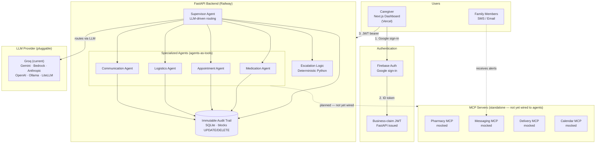

# CareBridge

**AI-powered care coordination for aging in place — one Supervisor, four specialist agents, real LLM routing.**

---

## What Is Real vs Simulated

| Component | Status |
|---|---|
| Multi-agent orchestration (Supervisor + 4 specialists) | ✅ Real — live Strands agents |
| LLM routing | ✅ Real — Groq `gpt-oss-120b` (provider-agnostic) |
| Deterministic safety policy | ✅ Real — Python, testable, LLM cannot override |
| Immutable audit trail | ✅ Real — SQLite triggers block UPDATE/DELETE |
| Google sign-in (Firebase) | ✅ Real — production Firebase project |
| FastAPI backend + JWT + RBAC | ✅ Real — deployed on Railway |
| Next.js dashboard | ✅ Real — deployed on Vercel |
| **Pharmacy API** | ⚠️ **Simulated** — commercial contract required |
| **Delivery API** | ⚠️ **Simulated** — commercial contract required |
| **Twilio SMS** | ⚠️ **Simulated** — trial credentials ready, 1-file swap |
| **Google Calendar** | ⚠️ **Simulated** — OAuth ready, 1-file swap |

**The differentiator is not the healthcare idea. It is this:**
The LLM decides *who should act*. Deterministic Python decides *what the 
system is allowed to do*. Every action is written to an immutable audit 
trail before execution. The AI has authority to route. It does not have 
authority to override safety.

---

## Live Demo

| Component | URL |
|---|---|
| **Frontend** | https://care-bridge-sable-one.vercel.app |
| **Backend API** | https://carebridge-production-4bd1.up.railway.app |
| **API Docs** | https://carebridge-production-4bd1.up.railway.app/docs |

**Demo access:** Open the login page and click **"Try as demo caregiver"** — no account required.

---

## The Problem

10,000 Americans turn 65 every day. 90% of older adults want to age in place, but family coordination is a massive burden. Nearly 1 in 4 Americans is now a family caregiver — a 45% increase since 2015 — spending an average of 27 hours per week on care coordination. Medication adherence among elderly patients with chronic disease is only 40.26%, and non-adherence costs health systems approximately €2B/year. Existing solutions are fragmented silos: medication apps, calendar apps, grocery apps, and messaging apps don't talk to each other. No single system owns the end-to-end coordination workflow.

---

## What It Does

CareBridge is the coordination layer that owns the workflow end-to-end. Five AI agents work together:

- **Supervisor Agent** — orchestrates all tasks, routes events to the right specialist, applies deterministic escalation logic, maintains an immutable audit trail. Never calls external APIs directly.
- **Medication Agent** — monitors medication adherence, triggers pharmacy refills, detects adherence pattern deviations.
- **Appointment Agent** — manages provider calendars, coordinates transportation, sends preparation checklists.
- **Logistics Agent** — coordinates grocery and pharmacy deliveries, monitors delivery confirmation.
- **Communication Agent** — generates proactive family updates, handles two-way queries, respects per-member notification preferences.

The Supervisor uses a real LLM (configurable: Gemini, Groq, Bedrock, Anthropic, OpenAI, Ollama, or LiteLLM) to read incoming care events and decide which specialist to invoke. Escalation classification is **deterministic Python** — never delegated to the LLM — because safety-critical decisions must be auditable and immune to prompt injection.

---

## Architecture



The Supervisor wraps each specialist as a Strands agents-as-tools callable. The LLM reads the event and decides which specialist to invoke — no custom routing code. Every action writes to the immutable audit trail BEFORE execution. SQLite triggers prevent UPDATE/DELETE on audit events.

---

## Tech Stack

| Layer | Technology | Notes |
|---|---|---|
| **Agent Framework** | Strands Agents SDK (Python) | Agents-as-tools pattern |
| **Backend** | FastAPI + Uvicorn | REST API, JWT auth, rate limiting |
| **Frontend** | Next.js 15, React 19, Tailwind CSS 4 | App Router, TanStack Query |
| **LLM** | Provider-agnostic | Groq (current deployment), Gemini, Bedrock, Anthropic, OpenAI, Ollama, LiteLLM |
| **MCP** | Qoder Agent SDK | Standalone servers for pharmacy, messaging, delivery, calendar. Strands Supervisor uses direct tools; native MCP integration is on the roadmap. |
| **Auth** | Firebase Auth + FastAPI JWT | Google sign-in → Firebase ID token → business-claim JWT |
| **Storage (dev)** | SQLite | audit.db (immutable), auth.db (users) |
| **Storage (prod)** | SQLite (current) | PostgreSQL migration path documented in docs/PRODUCTION-UPGRADE.md |
| **Deployment** | Railway (backend) + Vercel (frontend) | Docker image for backend |
| **Testing** | pytest + pytest-asyncio | 177 tests |

---

## How It Works — End to End

1. **Caregiver signs in** with Google via Firebase Auth on the Next.js dashboard.
2. **Backend verifies** the Firebase ID token via the Admin SDK (`firebase-admin`).
3. **Backend issues** a business-claim JWT (access + refresh tokens) with `user_id`, `role`, and `care_recipient_id`.
4. **Dashboard calls** `/query` or `/care-recipients/me/*` endpoints with the JWT bearer token.
5. **Supervisor Agent** receives the care event and reads it with the configured LLM.
6. **LLM routes** to the correct specialist agent (Medication, Appointment, Logistics, or Communication) — the model decides, not conditional code.
7. **Specialist executes** its tools (direct Python tool functions; MCP servers 
   exist standalone but are not yet wired into the Strands runtime), writes 
   'before action' audit events.
8. **Response returns** to the caregiver with the synthesized result.
9. **Every step** is logged to the immutable audit trail — before and after execution, with rationale, outcome, and correlation ID.

If the LLM is unavailable, the Supervisor degrades to deterministic fallback routing — the system never stops working.

---

## Running Locally

```bash
# 1. Clone the repository
git clone https://github.com/infamous-rebel/CareBridge.git
cd carebridge

# 2. Create a Python 3.11+ virtual environment
python3 -m venv .venv
source .venv/bin/activate  # Windows: .venv\Scripts\activate

# 3. Install dependencies
pip install -r requirements.txt

# 4. Configure environment
cp .env.example .env
# Edit .env: set LLM_PROVIDER and the corresponding API key
# Free options: Gemini (rate-limited) or Groq (recommended)

# 5. Run the demo scenario
python main.py

# 6. Start the API server
uvicorn src.api.main:app --host 0.0.0.0 --port 8000

# 7. Start the frontend (separate terminal)
cd src/ui
npm install
cp .env.local.example .env.local
# Edit .env.local with your Firebase project credentials
npm run dev
```

The API is at `http://localhost:8000` (docs at `/docs`). The dashboard is at `http://localhost:3000`.

---

## Running with Docker

```bash
cp .env.example .env   # edit secrets
docker compose up --build
```

The API is exposed on `http://localhost:8000`. The image is a multi-stage build: builder compiles wheels, runtime uses `python:3.12-slim` with a non-root user. Health check hits `/health` every 30s.

---

## Deployment

### Backend → Railway

1. Create a new Railway project, connect the GitHub repo.
2. Set the start command: `uvicorn src.api.main:app --host 0.0.0.0 --port $PORT`
3. Add environment variables (see [Configuration](#configuration) below).
4. Set `AUDIT_DB_PATH=/tmp/audit.db` (Railway containers are read-only).
5. Deploy. Railway auto-assigns a domain.

### Frontend → Vercel

1. Import the GitHub repo in Vercel.
2. Set **Root Directory** to `src/ui`.
3. Add environment variables (all `NEXT_PUBLIC_*` — see below).
4. Deploy.

See [docs/DEPLOYMENT.md](docs/DEPLOYMENT.md) for the full runbook with all 18 backend vars and 8 frontend vars.

---

## Configuration

### Backend (.env)

| Variable | Purpose | Required |
|---|---|---|
| `LLM_PROVIDER` | LLM provider: `gemini`, `groq`, `bedrock`, `anthropic`, `openai`, `ollama`, `litellm` | Yes (default: `groq`) |
| `GEMINI_API_KEY` | Google Gemini API key | When provider=gemini |
| `GROQ_API_KEY` | Groq API key | When provider=groq |
| `ANTHROPIC_API_KEY` | Anthropic API key | When provider=anthropic |
| `OPENAI_API_KEY` | OpenAI API key | When provider=openai |
| `AWS_ACCESS_KEY_ID` | AWS credentials | When provider=bedrock |
| `JWT_SECRET_KEY` | JWT signing secret (≥32 bytes) | Yes (auto in DEMO_MODE) |
| `DEMO_MODE` | Seed demo user, relax secret guards | Default: `true` |
| `CORS_ORIGINS` | Comma-separated allowed origins | Yes |
| `FIREBASE_AUTH_ENABLED` | Enable Firebase Auth flow | Default: `false` |
| `FIREBASE_PROJECT_ID` | Firebase project ID | When Firebase enabled |
| `FIREBASE_CREDENTIALS_B64` | Base64-encoded service account JSON | When Firebase enabled (cloud) |
| `AUDIT_DB_PATH` | Path to SQLite audit DB | Default: `./audit.db` |
| `AUTH_DB_PATH` | Path to SQLite users DB | Default: `auth.db` |
| `ENVIRONMENT` | `development` or `production` | Default: `development` |
| `AUTH_RATE_LIMIT` | Rate limit for auth endpoints | Default: `60/minute` |
| `GLOBAL_RATE_LIMIT` | Global rate limit | Default: `300/minute` |
| `LOG_LEVEL` | Logging level | Default: `INFO` |

### Frontend (src/ui/.env.local)

| Variable | Purpose |
|---|---|
| `NEXT_PUBLIC_FIREBASE_API_KEY` | Firebase web API key |
| `NEXT_PUBLIC_FIREBASE_AUTH_DOMAIN` | Firebase auth domain |
| `NEXT_PUBLIC_FIREBASE_PROJECT_ID` | Firebase project ID |
| `NEXT_PUBLIC_FIREBASE_STORAGE_BUCKET` | Firebase storage bucket |
| `NEXT_PUBLIC_FIREBASE_MESSAGING_SENDER_ID` | Firebase messaging sender |
| `NEXT_PUBLIC_FIREBASE_APP_ID` | Firebase app ID |
| `NEXT_PUBLIC_DEMO_MODE` | Show demo credentials on login |
| `NEXT_PUBLIC_API_URL` | Backend API base URL |

---

## LLM Providers

CareBridge is **provider-agnostic**. One environment variable (`LLM_PROVIDER`) selects the model. Switching providers requires no code change, no rebuild — just an env var update and restart.

| Provider | Env Var | Model Var | Notes |
|---|---|---|---|
| **Google Gemini** | `GEMINI_API_KEY` | `GEMINI_MODEL` | Free tier available (rate-limited). |
| **Groq** | `GROQ_API_KEY` | `GROQ_MODEL` | Fast, free tier. OpenAI-compatible. |
| **Amazon Bedrock** | AWS credentials | `BEDROCK_MODEL_ID` | No API key; uses boto3. |
| **Anthropic** | `ANTHROPIC_API_KEY` | `ANTHROPIC_MODEL` | Direct API. |
| **OpenAI** | `OPENAI_API_KEY` | `OPENAI_MODEL` | GPT-4o-mini, etc. |
| **Ollama** | Nothing (local) | `OLLAMA_MODEL` | Fully local. No data leaves. |
| **LiteLLM** | Per-provider | `LITELLM_MODEL` | Universal adapter. |

If the selected provider's credential is missing, the app **still starts** — `/health` and `/ready` keep working. The Supervisor degrades to deterministic fallback routing, and LLM-dependent routes return 503 with a clear reason.

---

## Testing

```bash
# Run all tests
pytest tests/ -v

# Run with coverage report
pytest tests/ -v --tb=short
```

**177 tests** covering:

- **Unit tests** — every tool function (medication, appointment, logistics, communication)
- **Agent tests** — each agent's happy path + failure path
- **Supervisor tests** — routing, escalation classification, audit trail
- **Integration tests** — end-to-end refill flow, escalation flow, approval flow
- **API tests** — health, auth, CRUD, audit, approvals, rate limiting, middleware, Firebase auth
- **LLM routing tests** — provider selection, fallback degradation, cache reset

All tests run hermetically: no network calls, no real LLM credentials, temp audit DBs per test.

---

## API Reference

| Method | Path | Purpose |
|---|---|---|
| `GET` | `/health` | Liveness probe (public) |
| `GET` | `/ready` | Readiness probe — audit DB, MCP registry, LLM status (public) |
| `GET` | `/version` | Build metadata (public) |
| `POST` | `/auth/login` | Exchange credentials for JWT pair |
| `POST` | `/auth/refresh` | Refresh an access token |
| `GET` | `/auth/me` | Current authenticated user |
| `GET` | `/auth/firebase/config` | Firebase Auth config (public) |
| `POST` | `/auth/firebase/exchange` | Exchange Firebase ID token for JWTs |
| `POST` | `/auth/firebase/verify` | Verify Firebase ID token |
| `GET` | `/status/{care_recipient_id}` | Synthesized care status summary |
| `POST` | `/query` | Natural-language caregiver Q&A |
| `GET` | `/alerts` | Recent alert events feed |
| `POST` | `/alerts/{alert_id}/ack` | Acknowledge an alert |
| `GET` | `/approvals` | Pending approval queue |
| `POST` | `/approvals/{action_id}/approve` | Approve a pending action |
| `POST` | `/approvals/{action_id}/reject` | Reject a pending action |
| `GET` | `/audit` | Paginated, filterable audit trail |
| `GET` | `/medications/{care_recipient_id}` | List medications (fixture data) |
| `GET` | `/care-recipients/me/medications` | List medications (CRUD, DB-backed) |
| `POST` | `/care-recipients/me/medications` | Create medication |
| `GET` | `/care-recipients/me/medications/{id}` | Get medication |
| `PUT` | `/care-recipients/me/medications/{id}` | Update medication |
| `DELETE` | `/care-recipients/me/medications/{id}` | Soft-delete medication |
| `GET` | `/appointments/{care_recipient_id}` | List appointments (fixture data) |
| `GET` | `/care-recipients/me/appointments` | List appointments (CRUD, DB-backed) |
| `POST` | `/care-recipients/me/appointments` | Create appointment |
| `GET` | `/care-recipients/me/appointments/{id}` | Get appointment |
| `PUT` | `/care-recipients/me/appointments/{id}` | Update appointment |
| `POST` | `/care-recipients/me/appointments/{id}/cancel` | Cancel appointment |
| `GET` | `/deliveries/{care_recipient_id}` | List deliveries (fixture data) |
| `GET` | `/settings/me` | Get user settings |
| `PUT` | `/settings/me` | Update user settings |
| `GET` | `/mcp/servers` | MCP registry introspection |

Full details: [docs/API.md](docs/API.md)

---

## MCP Servers

| Server | Transport | Tools | State |
|---|---|---|---|
| **Pharmacy** | In-process SDK | `check_refill_status`, `order_refill`, `get_medication_schedule` | **Mocked** — JSON fixtures, 10% simulated timeout on `order_refill` |
| **Messaging** | In-process SDK | `send_sms`, `send_email` | **Mocked** — logs to `logs/messages.log`, returns synthetic receipts |
| **Delivery** | In-process SDK | `check_delivery_status`, `order_grocery`, `order_pharmacy_delivery` | **Mocked** — JSON fixtures, 15% simulated failure rate |
| **Calendar** | In-process SDK | `get_calendar`, `schedule_appointment` | **Mocked** — JSON fixtures |

The four servers are standalone in-process MCP modules built with the Qoder Agent SDK. They register their tools and pass the existing test suite, but the Strands Supervisor currently calls the underlying Python tool functions directly — native MCP wiring into the Strands runtime is on the roadmap. All audit writes happen inside the tool functions. Mock data comes from `fixtures/*.json`.

See [docs/PRODUCTION-UPGRADE.md](docs/PRODUCTION-UPGRADE.md) for the path to real integrations.

---

## Production Upgrade Path

CareBridge ships with mocked integrations that exercise the full agent pipeline. Upgrading to live services:

| Upgrade | Current State | What's Needed | Effort |
|---|---|---|---|
| **Twilio SMS** | Mock logger → `logs/messages.log` | `TWILIO_ACCOUNT_SID`, `TWILIO_AUTH_TOKEN`, `TWILIO_FROM` (~60 trial credits) | ~2 hours |
| **Google Calendar** | Mock fixtures | OAuth flow with `calendar.app.created` scope (no verification needed, ~100 credits) | ~4 hours |
| **Real Pharmacy** | Mock fixtures | Surescript or Walgreens API contract | Contract-dependent |
| **Real Delivery** | Mock fixtures | Instacart or DoorDash API contract | Contract-dependent |
| **Persistent Storage** | SQLite (ephemeral) | Railway volume or PostgreSQL via `DATABASE_URL` | ~1 hour |
| **HIPAA Hosting** | Railway (general) | AWS Bedrock AgentCore with BAA | Architecture-dependent |

Detailed guides: [docs/PRODUCTION-UPGRADE.md](docs/PRODUCTION-UPGRADE.md)

---

## Security

- **JWT Auth** — all caregiver-facing API endpoints require a valid bearer token. Access tokens expire in 15 minutes; refresh tokens in 7 days.
- **Firebase Auth** — Google sign-in verified server-side via `firebase-admin` Admin SDK. Backend issues business-claim JWTs with `role` and `care_recipient_id`.
- **RBAC** — role-based access control: `caregiver_primary`, `caregiver_secondary`, `viewer`. Only caregivers can approve/reject actions.
- **Rate Limiting** — `slowapi` limiter: 60/min on auth endpoints, 300/min global. Configurable via env vars.
- **CORS** — configurable allowed origins via `CORS_ORIGINS`. Credentials allowed.
- **Immutable Audit Trail** — SQLite triggers prevent UPDATE and DELETE on audit events. Every agent action writes BEFORE execution. Malformed rows can never be deleted.
- **PII Protection** — names, addresses, phone numbers never appear in logs or audit events. Only identifiers are referenced.
- **Request Size Cap** — configurable `MAX_REQUEST_BYTES` (default 1MB).
- **No Secret Leakage** — `.env` never committed. Stack traces never leaked in error responses.

---

## License

MIT

---

## Built For

**Agents for Humans Hackathon** — September 2026

Track: Everyday Agents
