# CareBridge System Architecture

**Last updated:** 2026-09-11
**Version:** 1.0
**Framework:** Strands Agents SDK (Python) + Qoder MCP + Qoder Cloud Agents
**Companion documents:** `SPEC.md` (functional spec), `AGENTS.md` (agent boundary rules)

---

## 1. HIGH-LEVEL ARCHITECTURE

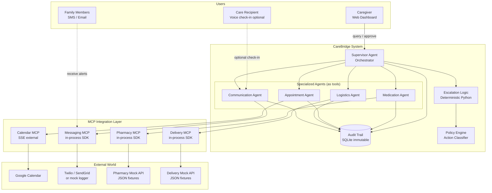

---

## 2. AGENT-AS-TOOLS PATTERN

CareBridge uses the Strands Agents SDK's native **agents-as-tools** pattern. The Supervisor Agent holds instances of the four specialized agents in its `tools=[]` list. When the Supervisor's LLM decides to delegate, Strands automatically wraps the target agent as a callable tool — no custom routing code required.

### 2.1 Happy Path Sequence — Low Refill Detected

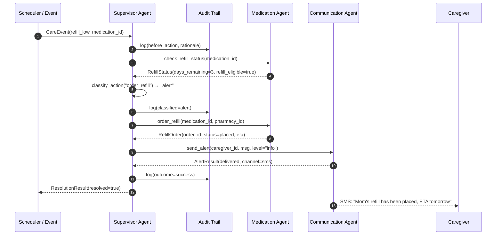

### 2.2 Why This Pattern

- No custom routing code — Strands handles dispatch via the LLM
- Each specialized agent has its own LLM call and tool scope
- Supervisor context stays small (only sees agent outputs, not internal tool calls)
- Enables parallel execution when multiple agents are needed for one event
- Enables independent testing of each specialized agent

---

## 3. DATA FLOWS

### 3.1 Happy Path — Low Refill → Refill Ordered → Family Notified

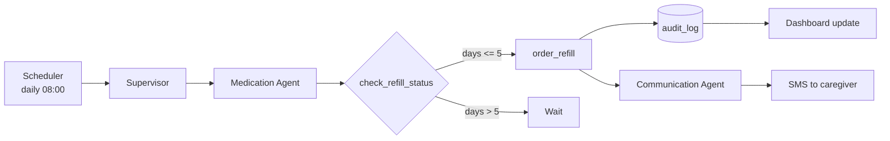

### 3.2 Exception Path — Order Failure

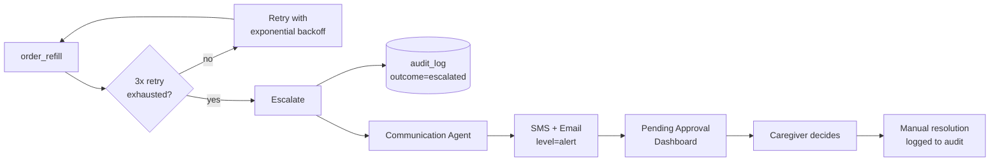

### 3.3 Escalation Path — Adherence Deviation

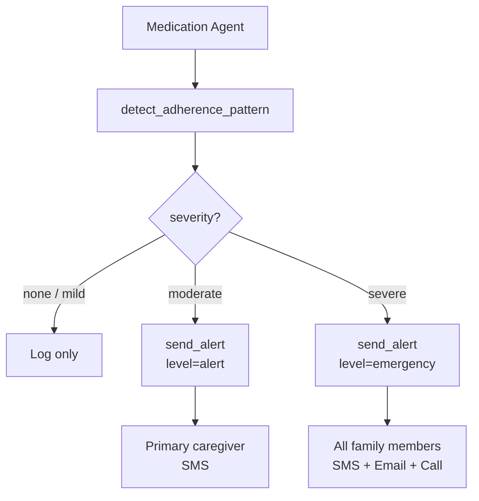

---

## 4. AGENT INTERACTION MODEL

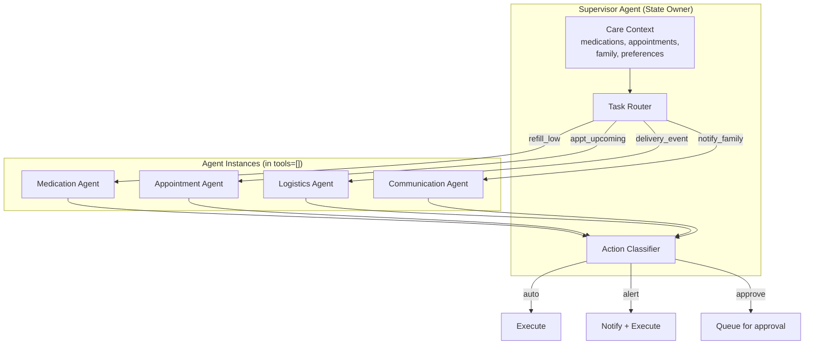

**Interaction rules (enforced by `AGENTS.md`):**

- Specialized agents NEVER call each other directly.
- All cross-agent coordination passes through the Supervisor.
- Supervisor never calls external APIs directly — only via agents.
- Every agent action is classified by the Policy Engine BEFORE execution.
- Every action is written to the audit trail BEFORE execution.

---

## 5. MCP INTEGRATION ARCHITECTURE

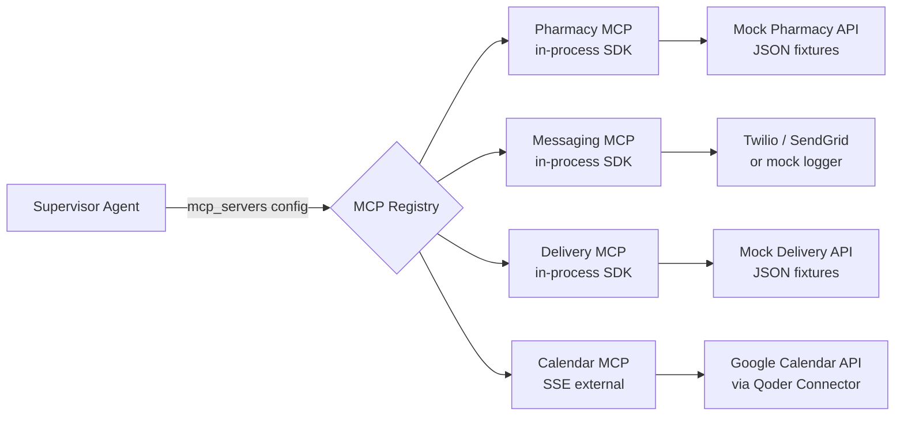

**Transport rationale:**

| Server | Transport | Why |
|---|---|---|
| Pharmacy | In-process SDK | Custom tools, zero subprocess overhead |
| Messaging | In-process SDK | Custom tools, direct host state access |
| Delivery | In-process SDK | Custom tools, zero subprocess overhead |
| Calendar | SSE external | Qoder Connector already provides it |

**In-process MCP benefits:**

- No subprocess lifecycle management
- Direct access to shared Python state (e.g., audit log connection)
- Faster startup (no MCP handshake)
- Simpler debugging (single process)

**Qoder MCP configuration (`mcp_config.json`):**

```json
{
  "mcpServers": {
    "pharmacy":  { "type": "sdk" },
    "messaging": { "type": "sdk" },
    "delivery":  { "type": "sdk" },
    "calendar":  {
      "type": "sse",
      "url": "https://mcp.carebridge.dev/calendar",
      "headers": { "Authorization": "Bearer ${CALENDAR_TOKEN}" }
    }
  }
}
```

---

## 6. DATA MODEL (Entity Relationships)

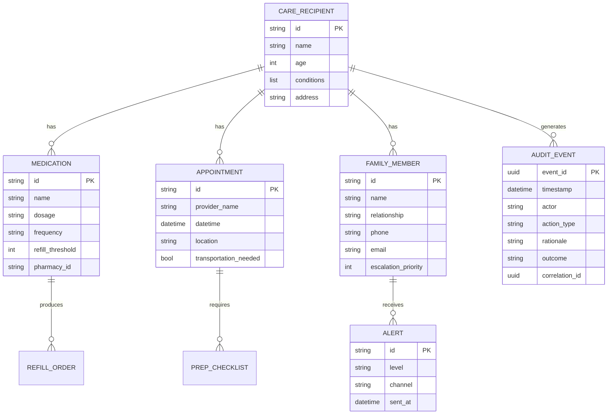

---

## 7. DEPLOYMENT ARCHITECTURE

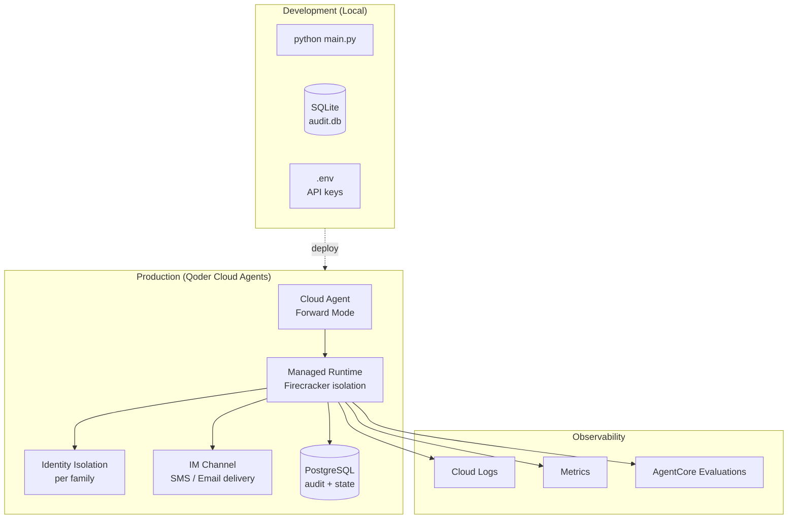

**Deployment path:**

1. **Local dev:** `python main.py` → SQLite audit trail → mock MCP servers
2. **Staging:** Cloud Agents with test family → PostgreSQL → real MCP connectors
3. **Production:** Cloud Agents with identity isolation → real pharmacy / calendar / messaging

**For the hackathon:** Local dev + Cloud Agents deploy (even without real external APIs).

---

## 8. SECURITY & AUTHORIZATION MODEL

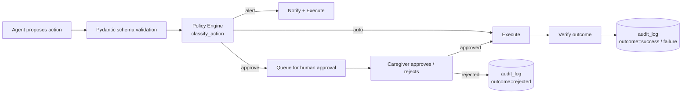

**Authorization layers:**

1. **Schema validation** — every agent action must conform to a Pydantic model
2. **Policy classification** — deterministic Python (NOT LLM)
3. **Human approval gate** — for destructive or clinical actions
4. **Audit-before-action** — write to audit log BEFORE executing
5. **Outcome verification** — confirm the action actually succeeded
6. **Immutable audit** — SQLite triggers prevent UPDATE / DELETE

---

## 9. FAILURE RECOVERY

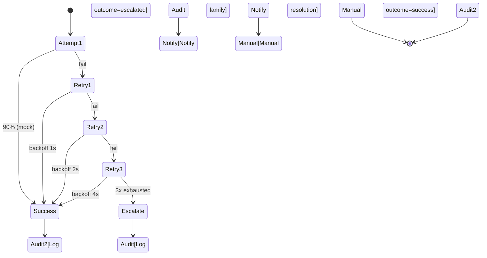

**Failure rules:**

- Retry 3× with exponential backoff (1s, 2s, 4s)
- After 3 failures: escalate with `level="alert"` to primary caregiver
- Never silently fail — every failure logged + communicated
- Every integration has a documented fallback plan

---

## 10. DIRECTORY STRUCTURE

```
carebridge/
├── AGENTS.md                     # architecture rules (Qoder reads on every session)
├── SPEC.md                       # functional spec
├── architecture.md               # this document
├── README.md                     # setup + demo instructions
├── main.py                       # entry point
├── requirements.txt
├── .env.example
├── .gitignore
├── mcp_config.json               # MCP server registry
├── src/
│   ├── agents/
│   │   ├── __init__.py
│   │   ├── supervisor_agent.py
│   │   ├── medication_agent.py
│   │   ├── appointment_agent.py
│   │   ├── logistics_agent.py
│   │   └── communication_agent.py
│   ├── tools/
│   │   ├── __init__.py
│   │   ├── medication_tools.py
│   │   ├── appointment_tools.py
│   │   ├── logistics_tools.py
│   │   └── communication_tools.py
│   ├── models/
│   │   ├── __init__.py
│   │   ├── schemas.py            # Pydantic models
│   │   ├── audit_log.py          # IMMUTABLE audit trail
│   │   └── escalation_logic.py   # deterministic classifier
│   ├── mcp/
│   │   ├── __init__.py
│   │   ├── pharmacy_server.py
│   │   ├── messaging_server.py
│   │   ├── delivery_server.py
│   │   └── calendar_server.py
│   └── ui/
│       ├── package.json
│       ├── app/
│       │   ├── page.tsx          # caregiver dashboard
│       │   ├── alerts/page.tsx
│       │   ├── approvals/page.tsx
│       │   └── audit/page.tsx
│       └── components/
│           ├── CareStatusCard.tsx
│           ├── AlertFeed.tsx
│           ├── ApprovalQueue.tsx
│           └── AuditTrail.tsx
├── tests/
│   ├── __init__.py
│   ├── test_medication_agent.py
│   ├── test_appointment_agent.py
│   ├── test_logistics_agent.py
│   ├── test_communication_agent.py
│   ├── test_supervisor.py
│   └── integration/
│       ├── test_refill_flow.py
│       ├── test_escalation_flow.py
│       └── test_approval_flow.py
├── fixtures/
│   ├── medications.json
│   ├── appointments.json
│   ├── family_members.json
│   └── delivery_history.json
└── logs/
    ├── messages.log
    └── audit.db
```

---

## 11. TECHNOLOGY STACK

| Layer | Technology | Rationale |
|---|---|---|
| Agent framework | Strands Agents SDK (Python) | Native agents-as-tools pattern |
| Model | Claude Sonnet via Amazon Bedrock | Best reasoning for care coordination |
| MCP | Qoder MCP SDK (in-process + SSE) | Zero subprocess overhead for custom tools |
| Storage (dev) | SQLite | Zero-config, fast setup |
| Storage (prod) | PostgreSQL (Supabase) | Production-grade, HIPAA-ready |
| Frontend | React / Next.js 15 | Fast dashboard, server components |
| Deployment | Qoder Cloud Agents (Forward Mode) | Fastest path to live demo |
| Testing | pytest + pytest-asyncio | Standard Python testing |

---

## 12. DEPLOYMENT CHECKLIST

- [ ] `python main.py` runs locally without errors
- [ ] Audit trail database created and writable
- [ ] All 4 MCP servers registered in `mcp_config.json`
- [ ] Caregiver dashboard loads at `http://localhost:3000`
- [ ] End-to-end refill flow works (detect → order → alert → approve)
- [ ] Cloud Agents deployment succeeds
- [ ] Environment variables set (`.env` not committed to repo)
- [ ] README complete with setup steps
- [ ] Demo video recorded and uploaded
- [ ] AWS Builder Center blog post published

---

## 13. ARCHITECTURAL DECISIONS (ADRs)

### ADR-001: Agents-as-Tools over Multi-Agent Chat

**Decision:** Use Strands Agents SDK's agents-as-tools pattern instead of a free-form multi-agent chat.

**Reason:** Deterministic routing, smaller context windows per agent, independent testing, and clear ownership boundaries. A free-form multi-agent chat has unpredictable routing and higher hallucination risk — unacceptable for care coordination.

### ADR-002: In-Process MCP for Custom Tools

**Decision:** Pharmacy, Messaging, and Delivery MCP servers run in-process. Only Calendar runs externally via SSE.

**Reason:** In-process MCP eliminates subprocess lifecycle management, enables direct access to shared Python state (audit log), and simplifies debugging. Only Calendar needs external transport because Qoder's Connector already provides it.

### ADR-003: Deterministic Escalation Logic

**Decision:** Escalation classification is Python code, NOT an LLM call.

**Reason:** Escalation decisions are safety-critical. Deterministic logic is auditable, testable, and cannot be manipulated by prompt injection. The LLM proposes actions; the Policy Engine classifies them.

### ADR-004: Audit-Before-Action

**Decision:** Every agent action writes to the audit trail BEFORE executing.

**Reason:** If the audit write fails, the action must not execute. This ensures no action can occur without a record. Combined with SQLite triggers preventing UPDATE/DELETE, this provides a tamper-evident log.

### ADR-005: Caregiver as Primary User

**Decision:** The adult child is the primary user of the product. The older adult is a passive beneficiary.

**Reason:** Older adults resist technology that threatens autonomy. Caregivers are the ones making decisions and absorbing coordination burden. Designing for the caregiver (with the older adult as a passive beneficiary) removes the adoption barrier entirely for the older adult.